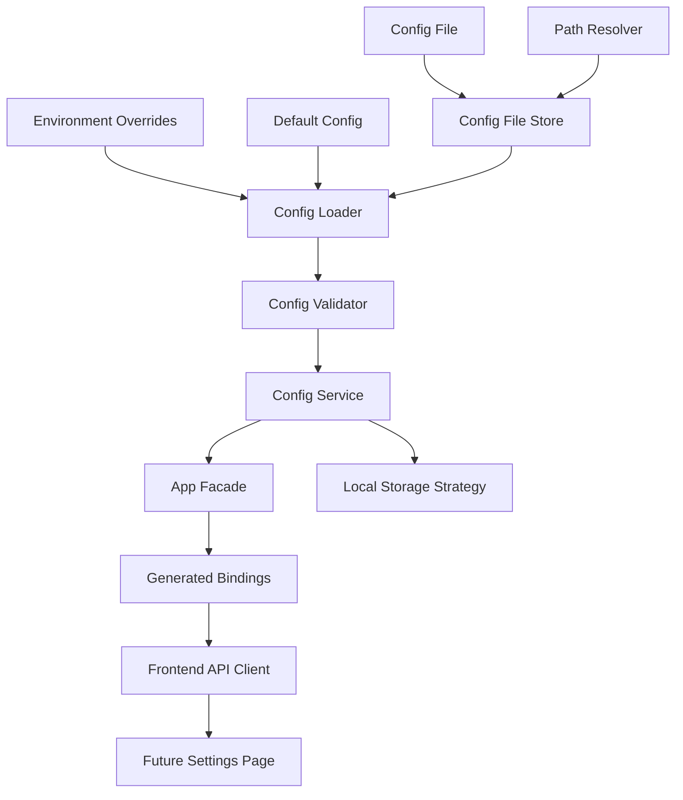
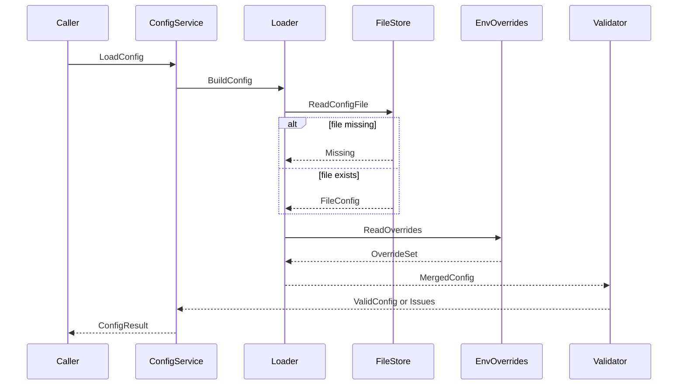
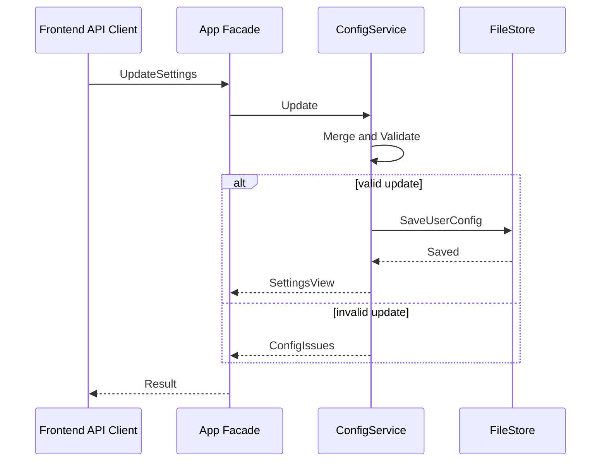

# Design Document

## Overview
本设计为 LoomiDBX 建立应用级配置系统。它接管上游工程骨架中的 `internal/config` 占位模块，提供统一配置模型、默认值、配置路径、数据目录发现、加载/保存/校验行为，以及供 Go 服务层和未来设置页复用的契约入口。

该配置系统服务于桌面应用启动、开发/测试隔离和后续本地存储策略。它不实现完整设置页面、不管理 SQLite schema、不保存数据库连接密码或 LLM API key 的最终加密方案，也不承担 Project、Schema、执行历史等业务数据持久化。

### Goals
- 建立强类型应用配置模型和可验证默认值。
- 固定默认值、配置文件、环境覆盖的加载顺序。
- 定义配置文件路径、本地数据目录发现和开发/测试隔离策略。
- 提供加载、校验、保存和前端可读设置视图契约。
- 保护普通配置、业务数据和敏感信息之间的边界。

### Non-Goals
- 不实现完整设置页、表单交互或路由页面。
- 不实现远端账号、登录注册、OAuth 或遥测发送。
- 不实现 SQLite schema、迁移、Repository 或业务数据存储。
- 不以普通配置文件保存数据库密码、令牌、LLM API key 或其他敏感凭据。
- 不连接目标数据库，不读取 Schema，不处理用户 SQL。

## Boundary Commitments

### This Spec Owns
- `AppConfig` 及相关子配置的应用级模型、默认值和可变字段边界。
- 配置文件路径和本地数据目录发现规则，包括开发/测试覆盖。
- 配置加载顺序：默认值、配置文件、环境覆盖。
- 配置校验、错误结构、来源报告和保存语义。
- Go 后端读取入口和 Wails facade 可暴露的设置读取/更新契约。
- 普通配置与敏感信息的边界声明：敏感值不写入普通配置文件。

### Out of Boundary
- 本地 SQLite 文件创建、schema、迁移、备份和 Repository 由 `phase-01-local-storage-strategy` 负责。
- 数据库连接凭据、账号 token、LLM API key 的最终安全存储策略由后续安全存储或本地存储 spec 负责。
- 完整 Settings 页面、文件选择器、账号登录、LLM 连通性测试和 UI 工作流由后续 UI/API spec 负责。
- 目标数据库 adapter、Schema introspection、生成器、执行引擎和业务服务不由本 spec 实现。
- 配置系统不得上传本地产品数据，也不得引入远端服务启动依赖。

### Allowed Dependencies
- `phase-01-project-structure` 已落地的 Go 模块、`internal/config` 目录、Wails App facade 和前端 API client 边界。
- Go 标准库中的 JSON、文件系统、路径、环境变量、时间和错误处理能力。
- 现有 `app.go` 可新增薄配置 facade 方法，但业务规则仍保留在 `internal/config` service 内。
- 前端可在 `frontend/src/api/`、`frontend/src/types/` 下新增设置契约类型和 client 包装，但不新增完整页面。

### Revalidation Triggers
- 配置文件格式、字段名、默认值或加载顺序发生破坏性变化。
- 数据目录语义被本地存储策略改写，例如 SQLite 默认文件位置不再来自配置系统。
- Wails facade 方法或前端设置 DTO 的字段形态变化。
- 敏感信息处理从占位状态变为实际安全存储写入。
- 工程骨架改变 `internal/config`、前端 API client 或 generated bindings 的目录边界。

## Architecture

### Existing Architecture Analysis
当前仓库已经包含 Wails + Go + Vue 工程骨架。`internal/config/README.md` 明确该目录由本 spec 负责默认值、环境变量、用户设置和校验。`app.go` 当前只有 `BootstrapStatus` 薄入口；前端通过 `frontend/src/api/` 封装 generated bindings。配置系统应扩展这些边界，而不是绕过它们。

### Architecture Pattern & Boundary Map



**Architecture Integration**:
- Selected pattern: 轻量配置服务。`internal/config` 内按职责拆分模型、路径、文件存储、加载、校验和服务，避免为单个配置文件提前引入重型 repository。
- Domain/feature boundaries: 配置系统只拥有应用设置和路径发现；本地业务数据、SQLite schema、目标数据库连接和敏感凭据不进入普通配置文件。
- Existing patterns preserved: Go service 承载规则，Wails facade 是薄入口，前端通过 API client 调用本地能力。
- New components rationale: `PathResolver` 解决跨环境路径，`FileStore` 负责原子读写，`Loader` 固定合成顺序，`Validator` 统一校验错误，`ConfigService` 对上提供稳定契约。
- Steering compliance: 本地桌面优先、隐私默认安全、强类型、依赖方向清晰。

**Dependency Direction**:

```text
types/defaults -> path resolver -> file store -> loader -> validator -> config service -> app facade -> generated bindings -> frontend api client
```

规则：`internal/config` 不依赖 Wails runtime、Vue、SQLite repository、目标数据库 adapter、执行引擎或生成器；facade 只调用 `ConfigService`；前端页面不直接依赖 generated bindings。

### Technology Stack

| Layer | Choice / Version | Role in Feature | Notes |
|-------|------------------|-----------------|-------|
| Backend | Go 1.25+ | 配置模型、路径、加载、校验、保存和服务契约 | 遵循 `phase-01-project-structure` 的最低 Go 版本，使用标准库能力，避免新增依赖 |
| Desktop Runtime | Wails v3 | 可选暴露设置读取/更新 facade | facade 保持薄入口 |
| Frontend | Vue 3 + TypeScript | 设置 DTO、API client 类型和未来设置页调用入口 | 不使用 `any`，不实现完整页面 |
| Data / Storage | JSON 配置文件 + 本地目录路径 | 保存普通应用配置和路径约定 | SQLite schema 和迁移延后 |

## File Structure Plan

### Directory Structure

```text
internal/
└── config/
    ├── README.md              # 更新占位说明为已定义的配置系统边界
    ├── model.go               # AppConfig、AppearanceConfig、PathConfig、DevConfig、FutureIntegrationConfig 等强类型模型
    ├── defaults.go            # 默认语言、主题、数据目录策略、未来入口占位默认值
    ├── paths.go               # PathResolver，解析配置文件路径、数据目录和测试隔离目录
    ├── env.go                 # 环境覆盖解析，输出覆盖项和来源信息
    ├── store.go               # ConfigFileStore，负责读取、缺失处理、目录创建和原子保存
    ├── loader.go              # 合成默认值、文件配置和环境覆盖
    ├── validate.go            # 枚举、路径、敏感字段和未来入口状态校验
    ├── service.go             # ConfigService，对后端和 facade 提供 Load、Get、Update、Save
    ├── dto.go                 # SettingsView、UpdateSettingsInput、ConfigError 等 facade 可用 DTO
    ├── model_test.go          # 默认值和模型序列化测试
    ├── paths_test.go          # 路径发现、覆盖和测试隔离测试
    ├── loader_test.go         # 加载顺序和缺失文件行为测试
    ├── validate_test.go       # 校验错误和敏感字段测试
    └── service_test.go        # 保存、再次加载和更新语义测试
frontend/
└── src/
    ├── api/
    │   ├── settingsClient.ts  # 封装 generated settings bindings，返回 ApiResult
    │   └── README.md          # 补充设置 API client 只能封装绑定、不承载业务规则
    └── types/
        └── settings.ts        # SettingsView、UpdateSettingsInput、ConfigIssue 等 TS DTO
frontend/
└── generated/
    └── settings.ts            # 实现阶段可加入临时或生成的 settings binding 落位
```

### Modified Files
- `app.go` — 增加配置服务组合和薄 facade 方法，例如读取设置视图、更新支持的设置项；不得在 facade 中实现配置合成或校验规则。
- `README.md` — 如需补充，只添加当前配置文件路径、数据目录和隐私边界的简短说明。
- `docs/development/commands.md` — 如需补充，只记录配置相关开发/测试覆盖变量，不改变上游命令约定。

## System Flows





## Requirements Traceability

| Requirement | Summary | Components | Interfaces | Flows |
|-------------|---------|------------|------------|-------|
| 1.1 | 无配置文件时提供默认配置 | DefaultConfig, Loader, Validator | LoadConfig | Load flow |
| 1.2 | 覆盖语言、主题、数据目录、开发选项和未来入口 | AppConfig, Defaults | AppConfig | N/A |
| 1.3 | 未来入口不暗示已完成 | FutureIntegrationConfig, Validator, SettingsView | SettingsView | N/A |
| 1.4 | 区分普通配置、业务数据和敏感凭据 | AppConfig, Validator, ConfigIssue | Validation contract | Save flow |
| 2.1 | 返回确定性配置文件路径 | PathResolver | ResolveConfigPath | Load flow |
| 2.2 | 返回确定性数据目录 | PathResolver | ResolveDataDir | Load flow |
| 2.3 | 支持有效目录覆盖 | EnvOverrides, PathResolver | OverrideSet | Load flow |
| 2.4 | 路径无效时返回校验错误 | Validator, ConfigIssue | Validation contract | Load flow |
| 3.1 | 固定加载顺序 | Loader | LoadConfig | Load flow |
| 3.2 | 缺失文件不失败 | FileStore, Loader | MissingFile state | Load flow |
| 3.3 | 无效覆盖被拒绝 | EnvOverrides, Validator | ConfigIssue | Load flow |
| 3.4 | 测试和开发隔离路径 | PathResolver, DevConfig | ResolveForMode | Load flow |
| 4.1 | 加载和保存时校验 | Validator, ConfigService | Validate, Save | Load and save flows |
| 4.2 | 错误包含字段和原因 | ConfigIssue | Error DTO | Load and save flows |
| 4.3 | 不上传本地产品数据 | ConfigService | No network contract | N/A |
| 4.4 | 敏感字段不明文保存 | Validator, SettingsView | Sensitive field policy | Save flow |
| 5.1 | 返回合成配置视图 | ConfigService, SettingsView | GetSettings | Load flow |
| 5.2 | 保存用户可变部分 | ConfigService, FileStore | UpdateSettings | Save flow |
| 5.3 | 写入失败不留下坏文件 | FileStore | Atomic save | Save flow |
| 5.4 | 保存后再次加载一致 | ConfigService, Loader | Save then Load | Save flow |
| 6.1 | Go 服务读取入口不依赖 UI | ConfigService | LoadConfig, Current | N/A |
| 6.2 | Wails facade 可暴露读取契约 | App facade, DTO | GetSettings | Save flow |
| 6.3 | 前端更新返回视图或错误 | App facade, SettingsClient | UpdateSettings | Save flow |
| 6.4 | 契约与完整页面解耦 | SettingsClient, DTO | API client contract | N/A |

## Components and Interfaces

| Component | Domain/Layer | Intent | Req Coverage | Key Dependencies | Contracts |
|-----------|--------------|--------|--------------|------------------|-----------|
| AppConfig | Backend config model | 表达普通应用配置和未来入口状态 | 1.1, 1.2, 1.3, 1.4 | Go stdlib | State |
| PathResolver | Backend config infrastructure | 解析配置文件和数据目录 | 2.1, 2.2, 2.3, 3.4 | OS env, filepath | Service |
| EnvOverrides | Backend config infrastructure | 解析环境覆盖和来源 | 2.3, 3.1, 3.3 | OS env | Service |
| ConfigFileStore | Backend config storage | 读取、缺失处理和原子保存普通配置 | 3.2, 5.2, 5.3, 5.4 | filesystem | Service |
| ConfigLoader | Backend config orchestration | 合成默认值、文件和覆盖 | 1.1, 3.1, 3.2, 5.1 | Defaults, Store, Env | Service |
| ConfigValidator | Backend config validation | 校验枚举、路径、未来入口和敏感字段 | 2.4, 4.1, 4.2, 4.4 | AppConfig | Service |
| ConfigService | Backend service | 对后端和 facade 提供读取更新入口 | 5.1, 5.2, 5.4, 6.1 | Loader, Validator, Store | Service |
| SettingsFacade Methods | Wails boundary | 暴露设置读取更新薄入口 | 6.2, 6.3 | ConfigService | API |
| SettingsClient | Frontend API client | 封装 generated bindings 和错误转换 | 6.3, 6.4 | Generated bindings | API |

### Backend Config

#### AppConfig

| Field | Detail |
|-------|--------|
| Intent | 定义应用配置的权威结构 |
| Requirements | 1.1, 1.2, 1.3, 1.4 |

**Responsibilities & Constraints**
- 包含 `appearance`、`paths`、`development`、`integrations`、`privacy` 等应用级设置。
- 只保存普通配置；业务数据和敏感凭据只通过状态或引用表达。
- 默认语言建议为 `zh`，主题支持 `light`、`dark`、`system`，未来入口默认 `enabled: false` 或 `configured: false`。

**Contracts**: Service [ ] / API [ ] / Event [ ] / Batch [ ] / State [x]

##### State Model
- `AppearanceConfig`: `language`、`theme`。
- `PathConfig`: `dataDir`、`configFile` 的解析结果或用户覆盖值。
- `DevelopmentConfig`: `mode`、`useIsolatedDataDir`、`diagnosticsEnabled`。
- `FutureIntegrationConfig`: 账号、LLM 等入口的 `enabled`、`configured`、`status`，不包含明文 secret。

#### PathResolver

| Field | Detail |
|-------|--------|
| Intent | 为桌面运行、开发和测试返回确定性路径 |
| Requirements | 2.1, 2.2, 2.3, 3.4 |

**Responsibilities & Constraints**
- 解析默认配置文件路径和默认数据目录。
- 接受开发/测试覆盖并保证路径关系可解释。
- 不创建 SQLite 文件，不执行数据库迁移。

**Contracts**: Service [x] / API [ ] / Event [ ] / Batch [ ] / State [ ]

##### Service Interface
```go
type PathResolver interface {
    Resolve(input PathResolveInput) (ResolvedPaths, []ConfigIssue)
}
```
- Preconditions: 输入包含应用名称、运行模式和可选覆盖值。
- Postconditions: 成功时返回绝对路径；失败时返回字段级 issue。
- Invariants: 测试模式不得落入真实用户配置目录。

#### ConfigFileStore

| Field | Detail |
|-------|--------|
| Intent | 管理普通配置文件读取和原子保存 |
| Requirements | 3.2, 5.2, 5.3, 5.4 |

**Responsibilities & Constraints**
- 读取 JSON 配置文件；文件不存在时返回 missing 状态。
- 保存前确保父目录存在。
- 使用临时文件加替换方式降低半写入风险。
- 不写入环境覆盖值和敏感明文。

**Contracts**: Service [x] / API [ ] / Event [ ] / Batch [ ] / State [ ]

##### Service Interface
```go
type ConfigFileStore interface {
    Read(path string) (FileConfig, FileState, error)
    Save(path string, config UserConfig) error
}
```
- Preconditions: `path` 是已校验的绝对路径。
- Postconditions: 保存成功后配置文件可被再次解析。
- Invariants: 失败时不得留下无法解析的目标配置文件。

#### ConfigService

| Field | Detail |
|-------|--------|
| Intent | 提供后端统一配置入口 |
| Requirements | 4.1, 5.1, 5.2, 5.4, 6.1 |

**Responsibilities & Constraints**
- 对外提供加载当前配置、读取设置视图、应用更新和保存。
- 合并更新时保留未修改字段的当前值或默认值。
- 返回结构化错误，不吞掉路径、校验或保存失败。

**Contracts**: Service [x] / API [ ] / Event [ ] / Batch [ ] / State [x]

##### Service Interface
```go
type Service interface {
    Load() (LoadResult, error)
    Current() (SettingsView, error)
    Update(input UpdateSettingsInput) (SettingsView, []ConfigIssue, error)
}
```
- Preconditions: service 已配置 resolver、store 和 validator。
- Postconditions: `Current` 返回合成且已校验视图；`Update` 成功后文件可再次加载。
- Invariants: 不触发网络访问，不读取目标数据库，不写入敏感明文。

### Bridge and Frontend

#### SettingsFacade Methods

| Field | Detail |
|-------|--------|
| Intent | 为前端暴露最小设置读取和更新入口 |
| Requirements | 6.2, 6.3 |

**Responsibilities & Constraints**
- 调用 `ConfigService` 并返回 DTO 或错误。
- 不在 facade 中实现路径解析、加载合成或校验。
- 不暴露完整设置页面或远端账号能力。

**Contracts**: Service [ ] / API [x] / Event [ ] / Batch [ ] / State [ ]

##### API Contract
| Method | Request | Response | Errors |
|--------|---------|----------|--------|
| `GetSettings` | none | `SettingsView` | `CONFIG_INVALID`, `INTERNAL_ERROR` |
| `UpdateSettings` | `UpdateSettingsInput` | `SettingsView` | `VALIDATION_FAILED`, `CONFIG_WRITE_FAILED`, `INTERNAL_ERROR` |

#### SettingsClient

| Field | Detail |
|-------|--------|
| Intent | 为未来设置页封装 generated bindings |
| Requirements | 6.3, 6.4 |

**Responsibilities & Constraints**
- 只处理调用包装和错误转换。
- 使用精确 TypeScript 类型，不使用 `any`。
- 不包含设置表单逻辑、账号登录逻辑或 LLM 测试逻辑。

**Contracts**: Service [ ] / API [x] / Event [ ] / Batch [ ] / State [ ]

##### API Contract
```typescript
interface SettingsClient {
  getSettings(): Promise<ApiResult<SettingsView>>;
  updateSettings(input: UpdateSettingsInput): Promise<ApiResult<SettingsView>>;
}
```

## Data Models

### Domain Model
配置系统没有业务聚合根。`AppConfig` 是应用级配置状态，`SettingsView` 是前端可读视图，`UserConfig` 是可持久化用户可变部分，`ConfigIssue` 是校验和保存错误的统一表达。

### Logical Data Model

| Entity | Key Fields | Notes |
|--------|------------|-------|
| `AppConfig` | `appearance`, `paths`, `development`, `integrations`, `privacy` | 合成后的完整配置，不直接等同文件内容 |
| `UserConfig` | 用户可变字段 | 保存到普通配置文件，不包含环境覆盖和敏感明文 |
| `SettingsView` | `appearance`, `paths`, `development`, `integrations`, `privacy` | facade 和前端读取使用，隐藏内部来源细节；`paths.dataDir` 与 `development.mode` 是本地存储策略的精确消费字段 |
| `ConfigIssue` | `path`, `code`, `message`, `severity` | 用于字段级错误展示和测试断言 |

### Physical Data Model
普通配置文件使用 JSON。设计约束如下：
- 文件只保存用户可变普通配置。
- 缺省值不必完整写入文件；加载时由默认值补齐。
- 环境覆盖不自动写回文件。
- 保存过程使用临时文件和替换目标文件，避免半写入。
- 敏感字段不得以明文出现在普通配置文件中。

### Data Contracts & Integration

**SettingsView TypeScript DTO**:

| Field | Type | Required | Description |
|-------|------|----------|-------------|
| `appearance.theme` | `"light" | "dark" | "system"` | Yes | 当前主题 |
| `appearance.language` | `"zh" | "en"` | Yes | 当前语言 |
| `paths.dataDir` | `string` | Yes | 已解析的数据目录 |
| `paths.configFile` | `string` | Yes | 已解析的配置文件路径 |
| `development.mode` | `"desktop" | "development" | "test"` | Yes | 当前运行模式 |
| `integrations.account.status` | `"unavailable" | "not_configured" | "configured"` | Yes | 未来账号入口状态 |
| `integrations.llm.configured` | `boolean` | Yes | 是否存在后续安全存储记录 |

**Storage Integration Contract**: `phase-01-local-storage-strategy` 只消费 `SettingsView.paths.dataDir` 与 `SettingsView.development.mode` 来构造 `StorageConfig.DataDir` 和 `StorageConfig.Mode`。本地存储不得重复读取配置文件、环境变量或重新解析用户目录。

## Error Handling

### Error Strategy
- 配置文件缺失是正常状态，返回默认配置和来源信息。
- 配置文件 JSON 无法解析、枚举非法、路径不可用或敏感字段出现在普通配置中，返回 `ConfigIssue`。
- 保存失败返回可展示错误，并保留原配置文件可解析。
- facade 将配置错误转换为稳定错误码，前端 API client 再转换为 `ApiResult`。

### Error Categories and Responses

| Category | Example | Response |
|----------|---------|----------|
| Missing File | 首次启动没有配置文件 | 使用默认配置，标记来源为 default |
| Invalid Value | `theme` 为未知值 | 返回 `VALIDATION_FAILED` 和字段路径 |
| Invalid Path | 数据目录不可写 | 返回 `CONFIG_PATH_INVALID` |
| Sensitive Plaintext | 普通配置中出现 API key | 返回 `SENSITIVE_VALUE_NOT_ALLOWED` |
| Write Failure | 磁盘不可写或替换失败 | 返回 `CONFIG_WRITE_FAILED`，保留原文件 |

### Monitoring
本 spec 不引入日志平台。实现可在错误中保留开发者可读原因，但不得记录敏感值。运行时遥测和远端上报不属于本 spec。

## Testing Strategy

### Unit Tests
- 默认配置测试：无配置文件时返回完整默认值，覆盖语言、主题、路径、开发模式和未来入口状态。
- 路径解析测试：默认路径、环境覆盖、测试隔离目录和非法路径均有确定结果。
- 加载顺序测试：配置文件值覆盖默认值，环境覆盖覆盖文件值，环境覆盖不写回文件。
- 校验测试：枚举非法、路径不可用、未来入口状态非法和敏感明文字段均返回字段级 issue。
- 保存测试：有效更新持久化，写入失败不破坏原文件，保存后再次加载结果一致。

### Integration Tests
- `App` facade 调用 `ConfigService` 获取 `SettingsView`，并确认 facade 中没有配置合成逻辑。
- 前端 `settingsClient` 使用 mock binding 返回成功视图或错误分支，页面层可后续复用 `ApiResult`。
- 配置输出的数据目录可被本地存储策略测试替身读取，但不创建 SQLite schema。

### E2E/UI Tests
- 本 spec 不交付完整 UI。可选 smoke 验证只确认前端 API client 和 DTO 编译通过，不要求设置页存在。

### Deferred
- Settings 页面表单、文件选择器、LLM 连通性测试、账号设置、SQLite 迁移和安全凭据存储延后到相邻或后续 spec。

## Security Considerations

- 配置系统不进行网络上传，不依赖远端服务启动。
- 普通配置文件不得包含数据库密码、账号 token、LLM API key、Schema、生成规则、Project 配置、生成数据或用户 SQL。
- 设置视图可以返回 `configured` 布尔状态，但不能返回明文 secret。
- 错误信息不得包含敏感输入原值。

## Performance & Scalability

配置文件较小，性能目标是桌面启动路径可预测。加载只执行本地文件和环境变量读取；不访问网络、不连接数据库、不执行迁移。保存应只写普通配置文件，不触发业务数据扫描。

## Migration Strategy

当前没有既有配置文件迁移要求。若未来配置 schema 版本变化，应在 `AppConfig` 中增加版本字段并由 loader 做向后兼容读取；破坏性迁移需要重新验证本 spec 和本地存储策略。
