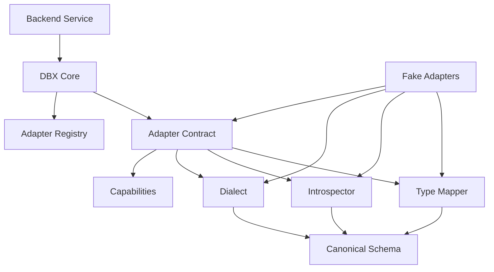
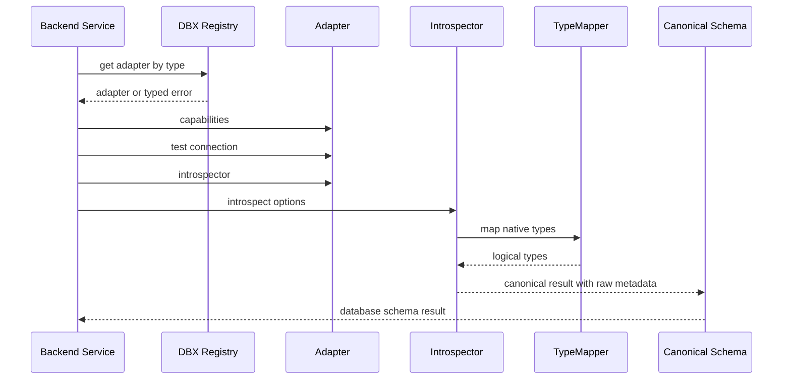

# Design Document

## Overview

本设计为 LoomiDBX Go 后端建立数据库方言抽象的最小接口集合。它面向后续服务层、Schema 扫描、写入计划和测试实现者，提供统一 Adapter 入口、能力模型、连接配置、Schema 扫描结果、类型映射、SQL 方言原语、registry 和 fake 测试替身。

当前仓库已经由 `phase-01-project-structure` 建立 Wails + Go + Vue3 骨架，并在 `internal/dbx/` 下预留数据库兼容目录。本 spec 将这些占位目录推进为可编译的接口和值对象，但不引入真实数据库驱动、不执行 SQL、不实现完整 MySQL/PostgreSQL introspection。

### Goals
- 定义 Adapter、Dialect、Introspector、TypeMapper、Capabilities 的最小 Go 契约。
- 定义连接配置、连接测试结果、canonical schema、逻辑类型、native type 和 batch insert 方言请求。
- 提供 deterministic fake/mock 支持，让后续服务层无需真实数据库即可测试能力协商和调用路径。
- 保持 MySQL/PostgreSQL 优先验证方向，并为其他数据库保留扩展空间。

### Non-Goals
- 不实现真实 MySQL、PostgreSQL 或其他数据库 adapter。
- 不实现真实数据库连接池、Schema 扫描 SQL、批量写入执行器、事务编排或执行引擎。
- 不实现完整 canonical schema 产品模型、Schema API、UI 连接页面或 Project/生成规则能力。
- 不引入 ORM、跨数据库迁移工具、COPY/LOAD DATA/upsert 自动化或容器集成测试。

## Boundary Commitments

### This Spec Owns
- `internal/dbx/` 下数据库方言抽象的接口和值对象。
- 数据库能力模型和运行时能力查询边界。
- canonical schema 的接口级结构，包含原始类型、逻辑类型和 Raw 元数据保留。
- Dialect 的标识符引用、占位符和 batch insert statement 构建契约。
- Adapter registry、typed errors 和 fake 测试替身。

### Out of Boundary
- 真实数据库驱动依赖、连接建立细节和凭据安全存储。
- 数据库特定 introspection SQL、真实类型映射完整矩阵和真实 SQL 执行。
- 完整写入计划、依赖拓扑排序、事务策略、执行历史和错误持久化。
- Wails facade、前端 API、连接管理 UI 和 schema-introspection API。
- phase roadmap 或 steering 文件更新。

### Allowed Dependencies
- `phase-01-project-structure` 已建立的 Go 模块和 `internal/dbx/` 目录。
- Go 标准库：`context`、`database/sql`、`errors`、`fmt`、`sync`、`testing`。
- 项目内 `internal/dbx/*` 子包之间的稳定类型依赖。
- 不新增外部数据库驱动或第三方 SQL builder。

### Revalidation Triggers
- Adapter、Dialect、Introspector、TypeMapper 或 Capabilities 的公开方法签名变化。
- Canonical schema 字段命名、Raw 元数据类型或逻辑类型枚举变化。
- Registry 错误语义或 fake 测试替身行为变化。
- 后续真实 MySQL/PostgreSQL adapter 发现当前接口无法表达必要能力。
- `phase-01-project-structure` 改变 `internal/dbx/` 目录边界或 Go 最低版本。

## Architecture

### Existing Architecture Analysis

当前源码已经存在 `internal/dbx/README.md` 及 `adapter`、`dialect`、`introspect`、`typex`、`capability` 子目录 README，均声明为占位。上游设计要求后端保持分层：domain 不依赖 Wails 或数据库驱动，adapter 封装外部差异，业务层通过能力而不是数据库类型硬编码做决策。

本 feature 属于 extension：它把占位目录升级为可编译抽象。由于没有真实数据库实现，本设计不需要外部技术调研或新依赖。

### Architecture Pattern & Boundary Map



**Architecture Integration**:
- Selected pattern: Ports and adapters style inside `internal/dbx/`。业务层依赖接口，数据库差异留在 adapter/dialect/introspect/typex/capability 边界。
- Domain/feature boundaries: 本 spec 只定义接口和测试替身，不引入真实 adapter 子包。
- Existing patterns preserved: Go 后端分层、DBX 目录落位、能力协商优先、隐私默认本地。
- New components rationale: `core` 聚合 DB type、config、registry 和 adapter contract；`schema` 承载 canonical schema；`fakes` 支持无数据库测试。
- Steering compliance: 强类型接口、无第三方重依赖、无真实敏感数据、业务层避免硬编码数据库类型。

**Dependency Direction**:

```text
capability, schema -> typex, dialect, introspect -> core adapter -> registry -> fakes/tests -> services
```

规则：`schema` 不依赖 adapter、dialect 或具体数据库；`typex`、`dialect`、`introspect` 可以依赖 `schema`；`core` 可以聚合这些接口；`fakes` 可以依赖所有公开接口用于测试；业务服务只依赖 `core` 和必要的读取接口。

### Technology Stack

| Layer | Choice / Version | Role in Feature | Notes |
|-------|------------------|-----------------|-------|
| Backend | Go 1.25+ | 定义接口、值对象、fake 和单元测试 | 遵循 `phase-01-project-structure` 的最低 Go 版本 |
| Data / Storage | None | 不持久化业务数据 | 不新增 migration 或 SQLite schema |
| Database Driver | None | 当前不连接真实数据库 | 后续 MySQL/PostgreSQL spec 再引入 |
| Testing | Go `testing` | 验证 registry、capabilities、fake、dialect、type mapper | 不依赖网络和凭据 |

## File Structure Plan

### Directory Structure

```text
internal/dbx/
├── README.md                         # 更新 DBX 抽象范围、非目标和下游扩展说明
├── core/
│   ├── adapter.go                    # Adapter 接口、DBType、连接配置、连接测试契约
│   ├── registry.go                   # 内存 adapter registry 与 unsupported error
│   ├── errors.go                     # typed DBX errors 和错误分类
│   └── registry_test.go              # registry 成功、重复注册和缺失 adapter 测试
├── capability/
│   ├── capabilities.go               # Capabilities 值对象和能力约束字段
│   └── README.md                     # 从占位说明更新为能力模型说明
├── schema/
│   ├── logical_type.go               # LogicalKind、LogicalType 和类型属性
│   ├── model.go                      # Database、Namespace、Table、Column、View
│   └── constraints.go                # PrimaryKey、ForeignKey、Unique、Check、Index
├── dialect/
│   ├── dialect.go                    # Dialect 接口、InsertRequest、Statement、Operation
│   ├── dialect_test.go               # fake dialect contract 测试
│   └── README.md                     # 方言边界说明
├── introspect/
│   ├── introspector.go               # Introspector 接口和 Options
│   └── README.md                     # 扫描边界说明
├── typex/
│   ├── mapper.go                     # NativeType、MappingOptions、Mapper 接口
│   ├── mapper_test.go                # fake mapper 和 unknown fallback 测试
│   └── README.md                     # 类型映射边界说明
└── fakes/
    ├── adapter.go                    # 可配置 fake Adapter 和 call tracking
    ├── dialect.go                    # 可配置 fake Dialect
    ├── introspector.go               # deterministic fake Introspector
    ├── mapper.go                     # deterministic fake Mapper
    └── fake_test.go                  # fake 组合测试
```

### Modified Files
- `internal/dbx/README.md` — 将占位说明更新为本阶段已定义的接口范围和仍未实现的真实数据库范围。
- `internal/dbx/adapter/README.md` — 保留为数据库实现包落位说明，指向 `core.Adapter`。
- `internal/dbx/dialect/README.md` — 说明方言原语边界和非执行职责。
- `internal/dbx/introspect/README.md` — 说明 Introspector 输出 canonical schema，不读取凭据存储。
- `internal/dbx/typex/README.md` — 说明 type mapper 可独立测试。
- `internal/dbx/capability/README.md` — 说明能力模型是业务层运行时协商依据。

## System Flows



关键决策：连接测试、能力查询和扫描入口都通过 Adapter 暴露；业务层可以在 fake adapter 上验证相同流程。

## Requirements Traceability

| Requirement | Summary | Components | Interfaces | Flows |
|-------------|---------|------------|------------|-------|
| 1.1 | 稳定数据库类型和 adapter metadata | CoreAdapter, DBType | Adapter contract | Adapter lookup |
| 1.2 | 单一 adapter 入口取得能力、方言、扫描器、mapper | CoreAdapter | Adapter contract | Adapter lookup |
| 1.3 | 连接测试契约 | CoreAdapter, DBXErrors | TestConnection | Adapter flow |
| 1.4 | unsupported database typed error | AdapterRegistry, DBXErrors | Registry Get | Adapter lookup |
| 2.1 | 能力模型字段 | Capabilities | Capabilities value object | N/A |
| 2.2 | capability-first 策略 | Capabilities, CoreAdapter | Capabilities | Adapter flow |
| 2.3 | 不可用或受限能力表达 | Capabilities | Capability flags and limits | N/A |
| 2.4 | MySQL/PostgreSQL 优先差异可见 | DBXDocs, Capabilities | README matrix notes | N/A |
| 3.1 | canonical schema 覆盖核心对象 | SchemaModel | Database schema objects | Introspection flow |
| 3.2 | Column 字段和 Raw 保留 | SchemaModel, LogicalType | Column contract | Introspection flow |
| 3.3 | 未标准化元数据 Raw 保留 | SchemaModel | Raw metadata fields | Introspection flow |
| 3.4 | 不声明高级特性完整覆盖 | DBXDocs, SchemaModel | README scope | N/A |
| 4.1 | native type 映射到 logical type | TypeMapper, LogicalType | Mapper ToLogical | Introspection flow |
| 4.2 | unknown 或 fallback 映射 | TypeMapper, LogicalType | Mapping result | Type mapping tests |
| 4.3 | mapping options 边界 | TypeMapper | MappingOptions | Type mapping tests |
| 4.4 | mapper 与数据库连接分离 | TypeMapper | Mapper contract | Type mapping tests |
| 5.1 | identifier quoting | Dialect | QuoteIdentifier | Dialect tests |
| 5.2 | placeholders | Dialect | Placeholder | Dialect tests |
| 5.3 | batch insert request and statement | Dialect | BuildInsert | Dialect tests |
| 5.4 | typed dialect error | Dialect, DBXErrors | Unsupported operation error | Dialect tests |
| 5.5 | 执行和高级写入非目标 | DBXDocs, Dialect | README scope | N/A |
| 6.1 | fake adapter/dialect/introspector/mapper | Fakes | Fake contracts | Fake flow |
| 6.2 | in-memory registry | AdapterRegistry | Register, Get | Registry tests |
| 6.3 | deterministic fake schema | FakeIntrospector | Introspect | Fake flow |
| 6.4 | fake failure and call assertions | Fakes | Configured failures | Fake tests |
| 7.1 | 不需要真实敏感数据 | Fakes, DBXDocs | Test-only data | Fake flow |
| 7.2 | sample 标注 test-only | Fakes, DBXDocs | README scope | N/A |
| 7.3 | 复用 `internal/dbx/` 边界 | File Structure Plan | Directory contract | N/A |
| 7.4 | 下游 spec 范围声明 | DBXDocs | README scope | N/A |

## Components and Interfaces

| Component | Domain/Layer | Intent | Req Coverage | Key Dependencies (P0/P1) | Contracts |
|-----------|--------------|--------|--------------|--------------------------|-----------|
| CoreAdapter | DBX Core | 聚合数据库类型、连接配置、能力和子接口 | 1.1, 1.2, 1.3, 2.2 | Capabilities P0, Dialect P0, Introspector P0, TypeMapper P0 | Service |
| AdapterRegistry | DBX Core | 注册和查找 adapter | 1.4, 6.2 | CoreAdapter P0, DBXErrors P0 | Service |
| Capabilities | Capability | 表达数据库运行时能力 | 2.1, 2.2, 2.3, 2.4 | None | State |
| SchemaModel | Schema | 表达 canonical schema 和 raw metadata | 3.1, 3.2, 3.3, 3.4 | LogicalType P0 | State |
| TypeMapper | Typex | 将 native type 转换为 logical type | 4.1, 4.2, 4.3, 4.4 | SchemaModel P0 | Service |
| Dialect | Dialect | 提供 SQL 方言原语和 batch insert statement contract | 5.1, 5.2, 5.3, 5.4, 5.5 | SchemaModel P1, DBXErrors P0 | Service |
| Introspector | Introspect | 扫描元数据并输出 canonical schema | 3.1, 3.2, 3.3, 4.4 | SchemaModel P0, TypeMapper P1 | Service |
| Fakes | Testing | 提供无数据库测试替身 | 6.1, 6.3, 6.4, 7.1, 7.2 | All DBX contracts P0 | Service, State |
| DBXDocs | Documentation | 说明接口范围、非目标和下游扩展 | 2.4, 3.4, 5.5, 7.2, 7.3, 7.4 | Steering P1 | State |

### DBX Core

#### CoreAdapter

| Field | Detail |
|-------|--------|
| Intent | 作为每种数据库能力的统一入口 |
| Requirements | 1.1, 1.2, 1.3, 2.2 |

**Responsibilities & Constraints**
- 暴露数据库类型、显示名称和能力。
- 暴露连接测试、Dialect、Introspector 和 TypeMapper。
- 连接配置允许 DSN 和 options 扩展，但不负责凭据持久化。
- 不直接实现业务服务、Wails binding、执行引擎或 UI。

**Dependencies**
- Inbound: 后续 backend service — 通过接口使用数据库能力 (P0)
- Outbound: Capabilities — 能力查询 (P0)
- Outbound: Dialect, Introspector, TypeMapper — 子接口 (P0)
- External: `database/sql` — 仅作为可选连接参数边界 (P1)

**Contracts**: Service [x] / API [ ] / Event [ ] / Batch [ ] / State [ ]

##### Service Interface
```go
type DBType string

type Adapter interface {
    Type() DBType
    DisplayName() string
    Capabilities() capability.Capabilities
    TestConnection(ctx context.Context, cfg ConnectionConfig) ConnectionTestResult
    Dialect() dialect.Dialect
    Introspector() introspect.Introspector
    TypeMapper() typex.Mapper
}

type ConnectionConfig struct {
    Type     DBType
    Host     string
    Port     int
    Database string
    Schema   string
    Username string
    Password string
    DSN      string
    Options  map[string]string
}

type ConnectionTestResult struct {
    OK      bool
    Message string
    Err     error
}
```
- Preconditions: Adapter 已注册或由测试直接构造。
- Postconditions: 返回稳定子接口或 typed failure。
- Invariants: Adapter contract 不保存凭据，不上传数据，不要求真实驱动存在。

**Implementation Notes**
- Integration: `Password` 只存在于调用时配置，不能写入 README、测试 fixture 或日志。
- Validation: 单元测试使用 fake adapter 断言方法可被后续服务按统一入口调用。
- Risks: 若后续真实 adapter 需要连接句柄，应新增窄接口或 option，而不是让业务层直接依赖 driver。

#### AdapterRegistry

| Field | Detail |
|-------|--------|
| Intent | 提供内存 adapter 注册和查找 |
| Requirements | 1.4, 6.2 |

**Responsibilities & Constraints**
- 按 `DBType` 注册 adapter。
- 查找不存在的 adapter 时返回 typed unsupported error。
- 支持测试隔离，每个 registry 实例持有自己的 adapter map。

**Dependencies**
- Inbound: 后续 service 和 tests — 注册或查找 adapter (P0)
- Outbound: CoreAdapter — 读取 Type (P0)
- Outbound: DBXErrors — 构造 typed error (P0)

**Contracts**: Service [x] / API [ ] / Event [ ] / Batch [ ] / State [ ]

##### Service Interface
```go
type Registry interface {
    Register(adapter Adapter) error
    Get(dbType DBType) (Adapter, error)
    List() []AdapterInfo
}
```
- Preconditions: `adapter != nil` 且 `adapter.Type()` 非空。
- Postconditions: 已注册 adapter 可被 `Get` 返回。
- Invariants: 缺失 adapter 不返回 nil error；重复注册行为必须 deterministic。

### Capability and Schema

#### Capabilities

| Field | Detail |
|-------|--------|
| Intent | 表达数据库能力和限制，作为业务层运行时协商依据 |
| Requirements | 2.1, 2.2, 2.3, 2.4 |

**Responsibilities & Constraints**
- 覆盖事务、保存点、外键、延迟约束、批量插入、bulk load、RETURNING、upsert、catalog/schema、JSON、array、UUID、enum、generated/identity column、identifier length。
- 支持布尔能力和少量限制值，例如最大参数数、最大批量行数。
- 文档中说明 MySQL/PostgreSQL 首期优先验证，但不声明真实支持已完成。

**Contracts**: Service [ ] / API [ ] / Event [ ] / Batch [ ] / State [x]

##### State Management
- State model: 不可变值对象，由 adapter 返回。
- Persistence & consistency: 不持久化。
- Concurrency strategy: 调用方视为只读。

#### SchemaModel

| Field | Detail |
|-------|--------|
| Intent | 提供 canonical schema 的接口级结构 |
| Requirements | 3.1, 3.2, 3.3, 3.4 |

**Responsibilities & Constraints**
- 表达 Database、Namespace、Table、View、Column、PrimaryKey、ForeignKey、UniqueConstraint、CheckConstraint 和 Index。
- Column 保留 `NativeType`、`LogicalType`、nullable、default、length、precision、scale、ordinal、primary/unique/auto increment/generated/identity、comment 和 Raw。
- Raw 用于诊断和数据库扩展，不作为业务主路径替代标准字段。
- 当前不声明高级数据库特性完整覆盖。

**Contracts**: Service [ ] / API [ ] / Event [ ] / Batch [ ] / State [x]

### Dialect, Introspection and Type Mapping

#### Dialect

| Field | Detail |
|-------|--------|
| Intent | 封装 SQL 表达差异，但不执行 SQL |
| Requirements | 5.1, 5.2, 5.3, 5.4, 5.5 |

**Responsibilities & Constraints**
- 引用标识符。
- 根据参数索引返回占位符。
- 根据 batch insert request 返回 SQL statement 和 args。
- 对不支持操作返回 typed dialect error。
- 不执行 SQL、不管理事务、不保存写入结果。

**Contracts**: Service [x] / API [ ] / Event [ ] / Batch [x] / State [ ]

##### Service Interface
```go
type Dialect interface {
    QuoteIdentifier(name string) string
    Placeholder(index int) string
    BuildInsert(req InsertRequest) ([]Statement, error)
}

type InsertRequest struct {
    Schema  string
    Table   string
    Columns []schema.Column
    Rows    []map[string]any
}

type Statement struct {
    SQL  string
    Args []any
}
```

##### Batch / Job Contract
- Trigger: 后续 writer 或 service 请求构建 insert statement。
- Input / validation: schema、table、columns、rows。
- Output / destination: 一条或多条 statement，仅包含 SQL 文本和参数。
- Idempotency & recovery: 构建过程无副作用；失败返回 typed error。

#### Introspector

| Field | Detail |
|-------|--------|
| Intent | 定义从数据库元数据到 canonical schema 的扫描边界 |
| Requirements | 3.1, 3.2, 3.3, 4.4 |

**Contracts**: Service [x] / API [ ] / Event [ ] / Batch [ ] / State [ ]

##### Service Interface
```go
type Introspector interface {
    Introspect(ctx context.Context, conn Connection, opts Options) (*schema.Database, error)
}

type Connection interface {
    QueryContext(ctx context.Context, query string, args ...any) (Rows, error)
}

type Rows interface {
    Close() error
    Err() error
    Next() bool
    Scan(dest ...any) error
}

type Options struct {
    Catalog string
    Schema  string
    Tables  []string
}
```
- Preconditions: 调用方提供满足窄 `Connection` 契约的连接边界或 fake connection；本 spec 不要求 `*sql.DB`、`*sql.Conn` 或真实驱动。
- Postconditions: 返回 canonical schema 或 typed error。
- Invariants: `Connection` 只表达 introspection 查询所需的最小行为；Introspector 输出标准字段并保留 Raw；类型转换委托 TypeMapper。

#### TypeMapper

| Field | Detail |
|-------|--------|
| Intent | 将 native type 映射为 logical type |
| Requirements | 4.1, 4.2, 4.3, 4.4 |

**Contracts**: Service [x] / API [ ] / Event [ ] / Batch [ ] / State [ ]

##### Service Interface
```go
type Mapper interface {
    ToLogical(native NativeType, opts MappingOptions) schema.LogicalType
}

type NativeType struct {
    Name      string
    Full      string
    Length    *int64
    Precision *int
    Scale     *int
    Nullable  bool
    Raw       map[string]any
}
```
- Preconditions: Native type 至少包含 Name 或 Full。
- Postconditions: 返回 logical type，无法识别时保留 native type。
- Invariants: Mapper 不打开数据库连接。

### Testing and Documentation

#### Fakes

| Field | Detail |
|-------|--------|
| Intent | 支持后续服务层无数据库测试 |
| Requirements | 6.1, 6.3, 6.4, 7.1, 7.2 |

**Responsibilities & Constraints**
- fake adapter 可配置 capabilities、dialect、introspector、mapper、连接测试结果和错误。
- fake introspector 返回 deterministic schema。
- fake dialect 可返回固定 statement 或 unsupported error。
- fake 记录调用次数或最后一次输入，方便测试断言。
- 包名和 README 明确 test-only，不作为生产数据库支持。

**Contracts**: Service [x] / API [ ] / Event [ ] / Batch [ ] / State [x]

#### DBXDocs

| Field | Detail |
|-------|--------|
| Intent | 记录接口范围、下游边界和隐私约束 |
| Requirements | 2.4, 3.4, 5.5, 7.2, 7.3, 7.4 |

**Responsibilities & Constraints**
- 更新 `internal/dbx/` 及子目录 README。
- 声明当前可用的是接口、值对象和 fake，不是真实数据库支持。
- 指向后续真实 adapter、Schema API、writer adapter、execution engine 和 UI spec。

## Data Models

### Domain Model

本 spec 不引入产品业务聚合。DBX 模型是基础设施契约和值对象：

- `DBType`：目标数据库类型标识。
- `Capabilities`：能力协商值对象。
- `ConnectionConfig`：连接配置传入边界，不负责持久化。
- `schema.Database`：canonical schema 根对象。
- `schema.LogicalType`：逻辑类型值对象。
- `dialect.Statement`：待执行 SQL statement 描述，不负责执行。

### Logical Data Model

**Structure Definition**:
- Database 包含多个 Namespace。
- Namespace 包含 Tables 和 Views。
- Table 包含 Columns、PrimaryKey、ForeignKeys、UniqueConstraints、CheckConstraints 和 Indexes。
- Column 引用 LogicalType，并保留 NativeType 和 Raw。
- Constraint 和 Index 保留名称、列集合和 Raw。

**Consistency & Integrity**:
- Schema 结果是 introspection 的快照，不由本 spec 持久化。
- `Raw` 字段只能用于诊断和未来 adapter 增强，不应成为上层策略的主判断依据。

### Data Contracts & Integration

本 spec 的数据传输发生在 Go 包内部，不定义 Wails DTO 或 HTTP API。后续 service/facade spec 可以把这些 Go 类型转换成前端 DTO。

## Error Handling

### Error Strategy

- 使用 typed errors 区分 unsupported database、duplicate adapter、nil adapter、invalid connection config、unsupported dialect operation、introspection failed、type mapping failed。
- 错误信息包含数据库类型、操作名、schema/table/column 等非敏感上下文。
- 不在错误中输出 password、DSN 中的敏感片段或 SQL 参数值。

### Error Categories and Responses

| Category | Example | Response |
|----------|---------|----------|
| Unsupported Database | registry 找不到 adapter | 返回 typed unsupported error |
| Invalid Adapter | 注册 nil adapter 或空 DBType | 返回 validation error |
| Dialect Unsupported | 请求当前 dialect 不支持的 insert form | 返回 unsupported operation error |
| Introspection Failure | 元数据扫描失败 | 包装阶段和对象上下文，保留底层 error |
| Fake Configured Failure | 测试配置失败路径 | 返回测试指定 error，记录调用 |

### Monitoring

本 spec 不引入日志或可观测性平台。后续服务层可根据 typed errors 记录日志，但不得输出敏感连接信息。

## Testing Strategy

### Unit Tests
- Registry：注册成功、缺失 adapter、nil adapter、重复注册行为 deterministic。
- Capabilities：默认值和 MySQL/PostgreSQL 示例能力 fixture 不声明真实 adapter 可用。
- SchemaModel：Column 保留 NativeType、LogicalType 和 Raw metadata。
- TypeMapper fake：已知 native type、unknown fallback 和 options 行为可重复。
- Dialect fake：identifier quote、placeholder、BuildInsert 成功和 unsupported error。

### Integration Tests
- Fake adapter 组合测试：registry 查找 fake adapter 后，服务式调用 capabilities、connection test、introspect、type mapper、dialect statement 构建。
- Boundary tests：fake 不打开网络连接、不要求真实凭据。
- Import direction tests：schema 包不依赖 core/dialect/introspect/typex，业务外部只通过 core/fakes 测试入口组合。

### E2E/UI Tests

不适用。本 spec 不触达 Wails binding 或前端 UI。

### Deferred
- 真实 MySQL/PostgreSQL introspection golden tests。
- 容器化数据库集成测试。
- 执行引擎、writer adapter、事务和写入结果验证。

## Security Considerations

- `ConnectionConfig` 可能携带敏感字段，但本 spec 不持久化、不打印、不上传。
- Fake fixtures 不包含真实凭据、真实 Schema 或用户 SQL。
- Typed errors 和 README 必须提示不要泄露 DSN password、SQL 参数值或连接 secret。
- Raw metadata 可能包含数据库特有信息，后续对外 API 暴露前需要重新评估隐私边界。

## Performance & Scalability

当前接口和值对象没有业务性能目标。设计约束为：

- Registry 查找为内存 map，适合单进程桌面应用。
- Schema 结果不在本 spec 中缓存或持久化。
- Dialect BuildInsert 只定义契约，批量大小、参数上限和性能策略由后续 writer/adapter spec 基于 Capabilities 决定。

## Migration Strategy

当前 `internal/dbx/` 只有 README 占位，迁移策略是新增 Go 包和测试，并更新 README 范围说明。若实现时发现上游骨架目录命名与本设计不同，应保留 DBX 边界语义，并在 README 中记录实际映射。
