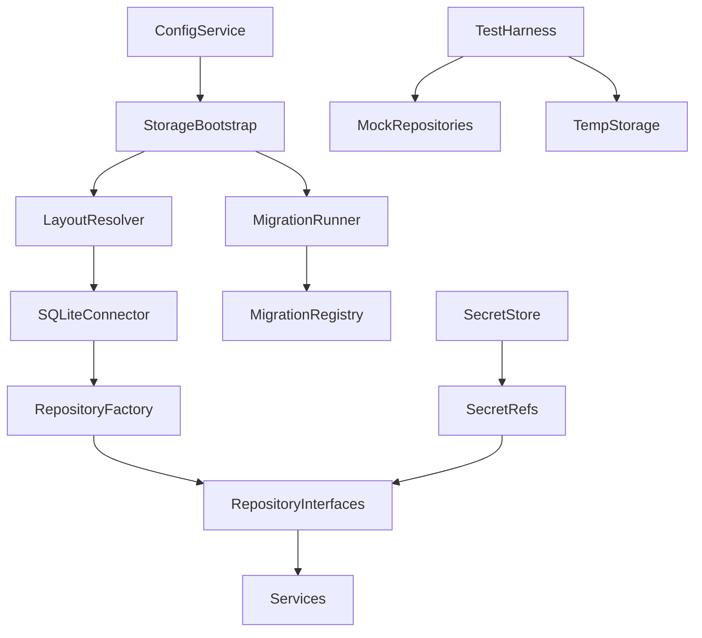
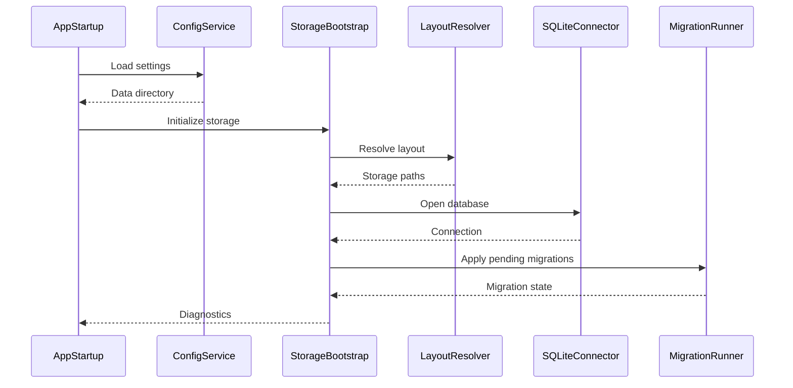
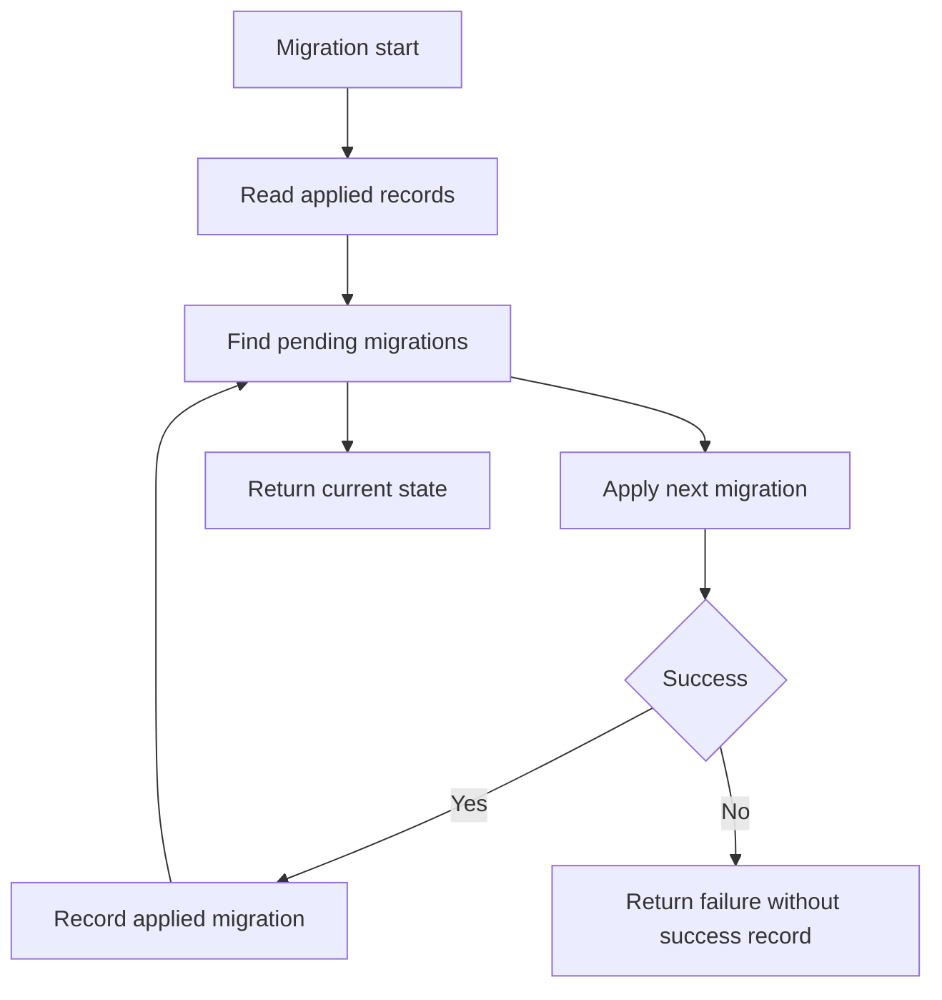
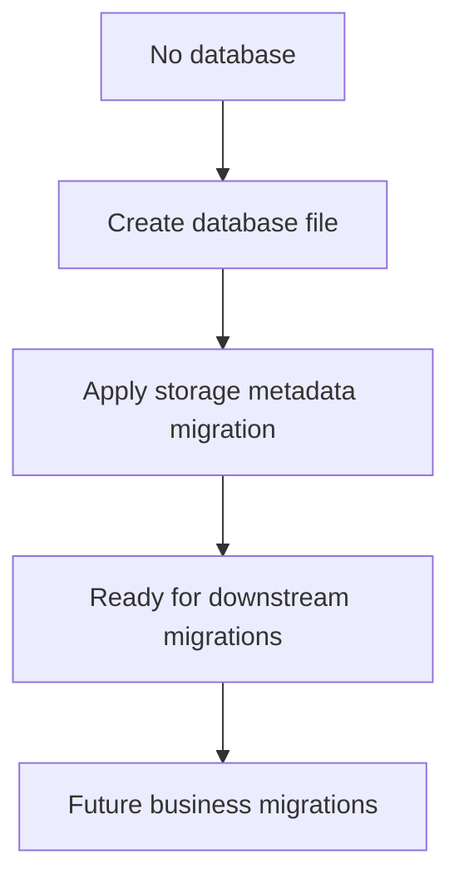

# Design Document

## Overview
本设计为 LoomiDBX 建立本地存储策略和最小基础设施。它接管工程骨架中的 `internal/storage` 与 `internal/repository` 占位，基于配置系统提供的数据目录，定义本地文件布局、SQLite 初始化、迁移执行、Repository 边界、测试替身和敏感信息隔离策略。

本规格服务于后续连接模型、Schema 模型、Project、执行历史和 API 服务层。实现完成后，项目应具备可初始化、可诊断、可测试的本地存储底座；但它不提前实现完整业务表、业务仓储或安全凭据存储。

### Goals
- 固定普通配置、结构化业务数据和敏感信息的职责分工。
- 基于配置系统数据目录建立本地 SQLite 文件布局和初始化入口。
- 提供迁移命名、排序、记录和失败处理约定。
- 明确 Repository 接口、SQLite 实现和 mock/内存替身的落位。
- 保护连接凭据和本地产品数据的隐私边界。

### Non-Goals
- 不实现连接、Schema、字段规则、Project 或执行历史的完整业务表。
- 不实现所有 Repository 或完整服务层用例。
- 不实现账号、授权、云同步、遥测上传或 UI 设置页。
- 不实现目标数据库写入、Schema 扫描或生成执行引擎。
- 不实现平台级 keychain、加密文件或凭据生命周期。

## Boundary Commitments

### This Spec Owns
- 本地存储根目录下的文件布局和目录创建规则。
- SQLite 主业务数据文件的打开、关闭、基础连接参数和初始化诊断。
- 迁移文件目录、迁移记录表、迁移排序和失败语义。
- Repository 接口落位、SQLite 实现落位和测试替身约定。
- 敏感信息只通过 secret store 接口和凭据引用表达的边界。
- 存储初始化入口、诊断视图和稳定错误码。

### Out of Boundary
- `phase-01-config-system` 继续拥有配置文件路径、数据目录发现和普通应用配置保存。
- 业务模型规格拥有连接、Schema、字段规则、Project 和执行历史的具体字段、索引和 Repository 方法。
- 安全存储后续规格拥有真实凭据加密、keychain 集成、轮换和删除。
- API/UI 规格拥有 Wails facade 方法、前端页面和用户交互。
- 数据库方言规格拥有目标数据库连接、扫描和写入差异。

### Allowed Dependencies
- `phase-01-project-structure` 的 Go 模块、`internal/storage`、`internal/repository` 和测试目录约定。
- `phase-01-config-system` 的已解析数据目录和开发/测试隔离模式。
- Go 标准库的文件系统、路径、时间、错误和上下文能力。
- SQLite 驱动或等价本地 SQLite 连接能力，具体依赖在实现阶段固定。
- 后续服务层只能通过 repository 或 storage service 契约使用本地存储。

### Revalidation Triggers
- 配置系统改变数据目录字段、隔离模式或路径解析语义。
- SQLite 驱动、迁移记录格式或迁移排序规则发生破坏性变化。
- Repository 接口从 `internal/repository` 移出或服务层开始直接管理 SQLite 连接。
- Secret store 从接口占位变为真实安全存储实现。
- 任一后续规格需要新增业务表、改变隐私边界或引入远端同步。

## Architecture

### Existing Architecture Analysis
当前仓库已有 Wails + Go + Vue 工程骨架，`internal/storage/README.md` 声明本目录由后续 spec 实现本地数据目录、SQLite、文件存储、迁移和备份策略；`internal/repository/README.md` 声明仓储接口和本地持久化访问边界由后续 spec 定义。配置系统设计已经定义 `PathResolver`、`ConfigService`、`SettingsView.paths.dataDir` 和 `SettingsView.development.mode`，本地存储应复用这两个精确字段构造 `StorageConfig`，而不是重复读取环境变量或硬编码用户目录。

### Architecture Pattern & Boundary Map



**Architecture Integration**:
- Selected pattern: 配置驱动的本地存储内核 + repository port。配置系统提供路径，storage 管理文件和迁移，service 通过 repository 接口访问数据。
- Domain/feature boundaries: 当前只拥有基础设施和边界契约；业务表、业务查询和业务规则由后续模型/API 规格实现。
- Existing patterns preserved: Go service/domain 层拥有业务规则，Wails facade 是薄入口，前端不直接触碰本地存储。
- New components rationale: `StorageBootstrap` 统一初始化，`LayoutResolver` 固定布局，`MigrationRunner` 管理演进，`RepositoryFactory` 聚合具体实现，`SecretStore` 防止明文凭据扩散。
- Steering compliance: 本地优先、隐私默认安全、强类型接口、单向依赖。

**Dependency Direction**:

```text
config result -> storage layout -> sqlite connector -> migration runner -> repository implementations -> services -> facade -> frontend api client
```

规则：`internal/storage` 不依赖 Wails、Vue、目标数据库 adapter、生成引擎或业务 UI；`internal/repository` 只暴露服务层可依赖的接口和测试替身；业务服务不得直接打开 SQLite 文件或自行执行迁移。

### Technology Stack

| Layer | Choice / Version | Role in Feature | Notes |
|-------|------------------|-----------------|-------|
| Backend | Go | 存储初始化、迁移、repository 契约和测试 | 使用显式类型和结构化错误 |
| Data / Storage | SQLite + 配置文件分工 | SQLite 保存结构化本地业务数据，配置文件保存轻量设置 | 具体驱动由实现阶段固定 |
| Security | SecretStore 接口占位 | 表达凭据引用和不可用状态 | 不实现真实加密或 keychain |
| Infrastructure / Runtime | 配置系统数据目录 | 提供存储根目录和开发/测试隔离 | storage 不重复解析路径 |

## File Structure Plan

### Directory Structure

```text
internal/
├── storage/
│   ├── README.md                 # 更新为本地存储策略、布局和非目标说明
│   ├── config.go                 # StorageConfig、ResolvedStoragePaths、StorageDiagnostics
│   ├── layout.go                 # 根据配置系统数据目录解析 sqlite、migration、tmp、backup 路径
│   ├── bootstrap.go              # 初始化目录、打开连接、执行迁移并返回诊断视图
│   ├── sqlite.go                 # SQLite 连接生命周期、基础 pragma 和关闭语义
│   ├── errors.go                 # 稳定错误码、脱敏错误和未迁移错误
│   ├── secrets.go                # SecretStore、SecretRef、不可用实现和脱敏规则
│   ├── migration/
│   │   ├── runner.go             # 迁移排序、事务执行、成功记录和失败返回
│   │   ├── registry.go           # 嵌入或注册迁移的最小机制
│   │   ├── record.go             # migration 记录结构和基础迁移表契约
│   │   └── migrations/
│   │       └── 000001_storage_metadata.sql # 仅创建迁移记录等基础结构
│   └── storage_test.go           # 布局、初始化、迁移失败和敏感错误单元测试
├── repository/
│   ├── README.md                 # 更新 repository 接口、实现和替身边界
│   ├── unit_of_work.go           # 事务或工作单元最小契约
│   ├── factory.go                # RepositoryFactory 最小聚合入口
│   ├── errors.go                 # 未实现、未迁移、冲突等 repository 错误
│   └── mock/
│       ├── README.md             # mock/内存替身使用规则
│       └── storage.go            # 测试替身基础结构，不伪造完整业务能力
└── config/
    └── README.md                 # 不由本 spec 修改，作为上游路径契约来源
```

### Modified Files
- `internal/storage/README.md` — 从占位说明更新为本规格拥有的布局、初始化、迁移和隐私边界。
- `internal/repository/README.md` — 从占位说明更新为接口、实现、工作单元和测试替身边界。
- `docs/architecture/project-structure.md` — 如实现需要补充，只添加 storage/repository 的落位说明；本规格任务默认不要求修改。

## System Flows





关键决策：初始化流程必须先获得配置系统的数据目录；迁移失败不能写入成功记录；诊断视图只暴露路径、状态和错误码，不包含敏感值。

## Requirements Traceability

| Requirement | Summary | Components | Interfaces | Flows |
|-------------|---------|------------|------------|-------|
| 1.1 | 明确配置、业务数据和敏感信息分工 | StoragePolicy, SecretStore | README, StorageConfig | N/A |
| 1.2 | 结构化业务数据归类 | StoragePolicy | Data classification | N/A |
| 1.3 | 轻量设置归属配置系统 | StoragePolicy, LayoutResolver | Config dependency | Init flow |
| 1.4 | 凭据排除明文存储 | SecretStore, RepositoryGuidelines | SecretRef | N/A |
| 2.1 | 数据目录来自配置系统 | StorageBootstrap, LayoutResolver | StorageConfig | Init flow |
| 2.2 | 定义文件布局 | LayoutResolver | ResolvedStoragePaths | Init flow |
| 2.3 | 开发测试隔离 | LayoutResolver, TempStorage | StorageConfig | Init flow |
| 2.4 | 目录异常可诊断 | StorageErrors | StorageError | Init flow |
| 3.1 | 首次初始化创建目录和数据文件 | StorageBootstrap, SQLiteConnector | Initialize | Init flow |
| 3.2 | 只应用待执行迁移 | MigrationRunner | MigrationRegistry | Migration flow |
| 3.3 | 迁移失败不记成功 | MigrationRunner, StorageErrors | MigrationResult | Migration flow |
| 3.4 | 迁移命名和记录规则 | MigrationRegistry | MigrationRecord | Migration flow |
| 4.1 | Repository 接口与实现分离 | RepositoryInterfaces, RepositoryFactory | Repository contracts | N/A |
| 4.2 | 工作单元边界 | UnitOfWork | Transaction contract | N/A |
| 4.3 | mock/内存替身策略 | MockRepositories | Test double contract | N/A |
| 4.4 | 未实现或未迁移明确错误 | RepositoryErrors | RepositoryError | N/A |
| 5.1 | 不上传本地产品数据 | StoragePolicy | No network contract | N/A |
| 5.2 | 凭据状态用引用表达 | SecretRef, RepositoryGuidelines | SecretRef | N/A |
| 5.3 | 安全存储不可用状态 | SecretStore | UnavailableSecretStore | N/A |
| 5.4 | 错误和日志脱敏 | StorageErrors, SecretStore | Redacted errors | N/A |
| 6.1 | 非 UI 初始化入口 | StorageBootstrap | Initialize | Init flow |
| 6.2 | 返回诊断视图 | StorageDiagnostics | Diagnostics DTO | Init flow |
| 6.3 | 稳定错误码 | StorageErrors | Error codes | Init flow |
| 6.4 | 测试策略覆盖基础能力 | StorageTests, RepositoryMocks | Test harness | Migration flow |

## Components and Interfaces

| Component | Domain/Layer | Intent | Req Coverage | Key Dependencies | Contracts |
|-----------|--------------|--------|--------------|------------------|-----------|
| StoragePolicy | Backend storage | 记录本地数据分类和隐私边界 | 1.1, 1.2, 1.3, 5.1 | Steering (P0), config spec (P0) | State |
| LayoutResolver | Backend storage | 解析数据目录下的稳定文件布局 | 2.1, 2.2, 2.3, 2.4 | ConfigService output (P0), filesystem (P0) | Service |
| StorageBootstrap | Backend storage | 初始化目录、连接和迁移并返回诊断 | 3.1, 6.1, 6.2, 6.3 | LayoutResolver (P0), SQLiteConnector (P0), MigrationRunner (P0) | Service |
| SQLiteConnector | Backend storage | 管理本地 SQLite 连接生命周期 | 3.1, 6.3 | SQLite driver (P0) | Service |
| MigrationRunner | Backend storage | 执行有序迁移并记录状态 | 3.2, 3.3, 3.4 | SQLiteConnector (P0), MigrationRegistry (P0) | Batch, State |
| RepositoryContracts | Backend repository | 定义服务层访问本地数据的接口边界 | 4.1, 4.2, 4.4 | StorageBootstrap (P0) | Service |
| MockRepositories | Backend repository test | 为服务层提供测试替身策略 | 4.3, 6.4 | RepositoryContracts (P0) | Service, State |
| SecretStoreBoundary | Backend security | 表达凭据引用、不可用状态和脱敏规则 | 1.4, 5.2, 5.3, 5.4 | StoragePolicy (P0) | Service, State |

### Storage

#### StoragePolicy

| Field | Detail |
|-------|--------|
| Intent | 定义本地数据分类和不得跨越的隐私边界 |
| Requirements | 1.1, 1.2, 1.3, 5.1 |

**Responsibilities & Constraints**
- 普通配置：主题、语言、数据目录、开发/测试选项，继续归配置系统。
- 结构化本地业务数据：连接元数据、Schema 缓存、字段规则、Project 配置、执行历史，进入 SQLite 或后续明确的本地结构化存储。
- 敏感信息：数据库密码、token、密钥，只能通过 `SecretStoreBoundary` 和引用表达。
- 不提供任何网络上传路径。

**Contracts**: Service [ ] / API [ ] / Event [ ] / Batch [ ] / State [x]

##### State Management
- State model: Markdown 边界说明、分类常量或类型枚举。
- Persistence & consistency: 分类说明应与配置系统和后续业务迁移保持一致。
- Concurrency strategy: 无运行时共享状态。

#### LayoutResolver

| Field | Detail |
|-------|--------|
| Intent | 从配置系统数据目录解析本地存储布局 |
| Requirements | 2.1, 2.2, 2.3, 2.4 |

**Responsibilities & Constraints**
- 接收已解析数据目录，不自行推导用户目录。
- 输出主 SQLite 文件、迁移目录、临时目录、备份或导出预留目录。
- 校验路径绝对性、可创建性和可写性。
- 测试模式必须支持临时隔离目录。

**Contracts**: Service [x] / API [ ] / Event [ ] / Batch [ ] / State [ ]

##### Service Interface
```go
type StorageConfig struct {
    DataDir string
    Mode    string
}

type ResolvedStoragePaths struct {
    RootDir string
    DatabaseFile string
    MigrationDir string
    TempDir string
    BackupDir string
}

type LayoutResolver interface {
    Resolve(ctx context.Context, config StorageConfig) (ResolvedStoragePaths, error)
}
```
- Preconditions: `DataDir` 来自 `SettingsView.paths.dataDir`，`Mode` 来自 `SettingsView.development.mode`；二者均已由配置系统解析和校验。
- Postconditions: 返回绝对路径或结构化错误。
- Invariants: 不读取或写入业务数据。

#### StorageBootstrap

| Field | Detail |
|-------|--------|
| Intent | 提供非 UI 的本地存储初始化入口 |
| Requirements | 3.1, 6.1, 6.2, 6.3 |

**Responsibilities & Constraints**
- 创建目录布局。
- 打开 SQLite 连接并执行基础连接设置。
- 调用迁移 runner。
- 返回诊断视图，不包含敏感值。

**Contracts**: Service [x] / API [ ] / Event [ ] / Batch [ ] / State [ ]

##### Service Interface
```go
type StorageDiagnostics struct {
    DataDir string
    DatabaseFile string
    MigrationVersion string
    PendingMigrations int
    Ready bool
}

type Bootstrapper interface {
    Initialize(ctx context.Context, config StorageConfig) (StorageDiagnostics, error)
}
```
- Preconditions: 配置系统已成功加载或返回可用默认数据目录。
- Postconditions: 成功时本地存储可供 repository 工厂使用。
- Invariants: 初始化不得创建完整业务表。

#### MigrationRunner

| Field | Detail |
|-------|--------|
| Intent | 管理基础迁移执行和状态记录 |
| Requirements | 3.2, 3.3, 3.4, 6.4 |

**Responsibilities & Constraints**
- 迁移命名采用递增编号加语义名，例如 `000001_storage_metadata.sql`。
- 迁移按编号排序，只执行尚未成功记录的项。
- 每个迁移成功后记录版本、名称、校验信息和执行时间。
- 失败时返回错误，不写成功记录。

**Contracts**: Service [ ] / API [ ] / Event [ ] / Batch [x] / State [x]

##### Batch / Job Contract
- Trigger: `StorageBootstrap.Initialize` 调用。
- Input / validation: SQLite 连接、迁移注册表、已应用迁移记录。
- Output / destination: 更新迁移记录表和 `StorageDiagnostics`。
- Idempotency & recovery: 已记录成功的迁移不会重复执行；失败迁移可在修复后重试。

### Repository

#### RepositoryContracts

| Field | Detail |
|-------|--------|
| Intent | 为服务层定义稳定的本地数据访问边界 |
| Requirements | 4.1, 4.2, 4.4 |

**Responsibilities & Constraints**
- `internal/repository` 放接口和错误，不放 UI 或 Wails 绑定。
- SQLite 实现通过工厂或构造入口聚合。
- 工作单元负责事务边界，服务层不直接管理底层连接。
- 未实现业务 Repository 返回明确错误。

**Contracts**: Service [x] / API [ ] / Event [ ] / Batch [ ] / State [ ]

##### Service Interface
```go
type UnitOfWork interface {
    Do(ctx context.Context, fn func(ctx context.Context, repos Repositories) error) error
}

type Repositories interface {
    StorageDiagnostics(ctx context.Context) (storage.StorageDiagnostics, error)
}
```
- Preconditions: 存储已初始化。
- Postconditions: 服务层通过接口访问本地数据能力。
- Invariants: Repository 不上传数据，不泄露敏感明文。

#### MockRepositories

| Field | Detail |
|-------|--------|
| Intent | 为服务层单元测试提供受控替身 |
| Requirements | 4.3, 6.4 |

**Responsibilities & Constraints**
- 提供 mock 或内存实现规则。
- 替身必须遵守真实接口的错误语义。
- 不声明后续业务 Repository 已经完成。

**Contracts**: Service [x] / API [ ] / Event [ ] / Batch [ ] / State [x]

### Security

#### SecretStoreBoundary

| Field | Detail |
|-------|--------|
| Intent | 防止数据库凭据进入普通配置或普通业务表明文 |
| Requirements | 1.4, 5.2, 5.3, 5.4 |

**Responsibilities & Constraints**
- 定义 `SecretRef`，业务表只能保存引用或配置状态。
- 默认实现返回不可用状态。
- 错误和日志只包含脱敏字段名和错误码。
- 不实现加密算法或平台 keychain。

**Contracts**: Service [x] / API [ ] / Event [ ] / Batch [ ] / State [x]

##### Service Interface
```go
type SecretRef struct {
    Provider string
    Key string
}

type SecretStore interface {
    Available(ctx context.Context) bool
    Get(ctx context.Context, ref SecretRef) (SecretValue, error)
    Put(ctx context.Context, ref SecretRef, value SecretValue) error
    Delete(ctx context.Context, ref SecretRef) error
}
```
- Preconditions: 后续安全存储实现已注入；当前默认实现可不可用。
- Postconditions: 明文只在调用边界内短暂存在，不能写入普通配置或普通业务表。
- Invariants: 错误不得包含 `SecretValue` 原文。

## Data Models

### Domain Model
本规格不定义业务领域实体。它只定义本地存储基础状态：
- `StorageConfig`: 从配置系统传入的存储启动配置，只包含 `DataDir` 和 `Mode`，分别映射自 `SettingsView.paths.dataDir` 与 `SettingsView.development.mode`。
- `ResolvedStoragePaths`: 数据目录内的物理路径结果。
- `StorageDiagnostics`: 初始化和迁移状态视图。
- `MigrationRecord`: 已应用迁移记录。
- `SecretRef`: 凭据引用，不是凭据内容。

### Logical Data Model

| Entity | Key Fields | Notes |
|--------|------------|-------|
| `MigrationRecord` | `version`, `name`, `checksum`, `appliedAt` | 基础迁移记录；业务迁移复用 |
| `StorageDiagnostics` | `dataDir`, `databaseFile`, `migrationVersion`, `pendingMigrations`, `ready` | 面向服务层和测试的诊断视图 |
| `SecretRef` | `provider`, `key` | 可持久化引用，不包含明文 |

### Physical Data Model
当前 SQLite 只要求基础迁移记录结构。业务表由后续规格添加迁移。

| Table | Purpose | Required Columns |
|-------|---------|------------------|
| `schema_migrations` | 记录成功应用的迁移 | `version`, `name`, `checksum`, `applied_at` |

主业务数据文件建议命名为 `loomidbx.db`，位于配置系统数据目录下；迁移 SQL 位于 `internal/storage/migration/migrations/`。实现如需调整文件名，必须保留“配置目录下单一主业务 SQLite 文件”的语义并更新诊断视图。

## Error Handling

### Error Strategy
- 路径错误在布局解析阶段失败，返回字段、错误码和脱敏原因。
- SQLite 打开失败返回 `STORAGE_OPEN_FAILED`。
- 迁移失败返回 `STORAGE_MIGRATION_FAILED`，且不写成功记录。
- 未实现业务 Repository 返回 `REPOSITORY_NOT_IMPLEMENTED`。
- secret store 不可用返回 `SECRET_STORE_UNAVAILABLE`，不降级为明文存储。

### Error Categories and Responses

| Category | Example | Response |
|----------|---------|----------|
| Path Invalid | 数据目录不可写 | 返回 `STORAGE_PATH_INVALID` 和路径字段 |
| Open Failed | SQLite 文件无法打开 | 返回 `STORAGE_OPEN_FAILED` |
| Migration Failed | SQL 执行失败 | 返回 `STORAGE_MIGRATION_FAILED`，保留失败迁移未应用状态 |
| Repository Missing | 后续业务仓储未实现 | 返回 `REPOSITORY_NOT_IMPLEMENTED` |
| Secret Unavailable | 默认 secret store 被调用 | 返回 `SECRET_STORE_UNAVAILABLE` |

### Monitoring
本规格不引入日志平台。实现可提供本地诊断视图和脱敏错误；不得记录数据库密码、token、用户 SQL 或生成数据内容。

## Testing Strategy

### Unit Tests
- 布局解析测试：配置系统数据目录映射到主数据库、迁移、临时和备份目录。
- 初始化测试：临时数据目录中创建目录、打开 SQLite 并返回 ready 诊断。
- 迁移测试：只执行待迁移项，成功记录版本，失败不记录成功。
- 错误脱敏测试：路径、迁移和 secret 错误不包含明文敏感值。
- Repository 替身测试：mock 遵守未实现和诊断接口的错误语义。

### Integration Tests
- 使用测试隔离目录完成初始化、迁移和重新初始化，确认迁移幂等。
- 将 storage bootstrap 输出注入 repository factory，确认服务层可通过接口读取诊断。
- 使用默认不可用 secret store，确认连接凭据调用返回不可用而非明文降级。

### E2E/UI Tests
本规格不交付 UI。无需浏览器或 Wails 页面级 E2E；后续设置页和连接页规格可基于诊断契约补充 UI 测试。

## Security Considerations

- 本地存储不上传连接信息、Schema、字段规则、Project、生成数据或用户 SQL。
- 连接密码和 token 不进入普通配置文件或普通业务表明文。
- `SecretRef` 可持久化，`SecretValue` 不可持久化到普通存储。
- 错误、诊断和迁移记录不得包含敏感原文。

## Performance & Scalability

Phase 1 只要求启动路径稳定和迁移幂等。初始化应只访问本地文件系统和 SQLite，不连接目标数据库、不扫描 Schema、不执行网络请求。后续高容量 Schema 缓存、执行历史分页和索引策略由对应业务模型规格定义。

## Migration Strategy



当前仓库没有既有本地业务数据库迁移要求。首个迁移只建立迁移记录基础结构；后续业务规格追加迁移时必须遵守编号、排序、校验和失败记录规则。
