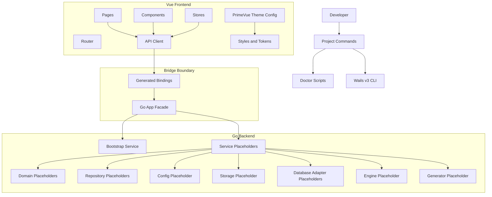
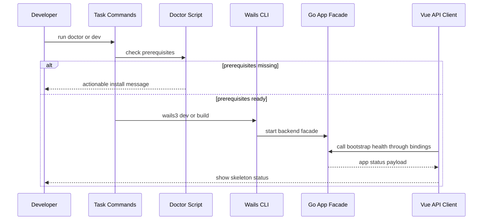

# Design Document

## Overview

本设计为 LoomiDBX 建立 Wails v3 + Go + Vue3 的 greenfield 工程骨架。它的价值不是交付完整业务功能，而是把桌面应用运行入口、后端分层、前端模块、Wails 桥接、样式基础设施、生成绑定、文档与测试入口放到稳定位置，让后续 spec 能按既定边界增量实现。

该骨架服务于开发者和后续规格实现者。实现完成后，仓库应具备可识别的桌面应用结构、最小 bootstrap/health 调用样例、清晰的前后端调用封装和命令入口；当本机缺少 Go、Node/npm 或 Wails v3 CLI 时，命令应给出可执行的诊断提示，而不是不明原因失败。

### Goals
- 建立 Wails v3 桌面应用骨架和最小可验证样例。
- 明确后端 domain、service、repository、adapter、config、storage、dbx、engine、generator 与 bridge facade 的落位边界。
- 明确前端 pages、components、stores、router、api client、types、styles 与 PrimeVue styled mode 主题定制的落位边界，并为后续 unstyled mode 迁移保留说明位置。
- 提供基础 setup、doctor、dev、build、format、lint、test 或 placeholder 验证入口，并标注哪些能力延后到相邻 spec。

### Non-Goals
- 不实现完整配置系统、本地存储策略或迁移体系。
- 不连接真实数据库，不扫描 Schema，不实现数据库方言行为。
- 不实现生成执行引擎、生成器注册表或任何生成数据逻辑。
- 不实现完整业务页面、登录、Project、Schema 管理或设置工作流。
- 不引入 AI 生成能力、远端账号交互、完整数据库操作或用户 SQL 执行。

## Boundary Commitments

### This Spec Owns
- 仓库级应用骨架：根目录配置、Wails v3 项目入口、Go 模块、前端工程、生成绑定落位、文档和基础命令入口。
- 最小 bootstrap/health 能力：用于证明 Go 后端、Wails bridge、Vue 前端属于同一应用骨架。
- 后端与前端的目录命名、依赖方向和 placeholder 约定。
- Wails bridge 边界：Go App Facade 是前端可见入口，前端 API client 是页面调用本地能力的唯一入口。
- PrimeVue styled mode 的集成落位：当前使用官方 Aura preset 起步，集中管理 theme preset、design tokens、dark mode selector、cssLayer 选项、global styles 和 utility classes，并记录后续 unstyled mode 迁移边界。
- 开发者验证边界：setup/doctor/dev/build/format/lint/test 命令清单及缺少前置工具时的提示策略。
- 隐私与非目标说明：骨架阶段不要求真实数据库凭据、Schema、生成数据、Project 配置或远端账号数据。

### Out of Boundary
- `phase-01-config-system` 负责完整配置加载、默认值、环境变量、用户设置持久化和配置校验。
- `phase-01-local-storage-strategy` 负责本地数据目录、SQLite 或文件存储策略、迁移和备份策略。
- `phase-01-database-dialect-interface` 负责真实数据库 adapter、dialect、introspection、type mapping 和 capability 接口实现。
- `phase-01-test-tooling` 负责完整测试框架选型、覆盖率、CI、契约测试和 E2E 自动化。
- 后续 Phase 负责领域模型、Schema 扫描、Project、生成引擎、生成器、API 资源和业务 UI 页面。
- 本 spec 不上传、不读取、不模拟真实用户数据库数据，也不实现远端账号或遥测。

### Allowed Dependencies
- 官方 Wails v3 CLI 与运行时：`wails3`、Go 1.25+、平台 WebView 依赖。
- Vue 3、TypeScript、Vite 作为前端基础栈。
- PrimeVue styled mode 与官方 Aura preset 作为当前 UI 组件基础设施；允许通过 `@primeuix/themes` 的 design token 和 `definePreset` 做轻量定制。
- Node/npm 类前端工具链；具体包管理器由实现阶段确定并在命令文档中固定。
- 标准 Go 工具链：`go test`、`go fmt`、`go vet` 或等价入口。
- 项目内现有 `docs/` 规划文档、`.kiro/specs/` spec 和 agent 指南。

### Revalidation Triggers
- Wails v3 CLI 或生成绑定目录结构发生变化。
- Go 最低版本、Node/npm 要求或平台依赖发生变化。
- 前端调用后端的依赖方向改变，例如页面直接依赖 generated bindings。
- Go App Facade 开始承载复杂业务规则，而不是薄入口。
- PrimeVue 从当前 styled mode + Aura preset 改为完全 unstyled mode、其他 preset 或其他 UI 库。
- 相邻 spec 改变配置、本地存储、数据库方言或测试工具链的根目录边界。
- 骨架加入真实数据库凭据、Schema、生成数据、用户 SQL 或远端账号数据依赖。

## Architecture

### Existing Architecture Analysis

当前仓库没有应用源码、`go.mod`、前端 `package.json` 或 Wails 配置。已有内容主要是产品规划、Phase 文档、spec 与 agent 指南。因此本设计按 greenfield 处理，但需要遵守以下已有路线：

- Phase 1 先建立工程骨架和基础架构，不进入业务能力实现。
- `docs/api-contract.md` 建议 Wails 形态采用 Frontend API Client → Wails generated bindings → Go App Facade → Service 的边界。
- `docs/database-dialect-abstraction-design.md` 建议未来数据库差异下沉到 Adapter、Dialect、Introspector、TypeMapper 和 Capabilities。
- 产品隐私边界要求数据库连接、Schema、生成配置、Project 配置、生成数据和用户 SQL 默认留在本地。

### Architecture Pattern & Boundary Map



**Architecture Integration**:
- Selected pattern: Wails Facade + layered backend + frontend API client。它匹配桌面应用形态，并防止页面、生成绑定和业务服务混在一起。
- Domain/feature boundaries: 骨架只拥有目录、最小 bootstrap 能力和调用边界；相邻业务 spec 在预留目录内扩展。
- Existing patterns preserved: Phase 文档中的分阶段、传输无关 API 契约、数据库方言抽象与隐私默认安全原则。
- New components rationale: `BootstrapService` 和 `AppFacade` 仅用于验证应用闭环；`api/` 封装 generated bindings；placeholder 目录为后续 spec 提供稳定落位。
- Steering compliance: 采用边界优先、强类型、依赖方向明确、占位能力不冒充业务实现的设计。

**Dependency Direction**:

```text
shared types/config constants → domain → repository/adapter interfaces → services → app facade → generated bindings → frontend api client → stores/pages/components
```

规则：每层只能依赖左侧或同层的稳定类型，不允许后端依赖前端，不允许 domain 依赖 service、Wails runtime 或数据库驱动，不允许页面直接依赖 generated bindings。

### Technology Stack

| Layer | Choice / Version | Role in Feature | Notes |
|-------|------------------|-----------------|-------|
| Desktop Runtime | Wails v3 CLI `wails3` | 创建、启动、构建桌面应用 | 按用户要求采用 v3；安装与诊断参考官方 `wails3 doctor` |
| Backend | Go 1.25+ | 后端入口、Facade、service 与 placeholder 包 | Wails v3 官方安装文档要求 Go 1.25+ |
| Frontend | Vue 3 + TypeScript + Vite | 前端 bootstrap 页面、路由、状态、API client 与样式落位 | 禁止 TypeScript `any`；generated bindings 经 API client 包装 |
| UI Library | PrimeVue styled mode + Aura preset | 提供当前阶段可用的组件视觉基础和主题 token 定制能力 | 使用 `@primeuix/themes/aura` 与 `definePreset` 轻量定制；完全 unstyled mode 延后评估 |
| Data / Storage | Placeholder only | 为后续本地存储和数据库适配预留目录 | 本 spec 不定义 schema、不连接数据库 |
| Testing | Go test + frontend lint/typecheck/test placeholders | 验证骨架和最小 bootstrap 合约 | 完整测试工具链由 `phase-01-test-tooling` 完成 |
| Infrastructure / Runtime | scripts + docs + Wails platform prerequisites | 提供 setup/doctor/dev/build/format/lint/test 命令入口 | 缺少工具时输出可执行安装提示 |

## File Structure Plan

### Directory Structure

```text
loomidbx-v2/
├── README.md                         # 项目启动、前置工具、命令清单、隐私与范围说明
├── go.mod                            # Go 模块定义，声明 Wails v3 相关依赖
├── main.go                           # 桌面应用进程入口，创建 Wails app 并注册 AppFacade
├── app.go                            # AppFacade 组合根，暴露最小 bootstrap/health 方法
├── wails.json                        # Wails v3 项目配置；具体字段以 wails3 当前模板为准
├── Taskfile.yml                      # 统一 setup、doctor、dev、build、format、lint、test 命令入口
├── scripts/
│   ├── doctor.go                     # 环境诊断入口，检查 Go、Node/npm、wails3 与平台提示
│   └── README.md                     # 脚本职责与缺失前置工具提示规范
├── internal/
│   ├── bootstrap/
│   │   ├── service.go                # 最小 BootstrapService，提供 health/app info 样例
│   │   └── service_test.go           # 骨架级单元测试，不依赖业务模块
│   ├── domain/
│   │   └── README.md                 # 领域模型落位说明，后续 Phase 2 使用
│   ├── service/
│   │   └── README.md                 # 应用服务落位说明，后续 API/service spec 使用
│   ├── repository/
│   │   └── README.md                 # 本地存储仓储接口落位说明
│   ├── config/
│   │   └── README.md                 # 配置系统落位说明，不实现完整配置能力
│   ├── storage/
│   │   └── README.md                 # 本地持久化、迁移和数据目录落位说明
│   ├── dbx/
│   │   ├── README.md                 # 数据库方言抽象总说明
│   │   ├── adapter/README.md         # Adapter 落位，占位
│   │   ├── dialect/README.md         # Dialect 落位，占位
│   │   ├── introspect/README.md      # Introspector 落位，占位
│   │   ├── typex/README.md           # TypeMapper 落位，占位
│   │   └── capability/README.md      # Capabilities 落位，占位
│   ├── engine/
│   │   └── README.md                 # 生成执行引擎落位说明，不实现执行能力
│   └── generator/
│       └── README.md                 # 生成器框架落位说明，不实现生成器
├── frontend/
│   ├── package.json                  # 前端脚本、依赖和包管理器锁定信息
│   ├── index.html                    # Vite 入口 HTML
│   ├── vite.config.ts                # Vue + Wails 前端构建配置
│   ├── tsconfig.json                 # TypeScript 严格类型配置
│   └── src/
│       ├── main.ts                   # Vue app 创建，安装 PrimeVue styled theme、router、store
│       ├── App.vue                   # 最小应用 shell，展示 bootstrap/health 调用结果
│       ├── pages/
│       │   ├── BootstrapPage.vue     # 骨架验证页，不代表业务首页
│       │   └── README.md             # 页面级代码边界说明
│       ├── components/
│       │   ├── AppStatusCard.vue     # 可复用展示组件样例
│       │   └── README.md             # 可复用组件边界说明
│       ├── stores/
│       │   ├── bootstrapStore.ts     # 最小状态样例，仅管理 bootstrap 调用状态
│       │   └── README.md             # 状态管理边界说明
│       ├── router/
│       │   ├── index.ts              # 最小路由配置
│       │   └── README.md             # 路由职责说明
│       ├── api/
│       │   ├── bootstrapClient.ts    # 封装 Wails generated bindings 的唯一前端入口样例
│       │   ├── result.ts             # 前端 API Result 类型，不使用 any
│       │   └── README.md             # 禁止页面直接调用 generated bindings 的规则
│       ├── types/
│       │   ├── bootstrap.ts          # 前端 DTO 类型，与后端 bootstrap 返回保持一致
│       │   └── README.md             # 前端共享类型边界说明
│       ├── styles/
│       │   ├── global.css            # 全局 reset、基础布局和可读性样式
│       │   ├── tokens.css            # 主题 token，自有样式系统入口
│       │   ├── utilities.css         # 小型 utility classes，非完整设计系统
│       │   └── README.md             # 样式、tokens、utility 与 PrimeVue styled 主题说明
│       └── ui/
│           └── primevue/
│               ├── preset.ts         # 基于 Aura 的 PrimeVue preset 定制，集中定义 design token 覆盖
│               ├── config.ts         # PrimeVue styled theme、darkModeSelector、cssLayer 等全局配置
│               └── README.md         # 当前 styled mode 边界与后续 unstyled mode 迁移说明
├── frontend/generated/
│   └── README.md                     # Wails 生成绑定落位；生成产物不是业务逻辑边界
├── tests/
│   ├── README.md                     # 测试分层说明和 deferred 标注
│   └── smoke/
│       └── README.md                 # 骨架 smoke 验证说明
└── docs/
    ├── architecture/
    │   └── project-structure.md      # 工程结构、边界、隐私与相邻 spec 落位说明
    └── development/
        └── commands.md               # setup/dev/build/format/lint/test/doctor 命令清单
```

### Modified Files
- `AGENTS.md` — 如需补充项目结构规则，仅添加与本骨架边界直接相关的说明；不得改写 agentic SDLC 工作流。
- `.kiro/specs/phase-01-project-structure/spec.json` — 更新需求批准与设计生成状态。
- `.kiro/specs/phase-01-project-structure/research.md` — 记录 Wails v3、PrimeVue styled/Aura 主题策略、Phase 1 边界和设计决策。

## System Flows



关键决策：doctor 先验证工具链；bootstrap 调用只证明前后端闭环，不代表任何业务 API 已完成。

## Requirements Traceability

| Requirement | Summary | Components | Interfaces | Flows |
|-------------|---------|------------|------------|-------|
| 1.1 | 根目录呈现桌面 shell、后端、前端、生成绑定、文档和测试结构 | File Structure Plan, README, docs/architecture/project-structure.md | Directory contract | Architecture map |
| 1.2 | 启动或构建入口给出确定结果 | Taskfile.yml, scripts/doctor.go, Wails v3 commands | Command contract | System flow |
| 1.3 | 缺少工具时输出可执行提示 | Doctor script, docs/development/commands.md | Prerequisite diagnostics | System flow |
| 1.4 | 最小入口证明前后端属于同一应用 | AppFacade, BootstrapService, bootstrapClient, BootstrapPage | Bootstrap health contract | System flow |
| 2.1 | 后端代码有命名落位 | internal/domain, service, repository, config, storage, dbx, engine, generator | Directory contract | Architecture map |
| 2.2 | 桥接入口不是复杂业务规则位置 | AppFacade, service layer README | Facade contract | Architecture map |
| 2.3 | 数据库兼容预留位置 | internal/dbx adapter/dialect/introspect/typex/capability | Placeholder directory contract | Architecture map |
| 2.4 | later spec 模块标注为占位 | README placeholders across internal modules | Placeholder statement | N/A |
| 3.1 | 前端页面、组件、状态、路由、API、类型、样式分离 | frontend/src directories | Directory contract | Architecture map |
| 3.2 | 新增页面或交互有归属说明 | pages/components/stores/api README | Frontend module guidance | N/A |
| 3.3 | 样式基础设施落位 | styles, ui/primevue/preset.ts, ui/primevue/config.ts | PrimeVue styled theme config | Architecture map |
| 3.4 | 不交付 spec 外业务页面 | BootstrapPage, README non-goal statements | Placeholder statement | N/A |
| 4.1 | 前端本地能力调用有 API client | frontend/src/api/bootstrapClient.ts | API client contract | System flow |
| 4.2 | 后端暴露稳定 facade 方法 | app.go AppFacade | Facade service contract | System flow |
| 4.3 | 传输绑定不是业务边界 | frontend/generated README, api README, docs | Boundary documentation | Architecture map |
| 4.4 | callable example 限于 health/bootstrap | BootstrapService, BootstrapPage | Bootstrap health contract | System flow |
| 5.1 | 配置能力落位但不实现完整系统 | internal/config README | Placeholder directory contract | N/A |
| 5.2 | 本地存储与迁移落位但不定义完整 schema | internal/storage, repository README | Placeholder directory contract | N/A |
| 5.3 | 数据库方言落位但不实现真实行为 | internal/dbx subdirectories | Placeholder directory contract | N/A |
| 5.4 | 生成引擎和生成器预留位置不暴露为完成能力 | internal/engine, internal/generator README | Placeholder directory contract | N/A |
| 6.1 | 说明 setup/dev/build/format/lint/test 命令 | README, docs/development/commands.md, Taskfile.yml | Command contract | N/A |
| 6.2 | 基础验证不依赖业务模块 | BootstrapService tests, doctor script, smoke docs | Skeleton validation contract | System flow |
| 6.3 | deferred 命令标注为占位 | tests README, commands docs | Deferred command statement | N/A |
| 6.4 | 验证范围限制在结构阶段 | README, tests README, docs/architecture/project-structure.md | Scope statement | N/A |
| 7.1 | 本地产品数据不由骨架上传 | README, docs/architecture/project-structure.md | Privacy statement | N/A |
| 7.2 | 样例不要求真实凭据或远端数据 | BootstrapService, BootstrapPage, README | Bootstrap contract | System flow |
| 7.3 | 避免把占位当完成行为 | placeholder README files, docs | Placeholder statement | N/A |
| 7.4 | 排除 AI、完整业务流程和完整数据库操作 | Non-Goals, README, docs/architecture/project-structure.md | Scope statement | N/A |

## Components and Interfaces

| Component | Domain/Layer | Intent | Req Coverage | Key Dependencies | Contracts |
|-----------|--------------|--------|--------------|------------------|-----------|
| ProjectCommandSurface | Tooling | 提供统一 setup、doctor、dev、build、format、lint、test 入口 | 1.2, 1.3, 6.1, 6.2, 6.3, 6.4 | Wails v3 CLI P0, Go P0, Node/npm P1 | Batch |
| AppFacade | Backend Bridge | 暴露最小前端可见方法并转发到 service | 1.4, 2.2, 4.2, 4.4 | BootstrapService P0 | Service |
| BootstrapService | Backend Service | 返回应用骨架健康状态和版本信息 | 1.4, 4.4, 6.2, 7.2 | Go runtime P0 | Service |
| BackendModuleLayout | Backend Structure | 定义后端模块落位和 placeholder 规则 | 2.1, 2.3, 2.4, 5.1, 5.2, 5.3, 5.4 | Phase docs P1 | State |
| FrontendModuleLayout | Frontend Structure | 定义页面、组件、状态、路由、API、类型和样式边界 | 3.1, 3.2, 3.4 | Vue 3 P0, TypeScript P0 | State |
| PrimeVueThemeIntegration | Frontend UI Infrastructure | 采用 Aura preset 建立当前主题基础，并保留后续 unstyled 迁移边界 | 3.3 | PrimeVue P1, @primeuix/themes P1, CSS tokens P1 | State |
| FrontendBootstrapClient | Frontend API | 封装 Wails generated bindings，隐藏 transport 细节 | 4.1, 4.3, 4.4 | Generated bindings P0 | Service |
| GeneratedBindingsBoundary | Bridge Artifact | 标注生成绑定是传输产物，不是业务边界 | 1.1, 4.3 | Wails v3 P0 | State |
| ProjectStructureDocs | Documentation | 记录结构、边界、隐私和 deferred 能力 | 1.1, 5.1, 5.2, 5.3, 5.4, 7.1, 7.3, 7.4 | docs P1 | State |

### Tooling

#### ProjectCommandSurface

| Field | Detail |
|-------|--------|
| Intent | 提供开发者可发现、可诊断的命令入口 |
| Requirements | 1.2, 1.3, 6.1, 6.2, 6.3, 6.4 |

**Responsibilities & Constraints**
- 统一声明当前阶段支持的命令：`setup`、`doctor`、`dev`、`build`、`format`、`lint`、`test`。
- `doctor` 必须检查 Go 1.25+、`wails3`、Node/npm 类工具和平台提示。
- 缺少工具时输出具体安装提示：安装 Go、执行 `go install github.com/wailsapp/wails/v3/cmd/wails3@latest`、运行 `wails3 doctor`、安装 Node/npm。
- `test` 在本 spec 中只保证骨架级测试；完整测试工具链标注 deferred 到 `phase-01-test-tooling`。

**Dependencies**
- Inbound: Developer — 运行命令 (P0)
- Outbound: Wails v3 CLI — dev/build/doctor (P0)
- Outbound: Go toolchain — fmt/test/vet 或等价命令 (P0)
- Outbound: Node/npm toolchain — frontend install/lint/typecheck/build (P1)

**Contracts**: Service [ ] / API [ ] / Event [ ] / Batch [x] / State [ ]

##### Batch / Job Contract
- Trigger: 开发者运行 `task doctor`、`task dev`、`task build`、`task format`、`task lint`、`task test` 或 README 中约定的等价命令。
- Input / validation: 当前工作目录、PATH、Go 版本、`wails3` 是否可用、Node/npm 是否可用。
- Output / destination: 终端输出成功状态或可执行失败提示。
- Idempotency & recovery: 命令不修改用户业务数据；失败后按提示安装工具并重试。

**Implementation Notes**
- Integration: `Taskfile.yml` 可调用 Go 脚本完成跨平台诊断。
- Validation: 手动或自动执行 `doctor`，确认缺少工具时消息可读。
- Risks: 不同平台依赖不同，文档需指向 Wails v3 官方 doctor 作为最终诊断来源。

### Backend

#### AppFacade

| Field | Detail |
|-------|--------|
| Intent | 作为 Wails 绑定给前端的稳定入口，保持薄转发职责 |
| Requirements | 1.4, 2.2, 4.2, 4.4 |

**Responsibilities & Constraints**
- 注册到 Wails runtime，暴露最小 bootstrap/health 方法。
- 只做参数接收、服务调用、DTO 返回和错误转换。
- 不承载领域规则、数据库访问、配置读取或生成逻辑。
- 后续业务 facade 可以按资源扩展，但必须保持“Facade → Service”的依赖方向。

**Dependencies**
- Inbound: Wails generated bindings — 前端调用入口 (P0)
- Outbound: BootstrapService — 最小健康检查 (P0)
- External: Wails v3 runtime — 桌面 bridge 能力 (P0)

**Contracts**: Service [x] / API [ ] / Event [ ] / Batch [ ] / State [ ]

##### Service Interface
```go
type AppFacade interface {
    GetBootstrapStatus(ctx context.Context) (BootstrapStatus, error)
}

type BootstrapStatus struct {
    AppName string
    Version string
    Runtime string
    Ready bool
    Message string
}
```
- Preconditions: Wails app 已启动，BootstrapService 已注入。
- Postconditions: 返回不包含数据库凭据、Schema、生成配置、用户 SQL 或远端账号数据的状态对象。
- Invariants: Facade 不直接访问数据库、文件存储或前端实现。

**Implementation Notes**
- Integration: 方法名称需适配 Wails v3 当前绑定生成规则。
- Validation: 前端 bootstrap client 能调用该方法并渲染 Ready 状态。
- Risks: 如果后续把业务逻辑写入 AppFacade，应在 review 中退回 service 层。

#### BootstrapService

| Field | Detail |
|-------|--------|
| Intent | 提供最小应用状态，证明后端服务可被前端调用 |
| Requirements | 1.4, 4.4, 6.2, 7.2 |

**Responsibilities & Constraints**
- 返回应用名称、版本、runtime 标识、ready 状态和人类可读消息。
- 不读取真实配置文件、数据库连接、Schema 或远端账号信息。
- 不创建业务数据，不触发外部网络请求。

**Dependencies**
- Inbound: AppFacade — 获取状态 (P0)
- Outbound: 编译期版本常量或默认值 — 状态内容 (P2)

**Contracts**: Service [x] / API [ ] / Event [ ] / Batch [ ] / State [ ]

##### Service Interface
```go
type BootstrapService interface {
    Status(ctx context.Context) (BootstrapStatus, error)
}
```
- Preconditions: 无业务前置条件。
- Postconditions: 返回 deterministic 的骨架状态。
- Invariants: 不依赖真实数据库凭据、远端账号或本地业务数据。

**Implementation Notes**
- Integration: 后续 app version 可由构建变量注入，但本 spec 可使用默认开发版本。
- Validation: 单元测试断言 `Ready == true`、`AppName == "LoomiDBX"` 或文档约定值。
- Risks: 不要把 health 扩展成真实配置、存储或数据库检查。

#### BackendModuleLayout

| Field | Detail |
|-------|--------|
| Intent | 为后续后端能力提供稳定目录与占位说明 |
| Requirements | 2.1, 2.3, 2.4, 5.1, 5.2, 5.3, 5.4 |

**Responsibilities & Constraints**
- `internal/domain/` 放领域模型和值对象，后续 Phase 2 使用。
- `internal/service/` 放应用服务和用例编排，后续 API/service spec 使用。
- `internal/repository/` 放本地持久化接口，不直接等同具体数据库实现。
- `internal/config/` 放配置系统，当前仅 README 占位。
- `internal/storage/` 放本地存储、迁移、数据目录策略，当前仅 README 占位。
- `internal/dbx/` 放数据库兼容抽象子包：adapter、dialect、introspect、typex、capability。
- `internal/engine/` 和 `internal/generator/` 只标注后续生成引擎与生成器落位。

**Dependencies**
- Inbound: 后续 spec 实现任务 — 在约定目录内新增代码 (P1)
- Outbound: Phase 1/2/3/4 docs — 目录含义来源 (P1)

**Contracts**: Service [ ] / API [ ] / Event [ ] / Batch [ ] / State [x]

##### State Management
- State model: 目录 README 和 placeholder 文件表达“可放什么、不可放什么、由哪个后续 spec 完成”。
- Persistence & consistency: 不持久化业务数据。
- Concurrency strategy: 目录边界支持后续任务按模块并行实现，避免同一文件承载多种职责。

**Implementation Notes**
- Integration: placeholder 可以使用 README 或 Go 包注释，避免空目录不被 Git 跟踪。
- Validation: 结构验证检查目录存在且 placeholder 不声明虚假能力。
- Risks: 过早创建大量空接口会制造伪抽象；本 spec 优先文档化落位，只为 bootstrap 提供真实代码。

### Frontend

#### FrontendModuleLayout

| Field | Detail |
|-------|--------|
| Intent | 为 Vue 前端页面、组件、状态、路由、API、类型和样式建立边界 |
| Requirements | 3.1, 3.2, 3.4 |

**Responsibilities & Constraints**
- `pages/` 放路由级页面和工作流入口。
- `components/` 放跨页面复用的展示或交互组件。
- `stores/` 放跨组件状态和异步调用状态。
- `router/` 放路由表和导航元信息。
- `api/` 放 Wails generated bindings 的封装。
- `types/` 放前端共享 DTO 与 UI 状态类型。
- `styles/` 放全局样式、tokens 和 utility classes。
- BootstrapPage 只能展示骨架状态，不能伪装为产品首页或业务工作流。

**Dependencies**
- Inbound: UI spec 或前端实现任务 — 扩展模块 (P1)
- Outbound: FrontendBootstrapClient — 调用后端样例 (P0)
- External: Vue 3, TypeScript, Vite — 前端基础 (P0)

**Contracts**: Service [ ] / API [ ] / Event [ ] / Batch [ ] / State [x]

##### State Management
- State model: bootstrap store 管理 `idle | loading | ready | error` 等最小调用状态。
- Persistence & consistency: 不持久化业务状态。
- Concurrency strategy: 页面不得直接 import generated bindings；共享异步状态通过 stores 或 API client 管理。

**Implementation Notes**
- Integration: `App.vue` 渲染 BootstrapPage 或最小路由出口。
- Validation: TypeScript 严格模式下无 `any`，页面能显示 health 调用结果。
- Risks: BootstrapPage 需要明确标注“不是业务首页”。

#### FrontendBootstrapClient

| Field | Detail |
|-------|--------|
| Intent | 封装 Wails 生成绑定，为页面提供稳定本地能力调用入口 |
| Requirements | 4.1, 4.3, 4.4 |

**Responsibilities & Constraints**
- 从 Wails generated bindings 导入 AppFacade 方法。
- 转换为前端稳定 DTO 或 `ApiResult`。
- 捕获异常并转换为可展示错误，不向页面泄露底层 binding 细节。
- 不实现业务规则，不直接访问浏览器存储保存业务数据。

**Dependencies**
- Inbound: BootstrapPage, bootstrapStore — 请求骨架状态 (P0)
- Outbound: GeneratedBindingsBoundary — 调用生成绑定 (P0)

**Contracts**: Service [x] / API [ ] / Event [ ] / Batch [ ] / State [ ]

##### Service Interface
```typescript
export type ApiResult<T, E extends ApiError = ApiError> =
  | { ok: true; data: T }
  | { ok: false; error: E };

export interface ApiError {
  code: string;
  message: string;
  cause?: string;
}

export interface BootstrapStatusDto {
  appName: string;
  version: string;
  runtime: string;
  ready: boolean;
  message: string;
}

export interface BootstrapClient {
  getStatus(): Promise<ApiResult<BootstrapStatusDto>>;
}
```
- Preconditions: Wails generated bindings 已生成且运行在 Wails 环境中。
- Postconditions: 页面收到稳定 `ApiResult`，不需要知道绑定路径。
- Invariants: 不使用 `any`；错误必须有 code 和 message。

**Implementation Notes**
- Integration: 如果 Wails v3 生成路径与设计不同，只调整 `api/` 内部 import，不影响页面。
- Validation: 前端类型检查覆盖 DTO 和 result union。
- Risks: 生成绑定路径易变，禁止在页面散落 import 是核心保护。

#### PrimeVueThemeIntegration

| Field | Detail |
|-------|--------|
| Intent | 以 PrimeVue styled mode + Aura preset 建立当前阶段可用主题，并保留后续 unstyled 迁移边界 |
| Requirements | 3.3 |

**Responsibilities & Constraints**
- 在 `frontend/src/main.ts` 全局安装 PrimeVue，配置 `theme.preset` 为项目定制的 Aura preset。
- 在 `frontend/src/ui/primevue/preset.ts` 使用 `definePreset(Aura, ...)` 集中维护轻量 design token 覆盖。
- 在 `frontend/src/ui/primevue/config.ts` 集中维护 `prefix`、`darkModeSelector`、`cssLayer` 等主题选项。
- 在 `styles/tokens.css` 定义应用级补充 token；在 `styles/global.css` 和 `styles/utilities.css` 提供布局、字体、页面背景等非组件样式。
- 当前阶段不启用 `unstyled: true`，不重写完整 PrimeVue 组件样式。
- README 必须说明完全 unstyled mode 是后续 UI 深度定制目标，不属于本 spec 当前实现。

**Dependencies**
- Inbound: App.vue, components — 使用基础组件和样式 (P1)
- Outbound: PrimeVue — styled 组件基础能力 (P1)
- Outbound: `@primeuix/themes/aura` 与 `definePreset` — 官方 preset 与 token 定制能力 (P1)
- Outbound: CSS tokens/utilities — 应用补充样式来源 (P1)

**Contracts**: Service [ ] / API [ ] / Event [ ] / Batch [ ] / State [x]

##### State Management
- State model: PrimeVue theme preset、主题选项对象、静态 CSS token 与迁移说明。
- Persistence & consistency: 不保存用户主题设置；主题配置能力由后续设置 spec 完成。
- Concurrency strategy: 组件主题定制集中在 `ui/primevue/`，页面级样式集中在 `styles/`，避免散落覆盖 PrimeVue 内部 class。

**Implementation Notes**
- Integration: 官方 styled mode 形态为 `app.use(PrimeVue, { theme: { preset: MyPreset, options: { darkModeSelector, cssLayer } } })`。
- Validation: 检查 PrimeVue 初始化未设置 `unstyled: true`，并使用 Aura preset 或基于 Aura 的 `definePreset`。
- Risks: styled mode 降低初始工作量，但可能限制深度定制；后续切换 unstyled mode 时需要重新评估组件样式覆盖范围。

### Bridge Artifacts and Documentation

#### GeneratedBindingsBoundary

| Field | Detail |
|-------|--------|
| Intent | 明确 Wails 生成绑定是 transport artifact，不是业务逻辑边界 |
| Requirements | 1.1, 4.3 |

**Responsibilities & Constraints**
- `frontend/generated/README.md` 说明该目录由 Wails 生成或承载生成产物。
- 生成绑定只允许被 `frontend/src/api/` 封装层直接使用。
- 后端业务规则不得以生成绑定结构为边界建模。

**Dependencies**
- Inbound: FrontendBootstrapClient — 导入生成函数 (P0)
- Outbound: Wails v3 CLI — 生成绑定 (P0)

**Contracts**: Service [ ] / API [ ] / Event [ ] / Batch [ ] / State [x]

##### State Management
- State model: 生成产物路径和 README 边界说明。
- Persistence & consistency: 生成产物可由 Wails CLI 更新；业务代码不应手改生成文件。
- Concurrency strategy: 页面和组件不得直接依赖该目录。

**Implementation Notes**
- Integration: 实际生成路径以 Wails v3 当前模板为准；如果 CLI 使用其他目录，README 和 API client import 需同步。
- Validation: 静态搜索确认 `pages/`、`components/`、`stores/` 未直接导入 generated bindings。
- Risks: 生成目录名称可能变化，边界规则比具体路径更重要。

#### ProjectStructureDocs

| Field | Detail |
|-------|--------|
| Intent | 为后续实现者记录结构、范围、隐私和相邻 spec 落位 |
| Requirements | 1.1, 5.1, 5.2, 5.3, 5.4, 7.1, 7.3, 7.4 |

**Responsibilities & Constraints**
- `README.md` 说明项目是什么、当前骨架能做什么、不能做什么。
- `docs/architecture/project-structure.md` 说明目录职责、依赖方向、bridge 边界和 placeholder 规则。
- `docs/development/commands.md` 说明命令、前置工具和 deferred 验证。
- 明确本骨架不会上传数据库连接、Schema、生成配置、Project 配置、生成数据或用户 SQL。

**Dependencies**
- Inbound: 开发者、后续 spec 实现者 — 查阅边界 (P0)
- Outbound: docs/phase.md, docs/agent/01-architecture-bootstrap.md — Phase 依据 (P1)

**Contracts**: Service [ ] / API [ ] / Event [ ] / Batch [ ] / State [x]

##### State Management
- State model: Markdown 文档作为结构契约和范围声明。
- Persistence & consistency: 后续 spec 改变目录边界时必须更新文档并触发 revalidation。
- Concurrency strategy: 文档分为 architecture 和 development，避免命令说明与架构边界混杂。

**Implementation Notes**
- Integration: README 链接到详细文档，不重复所有细节。
- Validation: 检查所有 placeholder 目录均有说明，不声明完成能力。
- Risks: 文档过时会误导后续实现，任务阶段需把文档更新作为验收项。

## Data Models

### Domain Model

本 spec 不引入业务领域模型。唯一 DTO 是骨架级 `BootstrapStatus`，用于证明应用闭环。

- `BootstrapStatus` 不是业务实体。
- `BootstrapStatus` 不持久化。
- `BootstrapStatus` 不包含本地产品数据或远端账号数据。

### Data Contracts & Integration

**BootstrapStatus Go DTO**:

| Field | Type | Required | Description |
|-------|------|----------|-------------|
| `AppName` | `string` | Yes | 应用名称，例如 `LoomiDBX` |
| `Version` | `string` | Yes | 当前开发版本或构建注入版本 |
| `Runtime` | `string` | Yes | 运行形态，例如 `wails-v3` |
| `Ready` | `bool` | Yes | 骨架服务是否可用 |
| `Message` | `string` | Yes | 给开发者或页面展示的简短状态说明 |

**BootstrapStatus TypeScript DTO**:

| Field | Type | Required | Description |
|-------|------|----------|-------------|
| `appName` | `string` | Yes | 应用名称 |
| `version` | `string` | Yes | 当前版本 |
| `runtime` | `string` | Yes | 运行形态 |
| `ready` | `boolean` | Yes | 骨架服务是否可用 |
| `message` | `string` | Yes | 状态说明 |

## Error Handling

### Error Strategy

- 环境诊断错误：命令层捕获缺失工具或版本不满足，输出安装说明和下一步命令。
- Bootstrap 调用错误：前端 API client 将异常转换为 `ApiResult` 的错误分支，页面展示可读消息。
- Placeholder 访问错误：本 spec 不提供真实业务入口，因此不应出现“调用未实现数据库能力”的运行路径；文档中必须标注 deferred。

### Error Categories and Responses

| Category | Example | Response |
|----------|---------|----------|
| Prerequisite Missing | 未安装 `wails3` | 提示执行 `go install github.com/wailsapp/wails/v3/cmd/wails3@latest` 并运行 `wails3 doctor` |
| Version Mismatch | Go 版本低于 1.25 | 提示安装 Go 1.25+ |
| Frontend Tool Missing | Node/npm 不存在 | 提示安装 Node/npm 或项目固定的包管理器 |
| Bridge Call Failure | Bootstrap binding 调用失败 | 返回 `ApiResult` error，页面显示“后端桥接不可用”类消息 |
| Scope Violation | 试图使用真实数据库能力 | 文档和 placeholder 指向相邻 spec，说明当前未实现 |

### Monitoring

本 spec 不引入完整日志或可观测性平台。最小要求是命令行诊断输出和 bootstrap 页面状态展示。执行历史、进度事件和日志体系由后续 Phase 9 或相关业务 spec 处理。

## Testing Strategy

### Unit Tests
- `internal/bootstrap/service_test.go` 验证 `BootstrapService.Status` 返回 deterministic 状态，且不依赖配置、数据库或网络。
- `scripts/doctor.go` 的可测试函数验证 Go、`wails3`、Node/npm 缺失时产生明确错误码和提示文本。
- `frontend/src/api/result.ts` 的类型测试或编译检查验证 `ApiResult<T>` 为 discriminated union，且不使用 `any`。

### Integration Tests
- Wails bridge smoke：在可用 Wails 环境中调用 AppFacade bootstrap 方法，并验证前端 API client 能收到 `BootstrapStatusDto`。
- Command smoke：运行 `doctor` 命令，在当前环境下得到成功或可执行失败提示。
- Structure validation：检查关键目录、README placeholder 和文档存在，且 reserved 模块未声明业务能力已完成。

### E2E/UI Tests
- Bootstrap 页面在 Wails dev 环境中加载后展示应用名、runtime、ready 状态。
- 当 bootstrap 调用失败时，页面展示 API client 转换后的错误消息，而不是原始堆栈或 generated binding 细节。
- 页面、组件和 store 不直接导入 generated bindings；调用路径必须经过 `frontend/src/api/`。

### Deferred to `phase-01-test-tooling`
- 完整测试框架、覆盖率阈值、CI pipeline、跨平台 Wails E2E、API 契约测试和 UI 自动化测试统一延后。
- 本 spec 的 `test` 命令只验证骨架范围，不要求业务模块存在。

## Security Considerations

- 骨架阶段不得要求真实数据库凭据、真实 Schema 数据、生成数据、Project 配置、用户 SQL 或远端账号数据。
- Bootstrap DTO 不包含敏感信息。
- Doctor 命令只检查工具链，不收集或上传环境信息。
- README 和架构文档必须声明：项目结构脚手架不上传本地产品数据。
- 后续远端账号、遥测或授权能力不得复用骨架 placeholder 作为隐私边界豁免。

## Performance & Scalability

本 spec 没有业务性能目标。性能关注点仅限开发体验：

- `doctor` 应快速完成本地工具检查，不执行长时间网络操作。
- `dev` 和 `build` 交给 Wails v3 与前端工具链处理。
- 不引入会显著拖慢 greenfield 骨架启动的大型运行时依赖。

## Migration Strategy

当前仓库没有应用源码，因此不涉及数据或代码迁移。实现策略是新增工程骨架文件。若未来已有 Wails v3 模板结构与本设计路径存在差异，应保留边界语义并在 `docs/architecture/project-structure.md` 中记录实际路径映射。
