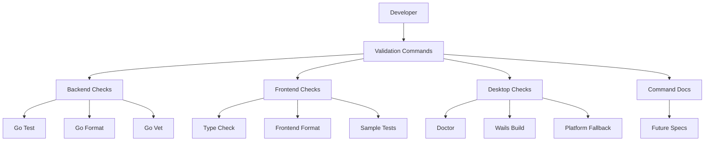
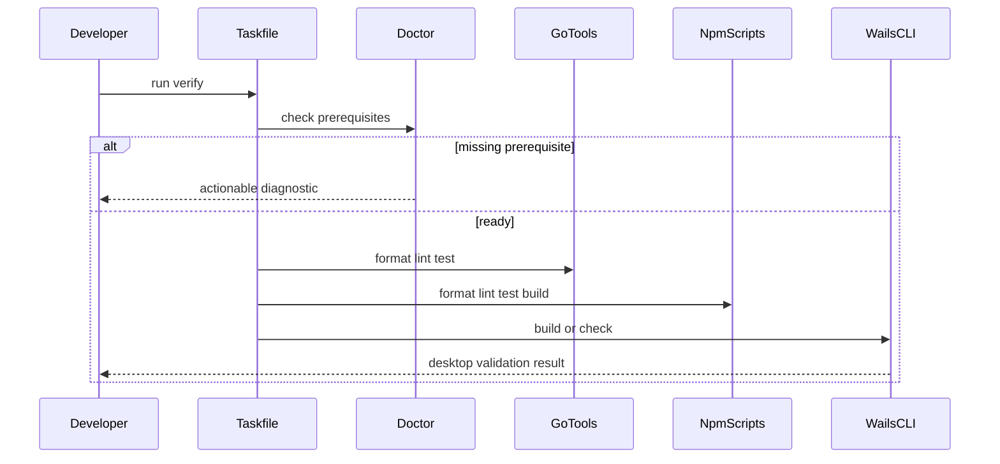

# Design Document

## Overview

本设计为 LoomiDBX 固化 Phase 1 的最小测试工具链。它面向开发者和后续 spec 实现者，提供一组本地可运行、可诊断、可引用的验证入口，覆盖 Go 后端、Vue 前端、Wails 桌面集成、格式化、lint、构建和样例测试。

当前仓库已有 `phase-01-project-structure` 交付的工程骨架、`Taskfile.yml`、Go bootstrap 测试和前端类型检查脚本。本 spec 不重建骨架，而是在既有结构上收敛命令语义、补齐前后端样例测试策略、明确 Wails 验证边界，并把这些验证路径写入开发文档。

### Goals
- 建立后续 spec 可引用的最小验证命令矩阵。
- 固化 Go 后端测试、格式化和静态检查入口。
- 固化 Vue 前端类型检查、格式化和最小样例验证入口。
- 固化 Wails doctor/build 或平台 fallback 的桌面验证边界。
- 记录命令覆盖范围、环境依赖和延后测试能力。

### Non-Goals
- 不补齐业务模块完整测试覆盖率。
- 不建立完整 UI E2E 自动化、跨平台发布流水线或覆盖率 gate。
- 不实现生成器契约测试、执行引擎集成测试、API 契约测试或 UI 工作流测试全集。
- 不引入远端 CI 服务、遥测、日志平台或可观测性平台。
- 不要求真实数据库凭据、Schema、生成数据、Project 配置、用户 SQL 或远端账号数据。

## Boundary Commitments

### This Spec Owns
- 统一验证命令矩阵：后端测试、前端验证、格式化、lint、桌面检查、桌面构建和聚合验证。
- Go 后端最小测试标准：`go test ./...`、`gofmt`、`go vet ./...` 或等价 Task 入口。
- Vue 前端最小验证标准：typecheck、format、lint，以及 deterministic 的样例测试边界。
- Wails 验证标准：`doctor` 前置检查、标准 build 路径和平台 fallback 的适用范围。
- 开发文档：命令用途、覆盖范围、前置工具、失败诊断和后续 spec 引用方式。

### Out of Boundary
- `phase-01-project-structure` 继续拥有应用骨架、目录结构、bootstrap 调用链和 facade/API client 基础边界。
- 后续业务 spec 拥有各自领域、服务、数据库、生成器、API 和 UI 的业务测试。
- Phase 9 负责跨模块测试策略、完整 E2E、可观测性、发布验收和覆盖率政策。
- 本 spec 不改变产品数据隐私边界，不增加真实数据库或远端账号依赖。

### Allowed Dependencies
- 上游 `phase-01-project-structure` 已建立的 `Taskfile.yml`、Go 模块、前端 npm 工程、Wails 配置和文档目录。
- Go 标准工具链：`go test`、`gofmt`、`go vet`。
- 现有前端工具链：npm、Vue 3、TypeScript、Vite、vue-tsc、Prettier。
- Wails v3 CLI 和现有 `scripts/doctor.go` 诊断入口。
- 可选轻量测试依赖仅限当前样例测试需要，例如 Vitest；不得引入完整 E2E 平台。

### Revalidation Triggers
- `Taskfile.yml` 命令名称、命令语义或聚合验证顺序发生变化。
- Go、Node/npm、Vue、Vite、Wails CLI 的最低版本或安装方式发生变化。
- 前端从 typecheck-only 测试升级为独立测试运行器，或新增测试依赖。
- Wails build 输出目录、平台 fallback 或 doctor 检查项发生变化。
- 后续 spec 增加必须进入全局验证矩阵的共享测试能力。

## Architecture

### Existing Architecture Analysis

当前仓库已有 Phase 1 骨架：根目录 Go 模块、`Taskfile.yml`、`scripts/doctor.go`、`frontend/package.json`、`internal/bootstrap` 和 `docs/development/commands.md`。这些文件已经提供初始命令和样例测试落位，但命令覆盖范围、后续引用方式、前端样例验证和桌面 fallback 边界仍需由本 spec 明确；本 spec 不假设存在额外的 `internal/projectstructure` 包。

### Architecture Pattern & Boundary Map



**Architecture Integration**:
- Selected pattern: 统一命令矩阵 + 分层验证。Task 入口对外稳定，底层分为 backend、frontend、desktop 和 docs 四个边界。
- Domain/feature boundaries: 本 spec 只拥有验证工具链，不拥有业务模块测试内容。
- Existing patterns preserved: 继续使用工程骨架提供的 Taskfile、doctor、Go package tests 和前端 npm scripts。
- New components rationale: 增加分层验证语义、前端样例验证边界和文档引用标准。
- Steering compliance: 保持轻量、本地运行、隐私安全和 Phase 纪律。

**Dependency Direction**:

```text
toolchain prerequisites -> package scripts -> Taskfile commands -> aggregate verification -> docs and future specs
```

命令可以调用脚本和包管理器脚本；测试代码不得依赖真实数据库、远端账号或未来业务模块。后续 spec 可以引用本 spec 的命令，但不应反向改变本 spec 的基础命令语义，除非触发 revalidation。

### Technology Stack

| Layer | Choice / Version | Role in Feature | Notes |
|-------|------------------|-----------------|-------|
| Backend | Go 1.25, `go test`, `gofmt`, `go vet` | 后端单元测试、格式化和静态检查 | 与 `go.mod` 当前版本一致 |
| Frontend | npm 11, Vue 3, TypeScript, Vite, vue-tsc, Prettier | 前端类型检查、构建和格式化 | 继续使用现有 `frontend/package.json` |
| Optional Frontend Test | Vitest 或等价轻量 runner | deterministic 前端样例测试 | 仅在实现样例测试需要时引入 |
| Desktop Runtime | Wails v3 CLI `wails3` | doctor/build 验证桌面集成 | 缺失时输出可执行诊断 |
| Command Runner | Taskfile v3 | 统一开发命令入口 | README 保留等价原生命令 |

## File Structure Plan

### Directory Structure

```text
loomidbx-v2/
├── Taskfile.yml                         # 统一 setup、doctor、format、lint、test、build、verify 命令
├── README.md                            # 快速验证入口和本地隐私说明
├── docs/
│   └── development/
│       └── commands.md                  # 命令矩阵、适用范围、fallback 和后续 spec 引用方式
├── scripts/
│   ├── doctor.go                        # 本地工具链诊断，含 Go、Node、npm、wails3 和平台提示
│   └── doctor_test.go                   # doctor 诊断逻辑的 Go 单元测试
├── app_test.go                          # App facade bootstrap 样例测试
├── internal/
│   ├── bootstrap/
│   │   └── service_test.go              # 后端 deterministic bootstrap 服务样例测试
│   └── projectstructure/
│       └── *_test.go                    # 工程结构边界测试，作为当前骨架回归检查
├── frontend/
│   ├── package.json                     # npm scripts: build、typecheck、lint、format、test
│   ├── tsconfig.json                    # TypeScript strict typecheck 配置
│   ├── vite.config.ts                   # 前端 build 配置
│   └── src/
│       ├── api/
│       │   ├── result.ts                # API result 类型，适合前端样例测试
│       │   └── bootstrapClient.ts       # bootstrap client，可作为边界样例
│       ├── stores/
│       │   └── bootstrapStore.ts        # bootstrap 状态，可作为样例测试对象
│       └── test/
│           └── README.md                # 前端样例测试边界说明，若引入 runner 则放置测试 setup
└── tests/
    ├── README.md                        # 测试分层说明
    └── smoke/
        └── phase-01-validation.md       # 手动或命令级 smoke 验证记录模板
```

### Modified Files
- `Taskfile.yml` — 固化分层验证入口和聚合 `verify` 任务；保留现有命令名兼容。
- `frontend/package.json` — 明确 `typecheck`、`lint`、`format`、`test`、`build` 的职责；如引入 Vitest，只加入轻量样例测试所需依赖与脚本。
- `docs/development/commands.md` — 记录命令矩阵、必跑检查、环境依赖、fallback、失败诊断和后续 spec 引用方式。
- `README.md` — 补充最小验证路径链接，不重复完整命令矩阵。
- `tests/README.md` 与 `tests/smoke/phase-01-validation.md` — 标注测试层级、当前覆盖和延后范围。
- `.gitignore` — 如新增测试产物或覆盖率临时目录，仅忽略生成物，不隐藏源文件。

共享文件所有权：`phase-01-project-structure` 拥有 `Taskfile.yml`、`README.md`、`docs/development/commands.md`、`tests/README.md` 的初始骨架和 deferred 标注；本 spec 拥有验证矩阵、聚合顺序、fallback、测试分层和后续 spec 引用语义的扩展内容。

## System Flows



关键决策：`verify` 是本地最小质量门；`doctor` 失败时返回可执行提示；Wails 缺失时可以记录诊断或运行 documented fallback，但 fallback 不能被表述为完整桌面构建。

## Requirements Traceability

| Requirement | Summary | Components | Interfaces | Flows |
|-------------|---------|------------|------------|-------|
| 1.1 | 命令清单覆盖验证入口 | ValidationCommandMatrix, CommandDocumentation | Batch | Validation flow |
| 1.2 | 聚合验证按确定顺序执行 | ValidationCommandMatrix | Batch | Validation flow |
| 1.3 | 缺失工具输出可执行提示 | DesktopDiagnostic, CommandDocumentation | Batch | Validation flow |
| 1.4 | 验证命令保持本地和隐私安全 | ValidationCommandMatrix, TestBoundaryDocs | Batch, State | N/A |
| 2.1 | 后端测试不依赖数据库或远端 | BackendValidation | Batch | Validation flow |
| 2.2 | Go 格式化覆盖当前源码 | BackendValidation | Batch | N/A |
| 2.3 | Go 静态检查报告诊断 | BackendValidation | Batch | Validation flow |
| 2.4 | 后端样例测试覆盖 deterministic 行为 | BackendSampleTests | State | N/A |
| 3.1 | 前端验证覆盖 TS/Vue 源码 | FrontendValidation | Batch | Validation flow |
| 3.2 | 前端格式化规则可执行 | FrontendValidation | Batch | N/A |
| 3.3 | 前端失败诊断指向源码或配置 | FrontendValidation | Batch | Validation flow |
| 3.4 | 前端样例覆盖 deterministic 边界 | FrontendSampleTests | State | N/A |
| 4.1 | 桌面检查验证本地工具 | DesktopDiagnostic | Batch | Validation flow |
| 4.2 | 桌面构建运行前端和 Wails 或 fallback | DesktopBuildValidation | Batch | Validation flow |
| 4.3 | Wails 缺失时清晰诊断 | DesktopDiagnostic | Batch | Validation flow |
| 4.4 | 桌面验证限于骨架集成 | DesktopBuildValidation, TestBoundaryDocs | Batch, State | N/A |
| 5.1 | 后续 spec 可引用命令 | CommandDocumentation | State | N/A |
| 5.2 | 命令覆盖限制被标注 | CommandDocumentation, TestBoundaryDocs | State | N/A |
| 5.3 | 必跑与环境依赖检查被区分 | CommandDocumentation | State | N/A |
| 5.4 | 深层业务测试归属后续 spec | TestBoundaryDocs | State | N/A |
| 6.1 | 初始管线优先使用既有工具 | ValidationCommandMatrix | Batch | N/A |
| 6.2 | 新依赖记录当前必要性 | FrontendSampleTests, CommandDocumentation | State | N/A |
| 6.3 | 不引入重型测试平台 | TestBoundaryDocs | State | N/A |
| 6.4 | 样例测试聚焦骨架或契约行为 | BackendSampleTests, FrontendSampleTests | State | N/A |

## Components and Interfaces

| Component | Domain/Layer | Intent | Req Coverage | Key Dependencies | Contracts |
|-----------|--------------|--------|--------------|------------------|-----------|
| ValidationCommandMatrix | Command | 统一验证命令和聚合顺序 | 1.1, 1.2, 1.4, 6.1 | Taskfile P0, npm scripts P0, Go tools P0 | Batch |
| BackendValidation | Backend | 后端测试、格式化、静态检查 | 2.1, 2.2, 2.3 | Go tools P0 | Batch |
| BackendSampleTests | Backend | deterministic 后端样例测试 | 2.4, 6.4 | Bootstrap service P0 | State |
| FrontendValidation | Frontend | 前端 typecheck、format、lint、build | 3.1, 3.2, 3.3 | npm scripts P0, vue-tsc P0, Prettier P0 | Batch |
| FrontendSampleTests | Frontend | deterministic 前端样例测试 | 3.4, 6.2, 6.4 | TypeScript P0, optional runner P1 | State |
| DesktopDiagnostic | Desktop | Wails 和平台前置诊断 | 1.3, 4.1, 4.3 | doctor P0, Wails CLI P0 | Batch |
| DesktopBuildValidation | Desktop | 桌面 build 或 fallback 验证 | 4.2, 4.4 | frontend build P0, wails3 P0 | Batch |
| CommandDocumentation | Documentation | 命令矩阵和后续引用方式 | 5.1, 5.2, 5.3, 6.2 | docs P0 | State |
| TestBoundaryDocs | Documentation | 测试分层、隐私和延后范围 | 1.4, 4.4, 5.4, 6.3, 6.4 | tests docs P0 | State |

### Command Layer

#### ValidationCommandMatrix

| Field | Detail |
|-------|--------|
| Intent | 对外提供稳定的本地验证入口和聚合验证顺序 |
| Requirements | 1.1, 1.2, 1.4, 6.1 |

**Responsibilities & Constraints**
- 暴露 `doctor`、`format`、`lint`、`test`、`build` 和 `verify`。
- `verify` 先运行诊断，再运行格式化检查、静态检查、测试和构建类验证。
- 命令不得读取真实数据库凭据、Schema、生成数据、Project 配置、用户 SQL 或远端账号数据。
- 未安装 Task 时，文档必须给出等价原生命令。

**Dependencies**
- Inbound: Developer 和后续 spec — 运行或引用验证命令 (P0)
- Outbound: BackendValidation、FrontendValidation、DesktopDiagnostic、DesktopBuildValidation (P0)
- External: Taskfile v3 — 统一命令入口 (P1)

**Contracts**: Service [ ] / API [ ] / Event [ ] / Batch [x] / State [ ]

##### Batch / Job Contract
- Trigger: 开发者运行 `task verify` 或文档中的等价命令。
- Input / validation: 当前工作目录、Go/npm/Wails 前置条件、前端依赖状态。
- Output / destination: 终端成功结果或可执行失败诊断。
- Idempotency & recovery: 命令不修改业务数据；失败后按诊断安装工具或修复源码并重试。

### Backend

#### BackendValidation

| Field | Detail |
|-------|--------|
| Intent | 固化 Go 后端测试、格式化和静态检查 |
| Requirements | 2.1, 2.2, 2.3 |

**Responsibilities & Constraints**
- 后端测试使用 `go test ./...` 或 Task 等价入口。
- 格式化覆盖当前跟踪的 Go 源码，避免只列出少数文件导致新增包遗漏。
- 静态检查使用 `go vet ./...` 或同等 Go 工具。
- 不连接真实数据库，不访问远端服务。

**Dependencies**
- Inbound: ValidationCommandMatrix — 调用后端验证 (P0)
- Outbound: BackendSampleTests — 提供样例测试内容 (P0)
- External: Go 1.25 toolchain (P0)

**Contracts**: Service [ ] / API [ ] / Event [ ] / Batch [x] / State [ ]

##### Batch / Job Contract
- Trigger: `task test`、`task lint`、`task format` 或后端分层命令。
- Input / validation: Go module 和当前源码。
- Output / destination: Go test/vet/fmt 诊断。
- Idempotency & recovery: 格式化可写入源码或以 check 模式报告差异；文档需说明命令行为。

#### BackendSampleTests

| Field | Detail |
|-------|--------|
| Intent | 用骨架 deterministic 行为提供后端样例测试 |
| Requirements | 2.4, 6.4 |

**Responsibilities & Constraints**
- 覆盖 bootstrap service、App facade 或 doctor 解析等确定性行为。
- 不使用真实数据库、网络、用户目录或远端账号。
- 作为后续业务测试的模式示例，而不是业务覆盖率目标。

**Dependencies**
- Inbound: BackendValidation — 运行样例测试 (P0)
- Outbound: `internal/bootstrap`、`app.go`、`scripts/doctor.go` (P0)

**Contracts**: Service [ ] / API [ ] / Event [ ] / Batch [ ] / State [x]

##### State Management
- State model: deterministic 输入输出断言。
- Persistence & consistency: 不写业务持久化。
- Concurrency strategy: 测试不共享可变全局状态。

### Frontend

#### FrontendValidation

| Field | Detail |
|-------|--------|
| Intent | 固化前端类型检查、格式化、lint、build 和测试入口 |
| Requirements | 3.1, 3.2, 3.3 |

**Responsibilities & Constraints**
- `typecheck` 使用 `vue-tsc --noEmit`。
- `format` 使用 Prettier check 或等价命令。
- `lint` 初期可映射到 typecheck；如后续引入 ESLint，应记录依赖原因和规则边界。
- `test` 必须表示前端验证入口；如果只做 typecheck，文档需说明限制；如果加入 runner，应运行 deterministic 样例测试。

**Dependencies**
- Inbound: ValidationCommandMatrix — 调用前端验证 (P0)
- Outbound: FrontendSampleTests — 提供样例测试内容 (P1)
- External: npm 11、Vue 3、TypeScript、Vite、vue-tsc、Prettier (P0)

**Contracts**: Service [ ] / API [ ] / Event [ ] / Batch [x] / State [ ]

##### Batch / Job Contract
- Trigger: `npm --prefix frontend run typecheck|format|lint|test|build` 或 Task 等价入口。
- Input / validation: `frontend/src`、`tsconfig.json`、`vite.config.ts` 和 package scripts。
- Output / destination: TypeScript、Prettier、Vite 或测试 runner 诊断。
- Idempotency & recovery: 不写业务数据；失败后修复前端源码或配置。

#### FrontendSampleTests

| Field | Detail |
|-------|--------|
| Intent | 为前端边界提供最小 deterministic 样例验证 |
| Requirements | 3.4, 6.2, 6.4 |

**Responsibilities & Constraints**
- 优先覆盖 `ApiResult` discriminated union、bootstrap client 错误转换或 bootstrap store 状态。
- 不要求真实 Wails runtime、真实桌面窗口或完整业务页面。
- 若引入 Vitest，依赖必须只服务于当前样例测试，并在文档中说明。

**Dependencies**
- Inbound: FrontendValidation — 运行样例测试 (P0)
- Outbound: `frontend/src/api`、`frontend/src/stores` 或 `frontend/src/types` (P0)
- External: Vitest 或等价轻量 runner (P1, optional)

**Contracts**: Service [ ] / API [ ] / Event [ ] / Batch [ ] / State [x]

##### State Management
- State model: 前端类型和纯逻辑边界的 deterministic 断言。
- Persistence & consistency: 不持久化用户数据。
- Concurrency strategy: 测试不依赖运行中的 Wails shell。

### Desktop

#### DesktopDiagnostic

| Field | Detail |
|-------|--------|
| Intent | 诊断 Wails 和平台前置工具是否满足本地验证 |
| Requirements | 1.3, 4.1, 4.3 |

**Responsibilities & Constraints**
- 检查 Go、Node.js、npm、`wails3` 和平台提示。
- 缺失工具时输出安装或下一步诊断命令。
- 不读取或上传业务数据。

**Dependencies**
- Inbound: ValidationCommandMatrix、DesktopBuildValidation (P0)
- Outbound: `scripts/doctor.go` (P0)
- External: Wails v3 CLI, platform WebView prerequisites (P0)

**Contracts**: Service [ ] / API [ ] / Event [ ] / Batch [x] / State [ ]

##### Batch / Job Contract
- Trigger: `task doctor` 或 build 前置依赖。
- Input / validation: PATH、工具版本、平台信息。
- Output / destination: 终端诊断。
- Idempotency & recovery: 不修改项目状态；安装缺失工具后重试。

#### DesktopBuildValidation

| Field | Detail |
|-------|--------|
| Intent | 验证前端 build 与 Wails 桌面构建或 documented fallback |
| Requirements | 4.2, 4.4 |

**Responsibilities & Constraints**
- 标准路径运行前端 build 和 `wails3 build`。
- 平台 fallback 可以运行前端 build 与 `go build`，但必须标注不能替代完整 Wails build。
- 不要求登录、数据库连接、Schema 扫描或生成执行工作流。

**Dependencies**
- Inbound: ValidationCommandMatrix — 调用桌面 build (P0)
- Outbound: DesktopDiagnostic、FrontendValidation (P0)
- External: Wails v3 CLI (P0)

**Contracts**: Service [ ] / API [ ] / Event [ ] / Batch [x] / State [ ]

##### Batch / Job Contract
- Trigger: `task build`、平台 build task 或文档等价命令。
- Input / validation: 前端构建产物、Go module、Wails 配置、平台前置条件。
- Output / destination: Wails 构建结果或 fallback 可执行文件。
- Idempotency & recovery: 构建产物可清理重建；失败时依据 doctor 诊断修复环境。

### Documentation

#### CommandDocumentation

| Field | Detail |
|-------|--------|
| Intent | 让开发者和后续 spec 明确可引用的验证路径 |
| Requirements | 5.1, 5.2, 5.3, 6.2 |

**Responsibilities & Constraints**
- 记录命令名称、等价原生命令、覆盖范围和适用场景。
- 区分 mandatory、optional、environment-dependent。
- 若新增依赖，记录当前必要性。
- 不承诺业务覆盖率或未来阶段测试能力。

**Dependencies**
- Inbound: 后续 spec、开发者、reviewer (P0)
- Outbound: ValidationCommandMatrix、BackendValidation、FrontendValidation、DesktopBuildValidation (P0)

**Contracts**: Service [ ] / API [ ] / Event [ ] / Batch [ ] / State [x]

##### State Management
- State model: Markdown 命令矩阵和引用说明。
- Persistence & consistency: 命令变化必须同步文档。
- Concurrency strategy: 文档以命令边界组织，避免和架构文档重复。

#### TestBoundaryDocs

| Field | Detail |
|-------|--------|
| Intent | 记录当前测试层级、隐私边界和延后范围 |
| Requirements | 1.4, 4.4, 5.4, 6.3, 6.4 |

**Responsibilities & Constraints**
- 标注当前覆盖：Go 单元测试、前端类型/样例验证、Wails doctor/build。
- 标注延后：业务覆盖率、真实数据库集成、UI E2E、生成器契约测试、可观测性。
- 声明测试不需要真实数据库或远端账号数据。

**Dependencies**
- Inbound: 开发者、后续业务 spec (P0)
- Outbound: `tests/README.md`、`tests/smoke/phase-01-validation.md` (P0)

**Contracts**: Service [ ] / API [ ] / Event [ ] / Batch [ ] / State [x]

##### State Management
- State model: Markdown 测试分层说明。
- Persistence & consistency: 新增全局测试层级时更新。
- Concurrency strategy: 业务测试说明留在各自 spec，避免集中膨胀。

## Data Models

本 spec 不新增业务数据模型，不新增数据库表，不定义持久化 schema。

### Data Contracts & Integration

**CommandResult 语义约定**:

| Field | Type | Required | Description |
|-------|------|----------|-------------|
| `command` | string | Yes | 被运行的验证入口名称 |
| `status` | pass, fail, skipped | Yes | 本地验证结果语义 |
| `scope` | string | Yes | 命令覆盖范围说明 |
| `diagnostic` | string | No | 失败或跳过时的下一步提示 |

该结构是文档语义，不要求实现持久化对象。命令行输出可以是普通文本，但必须表达等价信息。

## Error Handling

### Error Strategy
- 工具缺失：doctor 输出缺失项、最低版本和安装提示。
- Go 验证失败：保留 `go test`、`go vet` 或格式化诊断。
- 前端验证失败：保留 vue-tsc、Prettier、Vite 或测试 runner 的源码/配置诊断。
- Wails 构建失败：区分 Wails CLI 缺失、平台依赖缺失、前端 build 失败和 Go build 失败。

### Error Categories and Responses

| Category | Example | Response |
|----------|---------|----------|
| Prerequisite Missing | `wails3` 不在 PATH | 输出安装命令和 `wails3 doctor` 下一步 |
| Backend Test Failure | Go 单元测试失败 | 输出失败包、测试名和断言信息 |
| Frontend Type Failure | Vue/TS 类型错误 | 输出文件、行列和类型错误 |
| Format Failure | Prettier check 失败 | 输出需格式化文件并提示运行 format |
| Desktop Build Failure | 平台 WebView 依赖缺失 | 指向 doctor 和平台安装说明 |

### Monitoring

本 spec 不引入日志平台或可观测性。验证证据来自本地命令输出和文档中的 smoke 记录模板。

## Testing Strategy

### Unit Tests
- Go bootstrap service 和 App facade deterministic 状态测试。
- doctor 版本解析和缺失工具提示逻辑测试。
- 前端 API result、bootstrap client 或 store 的 deterministic 样例测试。

### Integration Tests
- `task test` 或等价命令运行 Go tests 和前端验证。
- `task lint` 运行 Go vet 和前端 lint/typecheck。
- `task build` 运行前端 build 与 Wails build；缺失 Wails 时记录 doctor 诊断。

### E2E/UI Tests
- 本 spec 不建立完整 E2E 自动化。
- 如需要手动 smoke，使用 `tests/smoke/phase-01-validation.md` 记录 bootstrap 骨架验证，不覆盖业务页面。

### Deferred
- 真实数据库集成测试矩阵延后到数据库、引擎或 Phase 9 spec。
- 生成器契约测试延后到 generator-contract-tests。
- API 契约测试延后到 API 相关 spec。
- UI 工作流测试延后到 Phase 8/9。

## Security Considerations

- 所有验证命令仅运行本地源码、工具链和构建检查。
- 测试不得要求真实数据库凭据、Schema、生成数据、Project 配置、用户 SQL 或远端账号数据。
- doctor 不上传环境信息。
- 测试输出不得包含敏感连接信息；后续业务测试若需要 fixture，必须使用非敏感 synthetic fixture。

## Performance & Scalability

- `doctor` 应快速完成本地工具检查，不执行长时间网络操作。
- `verify` 作为最小质量门，应优先运行本地确定性检查，避免 Phase 1 引入慢速 E2E。
- 样例测试保持小规模，业务覆盖随后续 spec 分散补齐。

## Migration Strategy

当前没有旧测试平台需要迁移。实现策略是在现有 `Taskfile.yml`、前端 scripts、Go tests 和文档上增量固化。如果后续引入独立测试 runner，应保留 `task test` 和文档中已有命令语义，避免破坏后续 spec 引用。
