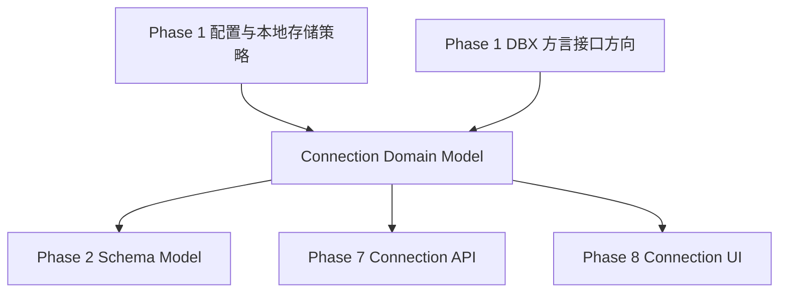
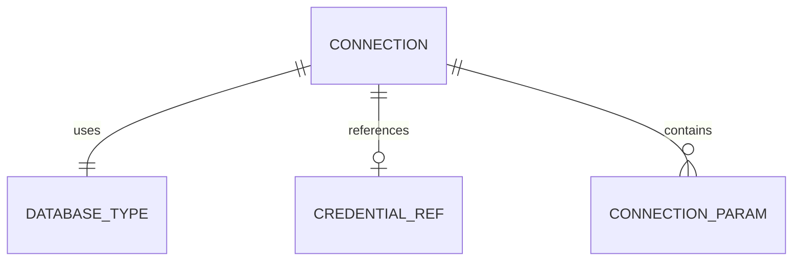

# Design Document

## Overview

`phase-02-connection-model` 为 LoomiDBX 后端建立连接配置领域模型。它让用户保存和复用数据库连接所需的基础信息，并为后续 Schema 扫描、Project 组织、连接 API 和 UI 表单提供稳定合同。

本设计只定义 Go 后端领域层的实体、值对象、枚举、校验和序列化边界。真实连接测试、连接 CRUD 服务、Wails binding、UI 表单和密码加密实现不在本规格中完成。

### Goals

- 定义可序列化的 `Connection` 领域模型和数据库类型枚举。
- 明确普通连接参数与敏感凭据的分离边界。
- 提供字段级基础校验与可测试的 JSON 往返行为。

### Non-Goals

- 不实现连接列表、保存、删除或验证服务。
- 不接入真实数据库驱动或建立数据库连接。
- 不实现 UI、Wails API、Facade 或前端 DTO。
- 不重做 Phase 1 的本地安全存储策略。

## Boundary Commitments

### This Spec Owns

- `Connection` 聚合和值对象的领域表达。
- `DatabaseType` 枚举及其稳定字符串值。
- 连接基础字段、普通扩展参数和敏感凭据引用的模型边界。
- 基础校验规则、字段级校验错误和敏感字段排除规则。
- 模型 JSON 序列化、反序列化和单元测试。

### Out of Boundary

- 连接 Repository、迁移 SQL、CRUD Service 和事务边界。
- Wails binding、Go Facade、前端 API Client 和 UI 表单。
- 真实数据库连通性测试和驱动 DSN 生成。
- 密码加密算法、系统钥匙串或安全存储具体实现。
- Schema 扫描、Project 引用检查和执行任务使用方式。

### Allowed Dependencies

- 可以依赖 Go 标准库。
- 可以复用 Phase 1 已落地的 Go 模块结构和包命名约定。
- 可以通过稳定字符串与 Phase 1 数据库方言类型方向保持一致，但不能依赖具体数据库驱动包。
- 可以引用本地存储策略中的敏感信息边界，但不实现该策略。

### Revalidation Triggers

- `Connection` 字段名、JSON 标签或身份字段变化。
- `DatabaseType` 字符串值变化或新增/删除类型。
- 敏感字段识别规则变化。
- 校验错误结构变化。
- 连接模型从 domain 层移动到 service/store 层。

## Architecture

### Architecture Pattern & Boundary Map

**Architecture Integration**:

- Selected pattern: 领域模型和值对象优先。连接配置作为 domain 模型存在，服务、持久化和 UI 在后续规格中消费该模型。
- Domain/feature boundaries: `connection` 包只表达连接配置本身，不编排存储或真实连接验证。
- Existing patterns preserved: 分层后端、Adapter owns external differences、Domain does not know UI or Wails。
- New components rationale: 需要独立连接领域包为后续 Schema 和 API 提供稳定输入。
- Steering compliance: 遵守本地隐私边界、Go 注释规则和 Phase 2 不跨阶段实现未来能力的约束。



### Technology Stack

| Layer | Choice / Version | Role in Feature | Notes |
|-------|------------------|-----------------|-------|
| Backend / Domain | Go | 定义连接实体、值对象、枚举和校验 | 只使用标准库即可 |
| Data / Storage | JSON-compatible model | 支持后续 SQLite / 配置文件持久化 | 不实现 repository |
| Database Adapter | Phase 1 dbx direction | 对齐数据库类型扩展方向 | 不依赖驱动 |
| Frontend / CLI | 不涉及 | 后续 API/UI 消费 | 本规格不生成前端代码 |

## File Structure Plan

### Directory Structure

```text
internal/
└── domain/
    └── connection/
        ├── connection.go        # Connection 聚合、ConnectionID、基础字段和构造/规范化方法
        ├── database_type.go     # DatabaseType 枚举、业务连接类型字符串值、支持/预留判断和 core.DBType 映射边界说明
        ├── credential.go        # CredentialRef、storage.SecretRef 可映射字段、敏感字段键识别和敏感值边界
        ├── params.go            # ConnectionParams、参数值 JSON 边界和参数校验
        ├── validation.go        # ValidationError、ValidationResult 和字段级基础校验
        └── connection_test.go   # 序列化、校验、敏感字段排除和枚举测试
```

### Modified Files

- 无需修改现有生产代码文件；实现阶段如发现 Phase 1 已建立不同 Go 模块路径，应保持同等职责并更新任务边界。

## Requirements Traceability

| Requirement | Summary | Components | Interfaces | Flows |
|-------------|---------|------------|------------|-------|
| 1.1 | 表达连接基础字段 | Connection | Domain Model | 创建/加载 |
| 1.2 | 稳定连接身份 | ConnectionID | Domain Model | 下游引用 |
| 1.3 | 名称校验 | ConnectionValidator | Validation | 校验 |
| 1.4 | 数据库类型校验 | DatabaseType | Validation | 校验 |
| 1.5 | 业务配置分离 | Connection package | Domain Boundary | N/A |
| 2.1 | 数据库类型集合 | DatabaseType | Enum | N/A |
| 2.2 | 可序列化字符串 | DatabaseType | JSON | 序列化 |
| 2.3 | 预留类型不暗示能力 | DatabaseType | Capability flag | N/A |
| 2.4 | 方言方向一致 | DatabaseType | Integration boundary | N/A |
| 3.1 | 凭据引用 | CredentialRef | Domain Model | 保存/加载 |
| 3.2 | 排除明文敏感值 | CredentialRef, Params | JSON | 序列化 |
| 3.3 | 敏感参数识别 | SensitiveKeyMatcher | Validation | 参数处理 |
| 3.4 | 下游识别敏感边界 | CredentialRef | Domain Contract | 服务消费 |
| 4.1 | 扩展参数 | ConnectionParams | Domain Model | 配置 |
| 4.2 | 参数持久化 | ConnectionParams | JSON | 序列化 |
| 4.3 | 参数键校验 | ParamsValidator | Validation | 校验 |
| 4.4 | JSON 复杂结构边界 | ParamValue | JSON | 序列化 |
| 4.5 | 不解释驱动行为 | ConnectionParams | Boundary | N/A |
| 5.1 | 字段级错误 | ValidationError | Validation | 校验 |
| 5.2 | 主机规则 | ConnectionValidator | Validation | 校验 |
| 5.3 | 端口规则 | ConnectionValidator | Validation | 校验 |
| 5.4 | 多错误返回 | ValidationResult | Validation | 校验 |
| 5.5 | 错误不泄露敏感值 | ValidationError | Validation | 校验 |
| 6.1 | 稳定字段名 | Connection | JSON | 序列化 |
| 6.2 | 往返恢复 | Connection | JSON | 反序列化 |
| 6.3 | 可选字段默认值 | Connection, Params | JSON | 反序列化 |
| 6.4 | 未知字段兼容 | Connection | JSON | 反序列化 |
| 6.5 | 测试覆盖 | connection tests | Tests | 验证 |

## Components and Interfaces

### Domain Layer

#### Connection

| Field | Detail |
|-------|--------|
| Intent | 表达一个可复用数据库连接配置的聚合根 |
| Requirements | 1.1, 1.2, 1.5, 6.1, 6.2, 6.3, 6.4 |

**Responsibilities & Constraints**

- 持有连接 ID、名称、数据库类型、主机、端口、初始数据库、用户名、凭据引用和扩展参数。
- 不保存明文密码。
- 不包含连接测试、CRUD 状态或 UI 字段。
- JSON 标签必须稳定，供后续持久化和 Wails 合同复用。

**Service Interface**

```go
type Connection struct {
    ID          ConnectionID     `json:"id"`
    Name        string           `json:"name"`
    Type        DatabaseType     `json:"type"`
    Host        string           `json:"host,omitempty"`
    Port        int              `json:"port,omitempty"`
    Database    string           `json:"database,omitempty"`
    Username    string           `json:"username,omitempty"`
    Credential  CredentialRef    `json:"credential,omitempty"`
    Params      ConnectionParams `json:"params,omitempty"`
}
```

- Preconditions: 调用校验前允许存在不完整字段，便于表单草稿和反序列化。
- Postconditions: `Validate` 返回所有可检测基础问题。
- Invariants: `ID` 是连接引用身份；`Name` 不作为唯一身份。

#### DatabaseType

| Field | Detail |
|-------|--------|
| Intent | 统一数据库类型枚举和稳定序列化字符串 |
| Requirements | 2.1, 2.2, 2.3, 2.4 |

**Responsibilities & Constraints**

- 定义 `mysql`、`postgres`、`sqlite`、`oracle`、`sqlserver`、`clickhouse`、`tidb`、`hive`。
- `DatabaseType` 是连接领域层的“业务连接类型”，用于保存用户选择和下游配置引用，不直接等同于适配器能力集合。
- 现有 `internal/dbx/core.DBType` 只表达当前可用 Adapter 目标，首期只有 `mysql` 和 `postgres`；后续 service/adapter 层应通过显式映射把可连接的 `DatabaseType` 转换为 `core.DBType`。
- 预留类型（例如 `sqlite`、`oracle`、`sqlserver`、`clickhouse`、`tidb`、`hive`）可以被领域模型识别和持久化，但转换到 `core.DBType` 时必须返回“不支持/无适配器”结果，而不是伪造适配器类型。
- 提供 `IsKnown`、`RequiresNetworkAddress`、`IsPrimarySupported` 等方法。
- `IsPrimarySupported` 只表达首期适配优先级，不能代表真实连接已实现。

#### CredentialRef

| Field | Detail |
|-------|--------|
| Intent | 表达敏感凭据的安全存储引用或加密结果引用 |
| Requirements | 3.1, 3.2, 3.4, 5.5 |

**Responsibilities & Constraints**

- 表达凭据引用 ID、凭据类型和可选元数据。
- 至少保留可映射到 `internal/storage.SecretRef` 的 `Provider` 与 `Key` 语义；如同时需要业务 ID 或凭据类型，应作为额外字段表达，不能替代 provider/key。
- 后续安全存储集成时，`CredentialRef` 应能无损转换为 `storage.SecretRef{Provider, Key}`；如果凭据类型或元数据无法进入 `storage.SecretRef`，应保留在连接业务数据中作为非秘密元数据。
- 不存放明文秘密值。
- 提供序列化时不泄露敏感值的结构。

#### ConnectionParams

| Field | Detail |
|-------|--------|
| Intent | 表达数据库特定但非驱动解释的扩展参数 |
| Requirements | 3.3, 4.1, 4.2, 4.3, 4.4, 4.5 |

**Responsibilities & Constraints**

- 支持字符串、数字、布尔和 JSON 结构参数。
- 提供敏感键识别，例如包含 `password`、`token`、`secret`、`credential` 的键。
- 不负责生成 DSN 或调用驱动。

#### ValidationResult

| Field | Detail |
|-------|--------|
| Intent | 返回字段级基础校验结果 |
| Requirements | 1.3, 1.4, 4.3, 5.1, 5.2, 5.3, 5.4, 5.5 |

**Responsibilities & Constraints**

- 返回所有基础校验问题。
- 每个错误包含字段路径、错误码和安全消息。
- 错误消息不得包含敏感值。

## Data Models

### Domain Model



### Logical Data Model

- `ConnectionID`: 字符串身份，后续可由 UUID 或本地 ID 生成策略赋值。
- `Connection`: 聚合根，拥有基础连接配置字段。
- `DatabaseType`: 字符串枚举，稳定持久化；语义是业务连接类型，和 `internal/dbx/core.DBType` 通过后续 service/adapter 层显式能力映射衔接。
- `CredentialRef`: 敏感凭据引用，不包含明文秘密；包含或可推导 `Provider` / `Key`，便于映射到 `internal/storage.SecretRef`。
- `ConnectionParams`: 扩展参数集合，普通参数与敏感键识别规则分离。
- `ValidationError`: 字段级错误，包含 `field`、`code`、`message`。

### Physical Data Model

本规格不定义 SQLite 表或迁移。后续本地存储规格或连接 Repository 规格应以本设计的 JSON 字段名和敏感凭据引用为输入。

## Error Handling

- `Validate` 返回错误集合，不直接 panic。
- 字段路径使用稳定字符串，例如 `name`、`type`、`host`、`port`、`params.sslmode`。
- 错误码使用稳定枚举，例如 `required`、`unknown_database_type`、`invalid_port`、`sensitive_param_not_allowed`。
- 错误消息不得包含密码、令牌或敏感扩展参数值。

## Testing Strategy

- `DatabaseType` 测试覆盖已知类型、未知类型、首期优先支持类型、网络地址需求，以及与当前 `core.DBType` 能力边界不混淆的行为。
- `Connection.Validate` 测试覆盖名称为空、未知类型、端口越界、网络数据库缺少主机、多错误返回。
- `ConnectionParams` 测试覆盖普通参数 JSON 往返、空键校验、复杂结构参数、敏感键识别。
- `CredentialRef` 和 `Connection` 序列化测试确认不会输出明文密码或敏感扩展参数值，并确认凭据引用字段可映射到 `storage.SecretRef` 的 `Provider` / `Key`。
- 反序列化测试覆盖缺少可选字段和存在未知字段时的兼容行为。

## Implementation Risks

- 如果实现阶段把 CRUD、Repository 或 Wails binding 放入本 spec，会导致任务边界膨胀并与 Phase 7 冲突。
- 如果 `DatabaseType` 与 `internal/dbx/core.DBType` 混为同一个枚举，会让领域层 8 种业务连接类型被当前 Adapter 能力反向收窄；实现时应保留 `connection.DatabaseType` 作为业务连接类型，并在后续 service/adapter 层建立显式能力映射。
- 如果为避免重复而直接扩展 `core.DBType` 到 8 种类型，但没有对应 Adapter，会让调用方误判真实连接能力已经存在。
- 如果 `CredentialRef` 只保留业务 ID、类型和元数据，而不能映射到 `storage.SecretRef{Provider, Key}`，后续接入安全存储时需要重构连接模型或迁移已保存数据。
- 如果扩展参数允许任意复杂对象但缺少 JSON 校验，后续持久化和 Wails 传输可能出现不可恢复数据。
