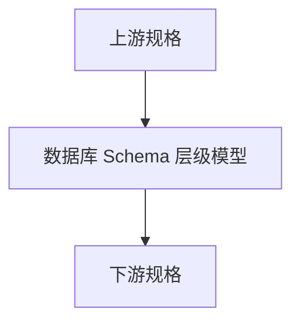

# Design Document

## Overview

`phase-02-database-schema-model` 交付数据库 Schema 层级模型。定义连接下 DbCatalog、DbSchema、空字符串隐式 Schema、扫描时间和快照映射边界。

本规格面向 Go 后端领域层，定义模型、枚举、值对象、基础校验和 JSON 序列化合同；不实现 `表字段约束、真实扫描、重扫 diff、API、UI。`

### Goals

- 定义 `数据库 Schema 层级模型` 的核心领域模型。
- 明确上游依赖 `phase-02-connection-model, phase-01-database-dialect-interface` 的只读引用边界。
- 为下游规格提供稳定字段名、枚举值和校验错误结构。

### Non-Goals

- 表字段约束、真实扫描、重扫 diff、API、UI。
- 不新增真实数据库驱动。
- 不新增 Wails binding 或前端代码。

## Boundary Commitments

### This Spec Owns

- `数据库 Schema 层级模型` 的领域实体和值对象。
- 稳定字符串枚举和状态值。
- 字段级基础校验错误。
- JSON 序列化、反序列化和单元测试。

### Out of Boundary

- 表字段约束、真实扫描、重扫 diff、API、UI。
- 任何跨阶段的服务编排、算法实现或 UI 工作流。

### Allowed Dependencies

- Go 标准库和现有项目模块结构。
- 上游规格 `phase-02-connection-model, phase-01-database-dialect-interface` 的稳定 ID、枚举和值对象。
- 不依赖 Wails、Vue、真实数据库驱动或未来执行引擎。

### Revalidation Triggers

- 模型字段名、JSON 标签或身份字段变化。
- 枚举字符串值变化。
- 校验错误结构变化。
- 上游引用或下游消费合同变化。

### JSON Presence and Implicit Schema Decision

本规格采用 **空字符串 `""` + 自定义 JSON 反序列化 presence 检查** 表达隐式 Schema。

实现要求：

- `DbSchema` 必须实现自定义 `UnmarshalJSON`，或通过等价的内部解码函数，先检查原始 JSON 对象中是否存在 `schemaName` 字段。
- `SchemaIdentity` 必须实现相同 presence 检查，保证 `schemaName` 缺失不会被静默当作隐式 Schema。
- `schemaName` 字段存在且值为 `""` 时，表示合法隐式 Schema。
- `schemaName` 字段缺失时，必须返回字段级 `SchemaValidationIssue`，`Path == "schemaName"` 或 `Path == "identity.schemaName"`，`Code == SCHEMA_REQUIRED`，`Severity == error`。
- `schemaName` 字段为 `null` 时不得接受；必须返回 `SCHEMA_REQUIRED` 或 `SCHEMA_INVALID_NAME`，不得转换为 `""`。
- `MarshalJSON` 或普通结构体 JSON 标签必须始终输出 `schemaName`，不得使用 `omitempty`。

## Source References

本设计以下列稳定文档和现有合同为依据，后续实现不得在未触发 revalidation 的情况下偏离这些来源：

- `docs/data-model.md` §5 Schema 结构：作为 `DbCatalog`、`DbSchema` 持久化字段、唯一约束和空字符串隐式 Schema 语义来源。
- `docs/data-model.md` §12 D-01：作为 `DbCatalog` / `DbSchema` 两层抽象统一不同数据库层级差异的设计依据。
- `internal/config/dto.go`：作为 Go 侧字段级 issue 结构的兼容参考，但 schema domain 不直接依赖 `internal/config` 包。
- `frontend/src/api/result.ts`：作为前端 `ApiIssue` 结构兼容参考，保证后续 API / UI 可复用同一字段级错误合同。

## Architecture



- Selected pattern: 领域模型和值对象优先。
- Domain/feature boundaries: 本规格只定义 `数据库 Schema 层级模型`。
- Existing patterns preserved: Domain does not know UI or Wails；Adapter owns external differences。

## File Structure Plan

### Directory Structure

```text
internal/domain/schema/dbcatalog.go
internal/domain/schema/dbschema.go
internal/domain/schema/schemaidentity.go
internal/domain/schema/schemavalidation.go
internal/domain/schema/validation.go
internal/domain/schema/schema_test.go
```

### Modified Files

- `internal/domain/schema/dbcatalog.go` — 承载 `数据库 Schema 层级模型` 的对应领域职责。
- `internal/domain/schema/dbschema.go` — 承载 `数据库 Schema 层级模型` 的对应领域职责。
- `internal/domain/schema/schemaidentity.go` — 承载 `数据库 Schema 层级模型` 的对应领域职责。
- `internal/domain/schema/schemavalidation.go` — 承载 `数据库 Schema 层级模型` 的对应领域职责。
- `internal/domain/schema/validation.go` — 承载 `数据库 Schema 层级模型` 的对应领域职责。
- `internal/domain/schema/schema_test.go` — 承载 `数据库 Schema 层级模型` 的对应领域职责。

## Components and Interfaces

| Component | Domain/Layer | Intent | Req Coverage | Contracts |
|-----------|--------------|--------|--------------|-----------|
| DbCatalog | Domain | DbCatalog 领域组件 | 1-5 | Go/JSON |
| DbSchema | Domain | DbSchema 领域组件 | 1-5 | Go/JSON |
| SchemaIdentity | Domain | SchemaIdentity 领域组件 | 1-5 | Go/JSON |
| SchemaValidation | Domain | SchemaValidation 领域组件 | 1-5 | Go/JSON |

## Data Models

本规格定义 Go domain 模型和 JSON 合同，不直接定义 SQLite migration。持久化字段以 `docs/data-model.md` §5 为来源；Go 字段使用领域语义命名，JSON 字段使用 lower camelCase，持久化映射由后续 repository / store spec 负责。

### DbCatalog

`DbCatalog` 表达连接下扫描到的数据库 / Catalog 层级，对应 `docs/data-model.md` 中的 `DbCatalog`。

| Go 字段 | JSON 字段 | 类型 | 必填性 | 校验规则 | 持久化来源 |
|---------|-----------|------|--------|----------|------------|
| `ID` | `id` | `int64` | required | 创建后必须 `> 0`；新建未持久化对象可为 `0` | `id` |
| `ConnectionID` | `connectionId` | `int64` | required | 必须 `> 0`，引用上游 `phase-02-connection-model` 的稳定连接 ID | `connection_id` |
| `CatalogName` | `catalogName` | `string` | required | 必须非空；去除首尾空白后不得为空；不得包含路径分隔符或控制字符 | `catalog_name` |
| `ScannedAt` | `scannedAt` | `*time.Time` | optional / nullable | `nil` 表示尚未扫描；非空时必须是有效时间值 | `scanned_at` |
| `CreatedAt` | `createdAt` | `time.Time` | required for persisted snapshot | 由存储层写入；领域基础校验只验证非零持久化快照 | `created_at` |
| `UpdatedAt` | `updatedAt` | `time.Time` | required for persisted snapshot | 由存储层写入；不得早于 `CreatedAt` | `updated_at` |

唯一性语义继承 `docs/data-model.md`：同一连接下 `(connection_id, catalog_name)` 唯一。本规格只表达唯一性合同和测试输入，不访问数据库执行唯一性查询。

### DbSchema

`DbSchema` 表达 Catalog 下的 Schema 层。对于无 Schema 概念的数据库，使用 `SchemaName == ""` 表达隐式 Schema。

| Go 字段 | JSON 字段 | 类型 | 必填性 | 校验规则 | 持久化来源 |
|---------|-----------|------|--------|----------|------------|
| `ID` | `id` | `int64` | required | 创建后必须 `> 0`；新建未持久化对象可为 `0` | `id` |
| `CatalogID` | `catalogId` | `int64` | required | 必须 `> 0`，引用所属 `DbCatalog.ID` | `catalog_id` |
| `SchemaName` | `schemaName` | `string` | required / must be present in JSON | 字段必须出现在 JSON 中；允许空字符串 `""` 作为隐式 Schema；非空时去除首尾空白后不得为空，不得包含控制字符；JSON 缺失或 `null` 不得被当作隐式 Schema | `schema_name` |
| `ScannedAt` | `scannedAt` | `*time.Time` | optional / nullable | `nil` 表示尚未扫描；非空时必须是有效时间值 | `scanned_at` |
| `CreatedAt` | `createdAt` | `time.Time` | required for persisted snapshot | 由存储层写入；领域基础校验只验证非零持久化快照 | `created_at` |
| `UpdatedAt` | `updatedAt` | `time.Time` | required for persisted snapshot | 由存储层写入；不得早于 `CreatedAt` | `updated_at` |

唯一性语义继承 `docs/data-model.md`：同一 Catalog 下 `(catalog_id, schema_name)` 唯一。`schema_name = ''` 参与唯一性约束，表示该 Catalog 下唯一一条隐式 Schema。

### SchemaIdentity

`SchemaIdentity` 是下游规格消费 Schema 层级时使用的稳定身份值对象。它不替代数据库主键，也不包含 UI 状态。

| Go 字段 | JSON 字段 | 类型 | 必填性 | 校验规则 | 说明 |
|---------|-----------|------|--------|----------|------|
| `ConnectionID` | `connectionId` | `int64` | required | 必须 `> 0` | 上游连接身份 |
| `CatalogName` | `catalogName` | `string` | required | 必须非空 | Catalog 稳定名称 |
| `SchemaName` | `schemaName` | `string` | required / must be present in JSON | 必须显式序列化和反序列化；允许 `""` 表示隐式 Schema；JSON 缺失或 `null` 不得被当作隐式 Schema | 区分 named schema 与 catalog-only 数据库 |

`SchemaIdentity` 的 JSON 必须包含 `schemaName` 字段。对于隐式 Schema，序列化结果必须是 `"schemaName": ""`，不得省略字段、使用 `null` 或使用 `"<NO_SCHEMA>"` 等特殊占位值。反序列化时必须能区分 `schemaName` 缺失与 `schemaName == ""`：缺失是合同错误，空字符串是合法隐式 Schema。

### SchemaValidationIssue

本规格定义 schema domain 自己的字段级 issue 类型，避免 domain 反向依赖 `internal/config`。字段形状必须与 Go 侧 `ConfigIssue` 和前端 `ApiIssue` 兼容。

| Go 字段 | JSON 字段 | 类型 | 必填性 | 校验规则 | 说明 |
|---------|-----------|------|--------|----------|------|
| `Path` | `path` | `string` | required | 必须非空；使用 lower camelCase 点分路径，如 `catalogName`、`schemaName`、`identity.catalogName` | 字段路径 |
| `Code` | `code` | `SchemaIssueCode` | required | 必须是稳定字符串枚举 | 机器可读错误码 |
| `Severity` | `severity` | `SchemaIssueSeverity` | required | 必须是 `info`、`warning`、`error` 之一 | 与 `ApiIssue.severity` 兼容 |
| `Message` | `message` | `string` | required | 必须非空；不得包含数据库凭据、用户 SQL 或生成数据 | 安全可展示消息 |

### Stable Enums

| 枚举类型 | Go 常量 | JSON 字符串 | 语义 |
|----------|---------|-------------|------|
| `SchemaIssueSeverity` | `SchemaIssueSeverityInfo` | `info` | 非阻塞信息 |
| `SchemaIssueSeverity` | `SchemaIssueSeverityWarning` | `warning` | 可继续但需要提示的风险 |
| `SchemaIssueSeverity` | `SchemaIssueSeverityError` | `error` | 阻塞接受或保存模型的错误 |
| `SchemaIssueCode` | `SchemaIssueCodeValidationFailed` | `VALIDATION_FAILED` | 通用字段校验失败 |
| `SchemaIssueCode` | `SchemaIssueCodeRequired` | `SCHEMA_REQUIRED` | 必填字段缺失或空白 |
| `SchemaIssueCode` | `SchemaIssueCodeInvalidID` | `SCHEMA_INVALID_ID` | ID 或父级引用不合法 |
| `SchemaIssueCode` | `SchemaIssueCodeInvalidName` | `SCHEMA_INVALID_NAME` | Catalog / Schema 名称不合法 |
| `SchemaIssueCode` | `SchemaIssueCodeInvalidTime` | `SCHEMA_INVALID_TIME` | 时间字段不合法或顺序冲突 |
| `SchemaIssueCode` | `SchemaIssueCodeInvalidIdentity` | `SCHEMA_INVALID_IDENTITY` | 身份值对象不完整或不一致 |

未知枚举值不得静默接受。反序列化或显式校验发现未知枚举值时，返回 `SchemaValidationIssue`，其中 `Code` 为 `VALIDATION_FAILED`，`Severity` 为 `error`。

### Implicit Schema Semantics

空字符串隐式 Schema 是本规格的稳定模型语义，来源于 `docs/data-model.md` §5 `DbSchema`：

- `DbSchema.SchemaName == ""` 是唯一的隐式 Schema 表达。
- 不新增持久化字段 `IsImplicit` 或 `Kind`；隐式状态由 `SchemaName == ""` 派生，避免冗余状态不一致。
- 可以提供 `IsImplicit()` helper，但它只能基于 `SchemaName == ""` 计算，不进入 JSON 合同。
- JSON 中 `schemaName` 必须始终存在；隐式 Schema 使用空字符串，不能用 `null`、缺省字段或特殊占位值。
- 反序列化必须显式检查 `schemaName` presence：字段存在且值为 `""` 是合法隐式 Schema；字段缺失是 `SCHEMA_REQUIRED`；字段为 `null` 是非法值。
- `SchemaIdentity.SchemaName == ""` 表示 catalog-only 数据库的隐式 Schema；`SchemaIdentity.SchemaName != ""` 表示 named schema。
- 对无 Schema 概念的数据库，扫描映射层应自动生成一条 `SchemaName == ""` 的 `DbSchema`。
- 对支持 named schema 的数据库，是否允许空字符串由方言扫描映射层决定；领域基础模型不得把空字符串当作缺失字段，否则无法表达 MySQL 等 catalog-only 数据库。
- 同一 Catalog 下最多一条隐式 Schema，由 `(catalog_id, schema_name)` 唯一性语义保证。

### Validation Modes

本规格区分 **新建草稿对象** 与 **持久化快照对象** 两种基础校验模式，避免单一 `Validate()` 混淆创建前后的字段要求。

| Mode | 适用对象 | ID 校验 | 时间校验 | 典型调用方 |
|------|----------|---------|----------|------------|
| `SchemaValidationModeDraft` | 尚未写入 store 的新建领域对象 | 主键 `ID` 可为 `0`，不得为负数；父级引用如 `ConnectionID`、`CatalogID` 必须 `> 0` | `CreatedAt`、`UpdatedAt` 可为零值；若两者都非零，则要求 `UpdatedAt >= CreatedAt` | service / repository 保存前准备 |
| `SchemaValidationModePersisted` | 已从 store 加载或准备作为快照输出的对象 | 主键 `ID` 必须 `> 0`；父级引用必须 `> 0` | `CreatedAt`、`UpdatedAt` 必须非零，且 `UpdatedAt >= CreatedAt` | repository 读出校验、API / 下游快照消费 |

实现要求：

- 定义稳定枚举 `SchemaValidationMode`，至少包含 `SchemaValidationModeDraft` 与 `SchemaValidationModePersisted`。
- 暴露明确校验入口，例如：
  - `ValidateCatalog(catalog DbCatalog, mode SchemaValidationMode) []SchemaValidationIssue`
  - `ValidateSchema(schema DbSchema, mode SchemaValidationMode) []SchemaValidationIssue`
  - `ValidateIdentity(identity SchemaIdentity) []SchemaValidationIssue`
  - `ValidateIssue(issue SchemaValidationIssue) []SchemaValidationIssue`
- 不提供语义含糊的导出 `Validate()` 作为唯一入口；如保留 helper，必须在注释中说明默认模式，避免调用方误用。
- `SchemaIdentity` 没有持久化主键和审计时间，始终按身份值对象规则校验，不使用 draft / persisted 模式。
- 所有校验都必须返回字段级 issue 集合，不 panic；同一对象可返回多个 issue。

#### Mode-specific Validation Matrix

| 字段 | Draft | Persisted |
|------|-------|-----------|
| `DbCatalog.ID` | `>= 0` | `> 0` |
| `DbCatalog.ConnectionID` | `> 0` | `> 0` |
| `DbCatalog.CatalogName` | 非空合法名称 | 非空合法名称 |
| `DbCatalog.ScannedAt` | `nil` 或有效时间 | `nil` 或有效时间 |
| `DbCatalog.CreatedAt` | 可零值 | 必须非零 |
| `DbCatalog.UpdatedAt` | 可零值；若与 `CreatedAt` 都非零则不得早于 `CreatedAt` | 必须非零且不得早于 `CreatedAt` |
| `DbSchema.ID` | `>= 0` | `> 0` |
| `DbSchema.CatalogID` | `> 0` | `> 0` |
| `DbSchema.SchemaName` | JSON 中必须存在；允许 `""`；非空时必须是合法名称 | JSON 中必须存在；允许 `""`；非空时必须是合法名称 |
| `DbSchema.ScannedAt` | `nil` 或有效时间 | `nil` 或有效时间 |
| `DbSchema.CreatedAt` | 可零值 | 必须非零 |
| `DbSchema.UpdatedAt` | 可零值；若与 `CreatedAt` 都非零则不得早于 `CreatedAt` | 必须非零且不得早于 `CreatedAt` |

### Validation Scope

本规格只做不访问外部资源的基础校验：

- 必填字段和父级引用格式。
- Catalog / Schema 名称基本合法性。
- 时间字段自身有效性和 `updatedAt >= createdAt` 的快照一致性。
- 枚举值稳定性。
- `SchemaIdentity` 必须能稳定区分 named schema 与隐式 schema。

本规格不执行数据库唯一性查询、不判断真实方言能力、不扫描远端数据库、不计算重扫 diff。涉及数据库能力的判定由后续 adapter / service spec 消费本模型后完成。

## Error Handling

- 校验返回字段级错误集合，不 panic。
- 错误结构使用 `SchemaValidationIssue`，字段形状兼容现有 `ConfigIssue` / `ApiIssue`：`path`、`code`、`severity`、`message`。
- `path` 使用 lower camelCase 点分字段路径，必须对应 JSON 字段名而不是 Go 字段名或数据库列名。
- `code` 使用 `SchemaIssueCode` 稳定字符串枚举，禁止后续实现临时拼接错误码。
- `severity` 使用 `SchemaIssueSeverity` 稳定字符串枚举，阻塞性校验错误使用 `error`。
- `message` 面向用户和开发者排查，必须安全、简洁，不得泄露数据库凭据、用户 SQL 或生成数据。
- schema domain 不直接依赖 `internal/config`，避免 domain 与 config 包耦合；服务层后续可以按相同 JSON 形状转换为统一 API error。

## Testing Strategy

- 覆盖枚举字符串稳定性，包括 `SchemaIssueCode` 和 `SchemaIssueSeverity`。
- 覆盖 `DbCatalog`、`DbSchema`、`SchemaIdentity`、`SchemaValidationIssue` 的 JSON 往返，确保 JSON 字段名不被意外破坏。
- 覆盖隐式 Schema 序列化与反序列化：`schemaName` 必须存在且可为 `""`；缺失字段和 `null` 必须产生字段级校验错误，不得被静默当作隐式 Schema。
- 覆盖基础校验和多错误返回，包括缺失引用、非法名称、非法时间、未知枚举，以及 draft / persisted 两种校验模式的差异。
- 覆盖 validation issue 与 `ApiIssue` 字段形状兼容。
- 覆盖 out-of-scope 能力未被模型吸收。
