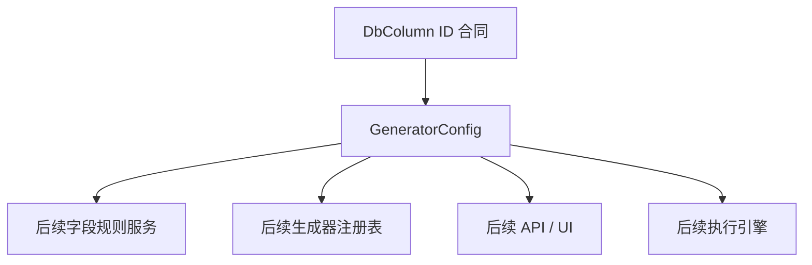

# Design Document

## Overview

`phase-02-field-generation-rule-model` 交付字段生成规则模型。该规格基于 `docs/data-model.md` §7 `GeneratorConfig`、§11.3 `data_mapping_type`、§11.4 `config_status`、D-02 和 D-03，在 Go 后端领域层定义可序列化、可校验、可供下游复用的字段规则模型合同。

本规格只覆盖 Phase 2 的领域模型、字符串枚举、基础校验和 JSON 序列化合同；不实现生成器实现、生成器注册表、参数 schema 校验、预览生成、API、UI、本地持久化 migration 或执行引擎。

### Goals

- 定义 `GeneratorConfig` 的稳定领域模型，用于表达字段与生成器的一对一绑定关系。
- 稳定 `DataMappingType`、`ConfigStatus` 和 `GeneratorParams` 的字符串/JSON 合同。
- 明确与上游 `phase-02-table-field-constraint-model`、`phase-02-relation-model` 的只读引用边界。
- 为下游字段规则服务、生成器注册表、API/UI 和执行引擎提供稳定字段名、枚举值和校验 issue 结构。

### Non-Goals

- 不实现具体生成器、生成器注册表、参数 schema 校验或预览生成。
- 不实现字段规则保存服务、Wails binding、前端页面或本地存储 migration。
- 不访问真实数据库，不新增数据库驱动，不实现 Schema 扫描结果到规则的自动推断。
- 不校验 `columnId` 是否真实存在、是否唯一绑定到某列、`generatorName` 是否已注册、`params` 是否符合具体生成器 schema；这些属于后续 service、repository 或 generator registry 规格。

## Source References

| Source | Used For |
|--------|----------|
| `docs/data-model.md` §7 `GeneratorConfig` | 字段规则模型字段、字段一对一绑定、Schema 层归属 |
| `docs/data-model.md` §11.3 | `DataMappingType` 稳定枚举值 |
| `docs/data-model.md` §11.4 | `ConfigStatus` 稳定枚举值 |
| `docs/data-model.md` D-02 | `GeneratorConfig` 与 `DbColumn` 分离存储的职责边界 |
| `docs/data-model.md` D-03 | 字段规则归属 Schema 层，不归属 Project 层 |
| `phase-02-table-field-constraint-model` | 上游 `DbColumn` ID、schema validation issue 类型和值语义 |
| `phase-02-relation-model` | 关系模型只读引用边界，避免字段规则吸收执行关系职责 |
| `.kiro/steering/product.md` | 字段规则与执行规则分离、约束优先、外键字段优先遵从关联关系 |
| `.kiro/steering/tech.md` / `.kiro/steering/structure.md` | Domain 不依赖 UI / Wails / adapter，生成器通过统一框架扩展 |

## Boundary Commitments

### Upstream Readiness Assumption

- `phase-02-table-field-constraint-model` 已批准；实现本规格前必须确认上游表字段模型和 schema validation issue 合同已落地。
- 本规格只通过 `columnId` 保存对 `DbColumn` 的只读引用，不重新定义 `DbColumn`、表约束或关系模型。
- 若实现时发现上游 issue 类型或包路径尚未存在，应先同步上游规格实现，不得在 `internal/domain/rule` 中临时复制同名 schema issue 类型。

### This Spec Owns

- `internal/domain/rule` 中 `GeneratorConfig`、`DataMappingType`、`ConfigStatus`、`GeneratorParams` 的领域表达。
- 稳定 Go 字段、JSON 字段名、字符串枚举值和 JSON 往返行为。
- 字段级基础校验入口，包括必填字段、ID 形状、字符串安全性、枚举合法性、时间戳 draft/persisted 模式和 JSON presence 诊断。
- 本规格内新增的字段规则校验错误码应追加到上游 schema validation 合同中；issue 结构必须复用上游 schema domain 的字段级 issue 形状，不在 `internal/domain/rule` 中定义平行 issue 类型。
- 单元测试，覆盖模型创建、枚举稳定性、JSON 往返、presence 诊断、基础校验和 out-of-scope 边界。

### Out of Boundary

- `columnId` 对应字段是否存在、是否属于某个 schema、是否已被另一条规则绑定，由后续 repository/service 规格校验。
- `generatorName` 是否存在、是否启用、是否兼容目标字段类型，由后续 generator registry / service 规格校验。
- `params` 的具体结构和 generator-specific schema 校验，由后续 generator registry / generator implementation 规格校验。
- Schema 重扫后如何把规则标记为 `NEEDS_REVIEW`，由后续 Schema diff / service 规格实现；本规格只定义状态值。
- 外键字段如何优先从关系取值、执行时如何调用生成器、如何写回数据库，均属于后续 engine/service 规格。

### Allowed Dependencies

- Go 标准库。
- 上游 `phase-02-table-field-constraint-model` 的 `DbColumn` ID 合同和 schema validation issue 结构。
- `docs/data-model.md` 作为字段和枚举合同来源。
- `internal/config` 仅作为 issue JSON 形状参考；domain 包不直接 import `internal/config`。
- 不依赖 Wails、Vue、store、service、engine、generator registry、真实数据库驱动或 `internal/dbx/schema`。

### Revalidation Triggers

- `GeneratorConfig` 字段、JSON 标签、必填性、ID 语义或时间戳规则变化。
- `DataMappingType`、`ConfigStatus` 枚举字符串变化。
- `GeneratorParams` 的 JSON 空值、非法 JSON 或敏感值边界变化。
- 校验 issue 结构、错误码、severity 或字段路径规则变化。
- 本规格开始直接依赖 store、service、engine、generator registry、Wails、Vue 或真实数据库驱动。

## Architecture



**Architecture Integration**:

- Selected pattern: 领域模型和值对象优先，校验函数保持纯内存、无外部副作用。
- Domain/feature boundaries: `internal/domain/rule` 不导入 Wails、Vue、store、service、engine、generator registry 或数据库驱动。
- Existing patterns preserved: 字段级 issue 形状与已有 config/API issue 风格兼容，但不形成包依赖。
- Data model alignment: 字段和枚举以 `docs/data-model.md` 为主来源，Go JSON 使用 lower camelCase，对应数据模型中的 snake_case 字段。
- Rule ownership: `GeneratorConfig` 绑定 `DbColumn`，归属 Schema 层；Project 级行数、清空策略、关系倍数和执行顺序不进入本模型。

## File Structure Plan

### Directory Structure

```text
internal/domain/rule/
├── generatorconfig.go       # GeneratorConfig 实体和字段规则绑定合同
├── datamappingtype.go       # DataMappingType 稳定字符串枚举
├── configstatus.go          # ConfigStatus 稳定字符串枚举
├── generatorparams.go       # GeneratorParams JSON 值对象
├── validation.go            # 字段规则基础校验入口和 issue 合同
├── rule_json.go             # JSON presence 检查和 Decode*JSON 辅助函数
└── rule_test.go             # 模型、枚举、JSON、校验和边界测试
```

### Modified Files

- `internal/domain/rule/generatorconfig.go` — 新增 `GeneratorConfig`，表达字段到生成器的一对一配置绑定。
- `internal/domain/rule/datamappingtype.go` — 新增 `DataMappingType`，稳定生成器输出值的逻辑映射类型。
- `internal/domain/rule/configstatus.go` — 新增 `ConfigStatus`，稳定字段规则有效性状态。
- `internal/domain/rule/generatorparams.go` — 新增 `GeneratorParams`，以原始 JSON 保存生成器参数并提供基础合法性检查。
- `internal/domain/rule/validation.go` — 新增基础校验入口、错误码和字段级 issue 返回能力。
- `internal/domain/rule/rule_json.go` — 新增 JSON presence 检查和反序列化辅助，用于区分必填字段缺失、显式零值、显式 `false` 和 `null`。
- `internal/domain/rule/rule_test.go` — 覆盖 1.1-5.5 的模型、枚举、序列化、presence 检查、校验和边界测试。

## Requirements Traceability

| Requirement | Summary | Components | Interfaces / Tests |
|-------------|---------|------------|--------------------|
| 1.1 | 表达稳定身份、父级引用和核心字段 | GeneratorConfig, GeneratorParams | Go struct 字段表 |
| 1.2 | 提供稳定 JSON 字段名和枚举值 | GeneratorConfig, DataMappingType, ConfigStatus | JSON 标签、枚举测试 |
| 1.3 | 缺少必填字段或引用不合法返回字段级错误 | RuleValidation, RuleJSON | ValidateGeneratorConfig / DecodeGeneratorConfigJSON |
| 1.4 | 不实现服务、API、UI、数据库访问或执行算法 | Boundary Commitments | 包依赖边界测试或静态检查 |
| 1.5 | 单元测试覆盖模型创建、校验、枚举和序列化 | rule_test.go | go test |
| 2.1 | 表达枚举和状态边界 | DataMappingType, ConfigStatus | Go constants |
| 2.2 | 稳定可序列化枚举值 | DataMappingType, ConfigStatus | JSON 往返测试 |
| 2.3 | 非法枚举或状态返回字段级错误 | RuleValidation | invalid enum 测试 |
| 2.4 | 不吸收执行状态或 UI 状态 | Boundary Commitments | out-of-scope 测试 |
| 2.5 | 测试覆盖枚举与状态边界 | rule_test.go | go test |
| 3.1 | 表达上游父级引用和下游身份合同 | GeneratorConfig | `columnId` |
| 3.2 | 下游消费稳定字段和枚举 | 全部模型 | JSON 合同测试 |
| 3.3 | 引用不合法返回字段级错误；本规格内限定为 ID 非正、必填引用缺失等对象内部可判定问题 | RuleValidation | ID 形状校验测试 |
| 3.4 | 不实现超边界集成 | Boundary Commitments | 包依赖边界 |
| 3.5 | 测试覆盖上游引用和下游合同 | rule_test.go | go test |
| 4.1 | 支持基础校验能力 | RuleValidation | ValidateGeneratorConfig, ValidateGeneratorParams |
| 4.2 | 校验错误字段路径稳定 | SchemaValidationIssue | path 断言测试 |
| 4.3 | 必填和引用非法返回字段级错误 | RuleJSON, RuleValidation | Decode*JSON presence 测试 |
| 4.4 | 校验不访问外部资源 | RuleValidation | 纯函数边界 |
| 4.5 | 测试覆盖多错误返回和边界行为 | rule_test.go | 多 issue 测试 |
| 5.1 | 模型可创建和加载 | GeneratorConfig | 构造测试 |
| 5.2 | JSON 字段名和枚举可序列化 | 全部模型 | marshal / unmarshal 测试 |
| 5.3 | 反序列化非法输入可诊断 | RuleJSON, GeneratorParams | Decode*JSON 测试 |
| 5.4 | 序列化不引入 API/UI/DB 访问 | Boundary Commitments | 包依赖边界 |
| 5.5 | 测试覆盖 JSON 往返和枚举稳定性 | rule_test.go | go test |

## Components and Interfaces

| Component | Domain/Layer | Intent | Req Coverage | Key Dependencies | Contracts |
|-----------|--------------|--------|--------------|------------------|-----------|
| GeneratorConfig | Domain | 表达字段级生成器绑定与参数 | 1.1-5.5 | DbColumn ID 合同 | Go, JSON |
| DataMappingType | Domain enum | 表达生成器输出值的逻辑映射类型 | 2.1-2.5 | 无 | Go enum, JSON string |
| ConfigStatus | Domain enum | 表达结构变更后的配置有效性状态 | 2.1-2.5 | 无 | Go enum, JSON string |
| GeneratorParams | Domain value object | 保存生成器自定义参数的原始 JSON | 1.1, 4.1, 5.2, 5.3 | JSON stdlib | Go, JSON raw payload |
| RuleValidation | Domain | 字段级基础校验和 JSON presence 诊断 | 1.3, 4.1-4.4 | SchemaValidationIssue 合同 | Go functions |

### Domain Layer

#### GeneratorConfig

| Field | Detail |
|-------|--------|
| Intent | 表达某个 `DbColumn` 绑定的生成器名称、输出映射类型、参数和有效性状态 |
| Requirements | 1.1, 1.2, 3.1, 5.1 |

**Responsibilities & Constraints**

- 保存规则主键、`ColumnID` 父级引用、生成器标识、输出映射类型、原始参数、配置状态和审计时间。
- 与 `DbColumn` 一对一绑定；唯一性由后续 repository/service 检查，本规格只表达合同。
- 不保存 Project 行数、清空策略、关系倍数、执行顺序、预览结果或运行时生成状态。
- `GeneratorName` 只是稳定标识字符串；是否存在于注册表、是否支持目标字段类型，由后续 generator registry/service 检查。

#### DataMappingType

| Field | Detail |
|-------|--------|
| Intent | 表达生成器输出值在执行引擎中的逻辑类型映射 |
| Requirements | 2.1, 2.2, 2.3, 5.2 |

**Responsibilities & Constraints**

- 使用 `docs/data-model.md` §11.3 的稳定字符串值。
- 不直接等同于数据库原生类型，也不替代 `ColumnLogicalType`；它只描述生成器输出值的基础映射类别。
- 未知值不得静默接受，必须通过校验返回字段级 issue。

#### ConfigStatus

| Field | Detail |
|-------|--------|
| Intent | 表达字段规则在结构变更后的可用性状态 |
| Requirements | 2.1, 2.2, 2.3, 5.2 |

**Responsibilities & Constraints**

- 使用 `docs/data-model.md` §11.4 的稳定字符串值。
- `ACTIVE` 表示规则当前可用于后续生成流程。
- `NEEDS_REVIEW` 表示字段类型或约束变更后需要人工核查。
- 本规格只定义状态，不实现 Schema 重扫 diff 或自动状态迁移流程。

#### GeneratorParams

| Field | Detail |
|-------|--------|
| Intent | 以原始 JSON 保存具体生成器自定义参数，避免 domain 层提前绑定具体生成器 schema |
| Requirements | 1.1, 4.1, 5.2, 5.3 |

**Responsibilities & Constraints**

- 使用 JSON 原始 payload 表达参数，推荐实现为 `json.RawMessage` 的轻量 wrapper 或结构体字段。
- `nil` 或 JSON `null` 表示无参数；空对象 `{}` 表示显式提供空参数对象，两者在 JSON 往返中应保持可区分或有明确归一化规则。
- 基础校验只检查 payload 是否为合法 JSON，且不得包含明显不允许的敏感凭据字段名；不校验具体参数 schema。
- 参数 schema、默认值补全、字段类型兼容性和业务范围检查由后续 generator registry/service 规格负责。

## Data Models

### GeneratorConfig

| Go 字段 | JSON 字段 | 类型 | 必填性 | 校验规则 | 数据模型来源 |
|---------|-----------|------|--------|----------|--------------|
| `ID` | `id` | `int64` | required | draft `>= 0`；persisted `> 0` | `GeneratorConfig.id` |
| `ColumnID` | `columnId` | `int64` | required | 必须 `> 0`，引用上游 `DbColumn.ID` | `GeneratorConfig.column_id` |
| `GeneratorName` | `generatorName` | `string` | required | trim 后非空，长度不超过 100，不含控制字符或路径分隔符；是否已注册不在本规格校验 | `GeneratorConfig.generator_name` |
| `DataMappingType` | `dataMappingType` | `DataMappingType` | required | 必须为稳定枚举值之一 | `GeneratorConfig.data_mapping_type` |
| `Params` | `params` | `GeneratorParams` | optional nullable | `nil` / `null` 表示无参数；非空时必须是合法 JSON；具体 schema 不在本规格校验 | `GeneratorConfig.params` |
| `ConfigStatus` | `configStatus` | `ConfigStatus` | required | 必须为稳定枚举值之一；新建默认值可由构造函数设为 `ACTIVE` | `GeneratorConfig.config_status` |
| `CreatedAt` | `createdAt` | `time.Time` | persisted required | draft 可零；persisted 必须非零 | `GeneratorConfig.created_at` |
| `UpdatedAt` | `updatedAt` | `time.Time` | persisted required | draft 可零；非零时不得早于 `CreatedAt` | `GeneratorConfig.updated_at` |

**Invariants**:

- `ColumnID` 是唯一绑定语义的业务键，但唯一性需要 repository/service 访问持久化层才能确认；domain 层不检查全局唯一性。
- `GeneratorName` 的取值空间由后续 generator registry 定义；本规格只保证字符串形状安全。
- `Params` 不得保存 API Key、数据库密码、令牌等敏感凭据。若后续生成器需要凭据，应通过安全存储或 provider 引用，不应把明文放入 `params`。

### DataMappingType

| Go 常量 | JSON 字符串 | 语义 | 数据模型来源 |
|---------|-------------|------|--------------|
| `DataMappingTypeText` | `text` | 字符串文本输出 | `docs/data-model.md` §11.3 |
| `DataMappingTypeInteger` | `integer` | 整型数值输出 | `docs/data-model.md` §11.3 |
| `DataMappingTypeFloat` | `float` | 浮点数值输出 | `docs/data-model.md` §11.3 |
| `DataMappingTypeBoolean` | `boolean` | 布尔值输出 | `docs/data-model.md` §11.3 |
| `DataMappingTypeDatetime` | `datetime` | 日期 / 时间输出 | `docs/data-model.md` §11.3 |

未知枚举值不得静默接受。反序列化后或显式校验时发现未知值，必须返回字段级 issue，路径为 `dataMappingType`。

### ConfigStatus

| Go 常量 | JSON 字符串 | 语义 | 数据模型来源 |
|---------|-------------|------|--------------|
| `ConfigStatusActive` | `ACTIVE` | 配置有效，可用于后续生成流程 | `docs/data-model.md` §11.4 |
| `ConfigStatusNeedsReview` | `NEEDS_REVIEW` | 表结构发生变更后需要人工核查 | `docs/data-model.md` §11.4 |

未知枚举值不得静默接受。反序列化后或显式校验时发现未知值，必须返回字段级 issue，路径为 `configStatus`。

### GeneratorParams

| Go 字段 / 表达 | JSON 字段 | 类型 | 必填性 | 校验规则 | 说明 |
|----------------|-----------|------|--------|----------|------|
| `Raw` 或 wrapper payload | `params` | `json.RawMessage` / nullable JSON | optional nullable | `nil`、`null`、对象、数组、字符串、数字、布尔均可作为 JSON；非法 JSON 返回 issue | 具体结构由生成器定义 |

推荐实现接口：

```go
ValidateGeneratorConfig(config GeneratorConfig, mode SchemaValidationMode) []SchemaValidationIssue
ValidateGeneratorParams(params GeneratorParams) []SchemaValidationIssue
DecodeGeneratorConfigJSON(data []byte, mode SchemaValidationMode) (GeneratorConfig, []SchemaValidationIssue)
```

实现必须复用项目上游 schema domain 已提供的通用 `SchemaValidationMode`、`SchemaValidationIssue`、`SchemaIssueSeverity` 和 `SchemaIssueCode` 合同；字段规则只允许在既有 `SchemaIssueCode` 类型上追加必要错误码，不得为了本规格在 `internal/domain/rule` 中声明平行的 issue、severity 或 validation mode 类型。

## Validation Design

### In-Scope Reference Validation Boundary

requirements 中的“引用不合法”在本规格内限定为当前对象内部即可判断的引用形状错误，包括：主键 ID 为负数、持久化模式主键 ID 非正、`columnId <= 0`、必填引用字段在 JSON 中缺失。真实列是否存在、规则是否已绑定同一列、字段是否仍存在于最新 Schema、字段类型是否与生成器兼容，均属于后续 service / repository / generator registry 规格。

### Validation Modes

本规格复用上游 `SchemaValidationModeDraft` 与 `SchemaValidationModePersisted` 两类校验模式，不在 `internal/domain/rule` 中声明平行的 mode 类型。

| Mode | 适用对象 | ID 校验 | 时间校验 |
|------|----------|---------|----------|
| `draft` | 尚未持久化的新建或编辑中对象 | 主键 ID 可为 0，不得为负数；`columnId` 必须大于 0 | `createdAt`、`updatedAt` 可为零；两者都非零时要求 `updatedAt >= createdAt` |
| `persisted` | 已持久化或准备作为稳定快照输出的对象 | 主键 ID 必须大于 0；`columnId` 必须大于 0 | `createdAt`、`updatedAt` 必须非零；`updatedAt >= createdAt` |

### Validation Issue Contract

字段级 issue 必须复用上游 schema domain 的稳定 JSON 形状：`SchemaValidationIssue`、`SchemaIssueCode`、`SchemaIssueSeverity` 和 `SchemaValidationMode`。本规格不得在 `internal/domain/rule` 中定义 `RuleValidationIssue`、`RuleIssueCode`、`RuleIssueSeverity` 或平行 validation mode 类型。

字段规则需要的错误码应作为上游 `SchemaIssueCode` 类型的新常量追加；返回结构、severity 字符串、字段路径和安全消息规则保持与 schema domain 一致。

| Issue Code | Severity | Typical Path | 触发场景 |
|------------|----------|--------------|----------|
| `REQUIRED` | `error` | `columnId`, `generatorName`, `dataMappingType`, `configStatus` | 必填字段缺失或空白 |
| `INVALID_ID` | `error` | `id`, `columnId` | ID 不满足 draft/persisted 模式规则 |
| `INVALID_ENUM` | `error` | `dataMappingType`, `configStatus` | 枚举值未知 |
| `INVALID_JSON` | `error` | `params` | 参数 payload 不是合法 JSON |
| `INVALID_TEXT` | `error` | `generatorName` | 字符串含控制字符、路径分隔符或超长 |
| `INVALID_TIME_RANGE` | `error` | `updatedAt` | 更新时间早于创建时间 |
| `SENSITIVE_VALUE_NOT_ALLOWED` | `error` | `params` | 参数中出现明显不允许保存的敏感凭据字段名 |

### Domain-Only Validation Rules

`ValidateGeneratorConfig` 必须覆盖：

- `ID` 按 draft/persisted 模式校验。
- `ColumnID > 0`。
- `GeneratorName` trim 后非空、长度不超过 100，不含控制字符和路径分隔符。
- `DataMappingType` 必须为 `text`、`integer`、`float`、`boolean`、`datetime` 之一。
- `ConfigStatus` 必须为 `ACTIVE` 或 `NEEDS_REVIEW`。
- `Params` 非空时必须是合法 JSON；不得包含明显敏感字段名，例如 `password`、`token`、`secret`、`apiKey`。
- persisted 模式下 `CreatedAt`、`UpdatedAt` 必须非零；两者非零时 `UpdatedAt >= CreatedAt`。

`DecodeGeneratorConfigJSON` 必须额外覆盖：

- 区分必填字段缺失和零值，例如缺失 `columnId` 与 `columnId: 0` 均返回可诊断 issue，但路径和消息应稳定。
- 区分 `params` 缺失、`params: null` 和非法 JSON。
- 遇到非法 JSON 不 panic，返回字段级或 payload 级 issue。

### Explicitly Deferred Validation

以下校验不得在本规格的 domain 层实现：

- `columnId` 是否真实存在或是否属于当前 Schema。
- `columnId` 是否已经绑定其他 `GeneratorConfig`。
- `generatorName` 是否已注册、是否启用、是否支持当前数据库或字段类型。
- `params` 是否符合具体生成器 schema、范围是否合法、枚举列表是否为空。
- `DataMappingType` 是否兼容上游 `ColumnLogicalType`。
- Schema 重扫后是否需要自动把状态切换为 `NEEDS_REVIEW`。
- 外键字段是否应该绕过普通生成器并从关系上下文取值。

## Error Handling

- 校验返回字段级错误集合，不 panic。
- 错误包含字段路径、错误码、severity 和安全消息。
- 错误消息不得包含数据库凭据、用户 SQL、生成数据或 `params` 原始敏感值。
- JSON 解码错误应转换为可诊断 issue，而不是直接暴露底层解析器长错误给 UI。

## Testing Strategy

- 覆盖 `DataMappingType` 和 `ConfigStatus` 的字符串稳定性。
- 覆盖 `GeneratorConfig` 的 JSON 往返，确保字段名使用 lower camelCase。
- 覆盖 `params` 缺失、`null`、空对象、合法复杂 JSON 和非法 JSON。
- 覆盖 draft / persisted 模式下 ID 和时间戳校验。
- 覆盖必填字段缺失、非法枚举、非法 `generatorName`、多错误返回和敏感字段名拒绝。
- 覆盖 out-of-scope 能力未被模型吸收，例如不导入 store、service、engine、generator registry、Wails、Vue 或真实数据库驱动。

## Implementation Notes

- Go 后端导出类型、字段、常量和导出方法必须按 `.kiro/steering/tech.md` 添加注释。
- 枚举常量必须保留数据模型中的字符串值，不得为了 Go 命名风格改变 JSON 值。
- 实现前必须先通过 `0.1` 上游门禁，确认 `internal/domain/schema` 已提供 `SchemaValidationIssue`、`SchemaIssueCode`、`SchemaIssueSeverity` 和 `SchemaValidationMode`；若缺失，应停止本规格实现并先补齐上游规格，不得在 `internal/domain/rule` 中临时定义替代类型。
- 本规格只建立 domain 合同，不引入数据库唯一约束、migration 或服务编排。