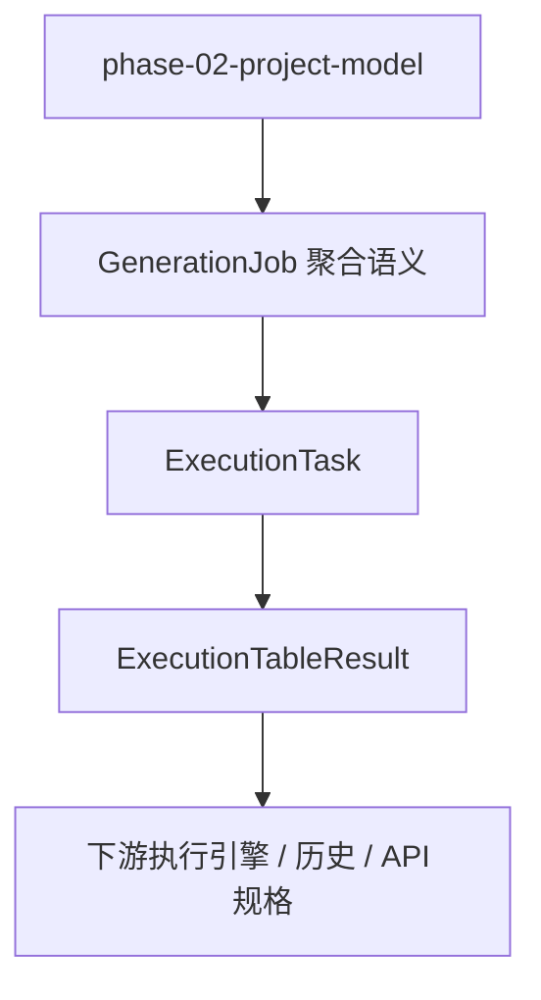

# Design Document

## Overview

`phase-02-generation-job-model` 交付生成任务与执行历史模型。设计以 `docs/data-model.md` 的“§9 执行历史”和“§11.6 / §11.7 枚举值定义”为主要合同来源，定义 `ExecutionTask`、`ExecutionTableResult`、任务状态、表级状态、时间、写入行数和错误快照。

本规格面向 Go 后端领域层，定义模型、枚举、值对象、基础校验和 JSON 序列化合同；不实现 `执行生命周期、进度事件、批处理写入、事务回滚、API/UI。`

### Goals

- 定义 `生成任务与执行历史模型` 的核心领域模型。
- 明确上游依赖 `phase-02-project-model` 的只读引用边界。
- 对齐 `docs/data-model.md` 中 `ExecutionTask`、`ExecutionTableResult` 和执行状态枚举的稳定合同。
- 为下游规格提供稳定字段名、枚举值和校验错误结构。

### Non-Goals

- 执行生命周期、状态流转算法、进度事件、批处理写入、事务回滚、API/UI。
- 不新增真实数据库驱动。
- 不新增 Wails binding 或前端代码。
- 不新增本地存储迁移或数据库访问实现。

## Boundary Commitments

### This Spec Owns

- `ExecutionTask` 和 `ExecutionTableResult` 的领域实体和值对象。
- `GenerationJob` 的领域聚合/输入语义，用于表达一次待执行生成任务与其表级结果集合；它不在本规格中新增独立持久化表。
- 稳定字符串枚举和状态值。
- 字段级基础校验错误。
- JSON 序列化、反序列化和单元测试。

### Out of Boundary

- 执行生命周期、状态流转算法、进度事件、批处理写入、事务回滚、API/UI。
- 执行计划构建、依赖排序、真实写入和历史持久化。
- 任何跨阶段的服务编排、算法实现或 UI 工作流。

### Allowed Dependencies

- Go 标准库和现有项目模块结构。
- 上游规格 `phase-02-project-model` 的稳定 ID、枚举和值对象。
- `docs/data-model.md` 的以下合同：
  - `§9 执行历史`：`ExecutionTask`、`ExecutionTableResult` 字段定义。
  - `§11.6 ExecutionTask.status`：任务状态枚举。
  - `§11.7 ExecutionTableResult.status`：表级结果状态枚举。
  - `D-07：ExecutionTableResult 保留名称快照`。
- 不依赖 Wails、Vue、真实数据库驱动或未来执行引擎。

### Revalidation Triggers

- 模型字段名、JSON 标签或身份字段变化。
- 枚举字符串值变化。
- 校验错误结构变化。
- JSON presence 诊断策略变化，尤其是必填字段缺失与零值非法之间的错误码区分变化。
- `ExecutionErrorSnapshot` 与持久化层 `error_message` 的映射策略变化，或未来新增结构化错误持久化字段。
- `docs/data-model.md` 中执行历史合同变化。
- 上游引用或下游消费合同变化。

## Architecture



- Selected pattern: 领域模型和值对象优先。
- Domain/feature boundaries: 本规格只定义 `生成任务与执行历史模型`。
- Existing patterns preserved: Domain does not know UI or Wails；Adapter owns external differences。
- Persistence mapping: `docs/data-model.md` 中的持久化实体为 `ExecutionTask` 和 `ExecutionTableResult`；`GenerationJob` 只作为领域侧聚合/输入语义，不要求新增表结构。

## File Structure Plan

### Directory Structure

```text
internal/domain/execution/generationjob.go
internal/domain/execution/executiontask.go
internal/domain/execution/executiontableresult.go
internal/domain/execution/status.go
internal/domain/execution/errorsnapshot.go
internal/domain/execution/validation.go
internal/domain/execution/execution_test.go
```

### Modified Files

- `internal/domain/execution/generationjob.go` — 定义一次生成任务的领域聚合语义，组合 `ExecutionTask` 和表级结果集合，不承载执行算法。
- `internal/domain/execution/executiontask.go` — 定义执行任务主记录。
- `internal/domain/execution/executiontableresult.go` — 定义单表执行结果和名称快照。
- `internal/domain/execution/status.go` — 定义任务状态和表级状态枚举。
- `internal/domain/execution/errorsnapshot.go` — 定义安全错误快照值对象。
- `internal/domain/execution/validation.go` — 定义字段级校验错误、模型校验函数和 JSON presence 诊断辅助函数。
- `internal/domain/execution/execution_test.go` — 覆盖模型创建、校验、枚举和序列化行为。

## Components and Interfaces

| Component | Domain/Layer | Intent | Req Coverage | Contracts |
|-----------|--------------|--------|--------------|-----------|
| GenerationJob | Domain | 表达一次待执行或已执行生成任务的聚合语义，组合任务主记录与表级结果 | 1, 3, 4, 5 | Go/JSON |
| ExecutionTask | Domain | 执行历史主记录，对齐 `docs/data-model.md §9` | 1-5 | Go/JSON |
| ExecutionTableResult | Domain | 单表执行结果与名称快照，对齐 `docs/data-model.md §9` 和 D-07 | 1-5 | Go/JSON |
| ExecutionTaskStatus | Domain | 任务状态枚举，对齐 `docs/data-model.md §11.6` | 2, 5 | Go/JSON |
| ExecutionTableStatus | Domain | 表级状态枚举，对齐 `docs/data-model.md §11.7` | 2, 5 | Go/JSON |
| ExecutionErrorSnapshot | Domain | 安全错误快照，承载失败摘要，不泄露敏感信息；当前持久化合同可降级映射到 `error_message` 安全摘要 | 1, 4, 5 | Go/JSON |
| ValidationIssue | Domain | 字段级校验错误 | 1, 4, 5 | Go/JSON |
| JSONPresenceValidation | Domain helper | 反序列化时区分必填字段缺失与 Go 零值，返回稳定字段路径错误 | 1, 4, 5 | Go/JSON |

## Data Models

### GenerationJob

`GenerationJob` 是本规格内的领域聚合语义，用于让下游执行引擎或服务规格复用同一任务合同。它不对应 `docs/data-model.md` 中的独立表，也不在本规格中实现执行生命周期。

| Go Field | JSON Field | Type | Required | Source / Rule |
|---|---|---|---|---|
| `Task` | `task` | `ExecutionTask` | 是 | 执行任务主记录 |
| `TableResults` | `tableResults` | `[]ExecutionTableResult` | 否 | 单表执行结果集合，可为空 |

### ExecutionTask

对齐 `docs/data-model.md §9 ExecutionTask`。

| Go Field | JSON Field | Type | Required | Source / Rule |
|---|---|---|---|---|
| `ID` | `id` | `int64` | 是 | 主键；新建未持久化对象可为 0，但加载/序列化历史记录时必须为正数 |
| `ProjectID` | `projectId` | `int64` | 是 | FK → `Project`；必须为正数 |
| `TaskName` | `taskName` | `string` | 是 | 任务名称，不能为空，最大长度 200 |
| `Status` | `status` | `ExecutionTaskStatus` | 是 | 枚举见 `ExecutionTaskStatus` |
| `StartedAt` | `startedAt` | `time.Time` | 是 | 执行开始时间，不能为零值 |
| `EndedAt` | `endedAt,omitempty` | `*time.Time` | 否 | 执行结束时间；为空表示仍在执行中 |
| `CreatedAt` | `createdAt` | `time.Time` | 是 | 创建时间，不能为零值 |

### ExecutionTableResult

对齐 `docs/data-model.md §9 ExecutionTableResult`，并落实 D-07“保留名称快照”。

| Go Field | JSON Field | Type | Required | Source / Rule |
|---|---|---|---|---|
| `ID` | `id` | `int64` | 是 | 主键；新建未持久化对象可为 0，但加载/序列化历史记录时必须为正数 |
| `ExecutionTaskID` | `executionTaskId` | `int64` | 是 | FK → `ExecutionTask`；必须为正数 |
| `TableID` | `tableId,omitempty` | `*int64` | 否 | FK → `DbTable`；表被删除时允许为空 |
| `TableNameSnapshot` | `tableNameSnapshot` | `string` | 是 | 执行时表名快照，不能为空，最大长度 255 |
| `SchemaNameSnapshot` | `schemaNameSnapshot` | `string` | 是 | 执行时 Schema 名快照，不能为空，最大长度 255 |
| `RowsWritten` | `rowsWritten` | `int` | 是 | 成功写入行数，必须大于等于 0 |
| `Status` | `status` | `ExecutionTableStatus` | 是 | 枚举见 `ExecutionTableStatus` |
| `ErrorSnapshot` | `errorSnapshot,omitempty` | `*ExecutionErrorSnapshot` | 否 | 失败时的安全错误快照 |
| `ExecutionOrder` | `executionOrder` | `int` | 是 | 实际执行顺序，必须从 1 开始 |
| `CreatedAt` | `createdAt` | `time.Time` | 是 | 创建时间，不能为零值 |
| `UpdatedAt` | `updatedAt` | `time.Time` | 是 | 更新时间，不能为零值 |

> 说明：`docs/data-model.md` 当前使用 `error_message` 字段。本规格在领域层使用 `ExecutionErrorSnapshot` 表达安全错误快照；后续持久化规格可以将其映射为单字段消息、JSON 文本或扩展列。本规格不实现迁移。

### ExecutionErrorSnapshot

错误快照用于保存失败摘要，便于用户复盘和开发排查。它只保存安全、可展示的信息，不保存数据库凭据、用户 SQL 原文或生成数据内容。

| Go Field | JSON Field | Type | Required | Rule |
|---|---|---|---|---|
| `Code` | `code` | `string` | 是 | 稳定机器可读错误码，不能为空 |
| `Message` | `message` | `string` | 是 | 安全用户可读摘要，不能为空 |
| `FieldPath` | `fieldPath,omitempty` | `string` | 否 | 可选字段路径，如 `tableResults[0].rowsWritten` |
| `OccurredAt` | `occurredAt` | `time.Time` | 是 | 错误发生时间，不能为零值 |

#### Error Snapshot Persistence Mapping

`docs/data-model.md §9` 当前只定义 `ExecutionTableResult.error_message` 单字段。本规格不修改持久化数据模型，也不新增迁移；领域层仍使用结构化 `ExecutionErrorSnapshot` 作为 Go/JSON 合同，以便下游 API、执行引擎和测试能稳定表达错误码、消息、字段路径和发生时间。

后续 store / migration 规格落地时应按以下策略映射：

- 当前数据模型保持单字段 `error_message` 时，只写入 `ExecutionErrorSnapshot.Message` 的安全摘要，不写入数据库凭据、用户 SQL 原文或生成数据内容。
- `ExecutionErrorSnapshot.Code`、`FieldPath`、`OccurredAt` 作为领域/传输层合同保留；若未来需要完整持久化结构化错误，应由持久化规格显式新增 JSON 字段或拆分列，并触发本规格 revalidation。
- 不建议在本规格中把领域模型退化为单个 `ErrorMessage string`，因为这会削弱下游错误分类、字段级定位和安全过滤能力。

## Enums

### ExecutionTaskStatus

对齐 `docs/data-model.md §11.6 ExecutionTask.status`。

| Constant | JSON Value | Meaning |
|---|---|---|
| `ExecutionTaskStatusRunning` | `RUNNING` | 执行中 |
| `ExecutionTaskStatusSuccess` | `SUCCESS` | 全部表写入成功 |
| `ExecutionTaskStatusPartialFailed` | `PARTIAL_FAILED` | 部分表失败，已成功写入的数据保留 |
| `ExecutionTaskStatusFailed` | `FAILED` | 执行失败，任务级错误或全部表失败 |

### ExecutionTableStatus

对齐 `docs/data-model.md §11.7 ExecutionTableResult.status`。

| Constant | JSON Value | Meaning |
|---|---|---|
| `ExecutionTableStatusPending` | `PENDING` | 等待执行，前置依赖表尚未完成 |
| `ExecutionTableStatusRunning` | `RUNNING` | 执行中 |
| `ExecutionTableStatusSuccess` | `SUCCESS` | 写入成功 |
| `ExecutionTableStatusFailed` | `FAILED` | 写入失败 |
| `ExecutionTableStatusSkipped` | `SKIPPED` | 因前置依赖表失败而跳过 |

## Validation Rules

本规格只做静态模型校验，不实现任务状态流转校验、执行计划校验或数据库约束校验。

| Target | Field | Rule | Error Code |
|---|---|---|---|
| `ExecutionTask` | `projectId` | 必须大于 0 | `REQUIRED` / `INVALID_REFERENCE` |
| `ExecutionTask` | `taskName` | 去除空白后不能为空，长度不能超过 200 | `REQUIRED` / `TOO_LONG` |
| `ExecutionTask` | `status` | 必须是 `RUNNING`、`SUCCESS`、`PARTIAL_FAILED`、`FAILED` 之一 | `INVALID_ENUM` |
| `ExecutionTask` | `startedAt` | 不能为零值 | `REQUIRED` |
| `ExecutionTask` | `endedAt` | 非空时不得早于 `startedAt` | `INVALID_TIME_RANGE` |
| `ExecutionTask` | `createdAt` | 不能为零值 | `REQUIRED` |
| `ExecutionTableResult` | `executionTaskId` | 必须大于 0 | `REQUIRED` / `INVALID_REFERENCE` |
| `ExecutionTableResult` | `tableId` | 非空时必须大于 0 | `INVALID_REFERENCE` |
| `ExecutionTableResult` | `tableNameSnapshot` | 去除空白后不能为空，长度不能超过 255 | `REQUIRED` / `TOO_LONG` |
| `ExecutionTableResult` | `schemaNameSnapshot` | 去除空白后不能为空，长度不能超过 255 | `REQUIRED` / `TOO_LONG` |
| `ExecutionTableResult` | `rowsWritten` | 必须大于等于 0 | `INVALID_RANGE` |
| `ExecutionTableResult` | `status` | 必须是 `PENDING`、`RUNNING`、`SUCCESS`、`FAILED`、`SKIPPED` 之一 | `INVALID_ENUM` |
| `ExecutionTableResult` | `executionOrder` | 必须大于等于 1 | `INVALID_RANGE` |
| `ExecutionTableResult` | `createdAt` / `updatedAt` | 不能为零值；`updatedAt` 不得早于 `createdAt` | `REQUIRED` / `INVALID_TIME_RANGE` |
| `ExecutionTableResult` | `errorSnapshot` | `FAILED` 状态应携带错误快照；非失败状态允许为空 | `REQUIRED` |
| `ExecutionErrorSnapshot` | `code` | 不能为空 | `REQUIRED` |
| `ExecutionErrorSnapshot` | `message` | 不能为空，且不得包含敏感字段标记 | `REQUIRED` / `SENSITIVE_VALUE_NOT_ALLOWED` |
| `ExecutionErrorSnapshot` | `occurredAt` | 不能为零值 | `REQUIRED` |
| `GenerationJob` | `task` | 必须通过 `ExecutionTask` 校验 | `INVALID_NESTED_MODEL` |
| `GenerationJob` | `tableResults` | 每个结果必须通过 `ExecutionTableResult` 校验；若 `ExecutionTask.ID > 0`，结果的 `executionTaskId` 应与任务 ID 一致 | `INVALID_REFERENCE` |

## JSON Presence Handling

Go 结构体反序列化后，数值和时间字段的缺失会表现为零值。为满足“缺少必填字段返回字段级校验错误”的要求，实现必须提供 `DecodeExecutionTaskJSON`、`DecodeExecutionTableResultJSON`、`DecodeExecutionErrorSnapshotJSON` 和 `DecodeGenerationJobJSON` 或等价辅助函数。

Presence 诊断规则：

- 解码阶段先检查必填 JSON 字段是否存在，再执行模型基础校验。
- 缺失字段返回 `REQUIRED`，字段路径使用 JSON 字段名，例如 `projectId`、`startedAt`、`tableResults[0].executionTaskId`。
- 字段存在但值非法时返回对应业务错误，例如 `INVALID_REFERENCE`、`INVALID_ENUM`、`INVALID_TIME_RANGE`。
- `omitempty` 字段只在存在时校验值形状，例如 `endedAt`、`tableId`、`errorSnapshot`。
- 解码辅助函数只做 JSON 合同诊断和纯内存校验，不访问 store、service、engine、数据库或外部资源。

## Error Handling

- 校验返回字段级错误集合，不 panic。
- 错误包含字段路径、错误码和安全消息。
- 字段路径使用 JSON 字段名，例如 `projectId`、`tableResults[0].rowsWritten`。
- 错误码使用稳定字符串，至少覆盖：
  - `REQUIRED`
  - `TOO_LONG`
  - `INVALID_ENUM`
  - `INVALID_RANGE`
  - `INVALID_REFERENCE`
  - `INVALID_TIME_RANGE`
  - `INVALID_NESTED_MODEL`
  - `SENSITIVE_VALUE_NOT_ALLOWED`
- 错误不得泄露数据库凭据、用户 SQL 或生成数据。

## Testing Strategy

- 覆盖 `ExecutionTaskStatus` 和 `ExecutionTableStatus` 的字符串稳定性。
- 覆盖 `ExecutionTask`、`ExecutionTableResult`、`ExecutionErrorSnapshot`、`GenerationJob` 的 JSON 往返。
- 覆盖 JSON 必填字段缺失诊断，确保缺失字段返回 `REQUIRED`，字段存在但值非法返回对应业务错误。
- 覆盖字段级基础校验和多错误返回。
- 覆盖名称快照字段在 `tableId` 为空时仍可保留历史可读性。
- 覆盖 `rowsWritten`、`executionOrder`、时间范围和非法枚举的错误路径。
- 覆盖错误快照不包含敏感字段标记。
- 覆盖 `ExecutionErrorSnapshot.Message` 可作为当前 `error_message` 安全摘要映射来源，不把结构化快照要求扩散为本规格内的持久化迁移。
- 覆盖 out-of-scope 能力未被模型吸收，例如不实现状态流转、执行计划、批处理写入、事务回滚、API/UI。
