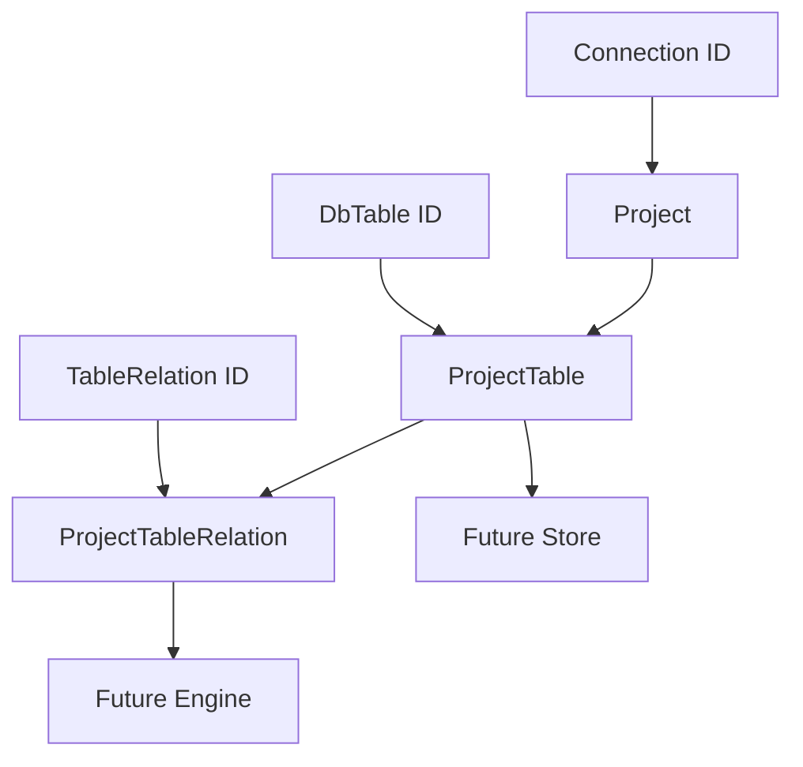
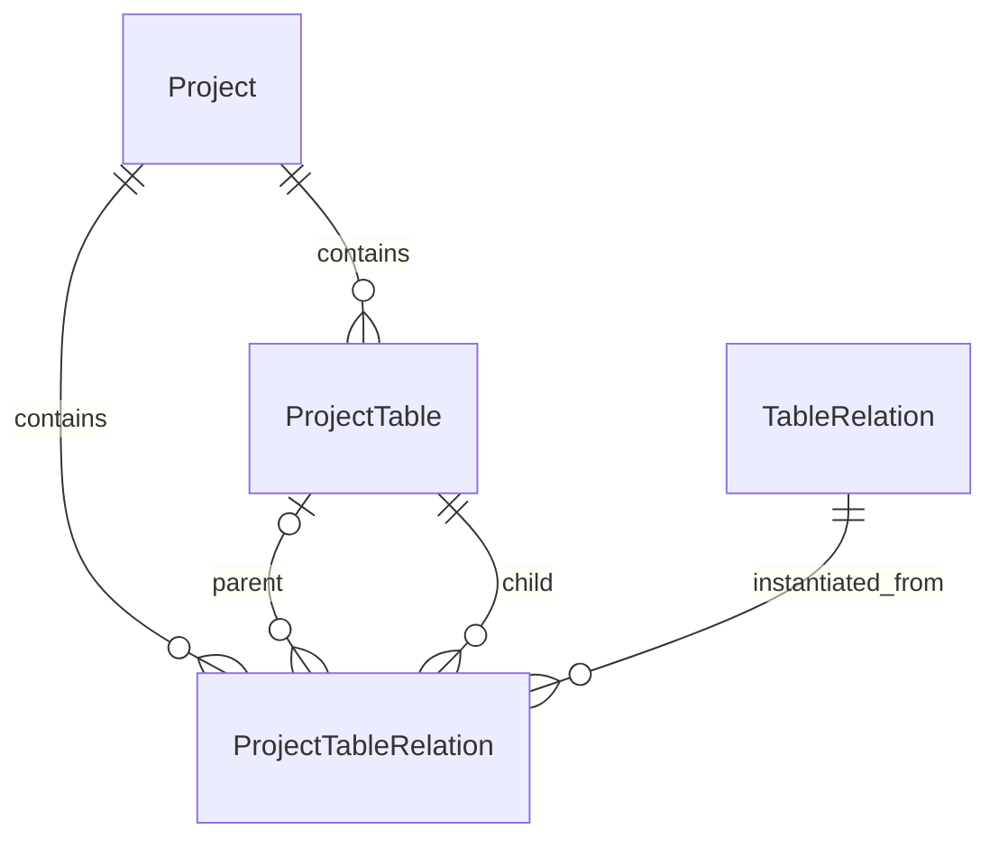

# Design Document

## Overview

`phase-02-project-model` 交付 Project 任务组织模型。该模型负责把目标连接、参与生成的表、表级行数配置、清空策略、执行顺序快照，以及 Project 内实例化后的表关系执行配置组织成稳定的领域合同。

本规格面向 Go 后端领域层，定义 `Project`、`ProjectTable`、`ProjectTableRelation`、`RelationValueSource`、表级行数配置语义、清空策略和字段级基础校验。本规格不实现拓扑排序、执行计划构建、生成引擎、写入数据库、Project API/UI 或本地存储 migration。

### Goals

- 定义 Project 任务组织模型的核心领域实体和值对象。
- 稳定 Project 相关字段名、JSON 标签、枚举字符串和校验错误结构。
- 明确上游 `phase-02-relation-model`、`phase-02-field-generation-rule-model` 的只读引用边界。
- 为后续 Project service、执行引擎、生成任务历史和 API 规格提供可复用合同。

### Non-Goals

- 不实现拓扑排序算法、循环依赖检测或执行顺序计算。
- 不实现执行计划构建、生成引擎、数据库写入、事务回滚或运行时容量校验。
- 不实现 Project API、Wails binding、Vue 页面或本地存储 migration。
- 不重新定义 Connection、DbTable、DbColumn、GeneratorConfig、TableRelation 或字段规则模型。
- 不校验跨对象存在性，例如 table ID 是否真实存在、关系 ID 是否属于当前 schema、字段规则是否完整可用。

## Boundary Commitments

### This Spec Owns

- `internal/domain/project` 中 Project 任务组织领域模型。
- `Project`：一次生成任务配置的聚合根，保存目标连接、名称和说明。
- `ProjectTable`：Project 内单表执行配置，保存目标表引用、行数配置、清空策略和执行顺序快照；只允许挂载到已持久化 Project。
- `ProjectTableRelation`：Project 内从 Schema 层 `TableRelation` 实例化出的运行时关系配置快照；只允许挂载到已持久化 Project。
- `RelationValueSource`：Project 关系取值策略枚举，稳定 `FROM_EXECUTION`、`FROM_DB_QUERY`、`MERGED`。
- Project 子对象采用两阶段创建策略：`ProjectTable` 与 `ProjectTableRelation` 只允许引用已持久化的 `Project`，因此其 `projectId` 必须大于 0；未持久化 Project 草稿只包含 Project 自身字段，不携带子对象集合。

### Out of Boundary

- Schema 层 `TableRelation`、`ForeignKey`、`GeneratorConfig` 的定义和校验。
- Project 保存时的拓扑排序、`executionOrder` 计算和关系实例化流程。
- 根据 Parent / Child / BaseTable / JoinTable 角色推导 `rowCount` 是否应为空的算法。
- `relSourceSQL` 的 SQL 语法检查、执行、参数化、安全审计或查询结果校验。
- JoinTable 容量校验、倍数自动降级、外键值取样和行数运行时计算。
- Store、service、facade、Wails binding、Vue API client 和 UI 工作流。

### Allowed Dependencies

- Go 标准库，主要包括 `encoding/json`、`strings`、`time`。
- 上游 `phase-02-connection-model` 提供的连接 ID 合同；本规格只保存 `connectionId`，不导入连接服务。
- 上游 `phase-02-table-field-constraint-model` 提供的 `DbTable` ID 合同和字段级 validation issue 形状；本规格可复用同一 issue 类型或保持 JSON 兼容的等价结构。
- 上游 `phase-02-relation-model` 提供的 `TableRelation` ID、倍数范围和关系类型语义；本规格只保存 `tableRelationId` 和倍数快照。
- 上游 `phase-02-field-generation-rule-model` 的字段规则边界；本规格不引用 `GeneratorConfig` 字段，只遵守“字段规则属于 Schema 层”的产品规则。
- 不依赖 Wails、Vue、store、service、engine、generator、真实数据库驱动或 `internal/dbx`。

### Revalidation Triggers

- `Project`、`ProjectTable`、`ProjectTableRelation` 字段、JSON 标签、必填性或 ID 语义变化。
- `RelationValueSource` 枚举字符串变化，或新增会影响执行引擎取值策略的枚举值。
- `rowCount`、`truncateBefore`、`executionOrder`、`multiplierMin`、`multiplierMax` 的语义变化。
- `relSourceSQL` 从纯文本合同变成结构化查询、参数化查询或安全策略对象。
- 本规格开始直接依赖 service、store、engine、Wails、Vue、真实数据库驱动或 SQL 执行能力。
- 上游 `TableRelation`、`DbTable`、validation issue 合同变化，导致 Project 关系快照无法兼容。

## Architecture



**Architecture Integration**:

- Selected pattern: 领域模型和值对象优先；所有校验保持纯内存、无外部副作用。
- Domain/feature boundaries: `internal/domain/project` 只表达 Project 配置合同，不导入 service、store、engine、Wails、Vue 或数据库 adapter。
- Existing patterns preserved: Domain does not know UI or Wails；字段规则归属 Schema 层；执行规则归属 Project 层。
- Data model alignment: 字段来源以 `docs/data-model.md` §8 和 §11.5 为准，Go JSON 使用 lower camelCase，对应数据模型中的 snake_case 字段。
- Dependency direction: 下游 service / engine / store 消费 Project 模型；Project 模型不反向依赖任何下游组件。

### Technology Stack

| Layer | Choice / Version | Role in Feature | Notes |
|-------|------------------|-----------------|-------|
| Backend / Domain | Go | 定义领域 struct、枚举、校验函数和 JSON 合同 | 遵守 Go 注释规则 |
| Data / Serialization | JSON via Go stdlib | 提供前后端、store 和测试可复用的稳定序列化合同 | 不引入新依赖 |
| Runtime / UI | N/A | 本规格不实现运行时和 UI | 后续规格消费本合同 |

## File Structure Plan

### Directory Structure

```text
internal/domain/project/
├── project.go                 # Project 聚合根字段、JSON 合同和基础校验入口
├── projecttable.go            # ProjectTable 单表配置、行数和执行顺序快照合同
├── projecttablerelation.go    # ProjectTableRelation 关系实例化快照合同
├── relationvaluesource.go     # RelationValueSource 稳定枚举和合法性判断
├── validation.go              # 字段级校验 issue、presence 检查和 Decode*JSON 辅助函数
└── project_test.go            # 枚举、JSON、校验和边界测试
```

### Modified Files

- `internal/domain/project/project.go` — 新增 `Project`，表达目标连接和 Project 基本信息。
- `internal/domain/project/projecttable.go` — 新增 `ProjectTable`，表达单表参与生成的配置快照。
- `internal/domain/project/projecttablerelation.go` — 新增 `ProjectTableRelation`，表达 Project 内实例化后的表关系执行配置。
- `internal/domain/project/relationvaluesource.go` — 新增 `RelationValueSource` 字符串枚举。
- `internal/domain/project/validation.go` — 新增 Project 领域基础校验、字段路径、错误码和 JSON presence 诊断。
- `internal/domain/project/project_test.go` — 覆盖 1.1-5.5 的模型、枚举、序列化、presence 检查、基础校验和越界防护测试。

## Requirements Traceability

| Requirement | Summary | Components | Interfaces | Flows |
|-------------|---------|------------|------------|-------|
| 1.1 | 表达稳定身份、父级引用和核心字段 | Project, ProjectTable, ProjectTableRelation | Go struct 字段表 | N/A |
| 1.2 | 稳定 JSON 字段名和可序列化枚举 | 全部模型, RelationValueSource | JSON 标签、枚举字符串 | N/A |
| 1.3 | 缺少必填字段或引用不合法返回字段级错误 | ProjectValidation, ProjectJSON | Validate* / Decode*JSON | N/A |
| 1.4 | 不实现服务、API、UI、数据库访问或执行算法 | Boundary Commitments | 包依赖边界 | N/A |
| 1.5 | 单元测试覆盖模型、校验、枚举和序列化 | project_test.go | go test | N/A |
| 2.1 | 表达枚举与状态边界 | RelationValueSource, ProjectTable | 枚举表、rowCount 状态语义 | N/A |
| 2.2 | 稳定可序列化枚举值 | RelationValueSource | JSON 往返、字符串稳定性 | N/A |
| 2.3 | 非法枚举或状态返回字段级错误 | ProjectValidation | invalid enum / invalid state 测试 | N/A |
| 2.4 | 不吸收执行状态或 UI 状态 | Boundary Commitments | out-of-scope 测试 | N/A |
| 2.5 | 测试覆盖枚举与状态边界 | project_test.go | go test | N/A |
| 3.1 | 表达上游引用和下游身份合同 | Project, ProjectTable, ProjectTableRelation | connectionId / tableId / tableRelationId | N/A |
| 3.2 | 下游消费稳定字段和枚举 | 全部模型 | JSON 合同测试 | N/A |
| 3.3 | 本对象内可判定的引用形状错误返回字段级错误 | ProjectValidation | ID、重复项、倍数范围、SQL 条件 | N/A |
| 3.4 | 不实现超边界集成 | Boundary Commitments | 包依赖边界测试 | N/A |
| 3.5 | 测试覆盖上游引用和下游合同 | project_test.go | go test | N/A |
| 4.1 | 支持基础校验能力 | ProjectValidation | ValidateProject / ValidateProjectTable / ValidateProjectTableRelation | N/A |
| 4.2 | 校验错误字段路径稳定 | ProjectValidationIssue | path 断言测试 | N/A |
| 4.3 | 必填和引用非法返回字段级错误 | ProjectJSON, ProjectValidation | Decode*JSON presence 测试 | N/A |
| 4.4 | 校验不访问外部资源 | ProjectValidation | 纯函数边界 | N/A |
| 4.5 | 测试覆盖多错误返回和边界行为 | project_test.go | 多 issue 测试 | N/A |
| 5.1 | 模型可创建和加载 | 全部模型 | 构造测试 | N/A |
| 5.2 | JSON 字段名和枚举可序列化 | 全部模型 | marshal / unmarshal 测试 | N/A |
| 5.3 | 反序列化非法输入可诊断 | ProjectJSON | Decode*JSON 测试 | N/A |
| 5.4 | 序列化不引入 API/UI/DB 访问 | Boundary Commitments | 包依赖边界 | N/A |
| 5.5 | 测试覆盖 JSON 往返和枚举稳定性 | project_test.go | go test | N/A |

## Components and Interfaces

| Component | Domain/Layer | Intent | Req Coverage | Key Dependencies | Contracts |
|-----------|--------------|--------|--------------|------------------|-----------|
| Project | Domain | 表达一次生成任务配置的聚合根 | 1.1-5.5 | Connection ID (P0) | Go, JSON, State |
| ProjectTable | Domain | 表达 Project 内单表执行配置 | 1.1-5.5 | Project ID (P0), DbTable ID (P0) | Go, JSON, State |
| ProjectTableRelation | Domain | 表达 Project 内实例化后的关系执行配置 | 1.1-5.5 | ProjectTable ID (P0), TableRelation ID (P0) | Go, JSON, State |
| RelationValueSource | Domain enum | 表达关系字段值来源策略 | 2.1-2.5, 3.2, 5.2 | TableRelation 语义 (P1) | Go enum, JSON string |
| ProjectValidation | Domain helper | 返回字段级基础校验 issue | 1.3, 4.1-4.5, 5.3 | Validation issue shape (P0) | Go functions |

### Domain Components

#### Project

| Field | Detail |
|-------|--------|
| Intent | 保存一次生成任务配置的顶层身份、目标连接和说明信息 |
| Requirements | 1.1, 1.2, 1.3, 3.1, 5.1, 5.2 |

**Responsibilities & Constraints**

- 作为 Project 配置聚合根，持有 `connectionId` 引用。
- 不直接持有字段生成规则；字段规则仍由 Schema 层 `GeneratorConfig` 管理。
- 不保存执行状态；执行状态属于后续 `GenerationJob` / `ExecutionTask` 模型。

**Dependencies**

- Inbound: Future Project service / store — 保存和加载 Project 配置 (P1)。
- Outbound: Connection ID contract — 只保存目标连接 ID (P0)。
- External: Go stdlib JSON / time — 序列化和时间字段 (P2)。

**Contracts**: State [x]

#### ProjectTable

| Field | Detail |
|-------|--------|
| Intent | 保存 Project 中一张参与生成表的行数、清空策略和执行顺序快照 |
| Requirements | 1.1, 1.2, 2.1, 2.3, 3.1, 4.1, 5.2 |

**Responsibilities & Constraints**

- `rowCount` 使用指针或 nullable 表达，以区分“用户指定 0 行”和“由关系动态推导”。
- `truncateBefore` 只表达执行前清空意图，不实现 TRUNCATE / DELETE 策略选择或数据库执行。
- `executionOrder` 是已计算的快照字段；本规格校验其形状，不计算拓扑排序。
- 同一 Project 中 `(projectId, tableId)` 应唯一；本规格可在 Project 级集合校验中检查重复形状。

**Dependencies**

- Inbound: Future execution engine — 读取 `rowCount`、`truncateBefore`、`executionOrder` (P1)。
- Outbound: Project ID contract — 归属 Project (P0)。
- Outbound: DbTable ID contract — 引用目标表 (P0)。

**Contracts**: State [x]

#### ProjectTableRelation

| Field | Detail |
|-------|--------|
| Intent | 保存 Project 内从 Schema 层关系实例化得到的运行时关系配置快照 |
| Requirements | 1.1, 1.2, 2.1, 2.2, 3.1, 3.3, 4.1, 5.2 |

**Responsibilities & Constraints**

- `tableRelationId` 指向 Schema 层 `TableRelation`，但不导入或复制完整 `TableRelation` 对象。
- `parentProjectTableId` 允许为空，表示上游 Parent / BaseTable 未纳入当前 Project。
- `childProjectTableId` 必须存在，表示只有下游目标表纳入 Project 时才实例化该关系。
- `multiplierMin` / `multiplierMax` 是从 Schema 层关系复制来的只读快照；本规格只校验数值范围。
- `relValueSource` 和 `relSourceSQL` 表达取值策略；本规格不执行 SQL。

**Dependencies**

- Inbound: Future execution engine — 读取倍数和取值策略 (P1)。
- Outbound: TableRelation ID contract — 指向 Schema 层关系定义 (P0)。
- Outbound: ProjectTable ID contract — 指向当前 Project 的上下游表配置 (P0)。

**Contracts**: State [x]

#### RelationValueSource

| Field | Detail |
|-------|--------|
| Intent | 稳定 ProjectTableRelation 的关系取值来源策略 |
| Requirements | 2.1, 2.2, 2.3, 5.2, 5.5 |

**Responsibilities & Constraints**

- 枚举值必须与 `docs/data-model.md` §11.5 一致。
- 未知枚举值不得静默接受，必须返回字段级校验 issue。
- 枚举仅表达策略，不负责执行数据读取或合并。

**Contracts**: State [x]

#### ProjectValidation

| Field | Detail |
|-------|--------|
| Intent | 对 Project 领域对象执行纯内存、字段级基础校验 |
| Requirements | 1.3, 3.3, 4.1, 4.2, 4.3, 4.4, 4.5, 5.3 |

**Responsibilities & Constraints**

- 返回字段级错误集合，不 panic，不访问外部资源。
- 保持错误结构包含 `path`、`code`、`message`；如复用 schema validation issue，应保持 severity 与 JSON 形状兼容。
- JSON presence 辅助函数用于区分字段缺失和 Go 零值。
- 只校验当前对象内部可判定的规则，不做跨对象存在性、字段归属、环检测或 SQL 执行。

**Contracts**: State [x]

## Data Models

### Domain Model



### Project

`Project` 表达一次可复用的生成任务配置，关联目标数据库连接。

| Go 字段 | JSON 字段 | 类型 | 必填性 | 校验规则 | 数据模型来源 |
|---------|-----------|------|--------|----------|--------------|
| `ID` | `id` | `int64` | required | draft `>= 0`；persisted `> 0` | `Project.id` |
| `ConnectionID` | `connectionId` | `int64` | required | 必须 `> 0`；只校验 ID 形状，不校验连接存在性 | `Project.connection_id` |
| `Name` | `name` | `string` | required | trim 后非空；长度不超过 100；不含控制字符 | `Project.name` |
| `Description` | `description` | `string` | optional | 可为空；不含控制字符；不保存敏感连接信息 | `Project.description` |
| `CreatedAt` | `createdAt` | `time.Time` | persisted required | draft 可零；persisted 必须非零 | `Project.created_at` |
| `UpdatedAt` | `updatedAt` | `time.Time` | persisted required | draft 可零；persisted 必须非零，且不得早于 `createdAt` | `Project.updated_at` |

**Invariants**:

- `Project` 不保存字段规则、执行任务状态或生成结果。
- Project 名称唯一性如果需要，应由后续 store / service 结合连接或用户范围校验，本规格不访问存储。
- Project 子对象不支持未持久化草稿挂载；创建流程必须先持久化 Project 获取正数 `projectId`，再创建或校验 ProjectTable / ProjectTableRelation。

### ProjectTable

`ProjectTable` 表达 Project 中一张参与生成表的执行配置。

| Go 字段 | JSON 字段 | 类型 | 必填性 | 校验规则 | 数据模型来源 |
|---------|-----------|------|--------|----------|--------------|
| `ID` | `id` | `int64` | required | draft `>= 0`；persisted `> 0` | `ProjectTable.id` |
| `ProjectID` | `projectId` | `int64` | required | 必须 `> 0`；Project 采用两阶段创建，子对象只能引用已持久化 Project | `ProjectTable.project_id` |
| `TableID` | `tableId` | `int64` | required | 必须 `> 0`；只校验 ID 形状，不校验表存在性 | `ProjectTable.table_id` |
| `RowCount` | `rowCount` | `*int` | required nullable | `nil` 表示由关系动态推导；非 nil 时必须 `>= 0` | `ProjectTable.row_count` |
| `TruncateBefore` | `truncateBefore` | `bool` | required | 必须能区分缺失和 false 零值；缺失返回 presence issue | `ProjectTable.truncate_before` |
| `ExecutionOrder` | `executionOrder` | `int` | required | 必须 `> 0`；排序计算由后续 service 完成 | `ProjectTable.execution_order` |
| `CreatedAt` | `createdAt` | `time.Time` | persisted required | draft 可零；persisted 必须非零 | `ProjectTable.created_at` |
| `UpdatedAt` | `updatedAt` | `time.Time` | persisted required | draft 可零；persisted 必须非零，且不得早于 `createdAt` | `ProjectTable.updated_at` |

**Invariants**:

- `ProjectID` 必须指向已持久化 Project；本规格不支持 `projectId == 0` 的嵌套草稿子对象。
- `rowCount == nil` 是合法状态，用于 Child / JoinTable 等由关系倍数动态推导行数的表。
- `rowCount != nil && *rowCount == 0` 表示显式生成 0 行，与 `nil` 语义不同。
- 本规格不根据 Parent / Child / BaseTable / JoinTable 角色判断 `rowCount` 是否必须为 nil；该判断需要关系图上下文，属于后续 service / engine。
- `executionOrder` 是快照字段，本规格不保证顺序连续、不检查拓扑正确性。
- `(projectId, tableId)` 唯一性可由集合级校验检查重复输入；持久化唯一约束属于后续 store。

### ProjectTableRelation

`ProjectTableRelation` 表达 Project 内从 Schema 层 `TableRelation` 实例化得到的运行时关系执行配置。

| Go 字段 | JSON 字段 | 类型 | 必填性 | 校验规则 | 数据模型来源 |
|---------|-----------|------|--------|----------|--------------|
| `ID` | `id` | `int64` | required | draft `>= 0`；persisted `> 0` | `ProjectTableRelation.id` |
| `ProjectID` | `projectId` | `int64` | required | 必须 `> 0`；Project 采用两阶段创建，子对象只能引用已持久化 Project | `ProjectTableRelation.project_id` |
| `TableRelationID` | `tableRelationId` | `int64` | required | 必须 `> 0`；只校验 ID 形状 | `ProjectTableRelation.table_relation_id` |
| `ParentProjectTableID` | `parentProjectTableId` | `*int64` | required nullable | `nil` 表示上游表未纳入当前 Project；非 nil 时必须 `> 0` | `ProjectTableRelation.parent_project_table_id` |
| `ChildProjectTableID` | `childProjectTableId` | `int64` | required | 必须 `> 0` | `ProjectTableRelation.child_project_table_id` |
| `MultiplierMin` | `multiplierMin` | `int` | required | 必须 `>= 0` | `ProjectTableRelation.multiplier_min` |
| `MultiplierMax` | `multiplierMax` | `int` | required | 必须 `>= multiplierMin` | `ProjectTableRelation.multiplier_max` |
| `RelValueSource` | `relValueSource` | `RelationValueSource` | required | 只能为 `FROM_EXECUTION`、`FROM_DB_QUERY`、`MERGED` | `ProjectTableRelation.rel_value_source` |
| `RelSourceSQL` | `relSourceSql` | `string` | optional | `FROM_DB_QUERY` / `MERGED` 时 trim 后必须非空；`FROM_EXECUTION` 时应为空或被忽略 | `ProjectTableRelation.rel_source_sql` |
| `CreatedAt` | `createdAt` | `time.Time` | persisted required | draft 可零；persisted 必须非零 | `ProjectTableRelation.created_at` |
| `UpdatedAt` | `updatedAt` | `time.Time` | persisted required | draft 可零；persisted 必须非零，且不得早于 `createdAt` | `ProjectTableRelation.updated_at` |

**Invariants**:

- `childProjectTableId` 必须存在，因为只有下游目标表纳入 Project 时才需要实例化关系。
- `parentProjectTableId == nil` 表示上游表未纳入当前 Project，此时关系值不能只依赖本次执行产物，必须通过数据库查询或混合来源补足历史值。
- `multiplierMin == 0` 表示允许某条上游记录没有对应下游记录。
- `multiplierMax == 0` 仅在 `multiplierMin == 0` 时合法，表示固定生成 0 条下游记录。
- `relValueSource` 与 `parentProjectTableId` 组合必须满足：`FROM_EXECUTION` 要求 `parentProjectTableId` 非空；`FROM_DB_QUERY` 允许为空但必须提供 `relSourceSQL`；`MERGED` 表示本次执行产物与历史查询合并，因此要求 `parentProjectTableId` 非空且 `relSourceSQL` 非空。

### RelationValueSource

| Go 常量 | JSON 字符串 | 语义 | `relSourceSQL` 要求 | 数据模型来源 |
|---------|-------------|------|---------------------|--------------|
| `RelationValueSourceFromExecution` | `FROM_EXECUTION` | 仅从本次生成的依赖表记录中提取主键或关联列值 | 应为空；非空不执行；要求 `parentProjectTableId` 非空 | `docs/data-model.md` §11.5 |
| `RelationValueSourceFromDBQuery` | `FROM_DB_QUERY` | 从数据库中查询已有存量记录，使用 `relSourceSQL` 指定查询语句 | 必须非空；允许 `parentProjectTableId` 为空 | `docs/data-model.md` §11.5 |
| `RelationValueSourceMerged` | `MERGED` | 合并本次生成的新数据与 `relSourceSQL` 的历史查询结果 | 必须非空；要求 `parentProjectTableId` 非空 | `docs/data-model.md` §11.5 |

未知枚举值不得静默接受。反序列化后或显式校验时发现未知值，必须返回字段级 validation issue。

### Validation Issue Contract

本规格优先复用上游 schema validation issue 形状；若实现时上游尚未落地，应在 `internal/domain/project` 内提供 JSON 兼容结构，后续再统一。

| 字段 | JSON 字段 | 类型 | 说明 |
|------|-----------|------|------|
| `Path` | `path` | `string` | 字段路径，例如 `project.name`、`tables[0].rowCount` |
| `Code` | `code` | `string` | 稳定错误码，例如 `REQUIRED`、`INVALID_ID`、`INVALID_ENUM` |
| `Message` | `message` | `string` | 安全、可展示的错误消息，不包含敏感信息 |
| `Severity` | `severity` | `string` | 可选；若复用 schema issue，则使用已有 severity 合同 |

建议错误码：

| Code | 触发场景 |
|------|----------|
| `REQUIRED` | JSON 必填字段缺失或字符串 trim 后为空 |
| `INVALID_ID` | ID 字段小于等于 0，或 persisted 模式下 `id <= 0` |
| `INVALID_RANGE` | `rowCount < 0`、`multiplierMin < 0`、`multiplierMax < multiplierMin` |
| `INVALID_ENUM` | `relValueSource` 不是稳定枚举值 |
| `INVALID_TIME` | persisted 模式时间缺失，或 `updatedAt` 早于 `createdAt` |
| `DUPLICATE_TABLE` | 集合级校验中同一 Project 重复出现相同 `tableId` |
| `SQL_REQUIRED` | `FROM_DB_QUERY` / `MERGED` 缺少 `relSourceSQL` |
| `PARENT_REQUIRED` | `FROM_EXECUTION` 或 `MERGED` 缺少 `parentProjectTableId` |
| `OUT_OF_SCOPE` | 测试防护用：确认模型未吸收执行算法或数据库访问能力 |

## Error Handling

### Error Strategy

- 校验函数返回字段级 issue 切片；调用方根据是否为空判断通过与否。
- 校验不得 panic，不访问数据库，不执行 SQL，不读取 store。
- JSON 解码辅助函数先做 presence 检查，再做类型和业务基础校验，避免把缺失字段误判为零值。
- 错误消息不得包含数据库凭据、用户 SQL 内容、生成数据或连接详情；涉及 `relSourceSQL` 时只报告字段路径和规则，不回显 SQL 全文。

### Validation Scope

本规格内校验：

- 必填字段 presence。
- Project 两阶段创建策略：Project draft 可使用 `id == 0`，但 ProjectTable / ProjectTableRelation 的 `projectId` 必须引用已持久化 Project。
- 字符串 trim 后非空、长度和控制字符。
- nullable 字段的 nil 与零值语义。
- 枚举合法性。
- 倍数范围和行数非负。
- `relValueSource`、`relSourceSQL` 与 `parentProjectTableId` 的组合规则。
- 集合级重复 `tableId` 形状检查。

本规格不校验：

- 连接、表、关系、字段规则是否真实存在。
- 关系是否形成环、执行顺序是否拓扑正确、`executionOrder` 是否连续。
- `rowCount` 是否符合 Parent / Child / BaseTable / JoinTable 矩阵。
- `relSourceSQL` 是否可执行、是否安全、是否返回正确字段。
- JoinTable 容量、唯一性冲突或倍数自动降级。

## Testing Strategy

### Unit Tests

- `RelationValueSource` 枚举字符串稳定性：断言 `FROM_EXECUTION`、`FROM_DB_QUERY`、`MERGED` 的 JSON 值不变，并拒绝未知值。
- `Project` JSON 往返：覆盖 `id`、`connectionId`、`name`、`description`、`createdAt`、`updatedAt` 字段名和时间字段。
- `ProjectTable` JSON 往返：分别覆盖 `rowCount == nil`、`rowCount == 0`、`rowCount > 0`，确认 nullable 语义不丢失。
- `ProjectTableRelation` JSON 往返：覆盖 `parentProjectTableId == nil`、非 nil、三种 `relValueSource` 和 `relSourceSql` 字段名。
- 基础校验多错误返回：同一对象中缺少多个必填字段时返回多个字段级 issue，而不是只返回第一个错误。

### Boundary Tests

- 验证 `internal/domain/project` 不导入 Wails、Vue、store、service、engine、generator、真实数据库驱动或 `internal/dbx`。
- 验证 Project 模型不包含 `GeneratorConfig` 字段或字段级生成规则覆盖字段。
- 验证 Project 模型不包含执行任务状态、写入行数、错误快照或运行时进度字段。
- 验证校验函数不执行 SQL，不访问外部资源。

### Validation Tests

- `Project`：空名称、非法 `connectionId`、persisted 时间缺失、`updatedAt < createdAt` 返回稳定字段路径。
- `ProjectTable`：非法 `projectId`、非法 `tableId`、负数 `rowCount`、缺失 `truncateBefore`、`executionOrder <= 0` 返回稳定 issue；同时验证子对象不接受 `projectId == 0` 的未持久化 Project 草稿引用。
- `ProjectTableRelation`：非法 `tableRelationId`、非法 `childProjectTableId`、非法 parent 指针值、倍数范围错误、非法枚举返回稳定 issue。
- `relValueSource` 组合：`FROM_DB_QUERY` / `MERGED` 缺少 `relSourceSql` 返回 `SQL_REQUIRED`；`FROM_EXECUTION` 不要求 SQL 但要求 `parentProjectTableId` 非空；`MERGED` 同时要求 `parentProjectTableId` 非空和 `relSourceSql` 非空。
- 集合级校验：同一 Project 内重复 `tableId` 返回 `DUPLICATE_TABLE`，但不检查 table 是否真实存在。

## Security Considerations

- 本规格不处理数据库凭据，也不访问远端账号服务。
- `relSourceSQL` 是用户输入的 SQL 文本，本规格只保存和做 presence 校验，不执行、不解析、不回显到错误消息。
- 后续 service / engine 在执行 `relSourceSQL` 前必须单独设计 SQL 安全、参数化、权限和审计边界。

## Performance & Scalability

- Project 领域模型为纯内存 struct，校验复杂度与输入对象数量线性相关。
- 本规格不建立索引或持久化策略；后续 store 可按 `(project_id, table_id)`、`project_id`、`child_project_table_id` 设计索引。

## Migration Strategy

本规格只定义领域模型，不新增本地存储 migration。后续 store 规格落地时，应以本设计字段和 JSON 合同为源，映射到 SQLite 表结构和迁移脚本。

## Supporting References

- `docs/data-model.md` §8：Project、ProjectTable、ProjectTableRelation 字段来源。
- `docs/data-model.md` §11.5：`ProjectTableRelation.rel_value_source` 枚举来源。
- `docs/data-model.md` D-03：字段生成规则归属 Schema 层。
- `docs/data-model.md` D-05：`ProjectTable.row_count` 的运行时矩阵状态机；本规格只保留 nullable 合同，不实现矩阵推导。
- `docs/data-model.md` D-08：`execution_order` 预计算并持久化；本规格只保存快照，不计算排序。
