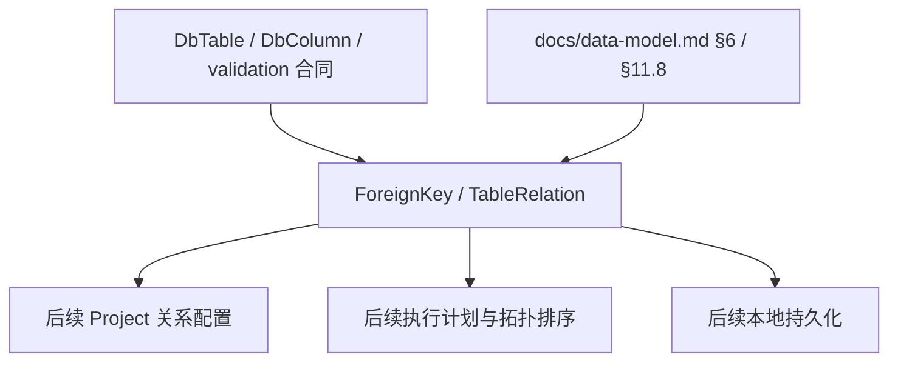

# Design Document

## Overview

`phase-02-relation-model` 交付外键与表关系模型。该规格基于 `docs/data-model.md` §6 `ForeignKey`、`TableRelation` 和 §11.8 `TableRelation.relation_type`，在 Go 后端领域层定义可序列化、可校验、可供下游复用的关系模型合同。

本规格只覆盖 Phase 2 领域模型、基础校验和 JSON 序列化合同；不实现拓扑排序、行数规划、执行时外键取值、关系编辑 UI、真实数据库扫描或服务编排。

### Goals

- 定义 `ForeignKey` 的领域模型，用于表达数据库物理扫描得到的外键约束。
- 定义 `TableRelation` 的领域模型，用于表达系统显式维护的 Parent / Child 与 BaseTable / JoinTable 关系。
- 稳定 `RelationType`、倍数范围、物理/逻辑关系边界、字段级校验错误和 JSON 字段名。
- 明确与上游 `phase-02-table-field-constraint-model` 的只读引用边界：本规格复用上游 `DbTable`、`DbColumn`、校验 issue 形状和 ID 合同，不重新定义表、字段或基础约束模型。

### Non-Goals

- 不实现拓扑排序、行数规划、执行时外键取值或 JoinTable 组合算法。
- 不实现关系编辑 UI、Wails binding、服务层 API 或本地存储 migration。
- 不访问真实数据库，不新增数据库驱动，不实现扫描快照到领域模型的映射流程。
- 不把 `ForeignKey` 合并进 `TableConstraint`；`TableConstraint` 仍只覆盖 PRIMARY / UNIQUE。
- 不校验跨对象完整性，例如字段 ID 是否真实属于对应表、关系是否形成环、复合唯一容量是否足够；这些由后续 service / engine 规格处理。

## Source References

| Source | Used For |
|--------|----------|
| `docs/data-model.md` §6 `ForeignKey` | `ForeignKey` 字段、唯一性语义、物理外键边界 |
| `docs/data-model.md` §6 `TableRelation` | `TableRelation` 字段、Parent / Child、BaseTable / JoinTable、倍数范围、`is_logical` |
| `docs/data-model.md` §11.8 | `RelationType` 稳定枚举值 |
| `docs/data-model.md` D-09 | N:N JoinTable 扁平化拆分为多条 `TableRelation` |
| `docs/data-model.md` D-10 | JoinTable 运行时容量校验属于后续 engine / validation 阶段，不在本规格实现 |
| `phase-02-table-field-constraint-model` | 上游 `DbTable`、`DbColumn`、`SchemaValidationIssue`、`SchemaIssueCode`、`SchemaIssueSeverity`、`SchemaValidationMode` 合同 |
| `.kiro/steering/product.md` | 外键字段优先遵从关联关系、依赖表先生成、字段规则与执行规则分离 |
| `.kiro/steering/structure.md` / `.kiro/steering/tech.md` | Domain 不依赖 UI / Wails / adapter，服务层和引擎负责编排 |

## Boundary Commitments

### Upstream Readiness Assumption

- `phase-02-table-field-constraint-model` 已批准；实现本规格时必须先确认该上游规格的基础合同已落地。
- 实现本规格前必须确认上游已提供 `DbTable`、`DbColumn`、`SchemaValidationIssue`、`SchemaIssueCode`、`SchemaIssueSeverity`、`SchemaValidationMode` 及基础 ID / 名称校验合同。
- 如果实现时发现上游合同缺失或包路径变化，应先同步本设计与任务拆分，不得在本规格中临时重新声明同名上游类型。

### This Spec Owns

- `internal/domain/schema` 中 `ForeignKey`、`TableRelation`、`RelationType` 和关系倍数范围的领域表达。
- 稳定 JSON 字段名、字符串枚举值和基础校验函数。
- 字段级 validation issue 的返回规则，包括字段路径、错误码、severity 和安全消息。
- JSON presence 检查与反序列化辅助函数，用于区分必填字段缺失和 Go 零值。
- 单元测试，覆盖模型创建、枚举稳定性、JSON 往返、presence 诊断、基础校验和边界不越界。

### Out of Boundary

- `internal/dbx/schema` 的 introspection snapshot 模型不由本规格修改。
- 真实扫描结果到 `ForeignKey` / `TableRelation` 的转换由后续 adapter / repository / service 规格实现。
- Project 级运行时倍数来源、`rel_value_source`、`rel_source_sql` 属于 Project 关系配置，不进入本规格。
- 拓扑排序、循环依赖检测、JoinTable 容量降级、执行顺序计算和外键值取样属于后续 engine / service 规格。

### Allowed Dependencies

- Go 标准库。
- 已批准的上游 `phase-02-table-field-constraint-model` 中定义的表、字段、约束 ID 合同；实现前必须确认这些合同已在 `internal/domain/schema` 中可用。
- 上游 schema domain 已定义的 `SchemaValidationIssue`、`SchemaIssueCode`、`SchemaIssueSeverity`、`SchemaValidationMode`。本规格可在同一类型上追加缺失错误码常量，但不得重复声明同名类型。
- `docs/data-model.md` 作为字段和枚举合同来源。
- `internal/config` 仅作为 issue JSON 形状参考；domain 包不直接 import `internal/config`。
- 不依赖 Wails、Vue、store、service、engine、generator、真实数据库驱动或 `internal/dbx/schema`。

### Revalidation Triggers

- `ForeignKey` 或 `TableRelation` 字段名、JSON 标签、必填性或 ID 语义变化。
- `RelationType` 枚举字符串变化。
- 倍数范围规则变化。
- 校验 issue 结构、issue code、severity 或字段路径规则变化。
- 本规格开始直接依赖 adapter、store、service、engine、Wails、Vue 或真实数据库驱动。
- `docs/data-model.md` §6、§11.8、D-09、D-10 中与关系模型相关的定义变化。

## Architecture



**Architecture Integration**:

- Selected pattern: 领域模型和值对象优先，校验函数保持纯内存、无外部副作用。
- Domain/feature boundaries: `internal/domain/schema` 不导入 Wails、Vue、store、service、engine、generator 或数据库驱动。
- Existing patterns preserved: 字段级 issue 形状与已有 config / API issue 风格兼容，但不形成包依赖。
- Data model alignment: 字段和枚举以 `docs/data-model.md` 为主来源，Go JSON 使用 lower camelCase，对应数据模型中的 snake_case 字段。
- N:N handling: 按 D-09 将 JoinTable 关系扁平化为多条 `TableRelation`，本规格只表达单条依赖记录。

## File Structure Plan

### Directory Structure

```text
internal/domain/schema/
├── foreignkey.go              # ForeignKey 实体和物理外键字段合同
├── tablerelation.go           # TableRelation 实体和 Parent/Child、BaseTable/JoinTable 字段合同
├── relationtype.go            # RelationType 稳定字符串枚举
├── relationmultiplicity.go    # 倍数范围校验辅助和值对象
├── relation_validation.go     # ForeignKey / TableRelation 基础校验入口
├── relation_json.go           # JSON presence 检查和 Decode*JSON 辅助函数
└── relation_test.go           # 枚举、JSON、校验、边界测试
```

### Modified Files

- `internal/domain/schema/foreignkey.go` — 新增 `ForeignKey`，表达来源表、目标表、来源列和目标列的物理外键约束。
- `internal/domain/schema/tablerelation.go` — 新增 `TableRelation`，表达系统显式维护的单条表关系。
- `internal/domain/schema/relationtype.go` — 新增 `RelationType`，稳定 `PARENT_CHILD` 与 `JOIN_TABLE` 字符串值。
- `internal/domain/schema/relationmultiplicity.go` — 新增倍数范围辅助结构或函数，保护 `multiplierMin <= multiplierMax` 等规则。
- `internal/domain/schema/relation_validation.go` — 新增基础校验入口，复用上游 schema validation issue 类型。
- `internal/domain/schema/relation_json.go` — 新增 JSON presence 检查和反序列化辅助，避免普通 `json.Unmarshal` 无法区分缺失字段与零值。
- `internal/domain/schema/relation_test.go` — 覆盖 1.1-5.5 的模型、枚举、序列化、presence 检查、校验和边界测试。

## Requirements Traceability

| Requirement | Summary | Components | Interfaces / Tests |
|-------------|---------|------------|--------------------|
| 1.1 | 表达稳定身份、父级引用和核心字段 | ForeignKey, TableRelation | Go struct 字段表 |
| 1.2 | 提供稳定 JSON 字段名和枚举值 | ForeignKey, TableRelation, RelationType | JSON 标签、枚举测试 |
| 1.3 | 缺少必填字段或引用不合法返回字段级错误 | RelationValidation, RelationJSON | Validate* / Decode*JSON 测试 |
| 1.4 | 不实现服务、API、UI、数据库访问或执行算法 | Boundary Commitments | 包依赖边界测试或静态检查 |
| 1.5 | 单元测试覆盖模型创建、校验、枚举和序列化 | relation_test.go | go test |
| 2.1 | 表达枚举和状态边界 | RelationType, isLogical | 枚举稳定性测试 |
| 2.2 | 稳定可序列化枚举值 | RelationType | JSON 往返测试 |
| 2.3 | 非法枚举或状态返回字段级错误 | RelationValidation | invalid type 测试 |
| 2.4 | 不吸收执行状态或 UI 状态 | Boundary Commitments | out-of-scope 测试 |
| 2.5 | 测试覆盖枚举与状态边界 | relation_test.go | go test |
| 3.1 | 表达上游父级引用和下游身份合同 | ForeignKey, TableRelation | tableId / parentTableId / childTableId / columnIds |
| 3.2 | 下游消费稳定字段和枚举 | 全部模型 | JSON 合同测试 |
| 3.3 | 引用不合法返回字段级错误；本规格内“引用不合法”仅指对象内部可判定的引用形状错误，例如 ID 非正、数组为空、列映射数量不一致，不包含真实存在性、字段归属、环检测等跨对象完整性 | RelationValidation | ID 与列映射形状校验测试 |
| 3.4 | 不实现超边界集成 | Boundary Commitments | 包依赖边界测试 |
| 3.5 | 测试覆盖上游引用和下游合同 | relation_test.go | go test |
| 4.1 | 支持基础校验能力 | RelationValidation | ValidateForeignKey / ValidateTableRelation |
| 4.2 | 校验错误字段路径稳定 | SchemaValidationIssue | path 断言测试 |
| 4.3 | 必填和引用非法返回字段级错误 | RelationJSON, RelationValidation | Decode*JSON presence 测试 |
| 4.4 | 校验不访问外部资源 | RelationValidation | 纯函数边界 |
| 4.5 | 测试覆盖多错误返回和边界行为 | relation_test.go | 多 issue 测试 |
| 5.1 | 模型可创建和加载 | ForeignKey, TableRelation | 构造测试 |
| 5.2 | JSON 字段名和枚举可序列化 | 全部模型 | marshal / unmarshal 测试 |
| 5.3 | 反序列化非法输入可诊断 | RelationJSON | Decode*JSON 测试 |
| 5.4 | 序列化不引入 API/UI/DB 访问 | Boundary Commitments | 包依赖边界 |
| 5.5 | 测试覆盖 JSON 往返和枚举稳定性 | relation_test.go | go test |

## Components and Interfaces

| Component | Domain/Layer | Intent | Req Coverage | Key Dependencies | Contracts |
|-----------|--------------|--------|--------------|------------------|-----------|
| ForeignKey | Domain | 表达数据库物理外键约束 | 1.1-5.5 | DbTable / DbColumn ID 合同 | Go, JSON |
| TableRelation | Domain | 表达系统显式维护的表间生成关系 | 1.1-5.5 | DbTable / DbColumn ID 合同 | Go, JSON |
| RelationType | Domain | 区分 Parent/Child 与 JoinTable 关系 | 2.1-2.5 | 无 | Go enum, JSON string |
| RelationMultiplicity | Domain helper | 表达和校验每条上游记录对应的下游记录数范围 | 1.1, 4.1 | 无 | Go helper |
| RelationValidation | Domain | 字段级基础校验和 JSON presence 诊断 | 1.3, 4.1-4.4 | SchemaValidationIssue 合同 | Go functions |

## Data Models

### ForeignKey

`ForeignKey` 表达从数据库物理扫描出来的外键。`tableId` 为来源表，即外键所在表；`referencedTableId` 为被引用表。该模型可用于后续辅助生成默认 `TableRelation`，但本规格不实现生成流程。

| Go 字段 | JSON 字段 | 类型 | 必填性 | 校验规则 | 数据模型来源 |
|---------|-----------|------|--------|----------|--------------|
| `ID` | `id` | `int64` | required | draft `>= 0`；persisted `> 0` | `ForeignKey.id` |
| `TableID` | `tableId` | `int64` | required | 必须 `> 0`，来源表 ID | `ForeignKey.table_id` |
| `FKName` | `fkName` | `string` | required | trim 后非空，不含控制字符或路径分隔符 | `ForeignKey.fk_name` |
| `ReferencedTableID` | `referencedTableId` | `int64` | required | 必须 `> 0`，被引用表 ID | `ForeignKey.referenced_table_id` |
| `ColumnIDs` | `columnIds` | `[]int64` | required | 非空；每个 ID 必须 `> 0`；顺序代表复合外键来源列顺序 | `ForeignKey.column_ids` |
| `ReferencedColumnIDs` | `referencedColumnIds` | `[]int64` | required | 非空；每个 ID 必须 `> 0`；数量必须等于 `columnIds`；顺序与 `columnIds` 一一对应 | `ForeignKey.referenced_column_ids` |
| `CreatedAt` | `createdAt` | `time.Time` | persisted required | draft 可零；persisted 必须非零 | `ForeignKey.created_at` |

**Invariants**:

- `(tableId, fkName)` 的唯一性来自数据模型，但本规格只表达合同，不访问存储检查唯一性。
- `columnIds[i]` 与 `referencedColumnIds[i]` 组成一组列映射。
- `tableId == referencedTableId` 不在本规格禁止，因为自引用外键是合法数据库结构；循环关系的处理属于后续拓扑规格。
- 本规格不表达 `ON DELETE`、`ON UPDATE`、deferrable 等数据库方言扩展字段；这些信息如后续需要，应通过新规格扩展。

### TableRelation

`TableRelation` 表达系统定义的显式表关系。对于 1:N，`parentTableId` 是 Parent，`childTableId` 是 Child。对于 N:N，按 D-09 扁平化为多条 `JOIN_TABLE` 记录，`parentTableId` 表示 BaseTable，`childTableId` 表示 JoinTable。

| Go 字段 | JSON 字段 | 类型 | 必填性 | 校验规则 | 数据模型来源 |
|---------|-----------|------|--------|----------|--------------|
| `ID` | `id` | `int64` | required | draft `>= 0`；persisted `> 0` | `TableRelation.id` |
| `RelationType` | `relationType` | `RelationType` | required | 只能为 `PARENT_CHILD` 或 `JOIN_TABLE` | `TableRelation.relation_type` |
| `ParentTableID` | `parentTableId` | `int64` | required | 必须 `> 0` | `TableRelation.parent_table_id` |
| `ChildTableID` | `childTableId` | `int64` | required | 必须 `> 0` | `TableRelation.child_table_id` |
| `ParentColumnIDs` | `parentColumnIds` | `[]int64` | required | 非空；每个 ID 必须 `> 0`；顺序代表上游关联列顺序 | `TableRelation.parent_column_ids` |
| `ChildColumnIDs` | `childColumnIds` | `[]int64` | required | 非空；每个 ID 必须 `> 0`；数量必须等于 `parentColumnIds`；顺序与 `parentColumnIds` 一一对应 | `TableRelation.child_column_ids` |
| `MultiplierMin` | `multiplierMin` | `int` | required | 必须 `>= 0` | `TableRelation.multiplier_min` |
| `MultiplierMax` | `multiplierMax` | `int` | required | 必须 `>= multiplierMin` | `TableRelation.multiplier_max` |
| `IsLogical` | `isLogical` | `bool` | required | `false` 表示由物理外键直接生成；`true` 表示应用内定义的隐式/逻辑关系 | `TableRelation.is_logical` |
| `CreatedAt` | `createdAt` | `time.Time` | persisted required | draft 可零；persisted 必须非零 | `TableRelation.created_at` |
| `UpdatedAt` | `updatedAt` | `time.Time` | persisted required | draft 可零；persisted 必须非零，且不得早于 `createdAt` | `TableRelation.updated_at` |

**Invariants**:

- `relationType == PARENT_CHILD` 时，`parentTableId` / `childTableId` 表示经典 1:N 依赖关系中的 Parent / Child。
- `relationType == JOIN_TABLE` 时，`parentTableId` 表示 BaseTable，`childTableId` 表示 JoinTable；一张 JoinTable 可通过多条 `TableRelation` 指向多个 BaseTable。
- `multiplierMin == 0` 表示允许某条上游记录没有对应下游记录。
- `multiplierMax == 0` 仅在 `multiplierMin == 0` 时合法，表示固定生成 0 条下游记录；业务是否有意义由后续 Project / engine 校验。
- `isLogical == false` 的关系通常可追溯到物理 `ForeignKey`，但本规格不保存 `foreignKeyId`，避免把物理约束和生成关系强绑定。若后续需要追踪来源，可通过新规格扩展。

### RelationType

| Go 常量 | JSON 字符串 | 语义 | 数据模型来源 |
|---------|-------------|------|--------------|
| `RelationTypeParentChild` | `PARENT_CHILD` | 经典 1:N 依赖关系网络中的单向物理拆分项 | `docs/data-model.md` §11.8 |
| `RelationTypeJoinTable` | `JOIN_TABLE` | N:N 关系解耦出的单向物理依赖分支，例如 BaseTable -> JoinTable | `docs/data-model.md` §11.8 |

未知枚举值不得静默接受。反序列化后或显式校验时发现未知值，必须返回字段级 `SchemaValidationIssue`。

### RelationMultiplicity

`RelationMultiplicity` 是 `multiplierMin` / `multiplierMax` 的校验辅助和值对象，不改变 `TableRelation` 的 JSON 字段合同。实现可提供如下辅助函数：

```go
NewRelationMultiplicity(min int, max int) (RelationMultiplicity, []SchemaValidationIssue)
ValidateRelationMultiplicity(min int, max int) []SchemaValidationIssue
```

| 字段 | JSON 来源 | 校验规则 |
|------|-----------|----------|
| `Min` | `multiplierMin` | `>= 0` |
| `Max` | `multiplierMax` | `>= Min` |

## Validation Design

### In-Scope Reference Validation Boundary

requirements 中的“引用不合法”在本规格内限定为当前对象内部即可判断的引用形状错误，包括：主键 ID 为负数、父级表 ID / 目标表 ID / 列 ID 非正、列 ID 数组为空、两组列映射数量不一致、必填引用字段在 JSON 中缺失。真实表或列是否存在、列是否属于对应表、外键名是否在表内唯一、关系图是否成环，以及 JoinTable 容量是否足够，均属于后续 service / engine / validation 规格，不得在 domain 层通过 store、adapter 或 engine 依赖实现。

### Validation Modes

本规格复用上游 `SchemaValidationModeDraft` 与 `SchemaValidationModePersisted`。

| Mode | 适用对象 | ID 校验 | 时间校验 |
|------|----------|---------|----------|
| `SchemaValidationModeDraft` | 尚未持久化的新建对象 | 主键 ID 可为 0，不得为负数；父级引用必须大于 0 | `CreatedAt`、`UpdatedAt` 可为零；两者都非零时要求 `UpdatedAt >= CreatedAt` |
| `SchemaValidationModePersisted` | 已持久化或准备作为快照输出的对象 | 主键 ID 必须大于 0；父级引用必须大于 0 | 审计时间必须非零；`UpdatedAt >= CreatedAt` |

### Validation Issue Contract

本规格不重新定义 `SchemaValidationIssue`、`SchemaIssueSeverity`、`SchemaValidationMode`。实现时复用上游 schema domain 已有类型，保持 issue JSON 形状与 `ConfigIssue` / 前端 `ApiIssue` 兼容。

| 字段 | JSON 字段 | 规则 |
|------|-----------|------|
| `Path` | `path` | 使用 lower camelCase 点分路径或数组索引，如 `fkName`、`columnIds[0]`、`referencedColumnIds[1]`、`multiplierMax` |
| `Code` | `code` | 优先复用上游 `SchemaIssueCode`；确需扩展时只追加常量，不改变既有字符串值 |
| `Severity` | `severity` | 阻塞性校验和 presence 错误使用 `error` |
| `Message` | `message` | 非空安全消息，不包含数据库凭据、用户 SQL 或生成数据 |

本规格可复用或追加的错误码语义如下：

| 语义 | 推荐 code | 适用场景 |
|------|-----------|----------|
| 通用校验失败 | 上游 `SchemaIssueCodeValidationFailed` | JSON 类型不匹配、未知枚举值等无法归入更具体类型的错误 |
| 必填缺失 | 上游 `SchemaIssueCodeRequired` | JSON 必填字段缺失、字符串字段空白、数组必填但缺失 |
| ID 非法 | 上游 `SchemaIssueCodeInvalidID` | 主键 ID、表 ID、列 ID 非法 |
| 名称非法 | 上游 `SchemaIssueCodeInvalidName` | `fkName` 非法 |
| 类型非法 | 可追加 `SchemaIssueCodeInvalidType` | `relationType` 非法 |
| 范围非法 | 可追加 `SchemaIssueCodeInvalidRange` | `multiplierMin` / `multiplierMax` 非法 |
| 映射非法 | 可追加 `SchemaIssueCodeInvalidMapping` | 两组列 ID 数量不一致或映射为空 |
| 时间非法 | 上游 `SchemaIssueCodeInvalidTime` | 审计时间缺失或顺序非法 |

追加 code 时必须在同一 package 的既有 `SchemaIssueCode` 类型上新增常量，禁止重新声明 `type SchemaIssueCode string`。

### Service Interface

```go
ValidateForeignKey(foreignKey ForeignKey, mode SchemaValidationMode) []SchemaValidationIssue
ValidateTableRelation(relation TableRelation, mode SchemaValidationMode) []SchemaValidationIssue
ValidateRelationType(relationType RelationType) []SchemaValidationIssue
ValidateRelationMultiplicity(min int, max int) []SchemaValidationIssue
DecodeForeignKeyJSON(data []byte, mode SchemaValidationMode) (ForeignKey, []SchemaValidationIssue)
DecodeTableRelationJSON(data []byte, mode SchemaValidationMode) (TableRelation, []SchemaValidationIssue)
```

**Preconditions**:

- `Validate*` 输入为内存中的领域对象。
- `Decode*JSON` 输入为原始 JSON payload。
- 函数不得访问数据库、文件系统、Wails runtime、网络、store、service 或 engine。

**Postconditions**:

- 返回零个或多个字段级 issue。
- 不 panic。
- 错误消息不包含敏感值。
- presence 诊断使用 JSON 字段路径。

### Validation Matrix

| 对象 | 字段 | Draft | Persisted | Issue Path |
|------|------|-------|-----------|------------|
| ForeignKey | `ID` | `>= 0` | `> 0` | `id` |
| ForeignKey | `TableID` | `> 0` | `> 0` | `tableId` |
| ForeignKey | `FKName` | 非空合法名称 | 非空合法名称 | `fkName` |
| ForeignKey | `ReferencedTableID` | `> 0` | `> 0` | `referencedTableId` |
| ForeignKey | `ColumnIDs` | 非空且每个 ID `> 0` | 非空且每个 ID `> 0` | `columnIds`, `columnIds[i]` |
| ForeignKey | `ReferencedColumnIDs` | 非空、每个 ID `> 0`、数量等于 `columnIds` | 同 Draft | `referencedColumnIds`, `referencedColumnIds[i]` |
| ForeignKey | `CreatedAt` | 可零 | 必须非零 | `createdAt` |
| TableRelation | `ID` | `>= 0` | `> 0` | `id` |
| TableRelation | `RelationType` | 合法枚举 | 合法枚举 | `relationType` |
| TableRelation | `ParentTableID` | `> 0` | `> 0` | `parentTableId` |
| TableRelation | `ChildTableID` | `> 0` | `> 0` | `childTableId` |
| TableRelation | `ParentColumnIDs` | 非空且每个 ID `> 0` | 同 Draft | `parentColumnIds`, `parentColumnIds[i]` |
| TableRelation | `ChildColumnIDs` | 非空、每个 ID `> 0`、数量等于 `parentColumnIds` | 同 Draft | `childColumnIds`, `childColumnIds[i]` |
| TableRelation | `MultiplierMin` | `>= 0` | `>= 0` | `multiplierMin` |
| TableRelation | `MultiplierMax` | `>= multiplierMin` | `>= multiplierMin` | `multiplierMax` |
| TableRelation | `IsLogical` | 必填 presence | 必填 presence | `isLogical` |
| TableRelation | `CreatedAt` / `UpdatedAt` | 可零；非零时顺序合法 | 必须非零且顺序合法 | `createdAt`, `updatedAt` |

本规格不校验以下内容：

- 表 ID 或列 ID 是否真实存在。
- `parentColumnIds` 是否属于 `parentTableId`。
- `childColumnIds` 是否属于 `childTableId`。
- 同一表下外键名是否唯一。
- `TableRelation` 是否与某个 `ForeignKey` 一一对应。
- 关系图是否有环、是否可拓扑排序。
- JoinTable 复合唯一容量是否足够。

## JSON Presence and Decoding Contract

Go struct 的普通 `json.Unmarshal` 无法区分必填字段缺失与零值 / `false`。为满足缺少必填字段返回字段级 issue 的要求，本规格新增 `Decode*JSON` 辅助函数，负责 presence 检查、类型检查和基础校验编排。

### Required JSON Fields

| Model | Required JSON Fields |
|-------|----------------------|
| ForeignKey | `id`, `tableId`, `fkName`, `referencedTableId`, `columnIds`, `referencedColumnIds`, `createdAt` |
| TableRelation | `id`, `relationType`, `parentTableId`, `childTableId`, `parentColumnIds`, `childColumnIds`, `multiplierMin`, `multiplierMax`, `isLogical`, `createdAt`, `updatedAt` |

### Decode Rules

- 缺少 required 字段时返回 `SchemaValidationIssue`，`Path` 为缺失 JSON 字段名。
- `false` 是 `isLogical` 的合法显式值，不得被误判为缺失。
- `0` 是 draft mode 下 `id` 的合法显式值，不得被误判为缺失。
- 空数组与缺失数组不同：空数组表示字段存在但映射非法；缺失数组表示 required 缺失。
- JSON 类型错误返回字段级 issue；如果标准库错误无法定位具体字段，可使用最接近的字段路径或根路径 `$`。
- 反序列化后必须调用对应 `Validate*`，返回 presence issue 与 validation issue 的合并结果。

## Physical vs Logical Relation Boundary

### ForeignKey

`ForeignKey` 只表达数据库物理外键约束，来源于 Schema 扫描结果或后续扫描映射流程。它不包含生成倍数、不表达业务逻辑关系，也不决定执行顺序。

### TableRelation

`TableRelation` 是系统用于生成规划的显式关系合同：

- `isLogical == false`：表示关系可由数据库物理外键直接推导，通常对应一条 `ForeignKey`。
- `isLogical == true`：表示应用内定义的隐式 / 逻辑关系，例如数据库没有物理 FK，但业务上仍需按 Parent / Child 生成。

本规格只保存 `isLogical`，不保存来源 SQL、Project 级取值策略或执行时取样来源。Project 层如需表达 `FROM_EXECUTION`、`FROM_DB_QUERY`、`MERGED`，应使用后续 `ProjectTableRelation` 模型。

## Error Handling

- 校验返回字段级错误集合，不 panic。
- 错误包含字段路径、错误码、severity 和安全消息。
- 错误不得泄露数据库凭据、用户 SQL、连接串或生成数据。
- 模型校验只报告当前对象内部可判断的问题；跨对象一致性由后续 service / engine 返回更高层 issue。

## Testing Strategy

### Unit Tests

- `RelationType` 枚举字符串稳定性：`PARENT_CHILD`、`JOIN_TABLE`。
- `ForeignKey` JSON 往返：字段名使用 lower camelCase，列映射顺序保持不变。
- `TableRelation` JSON 往返：`multiplierMin` / `multiplierMax` / `isLogical` presence 保持稳定。
- `DecodeForeignKeyJSON` presence 测试：缺少 `fkName`、`columnIds`、`referencedColumnIds` 返回字段级 issue。
- `DecodeTableRelationJSON` presence 测试：缺少 `isLogical` 与显式 `false` 可区分。
- 基础校验：非法 ID、空名称、空列映射、列映射数量不一致、非法 relationType、非法倍数范围、多错误返回。
- Draft / persisted mode 差异：draft 允许主键 ID 为 0，persisted 要求 ID 和审计时间非零。
- Out-of-scope 边界：测试不引入拓扑排序、数据库访问、Project 取值策略或 Wails / Vue 依赖。

### Package Boundary Tests

必须增加轻量包依赖边界测试，确认 `internal/domain/schema` 不 import 以下包：

- `github.com/wailsapp/wails`
- `internal/dbx`
- `internal/service`
- `internal/repository`
- `internal/engine`
- `internal/generator`

## Implementation Notes

- Go 后端代码需遵守 `.kiro/steering/tech.md` 的注释规则：常量和枚举值要有注释；struct 和所有字段要有注释；导出函数要有注释。
- 数组字段在 Go 中使用 `[]int64`，JSON 表达为数字数组；数据模型中的 TEXT 逗号分隔是持久化层存储策略，不泄漏到 domain JSON 合同。
- 名称校验复用上游表/字段约束模型中的名称规则，保持对控制字符和路径分隔符的处理一致。
- 时间字段使用 `time.Time`；draft mode 可零，persisted mode 必须非零。
- 本规格按构建顺序复用已完成的上游模型合同，不在当前设计中引入额外“上游未实现”分支。
