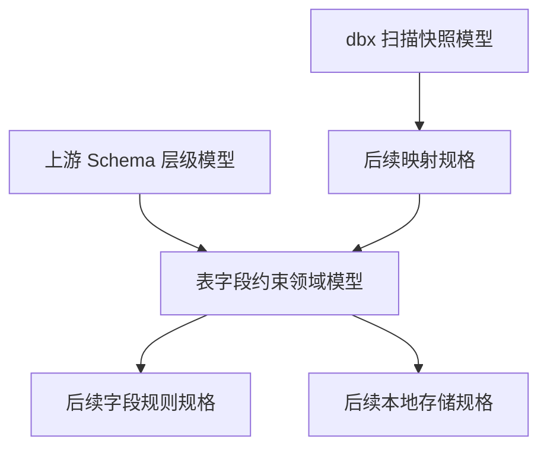
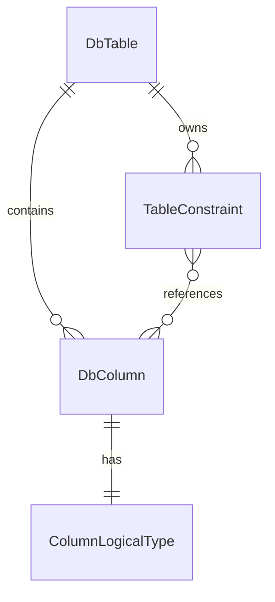

# Design Document

## Overview

`phase-02-table-field-constraint-model` 交付表、字段与基础表级约束的 Go 领域模型。该规格稳定 `DbTable`、`DbColumn`、`TableConstraint`、`ColumnLogicalType`、字段级校验 issue 与 JSON 序列化合同，供后续字段规则、关系建模、Schema 缓存和服务层复用。

本规格只覆盖 Phase 2 的领域模型、基础校验和序列化，不访问真实数据库，不实现 ForeignKey、TableRelation、字段规则、Project、API、UI 或执行算法。

### Goals

- 定义 `DbTable`、`DbColumn`、`TableConstraint` 和 `ColumnLogicalType` 的稳定领域模型。
- 明确与上游 `phase-02-database-schema-model` 以及现有 `internal/dbx/schema` 扫描快照模型的边界。
- 提供稳定 JSON 字段名、字符串枚举、字段级校验错误和单元测试合同。

### Non-Goals

- 不定义 `ForeignKey`、`ForeignKeyColumn`、`TableRelation`、字段生成规则或 Project 配置。
- 不实现 Schema 扫描、重扫 diff、数据库唯一性查询、存储 migration、Wails binding 或前端页面。
- 不吸收复杂 `CHECK`、普通 `INDEX`、视图、物化视图或数据库方言特定高级约束。

## Boundary Commitments

### This Spec Owns

- `internal/domain/schema` 中表、字段、PRIMARY/UNIQUE 约束和列逻辑类型的领域实体和值对象。
- 字段级基础校验入口、稳定错误码、错误严重级别和安全消息结构；校验 issue、severity、mode 复用上游 `phase-02-database-schema-model` 已定义的 schema domain 合同，本规格只扩展表/字段/约束相关校验入口和错误码。
- Go struct JSON 标签、字符串枚举值、JSON 往返行为和相关单元测试。
- 下游规格消费的表身份、字段身份、约束身份、字段顺序、非空、默认值、原生类型和逻辑类型合同。

### Out of Boundary

- `internal/dbx/schema` 的 introspection canonical snapshot 模型不由本规格修改。
- 真实扫描结果到领域模型的转换由后续 adapter、repository 或 service 规格实现。
- `ForeignKey`、`TableRelation` 和关系推导不进入 `TableConstraint`，避免跨规格提前实现。
- 数据库存储唯一性、级联删除、事务和 migration 由后续 local storage / repository 规格负责。

### Implementation Preconditions

- 本规格进入实现前，必须先确认 `phase-02-database-schema-model` 已完成代码落地，并且 `internal/domain/schema` 中已存在 `SchemaValidationIssue`、`SchemaIssueCode`、`SchemaIssueSeverity` 和 `SchemaValidationMode`。
- 如果上述上游类型尚未存在，当前规格的实现任务必须停止，并先回到 `phase-02-database-schema-model` 完成前置实现；不得在本规格中临时或重复声明这些上游类型。
- 本规格只允许在既有 `SchemaIssueCode` 类型上追加确需的新常量，例如 `SchemaIssueCodeInvalidType`、`SchemaIssueCodeInvalidOrder`；禁止重新声明 `type SchemaIssueCode string`、`type SchemaValidationMode string` 或同名 issue/severity 类型。

### Allowed Dependencies

- Go 标准库。
- 上游 `phase-02-database-schema-model` 的稳定 `DbSchema` 身份语义，尤其是 `SchemaID` 父级引用。
- 项目已有字段级 issue 形状作为兼容参考；实现时必须复用上游 `internal/domain/schema` 中已落地的 `SchemaValidationIssue`、`SchemaIssueCode`、`SchemaIssueSeverity` 和 `SchemaValidationMode`，不得在同一 package 内重复定义同名类型。
- `internal/config` 只作为 issue JSON 形状参考，domain 不直接依赖 `internal/config`。
- `internal/dbx/schema` 只作为边界参考，不作为本规格 domain 包的直接 import。

### Revalidation Triggers

- `DbTable`、`DbColumn`、`TableConstraint`、`ColumnLogicalType` 的字段、JSON 标签或枚举字符串变化。
- 校验入口、issue 结构、issue code、severity 字符串变化；若上游 schema domain 已提供同名类型，本规格只能复用或扩展，不得重复声明。
- 允许的约束类型从 PRIMARY/UNIQUE 扩展到 ForeignKey、CHECK 或 INDEX。
- domain 模型开始直接依赖 `internal/dbx/schema`、store、service、Wails、Vue 或真实数据库驱动。

## Architecture

### Existing Architecture Analysis

当前代码库已有 `internal/dbx/schema` 包，包含 `Database`、`Namespace`、`Table`、`Column`、`PrimaryKey`、`ForeignKey`、`UniqueConstraint`、`CheckConstraint`、`Index` 和 `LogicalType`。该包服务于数据库适配与 introspection 层，保留原始数据库元数据和方言差异。

本规格新增的 `internal/domain/schema` 是业务领域模型边界，面向本地缓存、下游字段规则和服务合同。两者不是同一模型：`internal/dbx/schema` 关注扫描快照，`internal/domain/schema` 关注稳定身份、字段级校验、持久化友好的 JSON 合同和 Phase 2 领域语义。

### Architecture Pattern & Boundary Map



**Architecture Integration**:

- Selected pattern: 领域模型和值对象优先，校验函数保持纯内存、无外部副作用。
- Domain/feature boundaries: `internal/domain/schema` 不导入 Wails、Vue、store、service、engine 或数据库驱动。
- Existing patterns preserved: 字段级 issue 形状与 `ConfigIssue` / 前端 `ApiIssue` 兼容，但不形成包依赖。
- New components rationale: domain 模型需要比 `internal/dbx/schema` 更稳定的 ID、JSON 字段名、校验模式和下游消费合同。
- Steering compliance: 保持 `Domain does not know UI or Wails`、`Adapter owns external differences` 和 Phase 范围控制。

### Technology Stack

| Layer | Choice / Version | Role in Feature | Notes |
|-------|------------------|-----------------|-------|
| Backend Domain | Go | 定义领域实体、枚举、校验和值对象 | 不新增依赖 |
| Tests | Go testing | 保护模型、枚举、JSON 和校验合同 | 只做单元测试 |

## File Structure Plan

### Directory Structure

```text
internal/domain/schema/
├── dbtable.go                  # DbTable 实体与表身份字段
├── dbcolumn.go                 # DbColumn 实体与字段属性
├── tableconstraint.go          # TableConstraint 实体与 PRIMARY/UNIQUE 枚举
├── columnlogicaltype.go        # ColumnLogicalType 与 ColumnLogicalKind 值对象
├── table_validation.go         # 表/字段/约束校验入口，复用上游 schema validation 类型
├── table_json.go               # 表/字段/约束 JSON presence 检查和反序列化辅助
└── table_constraint_test.go    # 模型 JSON、枚举稳定性和校验测试
```

### Modified Files

- `internal/domain/schema/dbtable.go` — 新增 `DbTable`，表达 `DbSchema` 下表身份、表名、注释、DDL 快照和审计时间。
- `internal/domain/schema/dbcolumn.go` — 新增 `DbColumn`，表达字段父级引用、顺序、名称、原生类型、逻辑类型、可空性、默认值和主键冗余标志。
- `internal/domain/schema/tableconstraint.go` — 新增 `TableConstraint`、`TableConstraintType` 和约束列 ID 顺序合同，只覆盖 PRIMARY/UNIQUE。
- `internal/domain/schema/columnlogicaltype.go` — 新增稳定逻辑类型值对象，不直接复用 `internal/dbx/schema.LogicalType`。
- `internal/domain/schema/table_validation.go` — 新增表/字段/约束校验入口、表字段约束专属错误码和多错误返回能力；复用上游 schema domain 的 `SchemaValidationIssue`、`SchemaIssueSeverity`、`SchemaValidationMode`，不得重复定义同名类型。
- `internal/domain/schema/table_json.go` — 新增 JSON presence 检查和反序列化辅助，用于区分必填字段缺失、显式零值、显式 `false` 和 `null`。
- `internal/domain/schema/table_constraint_test.go` — 覆盖 1.1-5.5 的模型、枚举、序列化、presence 检查、校验、前置类型复用和边界测试。

## Requirements Traceability

| Requirement | Summary | Components | Interfaces | Flows |
|-------------|---------|------------|------------|-------|
| 1.1 | 表达稳定身份、父级引用和核心字段 | DbTable, DbColumn, TableConstraint, ColumnLogicalType | Go struct, JSON | 无 |
| 1.2 | 提供稳定 JSON 字段名和枚举值 | 全部模型和枚举 | JSON 标签, 字符串枚举 | 无 |
| 1.3 | 缺少必填字段或引用不合法返回字段级错误 | TableSchemaValidation, JSON presence decoder | SchemaValidationIssue | JSON decode / validate |
| 1.4 | 不实现超出边界能力 | Boundary Commitments | 包依赖规则 | 无 |
| 1.5 | 单元测试覆盖模型创建、校验、枚举和序列化 | table_constraint_test.go | go test | 无 |
| 2.1 | 表达模型所需状态边界 | 枚举和值对象 | Go constants | 无 |
| 2.2 | 稳定可序列化枚举值 | TableConstraintType, ColumnLogicalKind | JSON 字符串 | 无 |
| 2.3 | 枚举和状态非法时返回字段级错误 | TableSchemaValidation | SchemaValidationIssue | 无 |
| 2.4 | 不吸收服务、API、UI、数据库访问或执行状态 | Boundary Commitments | 包依赖规则 | 无 |
| 2.5 | 测试覆盖枚举与状态边界 | table_constraint_test.go | go test | 无 |
| 3.1 | 表达上游父级引用和下游身份合同 | DbTable, DbColumn, TableConstraint | `schemaId`, `tableId`, `columnIds` | 无 |
| 3.2 | 下游消费稳定字段和枚举 | 全部模型 | JSON 合同 | 无 |
| 3.3 | 引用不合法返回字段级错误 | TableSchemaValidation | SchemaValidationIssue | 无 |
| 3.4 | 不实现超边界集成 | Boundary Commitments | 包依赖规则 | 无 |
| 3.5 | 测试覆盖上游引用和下游合同 | table_constraint_test.go | go test | 无 |
| 4.1 | 支持基础校验能力 | TableSchemaValidation | ValidateTable, ValidateColumn, ValidateConstraint | 无 |
| 4.2 | 校验错误字段路径稳定 | SchemaValidationIssue | JSON issue | 无 |
| 4.3 | 必填和引用非法返回字段级错误 | TableSchemaValidation, JSON presence decoder | SchemaValidationIssue | JSON decode / validate |
| 4.4 | 校验不访问外部资源 | TableSchemaValidation | 纯函数 | 无 |
| 4.5 | 测试覆盖多错误返回和边界行为 | table_constraint_test.go | go test | 无 |
| 5.1 | 模型可创建和加载 | DbTable, DbColumn, TableConstraint | Go struct | 无 |
| 5.2 | JSON 字段名和枚举可序列化 | 全部模型和枚举 | JSON | 无 |
| 5.3 | 反序列化非法输入可诊断 | JSON presence decoder, TableSchemaValidation | SchemaValidationIssue | JSON decode / validate |
| 5.4 | 序列化不引入 API/UI/DB 访问 | Boundary Commitments | 包依赖规则 | 无 |
| 5.5 | 测试覆盖 JSON 往返和枚举稳定性 | table_constraint_test.go | go test | 无 |

## Components and Interfaces

| Component | Domain/Layer | Intent | Req Coverage | Key Dependencies | Contracts |
|-----------|--------------|--------|--------------|------------------|-----------|
| DbTable | Domain | 表领域实体 | 1.1, 1.2, 3.1, 5.1 | 上游 DbSchema ID P0 | Go, JSON |
| DbColumn | Domain | 字段领域实体 | 1.1, 1.2, 3.1, 5.1 | DbTable P0 | Go, JSON |
| TableConstraint | Domain | PRIMARY/UNIQUE 表级约束 | 1.1, 2.1, 3.1 | DbTable, DbColumn P0 | Go, JSON |
| ColumnLogicalType | Domain | 逻辑类型和值域元数据 | 1.1, 2.1, 2.2 | 无 P0 | Go, JSON |
| TableSchemaValidation | Domain | 字段级基础校验和 JSON presence 诊断 | 1.3, 2.3, 3.3, 4.1, 4.2, 4.3 | 全部模型 P0 | Service / Repository |

### Domain Layer

#### DbTable

| Field | Detail |
|-------|--------|
| Intent | 表达 `DbSchema` 下的一张可配置数据表 |
| Requirements | 1.1, 1.2, 3.1, 5.1 |

**Responsibilities & Constraints**

- 保存表主键、`SchemaID` 父级引用、表名、注释、DDL 快照、扫描时间和审计时间。
- 不保存字段集合、约束集合或关系集合；组合由后续 service/store 层完成。
- 唯一性语义为同一 `schemaId` 下 `tableName` 唯一，本规格只表达合同，不访问数据库检查。

#### DbColumn

| Field | Detail |
|-------|--------|
| Intent | 表达 `DbTable` 下的字段结构和生成前必要元数据 |
| Requirements | 1.1, 1.2, 2.1, 3.1, 5.1 |

**Responsibilities & Constraints**

- 保存字段主键、`TableID` 父级引用、字段顺序、字段名、原生类型、逻辑类型、可空性、默认值、主键冗余标志和注释。
- `IsPrimaryKey` 是从 `TableConstraint` 派生的读取优化字段，来源于 `docs/data-model.md` D-04；本规格只定义字段，不实现同步流程。
- `DefaultValue == nil` 表示数据库层面没有默认值；非 nil 且值为 `"NULL"` 只是原始默认表达式文本，不等同于无默认值。

#### TableConstraint

| Field | Detail |
|-------|--------|
| Intent | 表达 PRIMARY 和 UNIQUE 两类基础表级约束 |
| Requirements | 1.1, 2.1, 2.2, 3.1, 4.1 |

**Responsibilities & Constraints**

- 只允许 `PRIMARY` 和 `UNIQUE` 两种类型。
- `ColumnIDs` 按约束列顺序保存字段 ID；不能为空，且每个 ID 必须大于 0。
- 不表达 ForeignKey、CHECK、INDEX 或关系推导；这些属于后续规格。

#### ColumnLogicalType

| Field | Detail |
|-------|--------|
| Intent | 表达字段被生成器和规则配置消费时的稳定逻辑类型 |
| Requirements | 1.1, 2.1, 2.2, 5.2 |

**Responsibilities & Constraints**

- 保留逻辑类型种类、长度、精度、小数位、位宽、时区、数组元素、枚举值和原生类型文本。
- 与 `internal/dbx/schema.LogicalType` 字段形状保持可映射，但不直接 import，避免 dbx adapter 模型泄漏到 domain。
- 未识别类型使用 `unknown`，并必须保留 `nativeType` 方便后续排错和兼容。

#### TableSchemaValidation

| Field | Detail |
|-------|--------|
| Intent | 为表、字段、约束模型提供无副作用的基础校验、JSON presence 诊断和字段级错误集合 |
| Requirements | 1.3, 2.3, 3.3, 4.1, 4.2, 4.3, 4.4 |

**Service Interface**

```go
ValidateTable(table DbTable, mode SchemaValidationMode) []SchemaValidationIssue
ValidateColumn(column DbColumn, mode SchemaValidationMode) []SchemaValidationIssue
ValidateConstraint(constraint TableConstraint, mode SchemaValidationMode) []SchemaValidationIssue
ValidateLogicalType(logical ColumnLogicalType) []SchemaValidationIssue
DecodeTableJSON(data []byte, mode SchemaValidationMode) (DbTable, []SchemaValidationIssue)
DecodeColumnJSON(data []byte, mode SchemaValidationMode) (DbColumn, []SchemaValidationIssue)
DecodeConstraintJSON(data []byte, mode SchemaValidationMode) (TableConstraint, []SchemaValidationIssue)
DecodeLogicalTypeJSON(data []byte) (ColumnLogicalType, []SchemaValidationIssue)
```

`SchemaValidationIssue`、`SchemaIssueSeverity` 和 `SchemaValidationMode` 必须复用上游 schema domain 已定义类型；如果这些类型尚未存在，当前规格不得自行创建替代类型，必须先完成 `phase-02-database-schema-model` 的实现。若 `SchemaIssueCode` 已包含可表达本规格错误的 code，应直接复用。只有在现有 code 无法表达表/字段/约束错误时，才在同一枚举类型中追加新常量，且不得改变既有 JSON 字符串值。

- Preconditions: `Validate*` 输入为内存中的领域对象；`Decode*JSON` 输入为原始 JSON payload。函数不得访问数据库、文件系统、Wails runtime 或网络。
- Postconditions: 返回零个或多个字段级 issue；不得 panic；不得返回包含敏感数据的消息；presence 诊断必须使用 JSON 字段路径。
- Invariants: `Path` 使用 JSON 字段名路径；`Code` 和 `Severity` 使用稳定字符串枚举；不得重复定义上游 schema domain 已有类型。

## Data Models

### Domain Model



`DbTable` 是表结构聚合的自然根，但本规格不实现聚合加载器或事务边界。`DbColumn` 和 `TableConstraint` 通过 `TableID` 引用表；`TableConstraint.ColumnIDs` 引用同表字段，字段顺序即约束列顺序。

### DbTable

| Go 字段 | JSON 字段 | 类型 | 必填性 | 校验规则 | 持久化来源 |
|---------|-----------|------|--------|----------|------------|
| `ID` | `id` | `int64` | required | draft `>= 0`；persisted `> 0` | `id` |
| `SchemaID` | `schemaId` | `int64` | required | 必须 `> 0`，引用上游 `DbSchema.ID` | `schema_id` |
| `TableName` | `tableName` | `string` | required | 去除首尾空白后非空；不得包含控制字符或路径分隔符 | `table_name` |
| `Comment` | `comment` | `string` | optional | 可为空；不得用于保存敏感凭据 | `comment` |
| `DDLSnapshot` | `ddlSnapshot` | `string` | optional | 可为空；仅作展示快照，不参与校验推导 | `ddl_snapshot` |
| `ScannedAt` | `scannedAt` | `*time.Time` | optional nullable | `nil` 表示尚未扫描 | `scanned_at` |
| `CreatedAt` | `createdAt` | `time.Time` | persisted required | draft 可零；persisted 必须非零 | `created_at` |
| `UpdatedAt` | `updatedAt` | `time.Time` | persisted required | draft 可零；非零时不得早于 `CreatedAt` | `updated_at` |

### DbColumn

| Go 字段 | JSON 字段 | 类型 | 必填性 | 校验规则 | 持久化来源 |
|---------|-----------|------|--------|----------|------------|
| `ID` | `id` | `int64` | required | draft `>= 0`；persisted `> 0` | `id` |
| `TableID` | `tableId` | `int64` | required | 必须 `> 0`，引用所属 `DbTable.ID` | `table_id` |
| `OrdinalPosition` | `ordinalPosition` | `int` | required | 必须 `> 0`，从 1 开始 | `ordinal_position` |
| `ColumnName` | `columnName` | `string` | required | 去除首尾空白后非空；不得包含控制字符或路径分隔符 | `column_name` |
| `NativeType` | `nativeType` | `string` | required | 必须非空，保留数据库原生类型文本 | `data_type` |
| `LogicalType` | `logicalType` | `ColumnLogicalType` | required | `kind` 必须为稳定枚举；unknown 必须保留 `nativeType` | derived |
| `Nullable` | `nullable` | `bool` | required | 表达字段是否允许 NULL | `is_nullable` |
| `DefaultValue` | `defaultValue` | `*string` | optional nullable | `nil` 表示无默认值；非 nil 表示原始默认表达式 | `default_value` |
| `IsPrimaryKey` | `isPrimaryKey` | `bool` | required | PRIMARY 约束派生冗余标志；本规格不实现同步 | `is_primary_key` |
| `Comment` | `comment` | `string` | optional | 可为空；不得保存敏感凭据 | `comment` |
| `CreatedAt` | `createdAt` | `time.Time` | persisted required | draft 可零；persisted 必须非零 | `created_at` |
| `UpdatedAt` | `updatedAt` | `time.Time` | persisted required | draft 可零；非零时不得早于 `CreatedAt` | `updated_at` |

### TableConstraint

| Go 字段 | JSON 字段 | 类型 | 必填性 | 校验规则 | 持久化来源 |
|---------|-----------|------|--------|----------|------------|
| `ID` | `id` | `int64` | required | draft `>= 0`；persisted `> 0` | `id` |
| `TableID` | `tableId` | `int64` | required | 必须 `> 0`，引用所属 `DbTable.ID` | `table_id` |
| `ConstraintName` | `constraintName` | `string` | required | 非空；未命名约束由扫描映射层生成稳定名称 | `constraint_name` |
| `ConstraintType` | `constraintType` | `TableConstraintType` | required | 只能为 `PRIMARY` 或 `UNIQUE` | `constraint_type` |
| `ColumnIDs` | `columnIds` | `[]int64` | required | 非空；每个 ID 必须 `> 0`；顺序代表约束列顺序 | `column_ids` |
| `CreatedAt` | `createdAt` | `time.Time` | persisted required | draft 可零；persisted 必须非零 | `created_at` |

### ColumnLogicalType

| Go 字段 | JSON 字段 | 类型 | 必填性 | 校验规则 | 说明 |
|---------|-----------|------|--------|----------|------|
| `Kind` | `kind` | `ColumnLogicalKind` | required | 必须为稳定枚举 | 逻辑类型类别 |
| `Length` | `length` | `*int64` | optional nullable | 非 nil 时必须 `> 0` | 字符、二进制等长度 |
| `Precision` | `precision` | `*int` | optional nullable | 非 nil 时必须 `> 0` | 数字或时间精度 |
| `Scale` | `scale` | `*int` | optional nullable | 非 nil 时必须 `>= 0` 且不大于 precision | 小数位 |
| `BitWidth` | `bitWidth` | `*int` | optional nullable | 非 nil 时必须 `> 0` | 数字位宽 |
| `Timezone` | `timezone` | `bool` | required | 仅对时间类类型有业务意义 | 是否包含时区语义 |
| `Element` | `element` | `*ColumnLogicalType` | optional nullable | `array` 类型应提供；非 array 不要求 | 数组元素类型 |
| `EnumValues` | `enumValues` | `[]string` | optional | `enum` 类型应非空且值不重复 | 枚举值 |
| `NativeType` | `nativeType` | `string` | required for unknown | `unknown` 必须非空；其他类型建议保留 | 原生类型文本 |

### Stable Enums

| 枚举类型 | Go 常量 | JSON 字符串 | 语义 |
|----------|---------|-------------|------|
| `TableConstraintType` | `TableConstraintTypePrimary` | `PRIMARY` | 主键约束 |
| `TableConstraintType` | `TableConstraintTypeUnique` | `UNIQUE` | 唯一约束 |
| `ColumnLogicalKind` | `ColumnLogicalKindUnknown` | `unknown` | 未识别类型 |
| `ColumnLogicalKind` | `ColumnLogicalKindString` | `string` | 短文本 |
| `ColumnLogicalKind` | `ColumnLogicalKindText` | `text` | 长文本 |
| `ColumnLogicalKind` | `ColumnLogicalKindInteger` | `integer` | 整数 |
| `ColumnLogicalKind` | `ColumnLogicalKindDecimal` | `decimal` | 定点数 |
| `ColumnLogicalKind` | `ColumnLogicalKindFloat` | `float` | 浮点数 |
| `ColumnLogicalKind` | `ColumnLogicalKindBoolean` | `boolean` | 布尔值 |
| `ColumnLogicalKind` | `ColumnLogicalKindDate` | `date` | 日期 |
| `ColumnLogicalKind` | `ColumnLogicalKindTime` | `time` | 时间 |
| `ColumnLogicalKind` | `ColumnLogicalKindDateTime` | `datetime` | 日期时间 |
| `ColumnLogicalKind` | `ColumnLogicalKindBinary` | `binary` | 二进制 |
| `ColumnLogicalKind` | `ColumnLogicalKindJSON` | `json` | JSON |
| `ColumnLogicalKind` | `ColumnLogicalKindUUID` | `uuid` | UUID |
| `ColumnLogicalKind` | `ColumnLogicalKindArray` | `array` | 数组 |
| `ColumnLogicalKind` | `ColumnLogicalKindEnum` | `enum` | 枚举 |

未知枚举值不得静默接受。反序列化后或显式校验时发现未知值，必须返回 `SchemaValidationIssue`；`Code` 优先使用上游 schema domain 已定义的 `SchemaIssueCodeValidationFailed`，`Severity == error`。

## Validation Design

### Validation Modes

本规格复用上游 `phase-02-database-schema-model` 已定义的 `SchemaValidationModeDraft` 与 `SchemaValidationModePersisted`，不得重复定义同名 mode。

| Mode | 适用对象 | ID 校验 | 时间校验 |
|------|----------|---------|----------|
| `SchemaValidationModeDraft` | 尚未持久化的新建对象 | 主键 ID 可为 0，不得为负数；父级引用必须大于 0 | `CreatedAt`、`UpdatedAt` 可为零；两者都非零时要求 `UpdatedAt >= CreatedAt` |
| `SchemaValidationModePersisted` | 已持久化或准备作为快照输出的对象 | 主键 ID 必须大于 0；父级引用必须大于 0 | 审计时间必须非零，且 `UpdatedAt >= CreatedAt`；`TableConstraint` 只要求 `CreatedAt` 非零 |

### Upstream Implementation Gate

实现本规格前必须执行前置检查：确认 `internal/domain/schema` 已由 `phase-02-database-schema-model` 提供基础 schema 层级模型与 validation 类型。若检查失败，本规格任务应标记为 blocked，不允许通过复制上游设计内容、重复声明 issue 类型或临时创建兼容结构来继续推进。

通过前置检查后，本规格只能新增表、字段、约束和逻辑类型相关文件；对上游 validation 类型的变更仅限于在既有 `SchemaIssueCode` 类型上追加缺失错误码常量，并应由单元测试保护既有字符串值不变。

### Validation Issue Contract

本规格不重新定义 `SchemaValidationIssue`、`SchemaIssueSeverity`、`SchemaValidationMode`。实现时必须复用上游 schema domain 已有类型，保持 issue JSON 形状与 `ConfigIssue` / 前端 `ApiIssue` 兼容：

| 字段 | JSON 字段 | 规则 |
|------|-----------|------|
| `Path` | `path` | 使用 lower camelCase 点分路径，如 `tableName`、`logicalType.kind`、`columnIds[0]` |
| `Code` | `code` | 优先复用上游 `SchemaIssueCode`；确需扩展时只追加常量，不改变既有字符串值 |
| `Severity` | `severity` | 阻塞性校验和 presence 错误使用 `error` |
| `Message` | `message` | 非空安全消息，不包含数据库凭据、用户 SQL 或生成数据 |

本规格可复用或追加的错误码语义如下：

| 语义 | 推荐 code | 适用场景 |
|------|-----------|----------|
| 通用校验失败 | 上游 `SchemaIssueCodeValidationFailed` | JSON 类型不匹配、未知枚举值等无法归入更具体类型的错误 |
| 必填缺失 | 上游 `SchemaIssueCodeRequired` | JSON 必填字段缺失、字符串字段空白、数组必填但缺失 |
| ID 非法 | 上游 `SchemaIssueCodeInvalidID` | 主键 ID、`schemaId`、`tableId`、`columnIds[i]` 非法 |
| 名称非法 | 上游 `SchemaIssueCodeInvalidName` | `tableName`、`columnName`、`constraintName` 非法 |
| 类型非法 | 可追加 `SchemaIssueCodeInvalidType` | `nativeType`、`logicalType.kind`、`constraintType` 非法，若上游尚未提供该 code |
| 顺序非法 | 可追加 `SchemaIssueCodeInvalidOrder` | `ordinalPosition`、`columnIds` 顺序字段非法，若上游尚未提供该 code |
| 时间非法 | 上游 `SchemaIssueCodeInvalidTime` | 审计时间缺失或顺序非法 |

追加 code 时必须在同一 package 的既有 `SchemaIssueCode` 类型上新增常量，例如 `const SchemaIssueCodeInvalidType SchemaIssueCode = "SCHEMA_INVALID_TYPE"`，禁止重新声明 `type SchemaIssueCode string`。

### Validation Matrix

| 对象 | 字段 | Draft | Persisted | Issue Path |
|------|------|-------|-----------|------------|
| DbTable | `ID` | `>= 0` | `> 0` | `id` |
| DbTable | `SchemaID` | `> 0` | `> 0` | `schemaId` |
| DbTable | `TableName` | 非空合法名称 | 非空合法名称 | `tableName` |
| DbTable | `CreatedAt` / `UpdatedAt` | 可零；非零时顺序合法 | 必须非零且顺序合法 | `createdAt`, `updatedAt` |
| DbColumn | `ID` | `>= 0` | `> 0` | `id` |
| DbColumn | `TableID` | `> 0` | `> 0` | `tableId` |
| DbColumn | `OrdinalPosition` | `> 0` | `> 0` | `ordinalPosition` |
| DbColumn | `ColumnName` | 非空合法名称 | 非空合法名称 | `columnName` |
| DbColumn | `NativeType` | 非空 | 非空 | `nativeType` |
| DbColumn | `LogicalType` | kind 合法 | kind 合法 | `logicalType.kind` |
| TableConstraint | `ID` | `>= 0` | `> 0` | `id` |
| TableConstraint | `TableID` | `> 0` | `> 0` | `tableId` |
| TableConstraint | `ConstraintName` | 非空合法名称 | 非空合法名称 | `constraintName` |
| TableConstraint | `ConstraintType` | PRIMARY 或 UNIQUE | PRIMARY 或 UNIQUE | `constraintType` |
| TableConstraint | `ColumnIDs` | 非空且每个 ID `> 0` | 非空且每个 ID `> 0` | `columnIds`, `columnIds[i]` |
| ColumnLogicalType | `Kind` | 稳定枚举 | 稳定枚举 | `kind` |
| ColumnLogicalType | numeric metadata | 非负或正数规则 | 非负或正数规则 | 对应 JSON 字段 |
| ColumnLogicalType | `EnumValues` | enum 时非空不重复 | enum 时非空不重复 | `enumValues` |
| ColumnLogicalType | `NativeType` | unknown 时非空 | unknown 时非空 | `nativeType` |

本规格不校验同一表下字段名唯一、同一表下约束名唯一、约束列 ID 是否真实属于同一表；这些需要完整聚合或数据库状态，由后续 store/service 规格负责。本规格只校验单个对象内部可判断的基础合法性。

## JSON Presence and Decoding Contract

Go struct 的普通 `json.Unmarshal` 无法区分必填字段缺失与零值/`false`。为满足缺失必填字段返回字段级 issue 的要求，本规格新增 `Decode*JSON` 辅助函数，负责 presence 检查、类型检查和基础校验编排。

实现规则：

- `MarshalJSON` 或普通 JSON 标签必须始终输出 required 字段，不使用 `omitempty`。
- `Decode*JSON` 必须先把 payload 解码为 `map[string]json.RawMessage`，检查 required 字段是否存在，再解码到领域 struct。
- 缺失 required 字段时返回 `SchemaValidationIssue{Path: <json field>, Code: SchemaIssueCodeRequired, Severity: error}`。
- required 字段为 `null` 时，除明确标记为 nullable 的字段外，必须返回字段级 issue；布尔字段缺失不得被静默解释为 `false`。
- presence 检查只针对从 JSON payload 创建/加载领域对象的路径；直接构造 Go struct 后调用 `Validate*` 时，只能校验值本身，不能推断字段是否曾经缺失。
- `Decode*JSON` 不访问数据库、文件系统、网络或 Wails runtime；它只返回对象和 issue 集合，不返回普通 `error` 作为字段校验结果。

| 对象 | Required presence 字段 | Persisted mode 额外 required | Optional / nullable 字段 |
|------|------------------------|----------------------------|--------------------------|
| `DbTable` | `id`, `schemaId`, `tableName` | `createdAt`, `updatedAt` | `comment`, `ddlSnapshot`, `scannedAt` 可缺失；`scannedAt` 可为 `null` |
| `DbColumn` | `id`, `tableId`, `ordinalPosition`, `columnName`, `nativeType`, `logicalType`, `nullable`, `isPrimaryKey` | `createdAt`, `updatedAt` | `defaultValue`, `comment` 可缺失；`defaultValue` 可为 `null` |
| `TableConstraint` | `id`, `tableId`, `constraintName`, `constraintType`, `columnIds` | `createdAt` | 无 |
| `ColumnLogicalType` | `kind`, `timezone` | 无 | `nativeType` 可缺失，但 `kind == unknown` 时必须非空；`length`, `precision`, `scale`, `bitWidth`, `element` 可缺失或为 `null`；`enumValues` 可缺失，但 `kind == enum` 时校验要求非空 |

## JSON Serialization Contract

- 所有 JSON 字段使用 lower camelCase，不使用数据库列名或 Go 字段名。
- 不使用 `omitempty` 省略必填字段；nullable 字段可以输出 `null`。
- 枚举以稳定字符串输出，禁止输出整数 ordinal。
- `DefaultValue == nil` 序列化为 `"defaultValue": null`；有默认表达式时序列化为字符串。
- `ColumnIDs` 序列化为 JSON 数组，不使用持久化层的逗号分隔字符串。
- `ColumnLogicalType.Element` 可以递归表达数组元素；测试至少覆盖一层数组元素。
- 必填字段 presence 由 `Decode*JSON` 辅助函数检查；测试必须覆盖字段缺失、显式零值、显式 `false` 和 `null` 的差异。

## Error Handling

- 校验函数返回 `[]SchemaValidationIssue`，不 panic，不返回普通 `error` 作为字段校验结果；`Decode*JSON` 在 JSON 格式错误、类型不匹配或 required 字段缺失时也返回字段级 issue。
- 单个对象可返回多个 issue；测试必须覆盖多错误返回。
- issue `Message` 使用安全、简洁、可展示文本，不拼接数据库凭据、用户 SQL 或生成数据。
- domain 包不直接依赖 `internal/config`，但 issue JSON 形状与 `ConfigIssue`、前端 `ApiIssue` 保持兼容。

## Testing Strategy

- `DbTable`：覆盖 draft / persisted ID、`schemaId`、`tableName`、审计时间和 JSON 往返。
- `DbColumn`：覆盖 `ordinalPosition`、`columnName`、`nativeType`、`logicalType`、`defaultValue == nil` 与非 nil、`isPrimaryKey` 序列化。
- `TableConstraint`：覆盖 PRIMARY/UNIQUE 枚举字符串、空 `columnIds`、非法列 ID、非法约束类型和 JSON 数组合同。
- `ColumnLogicalType`：覆盖所有稳定 `ColumnLogicalKind` 字符串、unknown 保留 `nativeType`、enum 值非空不重复、array element 序列化。
- `SchemaValidationIssue`：覆盖 issue JSON 形状、severity/code 稳定性、多错误返回和安全消息；同时覆盖本规格复用上游 validation 类型，不重复声明 `SchemaValidationIssue`、`SchemaIssueSeverity` 或 `SchemaValidationMode`。
- Boundary tests：确认本包不引入 Wails、Vue、真实数据库驱动、store、service、engine 或 `internal/dbx/schema` import。

## Integration and Migration Notes

- 当前规格不迁移持久化数据；未来 repository 规格负责把 `columnIds` JSON 数组映射到 `docs/data-model.md` 中的逗号分隔 `column_ids` 存储字段。
- 当前规格依赖 `phase-02-database-schema-model` 已落地的 `internal/domain/schema` 基础类型。若实现时发现上游类型缺失，应先完成或修正上游规格实现，再继续本规格；不得在本规格中重复创建兼容类型。
- 未来扫描映射规格负责从 `internal/dbx/schema.Table`、`Column`、`PrimaryKey`、`UniqueConstraint` 和 `LogicalType` 转换到本领域模型。
- 如果未来需要表达 ForeignKey、CHECK 或 INDEX，必须新建或修订相邻规格，不能直接扩展当前 `TableConstraint` 而不触发 revalidation。

## Open Questions and Risks

- `ConstraintName` 对数据库未命名约束的稳定生成策略暂不在本规格内，后续扫描映射层必须定义。
- `DbColumn.IsPrimaryKey` 与 `TableConstraint` 的同步由后续扫描映射或 repository/service 负责；当前模型只保留字段。
- `ColumnLogicalType` 与 `internal/dbx/schema.LogicalType` 字段相似，实施时需要通过包依赖测试防止直接耦合。
