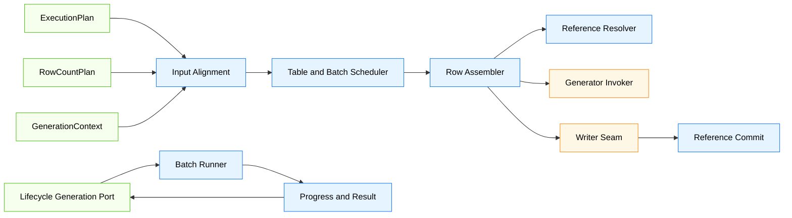
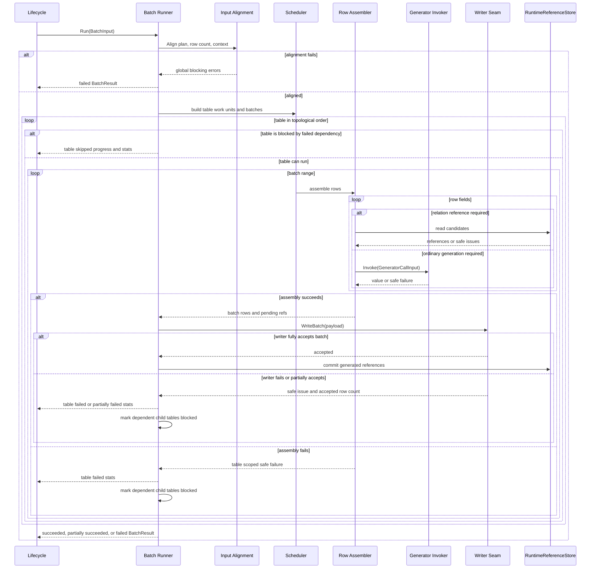
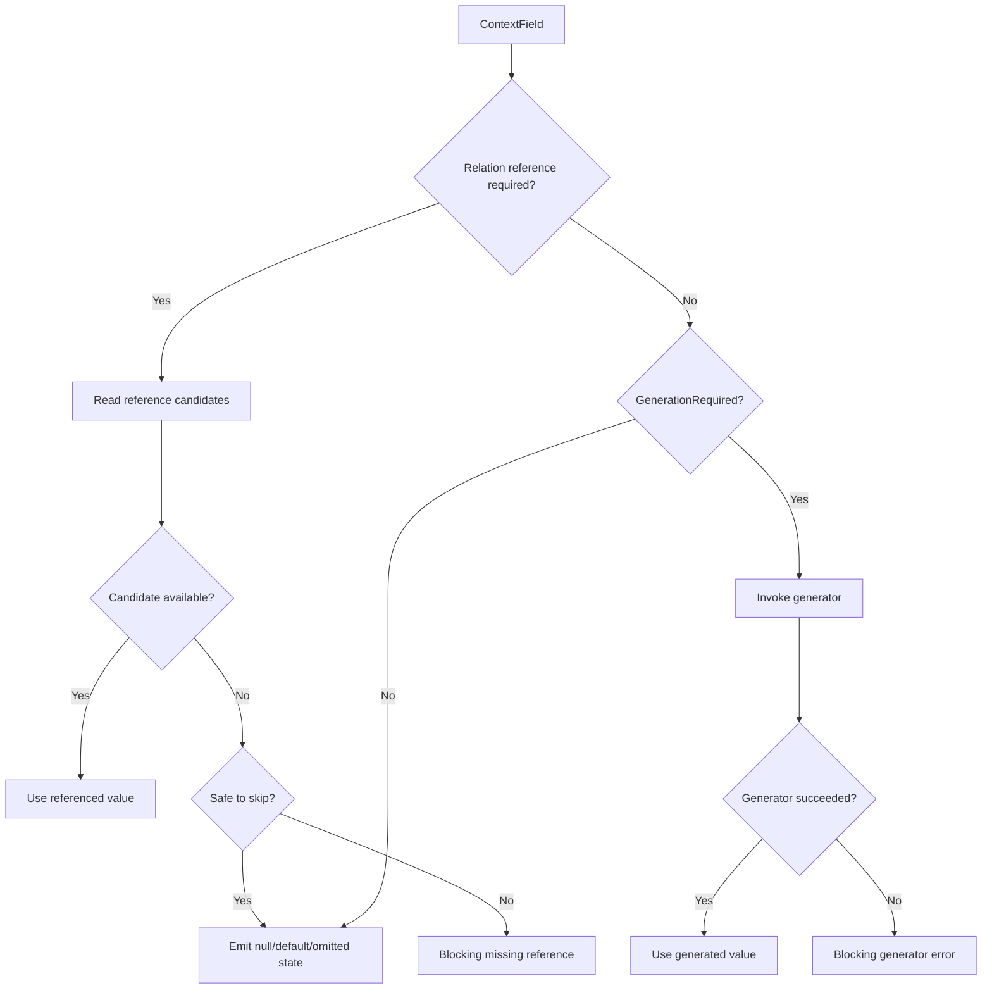
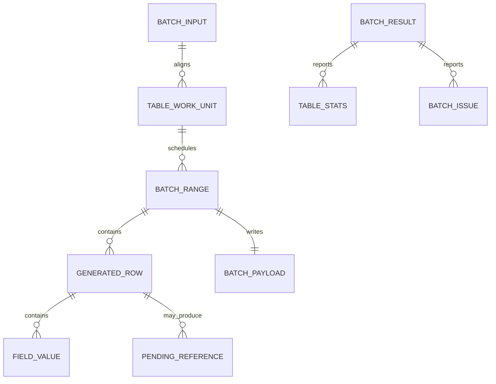

# Design Document

## Overview

`phase-03-batch-generation-loop` 在 Go 后端 engine 层建立批量生成主循环，使 lifecycle generation 阶段能够基于 `ExecutionPlan`、`RowCountPlan` 和 `GenerationContext` 按拓扑表顺序、批次范围和字段计划生成行数据。该主循环负责调用最小 generator invoker、优先填充关系引用、组装批次行值、在 writer seam 成功后记录运行态引用，并将进度与安全失败摘要返回给 lifecycle。

本规格只定义主循环和接缝，不实现完整 generator registry、内置 generator、writer adapter 内部、真实数据库写入、事务、清空策略、UI/API/Wails 事件推送或高级并行调度。

### Goals

- 消费上游 `ExecutionPlan.OrderedTables`、`RowCountPlan.Tables` 和 `GenerationContext.Tables`，完成输入对齐和生成工作单元构建。
- 按拓扑顺序逐表执行，并按目标行数切分确定性批次。
- 为批次内每行按字段视图组装值，优先使用关系引用，必要时调用最小 generator invoker。
- 将组装完成的批次传递给 writer seam，并在成功后记录可供下游使用的运行态引用。
- 输出 lifecycle 兼容的进度、统计和安全错误摘要。
- 通过测试固定边界，防止未来 generator、writer、DB、UI 或高级调度能力进入本包。

### Non-Goals

- 不实现 generator registry、内置 generator、随机算法或参数 schema 校验。
- 不实现 writer adapter 内部、真实数据库连接、SQL 执行、事务、清空策略或重试策略。
- 不重新构建依赖图、拓扑排序、行数规划或生成上下文。
- 不实现 UI/API/Wails 事件推送或执行历史持久化。
- 不实现跨表高级并行调度、外部数据源 generator 或真实 DB 查询引用。
- 不按数据库产品名称硬编码生成或写入规则。

## Boundary Commitments

### This Spec Owns

- `internal/engine/batch` 内的批量生成输入、配置、表/批次工作单元和生成结果模型。
- ExecutionPlan、RowCountPlan、GenerationContext 的对齐校验。
- 拓扑表调度和确定性批次切分。
- 行缓冲、字段值状态和批次数据模型。
- 最小 `GeneratorInvoker` 和 `BatchWriter` 接缝接口。
- 关系字段优先读取引用、普通字段调用 generator 的调度规则。
- writer seam 成功后运行态引用记录规则。
- lifecycle 兼容进度、统计和安全错误摘要。
- Project 级部分成功语义：默认在失败表之外继续执行可安全继续的独立表，并在结果中汇总成功、失败和跳过范围。
- 边界测试：禁止 UI/Wails/DB driver/store/facade、generator registry、writer internals 和 future capabilities。

### Execution Continuation Semantics

本规格采用依赖感知的部分成功模型，而不是默认 fail-fast 模型。`BatchIssue.Blocking` 表示问题会阻断其 `Scope` 所覆盖的表、批次、行、字段或依赖子树，不表示整个 Project 必须立即终止。

- 输入对齐失败和批次配置非法属于执行前全局阻断：不进入任何表生成。
- 表内字段生成失败、关系引用缺失、writer 失败、writer 部分接受或引用提交失败会停止当前受影响表的继续生成，并记录该表失败或部分失败统计。
- 如果失败表存在下游依赖表，batch runner 只能基于 `ExecutionPlan.Edges` 标记这些依赖表为 skipped/blocked，不得继续生成依赖失败引用的子表。
- 与失败表无依赖关系的后续表默认继续按拓扑顺序执行，最终 `BatchResult` 可以返回部分成功状态。
- 未来可由 lifecycle 或执行选项引入“失败即终止”策略；该策略不属于本规格，batch runner 不应把 fail-fast 作为默认行为。
- 最终统计必须表达 Project 和表级的目标行数、成功行数、失败行数、成功表数、失败表数、跳过表数和安全失败明细。

### Out of Boundary

- lifecycle 状态机和执行历史由 `internal/engine/lifecycle` 或后续结果规格负责。
- 依赖图和拓扑排序由 `internal/engine/plan` 负责。
- 行数规划由 `internal/engine/rowcount` 负责。
- 生成上下文、字段规则视图和引用存储基础能力由 `internal/engine/gencontext` 负责。
- generator registry、内置 generator 和参数 schema 校验由后续 generator framework 负责。
- writer adapter、事务、清空策略和真实数据库写入由后续 writer 规格负责。
- API、Facade、Wails binding、Vue 页面和事件推送不属于本规格。

### Allowed Dependencies

- 可依赖 `internal/engine/plan` 的 `ExecutionPlan`、`PlannedTable` 和 `DependencyEdge`；batch 包只能消费 `ExecutionPlan.Edges` 判断已计划的上下游关系，不得重建依赖图或重新推导关系边。
- 可依赖 `internal/engine/rowcount` 的 `RowCountPlan` 和 `PlannedRowCount`。
- 可依赖 `internal/engine/gencontext` 的 `GenerationContext`、`ContextTable`、`ContextField`、`GeneratorCallInput`、引用读取和引用记录接口。
- 可依赖 `internal/engine/lifecycle` 的安全错误、阶段或 generation seam 同构字段；若 lifecycle 类型尚未实现，则 batch 包先使用同构字段保持兼容。
- 可依赖 Go 标准库、排序和测试能力。
- 不新增第三方依赖。

### Revalidation Triggers

- `ExecutionPlan`、`RowCountPlan` 或 `GenerationContext` 的表身份、顺序或目标行数字段发生破坏性变更。
- `RuntimeReferenceStore` 的引用记录提交语义发生变化。
- lifecycle generation port 或安全错误字段发生破坏性变更。
- writer adapter 后续要求批次数据模型新增必填状态。
- generator framework 后续要求 `GeneratorCallInput` 调用契约新增必填字段。
- batch 包出现 UI/Wails/DB driver/store/facade 或数据库产品名称分支依赖。

## Architecture

### Existing Architecture Analysis

- `internal/engine/lifecycle` 负责执行入口、预检、状态机和下游阶段接缝，不实现批次生成。
- `internal/engine/plan` 输出稳定拓扑表顺序，不计算行数或字段值。
- `internal/engine/rowcount` 输出每表目标行数，不组织批次或生成行数据。
- `internal/engine/gencontext` 输出只读执行期上下文、字段计划视图、最小 generator call input 和运行态引用存储，不实现主循环。
- Steering 指定 engine 拥有调度与上下文，generator 不直接访问数据库，Wails binding 不承载业务逻辑。

### Architecture Pattern & Boundary Map



**Architecture Integration**:
- Selected pattern: independent engine batch package + interface seams for generator and writer。
- Domain/feature boundaries: batch 包消费计划和上下文，组织生成流程；generator 和 writer 通过接口接入；lifecycle 消费结果和进度。
- Existing patterns preserved: engine owns scheduling; domain remains snapshot-only; Wails/Vue/store/facade/DB driver 不进入生成判断。
- New components rationale: 批次调度、行组装、引用提交和 writer seam 调用是生成阶段必要的稳定边界。
- Steering compliance: 不跨阶段实现 Phase 4/5 generator registry 或 writer internals；不泄露敏感数据；不按数据库类型硬编码。

### Technology Stack

| Layer | Choice / Version | Role in Feature | Notes |
|-------|------------------|-----------------|-------|
| Frontend / CLI | 不涉及 | 无 UI 或 CLI 变更 | 不新增 Wails/Vue 事件 |
| Backend / Engine | Go | 批量生成主循环、调度、行组装和测试 | 位于 `internal/engine/batch` |
| Domain | 既有 Go domain 包 | 通过上游上下文间接提供快照 | 不修改持久化语义 |
| Generator | 接口接缝 | 最小字段值生成调用 | 不实现 registry 或 built-ins |
| Writer | 接口接缝 | 接收批次数据 | 不实现真实写入 |
| Infrastructure | Go 标准库 | slice、map、sort、testing | 不新增第三方依赖 |

## File Structure Plan

### Directory Structure

```text
internal/
└── engine/
    └── batch/
        ├── input.go          # BatchInput、BatchConfig、计划/上下文对齐输入
        ├── model.go          # 表工作单元、批次范围、行值、字段值状态和统计模型
        ├── scheduler.go      # 拓扑表调度和确定性批次切分
        ├── assembler.go      # 行缓冲与字段处理协调
        ├── reference.go      # 关系引用读取、pending 引用和成功后提交规则
        ├── generator.go      # GeneratorInvoker 接口和调用结果映射
        ├── writer.go         # BatchWriter seam、批次负载和写入结果映射
        ├── progress.go       # 表/批次/行进度摘要和统计
        ├── result.go         # BatchResult、BatchProgress、生成统计和 lifecycle seam 结果
        ├── errors.go         # 安全错误码、阶段、字段路径和敏感信息过滤
        ├── runner.go         # 主循环协调入口
        ├── scheduler_test.go # 表调度、批次切分、零行表测试
        ├── assembler_test.go # 行组装、字段状态、generator 调用测试
        ├── reference_test.go # 关系优先、引用缺失、引用提交测试
        ├── runner_test.go    # 成功路径、generator 失败、writer 失败和生命周期接缝测试
        └── boundary_test.go  # 禁止依赖、禁止未来能力和敏感信息边界测试
```

### Modified Files

- 无现有业务文件必须修改；本规格应新增 engine batch 子包并通过测试验证边界。
- `go.mod` 不应因为本规格新增第三方依赖而变化；如实现发现必须引入依赖，应返回设计复核。
- lifecycle 包只有在后续集成需要时通过既有 generation port 接入，不应改变 lifecycle 状态机。
- plan、rowcount 和 gencontext 包不应为了 batch 内部状态而修改其持久化或输出语义。

## System Flows

### Batch Generation Flow



### Field Value Decision Flow



## Requirements Traceability

| Requirement | Summary | Components | Interfaces | Flows |
|-------------|---------|------------|------------|-------|
| 1.1 | 建立表级生成工作单元 | Input Alignment, Runner | BatchInput | Batch Generation Flow |
| 1.2 | 保留最小执行字段 | Input Alignment, Model | TableWorkUnit | Batch Generation Flow |
| 1.3 | 三类计划/上下文一致性校验 | Input Alignment, Errors | BatchIssue | Batch Generation Flow |
| 1.4 | 任务和 Project 边界校验 | Input Alignment | BatchIssue | Batch Generation Flow |
| 1.5 | 禁止重建上游能力和读取外部层 | Boundary Tests | Package boundary | Boundary tests |
| 2.1 | 按拓扑顺序逐表执行 | Scheduler, Runner | TableWorkUnit | Batch Generation Flow |
| 2.2 | 按目标行数切分批次 | Scheduler | BatchRange | Batch Generation Flow |
| 2.3 | 零行表完成语义 | Scheduler, Progress | TableStats | Batch Generation Flow |
| 2.4 | 批次大小安全校验 | Input Alignment, Errors | BatchConfig | Batch Generation Flow |
| 2.5 | 禁止高级并行和计划写回 | Boundary Tests | Package boundary | Boundary tests |
| 3.1 | 行缓冲和字段顺序 | Row Assembler | RowBuffer | Field Value Decision Flow |
| 3.2 | 构造 GeneratorCallInput | Row Assembler, Generator Invoker | GeneratorInvoker | Field Value Decision Flow |
| 3.3 | 默认/可空/省略语义 | Model, Writer Payload | FieldValue | Field Value Decision Flow |
| 3.4 | 字段调用失败诊断 | Errors, Runner | BatchIssue | Batch Generation Flow |
| 3.5 | 禁止生成器实现 | Boundary Tests | Package boundary | Boundary tests |
| 4.1 | 关系字段引用优先 | Reference Resolver | ContextReferenceReader | Field Value Decision Flow |
| 4.2 | 引用值替代普通生成 | Row Assembler | FieldValue | Field Value Decision Flow |
| 4.3 | 外部来源缺失能力安全表达 | Reference Resolver, Errors | BatchIssue | Field Value Decision Flow |
| 4.4 | 必需引用缺失阻断 | Reference Resolver, Errors | BatchIssue | Batch Generation Flow |
| 4.5 | 不泄露引用原始值 | Errors, Boundary Tests | SafeMessage | Boundary tests |
| 5.1 | 成功生成键值引用记录 | Reference Commit | RuntimeReferenceStore | Batch Generation Flow |
| 5.2 | writer 成功后引用可见 | Reference Commit, Runner | PendingReference | Batch Generation Flow |
| 5.3 | writer 失败不提交引用 | Reference Commit, Runner | PendingReference | Batch Generation Flow |
| 5.4 | 引用记录失败阻断 | Reference Commit, Errors | BatchIssue | Batch Generation Flow |
| 5.5 | 禁止跨任务缓存和持久化生成值 | Boundary Tests | Package boundary | Boundary tests |
| 6.1 | writer seam 批次负载 | Writer Seam | BatchWriter, BatchPayload | Batch Generation Flow |
| 6.2 | writer 成功推进 | Runner, Progress | BatchWriteResult | Batch Generation Flow |
| 6.3 | writer 失败安全映射 | Writer Seam, Errors | BatchIssue | Batch Generation Flow |
| 6.4 | 字段值状态区分 | Model, Writer Payload | FieldValueState | Field Value Decision Flow |
| 6.5 | 禁止真实数据库写入 | Boundary Tests | Package boundary | Boundary tests |
| 7.1 | 进度摘要 | Progress | BatchProgress | Batch Generation Flow |
| 7.2 | 成功结果和统计 | Result | BatchResult | Batch Generation Flow |
| 7.3 | 阻断失败结果 | Errors, Result | BatchIssue | Batch Generation Flow |
| 7.4 | lifecycle 兼容字段 | Result | GenerationResult seam | Batch Generation Flow |
| 7.5 | 禁止直接 UI/API/Wails/历史写入 | Boundary Tests | Package boundary | Boundary tests |
| 8.1 | 安全错误字段限制 | Errors | BatchIssue | Batch Generation Flow |
| 8.2 | 下游原始错误过滤 | Errors | SafeMessage | Boundary tests |
| 8.3 | 安全位置标识 | Errors | FieldPath, Scope | Batch Generation Flow |
| 8.4 | 敏感信息测试 | Boundary Tests | SafeMessage | Boundary tests |
| 8.5 | 不透传原始载荷 | Errors, Boundary Tests | BatchIssue | Boundary tests |
| 9.1 | 调度/组装/writer 测试 | Unit Tests | Go tests | Test flows |
| 9.2 | 关系/失败/诊断测试 | Unit Tests | Go tests | Test flows |
| 9.3 | lifecycle/writer 接缝测试 | Seam Tests | Fake ports | Test flows |
| 9.4 | 禁止外部依赖测试 | Boundary Tests | Import checks | Boundary tests |
| 9.5 | 禁止未来能力测试 | Boundary Tests | Source scans | Boundary tests |

## Components and Interfaces

| Component | Domain/Layer | Intent | Req Coverage | Key Dependencies | Contracts |
|-----------|--------------|--------|--------------|------------------|-----------|
| Batch Input Alignment | Engine Batch | 校验计划、行数和上下文一致性 | 1.1-1.5, 2.4 | plan, rowcount, gencontext | Service |
| Table and Batch Scheduler | Engine Batch | 构造表工作单元和批次范围 | 2.1-2.5 | Input Alignment | Service |
| Row Assembler | Engine Batch | 按字段视图组装行值 | 3.1-3.5, 4.1-4.4 | gencontext, GeneratorInvoker | Service |
| Reference Resolver and Committer | Engine Batch | 读取关系引用并在 writer 成功后记录引用 | 4.1-5.5 | RuntimeReferenceStore | Service, State |
| Generator Invoker Seam | Interface | 调用最小字段生成能力 | 3.2-3.5 | gencontext GeneratorCallInput | Port |
| Batch Writer Seam | Interface | 接收组装完成的批次 | 6.1-6.5 | BatchPayload | Port |
| Progress and Result Mapper | Engine Batch | 输出 lifecycle 兼容进度、统计和结果 | 7.1-7.5 | lifecycle-compatible fields | Service |
| Safe Batch Error Mapper | Engine Batch | 安全错误码、阶段和敏感信息过滤 | 8.1-8.5 | Go standard library | Service |
| Boundary & Seam Tests | Test | 固定边界和未来能力隔离 | 9.1-9.5 | Go test tooling | Test |

### Batch Input Alignment

| Field | Detail |
|-------|--------|
| Intent | 接收上游计划和上下文，生成主循环可消费的工作单元 |
| Requirements | 1.1-1.5, 2.4 |

**Responsibilities & Constraints**
- 校验 TaskID、ProjectID、ProjectTableID、TableID、ExecutionOrder 和 TargetRows 一致性。
- 校验 BatchConfig 的批次大小安全边界。
- 建立 ProjectTableID 到 ContextTable / PlannedRowCount 的索引。
- 基于 `ExecutionPlan.Edges` 建立只读下游依赖索引，用于 writer 部分接受后的安全推进判断；该索引不得新增、删除或推导依赖边。
- 不修正或写回上游计划和上下文。

**Conceptual Contract**

```go
type BatchInput struct {
    TaskID int64
    ProjectID int64
    ExecutionPlan plan.ExecutionPlan
    RowCountPlan rowcount.RowCountPlan
    Context *gencontext.GenerationContext
    Config BatchConfig
    Generator GeneratorInvoker
    Writer BatchWriter
    Progress ProgressSink
}

type BatchConfig struct {
    BatchSize int64
    MaxBatchSize int64
}
```

### Table and Batch Scheduler

| Field | Detail |
|-------|--------|
| Intent | 按拓扑顺序和目标行数构造确定性批次 |
| Requirements | 2.1-2.5 |

**Responsibilities & Constraints**
- 保持 `ExecutionPlan.OrderedTables` 顺序。
- 将目标行数切分为连续 `[StartRow, EndRow)`。
- 零行表输出完成统计但不生成字段、不调用 writer。
- 不进行跨表并行或动态重排。

**Conceptual Contract**

```go
type TableWorkUnit struct {
    ProjectTableID int64
    TableID int64
    ExecutionOrder int
    TargetRows int64
    Fields []gencontext.ContextField
    Batches []BatchRange
}

type BatchRange struct {
    BatchIndex int64
    StartRow int64
    EndRow int64
}
```

### Row Assembler

| Field | Detail |
|-------|--------|
| Intent | 将字段计划视图转换为批次行值集合 |
| Requirements | 3.1-4.4, 6.4 |

**Responsibilities & Constraints**
- 按字段顺序为每行组装 `FieldValue`。
- 关系字段先请求引用；普通生成字段调用 generator invoker。
- 保留 `Value`、`Null`、`OmittedDefault` 等可区分状态。
- 收集 pending references，等待 writer 成功后提交。

**Conceptual Contract**

```go
type FieldValueState string

const (
    FieldValuePresent FieldValueState = "present"
    FieldValueNull FieldValueState = "null"
    FieldValueOmittedDefault FieldValueState = "omitted_default"
)

type FieldValue struct {
    ColumnID int64
    State FieldValueState
    Value any
}

type BatchRows struct {
    Range BatchRange
    Rows []GeneratedRow
    PendingReferences []PendingReference
}

type GeneratedRow struct {
    RowIndex int64
    Values []FieldValue
}
```

### Generator Invoker Seam

| Field | Detail |
|-------|--------|
| Intent | 为后续 generator framework 提供最小调用接缝 |
| Requirements | 3.2-3.5 |

**Responsibilities & Constraints**
- 接收上游 gencontext 提供的 `GeneratorCallInput`。
- 返回单字段值或安全失败摘要。
- 本包不选择实现、不维护 registry、不解释参数 schema。

**Conceptual Contract**

```go
type GeneratorInvoker interface {
    Generate(input gencontext.GeneratorCallInput) (GeneratedValue, error)
}

type GeneratedValue struct {
    State FieldValueState
    Value any
}
```

### Reference Resolver and Committer

| Field | Detail |
|-------|--------|
| Intent | 管理关系字段引用读取和生成后引用提交 |
| Requirements | 4.1-5.5 |

**Responsibilities & Constraints**
- 判断字段是否需要关系引用优先。
- 通过 GenerationContext 安全引用访问器读取当前执行内候选。
- 当关系值来源依赖外部 DB 查询，或父表键值只能在数据库写入后由数据库生成时，本规格不得执行 SQL、不得读取真实数据库、不得用普通 generator 伪造 FK；在外部 DB/reference-read seam 尚未接入前，应返回安全阻断问题。
- 缺失必需引用时返回阻断错误。
- writer seam 成功后提交 pending references。
- 不跨任务缓存，不公开原始引用值。

**Conceptual Contract**

```go
type PendingReference struct {
    TaskID int64
    ProjectTableID int64
    TableID int64
    ColumnID int64
    RowIndex int64
    Value any
}
```

### Batch Writer Seam

| Field | Detail |
|-------|--------|
| Intent | 将完成组装的批次交给后续 writer adapter |
| Requirements | 6.1-6.5 |

**Responsibilities & Constraints**
- 接收批次负载。
- 返回 writer/result 兼容的接受结果、受影响行数、statement 统计、部分接受标记和安全 issue。
- 不由 batch 包实现真实数据库写入、事务或清空策略。
- batch 包只消费 writer seam 结果并映射为 batch 进度与统计；writer adapter 继续拥有 capability、dialect、transaction、clear 和 executor 语义。
- writer seam 的部分接受是单批次行级结果语义，不等同于 Project 必须终止；batch runner 必须将其映射为当前表部分失败，并继续执行不依赖该表的后续表。

**Conceptual Contract**

```go
type BatchWriter interface {
    WriteBatch(payload BatchPayload) (BatchWriteResult, error)
}

type BatchPayload struct {
    TaskID int64
    ProjectID int64
    ProjectTableID int64
    TableID int64
    Range BatchRange
    Columns []int64
    Rows []GeneratedRow
}

type BatchWriteResult struct {
    AcceptedRows int64
    StatementCount int64
    PartialAccepted bool
    Issues []BatchIssue
    Warnings []BatchIssue
    Scope BatchIssueScope
}
```

`AcceptedRows` 表示 writer seam 接受的行数。当 `PartialAccepted == false`、`AcceptedRows == int64(len(payload.Rows))` 且没有阻断错误时，batch runner 才可按整批成功处理并提交该批次 pending references。

当 `PartialAccepted == true` 或 `AcceptedRows` 小于批次行数时，batch runner 必须把该批次映射为当前表的部分失败：记录 `AcceptedRows` 为成功行数，记录未接受行数为失败行数，保留安全 issue，并且不得提交该批次 pending references。batch runner 必须只基于 `ExecutionPlan.Edges` 判断当前表是否存在下游子表，不得重建 `DependencyGraph`、扫描 domain 关系快照或重新推导关系边。若存在 `edge.FromProjectTableID == payload.ProjectTableID`，则依赖该父表的后续子表必须标记为 skipped/blocked，且不得继续生成依赖该失败引用的表；若不存在下游 edge，则可继续执行后续独立表。无论是否存在下游 edge，writer 部分接受都不应默认终止整个 Project，最终结果应以部分成功状态向 lifecycle 汇报。

`Issues`、`Warnings` 和 `Scope` 必须只包含安全标识和固定安全消息；statement index、transaction/clear/dialect/executor 等 writer 阶段细节可通过 scope 或 issue stage 传递给 result 聚合，但不得包含 SQL、参数值、连接字符串、生成值或 raw driver error。

### Progress and Result Mapper

| Field | Detail |
|-------|--------|
| Intent | 输出 lifecycle 可消费的生成进度、统计和最终结果 |
| Requirements | 7.1-7.5 |

**Responsibilities & Constraints**
- 生成表/批次开始、完成、失败和跳过摘要。
- 统计 Project 与表级目标行数、成功行数、失败行数、批次数、成功表数、失败表数和跳过表数。
- 将安全 issue 聚合到 `BatchResult`，并保留 issue 的阻断作用域。
- 任务级和表级完成状态直接复用 `internal/domain/execution` 的 canonical execution status，不新增语义重复的 batch 状态枚举。
- 区分整体成功、部分成功和失败：只要至少一个表成功且至少一个表失败或跳过，结果状态使用 `execution.ExecutionTaskStatusPartialFailed`。
- 只有 batch 阶段、字段值状态、错误作用域等确有不同语义的概念才允许新增局部类型。
- 不推送 UI/API/Wails 事件，不写执行历史。

**Conceptual Contract**

```go
type BatchResult struct {
    Status execution.ExecutionTaskStatus
    Summary GenerationSummary
    Stats []TableGenerationStats
    Issues []BatchIssue
    Warnings []BatchIssue
}

type GenerationSummary struct {
    TargetRows int64
    SucceededRows int64
    FailedRows int64
    SucceededTables int64
    FailedTables int64
    SkippedTables int64
}

type TableGenerationStats struct {
    ProjectTableID int64
    TableID int64
    TargetRows int64
    SucceededRows int64
    FailedRows int64
    Status execution.ExecutionTableStatus
}

type BatchProgress struct {
    TaskID int64
    ProjectTableID int64
    TableID int64
    BatchIndex int64
    TargetRows int64
    CompletedRows int64
    Stage BatchStage
}
```

## Data Models

### Domain Model

- `BatchInput`: 主循环输入，包含计划、上下文、配置和接缝。
- `BatchConfig`: 批次大小和安全上限。
- `TableWorkUnit`: 单个执行表的生成工作单元。
- `BatchRange`: 批次行序范围。
- `GeneratedRow`: 单行生成结果。
- `FieldValue`: 字段值及状态。
- `PendingReference`: writer 成功后待记录引用。
- `BatchPayload`: writer seam 批次负载。
- `BatchResult`: 主循环最终结果。
- `BatchIssue`: lifecycle 兼容安全错误。

### Logical Data Model



**Consistency & Integrity**
- 每个 `TableWorkUnit` 必须同时存在于 ExecutionPlan、RowCountPlan 和 GenerationContext。
- 每个批次范围必须连续、无重叠且覆盖 `[0, TargetRows)`。
- writer seam 成功前 pending references 不得成为下游可见引用。
- 排序成功时，表执行仍按拓扑顺序推进；被失败依赖阻断的表标记为 skipped/blocked，独立后续表继续执行。
- 失败时不得继续依赖失败表引用的后续表生成，但不得因此默认阻断无依赖关系的独立表。

### Physical Data Model

- 不新增数据库表、迁移、索引或本地存储结构。
- 不写回 Project、Schema、ExecutionTask、ExecutionPlan、RowCountPlan 或 GenerationContext 持久化字段。
- 不持久化生成值、引用值或 writer 原始错误载荷。

## Error Handling

### Error Strategy

- 输入对齐错误：返回全局阻断 `BatchIssue`，不生成任何批次。
- 批次配置错误：返回全局阻断 `BatchIssue`，防止无限循环或过大内存占用。
- 引用缺失：字段级阻断错误，消息不包含引用原始值；当前表失败，依赖该表的后续表跳过，独立表继续。
- 外部引用读取能力缺失：当关系值需要外部 DB 查询或数据库生成键值回读时，返回安全阻断问题，不执行 SQL、不调用普通 generator 替代；影响范围同引用缺失。
- Generator invoker 失败：映射为字段级阻断错误，过滤原始错误；当前表停止继续生成，依赖该表的后续表跳过，独立表继续。
- Writer seam 失败：映射为批次级阻断错误，不提交 pending references；当前表失败，依赖该表的后续表跳过，独立表继续。
- Writer seam 部分接受：记录成功行数和失败行数，不提交该批次 pending references；当前表部分失败，依赖该表的后续表跳过，独立表继续。
- 引用提交失败：返回引用作用域阻断错误，当前表失败，依赖该引用的后续表跳过，独立表继续。
- 敏感内容：公开消息使用固定安全文本和安全位置，不透出 SQL、连接、密码、令牌、规则参数或生成值。

### Error Categories and Responses

| Category | Trigger | Response | Generation Impact |
|----------|---------|----------|-------------------|
| Input Alignment | 计划、行数和上下文不一致 | 全局阻断错误 | 不进入生成 |
| Batch Config | 批次大小非法 | 全局阻断错误 | 不进入生成 |
| Missing Reference | 必需关系候选缺失 | 字段级阻断错误 | 当前表失败；依赖子表跳过；独立表继续 |
| External Reference Read Missing | 外部 DB 查询来源或数据库生成父键需要回读但 seam 未接入 | 字段级阻断错误 | 当前表失败；依赖子表跳过；独立表继续 |
| Generator Failure | invoker 返回失败或无值 | 字段级阻断错误 | 当前表失败；依赖子表跳过；独立表继续 |
| Writer Failure | seam 返回失败 | 批次级阻断错误 | 不提交引用；当前表失败；依赖子表跳过；独立表继续 |
| Writer Partial Accepted | seam 只接受部分行 | 批次级部分失败 | 记录成功/失败行数；不提交该批次引用；依赖子表跳过；独立表继续 |
| Reference Commit Failure | 引用存储返回问题 | 引用作用域阻断错误 | 当前表失败；依赖子表跳过；独立表继续 |
| Sensitive Payload | 原始错误包含敏感内容 | 安全消息替换 | 按原错误类别和作用域处理 |

### Public Error Fields

```go
type BatchIssue struct {
    Code BatchErrorCode
    Stage BatchStage
    FieldPath string
    SafeMessage string
    Blocking bool
    Scope BatchIssueScope
}
```

- `FieldPath` 使用安全身份路径，例如 `tables[projectTableID=10].columns[columnID=20]`。
- `Scope` 可包含 TaskID、ProjectTableID、TableID、ColumnID、BatchIndex 和 RowIndex。
- `Blocking` 表示该 issue 会阻断 `Scope` 内的继续生成；只有输入对齐和批次配置类 issue 才表示全局执行前阻断。
- `SafeMessage` 不包含 SQL、连接字符串、密码、令牌、规则参数原文或生成数据内容。

### Monitoring

本规格不实现运行时日志、追踪、UI 事件或历史持久化。`ProgressSink` 只作为 lifecycle 或后续结果模型可消费的内存接缝；公开输出仍遵守安全摘要边界。

## Testing Strategy

### Unit Tests

- 输入对齐测试：计划、行数和上下文一致时建立工作单元；ProjectTable 缺失、TableID 不一致、顺序不一致、目标行数不一致时返回全局阻断错误。
- 批次调度测试：目标行数小于、等于、大于批次大小时范围稳定；零行表不调用 generator 或 writer。
- 行组装测试：字段顺序稳定；普通生成字段调用 generator；可空/默认/省略语义保留不同状态。
- 关系字段测试：关系引用优先；引用存在时不调用 generator；引用缺失时阻断当前表；外部来源不执行 SQL；数据库生成父键需要回读时在 seam 未接入前返回安全阻断问题。
- 引用记录测试：writer 成功后提交 pending references；writer 失败或部分接受不提交该批次引用；引用提交失败阻断当前表及其依赖子表。
- Writer seam 测试：批次负载包含安全身份、范围、列和行值；writer 失败映射为当前表失败；部分接受时记录成功行数和失败行数，并只基于 `ExecutionPlan.Edges` 判断下游依赖跳过范围。
- 部分成功测试：一个表失败时，依赖它的子表跳过，无依赖关系的后续表继续执行；最终结果为 `execution.ExecutionTaskStatusPartialFailed` 并包含目标行数、成功行数、失败行数、成功表数、失败表数和跳过表数。
- 安全错误测试：公开消息不包含 SQL、连接字符串、密码、令牌、规则参数原文或生成值。

### Integration / Seam Tests

- 使用 fake lifecycle generation port 调用 batch runner，验证成功结果可被 lifecycle 聚合。
- 使用 fake generator invoker 验证 `GeneratorCallInput` 被逐字段构造且不暴露 store/facade/DB。
- 使用 fake writer seam 验证批次负载和失败传播。
- 使用 fake reference store 验证上游表引用可供下游表读取。
- 验证进度 sink 接收表和批次阶段摘要但不触发 UI/API/Wails。

### Boundary Tests

- 检查 `internal/engine/batch` 不导入 Wails、Vue、frontend API、真实数据库 driver、store 或 facade 包。
- 检查 batch 包源码不包含数据库产品名称业务分支。
- 检查 batch 包未实现 dependency graph、topological sort、row count solver、generation context builder、generator registry、built-in generator、writer adapter internals、transaction、clear strategy、external reference read 或 real write 行为。
- 检查 writer 部分接受处理只消费 `ExecutionPlan.Edges`，不从 domain 快照或关系模型重新推导下游依赖。
- 检查 `go.mod` 未因本规格新增第三方依赖。
- 检查测试数据中的敏感 SQL、密码、连接详情、token、规则参数和生成值不会出现在公开 `BatchIssue` 消息中。

## Security Considerations

- 所有公开生成错误只允许包含错误码、阶段、字段路径、安全消息、阻断标记和安全范围摘要。
- Generator、reference store 和 writer seam 的原始错误不得透传给 lifecycle、API、UI、Wails、历史模型或日志。
- 生成值和引用值只在内存中用于当前执行，不跨任务共享或持久化。
- 外部 DB 查询来源只保留能力缺失或来源摘要，不执行 SQL、不读取真实数据库。
- 数据库写入后生成的父表键值必须通过后续外部 DB/reference-read seam 获取；本规格不回读数据库、不用普通 generator 替代外键引用。

## Performance & Scalability

- 批次切分使用简单整数范围，时间复杂度与表数量和批次数线性相关。
- 行组装按批次大小限制内存，不一次性构建整表所有行。
- 本规格不实现并行调度、批次重试、吞吐优化或数据库写入性能策略。
- 批次大小上限用于避免异常配置导致内存过大。

## Migration Strategy

- 不需要数据库迁移、配置迁移或前端迁移。
- 新增 `internal/engine/batch` 包不改变 Phase 2 domain JSON 合同。
- 后续 lifecycle 集成可通过 generation port 接入 batch runner。
- 后续 writer adapter 和 generator framework 可实现本规格定义的 seam，而不重写调度和关系优先规则。

## Supporting References

- `.kiro/specs/phase-03-batch-generation-loop/brief.md`
- `.kiro/steering/roadmap.md`
- `.kiro/steering/product.md`
- `.kiro/steering/tech.md`
- `.kiro/steering/structure.md`
- `.kiro/specs/phase-03-execution-lifecycle/requirements.md`
- `.kiro/specs/phase-03-execution-lifecycle/design.md`
- `.kiro/specs/phase-03-dependency-graph-and-topological-sort/requirements.md`
- `.kiro/specs/phase-03-dependency-graph-and-topological-sort/design.md`
- `.kiro/specs/phase-03-row-count-planning/requirements.md`
- `.kiro/specs/phase-03-row-count-planning/design.md`
- `.kiro/specs/phase-03-generation-context/requirements.md`
- `.kiro/specs/phase-03-generation-context/design.md`
