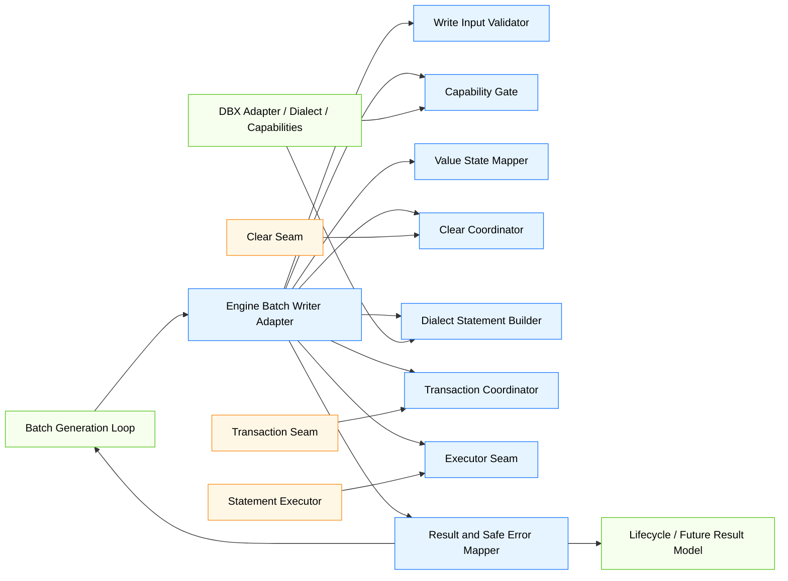
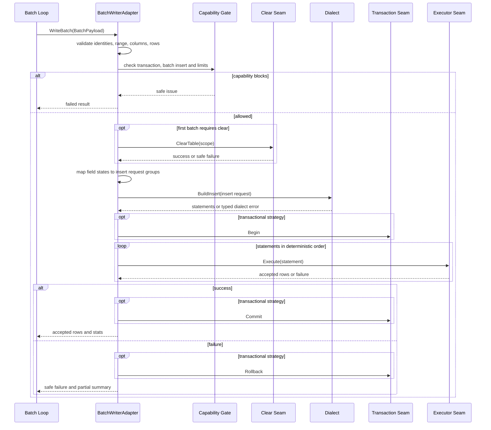
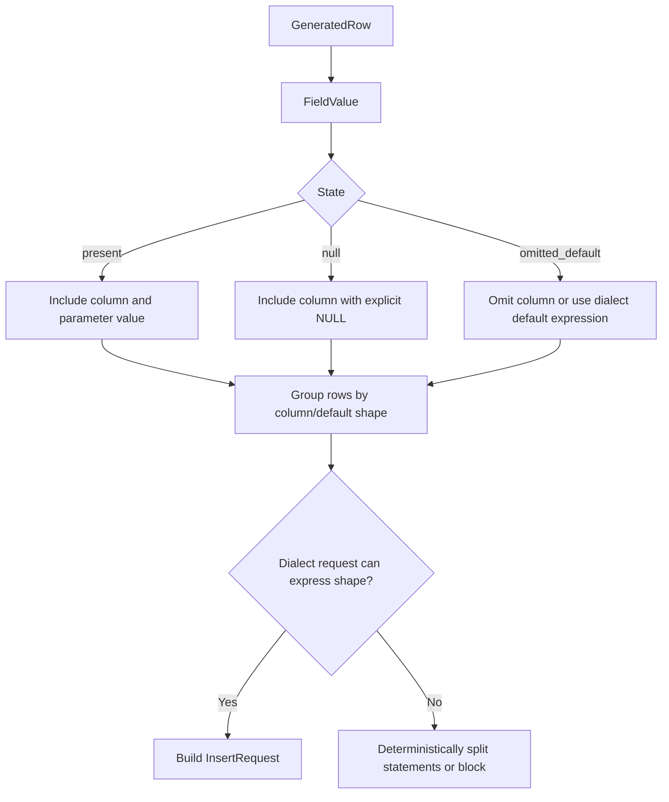
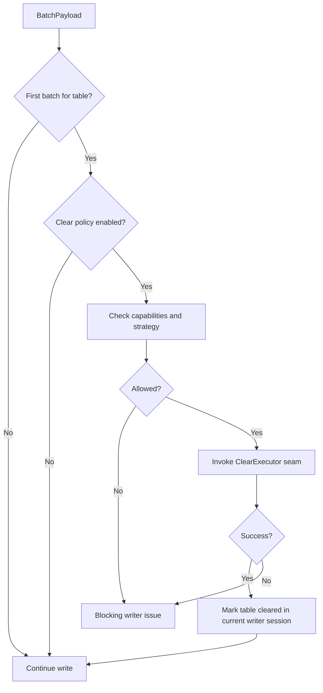
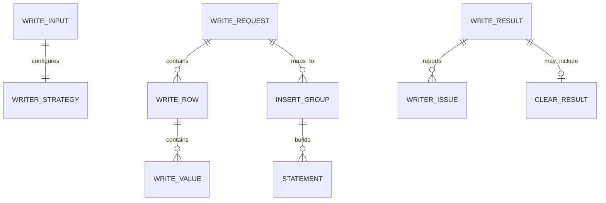

# Design Document

## Overview

`phase-03-batch-writer-adapter` 在 Go 后端 engine 层建立批量写入适配边界，使 `phase-03-batch-generation-loop` 输出的 `BatchPayload` 能够通过 DBX Adapter / Dialect / Capabilities 进入可测试、可安全失败、可汇总统计的写入路径。该设计负责 writer 输入校验、capability-first 策略检查、字段值状态到 insert request 的映射、表级清空 seam 顺序、dialect statement 构建、executor / transaction seam 编排、写入结果汇总和数据库错误安全归一化。

本规格不实现真实数据库连接、真实 SQL 方言实现、连接池、凭据存储、跨数据库迁移、高级重试/断点续跑/幂等策略、UI/API/Wails 历史查询或复杂可观测性管道。数据库差异必须继续由 Adapter、Dialect 和 Capabilities 表达，engine writer 不按数据库产品名称分支。

### Goals

- 定义 engine 侧 `BatchWriter` 适配实现的输入、策略、结果和错误模型。
- 基于 DBX `Capabilities` 校验事务、批量插入、最大行数和参数限制。
- 保留 `present`、`null`、`omitted_default` 字段值状态并映射到 dialect insert request。
- 在表首批写入前表达清空策略和清空 seam 调用顺序。
- 通过 dialect 构建 statement，通过窄 executor / transaction seam 执行。
- 输出 batch loop / lifecycle / result 可消费的 accepted rows、statement count、partial accepted、安全 scope 和安全错误摘要。
- 提供 mock/fake writer、fake executor、fake transaction、fake clear seam 和边界测试。

### Non-Goals

- 不实现完整 MySQL/PostgreSQL/SQLite/其他数据库 SQL。
- 不打开真实数据库连接，不管理连接池，不读取或持久化凭据。
- 不实现真实事务提交/回滚细节之外的 driver 调用。
- 不重新组装生成行、不调用 generator、不读 GenerationContext、不提交 RuntimeReferenceStore。
- 不实现跨表高级清空排序、不关闭外键检查、不执行迁移或同步。
- 不实现高级重试、断点续跑、幂等写入、补偿写入或复杂观测管道。
- 不实现 UI/API/Wails 执行历史查询或进度事件。

## Boundary Commitments

### This Spec Owns

- `internal/engine/writer` 内的 writer input、strategy、result、issue 和 scope 模型。
- Batch loop `BatchPayload` 到 writer adapter `WriteRequest` 的边界校验和转换。
- 基于 DBX `Capabilities` 的事务、批量插入、行数和参数限制前置判断。
- 字段值状态到 dialect insert request 的确定性映射规则。
- 表级清空策略在首批写入前的 seam 调用顺序和失败传播。
- Dialect statement 构建、executor seam 调用和 transaction seam 编排。
- 数据库/dialect/executor/transaction/clear 错误的安全归一化。
- Mock/fake writer 和 seam 测试能力。
- 禁止 UI/Wails/store/facade/driver/数据库产品名称硬编码和未来能力进入本包的边界测试。

### Out of Boundary

- Batch generation loop 内部调度、行组装、关系引用读取和引用提交由 `internal/engine/batch` 负责。
- Lifecycle 状态机和最终历史映射由 `internal/engine/lifecycle` 和后续 result/error spec 负责。
- DBX Adapter / Dialect / Capabilities 接口和值对象由 `internal/dbx` 负责。
- 真实数据库 adapter、真实 SQL 构建、真实 driver 执行和连接生命周期由后续 DBX adapter/service specs 负责。
- Project 持久化模型、清空策略配置 UI、执行历史 API 和 Wails DTO 不在本规格内。

### Allowed Dependencies

- 可依赖 `internal/engine/batch` 的 writer seam 负载、字段值状态、批次范围和行值模型；若实现时为避免循环依赖，可复制同构 DTO 并通过 adapter 函数转换。
- 可依赖 `internal/dbx/core` 的 `Adapter`、`DBType`、连接边界类型的非敏感标识。
- 可依赖 `internal/dbx/capability` 的 `Capabilities`。
- 可依赖 `internal/dbx/dialect` 的 `Dialect`、`InsertRequest`、`Statement`。
- 可依赖 `internal/dbx/schema` 的表/列描述值对象，用于 dialect insert request。
- 可依赖 Go 标准库的 `context`、`errors`、`fmt`、`sort`、`strings`、`testing`。
- 不新增第三方依赖，不导入真实数据库 driver。

### Revalidation Triggers

- Batch loop `BatchPayload`、`GeneratedRow` 或 `FieldValueState` 公开字段发生破坏性变更。
- DBX `Capabilities`、`Dialect.BuildInsert`、`InsertRequest` 或 `Statement` 合同发生破坏性变更。
- Project 清空策略枚举或表级写入配置发生破坏性变更。
- Lifecycle/result model 要求 writer result 新增必填字段。
- 真实 adapter 发现当前 executor/transaction/clear seam 无法表达必要边界。
- writer 包出现真实 driver、Wails、Vue、store、facade 或数据库产品名称分支依赖。

## Architecture

### Existing Architecture Analysis

- `internal/engine/batch` 已定义主循环和 writer seam，writer 只接收组装后的批次负载并返回 accepted rows 或失败。
- `internal/dbx` 已定义 Adapter、Dialect、Capabilities、canonical schema 和 fake 支持，但不执行真实写入。
- `internal/engine/lifecycle` 只聚合阶段成功/失败和安全错误，不实现 writer adapter。
- Steering 指定 engine 拥有 batch writing 的执行边界，Adapter/Dialect/Capabilities 承载数据库差异，业务层避免按数据库类型硬编码。

### Architecture Pattern & Boundary Map



**Architecture Integration**:
- Selected pattern: engine writer package + DBX-driven ports。engine writer 协调策略和安全结果，DBX dialect/adapter 表达数据库差异，executor/transaction/clear 是可替换接缝。
- Domain/feature boundaries: batch 包负责生成与 writer seam 调用；writer 包负责写入适配；dbx 包负责方言和能力；lifecycle/result 消费安全结果。
- Existing patterns preserved: Go 后端 owns engine rules；adapter owns external differences；Wails/Vue 不进入业务路径。
- New components rationale: 写入策略、清空顺序、事务/能力判断和错误归一化不能放在 batch loop，也不能放进通用 DBX adapter 接口。
- Steering compliance: 不跨阶段实现真实 adapter；不泄露敏感数据；不按数据库类型硬编码。

### Technology Stack

| Layer | Choice / Version | Role in Feature | Notes |
|-------|------------------|-----------------|-------|
| Frontend / CLI | 不涉及 | 无 UI 或 CLI 变更 | 不新增 Wails/Vue 事件 |
| Backend / Engine | Go | writer adapter、策略、错误和测试 | 位于 `internal/engine/writer` |
| Engine Batch | 既有/上游 batch seam | 提供 `BatchPayload` 和字段值状态 | 不修改生成主循环语义 |
| DBX | Adapter / Dialect / Capabilities | 能力查询和 statement 构建 | 不实现真实方言 SQL |
| Infrastructure | Go 标准库 | context、errors、排序和测试 | 不新增第三方依赖 |

## File Structure Plan

### Directory Structure

```text
internal/
└── engine/
    └── writer/
        ├── input.go             # WriteInput、WriteRequest、BatchPayload 边界适配和基础校验
        ├── strategy.go          # WriterStrategy、事务/清空/批量策略和能力前置规则
        ├── model.go             # WriteBatch、WriteRow、WriteValue、statement 统计和安全 scope
        ├── capability.go        # Capabilities gate、批次行数/参数限制校验
        ├── mapper.go            # FieldValueState 到 dialect InsertRequest 的映射和 statement 分组
        ├── clear.go             # ClearPolicy、ClearCoordinator、ClearExecutor seam 和首批清空状态
        ├── dialect.go           # Dialect request builder 包装和 typed dialect error 映射
        ├── transaction.go       # TransactionCoordinator、Transaction seam、begin/commit/rollback 边界
        ├── executor.go          # StatementExecutor seam、执行结果和部分接受摘要
        ├── result.go            # WriteResult、TableWriteStats、BatchWriteResult 兼容转换
        ├── errors.go            # WriterErrorCode、WriterStage、WriterIssue、安全过滤
        ├── writer.go            # BatchWriterAdapter 协调入口和 WriteBatch 实现
        ├── fakes.go             # Fake writer/executor/transaction/clear/dialect 测试替身
        ├── input_test.go        # 输入校验和 batch payload 适配测试
        ├── capability_test.go   # capability-first 策略和限制测试
        ├── mapper_test.go       # present/null/omitted_default 和异构行形状测试
        ├── clear_test.go        # 清空顺序、首批清空和清空失败测试
        ├── transaction_test.go  # 事务成功、失败 rollback 和非事务部分接受测试
        ├── writer_test.go       # 成功路径、dialect/executor 失败、结果汇总测试
        └── boundary_test.go     # 禁止依赖、产品名称硬编码和敏感信息边界测试
```

### Modified Files

- 无现有业务文件必须修改；本规格应新增 `internal/engine/writer` 包并通过测试验证边界。
- `go.mod` 不应因为本规格新增第三方依赖而变化。
- `internal/engine/batch` 只有在后续集成需要时通过既有 `BatchWriter` seam 使用 writer adapter，不应把事务、清空或 SQL 逻辑并回 batch 包。
- `internal/dbx` 不应为 engine 写入统计或 lifecycle 错误引入业务字段；如真实 adapter 需要新能力，应通过 DBX 后续规格扩展能力模型。

## System Flows

### Batch Write Flow



### Field Value Mapping Flow



### Clear Strategy Flow



## Requirements Traceability

| Requirement | Summary | Components | Interfaces | Flows |
|-------------|---------|------------|------------|-------|
| 1.1 | 构造表级写入工作单元 | Input Validator, Writer Adapter | WriteInput, BatchPayload | Batch Write Flow |
| 1.2 | 保留最小写入字段 | Input, Model | WriteBatch, WriteValue | Batch Write Flow |
| 1.3 | 负载非法阻断 | Input Validator, Errors | WriterIssue | Batch Write Flow |
| 1.4 | adapter/dialect/capability/executor 缺失阻断 | Input Validator | WriterIssue | Batch Write Flow |
| 1.5 | 不读取上下文/UI/store/凭据 | Boundary Tests | Package boundary | Boundary tests |
| 2.1 | 事务能力检查 | Capability Gate | Capabilities, WriterStrategy | Batch Write Flow |
| 2.2 | 批量插入和限制检查 | Capability Gate | Capabilities | Batch Write Flow |
| 2.3 | 超限阻断或要求上游切分 | Capability Gate, Errors | WriterIssue | Batch Write Flow |
| 2.4 | 能力降级边界 | Capability Gate, Result | CapabilitySummary | Batch Write Flow |
| 2.5 | 禁止数据库类型分支 | Boundary Tests | Source scan | Boundary tests |
| 3.1 | present 映射 | Value Mapper | InsertRequest | Field Value Mapping Flow |
| 3.2 | null 映射 | Value Mapper | InsertRequest | Field Value Mapping Flow |
| 3.3 | omitted/default 映射 | Value Mapper | InsertRequest | Field Value Mapping Flow |
| 3.4 | 异构省略字段处理 | Value Mapper, Dialect Builder | Statement groups | Field Value Mapping Flow |
| 3.5 | 不修改/公开生成值 | Errors, Boundary Tests | SafeMessage | Boundary tests |
| 4.1 | 首批清空 | Clear Coordinator | ClearExecutor | Clear Strategy Flow |
| 4.2 | 保持上游顺序 | Writer Adapter | BatchPayload order | Batch Write Flow |
| 4.3 | 清空能力边界 | Capability Gate, Clear Coordinator | ClearPolicy | Clear Strategy Flow |
| 4.4 | 清空失败阻断 | Clear Coordinator, Errors | WriterIssue | Clear Strategy Flow |
| 4.5 | 不实现 TRUNCATE/DELETE/FK toggle | Boundary Tests | Package boundary | Boundary tests |
| 5.1 | 构造 dialect insert request | Dialect Builder | dialect.InsertRequest | Batch Write Flow |
| 5.2 | statement 顺序执行 | Executor Coordinator | StatementExecutor | Batch Write Flow |
| 5.3 | dialect unsupported 映射 | Dialect Builder, Errors | WriterIssue | Batch Write Flow |
| 5.4 | executor 失败映射 | Executor Coordinator, Errors | WriterIssue | Batch Write Flow |
| 5.5 | 不导入 driver/拼接 SQL | Boundary Tests | Import checks | Boundary tests |
| 6.1 | transaction seam | Transaction Coordinator | Transaction | Batch Write Flow |
| 6.2 | 成功统计 | Result Mapper | WriteResult | Batch Write Flow |
| 6.3 | 事务失败 rollback | Transaction Coordinator | Transaction | Batch Write Flow |
| 6.4 | 非事务部分接受 | Executor Coordinator, Result | PartialAccepted | Batch Write Flow |
| 6.5 | 禁止高级恢复策略 | Boundary Tests | Package boundary | Boundary tests |
| 7.1 | fake writer | Fakes | FakeBatchWriter | Seam tests |
| 7.2 | fake dialect/executor/tx/clear | Fakes | Recorded calls | Seam tests |
| 7.3 | fake failure 安全错误 | Fakes, Errors | WriterIssue | Seam tests |
| 7.4 | deterministic fake success | Fakes | WriteResult | Seam tests |
| 7.5 | 无真实数据库测试 | Boundary Tests | Test boundary | Boundary tests |
| 8.1 | 安全错误字段 | Errors | WriterIssue | Batch Write Flow |
| 8.2 | 过滤原始载荷 | Errors | SafeMessage | Boundary tests |
| 8.3 | 安全定位 | Errors | WriterIssueScope | Batch Write Flow |
| 8.4 | 敏感信息测试 | Boundary Tests | SafeMessage | Boundary tests |
| 8.5 | 不透传原始错误 | Errors, Boundary Tests | WriterIssue | Boundary tests |
| 9.1 | 核心单元测试 | Unit Tests | Go tests | Test flows |
| 9.2 | 清空/事务/失败测试 | Unit Tests | Go tests | Test flows |
| 9.3 | batch/lifecycle 接缝测试 | Seam Tests | Fake ports | Test flows |
| 9.4 | 禁止外部依赖测试 | Boundary Tests | Import checks | Boundary tests |
| 9.5 | 禁止未来能力测试 | Boundary Tests | Source scans | Boundary tests |

## Components and Interfaces

| Component | Domain/Layer | Intent | Req Coverage | Key Dependencies | Contracts |
|-----------|--------------|--------|--------------|------------------|-----------|
| Write Input Validator | Engine Writer | 校验 batch payload、adapter、dialect、executor 和策略边界 | 1.1-1.5 | batch, dbx core | Service |
| Capability Gate | Engine Writer | 基于 capabilities 判断事务、批量和限制 | 2.1-2.5, 4.3 | dbx capability | Service |
| Value State Mapper | Engine Writer | 将 FieldValue 状态映射到 insert request / statement groups | 3.1-3.5 | batch, dbx dialect/schema | Service |
| Clear Coordinator | Engine Writer | 表首批清空 seam 和失败传播 | 4.1-4.5 | ClearExecutor | Service, State |
| Dialect Builder | Engine Writer | 调用 Dialect.BuildInsert 并映射 typed error | 5.1, 5.3 | dbx dialect | Service |
| Transaction Coordinator | Engine Writer | begin/commit/rollback seam 编排 | 6.1, 6.3 | Transaction seam | Service |
| Executor Coordinator | Engine Writer | statement 执行、accepted rows 和部分接受摘要 | 5.2, 5.4, 6.2, 6.4 | StatementExecutor | Service |
| Result and Safe Error Mapper | Engine Writer | 输出 batch/lifecycle 兼容结果和安全错误 | 6.2-8.5 | Go standard library | Service |
| Fakes | Test Support | 无数据库验证 writer 行为和调用顺序 | 7.1-7.5 | Go testing | Service, State |
| Boundary Tests | Test | 固定依赖边界和未来能力隔离 | 9.1-9.5 | Go testing | Test |

### Write Input Validator

| Field | Detail |
|-------|--------|
| Intent | 接收 batch loop payload 和 writer 运行配置，形成可执行写入请求 |
| Requirements | 1.1-1.5 |

**Responsibilities & Constraints**
- 校验 TaskID、ProjectID、ProjectTableID、TableID 和 batch range。
- 校验 Columns 与每行 FieldValue.ColumnID 的一致性。
- 校验 adapter/dialect/capabilities/executor 是否存在。
- 不读取 GenerationContext、Project store、facade、Wails 或凭据存储。

**Conceptual Contract**

```go
type WriteInput struct {
    Adapter dbxcore.Adapter
    Dialect dialect.Dialect
    Capabilities capability.Capabilities
    Strategy WriterStrategy
    Executor StatementExecutor
    Transaction TransactionFactory
    Clearer ClearExecutor
}

type WriteRequest struct {
    TaskID int64
    ProjectID int64
    ProjectTableID int64
    TableID int64
    Range BatchRange
    Columns []int64
    Rows []WriteRow
}
```

### Capability Gate

| Field | Detail |
|-------|--------|
| Intent | 在构建 statement 或执行前阻断不支持的写入策略 |
| Requirements | 2.1-2.5, 4.3 |

**Responsibilities & Constraints**
- 事务策略要求时检查 transaction capability。
- 批量策略要求时检查 batch insert capability。
- 检查最大批量行数、最大参数数和安全本地上限。
- 不根据 database type 分支，不自行拆分上游 batch 以隐藏超限问题。

### Value State Mapper

| Field | Detail |
|-------|--------|
| Intent | 保留字段状态并构造 dialect 可消费的 insert request |
| Requirements | 3.1-3.5 |

**Responsibilities & Constraints**
- `present` 生成列参数。
- `null` 生成显式 NULL 语义。
- `omitted_default` 省略列或使用 dialect 能表达的 default 语义。
- 对异构字段集合进行稳定分组；无法安全表达时阻断。
- 不在错误中包含字段值。

**Conceptual Contract**

```go
type WriteValueState string

const (
    WriteValuePresent WriteValueState = "present"
    WriteValueNull WriteValueState = "null"
    WriteValueOmittedDefault WriteValueState = "omitted_default"
)

type WriteValue struct {
    ColumnID int64
    ColumnName string
    State WriteValueState
    Value any
}
```

### Clear Coordinator

| Field | Detail |
|-------|--------|
| Intent | 在写入前表达表级清空策略的 seam 调用顺序 |
| Requirements | 4.1-4.5 |

**Responsibilities & Constraints**
- 跟踪当前 writer session 中已清空的 ProjectTable。
- 仅在表首批且策略要求时调用 clear seam。
- 将 clear seam 失败映射为表级阻断错误。
- 不生成 TRUNCATE/DELETE SQL，不关闭 FK 检查，不重排跨表清空。

```go
type ClearExecutor interface {
    ClearTable(ctx context.Context, scope ClearScope) (ClearResult, error)
}
```

### Dialect Builder and Executor Coordinator

| Field | Detail |
|-------|--------|
| Intent | 通过 DBX dialect 构建 statements 并通过 executor seam 执行 |
| Requirements | 5.1-5.5, 6.2, 6.4 |

**Responsibilities & Constraints**
- 调用 `Dialect.BuildInsert` 或等价 DBX 构建接口。
- 将 statement 按 dialect 返回顺序执行。
- 汇总 accepted rows 和 statement count。
- 失败时返回安全错误，不泄露 SQL 或参数。

```go
type StatementExecutor interface {
    Execute(ctx context.Context, stmt dialect.Statement) (StatementResult, error)
}

type StatementResult struct {
    AcceptedRows int64
}
```

### Transaction Coordinator

| Field | Detail |
|-------|--------|
| Intent | 表达事务 begin/commit/rollback 边界而不依赖真实 driver |
| Requirements | 6.1, 6.3, 6.5 |

```go
type TransactionFactory interface {
    Begin(ctx context.Context) (Transaction, error)
}

type Transaction interface {
    Executor() StatementExecutor
    Commit(ctx context.Context) error
    Rollback(ctx context.Context) error
}
```

- 事务不可用但策略要求时阻断。
- 事务内执行失败时请求 rollback。
- Rollback 失败也只进入安全摘要，不暴露原始载荷。

### Result and Safe Error Mapper

| Field | Detail |
|-------|--------|
| Intent | 输出 batch/lifecycle/result specs 可消费的安全写入结果 |
| Requirements | 6.2-8.5 |

```go
type WriteResult struct {
    Passed bool
    AcceptedRows int64
    StatementCount int64
    PartialAccepted bool
    BlockingErrors []WriterIssue
    Warnings []WriterIssue
}

type WriterIssue struct {
    Code WriterErrorCode
    Stage WriterStage
    FieldPath string
    SafeMessage string
    Blocking bool
    Scope WriterIssueScope
}
```

- `Scope` 仅包含安全标识：TaskID、ProjectTableID、TableID、ColumnID、BatchIndex、RowIndex、StatementIndex。
- `SafeMessage` 不包含 SQL、连接字符串、DSN、密码、令牌、参数值或生成数据。

## Data Models

### Domain Model

- `WriteInput`: writer adapter 运行依赖、DBX 能力和 seam 配置。
- `WriterStrategy`: 事务、清空、批量、default 表达和限制策略。
- `WriteRequest`: 从 batch payload 转换的写入请求。
- `WriteRow` / `WriteValue`: writer 内部行值模型，保留字段状态。
- `ClearScope` / `ClearResult`: 表级清空 seam 的安全范围和结果。
- `StatementResult`: executor seam 单 statement 结果。
- `WriteResult`: 批次写入结果和统计。
- `WriterIssue`: 安全写入错误摘要。

### Logical Data Model



**Consistency & Integrity**
- 每个 write request 对应一个 batch payload。
- 每个 statement 必须来源于通过 value mapper 构造的 insert request。
- 表级 clear 至多在当前 writer session 的该 ProjectTable 首批前执行一次。
- 事务模式下任一 statement 失败应触发 rollback seam。
- 非事务模式下已执行 statement 的 accepted rows 摘要必须可见。
- 失败结果不得包含 SQL、参数值或生成值。

### Physical Data Model

- 不新增数据库表、迁移、索引或本地存储结构。
- 不写回 Project、Schema、ExecutionTask、ExecutionPlan、RowCountPlan、GenerationContext 或 batch payload。
- 不持久化生成值、SQL、参数值、连接信息或 raw driver error。

## Error Handling

### Error Strategy

- 输入错误：缺少身份、非法范围、列/行不一致、缺失 adapter/dialect/executor 返回阻断 `WriterIssue`。
- 能力错误：事务/批量/限制不满足返回阻断 `WriterIssue`。
- 清空错误：clear seam 失败返回表级阻断错误。
- 映射错误：字段状态无法表达或异构省略集合无法安全处理时阻断。
- Dialect 错误：typed dialect error 映射为安全写入错误。
- Executor 错误：过滤原始错误并保留安全 statement/batch scope。
- Transaction 错误：begin/commit/rollback 失败均安全化；事务内执行失败请求 rollback。
- 敏感内容：公开消息使用固定安全文本和安全标识，不透传原始载荷。

### Error Categories and Responses

| Category | Trigger | Response | Write Impact |
|----------|---------|----------|--------------|
| Input Boundary | 缺少身份、列/行不一致 | 阻断错误 | 不调用 DBX/dialect |
| Capability | 不支持事务/批量或超过限制 | 阻断错误 | 不构建 statement |
| Clear | 首批清空失败 | 表级阻断错误 | 不写入该表批次 |
| Mapping | 默认/省略语义无法表达 | 阻断错误或确定性拆分 | 取决于策略和 dialect 支持 |
| Dialect | BuildInsert 失败或 unsupported | 安全写入错误 | 不执行 statement |
| Executor | statement 执行失败 | 安全批次错误 | 事务 rollback 或非事务部分摘要 |
| Transaction | begin/commit/rollback 失败 | 安全事务错误 | 失败结果 |
| Sensitive Source | 原始错误含 SQL/DSN/参数/生成值 | 替换为安全消息 | 按原错误类别处理 |

### Public Error Fields

公开错误只允许包含：

- `Code`
- `Stage`
- `FieldPath`
- `SafeMessage`
- `Blocking`
- `Scope`

`Scope` 可包含任务、ProjectTable、Table、Column、BatchIndex、RowIndex 和 StatementIndex 等安全标识。不得包含 SQL、连接字符串、DSN、password、token、参数值、生成值或原始 driver error。

### Monitoring

本规格不实现复杂日志、指标或追踪。测试可记录 fake seam 调用顺序用于断言，但不引入运行时观测管道。后续 observability spec 如需内部诊断，必须保持公开安全边界不变。

## Testing Strategy

### Unit Tests

- 输入校验测试：有效 payload 构造 write request；缺少身份、非法 range、列/行不一致和缺失 seam 返回阻断错误。
- Capability 测试：事务要求、批量插入要求、最大批次行数和参数限制；确认无数据库类型分支。
- 字段状态映射测试：present/null/omitted_default 区分；异构省略字段集合稳定拆分或阻断。
- 清空策略测试：首批清空、非首批不重复清空、清空失败阻断、清空能力缺失。
- Dialect 测试：BuildInsert 成功、unsupported error、安全错误映射。
- Executor 测试：statement 顺序、accepted rows 汇总、executor 失败安全化。
- Transaction 测试：begin/commit 成功、执行失败 rollback、commit 失败、rollback 失败安全化。
- 结果测试：accepted rows、statement count、partial accepted 和 lifecycle-compatible fields。
- 安全错误测试：公开消息不包含 SQL、连接字符串、DSN、密码、token、参数值或生成值。

### Integration / Seam Tests

- 使用 fake batch payload 调用 writer adapter，验证可作为 batch loop `BatchWriter` 实现。
- 使用 fake lifecycle/result 聚合器验证 writer result 可被阶段结果消费。
- 使用 fake dialect/executor/transaction/clear 记录调用顺序，验证 clear -> dialect -> begin -> execute -> commit/rollback 顺序。
- 使用 fake writer 配置成功、失败、能力缺失和部分接受场景，验证 deterministic 输出。

### Boundary Tests

- 检查 `internal/engine/writer` 不导入 Wails、Vue、frontend API、store、facade、真实数据库 driver、连接管理或凭据存储包。
- 检查 writer 源码不包含数据库产品名称业务分支。
- 检查 writer 包未实现完整数据库 SQL、跨数据库迁移、generator registry、batch generation loop 内部、高级重试/断点续跑/幂等策略、执行历史查询 API 或复杂 observability pipeline。
- 检查 `go.mod` 未因本规格新增第三方依赖。
- 检查敏感 SQL、DSN、密码、token、参数值和生成值样本不会出现在公开 `WriterIssue` 消息中。

## Security Considerations

- Writer adapter 的公开错误默认安全化，禁止透传 raw dialect/driver/executor/transaction/clear error。
- 生成值和参数值只在内存中用于 statement 参数，不出现在公开错误、日志、历史或进度摘要中。
- 连接配置、DSN、password 和 token 不进入 writer request、result 或 test fixture 公开输出。
- SQL 文本属于敏感诊断载荷；即使 dialect statement 包含 SQL，也不得进入 public error。
- Fake 测试数据应使用 test-only 标识，不包含真实凭据或真实用户 schema。

## Performance & Scalability

- Writer adapter 按 batch payload 处理，不一次性加载整表数据。
- Capability gate 在执行前阻断超大批次或参数数量，避免异常内存和 statement 规模。
- Value mapper 对异构 default/omitted 形状可按稳定 key 分组，复杂度与行数和列数线性或近线性相关。
- 本规格不承诺吞吐优化、bulk load、COPY、LOAD DATA、并行写入或高级 retry 性能策略。

## Migration Strategy

- 不需要数据库迁移、配置迁移或前端迁移。
- 新增 `internal/engine/writer` 包不改变 Phase 2 domain JSON 合同。
- 后续 batch loop 集成可将 writer adapter 作为 `BatchWriter` 实现注入。
- 后续真实 DBX adapter 可实现 dialect/executor/transaction/clear seam，而不修改 writer adapter 的安全结果合同。

## Supporting References

- `.kiro/specs/phase-03-batch-writer-adapter/brief.md`
- `.kiro/specs/phase-03-batch-writer-adapter/research.md`
- `.kiro/steering/roadmap.md`
- `.kiro/steering/product.md`
- `.kiro/steering/tech.md`
- `.kiro/steering/structure.md`
- `.kiro/specs/phase-03-batch-generation-loop/requirements.md`
- `.kiro/specs/phase-03-batch-generation-loop/design.md`
- `.kiro/specs/phase-01-database-dialect-interface/requirements.md`
- `.kiro/specs/phase-01-database-dialect-interface/design.md`
- `.kiro/specs/phase-03-execution-lifecycle/requirements.md`
- `.kiro/specs/phase-03-execution-lifecycle/design.md`
