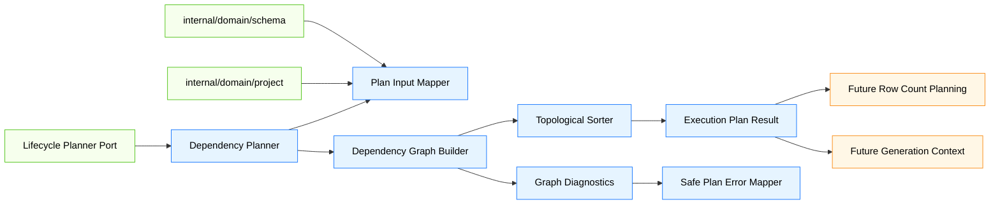
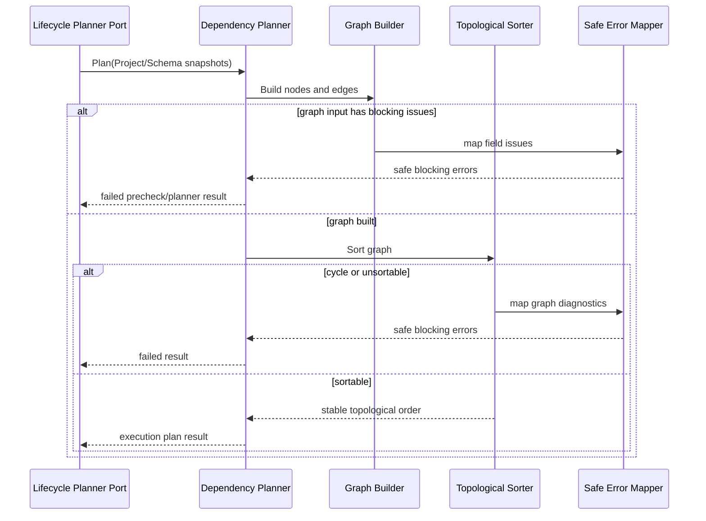
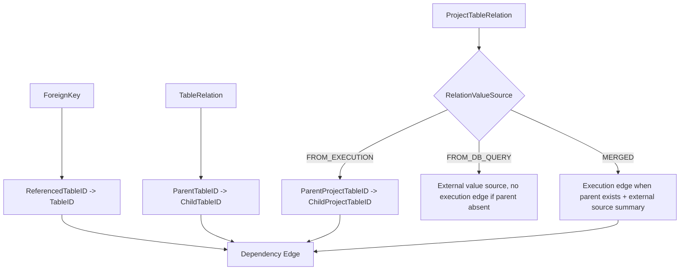
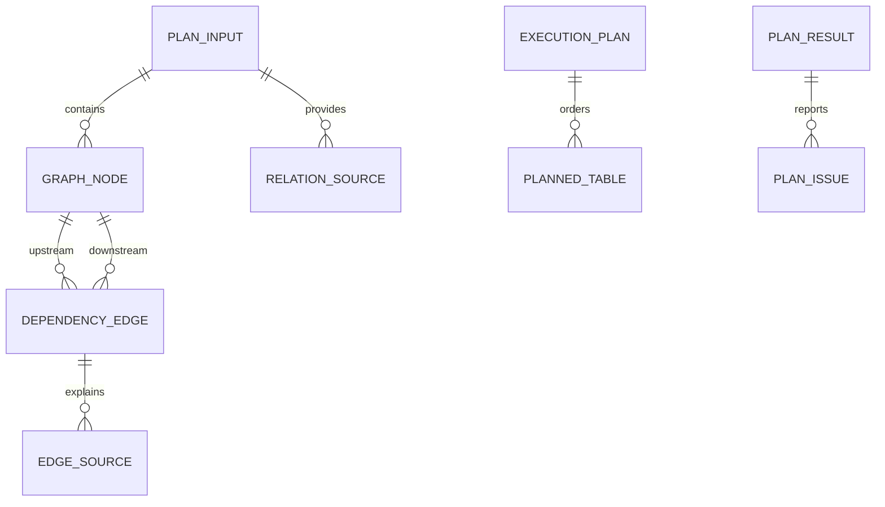

# Design Document

## Overview

`phase-03-dependency-graph-and-topological-sort` 在 Go 后端 engine 计划层建立表级依赖图与稳定拓扑排序能力，使 `ProjectTable`、物理 `ForeignKey`、Schema `TableRelation` 和 Project `ProjectTableRelation` 能转化为可被生命周期 planner/precheck 接缝消费的执行计划。

当前 Phase 2 已定义关系与 Project 快照，`phase-03-execution-lifecycle` 已定义执行生命周期、预检聚合和下游 planner 接缝。本规格新增独立的 engine 计划包，负责构建图、诊断不可排序问题、输出稳定执行顺序，并保持行数规划、生成上下文、批量生成、写入、API/UI 和数据库类型差异全部在边界之外。

### Goals

- 建立 Project 表节点和依赖边的 engine 内部模型。
- 从物理外键、逻辑关系和 Project 关系实例构建执行内依赖边。
- 输出确定性的表级拓扑执行顺序，确保上游依赖表先于下游表。
- 将循环、缺失节点、重复边、未知关系类型和未知值来源映射为生命周期可聚合的安全预检结果。
- 为后续行数规划、生成上下文和批量生成循环提供稳定计划输入边界。

### Non-Goals

- 不计算目标行数、倍率推导结果或不可满足行数场景。
- 不构建字段级生成上下文、键值引用或生成器调用上下文。
- 不实现生成器注册表、批量生成循环或真实生成数据。
- 不实现 writer adapter、事务、清空策略或真实数据库写入。
- 不执行、解析或校验用户 SQL。
- 不实现 API、Facade DTO、Wails runtime events、Vue 页面或依赖图可视化。
- 不修改 Phase 2 `ProjectTable.ExecutionOrder`、执行历史状态枚举或 lifecycle 内部状态枚举的持久化语义。

## Boundary Commitments

### This Spec Owns

- `internal/engine/plan` 内的表级依赖图节点、边、边来源和排序结果模型。
- 从 ProjectTable、ForeignKey、TableRelation、ProjectTableRelation 快照构建图的规则。
- 物理外键、逻辑关系和 Project 关系实例到执行内依赖边的方向映射。
- 稳定拓扑排序、循环检测、缺失节点诊断、重复边去重和不可排序错误。
- 与 lifecycle planner/precheck 接缝兼容的安全结果表达。
- 防止行数规划、生成、写入、UI/API 和数据库类型硬编码进入计划层的边界测试。

### Out of Boundary

- 行数规划由后续 `phase-03-row-count-planning` 负责。
- 生成上下文、字段规则快照和键值引用由后续 `phase-03-generation-context` 负责。
- 批量生成主循环和生成器注册表由后续 `phase-03-batch-generation-loop` 及后续生成器规格负责。
- 批量写入适配、事务和真实数据库驱动调用由后续 `phase-03-batch-writer-adapter` 负责。
- 执行结果持久化、API、Facade、Wails binding 和 Vue 页面由后续结果/API/UI 规格负责。
- 数据库类型差异由 schema/relation/capability 快照或 adapter 层预先表达，本规格不按数据库产品名称分支。

### Allowed Dependencies

- 可依赖 `internal/domain/project` 的 `Project`、`ProjectTable`、`ProjectTableRelation` 和 `RelationValueSource`。
- 可依赖 `internal/domain/schema` 的 `ForeignKey`、`TableRelation` 和 `RelationType`。
- 可依赖 `internal/engine/lifecycle` 的安全错误、阶段、预检或 planner 接缝类型；若 lifecycle 尚未实现，则通过同构字段保持兼容并在集成时替换。
- 可依赖 Go 标准库集合、排序和测试能力。
- 不新增第三方依赖。

### Revalidation Triggers

- ProjectTable、ForeignKey、TableRelation 或 ProjectTableRelation 的身份和方向字段发生破坏性变更。
- lifecycle planner/precheck 或安全错误字段发生破坏性变更。
- 后续行数规划要求排序结果新增必填字段。
- 数据库 capability 快照开始影响关系方向判断。
- 计划层出现 UI/Wails/DB driver/数据库类型分支依赖。

## Architecture

### Existing Architecture Analysis

- `internal/domain/schema` 已有物理外键和逻辑关系模型，但不负责排序或跨表执行计划。
- `internal/domain/project` 已有 Project 执行表和 Project 关系实例，但 `ExecutionOrder` 是快照字段，不承载排序算法。
- `phase-03-execution-lifecycle` 在 `internal/engine/lifecycle` 中定义 planner port，但明确不实现依赖图或拓扑排序。
- Steering 指定 engine 拥有依赖排序，业务规则不得放入 Wails binding 或 Vue。

### Architecture Pattern & Boundary Map



**Architecture Integration**:
- Selected pattern: independent engine planning package + lifecycle planner adapter。计划算法与生命周期状态机解耦，但输出可被 lifecycle 预检和 planner 阶段直接消费。
- Domain/feature boundaries: domain 提供快照，plan 包构建排序结果，lifecycle 聚合结果并控制执行状态，后续 specs 消费排序结果。
- Existing patterns preserved: Go 后端 owns business rules；domain 模型保持纯净；Wails/Vue 不进入排序判断。
- New components rationale: 图构建、排序、诊断和安全错误映射是行数规划与生成循环前的必要稳定边界。
- Steering compliance: 不跨阶段实现未来能力；不泄露敏感数据；不按数据库类型硬编码。

### Technology Stack

| Layer | Choice / Version | Role in Feature | Notes |
|-------|------------------|-----------------|-------|
| Frontend / CLI | 不涉及 | 无 UI 或 CLI 变更 | 不新增 Vue / Wails 事件 |
| Backend / Engine | Go | 依赖图构建、拓扑排序和测试 | 位于 `internal/engine/plan` |
| Domain | 既有 Go domain 包 | 提供 Project 和 Schema 快照 | 不修改领域持久化语义 |
| Data / Storage | 不新增 | 不创建表、不迁移数据 | 不写入 `ExecutionOrder` |
| Infrastructure | Go 标准库 | map、slice、sort、测试 | 不新增第三方依赖 |

## File Structure Plan

### Directory Structure

```text
internal/
└── engine/
    └── plan/
        ├── input.go          # Project/Schema 快照到计划输入的最小映射
        ├── graph.go          # 依赖图节点、边、边来源和图构建规则
        ├── relation.go       # 物理外键、逻辑关系、Project 关系到边的方向规则
        ├── sort.go           # 稳定拓扑排序和循环检测
        ├── result.go         # 执行计划、排序结果、预检结果和 lifecycle 接缝结果
        ├── errors.go         # 安全计划错误码、阶段、字段路径和敏感信息过滤
        ├── planner.go        # 对 lifecycle planner/precheck 接缝友好的协调入口
        ├── graph_test.go     # 节点、边、去重和缺失节点测试
        ├── sort_test.go      # 稳定排序、孤立节点、循环和不可排序测试
        ├── planner_test.go   # lifecycle precheck/planner 接缝兼容测试
        └── boundary_test.go  # 禁止依赖、禁止数据库类型分支和未来能力边界测试
```

### Modified Files

- 无现有业务文件必须修改；本规格应新增 engine 计划子包并通过测试验证边界。
- `go.mod` 不应因为本规格新增第三方依赖而变化；如实现发现必须引入依赖，应返回设计复核。
- Phase 2 domain 包不应修改枚举或持久化字段语义来表达排序内部状态。
- lifecycle 包只有在后续集成需要时通过既有 planner port 接入，不应改变 lifecycle 状态机。

## System Flows

### Dependency Planning Flow



### Edge Direction Flow



## Requirements Traceability

| Requirement | Summary | Components | Interfaces | Flows |
|-------------|---------|------------|------------|-------|
| 1.1 | ProjectTable 创建图节点 | Plan Input Mapper, Graph Builder | PlanInput, GraphNode | Dependency Planning Flow |
| 1.2 | 节点保留最小稳定字段 | Plan Input Mapper | PlanNodeInput | Dependency Planning Flow |
| 1.3 | 缺失节点身份返回字段级阻断错误 | Plan Input Mapper, Safe Plan Error Mapper | PlanPrecheckResult | Dependency Planning Flow |
| 1.4 | 重复 Schema Table 节点诊断 | Graph Builder, Diagnostics | PlanIssue | Dependency Planning Flow |
| 1.5 | 不读取 UI/Wails/DB 连接 | Boundary Tests | Package boundary | Boundary tests |
| 2.1 | 外键转换为父到子依赖边 | Relation Edge Mapper | DependencyEdge | Edge Direction Flow |
| 2.2 | 保留外键边来源摘要 | Graph Builder | EdgeSource | Edge Direction Flow |
| 2.3 | 外键缺失节点诊断 | Graph Diagnostics | PlanIssue | Dependency Planning Flow |
| 2.4 | 重复物理边去重 | Graph Builder | EdgeKey | Dependency Planning Flow |
| 2.5 | 不按数据库类型硬编码 | Boundary Tests | Dependency checks | Boundary tests |
| 3.1 | 逻辑关系父到子边 | Relation Edge Mapper | DependencyEdge | Edge Direction Flow |
| 3.2 | Project 执行来源边 | Relation Edge Mapper | DependencyEdge | Edge Direction Flow |
| 3.3 | DB 查询来源不强制当前执行边 | Relation Edge Mapper | ExternalSourceSummary | Edge Direction Flow |
| 3.4 | 缺失执行父表阻断 | Graph Diagnostics | PlanIssue | Dependency Planning Flow |
| 3.5 | 不执行 SQL/行数/生成推断 | Boundary Tests | Package boundary | Boundary tests |
| 4.1 | 输出稳定执行顺序 | Topological Sorter | ExecutionPlan | Dependency Planning Flow |
| 4.2 | 使用确定性稳定键 | Topological Sorter | StableSortKey | Dependency Planning Flow |
| 4.3 | 上游先于下游 | Topological Sorter | SortedNode | Dependency Planning Flow |
| 4.4 | 孤立节点纳入顺序 | Topological Sorter | ExecutionPlan | Dependency Planning Flow |
| 4.5 | 不计算行数/生成/写入策略 | Boundary Tests | Package boundary | Boundary tests |
| 5.1 | 循环依赖阻断诊断 | Topological Sorter, Diagnostics | CycleSummary | Dependency Planning Flow |
| 5.2 | 缺失节点字段级错误 | Graph Diagnostics | PlanIssue | Dependency Planning Flow |
| 5.3 | 不可排序统一错误 | Topological Sorter | PlanIssue | Dependency Planning Flow |
| 5.4 | 未知关系类型或值来源问题 | Relation Edge Mapper | Warning/Error | Edge Direction Flow |
| 5.5 | 不自动拆环或改配置 | Boundary Tests | Package boundary | Boundary tests |
| 6.1 | lifecycle 预检结果 | Dependency Planner | PlanPrecheckResult | Dependency Planning Flow |
| 6.2 | planner 阶段结果 | Dependency Planner | PlanStageResult | Dependency Planning Flow |
| 6.3 | 阻断错误阻止运行 | Lifecycle Adapter | PrecheckResult | Dependency Planning Flow |
| 6.4 | 为后续规格提供排序结果 | ExecutionPlan Result | ExecutionPlan | Dependency Planning Flow |
| 6.5 | 不修改状态/持久化枚举 | Boundary Tests | Domain boundary | Boundary tests |
| 7.1 | 错误只暴露安全字段 | Safe Plan Error Mapper | PlanError | Dependency Planning Flow |
| 7.2 | 过滤 SQL/连接/密码/生成数据 | Safe Plan Error Mapper | SafeMessage | Dependency Planning Flow |
| 7.3 | lifecycle 兼容摘要 | Safe Plan Error Mapper | Lifecycle-compatible fields | Dependency Planning Flow |
| 7.4 | 敏感信息测试 | Boundary Tests | Error tests | Boundary tests |
| 7.5 | 不透传原始错误载荷 | Safe Plan Error Mapper | PlanError | Dependency Planning Flow |
| 8.1 | 覆盖节点/边/排序测试 | Unit Tests | Go tests | Test flows |
| 8.2 | 覆盖诊断测试 | Unit Tests | Go tests | Test flows |
| 8.3 | 覆盖 lifecycle 接缝测试 | Seam Tests | Fake lifecycle port | Test flows |
| 8.4 | 覆盖禁止依赖测试 | Boundary Tests | Import checks | Boundary tests |
| 8.5 | 覆盖未来能力隔离测试 | Boundary Tests | Source scans | Boundary tests |

## Components and Interfaces

| Component | Domain/Layer | Intent | Req Coverage | Key Dependencies | Contracts |
|-----------|--------------|--------|--------------|------------------|-----------|
| Plan Input Mapper | Engine Plan | 将 Project/Schema 快照转为计划输入 | 1.1-1.5 | domain/project, domain/schema | Service |
| Dependency Graph Builder | Engine Plan | 构建节点、边、去重和来源摘要 | 2.1-3.5, 5.2, 5.4 | Plan Input Mapper | Service, State |
| Relation Edge Mapper | Engine Plan | 统一物理/逻辑/Project 关系方向规则 | 2.1-3.5 | domain/schema, domain/project | Service |
| Topological Sorter | Engine Plan | 稳定排序、循环检测和不可排序诊断 | 4.1-5.3 | Dependency Graph | State |
| Safe Plan Error Mapper | Engine Plan | 输出 lifecycle 兼容安全错误摘要 | 6.1-7.5 | Go standard library | Service |
| Dependency Planner | Engine Plan | 对 lifecycle planner/precheck 接缝提供协调入口 | 6.1-6.4 | Graph Builder, Sorter, Errors | Service |
| Boundary & Seam Tests | Test | 验证依赖边界和未来能力隔离 | 8.1-8.5 | Go test tooling | Test |

### Engine Plan Layer

#### Plan Input Mapper

| Field | Detail |
|-------|--------|
| Intent | 接收 Project 和关系快照并生成图构建所需的最小计划输入 |
| Requirements | 1.1, 1.2, 1.3, 1.4, 1.5 |

**Responsibilities & Constraints**
- 校验 ProjectTable 身份、Project 引用和 Table 引用。
- 建立 ProjectTable ID 与 Schema Table ID 的双向索引。
- 保留稳定排序键所需字段，但不持久化排序结果。
- 不读取 UI、Wails binding、Vue 页面状态或真实数据库连接。

**Conceptual Contract**

```go
type PlanInput struct {
    ProjectID int64
    Tables []PlanTableInput
    ForeignKeys []schema.ForeignKey
    TableRelations []schema.TableRelation
    ProjectRelations []project.ProjectTableRelation
}

type PlanTableInput struct {
    ProjectTableID int64
    ProjectID int64
    TableID int64
    ExistingExecutionOrder int
}
```

#### Dependency Graph Builder

| Field | Detail |
|-------|--------|
| Intent | 将计划输入转为可排序的有向无环候选图 |
| Requirements | 2.1-3.5, 5.2, 5.4 |

**Responsibilities & Constraints**
- 创建 GraphNode 和 DependencyEdge。
- 使用 canonical edge key 去重排序边。
- 保留物理外键、逻辑关系和 Project 关系来源摘要。
- 将缺失节点、重复节点、未知关系类型和未知值来源转为预检问题。
- 不执行 SQL，不计算行数，不生成数据。

**Conceptual Contract**

```go
type DependencyGraph struct {
    Nodes []GraphNode
    Edges []DependencyEdge
    Issues []PlanIssue
}

type GraphNode struct {
    ProjectTableID int64
    TableID int64
    StableOrder int
}

type DependencyEdge struct {
    FromProjectTableID int64
    ToProjectTableID int64
    Sources []EdgeSource
}
```

#### Relation Edge Mapper

| Field | Detail |
|-------|--------|
| Intent | 集中表达所有关系类型到依赖边的方向映射 |
| Requirements | 2.1-3.5 |

**Direction Rules**
- ForeignKey: `ReferencedTableID -> TableID`。
- TableRelation: `ParentTableID -> ChildTableID`。
- ProjectTableRelation with `FROM_EXECUTION`: `ParentProjectTableID -> ChildProjectTableID`。
- ProjectTableRelation with `FROM_DB_QUERY`: 不因外部父表缺失创建执行内边；只保留外部来源摘要。
- ProjectTableRelation with `MERGED`: 父 ProjectTable 存在时创建执行内边，同时保留外部来源摘要。

#### Topological Sorter

| Field | Detail |
|-------|--------|
| Intent | 输出稳定拓扑顺序并诊断循环或不可排序状态 |
| Requirements | 4.1-5.3 |

**Responsibilities & Constraints**
- 使用 Kahn-style 拓扑排序或等价确定性算法。
- 入度为 0 的候选节点按稳定键排序。
- 排序结果包含所有节点，包括孤立节点。
- 循环诊断输出安全节点摘要，不自动拆环。

**Stability Strategy**
- 稳定键：`ExistingExecutionOrder` 非零值优先，其次 `ProjectTableID`，其次 `TableID`。
- 对来源集合和错误集合使用确定性排序，保证测试和输出稳定。

#### Safe Plan Error Mapper

| Field | Detail |
|-------|--------|
| Intent | 将图构建、排序和接缝失败表达为安全摘要 |
| Requirements | 6.1-7.5 |

**Public Fields**

```go
type PlanIssue struct {
    Code PlanErrorCode
    Stage PlanStage
    FieldPath string
    SafeMessage string
    Blocking bool
}
```

- Public fields limited to code, stage, field path, safe message and blocking flag for precheck aggregation.
- 原始 SQL、连接详情、密码、生成数据内容不得进入 `SafeMessage`。
- 与 lifecycle `LifecycleError` 字段方向保持一致。

#### Dependency Planner

| Field | Detail |
|-------|--------|
| Intent | 提供面向 lifecycle planner/precheck 的单一入口 |
| Requirements | 6.1-6.4 |

**Responsibilities & Constraints**
- 调用 input mapper、graph builder 和 sorter。
- 将阻断问题汇总为失败预检或失败 planner result。
- 成功时返回稳定 `ExecutionPlan`。
- 不改变 lifecycle 状态机或持久化历史状态。

**Conceptual Contract**

```go
type ExecutionPlan struct {
    ProjectID int64
    OrderedTables []PlannedTable
    Edges []DependencyEdge
    Warnings []PlanIssue
}

type PlannedTable struct {
    ProjectTableID int64
    TableID int64
    ExecutionOrder int
}

type PlanResult struct {
    Passed bool
    Plan *ExecutionPlan
    BlockingErrors []PlanIssue
    Warnings []PlanIssue
}
```

## Data Models

### Domain Model

- `PlanInput`: Project 和 Schema 快照的 engine 计划输入。
- `GraphNode`: 单个 ProjectTable 的图节点。
- `DependencyEdge`: 上游 ProjectTable 到下游 ProjectTable 的依赖边。
- `EdgeSource`: 边来源摘要，标识 physical foreign key、schema relation 或 project relation。
- `DependencyGraph`: 节点、边和图构建问题集合。
- `ExecutionPlan`: 稳定拓扑排序后的计划输出。
- `PlanIssue`: lifecycle 兼容安全预检问题。

### Logical Data Model



**Consistency & Integrity**
- 每个 GraphNode 对应一个 ProjectTable。
- 每条有效 DependencyEdge 的 from/to 节点必须存在于图中。
- 去重后的边不丢失来源摘要。
- 排序成功时所有节点都出现在 `OrderedTables` 中且顺序唯一。
- 排序成功时所有边满足 from order < to order。
- 排序失败时不得输出部分可执行计划作为成功结果。

### Physical Data Model

- 不新增数据库表、迁移、索引或本地存储结构。
- 不写回 ProjectTable.ExecutionOrder。
- 输出的 ExecutionPlan 仅供 lifecycle、row-count planning 和后续执行规格消费。

## Error Handling

### Error Strategy

- 节点输入错误：返回字段级阻断 PlanIssue。
- 缺失边端点：返回字段级阻断 PlanIssue，并保留安全来源摘要。
- 重复边：排序边去重；必要时输出非阻断警告。
- 未知关系类型或未知值来源：根据是否影响执行内依赖决定阻断错误或警告。
- 循环依赖：返回阻断 PlanIssue 和安全循环摘要。
- 不可排序：返回统一阻断 PlanIssue，不输出成功计划。
- 敏感内容：公开消息使用固定安全文本，不透出 SQL、连接、密码或生成数据。

### Error Categories and Responses

| Category | Trigger | Response | Plan Impact |
|----------|---------|----------|-------------|
| Input / Node | 缺少 ProjectTable ID、Project ID、Table ID | 字段级阻断错误 | 不生成可执行计划 |
| Missing Endpoint | 关系引用 Project 外或不存在节点 | 阻断错误或外部来源警告 | 取决于 RelationValueSource |
| Duplicate Edge | 多来源形成同一 from/to | 去重并合并来源 | 可继续排序 |
| Unknown Relation Input | 关系类型未知、值来源未知或缺少排序所需身份 | 阻断错误或警告 | 取决于是否必须依赖当前执行 |
| Cycle | 拓扑排序剩余节点无法消解 | 循环阻断错误 | 不生成成功计划 |
| Sensitive Source | SQL/连接/密码/数据出现在来源错误 | 替换为安全消息 | 按原错误类别处理 |

### Monitoring

本规格不实现运行时日志、追踪或 UI 事件。测试应验证诊断结果稳定且安全；后续可观测性规格可增加内部诊断，但不得改变公开安全边界。

## Testing Strategy

### Unit Tests

- 节点输入测试：有效 ProjectTable 生成节点；缺少 ProjectTable ID、Project ID、Table ID 返回字段级阻断错误；重复 TableID 诊断稳定。
- 物理外键测试：`ReferencedTableID -> TableID` 方向正确；缺失父/子节点返回安全问题；重复边去重并保留来源摘要。
- 逻辑关系测试：`ParentTableID -> ChildTableID` 方向正确；未知 RelationType 返回安全问题。
- Project 关系测试：`FROM_EXECUTION` 要求父 ProjectTable 并创建边；`FROM_DB_QUERY` 可表达外部来源且不执行 SQL；`MERGED` 在父表存在时创建边。
- 排序测试：链式依赖、分支依赖、孤立节点、多零入度节点均输出稳定顺序。
- 循环测试：简单环、多节点环和不可排序图返回阻断错误且不输出成功计划。
- 安全错误测试：公开消息不包含 SQL、连接字符串、密码、生成数据示例或原始错误载荷。

### Integration / Seam Tests

- 使用 fake lifecycle planner/precheck 调用 Dependency Planner，验证成功计划可作为 planner result 返回。
- 使用循环、缺失节点、未知关系类型和未知值来源输入，验证 blocking errors 可被 lifecycle precheck 聚合并阻止启动。
- 验证 warnings 不阻止计划成功，但保留在 PlanResult 中。
- 验证后续 row-count planning 可读取 `OrderedTables` 而无需图内部状态。

### Boundary Tests

- 检查 `internal/engine/plan` 不导入 Wails、Vue、frontend API、真实数据库 driver、store 或 facade 包。
- 检查计划层源码不包含按数据库产品名称分支的业务规则。
- 检查本规格未实现 row count planning、generation context、generator registry、batch loop、writer adapter、transaction 或 real write 行为。
- 检查 Phase 2 domain 枚举和 lifecycle 状态枚举未因本规格新增排序内部状态。
- 检查测试数据中的敏感 SQL/密码/连接详情不会出现在公开 PlanIssue 消息中。

## Security Considerations

- 所有公开计划错误只允许包含错误码、阶段、字段路径、安全消息和是否阻断。
- SQL 文本只可作为是否存在外部来源的内部事实，不进入公开错误消息。
- 不保存或输出数据库密码、连接字符串、用户 SQL 或生成数据内容。
- 不把原始下游错误载荷透传给 lifecycle、API、UI、Wails binding 或历史模型。

## Performance & Scalability

- 图构建和拓扑排序应为内存内线性或近线性处理，适配普通 Project 表数量。
- 重复边去重使用 map key，保持确定性输出排序。
- 本规格不处理批量生成吞吐、写入性能或数据库事务性能。

## Migration Strategy

- 不需要数据库迁移、配置迁移或前端迁移。
- 新增 `internal/engine/plan` 包不会改变 Phase 2 JSON 合同。
- 后续规格可通过 ExecutionPlan 消费排序结果，而不是复制排序算法。

## Supporting References

- `.kiro/specs/phase-03-dependency-graph-and-topological-sort/brief.md`
- `.kiro/specs/phase-03-dependency-graph-and-topological-sort/research.md`
- `.kiro/specs/phase-03-execution-lifecycle/requirements.md`
- `.kiro/specs/phase-03-execution-lifecycle/design.md`
- `.kiro/specs/phase-02-relation-model/design.md`
- `.kiro/specs/phase-02-project-model/design.md`
- `.kiro/steering/roadmap.md`
- `.kiro/steering/product.md`
- `.kiro/steering/tech.md`
- `.kiro/steering/structure.md`
