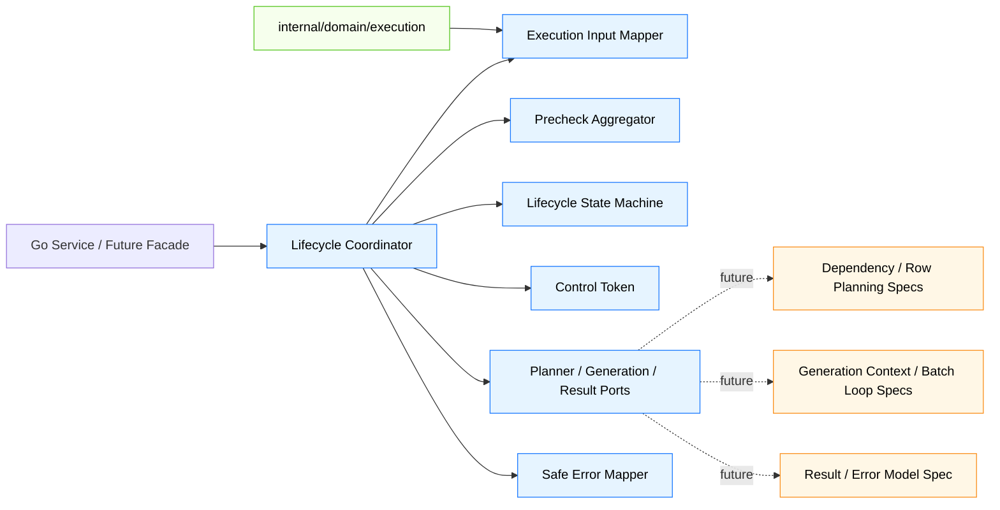
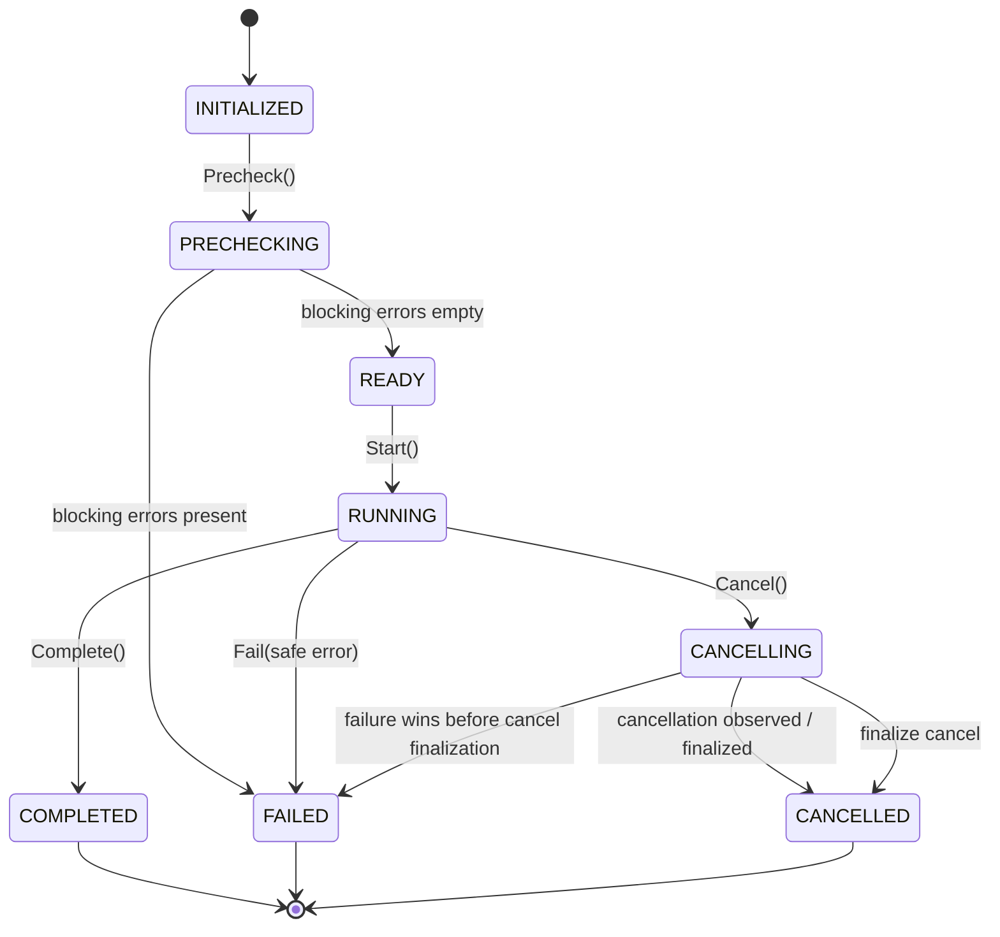
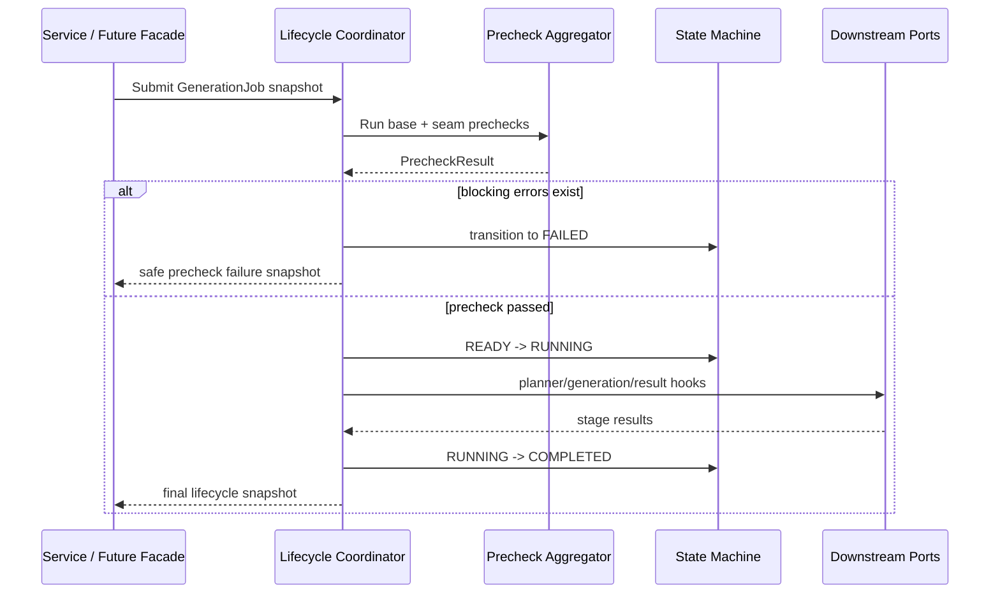
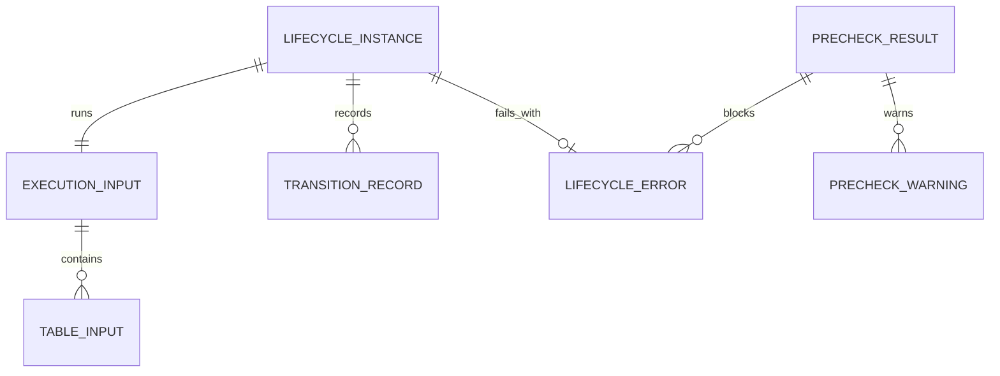

# Design Document

## Overview

`phase-03-execution-lifecycle` 为 Go 后端执行引擎建立最小生命周期边界，使上游 `GenerationJob` / `ExecutionTask` 快照能够进入可预检、可启动、可取消、可失败、可完成的统一 engine 入口。该设计面向后端开发人员和后续 Phase 3 引擎规格，提供稳定状态机、预检结果、安全错误和下游组件接缝。

当前 Phase 2 已完成执行任务与历史模型，但这些模型不承载运行时生命周期算法。本规格在 `internal/engine/lifecycle` 内新增独立运行时模型，并保持 Wails binding、Vue、真实数据库写入、依赖排序、行数规划、生成上下文和批量循环全部在边界之外。

### Goals

- 建立从执行任务快照到 engine 执行输入的边界，并覆盖字段级基础校验。
- 定义独立于历史状态枚举的生命周期状态机和允许流转。
- 提供预检、启动、取消、失败、完成和最终快照的最小控制语义。
- 定义计划、生成和结果汇总的下游接缝，供后续规格接入而不重写生命周期规则。
- 对外错误默认安全化，不泄露数据库密码、用户 SQL、连接详情或生成数据内容。

### Non-Goals

- 不实现依赖图算法、拓扑排序或执行顺序计算。
- 不实现行数规划、生成上下文、批量生成循环或生成器注册表。
- 不实现 writer adapter、事务、清空策略或真实数据库写入。
- 不实现 API、Wails runtime events、Vue 页面、进度 UI 或执行历史查询服务。
- 不修改 Phase 2 `ExecutionTaskStatus` / `ExecutionTableStatus` 的持久化语义。

## Boundary Commitments

### This Spec Owns

- `internal/engine/lifecycle` 内的运行时生命周期状态、状态流转规则和状态流转记录。
- 执行任务快照到 engine 输入的最小映射与基础预检入口。
- 统一预检结果模型，包括通过状态、阻断错误和非阻断警告。
- 启动、取消意图、任务级失败、完成和最终生命周期快照语义。
- 下游计划、生成和结果汇总阶段的最小 port 接缝和 no-op / fake 可测试接入点。
- 生命周期公开错误的安全摘要模型、阶段标识和字段路径边界。

### Out of Boundary

- 依赖图、拓扑排序、循环依赖诊断和执行顺序计算由后续 `phase-03-dependency-graph-and-topological-sort` 负责。
- 行数规划和不可满足行数场景由后续 `phase-03-row-count-planning` 负责。
- 生成上下文、字段规则快照、键值引用和生成器调用上下文由后续 `phase-03-generation-context` 负责。
- 批量生成主循环、真实生成器注册表和内置生成器由后续 Phase 3/4/5 规格负责。
- 批量写入适配、事务、清空策略和真实数据库驱动调用由后续 `phase-03-batch-writer-adapter` 负责。
- API、Facade DTO、Wails binding、Vue store/page 和进度事件由后续 Phase 7/8/9 负责。

### Allowed Dependencies

- 可依赖 `internal/domain/execution` 的 `GenerationJob`、`ExecutionTask`、`ExecutionTableResult`、字段级校验结果和安全错误快照概念。
- 可依赖 Go 标准库的 `context`、`time`、`sync/atomic` 或等价基础能力表达取消意图与时间戳。
- 可定义 engine 内部接口供后续 planner/generator/result 接入，但接口不得引入数据库驱动、Wails、Vue 或前端 API 类型。
- 可在测试中使用 fake/no-op 下游接缝验证生命周期语义，但不得实现真实下游算法。

### Revalidation Triggers

- 生命周期状态枚举、允许流转或终态语义发生变化。
- `ExecutionInput`、`PrecheckResult`、`LifecycleSnapshot` 或下游 port 的公开字段发生破坏性变更。
- 生命周期包开始依赖 service/facade/Wails/UI/数据库驱动等当前禁止依赖。
- 后续 planner/generator/result 需要新增必填前置条件，导致预检汇总语义变化。
- 安全错误摘要字段或敏感信息过滤规则发生变化。

## Architecture

### Existing Architecture Analysis

- `internal/domain/execution` 已提供纯领域模型和历史快照表达，注释明确 `GenerationJob` 不承载生命周期算法。
- `ExecutionTaskStatus` 只表达历史运行结果状态，不适合承载 `INITIALIZED`、`PRECHECKING`、`READY`、`CANCELLING`、`CANCELLED` 等运行时控制状态。
- Steering 要求业务规则保留在 Go 后端 service/domain/engine 层；Wails binding 与 Vue 不承载状态流转规则。
- Phase 3 roadmap 要求本规格只建立 lifecycle 入口和边界，下游算法由后续小规格接入。

### Architecture Pattern & Boundary Map



**Architecture Integration**:
- Selected pattern: engine lifecycle coordinator + minimal ports。状态规则集中在 engine 内部，下游能力通过小接口接入。
- Domain/feature boundaries: domain 模型提供输入合同，lifecycle 提供运行时状态和控制，下游 specs 提供算法与真实执行能力。
- Existing patterns preserved: Go 后端 owns business rules；domain 模型保持纯净；Wails/Vue 不进入 engine 生命周期判断。
- New components rationale: 独立状态机、预检聚合、安全错误和控制 token 是启动后续 Phase 3 引擎能力的必要边界。
- Steering compliance: 不跨阶段实现未来能力；不泄露敏感数据；不把业务规则放入 binding 或 UI。

### Technology Stack

| Layer | Choice / Version | Role in Feature | Notes |
|-------|------------------|-----------------|-------|
| Frontend / CLI | 不涉及 | 无 UI 或 CLI 变更 | 不新增 Vue / Wails 事件 |
| Backend / Services | Go | engine 生命周期实现与测试 | 位于 `internal/engine/lifecycle` |
| Data / Storage | 不新增 | 不创建表、不迁移数据 | 只引用 Phase 2 领域模型 |
| Messaging / Events | 不涉及 | 不发布 runtime event | 后续进度规格处理 |
| Infrastructure / Runtime | Go 标准库 | 时间戳、上下文、取消意图 | 不引入外部框架 |

## File Structure Plan

### Directory Structure

```text
internal/
└── engine/
    └── lifecycle/
        ├── input.go          # 执行任务快照到 engine 输入的映射与基础字段边界
        ├── state.go          # 生命周期状态、终态判断、允许流转和流转记录
        ├── precheck.go       # 预检结果、阻断错误、警告和预检汇总规则
        ├── control.go        # 取消意图和下游可观察控制 token
        ├── errors.go         # 生命周期安全错误、阶段、字段路径和敏感信息过滤
        ├── ports.go          # planner/generation/result 最小下游接缝
        ├── coordinator.go    # 预检、启动、下游阶段、取消、失败、完成的协调入口
        ├── snapshot.go       # 最终生命周期快照和历史模型映射边界
        ├── lifecycle_test.go # 输入、预检、状态、控制和完成语义单元测试
        ├── seam_test.go      # 下游接缝成功/失败/no-op/fake 行为测试
        └── boundary_test.go  # 禁止依赖和禁止实现未来算法的边界测试
```

### Modified Files

- 无现有业务文件必须修改；本规格应新增 engine 子包并通过测试验证边界。
- `go.mod` 不应因为本规格新增第三方依赖而变化；如实现发现必须引入依赖，应返回设计复核。
- Phase 2 `internal/domain/execution/*.go` 不应修改状态枚举来承载 lifecycle 内部状态。

## System Flows

### Lifecycle State Flow



终态为 `COMPLETED`、`FAILED`、`CANCELLED`，三者互斥。终态拒绝再次启动、完成、失败或取消。非法流转返回状态冲突错误，并记录可测试的拒绝结果但不改变当前状态。

### Execution Start Flow



下游 hooks 当前只用于触发生命周期状态变化和失败映射；不在本规格内实现依赖排序、行数规划、生成循环或真实写入。

## Requirements Traceability

| Requirement | Summary | Components | Interfaces | Flows |
|-------------|---------|------------|------------|-------|
| 1.1 | 校验任务身份、Project 引用和表结果边界 | Execution Input Mapper, Precheck Aggregator | PrecheckResult | Execution Start Flow |
| 1.2 | 创建不依赖 UI/Wails/数据库连接的 engine 输入 | Execution Input Mapper | ExecutionInput | Execution Start Flow |
| 1.3 | 缺少必填字段时返回字段级预检失败 | Precheck Aggregator, Safe Error Mapper | PrecheckIssue | Execution Start Flow |
| 1.4 | 不接收 UI/Wails/Vue 业务规则 | Lifecycle Coordinator, Boundary Tests | Engine-only package boundary | Boundary tests |
| 1.5 | 保留最小上下文且不提前计算下游内容 | ExecutionInput, Downstream Ports | Planner/Generation/Result ports | Execution Start Flow |
| 2.1 | 预检返回通过状态、阻断错误、警告 | Precheck Aggregator | PrecheckResult | Execution Start Flow |
| 2.2 | 前置条件不满足时阻止启动并返回安全摘要 | Precheck Aggregator, State Machine, Safe Error Mapper | LifecycleError | Execution Start Flow |
| 2.3 | 预检中不进入运行状态 | State Machine, Coordinator | State transition guard | Lifecycle State Flow |
| 2.4 | 接收后续规格预检结果并统一汇总 | Precheck Aggregator, Downstream Ports | Prechecker port | Execution Start Flow |
| 2.5 | 不执行真实数据库查询、SQL 校验或写入模拟 | Boundary Tests, Downstream Ports | No-op/fake hooks | Boundary tests |
| 3.1 | 初始化为可预检未运行状态 | State Machine | LifecycleState | Lifecycle State Flow |
| 3.2 | 预检通过并启动后进入运行状态 | Coordinator, State Machine | Start contract | Lifecycle State Flow |
| 3.3 | 非法流转返回状态冲突 | State Machine, Safe Error Mapper | Conflict error | Lifecycle State Flow |
| 3.4 | 终态拒绝再次控制 | State Machine | Terminal guard | Lifecycle State Flow |
| 3.5 | 取消、失败、完成互斥并记录流转 | State Machine, Snapshot | Transition record | Lifecycle State Flow |
| 4.1 | 启动记录时间、运行状态和执行上下文 | Coordinator, Snapshot | LifecycleSnapshot | Execution Start Flow |
| 4.2 | 取消运行中执行并暴露取消状态 | Control Token, Coordinator | Cancellation token | Lifecycle State Flow |
| 4.3 | 运行失败记录安全摘要并进入失败终态 | Coordinator, Safe Error Mapper | LifecycleError | Execution Start Flow |
| 4.4 | 当前边界步骤成功后记录完成时间 | Coordinator, Snapshot | LifecycleSnapshot | Execution Start Flow |
| 4.5 | 终态后提供一致最终快照 | Snapshot | Final snapshot | Lifecycle State Flow |
| 5.1 | 通过接缝请求计划结果且不实现算法 | Downstream Ports, Seam Tests | PlannerHook | Execution Start Flow |
| 5.2 | 通过接缝触发生成且不实现注册表/循环 | Downstream Ports, Seam Tests | GenerationHook | Execution Start Flow |
| 5.3 | 通过接缝接收结果汇总且不实现 writer adapter | Downstream Ports, Seam Tests | ResultHook | Execution Start Flow |
| 5.4 | 下游失败转化为生命周期失败语义 | Coordinator, Safe Error Mapper | Stage result / LifecycleError | Execution Start Flow |
| 5.5 | 允许替换接缝且状态规则不变 | Downstream Ports, State Machine | Port contracts | Seam tests |
| 6.1 | 错误只暴露码、阶段、字段路径、安全消息 | Safe Error Mapper | LifecycleError | Error tests |
| 6.2 | 不包含密码、SQL、连接详情、生成数据 | Safe Error Mapper | Sanitized message | Error tests |
| 6.3 | 单元测试覆盖核心语义 | Test suite | Go tests | Test flows |
| 6.4 | 边界测试确认无 Wails/Vue/DB 依赖 | Boundary Tests | Package dependency checks | Boundary tests |
| 6.5 | 接缝测试确认未实现未来能力 | Seam Tests | Fake/no-op hooks | Seam tests |

## Components and Interfaces

| Component | Domain/Layer | Intent | Req Coverage | Key Dependencies | Contracts |
|-----------|--------------|--------|--------------|------------------|-----------|
| Execution Input Mapper | Engine | 将 Phase 2 快照转成生命周期输入并做基础字段边界校验 | 1.1, 1.2, 1.3, 1.5 | `internal/domain/execution` | Service, State |
| Precheck Aggregator | Engine | 汇总基础预检与下游预检结果 | 2.1, 2.2, 2.3, 2.4, 2.5 | Input Mapper, Safe Error Mapper | Service |
| Lifecycle State Machine | Engine | 管理状态、终态和合法流转 | 3.1, 3.2, 3.3, 3.4, 3.5 | Go standard library | State |
| Control Token | Engine | 表达取消意图并供下游步骤观察 | 4.2 | State Machine | State |
| Downstream Ports | Engine | 定义 planner/generation/result 最小接缝 | 1.5, 2.4, 5.1, 5.2, 5.3, 5.5 | Engine contracts only | Service |
| Lifecycle Coordinator | Engine | 串联预检、启动、下游阶段、失败、取消、完成 | 2.2, 3.2, 4.1, 4.3, 4.4, 5.4 | Input, Precheck, State, Ports | Service, Batch |
| Safe Error Mapper | Engine | 将生命周期和下游错误安全化 | 1.3, 2.2, 3.3, 4.3, 5.4, 6.1, 6.2 | Phase 2 safe snapshot concept | Service |
| Lifecycle Snapshot | Engine | 输出最终状态、时间戳、错误和流转记录 | 3.5, 4.1, 4.4, 4.5 | State Machine, Safe Error | State |
| Boundary & Seam Tests | Test | 验证依赖边界和未来能力未被提前实现 | 6.3, 6.4, 6.5 | Go test tooling | Test |

### Engine Layer

#### Execution Input Mapper

| Field | Detail |
|-------|--------|
| Intent | 接收 `GenerationJob` / `ExecutionTask` 快照并生成 engine 内部执行输入 |
| Requirements | 1.1, 1.2, 1.3, 1.5 |

**Responsibilities & Constraints**
- 校验任务身份、Project 引用、任务名称和表结果集合边界是否满足最小执行入口要求。
- 调用或复用 Phase 2 领域校验结果，但不把 Phase 2 历史状态扩展为运行时状态。
- 输出只包含后续 planner/generation/result 接缝所需的最小上下文。
- 不读取 UI、Wails binding、Vue 页面状态或真实数据库连接。

**Dependencies**
- Inbound: Lifecycle Coordinator — 提交执行任务快照。
- Outbound: `internal/domain/execution` — 读取上游模型与字段级校验。

**Contracts**: Service [x] / State [x]

##### Service Interface

```go
// Conceptual contract; final implementation may use equivalent Go names.
type ExecutionInput struct {
    TaskID int64
    ProjectID int64
    TaskName string
    Tables []ExecutionTableInput
}
```

- Preconditions: 输入快照来自后端 service/domain 层，不来自前端业务规则。
- Postconditions: 校验通过时返回 engine 输入；校验失败时返回字段级预检问题。
- Invariants: 输入不包含数据库密码、用户 SQL 或生成数据内容。

#### Precheck Aggregator

| Field | Detail |
|-------|--------|
| Intent | 在启动前统一表达是否允许进入运行阶段 |
| Requirements | 2.1, 2.2, 2.3, 2.4, 2.5 |

**Responsibilities & Constraints**
- 汇总基础输入校验、生命周期状态前置条件和下游接缝预检结果。
- 将结果分为通过状态、阻断错误和非阻断警告。
- 预检期间状态不得进入 `RUNNING`。
- 当前规格不执行真实数据库查询、SQL 校验、生成器深度参数校验或写入模拟。

**Dependencies**
- Inbound: Lifecycle Coordinator — 请求预检。
- Outbound: Execution Input Mapper — 获取基础校验结果。
- Outbound: Downstream Ports — 接收未来组件的预检结果。

**Contracts**: Service [x]

##### Service Interface

```go
type PrecheckResult struct {
    Passed bool
    BlockingErrors []LifecycleError
    Warnings []PrecheckWarning
}
```

- Preconditions: lifecycle 处于可预检状态。
- Postconditions: 有阻断错误时 coordinator 不得启动执行。
- Invariants: 公开问题只包含安全消息和字段路径。

#### Lifecycle State Machine

| Field | Detail |
|-------|--------|
| Intent | 集中管理 lifecycle 内部状态和合法流转 |
| Requirements | 3.1, 3.2, 3.3, 3.4, 3.5 |

**Responsibilities & Constraints**
- 定义 `INITIALIZED`、`PRECHECKING`、`READY`、`RUNNING`、`CANCELLING`、`CANCELLED`、`FAILED`、`COMPLETED`。
- 拒绝非法流转并返回状态冲突安全错误。
- 维护可测试的流转记录。
- 终态互斥且拒绝再次启动、完成、失败或取消。

**Dependencies**
- Inbound: Lifecycle Coordinator, Control Token。
- Outbound: Safe Error Mapper — 状态冲突错误安全化。

**Contracts**: State [x]

##### State Management

- State model: 单个 lifecycle 实例持有当前状态、流转记录、启动时间、结束时间和失败摘要。
- Persistence & consistency: 本规格不持久化；最终快照供后续历史/API 规格消费。
- Concurrency strategy: 当前只表达控制 token 和取消意图，不承诺 goroutine 调度或强制中断。

#### Control Token

| Field | Detail |
|-------|--------|
| Intent | 让运行中的下游步骤观察取消意图 |
| Requirements | 4.2 |

**Responsibilities & Constraints**
- 取消请求只允许在运行中或可取消状态产生可观察取消意图。
- 下游 hooks 可以读取取消状态并主动停止当前阶段。
- 不实现真实 goroutine 中断、数据库取消或事务回滚。

#### Downstream Ports

| Field | Detail |
|-------|--------|
| Intent | 为后续计划、生成、结果汇总组件提供替换式最小接缝 |
| Requirements | 1.5, 2.4, 5.1, 5.2, 5.3, 5.5 |

**Responsibilities & Constraints**
- Planner 接缝只编排依赖计划和行数计划阶段结果：后续 plan/rowcount 规格产出的 `ExecutionPlan` 与 `RowCountPlan` 作为 artifact 传递给 generation 接缝，lifecycle 不解释其内部算法。
- Generation 接缝只触发 generation context 构建和 batch loop：后续 gencontext/batch 规格消费 `ExecutionPlan`、`RowCountPlan` 并产出 `GenerationContext`、`BatchResult` 和 writer seam 摘要。
- Result 接缝只接收 lifecycle snapshot、planning artifacts、generation/batch/writer 摘要并构建最终 result；lifecycle 不直接调用 writer adapter，也不实现 result aggregation。
- Writer adapter 由 batch loop 内部通过 writer seam 调用；lifecycle 只通过 generation/result 阶段看到写入成功、失败和统计摘要，避免重复写入阶段所有权。
- 接缝实现可替换，替换不得改变状态机规则。

**Dependencies**
- Inbound: Lifecycle Coordinator。
- Outbound: 后续 Phase 3 组件，当前仅 no-op/fake 测试实现。

**Contracts**: Service [x] / Batch [x]

#### Lifecycle Coordinator

| Field | Detail |
|-------|--------|
| Intent | 提供 engine 入口并按统一生命周期语义编排当前边界内步骤 |
| Requirements | 2.2, 3.2, 4.1, 4.3, 4.4, 5.4 |

**Responsibilities & Constraints**
- 初始化 lifecycle 并记录可预检未运行状态。
- 执行预检，通过后启动并记录启动时间与执行上下文。
- 调用 planner/generation/result 接缝，并把任一下游失败转化为生命周期失败终态。
- 当前边界内所有步骤成功后记录完成时间并进入完成终态。
- 取消、失败和完成竞争时必须通过状态机保持互斥终态。

#### Safe Error Mapper

| Field | Detail |
|-------|--------|
| Intent | 统一输出安全错误摘要 |
| Requirements | 1.3, 2.2, 3.3, 4.3, 5.4, 6.1, 6.2 |

**Responsibilities & Constraints**
- 公开字段限定为错误码、阶段、字段路径和安全消息。
- 下游原始错误不得直接出现在公开结果中。
- 对包含密码、连接详情、用户 SQL、生成数据内容或敏感标记的内容进行替换或拒绝。
- 与 Phase 2 `ExecutionErrorSnapshot` 的安全摘要方向保持一致。

#### Lifecycle Snapshot

| Field | Detail |
|-------|--------|
| Intent | 为后续历史记录、API 或 UI 规格提供一致最终快照 |
| Requirements | 3.5, 4.1, 4.4, 4.5 |

**Responsibilities & Constraints**
- 输出当前/最终 lifecycle 状态、启动时间、结束时间、取消意图、失败摘要和流转记录。
- 只在最终快照需要时提供向 Phase 2 历史状态的映射边界。
- 不负责持久化、不发布事件、不转换为前端 DTO。

## Data Models

### Domain Model

- `ExecutionInput`: engine 内部输入值对象，来自 Phase 2 快照，保留任务身份、Project 引用、任务名称和表级最小边界。
- `LifecycleState`: engine 内部状态枚举，不写入 Phase 2 持久化枚举。
- `TransitionRecord`: 记录 from/to 状态、阶段、时间和拒绝原因，用于测试和后续观测边界。
- `PrecheckResult`: 包含 `Passed`、`BlockingErrors`、`Warnings`。
- `LifecycleError`: 安全错误摘要，包含 code、stage、fieldPath、safeMessage。
- `ControlToken`: 可观察取消意图，不承诺强制中断。
- `LifecycleSnapshot`: lifecycle 当前或最终状态视图。

### Logical Data Model



**Consistency & Integrity**
- 每个 lifecycle 实例只对应一个 `ExecutionInput`。
- `COMPLETED`、`FAILED`、`CANCELLED` 只能出现一个最终状态。
- `FAILED` 必须有安全失败摘要；`COMPLETED` 必须有完成时间；`CANCELLED` 必须有取消意图记录。
- `PrecheckResult.Passed` 等价于阻断错误为空。

### Physical Data Model

- 不新增数据库表、迁移、索引或本地存储结构。
- 本规格输出的快照仅供后续执行历史/API/UI 规格消费。

## Error Handling

### Error Strategy

- 输入缺失或引用字段无效：返回字段级预检阻断错误，不启动执行。
- 状态冲突：拒绝非法流转，返回安全错误，当前状态不变。
- 下游接缝失败：将阶段失败映射为生命周期任务级失败，并进入 `FAILED` 终态。
- 取消请求：运行中请求进入取消路径；终态取消请求返回状态冲突。
- 敏感内容：公开消息使用通用安全描述，原始错误不得透出。

### Error Categories and Responses

| Category | Trigger | Response | State Impact |
|----------|---------|----------|--------------|
| Input / Precheck | 缺少任务 ID、Project ID 或表边界无效 | 字段级阻断错误 | 不进入 RUNNING |
| State Conflict | 非法流转、终态再次控制 | 状态冲突安全错误 | 状态不变 |
| Downstream Stage | Planner / Generation / Result hook 失败 | 阶段失败安全摘要 | 进入 FAILED |
| Cancellation | 运行中取消 | 设置取消意图 | RUNNING -> CANCELLING -> CANCELLED |
| Sensitive Source | 原始错误包含敏感内容 | 替换为安全消息 | 按原错误类别处理 |

### Monitoring

本规格不实现复杂日志、追踪或运行时事件。测试应验证公开错误安全化；后续可观测性规格可增加内部诊断，但不得改变对外安全边界。

## Testing Strategy

### Unit Tests

- 输入映射测试：有效 `GenerationJob` 快照生成 engine 输入；缺少任务身份、Project 引用或表边界时返回字段级预检阻断错误。覆盖 1.1、1.2、1.3。
- 预检结果测试：阻断错误、警告、通过状态和下游预检汇总符合规则；预检期间不进入运行状态。覆盖 2.1、2.2、2.3、2.4。
- 状态机测试：初始化、合法流转、非法流转、终态互斥和流转记录可验证。覆盖 3.1、3.2、3.3、3.4、3.5。
- 控制语义测试：启动时间、取消意图、失败摘要、完成时间和最终快照一致。覆盖 4.1、4.2、4.3、4.4、4.5。
- 安全错误测试：错误码、阶段、字段路径、安全消息存在，敏感密码、SQL、连接详情和生成数据不出现在公开消息中。覆盖 6.1、6.2。

### Integration / Seam Tests

- Planner fake hook 被调用并能返回成功/失败，但测试确认没有依赖图或行数规划实现。覆盖 5.1、6.5。
- Generation fake hook 被调用并能返回成功/失败，但测试确认没有生成器注册表或批量循环实现。覆盖 5.2、6.5。
- Result fake hook 被调用并能返回成功/失败，但测试确认没有 result aggregator、writer adapter、事务或真实数据库写入实现。覆盖 5.3、6.5。
- 任一下游 hook 失败时 coordinator 进入失败终态并保留安全错误摘要。覆盖 5.4。
- 替换不同 fake/no-op hook 实现时状态规则保持一致。覆盖 5.5。

### Boundary Tests

- lifecycle 包导入检查确认不依赖 Wails、Vue、前端 API 包或真实数据库驱动。覆盖 1.4、6.4。
- Phase 2 执行历史状态枚举未因本规格新增 lifecycle 内部状态。覆盖 3.1、3.5。
- 测试目录中不存在真实数据库连接、SQL 执行、写入模拟或生成数据内容断言。覆盖 2.5、6.5。

## Security Considerations

- 所有公开生命周期错误只允许包含错误码、阶段、字段路径和安全消息。
- 输入、预检、下游失败和状态冲突统一经过安全错误映射。
- 不在 lifecycle 输入或快照中保存数据库密码、连接字符串、用户 SQL 或生成数据内容。
- 下游原始错误即使包含敏感内容，也只能影响内部失败分类，不得直接输出。
- 测试必须包含敏感标记和典型敏感片段，确认公开消息被替换或阻断。

## Performance & Scalability

- 生命周期对象只维护单次执行的轻量状态、时间戳、错误摘要和流转记录。
- 预检聚合当前为内存内同步边界，不执行数据库查询或重型算法。
- 下游 hooks 的真实性能、批量大小、事务策略和生成吞吐不属于本规格。
- 状态机和错误安全化应保持确定性，便于后续批量执行循环复用。

## Migration Strategy

- 不需要数据库迁移、配置迁移或前端迁移。
- 新增 `internal/engine/lifecycle` 包不会改变 Phase 2 领域模型 JSON 合同。
- 后续规格接入时应通过 Downstream Ports 扩展实现，而不是修改本规格的状态机终态语义。

## Supporting References

- `.kiro/specs/phase-03-execution-lifecycle/research.md` — discovery findings and design decisions.
- `.kiro/specs/phase-03-execution-lifecycle/requirements.md` — accepted requirements and boundary context.
- `.kiro/steering/roadmap.md` — Phase 3 ordering and downstream boundaries.
- `.kiro/steering/tech.md` — backend ownership and privacy/error constraints.
- `.kiro/steering/structure.md` — module boundaries and dependency direction.
- `.kiro/specs/phase-02-generation-job-model/design.md` — upstream execution history model contract.
