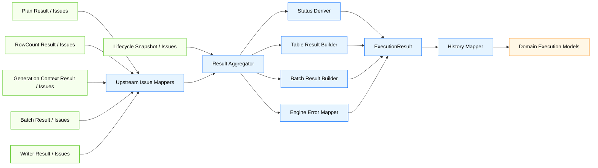
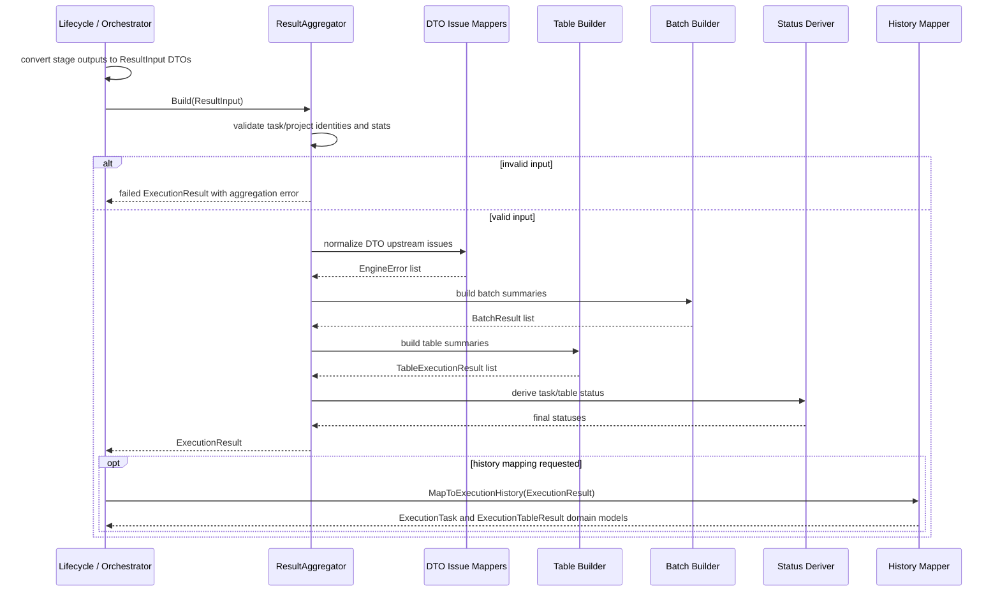
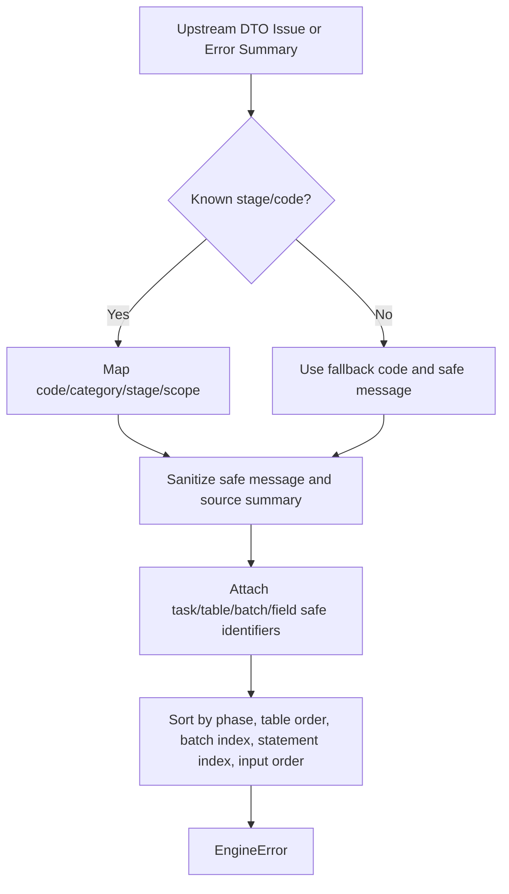
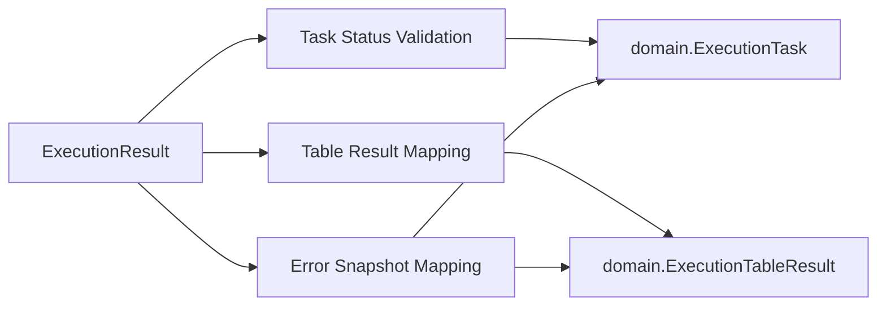
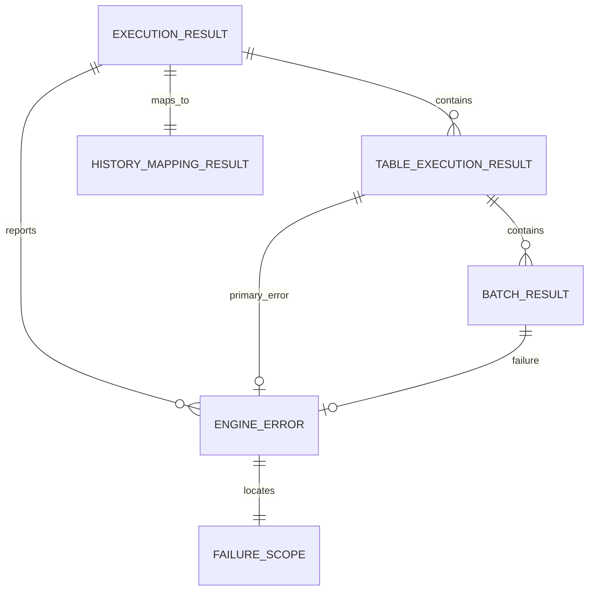

# Design Document

## Overview

`phase-03-execution-result-and-error-model` 在 Go 后端 engine 层建立统一运行时结果和安全错误边界，使 lifecycle、planner、rowcount、generation context、batch generation loop 和 writer adapter 的阶段输出可以汇总为一个可诊断、可测试、可映射到 Phase 2 执行历史模型的 `ExecutionResult`。

该设计负责任务级状态推导、表级结果汇总、批次结果摘要、`EngineError` 分类和失败范围表达、上游 safe issue/result 归一化、敏感信息过滤，以及到 `internal/domain/execution` 的纯内存映射。本规格不实现执行历史 API、Wails/Vue UI、日志查询、复杂 tracing/metrics/远端遥测、生成数据持久化、自动重试、断点续跑、补偿写入或恢复策略。

### Goals

- 定义 engine runtime `ExecutionResult`、`TableExecutionResult`、`BatchResult` 和 `EngineError`。
- 统一表达任务、表、批次、字段和 statement 失败范围。
- 将 lifecycle、plan、rowcount、gencontext、batch 和 writer 的安全 issue/result 映射为统一错误和统计。
- 推导成功、失败、部分失败和跳过的任务/表状态，任务和表状态直接复用 `internal/domain/execution` canonical 状态。
- 提供到 Phase 2 `ExecutionTask`、`ExecutionTableResult` 和 `ExecutionErrorSnapshot` 的最小历史映射。
- 通过测试固定安全诊断边界和未来 API/UI/observability/retry 能力隔离。

### Non-Goals

- 不实现 lifecycle 状态机、取消控制、预检聚合或阶段调度。
- 不实现依赖图、拓扑排序、行数规划、生成上下文构建、批次生成或 writer adapter 内部。
- 不连接真实数据库、不执行 SQL、不管理事务/连接池/凭据。
- 不实现执行历史 repository、数据库迁移、查询 API、Wails binding 或 Vue 页面。
- 不实现日志查询、复杂 metrics/tracing、远端遥测或错误报告上传。
- 不保存生成数据、SQL 文本、statement 参数、连接字符串、规则参数或 raw driver error。
- 不实现自动重试、断点续跑、补偿写入、恢复策略或幂等策略。

## Boundary Commitments

### This Spec Owns

- `internal/engine/result` 内的 runtime result、table result、batch result、error taxonomy、scope 和 stats 模型。
- 上游 Phase 3 safe issue/result 到统一 `EngineError` 和 result stats 的 mapper。
- 跨阶段安全 issue 兼容合同与 sanitizer 规则权威：各阶段可保留包内 issue 类型，但公开字段、敏感样本、固定安全消息和 scope 语义必须与本规格对齐。
- 任务级和表级状态推导规则直接复用 `execution.ExecutionTaskStatus` 和 `execution.ExecutionTableStatus`；取消通过 cancellation `EngineError` 与安全摘要表达。
- 批次范围、partial accepted、statement count 和 accepted rows 的最终摘要表达。
- 到 `internal/domain/execution` Phase 2 历史模型的纯内存映射。
- 安全错误过滤、固定公开消息和敏感样本测试。
- 禁止 UI/Wails/store/facade/driver/history API/observability/retry/recovery 进入本包的边界测试。

### Out of Boundary

- `internal/engine/lifecycle` 继续负责执行入口、预检聚合、状态机和取消控制。
- `internal/engine/plan` 继续负责依赖图和拓扑排序。
- `internal/engine/rowcount` 继续负责目标行数规划。
- `internal/engine/gencontext` 继续负责上下文、字段视图和引用存储。
- `internal/engine/batch` 继续负责主生成循环、行组装、writer seam 调用和阶段批次结果。
- `internal/engine/writer` 继续负责批量写入适配、capability gate、transaction/clear/executor seam 和 writer result。
- `internal/domain/execution` 继续拥有 Phase 2 领域历史模型；本规格只从 engine result 映射到该模型。
- API、Facade、Wails binding、Vue、store、真实 DB adapter 和 observability pipeline 不属于本规格。

### Allowed Dependencies

- 可依赖 `internal/domain/execution` 的 Phase 2 execution domain 类型进行历史映射。
- 可依赖 Go 标准库的 `context`、`errors`、`fmt`、`sort`、`strings`、`time`、`testing`。
- `internal/engine/result` 不直接导入 `internal/engine/lifecycle`、`internal/engine/plan`、`internal/engine/rowcount`、`internal/engine/gencontext`、`internal/engine/batch` 或 `internal/engine/writer`，避免后续执行编排调用 result aggregator 时形成 Go import cycle。
- result 包通过本包定义的 `ResultInput`、`UpstreamIssueInput`、`TableSummaryInput`、`BatchSummaryInput` 和 writer partial accepted summary 等 DTO 接收上游安全输出；上游包或更高层 orchestrator 负责把各自包内 result/issue 转换为这些 DTO。
- 不新增第三方依赖，不导入真实数据库 driver，不依赖 Wails/Vue/frontend/store/facade。

### Revalidation Triggers

- Phase 2 execution domain 状态枚举、错误快照字段或 table result 字段发生破坏性变化。
- lifecycle、plan、rowcount、gencontext、batch 或 writer 的 public result/issue 字段发生破坏性变化。
- 任一 Phase 3 阶段新增公开 safe issue 字段、错误码、stage、scope 或 sanitizer 规则。
- 后续 API/UI 要求新增公开必填字段或取消状态需要持久化一等枚举。
- 后续 observability 需要内部诊断 payload，但不能破坏公开安全边界。
- result 包出现真实 driver、Wails、Vue、store、facade、数据库产品名称分支、history API、retry 或 recovery 依赖。

## Architecture

### Existing Architecture Analysis

- `internal/engine/lifecycle` 输出生命周期阶段、预检问题、取消和失败状态，但不负责最终历史映射；执行收尾处可调用 result aggregator。
- `internal/engine/plan`、`rowcount`、`gencontext` 输出各自阶段的 plan/result/issue，均使用安全 issue 边界，并由上游包或更高层 orchestrator 转换为 result DTO。
- `internal/engine/batch` 输出批次生成阶段结果、progress 和 `BatchIssue`，并调用 writer seam；进入 result 包前转换为批次安全摘要 DTO。
- `internal/engine/writer` 输出写入统计、partial accepted 和 `WriterIssue`；进入 result 包前转换为 writer 安全摘要 DTO。
- `internal/domain/execution` 已定义 Phase 2 `ExecutionTask`、`ExecutionTableResult`、`ExecutionTaskStatus`、`ExecutionTableStatus` 和 `ExecutionErrorSnapshot`。

### Architecture Pattern & Boundary Map



**Architecture Integration**:
- Selected pattern: independent engine result package + result-owned DTO mapper/aggregator services。
- Domain/feature boundaries: result 包消费本包 DTO 化的上游 safe outputs，生成 runtime summary，并向 Phase 2 domain 做纯内存 mapping。
- Existing patterns preserved: engine owns runtime execution details；domain owns persistent model；adapter owns DB differences；Wails/Vue 不进入业务逻辑。
- New components rationale: 最终结果需要跨阶段汇总，不能放入任一单阶段包，也不能让 domain 知道 engine 内部阶段；result 包也不能反向依赖未来会调用它的上游阶段包。
- Steering compliance: 不上传远端、不泄露敏感内容、不跨阶段实现 API/UI/observability/retry。

### Technology Stack

| Layer | Choice / Version | Role in Feature | Notes |
|-------|------------------|-----------------|-------|
| Frontend / CLI | 不涉及 | 无 UI 或 CLI 变更 | 不新增 Wails/Vue 事件 |
| Backend / Engine | Go | result/error 模型、mapper、aggregator 和测试 | 位于 `internal/engine/result` |
| Domain | `internal/domain/execution` | Phase 2 历史模型映射目标 | 不实现 repository 或 migration |
| Upstream Engine | lifecycle/plan/rowcount/gencontext/batch/writer | 提供安全结果和 issue，并在进入 result 前转换为 result DTO | 不被 result 包直接 import |
| Infrastructure | Go 标准库 | time、排序、字符串过滤和测试 | 不新增第三方依赖 |

## File Structure Plan

### Directory Structure

```text
internal/
└── engine/
    └── result/
        ├── model.go              # ExecutionResult、TableExecutionResult、BatchResult、stats 和 canonical 状态字段
        ├── error.go              # EngineError、ErrorCode、Category、Stage、FailureScope 和安全消息
        ├── input.go              # ResultInput、阶段输入、表/批次安全汇总输入和基础校验
        ├── aggregator.go         # ResultAggregator 协调入口和确定性汇总流程
        ├── status.go             # 任务/表 canonical 状态推导和批次摘要状态规则
        ├── table.go              # 表级结果构建、skipped/failed/success 汇总
        ├── batch.go              # 批次结果构建、partial accepted 和 statement 摘要
        ├── mapper_lifecycle.go   # lifecycle/precheck DTO issue 映射
        ├── mapper_plan.go        # plan/rowcount/context DTO issue 映射
        ├── mapper_batch.go       # batch DTO issue/result/progress 映射
        ├── mapper_writer.go      # writer DTO issue/result 映射
        ├── history.go            # Phase 2 execution domain 纯内存映射
        ├── sanitizer.go          # 敏感信息过滤、固定消息模板和安全字段保护
        ├── fakes.go              # 测试用 fake upstream result/issue 构造器
        ├── model_test.go         # 模型、枚举、JSON/零值安全测试
        ├── aggregator_test.go    # 成功、失败、部分失败、取消和跳过汇总测试
        ├── mapper_test.go        # 上游 issue/result 到 EngineError 的映射测试
        ├── history_test.go       # Phase 2 execution domain 映射测试
        ├── sanitizer_test.go     # 敏感信息样本过滤测试
        └── boundary_test.go      # 禁止依赖、未来能力隔离和数据库产品名称分支测试
```

### Modified Files

- 无现有业务文件必须修改；本规格应新增 `internal/engine/result` 包并通过测试验证边界。
- `go.mod` 不应因为本规格新增第三方依赖而变化。
- 上游 engine 包或更高层 orchestrator 在集成时可调用 result aggregator，但必须先把包内输出转换为 result-owned DTO；result 包不得为 typed mapper 反向导入上游阶段包。
- `internal/domain/execution` 不应依赖 engine/result；history mapper 的依赖方向必须从 engine/result 指向 domain execution。

## System Flows

### Execution Result Aggregation Flow



### Error Normalization Flow



### History Mapping Flow



## Requirements Traceability

| Requirement | Summary | Components | Interfaces | Flows |
|-------------|---------|------------|------------|-------|
| 1.1 | 构造统一汇总输入 | Result Input, Aggregator | ResultInput | Aggregation Flow |
| 1.2 | 保留最小字段 | Model, Input | ExecutionResult | Aggregation Flow |
| 1.3 | 非法输入阻断 | Input Validator, Errors | EngineError | Aggregation Flow |
| 1.4 | 安全 issue 形成任务失败 | Issue Mappers, Status Deriver | EngineError | Error Normalization Flow |
| 1.5 | 禁止重跑阶段逻辑 | Boundary Tests | Package boundary | Boundary tests |
| 2.1 | 全部成功任务状态 | Status Deriver, Aggregator | execution.ExecutionTaskStatus | Aggregation Flow |
| 2.2 | 写入前阻断失败 | Status Deriver, Errors | FailureScope | Aggregation Flow |
| 2.3 | 部分失败 | Status Deriver, Batch/Table Builder | Partial summary | Aggregation Flow |
| 2.4 | 取消安全摘要 | Status Deriver, Errors | EngineError, execution.ExecutionTaskStatus | Aggregation Flow |
| 2.5 | 禁止恢复策略 | Boundary Tests | Source scan | Boundary tests |
| 3.1 | 拓扑顺序表结果 | Table Builder | TableExecutionResult | Aggregation Flow |
| 3.2 | 表成功统计 | Table Builder | TableStats | Aggregation Flow |
| 3.3 | 表失败范围 | Table Builder, Errors | EngineError | Aggregation Flow |
| 3.4 | 依赖失败跳过 | Status Deriver, Table Builder | Skipped status | Aggregation Flow |
| 3.5 | 不重排/不读数据库 | Boundary Tests | Package boundary | Boundary tests |
| 4.1 | 批次成功统计 | Batch Builder | BatchResult | Aggregation Flow |
| 4.2 | partial accepted | Batch Builder, Writer Mapper | BatchResult | Aggregation Flow |
| 4.3 | 批次失败错误 | Batch Builder, Errors | EngineError | Error Normalization Flow |
| 4.4 | 跳过表无伪造批次 | Table/Batch Builder | BatchResult | Aggregation Flow |
| 4.5 | 不保存敏感批次内容 | Model, Boundary Tests | Public fields | Boundary tests |
| 5.1 | 上游错误分类 | Issue Mappers | EngineError | Error Normalization Flow |
| 5.2 | 安全失败范围 | Error Model | FailureScope | Error Normalization Flow |
| 5.3 | deterministic errors | Issue Mappers | EngineError list | Error Normalization Flow |
| 5.4 | fallback 安全错误 | Error Mapper | EngineError | Error Normalization Flow |
| 5.5 | 禁止敏感诊断 | Sanitizer, Tests | SafeMessage | Boundary tests |
| 6.1 | lifecycle 映射 | Lifecycle Mapper | EngineError | Error Normalization Flow |
| 6.2 | plan/rowcount/context 映射 | Plan Mapper | EngineError | Error Normalization Flow |
| 6.3 | batch 映射 | Batch Mapper | BatchResult | Aggregation Flow |
| 6.4 | writer 映射 | Writer Mapper | BatchResult, EngineError | Aggregation Flow |
| 6.5 | result 不导入上游阶段包 | Boundary Tests | Import checks | Boundary tests |
| 7.1 | task status history mapping | History Mapper | ExecutionTask | History Mapping Flow |
| 7.2 | table status history mapping | History Mapper | ExecutionTableResult | History Mapping Flow |
| 7.3 | error snapshot mapping | History Mapper | ExecutionErrorSnapshot | History Mapping Flow |
| 7.4 | error message 降级 | History Mapper | Safe summary | History Mapping Flow |
| 7.5 | 禁止 history API/persistence | Boundary Tests | Package boundary | Boundary tests |
| 8.1 | 安全错误字段 | Error Model, Sanitizer | EngineError | Error Normalization Flow |
| 8.2 | 过滤敏感 payload | Sanitizer | SafeMessage | Boundary tests |
| 8.3 | 安全定位 | FailureScope | Scope fields | Error Normalization Flow |
| 8.4 | 公开字段敏感测试 | Sanitizer Tests | Public models | Boundary tests |
| 8.5 | 不透传 raw error | Sanitizer, Boundary Tests | EngineError | Boundary tests |
| 9.1 | 核心单元测试 | Unit Tests | Go tests | Test flows |
| 9.2 | 场景覆盖 | Unit Tests | Go tests | Test flows |
| 9.3 | 接缝和 history 测试 | Seam Tests | Mapper DTOs | Test flows |
| 9.4 | 禁止外部依赖 | Boundary Tests | Import checks | Boundary tests |
| 9.5 | 禁止未来能力 | Boundary Tests | Source scans | Boundary tests |

## Components and Interfaces

| Component | Domain/Layer | Intent | Req Coverage | Key Dependencies | Contracts |
|-----------|--------------|--------|--------------|------------------|-----------|
| Result Input Validator | Engine Result | 校验汇总输入、身份一致性和统计合法性 | 1.1-1.5 | result DTOs | Service |
| Result Aggregator | Engine Result | 协调 mapper、status、table、batch 和 error 汇总 | 1.1-4.5 | result components | Service |
| Status Deriver | Engine Result | 推导 canonical 任务/表状态和批次摘要状态 | 2.1-3.4 | result model | Service |
| Table Result Builder | Engine Result | 构造表级结果、跳过和统计 | 3.1-3.5 | result table/batch DTOs | Service |
| Batch Result Builder | Engine Result | 构造批次结果、partial accepted 和 statement 摘要 | 4.1-4.5 | result batch/writer DTOs | Service |
| Engine Error Mapper | Engine Result | 归一化错误分类、阶段、范围和排序 | 5.1-6.5 | result upstream issue DTOs | Service |
| Sanitizer | Engine Result | 固定安全消息和敏感信息过滤 | 5.5, 8.1-8.5 | Go strings | Service |
| History Mapper | Engine Result | 映射到 Phase 2 execution domain 模型 | 7.1-7.5 | domain/execution | Service |
| Boundary & Seam Tests | Test | 固定依赖和未来能力隔离 | 9.1-9.5 | Go test tooling | Test |

### Result Input Validator

| Field | Detail |
|-------|--------|
| Intent | 接收上游阶段输出，确保可构造可信最终结果 |
| Requirements | 1.1-1.5 |

**Responsibilities & Constraints**
- 校验 TaskID、ProjectID、StartedAt/EndedAt 和阶段摘要边界。
- 校验表、批次和统计值非负且安全范围一致。
- 接受成功结果、失败 issue-only 结果和取消摘要。
- 不调用任何上游阶段逻辑，不访问 store、DB、Wails 或 UI。

**Conceptual Contract**

```go
type ResultInput struct {
    TaskID int64
    ProjectID int64
    TaskName string
    StartedAt time.Time
    EndedAt time.Time
    Canceled bool
    Lifecycle LifecycleSummaryInput
    Tables []TableSummaryInput
    UpstreamIssues []UpstreamIssueInput
}
```

### Runtime Result Models

| Field | Detail |
|-------|--------|
| Intent | 表达 engine 最终运行时结果和统计 |
| Requirements | 2.1-4.5 |

```go
type ExecutionResult struct {
    TaskID int64
    ProjectID int64
    Status execution.ExecutionTaskStatus
    StartedAt time.Time
    EndedAt time.Time
    TotalTargetRows int64
    TotalGeneratedRows int64
    TotalAcceptedRows int64
    TotalBatchCount int64
    TotalStatementCount int64
    Tables []TableExecutionResult
    Errors []EngineError
    Warnings []EngineError
}

type TableExecutionResult struct {
    ProjectTableID int64
    TableID int64
    SchemaNameSnapshot string
    TableNameSnapshot string
    ExecutionOrder int
    Status execution.ExecutionTableStatus
    TargetRows int64
    GeneratedRows int64
    AcceptedRows int64
    BatchCount int64
    StatementCount int64
    Batches []BatchResult
    Error *EngineError
}

type BatchResultStatus string

const (
    BatchResultStatusSuccess BatchResultStatus = "success"
    BatchResultStatusFailed BatchResultStatus = "failed"
    BatchResultStatusPartialAccepted BatchResultStatus = "partial_accepted"
)

type BatchResult struct {
    ProjectTableID int64
    TableID int64
    BatchIndex int64
    StartRow int64
    EndRow int64
    Status BatchResultStatus
    AcceptedRows int64
    StatementCount int64
    FailedStatementIndex *int64
    PartialAccepted bool
    Error *EngineError
}
```

`ExecutionResult.Status` 和 `TableExecutionResult.Status` 必须直接复用 `internal/domain/execution` 的 canonical 状态类型，不定义平行 runtime task/table status，也不通过 mapper-only enum 做转换。`BatchResultStatus` 只表达批次摘要内的 success/failed/partial accepted 结果，属于批次范围语义；若实现时发现其与表/任务状态无差异，应继续收敛到 canonical 状态或使用 `EngineError`/`PartialAccepted` 字段表达。取消不新增任务状态，使用 cancellation `EngineError`、`Canceled` 输入摘要和 canonical `FAILED` / `PARTIAL_FAILED` 任务状态表达。

### Engine Error Mapper

| Field | Detail |
|-------|--------|
| Intent | 将所有阶段 issue 映射为统一安全错误 |
| Requirements | 5.1-6.5, 8.1-8.5 |

```go
type EngineError struct {
    Code EngineErrorCode
    Category EngineErrorCategory
    Stage EngineStage
    Scope FailureScope
    FieldPath string
    SafeMessage string
    Blocking bool
    OccurredAt time.Time
}

type FailureScope struct {
    TaskID int64
    ProjectID int64
    ProjectTableID int64
    TableID int64
    ColumnID int64
    BatchIndex int64
    RowIndex int64
    StatementIndex int64
}
```

- `SafeMessage` 必须由固定模板或已验证安全文本产生。
- `Scope` 只包含安全 ID 和索引，不包含值。
- `EngineStage` 至少覆盖 lifecycle、precheck、planning、rowcount、context、generation、reference、writer、transaction、clear、dialect、executor、aggregation、history_mapping、cancellation。

### History Mapper

| Field | Detail |
|-------|--------|
| Intent | 将 runtime result 转换为 Phase 2 execution domain 模型 |
| Requirements | 7.1-7.5 |

**History Status Handling**

`ExecutionResult.Status` 已经是 Phase 2 `execution.ExecutionTaskStatus`，history mapper 不再做 runtime task status 到 domain task status 的枚举转换，只校验该状态符合当前统计和 blocking error 语义后原样写入 domain model。取消由 cancellation `EngineError` / `ExecutionErrorSnapshot` 表达：无已接受范围时任务状态为 `FAILED`，存在已接受范围或成功表时任务状态为 `PARTIAL_FAILED`。

`TableExecutionResult.Status` 已经是 Phase 2 `execution.ExecutionTableStatus`，history mapper 原样映射表状态、rows written、execution order 和 name snapshots。`BatchResultStatus` 不进入 Phase 2 domain table status；它仅用于运行时批次摘要和错误定位。

## Data Models

### Domain Model

- `ResultInput`: result aggregation 的最小输入。
- `ExecutionResult`: 任务级运行时结果和总统计，状态直接使用 `execution.ExecutionTaskStatus`。
- `TableExecutionResult`: 表级运行时结果、批次集合和错误摘要。
- `BatchResult`: 批次级范围、状态和写入统计。
- `EngineError`: 统一安全错误。
- `FailureScope`: 安全失败范围。
- `HistoryMappingResult`: Phase 2 domain execution 模型集合。

### Logical Data Model



**Consistency & Integrity**
- `ExecutionResult.Tables` 必须按拓扑执行顺序稳定排列。
- 每个表级结果至多有一个 primary blocking error，但 `ExecutionResult.Errors` 可保留全部阻断错误。
- 成功状态不得包含 blocking errors。
- 取消场景不得新增平行任务状态；无已接受范围时使用 `execution.ExecutionTaskStatusFailed`，存在已接受范围或成功表时使用 `execution.ExecutionTaskStatusPartialFailed`，并通过 cancellation `EngineError` 区分原因。
- 批次 `StartRow < EndRow`，零行表不包含伪造批次。
- 所有公开错误必须通过 sanitizer。

### Physical Data Model

- 不新增数据库表、迁移、索引或本地存储结构。
- 不写入 execution history repository。
- 不保存生成值、SQL、statement 参数、连接信息、规则参数或 raw error。
- Phase 2 history mapping 只生成内存 domain model，由后续 storage/API spec 决定持久化方式。

## Error Handling

### Error Strategy

- 输入汇总错误：返回 failed `ExecutionResult` 和 aggregation stage `EngineError`。
- 上游 known issue：按 mapper 转换 code、category、stage、scope 和 safe message。
- 上游 unknown issue：使用 fallback code 和固定 safe message。
- 任务级阻断：状态为 `execution.ExecutionTaskStatusFailed`，表结果可为空或 skipped；取消通过 cancellation `EngineError` 表达。
- 表/批次阻断：状态为 `execution.ExecutionTaskStatusPartialFailed` 或 `execution.ExecutionTaskStatusFailed`，保留已接受范围。
- 历史映射错误：返回 history_mapping stage `EngineError`，不修改 runtime result。
- 敏感内容：sanitizer 替换为固定安全消息，并通过测试覆盖敏感样本。

### Error Categories and Responses

| Category | Trigger | Response | Result Impact |
|----------|---------|----------|---------------|
| Lifecycle | 状态机、取消或阶段切换失败 | task-level EngineError | FAILED/PARTIAL_FAILED + cancellation error when canceled |
| Precheck | 预检聚合失败 | task/table EngineError | FAILED |
| Planning | dependency plan 或 rowcount 不可规划 | task/table EngineError | FAILED |
| Context | generation context 构建或字段视图失败 | table/field EngineError | FAILED |
| Generation | generator/batch assembly 失败 | table/batch/field EngineError | FAILED/PARTIAL_FAILED |
| Reference | 引用缺失或提交失败 | table/batch/field EngineError | FAILED/PARTIAL_FAILED |
| Writer | writer capability、mapping、dialect、executor 失败 | table/batch/statement EngineError | FAILED/PARTIAL_FAILED |
| Cancellation | 用户取消或 control token 取消 | task/table EngineError | FAILED/PARTIAL_FAILED + cancellation error |
| Aggregation | result 输入或汇总内部校验失败 | task EngineError | FAILED |
| History Mapping | Phase 2 模型映射失败 | task/table EngineError | mapping failure only |

### Public Error Fields

公开错误只允许包含：

- `Code`
- `Category`
- `Stage`
- `FieldPath`
- `SafeMessage`
- `Blocking`
- `OccurredAt`
- `Scope`

`Scope` 可包含任务、Project、ProjectTable、Table、Column、BatchIndex、RowIndex 和 StatementIndex 等安全标识。不得包含 SQL、连接字符串、DSN、password、token、规则参数、statement 参数、生成值、引用值或 raw driver error。

### Monitoring

本规格不实现运行时日志、metrics、tracing、远端 telemetry 或错误报告上传。测试中允许 fake mapper 记录调用顺序用于断言，但该记录不属于运行时公开观测管道。

## Testing Strategy

### Unit Tests

- 输入校验测试：身份缺失、不一致、统计负数、非法批次范围和 issue-only 失败输入。
- 状态推导测试：成功、写入前失败、部分失败、取消错误摘要和 skipped。
- 表级汇总测试：拓扑顺序、零行成功、失败表、跳过表和统计求和。
- 批次汇总测试：成功批次、失败批次、partial accepted、failed statement index 和空批次跳过。
- 错误映射测试：lifecycle、precheck、planner、rowcount、context、generation、reference、writer、transaction、clear、dialect、executor 和 unknown issue。
- 历史映射测试：task status、table status、rows written、execution order、name snapshots 和 error snapshot。
- 安全测试：公开结果和历史快照不包含 SQL、DSN、password、token、规则参数、参数值、生成值或 raw driver error。

### Integration / Seam Tests

- 使用 fake lifecycle result、plan issue、rowcount issue、context issue、batch issue 和 writer issue 构造完整失败链，验证统一 `ExecutionResult`。
- 使用 fake writer partial accepted 结果验证非事务部分接受范围进入 task/table/batch 摘要。
- 使用 fake Phase 2 domain execution models 验证 history mapper 可被后续服务层消费。
- 验证上游包或更高层 orchestrator 可以把阶段输出转换为 result DTO，并由 result 包在不导入上游阶段包的前提下完成归一化。

### Boundary Tests

- 检查 `internal/engine/result` 不导入 lifecycle、plan、rowcount、gencontext、batch、writer、Wails、Vue、frontend API、store、facade、真实数据库 driver、连接管理或凭据存储包。
- 检查 result 源码不包含数据库产品名称业务分支。
- 检查 result 包未实现 execution history API、UI progress、log query、metrics/tracing/telemetry、generated data persistence、retry、resume、compensation 或 recovery 行为。
- 检查 `go.mod` 未因本规格新增第三方依赖。
- 检查敏感 SQL、连接字符串、DSN、密码、token、规则参数、statement 参数和生成值样本不会出现在公开模型字段中。

## Security Considerations

- `EngineError` 是公开安全错误，不保存 raw cause。
- `ExecutionResult`、`TableExecutionResult` 和 `BatchResult` 只保存统计、状态和安全范围，不保存行值或 SQL。
- `ExecutionErrorSnapshot.Message` 只能来源于安全摘要。
- runtime 取消和失败摘要不能包含用户 SQL、连接详情、密码、令牌、规则参数或生成数据。
- 敏感信息过滤测试必须覆盖 result 模型和 history mapper 两个公开出口。

## Performance & Scalability

- 汇总复杂度与表数、批次数和错误数线性相关。
- result 包不复制生成行数据，只处理统计和安全标识。
- deterministic sorting 使用阶段、执行顺序、批次索引和输入序号，避免不稳定 map iteration。
- 本规格不承诺实时 progress streaming、复杂指标聚合或大规模历史查询性能。

## Migration Strategy

- 不需要数据库迁移、配置迁移或前端迁移。
- 新增 `internal/engine/result` 包不改变 Phase 2 domain JSON 合同。
- 后续 lifecycle 可在收尾阶段调用 result aggregator。
- 后续 history API/storage 可使用 history mapper 输出，不需要理解上游 engine stage issue。
- 若未来 Phase 2 增加一等 cancellation 状态，应触发本规格 revalidation，并决定是否扩展 canonical `execution.ExecutionTaskStatus`，而不是在 result 包内新增平行任务状态。

## Supporting References

- `.kiro/specs/phase-03-execution-result-and-error-model/brief.md`
- `.kiro/specs/phase-03-execution-result-and-error-model/research.md`
- `.kiro/steering/roadmap.md`
- `.kiro/steering/product.md`
- `.kiro/steering/tech.md`
- `.kiro/steering/structure.md`
- `.kiro/specs/phase-03-execution-lifecycle/requirements.md`
- `.kiro/specs/phase-03-execution-lifecycle/design.md`
- `.kiro/specs/phase-03-dependency-graph-and-topological-sort/requirements.md`
- `.kiro/specs/phase-03-dependency-graph-and-topological-sort/design.md`
- `.kiro/specs/phase-03-row-count-planning/requirements.md`
- `.kiro/specs/phase-03-row-count-planning/design.md`
- `.kiro/specs/phase-03-generation-context/requirements.md`
- `.kiro/specs/phase-03-generation-context/design.md`
- `.kiro/specs/phase-03-batch-generation-loop/requirements.md`
- `.kiro/specs/phase-03-batch-generation-loop/design.md`
- `.kiro/specs/phase-03-batch-writer-adapter/requirements.md`
- `.kiro/specs/phase-03-batch-writer-adapter/design.md`
- `.kiro/specs/phase-02-generation-job-model/requirements.md`
- `.kiro/specs/phase-02-generation-job-model/design.md`
