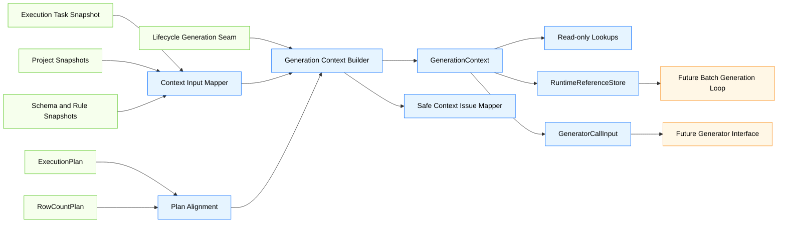
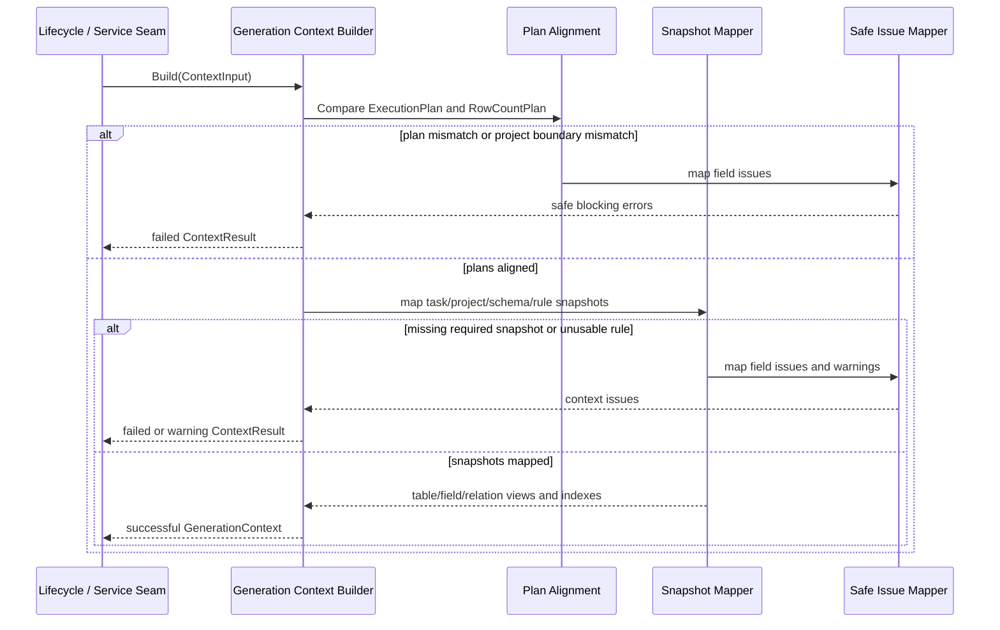
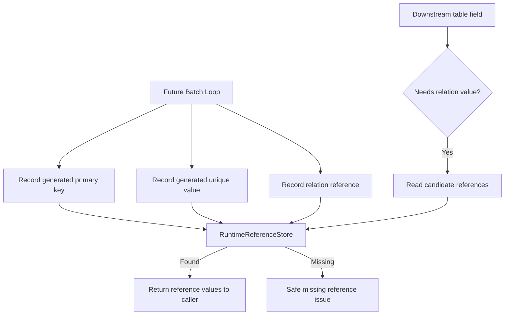
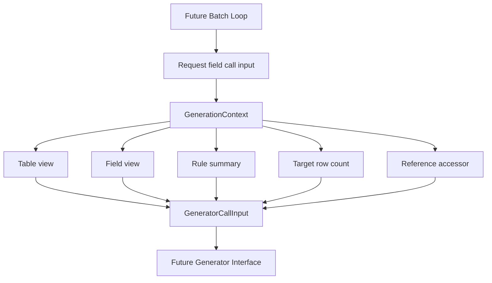
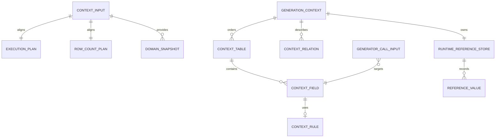

# Design Document

## Overview

`phase-03-generation-context` 在 Go 后端 engine 层建立生成期上下文边界，使 lifecycle 执行输入、dependency `ExecutionPlan`、rowcount `RowCountPlan` 和 Phase 2 Project / Schema / Rule / Relation 快照能够转化为后续 batch generation loop 和 generator framework 可消费的只读执行视图。

当前 Phase 2 已提供领域模型，`phase-03-dependency-graph-and-topological-sort` 已定义稳定拓扑计划，`phase-03-row-count-planning` 已定义稳定目标行数计划。本规格新增独立的 engine 生成上下文包，负责构建只读快照、确定性查找、字段级生成计划视图、执行内引用存储和最小 generator call input，并保持完整生成器注册表、内置生成器、批量生成循环、writer adapter、真实数据库访问、API/UI 和跨任务缓存全部在边界之外。

### Goals

- 建立从执行任务、Project、Schema、字段规则、拓扑计划和行数计划到 `GenerationContext` 的输入边界。
- 输出按拓扑顺序排列的表视图、字段视图、关系视图、规则视图和目标行数视图。
- 提供 ProjectTable、Table、Column、Relation、ExecutionOrder 和 RowTarget 的确定性查找接口。
- 提供当前执行内的主键、唯一键、外键候选值和关系引用运行态存储边界。
- 定义最小 generator call input，供后续 batch loop 和 Phase 4 generator interface 接入。
- 将上下文构建和引用诊断表达为 lifecycle-compatible 的安全预检结果。

### Non-Goals

- 不重新构建依赖图、依赖边或拓扑排序。
- 不重新解释 ProjectTable 行数、不构建倍率约束、不推导目标行数。
- 不实现完整 generator registry、内置生成器、随机生成算法或参数 Schema 校验。
- 不实现 batch generation loop、行组装调度、批次数量计划或进度事件。
- 不实现 writer adapter、事务、清空策略、真实数据库写入或真实数据库读取已有父表数据。
- 不实现跨执行任务全局缓存、外部数据源生成器上下文、API DTO、Facade、Wails binding 或 Vue 页面。
- 不修改 Phase 2 持久化模型、lifecycle 状态机、ExecutionPlan 或 RowCountPlan。

## Boundary Commitments

### This Spec Owns

- `internal/engine/gencontext` 内的上下文输入、只读快照、查找索引、字段生成视图和构建结果模型。
- `ExecutionPlan` 与 `RowCountPlan` 的对齐校验和 fail-fast 阻断诊断。
- 从 Project、ProjectTable、DbTable、DbColumn、TableConstraint、GeneratorConfig、TableRelation、ProjectTableRelation 派生 engine 执行期视图的规则。
- 当前执行内 `RuntimeReferenceStore`，用于记录和查询已生成键值、唯一值、外键候选值和关系引用。
- 最小 `GeneratorCallInput` 和只读引用访问器边界。
- 与 lifecycle precheck / generation seam 兼容的安全错误、警告和构建结果字段。
- 防止 generator registry、batch loop、writer、真实数据库访问、UI/API 和数据库类型硬编码进入上下文层的边界测试。

### Out of Boundary

- 生命周期状态、启动、取消、失败和完成由 `phase-03-execution-lifecycle` 负责。
- 依赖图、拓扑排序、循环诊断和执行顺序计算由 `phase-03-dependency-graph-and-topological-sort` 负责。
- 目标行数推导、关系倍率约束求解和不可满足行数诊断由 `phase-03-row-count-planning` 负责。
- 批量生成主循环、字段生成调度、行组装和批次状态推进由后续 `phase-03-batch-generation-loop` 负责。
- 批量写入适配、事务、清空策略和真实数据库驱动调用由后续 `phase-03-batch-writer-adapter` 负责。
- 完整 generator interface / registry / built-in generators 由 Phase 4/5 规格负责。
- API、Facade DTO、Wails binding、Vue store/page 和进度事件由后续 Phase 7/8/9 负责。

### Allowed Dependencies

- 可依赖 `internal/domain/execution` 的 `GenerationJob`、`ExecutionTask` 或等价执行任务快照字段。
- 可依赖 `internal/domain/project` 的 `Project`、`ProjectTable`、`ProjectTableRelation` 和 `RelationValueSource`。
- 可依赖 `internal/domain/schema` 的 `DbTable`、`DbColumn`、`TableConstraint`、`ForeignKey`、`TableRelation`、约束和关系类型。
- 可依赖 `internal/domain/rule` 的 `GeneratorConfig`、`DataMappingType`、`GeneratorParams` 和 `ConfigStatus`。
- 可依赖 `internal/engine/plan` 的 `ExecutionPlan`、`PlannedTable` 和安全计划结果字段方向。
- 可依赖 `internal/engine/rowcount` 的 `RowCountPlan`、`PlannedRowCount` 和来源摘要字段方向。
- 可依赖 `internal/engine/lifecycle` 的安全错误、阶段、预检或 generation seam 字段方向；若实现时未集成，则通过同构字段保持兼容。
- 可依赖 Go 标准库集合、排序、同步和测试能力。
- 不新增第三方依赖。

### Revalidation Triggers

- lifecycle `ExecutionInput`、precheck 或 generation seam 字段发生破坏性变更。
- dependency `ExecutionPlan` / `PlannedTable` 输出字段发生破坏性变更。
- rowcount `RowCountPlan` / `PlannedRowCount` 输出字段发生破坏性变更。
- Project、ProjectTable、ProjectTableRelation、DbTable、DbColumn、TableConstraint 或 GeneratorConfig 的身份字段和配置状态语义发生破坏性变更。
- Phase 4 generator interface 要求 `GeneratorCallInput` 增加必填字段或移除字段。
- 后续 batch generation loop 对引用存储的读写一致性要求变化。
- 上下文包开始依赖 store/facade/Wails/UI/真实数据库 driver 或数据库产品名称分支。

## Architecture

### Existing Architecture Analysis

- `internal/domain/execution` 已提供执行任务历史快照，但不承载生成上下文或批量生成算法。
- `internal/domain/project` 已提供 Project 表配置和关系实例，`ProjectTable.RowCount` 和 `ExecutionOrder` 是持久化快照，不应由上下文重新解释或写回。
- `internal/domain/schema` 已提供表、字段、约束、外键和逻辑关系模型，适合作为执行期只读视图来源。
- `internal/domain/rule` 已提供字段级 `GeneratorConfig`，其中 generator 名称和参数属于规则快照，具体 generator 查找属于后续 Phase 4。
- `internal/engine/plan` 和 `internal/engine/rowcount` 分别提供稳定拓扑顺序和目标行数，明确将 generation context 作为下游消费者。
- Steering 指定 engine 拥有执行上下文，生成器不直接访问数据库，Wails/Vue 不承载业务算法，错误和日志不得泄露敏感数据。

### Architecture Pattern & Boundary Map



**Architecture Integration**:
- Selected pattern: independent engine context package + immutable snapshot builder + execution-local runtime reference store.
- Domain/feature boundaries: domain packages provide persisted configuration snapshots, upstream engine packages provide computed plans, gencontext provides execution-time read model and reference store, downstream batch/generator packages consume the context.
- Existing patterns preserved: Go backend owns business rules; domain remains UI-free; Wails/Vue/store/facade do not enter engine context logic.
- New components rationale: a read-only context and reference store are required before batch generation can safely call generators and fill relations.
- Steering compliance: no cross-phase generator registry, no real database access, no sensitive leakage, no database-type hardcoding.

### Technology Stack

| Layer | Choice / Version | Role in Feature | Notes |
|-------|------------------|-----------------|-------|
| Frontend / CLI | 不涉及 | 无 UI 或 CLI 变更 | 不新增 Vue / Wails 事件 |
| Backend / Engine | Go | 上下文构建、查找、引用存储和测试 | 位于 `internal/engine/gencontext` |
| Domain | 既有 Go domain 包 | 提供执行、Project、Schema、Rule 快照 | 不修改持久化语义 |
| Upstream Engine | `internal/engine/plan`, `internal/engine/rowcount` | 提供拓扑和行数计划 | 不重复算法 |
| Data / Storage | 不新增 | 不创建表、不迁移数据 | 不写入历史或生成数据 |
| Infrastructure | Go 标准库 | map、slice、sort、sync、测试 | 不新增第三方依赖 |

## File Structure Plan

### Directory Structure

```text
internal/
└── engine/
    └── gencontext/
        ├── input.go          # ContextInput、快照输入和计划对齐边界
        ├── context.go        # GenerationContext、表/字段/关系/规则/行数只读视图
        ├── lookup.go         # ProjectTable、Table、Column、Relation、ExecutionOrder 查找接口
        ├── field.go          # 字段级生成计划视图、约束摘要和规则摘要
        ├── reference.go      # RuntimeReferenceStore、引用键、引用值和候选读取
        ├── generator.go      # GeneratorCallInput 和只读引用访问器
        ├── result.go         # 构建结果、预检结果和 lifecycle seam 兼容字段
        ├── errors.go         # 安全错误码、阶段、字段路径和敏感信息过滤
        ├── builder.go        # 上下文构建协调入口
        ├── input_test.go     # 输入对齐、计划一致性和快照构建测试
        ├── lookup_test.go    # 只读查找、字段计划和目标行数查找测试
        ├── reference_test.go # 引用存储记录、查询、缺失和隔离测试
        ├── generator_test.go # GeneratorCallInput 构造和访问器边界测试
        └── boundary_test.go  # 禁止依赖、安全错误和未来能力隔离测试
```

### Modified Files

- 无现有业务文件必须修改；本规格应新增 engine 生成上下文子包并通过测试验证边界。
- `go.mod` 不应因为本规格新增第三方依赖而变化；如实现发现必须引入依赖，应返回设计复核。
- Phase 2 domain 包不应修改 Project、Schema、Rule、ExecutionTask 的持久化字段语义来表达上下文内部状态。
- dependency plan 和 rowcount 包不应为上下文增加算法状态；只需暴露稳定输出。
- lifecycle 包只有在后续集成需要时通过既有 precheck/generation seam 接入，不应改变 lifecycle 状态机。

## System Flows

### Context Build Flow



### Runtime Reference Flow



### Generator Call Input Flow



## Requirements Traceability

| Requirement | Summary | Components | Interfaces | Flows |
|-------------|---------|------------|------------|-------|
| 1.1 | 为拓扑表建立上下文表节点 | Context Input Mapper, Builder | ContextInput, ContextTable | Context Build Flow |
| 1.2 | 保留 ProjectTable/Table/Order/RowTarget 字段 | Snapshot Mapper | ContextTable, ContextRowTarget | Context Build Flow |
| 1.3 | ExecutionPlan 与 RowCountPlan 不一致阻断 | Plan Alignment, Safe Issue Mapper | ContextIssue | Context Build Flow |
| 1.4 | 执行任务/Project 边界不一致阻断 | Input Mapper, Safe Issue Mapper | ContextResult | Context Build Flow |
| 1.5 | 不重建拓扑/行数、不读 UI/DB | Boundary Tests | Package boundary | Boundary tests |
| 2.1 | 提供只读快照视图 | GenerationContext | Snapshot views | Context Build Flow |
| 2.2 | 按 ID/顺序确定性查询 | Lookup Indexes | Lookup methods | Lookup tests |
| 2.3 | 目标行数来自 RowCountPlan | ContextRowTarget | Row target lookup | Context Build Flow |
| 2.4 | 保留字段规则快照 | ContextRule | Rule summary | Context Build Flow |
| 2.5 | 不写回持久化字段 | Boundary Tests | Domain boundary | Boundary tests |
| 3.1 | 字段生成计划视图 | Field Plan Builder | ContextField | Generator Call Input Flow |
| 3.2 | 字段约束摘要 | Constraint Summary | FieldConstraintSummary | Generator Call Input Flow |
| 3.3 | 必须生成字段缺少规则阻断 | Field Plan Builder, Safe Issue Mapper | ContextIssue | Context Build Flow |
| 3.4 | 不可用规则告警或阻断 | Rule Mapper | ContextIssue | Context Build Flow |
| 3.5 | 不实现 registry/参数校验/生成 | Boundary Tests | Future boundary | Boundary tests |
| 4.1 | 记录主键/唯一键引用 | RuntimeReferenceStore | RecordReference | Runtime Reference Flow |
| 4.2 | 查询外键候选引用 | RuntimeReferenceStore | Candidate lookup | Runtime Reference Flow |
| 4.3 | 外部 DB 来源只保留摘要 | Relation View | ExternalSourceSummary | Context Build Flow |
| 4.4 | 缺失引用安全问题 | RuntimeReferenceStore, Safe Issue Mapper | ReferenceIssue | Runtime Reference Flow |
| 4.5 | 不跨任务缓存/不持久化/不泄露值 | Boundary Tests | Reference store boundary | Boundary tests |
| 5.1 | 构造最小 generator call input | Generator Input Builder | GeneratorCallInput | Generator Call Input Flow |
| 5.2 | 只暴露只读和引用读取能力 | Reference Accessor | ContextReferenceReader | Generator Call Input Flow |
| 5.3 | 关系值读取或安全缺失问题 | Reference Accessor | Candidate lookup | Runtime Reference Flow |
| 5.4 | 表/字段/规则/行数缺失阻断 | Generator Input Builder, Errors | ContextIssue | Generator Call Input Flow |
| 5.5 | 不定义 registry/生成算法/批量循环 | Boundary Tests | Future boundary | Boundary tests |
| 6.1 | lifecycle 预检结果 | Context Builder | ContextPrecheckResult | Context Build Flow |
| 6.2 | 返回 GenerationContext 或失败结果 | Context Builder | ContextResult | Context Build Flow |
| 6.3 | 阻断错误阻止生成 | Lifecycle seam | Precheck-compatible fields | Context Build Flow |
| 6.4 | 后续 batch loop 消费表视图和目标工作量 | GenerationContext | TablesInOrder | Generator Call Input Flow |
| 6.5 | 不修改状态/计划/持久化模型 | Boundary Tests | Domain/engine boundary | Boundary tests |
| 7.1 | 错误只暴露安全字段 | Safe Issue Mapper | ContextIssue | Context Build Flow |
| 7.2 | 过滤 SQL/连接/密码/令牌/数据 | Safe Issue Mapper | SafeMessage | Boundary tests |
| 7.3 | lifecycle/plan/rowcount 兼容摘要 | ContextIssue | Compatible issue shape | Context Build Flow |
| 7.4 | 敏感信息测试 | Boundary Tests | Error tests | Boundary tests |
| 7.5 | 不透传原始错误载荷 | Safe Issue Mapper | ContextIssue | Boundary tests |
| 8.1 | 覆盖核心上下文测试 | Unit Tests | Go tests | Test flows |
| 8.2 | 覆盖诊断测试 | Unit Tests | Go tests | Test flows |
| 8.3 | 覆盖 lifecycle/batch 接缝测试 | Seam Tests | Fake lifecycle/batch | Test flows |
| 8.4 | 覆盖禁止依赖测试 | Boundary Tests | Import checks | Boundary tests |
| 8.5 | 覆盖未来能力隔离测试 | Boundary Tests | Source scans | Boundary tests |

## Components and Interfaces

| Component | Domain/Layer | Intent | Req Coverage | Key Dependencies | Contracts |
|-----------|--------------|--------|--------------|------------------|-----------|
| Context Input Mapper | Engine GenContext | 将执行、Project、Schema、Rule 和计划快照转为上下文输入 | 1.1-1.5 | execution, project, schema, rule, plan, rowcount | Service |
| Plan Alignment | Engine GenContext | 校验 ExecutionPlan 与 RowCountPlan 一致性 | 1.3, 2.3, 6.2 | plan, rowcount | Service |
| Snapshot Mapper | Engine GenContext | 派生只读表/字段/关系/规则/行数视图 | 2.1-3.4 | domain snapshots | Service, State |
| Lookup Indexes | Engine GenContext | 提供确定性只读查询 | 2.2, 2.3, 6.4 | GenerationContext | Service |
| RuntimeReferenceStore | Engine GenContext | 记录和查询当前执行内生成引用 | 4.1-4.5, 5.3 | Go standard library | State |
| Generator Input Builder | Engine GenContext | 构造最小 GeneratorCallInput | 5.1-5.5 | Context views, reference reader | Service |
| Safe Context Issue Mapper | Engine GenContext | 输出 lifecycle-compatible 安全问题 | 6.1-7.5 | Go standard library | Service |
| Boundary & Seam Tests | Test | 验证依赖边界、接缝和未来能力隔离 | 8.1-8.5 | Go test tooling | Test |

### Engine GenContext Layer

#### Context Input Mapper

| Field | Detail |
|-------|--------|
| Intent | 接收上游快照并生成上下文构建所需的最小输入 |
| Requirements | 1.1-1.5 |

**Responsibilities & Constraints**
- 校验执行任务、Project、ProjectTable、Schema Table、Column、TableConstraint、Rule、Relation、ExecutionPlan 和 RowCountPlan 的身份边界。
- 建立 ProjectTable ID、Table ID、Column ID 和 ExecutionOrder 的候选索引。
- 保留上下文构建所需最小字段，不复制 UI/API DTO。
- 不访问 store、facade、Wails、Vue 或真实数据库连接。

**Conceptual Contract**

```go
type ContextInput struct {
    Task ExecutionTaskSnapshot
    Project ProjectSnapshot
    ProjectTables []ProjectTableSnapshot
    Tables []TableSnapshot
    Columns []ColumnSnapshot
    TableConstraints []TableConstraintSnapshot
    Rules []RuleSnapshot
    ForeignKeys []ForeignKeySnapshot
    TableRelations []TableRelationSnapshot
    ProjectRelations []ProjectRelationSnapshot
    ExecutionPlan plan.ExecutionPlan
    RowCountPlan rowcount.RowCountPlan
}
```

#### Plan Alignment

| Field | Detail |
|-------|--------|
| Intent | 确保拓扑计划和行数计划描述同一执行边界 |
| Requirements | 1.3, 2.3, 6.2 |

**Responsibilities & Constraints**
- 校验 `ExecutionPlan.ProjectID == RowCountPlan.ProjectID == ContextInput.Project.ID == ContextInput.Task.ProjectID`。
- 按顺序比较 `OrderedTables` 与 `RowCountPlan.Tables` 的 `ProjectTableID`、`TableID` 和 `ExecutionOrder`。
- 校验每个拓扑表可以映射到 ProjectTable、DbTable 和 RowCount target。
- 失败时返回字段级阻断问题，不返回部分成功上下文。

#### GenerationContext and Lookup Indexes

| Field | Detail |
|-------|--------|
| Intent | 保存只读上下文视图并提供确定性查询 |
| Requirements | 2.1-2.5, 6.4 |

**Conceptual Contract**

```go
type GenerationContext struct {
    Task ExecutionTaskView
    Project ProjectView
    Tables []ContextTable
    Relations []ContextRelation
    ReferenceStore *RuntimeReferenceStore
}

type ContextTable struct {
    ProjectTableID int64
    TableID int64
    ExecutionOrder int
    TargetRows int64
    RowSource RowCountSourceSummary
    Fields []ContextField
}

type ContextField struct {
    ColumnID int64
    TableID int64
    OrdinalPosition int
    ColumnName string
    LogicalType string
    Constraints FieldConstraintSummary
    Rule *ContextRule
    GenerationRequired bool
}
```

**Lookup Methods**
- `TableByProjectTableID(id int64) (ContextTable, bool)`。
- `TableByTableID(id int64) (ContextTable, bool)`。
- `TableByExecutionOrder(order int) (ContextTable, bool)`。
- `FieldByColumnID(id int64) (ContextField, bool)`。
- `FieldsForProjectTable(id int64) []ContextField`。
- `RowTargetForProjectTable(id int64) (ContextRowTarget, bool)`。

所有返回值应为只读快照或副本语义，避免调用方修改内部状态。

#### Field Plan Builder

| Field | Detail |
|-------|--------|
| Intent | 为每个字段建立后续生成调用需要的计划视图 |
| Requirements | 3.1-3.5 |

**Responsibilities & Constraints**
- 合并 DbColumn、TableConstraint、ForeignKey、GeneratorConfig 和 Project relation 信息。
- 标记字段是否需要生成，或是否可由默认值、可空语义、自动生成语义或关系引用处理。
- 对必须生成但缺少可用规则的字段返回阻断错误。
- 对需要复核的规则返回警告或阻断错误。
- 不调用 generator registry，不验证 generator-specific params，不生成数据。

#### RuntimeReferenceStore

| Field | Detail |
|-------|--------|
| Intent | 保存当前执行内已生成键值和关系引用 |
| Requirements | 4.1-4.5, 5.3 |

**Conceptual Contract**

```go
type ReferenceScope struct {
    TaskID int64
    ProjectTableID int64
    ColumnID int64
    RowIndex int64
}

type ReferenceValue struct {
    Kind ReferenceKind
    Value any
}

type RuntimeReferenceStore struct {
    // internal maps, guarded if implementation needs concurrent access
}
```

**Responsibilities & Constraints**
- 记录主键、唯一键、外键候选和关系引用。
- 按父表、字段、关系或引用类型查询候选值。
- 缺失时返回安全问题，不把 key/value 原文写入公开错误。
- Store 生命周期随 `GenerationContext` 结束，不跨任务共享。
- 不持久化生成值，不读取真实数据库。

#### Generator Input Builder

| Field | Detail |
|-------|--------|
| Intent | 构造 Phase 4 generator interface 可适配的最小调用输入 |
| Requirements | 5.1-5.5 |

**Conceptual Contract**

```go
type GeneratorCallInput struct {
    TaskID int64
    ProjectID int64
    ProjectTableID int64
    TableID int64
    ColumnID int64
    RowIndex int64
    TargetRows int64
    LogicalType string
    Constraints FieldConstraintSummary
    Rule ContextRule
    References ContextReferenceReader
}

type ContextReferenceReader interface {
    CandidateValues(query ReferenceQuery) ([]ReferenceValue, []ContextIssue)
}
```

**Responsibilities & Constraints**
- 从 GenerationContext 中读取表、字段、规则和目标行数。
- 暴露只读引用访问器，不暴露 reference store 的写接口给 generator。
- 缺失必要输入时返回字段级阻断错误。
- 不选择具体 generator，不组织 batch loop，不生成值。

#### Safe Context Issue Mapper

| Field | Detail |
|-------|--------|
| Intent | 将输入、快照、规则、引用和调用输入失败表达为安全摘要 |
| Requirements | 6.1-7.5 |

**Public Fields**

```go
type ContextIssue struct {
    Code ContextIssueCode
    Stage ContextStage
    FieldPath string
    SafeMessage string
    Blocking bool
}
```

- Public fields limited to code, stage, field path, safe message and blocking flag for precheck aggregation.
- 原始 SQL、连接详情、密码、令牌、规则参数原文和生成数据内容不得进入 `SafeMessage`。
- 与 lifecycle `LifecycleError`、dependency `PlanIssue` 和 rowcount `RowCountIssue` 字段方向保持一致。

#### Context Builder

| Field | Detail |
|-------|--------|
| Intent | 提供面向 lifecycle precheck / generation seam 的单一入口 |
| Requirements | 6.1-6.4 |

**Conceptual Contract**

```go
type ContextResult struct {
    Passed bool
    Context *GenerationContext
    BlockingErrors []ContextIssue
    Warnings []ContextIssue
}
```

**Responsibilities & Constraints**
- 调用输入映射、计划对齐、快照映射、字段计划构建和安全问题聚合。
- 成功时返回完整 GenerationContext。
- 有阻断问题时返回 `Passed=false`、空 Context 和安全问题。
- warnings 不阻止成功构建。
- 不改变 lifecycle 状态机或持久化历史状态。

## Data Models

### Domain Model

- `ContextInput`: 执行任务、Project、Schema、TableConstraint、Rule、Relation、ExecutionPlan 和 RowCountPlan 的聚合输入快照。
- `GenerationContext`: 单次执行的只读上下文根对象，包含任务视图、Project 视图、表视图、关系视图、索引和引用存储。
- `ContextTable`: 单个执行表的上下文视图，按拓扑顺序排列并包含目标行数。
- `ContextField`: 单个字段的生成计划视图，包含字段元数据、约束摘要和规则摘要。
- `ContextRule`: 字段规则的只读摘要，包含 generator name、mapping type、params snapshot 和 status。
- `ContextRelation`: 外键、Schema relation 或 Project relation 的安全执行期关系摘要。
- `RuntimeReferenceStore`: 当前执行内的运行态引用集合。
- `GeneratorCallInput`: 后续 generator interface 的最小调用输入。
- `ContextIssue`: lifecycle-compatible 的安全问题摘要。

### Logical Data Model



**Consistency & Integrity**
- 每个 `ContextTable` 对应 `ExecutionPlan.OrderedTables` 中的一个 `PlannedTable` 和 `RowCountPlan.Tables` 中的一个 `PlannedRowCount`。
- `ContextTable` 顺序必须严格沿用 `ExecutionPlan.OrderedTables`。
- `TargetRows` 必须来自 `RowCountPlan` 且非负。
- 每个 `ContextField` 必须对应一个存在的 `DbColumn`，并可追溯到所属 `ContextTable`。
- PRIMARY 和 UNIQUE 字段约束摘要必须来自当前输入中的 `TableConstraintSnapshot`；`DbColumn.IsPrimaryKey` 只可作为派生标记交叉校验，不可替代表级约束快照。
- 同一 `ColumnID` 至多对应一个字段规则快照；重复规则返回安全问题。
- `RuntimeReferenceStore` 只属于一个 `GenerationContext` 和一个 TaskID。
- 构建失败时不得输出部分成功 `GenerationContext`。

### Physical Data Model

- 不新增数据库表、迁移、索引或本地存储结构。
- 不写回 ProjectTable.RowCount、ExecutionOrder、GeneratorConfig、ExecutionTask、ExecutionPlan 或 RowCountPlan。
- 不持久化生成值、引用值、外键候选值或 generator call input。
- 输出的上下文仅作为后续 engine 内存边界消费。

## Error Handling

### Error Strategy

- 输入边界错误：任务/Project/计划身份不一致、缺失表或缺失行数目标返回字段级阻断 `ContextIssue`。
- 快照缺失：拓扑计划中的表无法映射到 ProjectTable、DbTable、字段集合或必需的 TableConstraintSnapshot 时返回阻断错误。
- 规则问题：必须生成字段缺少规则返回阻断错误；规则状态需要复核时按状态映射为 warning 或 blocking。
- 关系来源：外部 DB 查询来源只保留安全摘要，不执行 SQL；当前执行引用缺失由 RuntimeReferenceStore 返回安全问题。
- 调用输入错误：缺失表、字段、规则或目标行数时返回字段级阻断错误。
- 敏感内容：公开消息使用固定安全文本，不透出 SQL、连接、密码、令牌、规则参数或生成数据。

### Error Categories and Responses

| Category | Trigger | Response | Context Impact |
|----------|---------|----------|----------------|
| Input Alignment | ProjectID、ExecutionPlan、RowCountPlan 不一致 | 字段级阻断错误 | 不生成上下文 |
| Missing Snapshot | 缺少 ProjectTable、DbTable、DbColumn、必需的 TableConstraintSnapshot 或 RowTarget | 字段级阻断错误 | 不生成上下文 |
| Rule Missing | 必须生成字段缺少可用规则 | 字段级阻断错误 | 不生成上下文 |
| Rule Review | 规则状态不可用或需要复核 | warning 或 blocking | 取决于状态严重性 |
| Reference Missing | 下游字段请求尚未记录的上游引用 | 安全缺失引用问题 | 由 batch loop 决定阻断范围 |
| Generator Input | 构造调用输入缺少必要上下文 | 字段级阻断错误 | 不返回调用输入 |
| Sensitive Source | SQL/连接/密码/令牌/规则参数/数据出现在来源 | 固定安全消息 | 按原错误类别处理 |

### Monitoring

本规格不实现运行时日志、追踪或 UI 事件。测试应验证诊断结果稳定且安全；后续可观测性或执行结果规格可增加内部诊断，但不得改变公开安全边界。

## Testing Strategy

### Unit Tests

- 输入对齐测试：有效输入构建上下文；ProjectID、ExecutionPlan、RowCountPlan、ProjectTable、TableID 或 ExecutionOrder 不一致返回字段级阻断错误。
- 快照映射测试：ProjectTable、DbTable、DbColumn、TableConstraint、GeneratorConfig、关系和行数计划映射为只读视图。
- 查找测试：按 ProjectTableID、TableID、ColumnID 和 ExecutionOrder 查询结果稳定；未找到返回安全问题或 false。
- 字段计划测试：主键、唯一、外键、非空、默认值、可空和规则状态摘要正确；必须生成字段缺少规则时阻断。
- 目标行数测试：表视图目标行数来自 RowCountPlan，不读取或重算 ProjectTable.RowCount。
- 引用存储测试：记录主键、唯一键、关系引用；查询外键候选；缺失引用返回安全问题；不同 TaskID 上下文不共享引用。
- GeneratorCallInput 测试：构造单字段调用输入，包含必要身份、行序、目标行数、逻辑类型、约束摘要、规则摘要和只读引用访问器。
- 安全错误测试：公开消息不包含 SQL、连接字符串、密码、令牌、规则参数原文、生成数据示例或原始错误载荷。

### Integration / Seam Tests

- 使用 fake lifecycle precheck 调用 Context Builder，验证成功上下文可作为 generation 阶段输入。
- 使用计划不一致、缺失字段和缺失规则输入，验证 blocking errors 可被 lifecycle precheck 聚合并阻止生成。
- 验证 warnings 不阻止上下文构建，但保留在 `ContextResult` 中。
- 使用 fake batch loop 读取表顺序、目标行数、字段视图和 generator call input，验证无需访问 domain store 或数据库连接。
- 使用 fake reference reader 验证 generator call input 只能读取引用，不能写引用。

### Boundary Tests

- 检查 `internal/engine/gencontext` 不导入 Wails、Vue、frontend API、真实数据库 driver、store 或 facade 包。
- 检查上下文源码不包含按 MySQL、PostgreSQL、SQLite、Oracle、SQLServer 等数据库产品名称分支的业务规则。
- 检查本规格未实现 dependency graph、topological sort、row count solver、generator registry、built-in generator、batch loop、writer adapter、transaction 或 real write 行为。
- 检查 Phase 2 domain 枚举、ProjectTable 持久化字段、lifecycle 状态枚举、ExecutionPlan 和 RowCountPlan 未因本规格被修改。
- 检查测试数据中的敏感 SQL、密码、令牌、连接详情、规则参数和生成数据不会出现在公开 `ContextIssue` 消息中。

## Security Considerations

- 所有公开上下文问题只允许包含错误码、阶段、字段路径、安全消息和是否阻断。
- 关系 SQL 文本、连接详情、数据库密码、访问令牌、规则参数原文和生成数据内容不得进入公开错误、warning 或日志。
- `RuntimeReferenceStore` 可在内存中持有当前执行生成值，但不得持久化，不得跨任务共享，不得把原始值写入公开诊断。
- `GeneratorCallInput` 不暴露 store、facade、Wails runtime、数据库连接或可变领域对象。
- 外部 DB 查询来源只表达安全摘要和未来能力标记；本规格不执行 SQL。

## Performance & Scalability

- 上下文构建应为内存内线性或近线性处理，适配普通 Project 表、字段和关系数量。
- 查找索引使用 map，表和字段输出使用稳定排序，保持确定性测试输出。
- RuntimeReferenceStore 可按 TaskID、ProjectTableID、ColumnID、RelationID 和 RowIndex 建立 key，避免扫描全部引用。
- 本规格不处理批量生成吞吐、批次大小、数据库写入性能或引用淘汰策略；这些由后续 batch loop 和 writer 规格处理。

## Migration Strategy

- 不需要数据库迁移、配置迁移或前端迁移。
- 新增 `internal/engine/gencontext` 包不会改变 Phase 2 JSON 合同。
- 后续 batch generation loop 应通过 `GenerationContext` 消费表顺序、字段视图、目标行数和引用存储，而不是访问 domain store 或复制上下文构建逻辑。
- 后续 Phase 4 generator interface 可适配 `GeneratorCallInput`，但不应要求 gencontext 引入 registry 或 built-in generator 依赖。

## Supporting References

- `.kiro/specs/phase-03-generation-context/brief.md`
- `.kiro/specs/phase-03-generation-context/research.md`
- `.kiro/specs/phase-03-execution-lifecycle/requirements.md`
- `.kiro/specs/phase-03-execution-lifecycle/design.md`
- `.kiro/specs/phase-03-dependency-graph-and-topological-sort/requirements.md`
- `.kiro/specs/phase-03-dependency-graph-and-topological-sort/design.md`
- `.kiro/specs/phase-03-row-count-planning/requirements.md`
- `.kiro/specs/phase-03-row-count-planning/design.md`
- `.kiro/steering/roadmap.md`
- `.kiro/steering/product.md`
- `.kiro/steering/tech.md`
- `.kiro/steering/structure.md`
