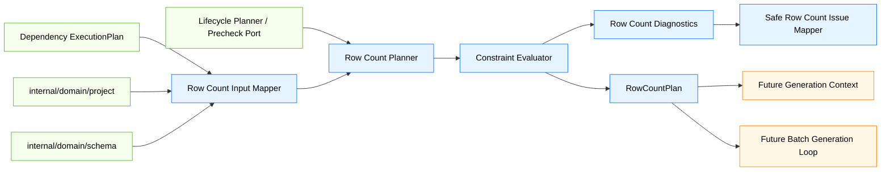
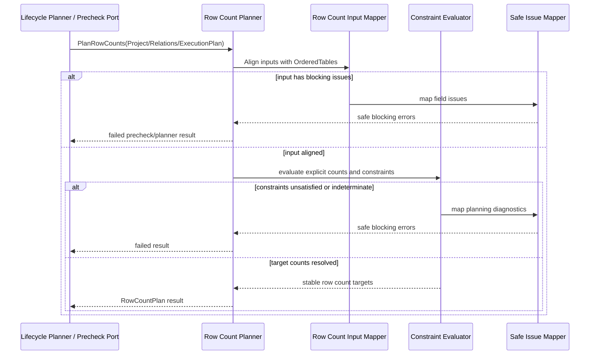
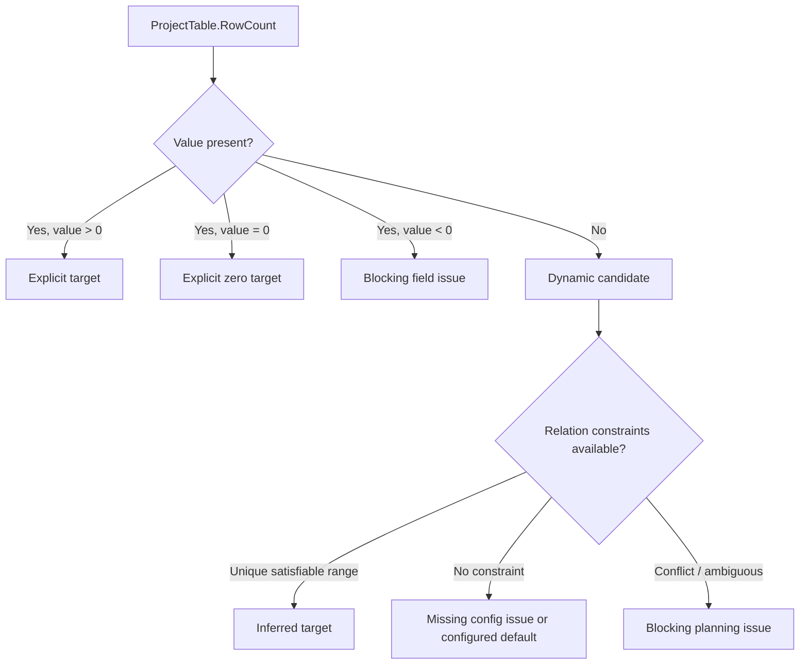
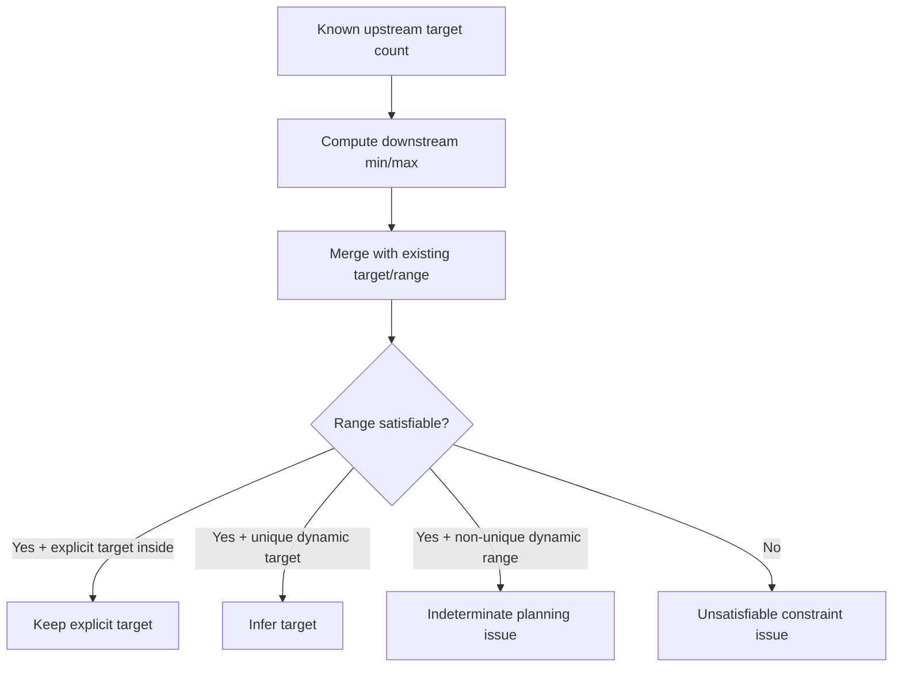
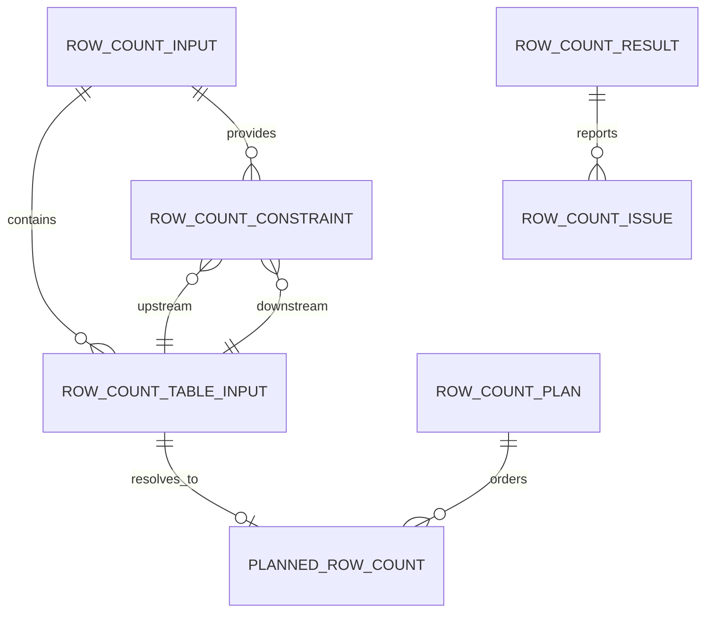

# Design Document

## Overview

`phase-03-row-count-planning` 在 Go 后端 engine 计划层建立表级目标行数规划能力，使 Project 表级行数配置、Schema / Project 关系倍率和上游拓扑计划转化为可被 lifecycle precheck / planner 接缝消费的 `RowCountPlan`。

当前 Phase 2 已定义 ProjectTable 的 nullable 行数语义和关系倍率配置，`phase-03-dependency-graph-and-topological-sort` 已定义稳定拓扑计划，`phase-03-execution-lifecycle` 已定义预检聚合和下游 planner 接缝。本规格新增独立的 engine 行数规划包，负责读取拓扑顺序、解释显式 / 动态 / 默认行数、校验倍率约束、推导确定目标行数，并保持生成上下文、批量生成、写入、API/UI 和数据库类型差异全部在边界之外。

### Goals

- 建立按拓扑顺序对齐的 RowCountPlan 输入和输出模型。
- 正确解释 `ProjectTable.RowCount` 的显式、动态空值和显式零行语义。
- 基于 Parent/Child 和 BaseTable/JoinTable 关系倍率校验或推导目标行数。
- 在生成前暴露缺失配置、非法倍率、零值冲突、不可满足关系和不可规划状态。
- 将行数规划问题表达为 lifecycle-compatible 的安全预检结果。
- 为后续 generation context 和 batch generation loop 提供稳定目标行数输入边界。

### Non-Goals

- 不构建依赖图、依赖边或拓扑排序。
- 不构建字段级生成上下文、键值引用或生成器调用上下文。
- 不实现生成器注册表、批量生成循环或真实生成数据。
- 不实现 writer adapter、事务、清空策略或真实数据库写入。
- 不执行、解析或校验用户 SQL。
- 不实现 API、Facade DTO、Wails runtime events、Vue 页面或行数配置 UI。
- 不实现性能压测级分片计划、批次数量优化、字段唯一性容量估算或复杂统计分布建模。
- 不修改 Phase 2 ProjectTable 行数持久化语义、执行历史状态枚举或 lifecycle 内部状态枚举。

## Boundary Commitments

### This Spec Owns

- `internal/engine/rowcount` 内的行数规划输入、约束、目标、来源、诊断和结果模型。
- 从 ProjectTable、TableRelation、ProjectTableRelation 和 dependency `ExecutionPlan` 构建行数规划输入的规则。
- ProjectTable 行数配置的显式、动态空值、显式零行和安全边界解释。
- Parent/Child 和 BaseTable/JoinTable 倍率约束到目标行数范围的映射。
- 确定性目标行数推导、范围冲突诊断、缺失配置诊断和不可规划错误。
- 与 lifecycle precheck / planner 接缝兼容的安全结果表达。
- 防止依赖排序、生成上下文、批量生成、写入、UI/API 和数据库类型硬编码进入行数规划层的边界测试。

### Out of Boundary

- 依赖图和拓扑排序由 `phase-03-dependency-graph-and-topological-sort` 负责。
- 生成上下文、字段规则快照和键值引用由后续 `phase-03-generation-context` 负责。
- 批量生成主循环和生成器注册表由后续 `phase-03-batch-generation-loop` 及后续生成器规格负责。
- 批量写入适配、事务和真实数据库驱动调用由后续 `phase-03-batch-writer-adapter` 负责。
- 执行结果持久化、API、Facade、Wails binding 和 Vue 页面由后续结果/API/UI 规格负责。
- 数据库类型差异由 schema/relation/capability 快照或 adapter 层预先表达，本规格不按数据库产品名称分支。

### Allowed Dependencies

- 可依赖 `internal/domain/project` 的 `Project`、`ProjectTable`、`ProjectTableRelation` 和 `RelationValueSource`。
- 可依赖 `internal/domain/schema` 的 `TableRelation` 和 `RelationType`。
- 可依赖 `internal/engine/plan` 的 `ExecutionPlan`、`PlannedTable` 和安全计划结果字段方向。
- 可依赖 `internal/engine/lifecycle` 的安全错误、阶段、预检或 planner 接缝类型；若 lifecycle 尚未集成，则通过同构字段保持兼容并在集成时替换。
- 可依赖 Go 标准库集合、排序、数学边界和测试能力。
- 不新增第三方依赖。

### Revalidation Triggers

- ProjectTable 行数配置或 ProjectTableRelation 倍率字段发生破坏性变更。
- TableRelation 关系类型或倍率语义发生破坏性变更。
- dependency `ExecutionPlan` / `PlannedTable` 输出字段发生破坏性变更。
- lifecycle precheck / planner 或安全错误字段发生破坏性变更。
- 后续 generation context 要求 RowCountPlan 新增必填字段。
- 数据库 capability 快照开始影响行数约束判断。
- 行数规划层出现 UI/Wails/DB driver/数据库类型分支依赖。

## Architecture

### Existing Architecture Analysis

- `internal/domain/project` 已提供 ProjectTable 行数配置和 ProjectTableRelation 倍率实例，但不负责执行期目标行数规划。
- `internal/domain/schema` 已提供 TableRelation 关系类型和倍率范围，但不负责 Project 级行数约束求解。
- `internal/engine/plan` 将提供稳定拓扑计划，但明确不计算目标行数或倍率推导。
- `internal/engine/lifecycle` 将提供预检聚合和 planner 接缝，但明确不实现行数规划算法。
- Steering 指定 engine 拥有执行计划和行数规划，业务规则不得放入 Wails binding 或 Vue。

### Architecture Pattern & Boundary Map



**Architecture Integration**:
- Selected pattern: independent engine rowcount package + lifecycle-compatible planner result。行数规划算法与 lifecycle 状态机、dependency 排序算法解耦，但输出可被 lifecycle 预检和后续生成规格直接消费。
- Domain/feature boundaries: domain 提供配置快照，plan 包提供拓扑顺序，rowcount 包计算目标行数，lifecycle 聚合结果并控制执行状态。
- Existing patterns preserved: Go 后端 owns business rules；domain 模型保持纯净；Wails/Vue 不进入行数判断。
- New components rationale: 目标行数规划是 generation context 和 batch loop 前的必要稳定边界。
- Steering compliance: 不跨阶段实现未来能力；不泄露敏感数据；不按数据库类型硬编码。

### Technology Stack

| Layer | Choice / Version | Role in Feature | Notes |
|-------|------------------|-----------------|-------|
| Frontend / CLI | 不涉及 | 无 UI 或 CLI 变更 | 不新增 Vue / Wails 事件 |
| Backend / Engine | Go | 行数规划、约束求解和测试 | 位于 `internal/engine/rowcount` |
| Domain | 既有 Go domain 包 | 提供 Project 和 Schema 关系快照 | 不修改领域持久化语义 |
| Upstream Engine | `internal/engine/plan` | 提供拓扑排序结果 | 不重复排序 |
| Data / Storage | 不新增 | 不创建表、不迁移数据 | 不写回 ProjectTable.RowCount |
| Infrastructure | Go 标准库 | map、slice、sort、math、测试 | 不新增第三方依赖 |

## File Structure Plan

### Directory Structure

```text
internal/
└── engine/
    └── rowcount/
        ├── input.go          # Project/Relation/ExecutionPlan 快照到行数规划输入的最小映射
        ├── model.go          # RowCountPlan、PlannedRowCount、来源和约束模型
        ├── constraint.go     # Parent/Child、BaseTable/JoinTable 倍率约束表达
        ├── evaluator.go      # 显式目标、动态目标、范围收敛和冲突检测
        ├── result.go         # 规划结果、预检结果和 lifecycle 接缝结果
        ├── errors.go         # 安全错误码、阶段、字段路径和敏感信息过滤
        ├── planner.go        # 对 lifecycle planner/precheck 接缝友好的协调入口
        ├── input_test.go     # 拓扑对齐、节点边界和配置解释测试
        ├── evaluator_test.go # 倍率范围、动态推导、显式零和冲突测试
        ├── planner_test.go   # lifecycle precheck/planner 接缝兼容测试
        └── boundary_test.go  # 禁止依赖、禁止未来能力和安全消息边界测试
```

### Modified Files

- 无现有业务文件必须修改；本规格应新增 engine 行数规划子包并通过测试验证边界。
- `go.mod` 不应因为本规格新增第三方依赖而变化；如实现发现必须引入依赖，应返回设计复核。
- Phase 2 domain 包不应修改 `ProjectTable.RowCount` 或关系倍率持久化语义来表达规划内部状态。
- lifecycle 包只有在后续集成需要时通过既有 planner/precheck port 接入，不应改变 lifecycle 状态机。
- dependency plan 包不应为行数规划增加排序内部状态；只需暴露稳定 `ExecutionPlan`。

## System Flows

### Row Count Planning Flow



### Row Count Source Flow



### Constraint Evaluation Flow



## Requirements Traceability

| Requirement | Summary | Components | Interfaces | Flows |
|-------------|---------|------------|------------|-------|
| 1.1 | 拓扑计划表建立行数节点 | Row Count Input Mapper | RowCountInput, RowCountNode | Row Count Planning Flow |
| 1.2 | 保留最小稳定字段 | Row Count Input Mapper | RowCountNode | Row Count Planning Flow |
| 1.3 | 拓扑引用缺失 ProjectTable 诊断 | Input Mapper, Safe Issue Mapper | RowCountIssue | Row Count Planning Flow |
| 1.4 | Project 表与拓扑边界不一致诊断 | Input Mapper | RowCountIssue | Row Count Planning Flow |
| 1.5 | 不重排拓扑或读取 UI/DB | Boundary Tests | Package boundary | Boundary tests |
| 2.1 | 非空非负行数作为显式目标 | Input Mapper, Evaluator | RowCountSource | Row Count Source Flow |
| 2.2 | 显式 0 作为零行目标 | Input Mapper, Evaluator | RowCountSource | Row Count Source Flow |
| 2.3 | 空行数标记为待推导 | Input Mapper | RowCountNode | Row Count Source Flow |
| 2.4 | 负数/溢出字段错误 | Safe Issue Mapper | RowCountIssue | Row Count Source Flow |
| 2.5 | 不写回 ProjectTable | Boundary Tests | Domain boundary | Boundary tests |
| 3.1 | Parent/Child 倍率约束 | Constraint Evaluator | RowCountConstraint | Constraint Evaluation Flow |
| 3.2 | BaseTable/JoinTable 倍率约束 | Constraint Evaluator | RowCountConstraint | Constraint Evaluation Flow |
| 3.3 | Project 关系倍率优先 | Input Mapper, Constraint Builder | Constraint source | Constraint Evaluation Flow |
| 3.4 | 非法倍率诊断 | Safe Issue Mapper | RowCountIssue | Row Count Planning Flow |
| 3.5 | 不按数据库类型硬编码 | Boundary Tests | Dependency checks | Boundary tests |
| 4.1 | 父表已知时推导动态子表 | Constraint Evaluator | PlannedRowCount | Constraint Evaluation Flow |
| 4.2 | 显式子表目标校验 | Constraint Evaluator | RowCountConstraint | Constraint Evaluation Flow |
| 4.3 | 多约束范围合并 | Constraint Evaluator | TargetRange | Constraint Evaluation Flow |
| 4.4 | 不可满足约束阻断 | Safe Issue Mapper | RowCountIssue | Constraint Evaluation Flow |
| 4.5 | 不随机、不生成、不批次 | Boundary Tests | Future boundary | Boundary tests |
| 5.1 | 缺失配置诊断或默认来源 | Evaluator, Diagnostics | RowCountIssue / Source | Row Count Source Flow |
| 5.2 | 零父表与最小下游冲突 | Constraint Evaluator | RowCountIssue | Constraint Evaluation Flow |
| 5.3 | 固定零下游允许 | Constraint Evaluator | PlannedRowCount | Constraint Evaluation Flow |
| 5.4 | 溢出/空范围/不唯一诊断 | Evaluator, Diagnostics | RowCountIssue | Constraint Evaluation Flow |
| 5.5 | 不自动修改配置绕过约束 | Boundary Tests | Package boundary | Boundary tests |
| 6.1 | lifecycle 预检结果 | Row Count Planner | RowCountPrecheckResult | Row Count Planning Flow |
| 6.2 | planner 阶段结果 | Row Count Planner | RowCountResult | Row Count Planning Flow |
| 6.3 | 阻断错误阻止生成 | Lifecycle seam | Precheck-compatible fields | Row Count Planning Flow |
| 6.4 | 后续生成读取目标行数 | RowCountPlan | PlannedRowCount | Row Count Planning Flow |
| 6.5 | 不修改状态/持久化枚举 | Boundary Tests | Domain/lifecycle boundary | Boundary tests |
| 7.1 | 错误只暴露安全字段 | Safe Issue Mapper | RowCountIssue | Row Count Planning Flow |
| 7.2 | 过滤 SQL/连接/密码/生成数据 | Safe Issue Mapper | SafeMessage | Boundary tests |
| 7.3 | lifecycle 兼容摘要 | Safe Issue Mapper | Lifecycle-compatible fields | Row Count Planning Flow |
| 7.4 | 敏感信息测试 | Boundary Tests | Error tests | Boundary tests |
| 7.5 | 不透传原始错误载荷 | Safe Issue Mapper | RowCountIssue | Boundary tests |
| 8.1 | 覆盖输入、配置、推导测试 | Unit Tests | Go tests | Test flows |
| 8.2 | 覆盖诊断测试 | Unit Tests | Go tests | Test flows |
| 8.3 | 覆盖 lifecycle 接缝测试 | Seam Tests | Fake lifecycle port | Test flows |
| 8.4 | 覆盖禁止依赖测试 | Boundary Tests | Import checks | Boundary tests |
| 8.5 | 覆盖未来能力隔离测试 | Boundary Tests | Source scans | Boundary tests |

## Components and Interfaces

| Component | Domain/Layer | Intent | Req Coverage | Key Dependencies | Contracts |
|-----------|--------------|--------|--------------|------------------|-----------|
| Row Count Input Mapper | Engine RowCount | 将 Project / Relation / ExecutionPlan 快照转为行数规划输入 | 1.1-3.3 | project, schema, plan | Service |
| Row Count Constraint Builder | Engine RowCount | 将关系倍率转换为可评估目标范围约束 | 3.1-3.4 | Input Mapper | Service |
| Constraint Evaluator | Engine RowCount | 解释显式目标、动态推导、范围合并和冲突校验 | 2.1-5.4 | Constraint Builder | Service, State |
| Safe Row Count Issue Mapper | Engine RowCount | 输出 lifecycle 兼容安全错误摘要 | 6.1-7.5 | Go standard library | Service |
| Row Count Planner | Engine RowCount | 对 lifecycle planner/precheck 接缝提供协调入口 | 6.1-6.4 | Mapper, Evaluator, Errors | Service |
| Boundary & Seam Tests | Test | 验证依赖边界和未来能力隔离 | 8.1-8.5 | Go test tooling | Test |

### Engine RowCount Layer

#### Row Count Input Mapper

| Field | Detail |
|-------|--------|
| Intent | 接收 Project 表、关系快照和拓扑计划并生成行数规划所需的最小输入 |
| Requirements | 1.1-3.3 |

**Responsibilities & Constraints**
- 校验拓扑计划中的每个 ProjectTable 均存在于 Project 表集合。
- 校验 Project 表集合与拓扑计划边界一致。
- 建立 ProjectTable ID 与 Schema Table ID 的索引。
- 保留拓扑执行顺序、原始行数配置和关系来源摘要。
- 不读取 UI、Wails binding、Vue 页面状态或真实数据库连接。

**Conceptual Contract**

```go
type RowCountInput struct {
    ProjectID int64
    OrderedTables []RowCountTableInput
    TableRelations []schema.TableRelation
    ProjectRelations []project.ProjectTableRelation
}

type RowCountTableInput struct {
    ProjectTableID int64
    TableID int64
    ExecutionOrder int
    RowCount *int64
}
```

#### Row Count Constraint Builder

| Field | Detail |
|-------|--------|
| Intent | 将 Project / Schema 关系倍率转换为目标行数范围约束 |
| Requirements | 3.1-3.4 |

**Responsibilities & Constraints**
- Parent/Child：基于父表目标行数约束子表目标行数。
- BaseTable/JoinTable：基于基础表目标行数约束关联表目标行数。
- ProjectTableRelation 倍率优先于同一执行关系的 Schema 默认倍率。
- 校验倍率非负、`multiplierMin <= multiplierMax` 和合法零值组合。
- 保留安全来源摘要，不公开 SQL。

**Conceptual Contract**

```go
type RowCountConstraint struct {
    SourceType RowCountConstraintSourceType
    SourceID int64
    FromProjectTableID int64
    ToProjectTableID int64
    MultiplierMin int64
    MultiplierMax int64
    RelationType string
}
```

#### Constraint Evaluator

| Field | Detail |
|-------|--------|
| Intent | 计算每张表的最终目标行数或输出不可规划诊断 |
| Requirements | 2.1-5.5 |

**Responsibilities & Constraints**
- 显式非负行数直接作为目标。
- 显式 `0` 保持零行来源。
- 动态空值通过关系约束推导或报告缺失配置。
- 多约束使用确定性范围收敛，冲突时阻断。
- 检查零值、溢出、非唯一动态范围和不可满足关系。
- 不随机选择目标，不计算 batch size，不生成数据。

**Stability Strategy**
- 输出顺序严格沿用 `ExecutionPlan.OrderedTables`。
- 同一节点的约束按 source type、source id、from/to ProjectTableID 稳定排序。
- 问题集合按 blocking、fieldPath、code、safeMessage 稳定排序。

#### Safe Row Count Issue Mapper

| Field | Detail |
|-------|--------|
| Intent | 将输入、配置和约束失败表达为安全摘要 |
| Requirements | 6.1-7.5 |

**Public Fields**

```go
type RowCountIssue struct {
    Code RowCountErrorCode
    Stage RowCountStage
    FieldPath string
    SafeMessage string
    Blocking bool
}
```

- Public fields limited to code, stage, field path, safe message and blocking flag for precheck aggregation.
- 原始 SQL、连接详情、密码、生成数据内容不得进入 `SafeMessage`。
- 与 lifecycle `LifecycleError` 和 dependency plan `PlanIssue` 字段方向保持一致。

#### Row Count Planner

| Field | Detail |
|-------|--------|
| Intent | 提供面向 lifecycle precheck / planner 的单一入口 |
| Requirements | 6.1-6.4 |

**Responsibilities & Constraints**
- 调用 input mapper、constraint builder、evaluator 和 safe issue mapper。
- 将阻断问题汇总为失败预检或失败 planner result。
- 成功时返回稳定 `RowCountPlan`。
- 不改变 lifecycle 状态机或持久化历史状态。

**Conceptual Contract**

```go
type RowCountPlan struct {
    ProjectID int64
    Tables []PlannedRowCount
    Warnings []RowCountIssue
}

type PlannedRowCount struct {
    ProjectTableID int64
    TableID int64
    ExecutionOrder int
    TargetRows int64
    Source RowCountSource
}

type RowCountResult struct {
    Passed bool
    Plan *RowCountPlan
    BlockingErrors []RowCountIssue
    Warnings []RowCountIssue
}
```

## Data Models

### Domain Model

- `RowCountInput`: Project、Schema 关系和拓扑计划的 engine 行数规划输入。
- `RowCountTableInput`: 单个 ProjectTable 的行数规划节点。
- `RowCountConstraint`: 从关系倍率转换而来的目标范围约束。
- `TargetRange`: 单节点合并后的可满足目标行数范围。
- `PlannedRowCount`: 单个 ProjectTable 的目标行数和来源摘要。
- `RowCountPlan`: 按拓扑顺序排列的目标行数计划。
- `RowCountIssue`: lifecycle 兼容安全预检问题。

### Logical Data Model



**Consistency & Integrity**
- 每个 `PlannedRowCount` 对应一个拓扑计划中的 ProjectTable。
- 排序成功时所有拓扑节点都出现在 `RowCountPlan.Tables` 中且顺序一致。
- `TargetRows` 必须非负且不超过安全整数边界。
- 显式 `0` 与动态空值来源必须可区分。
- 所有约束来源的 from/to 节点必须位于当前拓扑计划中，外部来源只可形成安全摘要或警告。
- 规划失败时不得输出部分可执行 `RowCountPlan` 作为成功结果。

### Physical Data Model

- 不新增数据库表、迁移、索引或本地存储结构。
- 不写回 `ProjectTable.RowCount`、`ExecutionOrder` 或关系倍率配置。
- 输出的 `RowCountPlan` 仅供 lifecycle、generation context 和 batch generation loop 消费。

## Error Handling

### Error Strategy

- 输入对齐错误：返回字段级阻断 `RowCountIssue`。
- 行数配置错误：负数、溢出和非法类型边界返回字段级阻断错误。
- 倍率配置错误：非法倍率范围或零值组合返回阻断错误。
- 缺失配置：无法推导且无明确默认策略时返回阻断错误；若后续配置提供默认策略则输出明确默认来源。
- 约束冲突：多个范围收敛为空或显式目标不在范围内时返回阻断错误。
- 不可规划：溢出、非唯一动态范围或无法确定目标行数时返回统一阻断错误。
- 敏感内容：公开消息使用固定安全文本，不透出 SQL、连接、密码或生成数据。

### Error Categories and Responses

| Category | Trigger | Response | Plan Impact |
|----------|---------|----------|-------------|
| Input Alignment | 拓扑表缺失、Project 表不在拓扑中 | 字段级阻断错误 | 不生成可执行计划 |
| Table Config | 负数行数、溢出、缺失不可推导 | 阻断错误或明确默认来源 | 取决于是否有安全默认策略 |
| Multiplier Config | 负倍率、min > max、非法零值 | 阻断错误 | 不生成可执行计划 |
| Constraint Conflict | 显式目标不满足范围或多个范围冲突 | 阻断错误 | 不生成可执行计划 |
| Zero Boundary | 零父表与最小下游要求冲突 | 阻断错误 | 不生成可执行计划 |
| Indeterminate | 动态范围非唯一或无法确定目标 | 统一不可规划错误 | 不生成可执行计划 |
| Sensitive Source | SQL/连接/密码/数据出现在来源错误 | 替换为安全消息 | 按原错误类别处理 |

### Monitoring

本规格不实现运行时日志、追踪或 UI 事件。测试应验证诊断结果稳定且安全；后续可观测性规格可增加内部诊断，但不得改变公开安全边界。

## Testing Strategy

### Unit Tests

- 输入对齐测试：有效拓扑计划生成行数节点；拓扑表缺失和 Project 表超出拓扑返回字段级阻断问题。
- 行数配置测试：显式正数、显式零、动态空值、负数和溢出边界。
- Parent/Child 约束测试：父表目标约束子表目标；显式子表目标必须落入倍率范围。
- BaseTable/JoinTable 约束测试：基础表目标约束关联表目标；固定零下游合法场景覆盖。
- Project 关系优先级测试：ProjectTableRelation 倍率覆盖 Schema TableRelation 默认倍率。
- 动态推导测试：单关系唯一结果、多关系范围合并、范围为空和非唯一范围。
- 零值测试：零父表与最小下游冲突、正父表与固定零下游允许、显式零与动态空值区分。
- 安全错误测试：公开消息不包含 SQL、连接字符串、密码、生成数据示例或原始错误载荷。

### Integration / Seam Tests

- 使用 fake lifecycle precheck 调用 Row Count Planner，验证成功计划可作为 planner result 返回。
- 使用非法倍率、缺失配置和不可满足关系输入，验证 blocking errors 可被 lifecycle precheck 聚合并阻止生成。
- 验证 warnings 不阻止计划成功，但保留在 `RowCountResult` 中。
- 验证后续 generation context 可读取 `RowCountPlan.Tables` 而无需约束求解内部状态。

### Boundary Tests

- 检查 `internal/engine/rowcount` 不导入 Wails、Vue、frontend API、真实数据库 driver、store 或 facade 包。
- 检查行数规划源码不包含按数据库产品名称分支的业务规则。
- 检查本规格未实现 dependency graph、topological sort、generation context、generator registry、batch loop、writer adapter、transaction 或 real write 行为。
- 检查 Phase 2 domain 枚举、ProjectTable 持久化字段和 lifecycle 状态枚举未因本规格新增行数规划内部状态。
- 检查测试数据中的敏感 SQL/密码/连接详情不会出现在公开 `RowCountIssue` 消息中。

## Security Considerations

- 所有公开行数规划错误只允许包含错误码、阶段、字段路径、安全消息和是否阻断。
- SQL 文本只可作为是否存在外部来源的内部事实，不进入公开错误消息。
- 不保存或输出数据库密码、连接字符串、用户 SQL 或生成数据内容。
- 不把原始下游错误载荷透传给 lifecycle、API、UI、Wails binding 或历史模型。

## Performance & Scalability

- 行数规划应为内存内线性或近线性处理，适配普通 Project 表数量。
- 约束合并使用 map 和稳定排序，保持确定性输出。
- 对乘法计算进行安全整数边界检查，避免溢出。
- 本规格不处理批量生成吞吐、分片计划、事务大小或数据库写入性能。

## Migration Strategy

- 不需要数据库迁移、配置迁移或前端迁移。
- 新增 `internal/engine/rowcount` 包不会改变 Phase 2 JSON 合同。
- 后续规格可通过 `RowCountPlan` 消费目标行数，而不是复制倍率推导算法。

## Supporting References

- `.kiro/specs/phase-03-row-count-planning/brief.md`
- `.kiro/specs/phase-03-row-count-planning/research.md`
- `.kiro/specs/phase-03-execution-lifecycle/requirements.md`
- `.kiro/specs/phase-03-execution-lifecycle/design.md`
- `.kiro/specs/phase-03-dependency-graph-and-topological-sort/requirements.md`
- `.kiro/specs/phase-03-dependency-graph-and-topological-sort/design.md`
- `.kiro/specs/phase-02-project-model/design.md`
- `.kiro/specs/phase-02-relation-model/design.md`
- `.kiro/steering/roadmap.md`
- `.kiro/steering/product.md`
- `.kiro/steering/tech.md`
- `.kiro/steering/structure.md`
