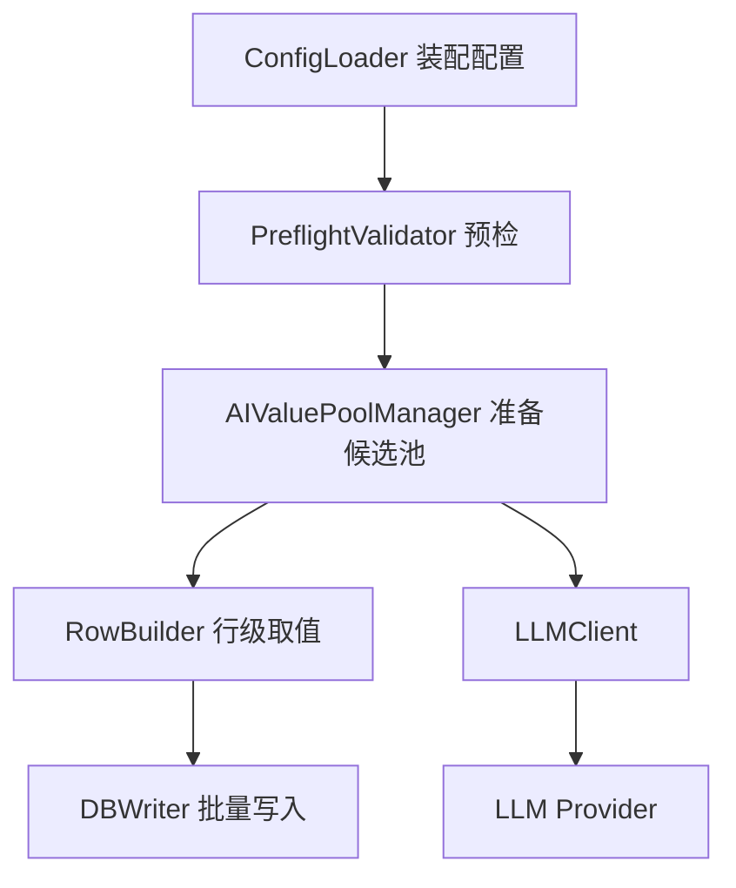

# 专题 8：AI 生成器设计

> 本文档针对 `ai_generator` 的设计与实现进行规划。  
> 依赖文档：产品大纲、系统设置、生成器设计、生成器校验、数据生成执行引擎设计。  
> 关联范围：LLM 配置、提示词构造、批量生成、缓存复用、类型转换、成本与限流、隐私与安全。

---

## 1. 文档范围与目标

`ai_generator` 用于通过大语言模型生成字段值，主要适合自然语言或半结构化文本场景，例如：

- 商品名称、商品描述、电影标题、文章标题；
- 评论、备注、简介、工单内容；
- 需要符合业务语境的短文本；
- 少量可由 LLM 补全的数值、日期、布尔值或枚举式文本。

本文重点解决以下问题：

1. LLM 配置如何读取、校验和安全存储。
2. AI 数据何时生成，如何避免每行都调用 LLM。
3. `llm_generated` 如何工作，生成值如何缓存和复用。
4. 提示词如何构造，如何约束输出格式。
5. AI 返回结果如何解析、去重、类型转换和回填。
6. 如何处理成本、限流、超时、失败、隐私和可观测性。

本文不覆盖 AI 自动推断字段规则、AI 生成整表关系数据、基于上下文的多列联合生成。这些能力复杂度更高，可作为后续专题单独设计。

---

## 2. 设计原则

### 2.1 AI 生成值应先批量准备，再行级取值

行级生成过程中不建议每行调用一次 LLM。`ai_generator` 应在表执行前或字段首次使用前批量生成候选值，之后行级生成只从候选池取值。

这样可以：

- 降低请求次数和成本；
- 避免网络延迟拖慢每行构建；
- 便于统一解析、校验、去重和类型转换；
- 让失败尽早发生，避免表写入到一半才因 LLM 失败中断。

### 2.2 默认以“候选池复用”为主

`llm_generated` 表示本次执行为该字段预先生成多少个候选值。目标行数超过候选值数量时，从候选池中复用。

- `llm_generated > 0`：推荐模式。先请求生成 N 个候选值，再按取值策略复用。
- `llm_generated = 0` 或 `null`：逐行请求模式。仅适合小数据量预览或非常低行数任务，大批量执行时应警告或禁止。

### 2.3 AI 输出必须被当作不可信输入

LLM 返回内容不可直接写入数据库，必须经过：

1. 结构解析；
2. 空值和无效值过滤；
3. 目标列类型转换；
4. 长度、精度、范围等字段约束校验；
5. 敏感内容和异常内容的基础检查。

### 2.4 成本和隐私需要显式可见

AI 调用可能产生费用，并可能把用户输入的字段名、提示词、样例值发送到第三方服务。系统应在配置、预检和执行历史中提示：

- 将调用哪个 LLM 服务；
- 预计请求次数；
- 预计生成候选值数量；
- 是否可能发送表名、列名、用户自定义 prompt 等信息；
- 本次执行的 token 使用量和失败情况。

---

## 3. 配置结构设计

### 3.1 当前配置

现有生成器文档定义：

```json
{
  "prompt": "生成一个关于科幻电影的标题",
  "llm_generated": 100,
  "null_percentage": 0.05
}
```

### 3.2 建议扩展配置

为支持稳定实现，建议在保持兼容的基础上扩展如下字段：

```json
{
  "prompt": "生成一个关于科幻电影的标题",
  "llm_generated": 100,
  "null_percentage": 0.05,
  "output": {
    "language": "zh-CN",
    "max_length": 80,
    "format": "plain_text"
  },
  "pick_mode": "random",
  "deduplicate": true,
  "reuse_when_exhausted": true,
  "fallback": {
    "enabled": false,
    "value": null
  }
}
```

| 配置项 | 类型 | 默认值 | 说明 |
|---|---|---|---|
| `prompt` | string | 自动构造 | 用户提示词。为空时根据表名、列名、数据类型自动生成。 |
| `llm_generated` | integer | `0` | 预生成候选值数量。`0/null` 表示逐行请求，不建议大批量使用。 |
| `null_percentage` | number | `0` | 生成 NULL 的概率，受列非空约束限制。 |
| `output.language` | string | 跟随系统语言 | 输出语言，例如 `zh-CN`、`en-US`。 |
| `output.max_length` | integer | 根据列长度推断 | 文本最大长度。若目标列是 varchar，应不超过列长度。 |
| `output.format` | string | `plain_text` | `plain_text`、`json_array`。v1 内部统一要求 LLM 返回 JSON 数组。 |
| `pick_mode` | string | `random` | 候选池取值方式：`random`、`round_robin`、`shuffle_once`。 |
| `deduplicate` | boolean | `true` | 是否对 AI 返回候选值去重。 |
| `reuse_when_exhausted` | boolean | `true` | 候选池耗尽后是否复用。`ai_generator` 不承诺唯一性，默认允许复用。 |
| `fallback.enabled` | boolean | `false` | LLM 失败时是否使用固定兜底值。v1 建议默认关闭。 |
| `fallback.value` | any | `null` | 兜底值，必须与目标列类型兼容。 |

> 注意：`ai_generator` 不支持基础配置中的 `seed`、`type_format`、`stringify` 和 `unique`。LLM 输出不可稳定复现，因此不要向用户承诺基于 seed 的可重复结果。

---

## 4. LLM 配置与凭据管理

### 4.1 配置来源

生成器文档当前要求通过环境变量配置：

- `LOOMIDBX_BASE_URL`
- `LOOMIDBX_API_KEY`
- `LOOMIDBX_MODEL`

结合系统设置文档，推荐实际实现采用以下优先级：

1. **系统设置中的 LLM 配置**：用户在 UI 中配置服务商、模型、Base URL、API Key，API Key 加密存储。
2. **环境变量兜底**：适合开发、测试、CI 或高级用户。
3. **未配置**：预检失败，并提示用户去系统设置配置 LLM。

### 4.2 LLM 配置结构

建议抽象为统一运行时配置：

```text
LLMRuntimeConfig {
  provider: string
  base_url: string
  api_key_ref: string | null
  api_key_from_env: string | null
  model: string
  request_timeout_seconds: int
  max_retries: int
  max_concurrency: int
  default_temperature: float
}
```

v1 推荐支持 OpenAI-compatible Chat Completions API。其他服务商（Anthropic、阿里云百炼、DeepSeek 等）可以通过适配器映射到统一接口。

### 4.3 凭据安全

API Key 不应保存在 `GeneratorConfig.params` 中。应由系统设置统一加密保存，运行时通过 `SecretProvider` 解密读取。

日志和执行历史中：

- 不记录完整 API Key；
- 不记录完整 Authorization header；
- 不记录完整 LLM 响应原文，除非用户显式开启调试；
- 可记录 provider、model、base_url host、token 用量和请求状态。

---

## 5. 执行生命周期

`ai_generator` 与执行引擎的集成分为四个阶段。



### 5.1 配置保存阶段

保存字段规则时只做静态校验：

- `prompt` 长度不超过 4096 字符；
- `llm_generated` 为非负整数；
- `null_percentage` 在 `[0,1]`；
- 若目标列非空，`null_percentage` 必须为 0 或保存时警告、执行时强制为 0；
- 若目标列长度有限，`output.max_length` 不得超过列长度；
- 若配置了兜底值，兜底值必须与目标列类型兼容。

配置保存阶段不强制调用 LLM，避免用户每次编辑 prompt 都产生费用。可以提供“测试生成”按钮，由用户主动触发少量样例生成。

### 5.2 预检阶段

执行任务前，`PreflightValidator` 处理：

1. 检查 LLM 配置是否存在。
2. 检查 Base URL、model、API Key 是否完整。
3. 可选发起一次轻量连通性测试。
4. 估算本任务中 `ai_generator` 的请求数量、候选值数量和风险。
5. 对 `llm_generated = 0` 且目标行数较大的配置给出阻塞或强警告。

建议规则：

| 场景 | 处理 |
|---|---|
| 未配置 LLM | 阻塞执行。 |
| LLM 连通性失败 | 阻塞执行。 |
| `llm_generated = 0` 且预计行数 > 100 | 阻塞或要求用户确认；v1 推荐阻塞。 |
| `llm_generated > 0` 且小于目标行数 | 允许，候选值将复用，并在预检中提示。 |
| 目标列为非文本类型 | 允许，但提示会做类型转换，失败会导致执行错误。 |

### 5.3 表执行前候选池准备

在某张表开始生成前，`TableExecutor` 收集本表所有 `ai_generator` 字段，调用 `AIValuePoolManager.prepare()`。

```text
prepare_ai_pool(generator_config, target_column, row_count):
  effective_null_percentage = resolve_null_percentage(target_column, config)
  required_count = resolve_required_ai_count(config.llm_generated, row_count)
  if required_count > 0:
    values = LLMGenerationService.generate_values(required_count)
    values = parse_and_validate(values, target_column)
    values = deduplicate_if_needed(values)
    put task cache
  else:
    mark as per_row_mode
```

### 5.4 行级生成阶段

行级生成时不直接调用 LLM，除非该字段明确处于逐行请求模式。

候选池模式：

```text
if should_return_null(null_percentage):
  return NULL
return AIValuePool.pick(pick_mode)
```

逐行请求模式：

```text
if should_return_null(null_percentage):
  return NULL
value = LLMGenerationService.generate_one(row_context)
return parse_and_convert(value)
```

v1 推荐限制逐行请求模式只用于预览或小行数任务。

---

## 6. 候选池与缓存设计

### 6.1 候选池定义

```text
AIValuePool {
  key: string
  values: Value[]
  cursor: int
  pick_mode: string
  generated_count: int
  valid_count: int
  duplicate_count: int
  prompt_hash: string
  model: string
  created_at: datetime
}
```

候选池只在单次 `ExecutionTask` 内有效。默认不做跨任务持久化缓存。

### 6.2 为什么默认不跨任务缓存

AI 输出可能受以下因素影响：

- 模型版本变化；
- temperature/top_p 等参数变化；
- prompt 改动；
- 服务商更新；
- 用户数据隐私和授权边界。

因此 v1 只做任务级缓存：同一任务内相同配置只生成一次，任务结束即释放。

若未来要支持跨任务复用，应设计独立的“AI 候选库”能力，让用户明确保存、查看、删除和复用，而不是隐式缓存。

### 6.3 缓存 key

任务级缓存 key：

```text
ai_generator:<column_id>:hash(prompt_resolved):<model>:<llm_generated>:<target_data_type>:<output_constraints>
```

如果两个字段使用相同 prompt，也不建议默认共用候选池，因为不同列的长度、类型、业务含义可能不同。只有用户明确选择“共享候选池”时才可复用。

### 6.4 取值策略

| `pick_mode` | 行为 | 适用场景 |
|---|---|---|
| `random` | 从候选池随机取值，可重复 | 默认，适合自然语言内容。 |
| `round_robin` | 按顺序轮询候选池 | 希望分布更均匀。 |
| `shuffle_once` | 先打乱再顺序取，耗尽后重洗或复用 | 希望前 N 行尽量不重复。 |

`ai_generator` 不声明支持数据库唯一约束。若目标列有 UNIQUE 约束，应提示用户改用可控生成器，或显式增大 `llm_generated` 并承担失败风险。v1 不建议让 AI 生成器用于强唯一字段。

---

## 7. Prompt 设计

### 7.1 自动 Prompt 构造

当用户未填写 `prompt` 时，系统根据字段上下文构造提示词。

输入上下文：

- 表名；
- 字段名；
- 字段数据类型；
- 字段长度/精度；
- 是否可空；
- 用户界面语言；
- 可选：字段注释。

示例：

```text
请生成 50 个适合数据库字段的模拟值。
表名：products
字段名：name
字段注释：商品名称
目标类型：text
最大长度：80
要求：真实、简洁、不要编号、不要解释、不要重复。
请只返回 JSON 数组，例如：["值1", "值2"]。
```

### 7.2 用户 Prompt 包装

用户 prompt 不应直接原样发送，而应被系统包装为结构化指令，保证返回格式可解析。

```text
你是一个数据库模拟数据生成器。
任务：根据用户要求生成 {count} 个候选值。
用户要求：{user_prompt}
目标字段：{table_name}.{column_name}
目标类型：{data_type}
最大长度：{max_length}
输出要求：
- 只返回 JSON 数组。
- 数组元素必须是原始值，不要对象，不要解释。
- 不要使用 Markdown。
- 尽量避免重复。
```

### 7.3 输出格式约束

v1 统一要求 LLM 返回 JSON 数组：

```json
["星际边境", "量子迷航", "火星晨曦"]
```

不接受 Markdown 列表、编号列表或自然语言段落作为最终格式。若模型返回非 JSON 内容，解析器可做一次宽松修复：

- 去除 Markdown 代码块包裹；
- 截取第一个 `[` 到最后一个 `]`；
- 如果仍不可解析，重试一次，并强化“只返回 JSON 数组”的指令。

### 7.4 防 Prompt 注入

虽然用户 prompt 本身是用户输入，但系统仍应避免将敏感内部信息放进 prompt，例如：

- 数据库连接密码；
- API Key；
- 完整 DDL 或大量真实数据样本；
- 系统内部路径。

如果未来支持基于真实样本生成风格，应默认只传递脱敏样本，并提示用户数据会发送给 LLM 服务。

---

## 8. LLM 调用设计

### 8.1 请求接口

v1 使用 OpenAI-compatible Chat Completions：

```http
POST /chat/completions
Authorization: Bearer <api_key>
Content-Type: application/json
```

请求体示意：

```json
{
  "model": "gpt-4o-mini",
  "messages": [
    { "role": "system", "content": "你是数据库模拟数据生成器，只输出 JSON。" },
    { "role": "user", "content": "请生成 100 个..." }
  ],
  "temperature": 0.8,
  "response_format": { "type": "json_object" }
}
```

如果目标服务不支持 `response_format`，则只通过 prompt 约束输出。

### 8.2 分批请求

一次请求生成太多候选值容易超出上下文或输出 token 限制。建议按批拆分：

| 候选值类型 | 单次请求建议数量 |
|---|---:|
| 短文本，如名称/标题 | 50～100 |
| 中等文本，如一句评论 | 20～50 |
| 长文本，如描述/备注 | 5～20 |
| 非文本类型 | 20～100 |

```text
total_needed = llm_generated
while collected_valid_values < total_needed:
  batch_count = min(max_values_per_request, remaining)
  response = call_llm(batch_count)
  values += parse_valid_values(response)
  if retry_or_attempt_limit_reached:
    break
```

若最终有效值少于 `llm_generated`：

- 只要有效值数量 > 0，允许继续执行并记录 Warning；
- 若有效值为 0，阻塞当前表执行；
- 若目标行数远大于有效值数量，预检或执行日志应提示复用率较高。

### 8.3 并发与限流

LLM 调用应由统一 `LLMRequestScheduler` 管理：

```text
LLMRequestScheduler {
  max_concurrency
  requests_per_minute
  tokens_per_minute
  retry_policy
}
```

默认建议：

| 参数 | 默认值 |
|---|---:|
| 最大并发请求数 | 2 |
| 单请求超时 | 60 秒 |
| 最大重试次数 | 2 |
| 429 退避 | 指数退避，尊重 `Retry-After` |
| 5xx 重试 | 最多 2 次 |

多个 AI 字段同时存在时，调度器统一排队，避免瞬间打满服务商限流。

---

## 9. 结果解析与类型转换

### 9.1 解析流程

```text
parse_ai_response(response):
  content = extract_message_content(response)
  content = strip_markdown_fence(content)
  json = parse_json_array_or_object(content)
  values = normalize_to_array(json)
  values = flatten_if_needed(values)
  values = remove_empty_values(values)
  return values
```

如果模型返回对象：

```json
{ "values": ["A", "B"] }
```

解析器可识别 `values`、`items`、`data` 等常见数组字段。若无法识别，视为解析失败。

### 9.2 类型转换规则

AI 返回通常是文本，写入前必须转换为目标列类型。

| 目标类型 | 转换规则 |
|---|---|
| text | 转为字符串，去除首尾空白，按列长度截断或报错。推荐报错，避免静默破坏内容。 |
| integer | 只接受整数或整数格式字符串，例如 `"42"`。 |
| float | 接受数字或可解析数字字符串。 |
| boolean | 接受 `true/false`、`是/否`、`yes/no`、`1/0`。 |
| datetime | 接受 ISO 8601 或常见日期时间格式；推荐 prompt 中要求固定格式。 |

对非文本列，系统 prompt 应明确要求输出可解析格式，例如：

- datetime：`YYYY-MM-DD HH:mm:ss`
- boolean：`true` / `false`
- integer：不带单位的整数
- float：不带货币符号的数字

### 9.3 长度与约束处理

文本列需根据数据库字段长度处理：

| 场景 | 处理 |
|---|---|
| `varchar(80)`，返回 100 字符 | 默认报错并丢弃该候选值；不建议自动截断。 |
| `text` 类型 | 不限制或使用系统级最大长度。 |
| 候选值为空字符串 | 默认丢弃；NULL 由 `null_percentage` 控制。 |
| 候选值重复 | `deduplicate = true` 时去重。 |

---

## 10. 空值、复用与唯一性

### 10.1 空值规则

| 场景 | 处理 |
|---|---|
| 目标列 `is_nullable = false` | `null_percentage` 强制为 0。 |
| 目标列 `is_nullable = true` | 按 `null_percentage` 决定是否返回 NULL。 |
| LLM 返回空字符串/null | 不作为候选值；由空值概率统一控制。 |

### 10.2 候选值复用

当目标行数大于候选池数量时，默认复用候选值。

示例：

```text
目标行数 = 10000
llm_generated = 100
有效候选值 = 92
最终行为：每行从 92 个候选值中随机/轮询取值。
```

预检中应展示复用率风险：

```text
该字段预计生成 10000 行，AI 候选值约 100 个，内容会被重复使用。
```

### 10.3 唯一性

`ai_generator` 不支持强唯一性。原因：

- LLM 无法保证严格不重复；
- 去重后数量不可预测；
- 大批量唯一值成本高且失败概率高；
- 数据库 UNIQUE 约束失败会导致批次写入失败。

如果目标列有 UNIQUE 约束，推荐处理：

1. 配置阶段警告：AI 生成器不适合唯一列。
2. 执行预检阶段阻塞，除非用户显式确认风险。
3. 更推荐用户使用 `uuid`、`sequential_int`、`snowflake`、`regex_string`、`enums + 后缀` 等可控生成器。

---

## 11. 隐私、安全与合规

### 11.1 数据发送范围

默认发送给 LLM 的信息仅包括：

- 用户 prompt；
- 表名、字段名、字段注释；
- 目标数据类型、长度等元数据；
- 需要生成的候选值数量；
- 输出格式要求。

默认不发送：

- 数据库连接信息；
- 真实表数据；
- 密码、密钥、token；
- 本地文件路径；
- 生成任务历史内容。

### 11.2 本地模型支持

系统设置应支持 OpenAI-compatible 的本地模型服务，例如 Ollama、LM Studio、私有化部署网关。对于敏感数据场景，用户可选择本地模型，避免 prompt 发送到公网服务。

### 11.3 日志脱敏

执行日志可以记录：

- provider；
- model；
- 请求次数；
- token 用量；
- 耗时；
- 失败状态码；
- prompt hash。

默认不记录完整 prompt 和完整响应。若用户开启调试日志，应明确提示可能包含业务信息。

---

## 12. 成本与可观测性

### 12.1 预估信息

预检报告应展示：

| 信息 | 说明 |
|---|---|
| AI 字段数量 | 本任务使用 `ai_generator` 的字段数。 |
| 预计请求次数 | 根据 `llm_generated` 和分批大小估算。 |
| 预计候选值数量 | 各字段 `llm_generated` 合计。 |
| 逐行请求字段 | 标记 `llm_generated = 0` 的字段。 |
| 复用提示 | 目标行数大于候选池数量时提示。 |
| 服务商与模型 | 显示 provider/model，隐藏 API Key。 |

### 12.2 执行历史

建议在 `ExecutionTask` 或结构化日志中记录 AI 调用摘要：

```json
{
  "external_calls": {
    "llm": {
      "request_count": 4,
      "success_count": 4,
      "failure_count": 0,
      "prompt_tokens": 1200,
      "completion_tokens": 3400,
      "model": "gpt-4o-mini",
      "duration_ms": 8320
    }
  }
}
```

不要记录完整响应内容，避免生成数据和 prompt 泄露。

---

## 13. 异常处理

| 异常 | 阶段 | 处理 |
|---|---|---|
| LLM 未配置 | 预检 | 阻塞任务，提示配置 LLM。 |
| API Key 无效 | 预检/生成 | 阻塞任务，错误信息脱敏。 |
| 网络超时 | 预检/生成 | 按重试策略重试；仍失败则阻塞当前表。 |
| HTTP 429 | 生成 | 按 `Retry-After` 或指数退避重试；仍失败则阻塞当前表。 |
| HTTP 5xx | 生成 | 重试，仍失败则阻塞当前表。 |
| 响应不可解析 | 生成 | 强化格式提示后重试一次；仍失败则阻塞或使用 fallback。 |
| 有效候选值为 0 | 表执行前 | 阻塞当前表。 |
| 部分候选值无效 | 表执行前 | 丢弃无效值，记录 Warning。 |
| 类型转换失败 | 表执行前/逐行 | 丢弃候选值；若最终无可用值则失败。 |
| 逐行请求中途失败 | 执行中 | 当前表失败，按执行引擎失败策略处理。 |

如果 `fallback.enabled = true`：

- 仅在 LLM 完全不可用或候选池为空时使用；
- 必须记录 Warning；
- fallback 值必须满足目标列类型和约束；
- 非空列 fallback 不得为 NULL。

---

## 14. 校验规则补充建议

现有校验规则已有：

- `prompt` 长度 ≤ 4096；
- `llm_generated` 为非负整数；
- LLM 连接参数已配置；
- LLM API 连通性正常。

建议补充：

| 规则 | 阶段 | 处理 |
|---|---|---|
| `null_percentage` 在 `[0,1]` | 保存 | 不合法则拒绝保存。 |
| 非空列 `null_percentage > 0` | 保存/执行 | 保存警告，执行强制为 0。 |
| `llm_generated = 0` 且预计行数 > 100 | 预检 | 阻塞或要求确认；v1 推荐阻塞。 |
| 文本列 `output.max_length` 超过列长度 | 保存 | 拒绝保存或自动收敛到列长度。 |
| UNIQUE 列使用 `ai_generator` | 保存/预检 | 强警告；v1 推荐预检阻塞。 |
| LLM 返回候选值全部无效 | 表执行前 | 阻塞当前表。 |
| 非文本列未指定明确格式 | 保存 | 提示建议，例如 datetime 固定格式。 |

---

## 15. 推荐 v1 落地范围

### 15.1 v1 必做

- 读取系统设置 LLM 配置，环境变量作为兜底。
- 支持 OpenAI-compatible Chat Completions。
- 支持 `prompt`、`llm_generated`、`null_percentage`。
- 支持自动 prompt 构造。
- 支持候选池模式：`llm_generated > 0` 时表执行前批量生成。
- 支持 JSON 数组输出解析、去重、类型转换、长度校验。
- 支持请求超时、重试、429/5xx 处理。
- 支持任务级 AI 候选池缓存。
- 预检展示请求数量、候选值数量、逐行请求风险和复用提示。
- 执行历史记录 LLM 调用摘要，敏感信息脱敏。

### 15.2 v1 限制

- 不支持强唯一性。
- 不支持 seed 复现。
- 不支持跨任务持久化 AI 候选缓存。
- 不支持多列联合生成。
- 不支持把真实表数据样本发送给 LLM。
- 不默认允许大批量逐行请求。

### 15.3 后续扩展

- AI 候选库：用户可保存、审核、复用 AI 生成结果。
- 多列联合生成：一次生成多个字段，保证字段间语义一致。
- Provider 适配器：支持 Anthropic、阿里云百炼、DeepSeek 等非 OpenAI 协议。
- 本地模型优化：针对 Ollama/LM Studio 的模型列表拉取、上下文限制提示。
- 内容安全策略：敏感词、PII、违规内容过滤。
- 成本估算：根据模型价格和 token 估算费用。

---

## 16. 关键设计决策

### D-01：默认批量生成候选池

批量生成候选池比逐行请求更适合数据库模拟数据场景。它能显著降低成本和延迟，也便于统一校验和复用。

### D-02：任务级缓存，不做隐式持久化缓存

AI 输出可能包含业务语义，也可能受模型版本和 prompt 影响。默认只在单次任务中缓存，避免跨任务复用带来隐私和一致性问题。

### D-03：统一要求 JSON 数组输出

自然语言输出难以稳定解析。通过系统 prompt 强制 JSON 数组，并配合一次格式修复重试，可以降低解析失败率。

### D-04：不承诺唯一性和可复现性

LLM 无法可靠保证唯一和可复现。需要唯一值时应使用确定性生成器；需要可复现时应使用 seed 支持的生成器。

### D-05：系统设置优先，环境变量兜底

产品层面已有 LLM 设置入口，因此运行时应优先使用系统设置；环境变量适合作为开发、测试和高级用户兜底方案。

---

## 17. 示例流程

### 17.1 商品名称字段

配置：

```json
{
  "prompt": "生成适合电商平台的中文商品名称，品类不限，真实自然",
  "llm_generated": 100,
  "null_percentage": 0
}
```

执行：

1. 预检确认 LLM 已配置并可连接。
2. 表执行前请求 LLM 生成 100 个商品名称。
3. 解析 JSON 数组，去重并校验长度。
4. 目标表生成 10,000 行时，从候选池随机复用。
5. 执行历史记录 LLM 请求次数、token 用量和候选值数量。

### 17.2 日期字段

自动 prompt：

```text
请生成 50 个日期时间值，格式必须为 YYYY-MM-DD HH:mm:ss，时间范围接近真实业务数据，不要解释，只返回 JSON 数组。
```

执行：

1. LLM 返回字符串数组。
2. 解析并按 datetime 类型转换。
3. 无法解析的值丢弃。
4. 若最终没有有效日期，当前表执行失败。

### 17.3 大批量逐行请求拦截

配置：

```json
{
  "prompt": "为每条订单生成一段独特备注",
  "llm_generated": 0,
  "null_percentage": 0.1
}
```

若目标行数为 50,000，预检应阻塞：

```text
该字段配置为逐行调用 LLM，预计需要约 45,000 次请求，成本和耗时不可控。请设置 llm_generated，例如 100 或 500，并从候选池复用。
```
