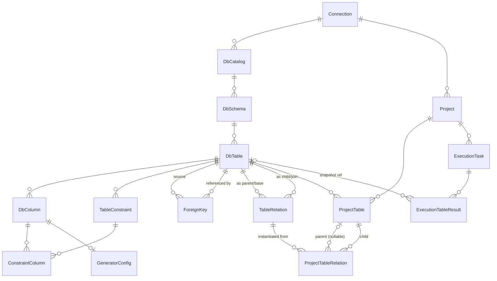

# LoomiDBX · 数据模型

> 专题 2：数据模型  
> 依赖文档：产品大纲、用户故事地图、用户故事列表

---

## 1. 范围说明

本文档定义 LoomiDBX 的本地持久化数据模型，覆盖连接管理、Schema 扫描缓存、字段生成规则、生成任务组织与执行历史五个核心领域。

**不在此模型范围内的内容**：

- 用户账号与授权（由远端服务负责，本地无需存储）
- 系统运行配置（由本地配置文件持久化，如存储路径、LLM 配置、语言/主题）

**实体统计**： 共 5 个分组，15 个实体。

---

## 2. 核心术语表 (Terminology)

为确保数据生成引擎、元数据扫描模块与前端运行时配置的表述一致性，系统中所有涉及表级关联的概念一律不使用抽象的中文口语化表述，严格统一规范如下：

| 英文术语  | 中文对照 | 严谨定义                                                 |
| ------------- | ------------ | ------------------------------------------------------------ |
| Parent    | 父表         | 1:N 关系中处于“1”的一方，被依赖的表（如 `orders`）           |
| Child     | 子表         | 1:N 关系中处于“N”的一方，外键依赖 `Parent` 的表（如 `payments`） |
| BaseTable | 基表         | N:N 关系中两端的基础业务表，提供核心实体 ID 供连结（如 `orders` 和 `payments`） |
| JoinTable | 连结表       | N:N 关系中处于中间复合依赖的桥梁表（如 `order_payment_rel`），其记录由多个 `BaseTable` 共同决定 |

---

## 3. 实体总览

| 分组 | 实体 | 说明 |
|---|---|---|
| 连接管理 | `Connection` | 数据库连接配置 |
| Schema 结构 | `DbCatalog` `DbSchema` `DbTable` `DbColumn` | 扫描并缓存的数据库对象 |
| Schema 约束与关系 | `TableConstraint` `ConstraintColumn` `ForeignKey` `ForeignKeyColumn` `TableRelation` | 扫描缓存的物理约束，以及系统内定义的逻辑/业务表关系（含 1:N 与 N:N 拆分） |
| 字段生成规则 | `GeneratorConfig` | 字段级生成器绑定与参数，归属 Schema 层 |
| 生成任务 | `Project` `ProjectTable` `ProjectTableRelation` | 任务组织与执行配置 |
| 执行历史 | `ExecutionTask` `ExecutionTableResult` | 执行记录与结果追踪 |

---

## 4. 连接管理

### Connection

数据库连接配置。一个 Connection 可对应多个 DbCatalog（即扫描该连接下的所有数据库）。密码字段加密存储。

| 字段名 | 类型 | 约束 | 说明 |
|---|---|---|---|
| `id` | BIGINT | PK | 主键 |
| `name` | VARCHAR(100) | NOT NULL | 连接名称，用户自定义 |
| `db_type` | VARCHAR(50) | NOT NULL | 数据库类型，枚举见 §11.1 |
| `host` | VARCHAR(255) | NOT NULL | 主机地址或 IP |
| `port` | INT | NOT NULL | 端口号 |
| `initial_catalog` | VARCHAR(100) | NULL | 建立连接时使用的初始数据库名；部分数据库必填（如 PostgreSQL 需指定连接到哪个 DB） |
| `username` | VARCHAR(100) | NOT NULL | 登录用户名 |
| `password_encrypted` | TEXT | NOT NULL | 加密存储的密码 |
| `extra_params` | JSON | NULL | 扩展连接参数，如 `ssl_mode`、`connect_timeout`、`schema` 等 |
| `created_at` | DATETIME | NOT NULL | 创建时间 |
| `updated_at` | DATETIME | NOT NULL | 最近更新时间 |

---

## 5. Schema 结构

### DbCatalog

连接下扫描到的"数据库"层级，对应 MySQL Database、PostgreSQL Database、Oracle 实例等概念。

| 字段名 | 类型 | 约束 | 说明 |
|---|---|---|---|
| `id` | BIGINT | PK | 主键 |
| `connection_id` | BIGINT | FK → Connection, NOT NULL | 所属连接 |
| `catalog_name` | VARCHAR(255) | NOT NULL | 数据库 / Catalog 名称 |
| `scanned_at` | DATETIME | NULL | 最近扫描时间；NULL 表示尚未扫描 |
| `created_at` | DATETIME | NOT NULL | |
| `updated_at` | DATETIME | NOT NULL | |

**唯一约束：** `(connection_id, catalog_name)`

---

### DbSchema

Catalog 下的 Schema 层。对于无 Schema 概念的数据库（如 MySQL），扫描时自动插入一条 `schema_name = ''`（空字符串）的隐式记录，保持树形结构统一，上层渲染逻辑无需感知底层差异。

| 字段名 | 类型 | 约束 | 说明 |
|---|---|---|---|
| `id` | BIGINT | PK | 主键 |
| `catalog_id` | BIGINT | FK → DbCatalog, NOT NULL | 所属 DbCatalog |
| `schema_name` | VARCHAR(255) | NOT NULL | Schema 名称；无 Schema 的数据库使用空字符串 `''` |
| `scanned_at` | DATETIME | NULL | 最近扫描时间 |
| `created_at` | DATETIME | NOT NULL | |
| `updated_at` | DATETIME | NOT NULL | |

**唯一约束：** `(catalog_id, schema_name)`

---

### DbTable

Schema 下的表。

| 字段名 | 类型 | 约束 | 说明 |
|---|---|---|---|
| `id` | BIGINT | PK | 主键 |
| `schema_id` | BIGINT | FK → DbSchema, NOT NULL | 所属 DbSchema |
| `table_name` | VARCHAR(255) | NOT NULL | 表名 |
| `comment` | TEXT | NULL | 表注释 |
| `ddl_snapshot` | TEXT | NULL | `CREATE TABLE` 语句快照，用于展示 DDL 面板 |
| `scanned_at` | DATETIME | NULL | 最近扫描时间 |
| `created_at` | DATETIME | NOT NULL | |
| `updated_at` | DATETIME | NOT NULL | |

**唯一约束：** `(schema_id, table_name)`

---

### DbColumn

表中的字段。`is_primary_key` 是从 `TableConstraint` 冗余的快捷标志，避免字段列表渲染时联查约束表（见设计决策 D-04）。

| 字段名 | 类型 | 约束 | 说明 |
|---|---|---|---|
| `id` | BIGINT | PK | 主键 |
| `table_id` | BIGINT | FK → DbTable, NOT NULL | 所属表 |
| `ordinal_position` | INT | NOT NULL | 字段在表中的位置序号（从 1 开始） |
| `column_name` | VARCHAR(255) | NOT NULL | 字段名 |
| `data_type` | VARCHAR(100) | NOT NULL | 原始数据类型字符串，如 `int`、`varchar(100)`、`timestamp` |
| `is_nullable` | BOOLEAN | NOT NULL | 是否允许为 NULL |
| `default_value` | TEXT | NULL | 字段默认值；NULL 表示数据库层面无默认值 |
| `is_primary_key` | BOOLEAN | NOT NULL, DEFAULT false | 是否主键（冗余字段，与 TableConstraint 保持同步） |
| `comment` | TEXT | NULL | 字段注释 |
| `created_at` | DATETIME | NOT NULL | |
| `updated_at` | DATETIME | NOT NULL | |

**唯一约束：** `(table_id, column_name)`

---

## 6. Schema 约束

### TableConstraint

表级约束，仅记录 PRIMARY KEY 和 UNIQUE 两种类型。FOREIGN KEY 单独存储在 `ForeignKey` 实体中。

| 字段名 | 类型 | 约束 | 说明 |
|---|---|---|---|
| `id` | BIGINT | PK | 主键 |
| `table_id` | BIGINT | FK → DbTable, NOT NULL | 所属表 |
| `constraint_name` | VARCHAR(255) | NOT NULL | 约束名称 |
| `constraint_type` | VARCHAR(20) | NOT NULL | 约束类型，枚举见 §11.2 |
| `column_ids` | TEXT | NOT NULL | 参与约束的字段。多个字段逗号分隔，每个字段的顺序即代表其在约束中的顺序|
| `created_at` | DATETIME | NOT NULL | |

**唯一约束：** `(table_id, constraint_name)`

---

### ForeignKey

从数据库物理扫描出来的外键。`table_id` 为来源表，`referenced_table_id` 为被引用表。可用于辅助生成默认的 `TableRelation`。

| 字段名 | 类型 | 约束 | 说明 |
|---|---|---|---|
| `id` | BIGINT | PK | 主键 |
| `table_id` | BIGINT | FK → DbTable, NOT NULL | 外键所在表（来源表） |
| `fk_name` | VARCHAR(255) | NOT NULL | 外键约束名称 |
| `referenced_table_id` | BIGINT | FK → DbTable, NOT NULL | 被引用表（目标表） |
| `column_ids` | TEXT | NOT NULL | 来源表中的字段。多个字段逗号分隔，每个字段的顺序即代表其在复合外键中的顺序|
| `referenced_column_ids` | TEXT | NOT NULL | 目标表中的字段。多个字段逗号分隔，其数量与顺序与 column_ids 意义匹配|
| `created_at` | DATETIME | NOT NULL | |

**唯一约束：** `(table_id, fk_name)`

---

### TableRelation

保存系统定义的所有 Parent / Child (1:N) 和 BaseTable / JoinTable (N:N) 的显式表关系。

- 归属于 Schema 模块（连接级或 Schema 级全局配置）。
- 无论是 1:N 还是 N:N 的依赖关系，在物理存储上均拆分为扁平的单条依赖记录（见设计决策 D-09）。
- 例如：orders 与 payments 的多对多连结表 order_payment_rel 将保存为两条记录：orders -> order_payment_rel 以及 payments -> order_payment_rel，类型皆为 JOIN_TABLE。

| **字段名**          | **类型**    | **约束**               | **说明**                                                     |
| ------------------- | ----------- | ---------------------- | ------------------------------------------------------------ |
| `id`                | BIGINT      | PK                     | 主键                                                         |
| `relation_type`     | VARCHAR(20) | NOT NULL               | 关系类型：`PARENT_CHILD` 或 `JOIN_TABLE`，枚举见 §11.8       |
| `parent_table_id`   | BIGINT      | FK → DbTable, NOT NULL | 关联网络中的上游节点表 ID（即 `Parent` 或 `BaseTable`）      |
| `child_table_id`    | BIGINT      | FK → DbTable, NOT NULL | 关联网络中的下游目标表 ID（即 `Child` 或 `JoinTable`）       |
| `parent_column_ids` | TEXT        | NOT NULL               | 上游关联列。多个字段逗号分隔                                 |
| `child_column_ids`  | TEXT        | NOT NULL               | 下游目标表关联外键列。多个字段逗号分隔                       |
| `multiplier_min`    | INT         | NOT NULL               | 每条上游记录对应下游记录数的最小值（≥ 0）                    |
| `multiplier_max`    | INT         | NOT NULL               | 每条上游记录对应下游记录数的最大值（≥ multiplier_min）       |
| `is_logical`        | BOOLEAN     | NOT NULL               | `true`: 应用内定义的隐式/逻辑关系；`false`: 从数据库物理外键直接生成的显式关系 |
| `created_at`        | DATETIME    | NOT NULL               |                                                              |
| `updated_at`        | DATETIME    | NOT NULL               |                                                              |

--- 

## 7. 字段生成规则

### GeneratorConfig

与字段一对一绑定，记录该字段使用的生成器及其参数。归属 Schema 层，不归属 Project 层，同一字段规则在所有 Project 中共享复用（见设计决策 D-02、D-03）。

`config_status` 用于追踪结构变更后规则的有效性：结构重新扫描后，若某字段的数据类型或约束发生变化，系统将该字段对应的 GeneratorConfig 标记为 `NEEDS_REVIEW`，提示用户核查配置是否仍适用。

| 字段名 | 类型 | 约束 | 说明 |
|---|---|---|---|
| `id` | BIGINT | PK | 主键 |
| `column_id` | BIGINT | FK → DbColumn, UNIQUE, NOT NULL | 绑定字段（一列只有一份规则） |
| `generator_name` | VARCHAR(100) | NOT NULL | 生成器标识，如 `distribute_int`、`enums`、`email`、`dict_table` 等；具体可用值由生成器模块定义 |
| `data_mapping_type` | VARCHAR(20) | NOT NULL | 生成值的输出类型映射，枚举见 §11.3 |
| `params` | JSON | NULL | 生成器参数；结构由各生成器自定义（如范围、枚举列表、分布参数等）|
| `config_status` | VARCHAR(20) | NOT NULL, DEFAULT 'ACTIVE' | 配置有效性状态，枚举见 §11.4 |
| `created_at` | DATETIME | NOT NULL | |
| `updated_at` | DATETIME | NOT NULL | |

---

## 8. 生成任务

### Project

一次生成任务的容器，关联目标数据库连接。

| 字段名 | 类型 | 约束 | 说明 |
|---|---|---|---|
| `id` | BIGINT | PK | 主键 |
| `connection_id` | BIGINT | FK → Connection, NOT NULL | 目标数据库连接 |
| `name` | VARCHAR(100) | NOT NULL | Project 名称 |
| `description` | TEXT | NULL | 描述 |
| `created_at` | DATETIME | NOT NULL | |
| `updated_at` | DATETIME | NOT NULL | |

---

### ProjectTable

Project 中每张参与生成的表的执行配置。

其核心行数指标 `row_count` 扮演状态机角色，其赋值与空值约束严格受当前表所处的架构角色（`Parent` / `Child` / `BaseTable` / `JoinTable`）以及 Project 的勾选包含环境所制约（详见设计决策 D-05）。

`execution_order` 在保存 Project 时根据外键依赖关系做拓扑排序后写入，执行引擎直接按此顺序执行，无需再次计算。

| 字段名 | 类型 | 约束 | 说明 |
|---|---|---|---|
| `id` | BIGINT | PK | 主键 |
| `project_id` | BIGINT | FK → Project, NOT NULL | 所属 Project |
| `table_id` | BIGINT | FK → DbTable, NOT NULL | 对应的目标表 |
| `row_count` | INT | NULL | 固定生成行数；子表且父表在本 Project 中时为 NULL |
| `truncate_before` | BOOLEAN | NOT NULL, DEFAULT false | 执行前是否先 TRUNCATE 目标表 |
| `execution_order` | INT | NOT NULL | 执行顺序，基于依赖关系的拓扑排序结果（从 1 开始）|
| `created_at` | DATETIME | NOT NULL | |
| `updated_at` | DATETIME | NOT NULL | |

**唯一约束：** `(project_id, table_id)`

---

### ProjectTableRelation

`ProjectTable` 之间关系的运行时执行配置。

- 实例化边界：只有当用户在 Project 中勾选并引入了下游目标表（`Child` 或 `JoinTable`）时，系统才会从 `TableRelation` 中复制并创建对应的 `ProjectTableRelation` 记录。
- 覆盖规则：`multiplier_min` 和 `multiplier_max` 直接自 `TableRelation` 复制而来，在 Project 运行时为只读。用户在 Project 界面只能修改值策略（`rel_value_source`）与自定义查询 SQL（`rel_source_sql`），从而细化下游数据如何进行过滤和关联。

**倍数语义：** `multiplier_min` 和 `multiplier_max` 表示每条父记录对应生成的子记录数量范围（如 1～5）。执行时对每条父记录随机取 `[multiplier_min, multiplier_max]` 中的一个整数作为子记录数。`multiplier_min = multiplier_max` 时表示固定倍数。`multiplier_min = 0` 时允许某些父记录无对应子记录。

| 字段名 | 类型 | 约束 | 说明 |
|---|---|---|---|
| `id` | BIGINT | PK | 主键 |
| `project_id` | BIGINT | FK → Project, NOT NULL | 所属 Project 冗余字段，便于检索 |
| `table_relation_id` | BIGINT | FK → TableRelation, NOT NULL | 关联的 Schema 层原始关系定义 |
| `parent_project_table_id` | BIGINT | FK → ProjectTable, NULL | 上游表的运行时配置 ID；NULL 表示该 `Parent` 或 `BaseTable` 未纳入当前 Project 任务 |
| `child_project_table_id` | BIGINT | FK → ProjectTable, NOT NULL | 下游目标表（`Child` 或 `JoinTable`）的运行时配置 ID |
| `multiplier_min` | INT | NOT NULL | [只读快照] 复制自 TableRelation |
| `multiplier_max` | INT | NOT NULL | [只读快照] 复制自 TableRelation |
| `rel_value_source` | VARCHAR(20) | NOT NULL | 值来源策略，枚举见 §11.5。用户可修改 |
| `rel_source_sql` | TEXT | NULL | 用于依赖表不包含在当前生成计划内时的查询/过滤 SQL，用户可修改 |
| `created_at` | DATETIME | NOT NULL |  |
| `updated_at` | DATETIME | NOT NULL |  |

---

## 9. 执行历史

### ExecutionTask

一次生成任务的主执行记录。

| 字段名 | 类型 | 约束 | 说明 |
|---|---|---|---|
| `id` | BIGINT | PK | 主键 |
| `project_id` | BIGINT | FK → Project, NOT NULL | 所属 Project |
| `task_name` | VARCHAR(200) | NOT NULL | 任务名称，可自动生成（如"Project 名 + 执行时间"），用户也可自定义 |
| `status` | VARCHAR(20) | NOT NULL | 整体执行状态，枚举见 §11.6 |
| `started_at` | DATETIME | NOT NULL | 执行开始时间 |
| `ended_at` | DATETIME | NULL | 执行结束时间；NULL 表示仍在执行中 |
| `created_at` | DATETIME | NOT NULL | |

---

### ExecutionTableResult

执行任务中每张表的执行结果。`table_name_snapshot` 和 `schema_name_snapshot` 在执行时写入，确保表被重命名或删除后历史记录仍完整可读。

| 字段名 | 类型 | 约束 | 说明 |
|---|---|---|---|
| `id` | BIGINT | PK | 主键 |
| `execution_task_id` | BIGINT | FK → ExecutionTask, NOT NULL | 所属执行任务 |
| `table_id` | BIGINT | FK → DbTable, NULL | 对应的 DbTable；若表已被删除则为 NULL |
| `table_name_snapshot` | VARCHAR(255) | NOT NULL | 执行时的表名快照 |
| `schema_name_snapshot` | VARCHAR(255) | NOT NULL | 执行时的 Schema 名快照 |
| `rows_written` | INT | NOT NULL, DEFAULT 0 | 成功写入行数 |
| `status` | VARCHAR(20) | NOT NULL | 单表执行状态，枚举见 §11.7 |
| `error_message` | TEXT | NULL | 失败时的错误信息 |
| `execution_order` | INT | NOT NULL | 实际执行顺序（与 ProjectTable.execution_order 一致）|
| `created_at` | DATETIME | NOT NULL | |
| `updated_at` | DATETIME | NOT NULL | |

---

## 10. ER 关系图

---

## 11. 枚举值定义

### 11.1 Connection.db_type

| 值 | 数据库 |
|---|---|
| `mysql` | MySQL |
| `postgresql` | PostgreSQL |
| `oracle` | Oracle |
| `mssql` | Microsoft SQL Server |
| `sqlite` | SQLite |
| `clickhouse` | ClickHouse |
| `hive` | Apache Hive |

---

### 11.2 TableConstraint.constraint_type

| 值 | 说明 |
|---|---|
| `PRIMARY` | 主键约束 |
| `UNIQUE` | 唯一约束 |

---

### 11.3 GeneratorConfig.data_mapping_type

生成器输出值的逻辑类型，用于执行引擎将生成值正确映射到目标字段。

| 值 | 说明 |
|---|---|
| `text` | 字符串文本 |
| `integer` | 整型数值 |
| `float` | 浮点数值 |
| `boolean` | 布尔值 |
| `datetime` | 日期 / 时间 |

---

### 11.4 GeneratorConfig.config_status

| 值 | 说明 |
|---|---|
| `ACTIVE` | 配置有效，可正常用于生成 |
| `NEEDS_REVIEW` | 表结构发生变更（字段类型、约束等），该配置需人工核查是否仍适用 |

---

### 11.5 ProjectTableRelation.rel_value_source

| 值 | 说明 |
| --- | --- |
| `FROM_EXECUTION` | 仅从本次生成的依赖表记录中提取主键/关联列的值（默认值） |
| `FROM_DB_QUERY` | 从数据库中异步查询已有的存量记录，使用 `rel_source_sql` 指定具体查询语句 |
| `MERGED` | 混合模式：同时合并本次生成的新数据与 `rel_source_sql` 的历史查询结果 |

---

### 11.6 ExecutionTask.status

| 值 | 说明 |
|---|---|
| `RUNNING` | 执行中 |
| `SUCCESS` | 全部表写入成功 |
| `PARTIAL_FAILED` | 部分表失败，已成功写入的数据保留 |
| `FAILED` | 执行失败（任务级错误或全部表失败）|

---

### 11.7 ExecutionTableResult.status

| 值 | 说明 |
|---|---|
| `PENDING` | 等待执行（前置依赖表尚未完成）|
| `RUNNING` | 执行中 |
| `SUCCESS` | 写入成功 |
| `FAILED` | 写入失败 |
| `SKIPPED` | 因前置依赖表失败而跳过 |

---

### 11.8 TableRelation.relation_type

| 值 | 说明 |
|---|---|
| `PARENT_CHILD` | 经典 1:N 依赖关系网络中的单向物理拆分项 |
| `JOIN_TABLE`   | N:N 关系解耦出的单向物理依赖分支（如 BaseTable -> JoinTable）|

---

## 12. 关键设计决策

### D-01：DbCatalog / DbSchema 两层抽象统一不同数据库的层级差异

MySQL 无 Schema 概念（库直接包含表），PostgreSQL 有独立 Schema 层，Oracle 以 Schema 区分用户。统一两层抽象后，对无 Schema 的数据库自动插入一条 `schema_name = ''` 的隐式记录，树形浏览和渲染逻辑只需处理同一结构，无需按数据库类型分支。

### D-02：GeneratorConfig 与 DbColumn 分离存储

两者的写入时机完全不同：DbColumn 在每次结构扫描时被覆盖更新，GeneratorConfig 在用户手动配置时写入。若合并在同一张表，扫描逻辑必须小心规避用户配置字段，容易出错。分离后，扫描只更新 DbColumn，配置只更新 GeneratorConfig，职责边界清晰。

### D-03：字段生成规则归属 Schema 层，不归属 Project 层

GeneratorConfig 绑定到 DbColumn，而非 ProjectTable，意味着同一字段的规则在所有 Project 中共享复用。这与产品规则"字段生成规则与表执行规则分离"一致，并降低了重复配置成本。若未来需要 Project 级别的规则覆盖，可在 ProjectTable 中扩展覆盖字段，不影响当前模型。

### D-04：DbColumn.is_primary_key 保留冗余字段

字段列表是高频渲染场景（扫描结构、配置规则均需展示完整字段信息）。将 `is_primary_key` 直接存在 DbColumn，可避免每次渲染都联查 TableConstraint 和 ConstraintColumn。该字段在每次结构扫描时与 TableConstraint 同步更新，保证一致性。

### D-05：ProjectTable.row_count 的运行时矩阵状态机

在运行或配置 Project 任务时，`ProjectTable.row_count` 并非随意的可填项，其值是否必须存在（Required）或必须为空（Forced `NULL`），取决于该表在当前 Project 覆盖范围内的拓扑角色。具体状态机矩阵如下：

1. 若表为 `Parent` 或 `BaseTable`：

* 约束：`row_count` 必须有值。
* 原因：这类表是整个关联拓扑图的源头节点（Root Node），它们不依赖任何上游数据的衍生倍数，必须有明确的基础生成基数。

2. 若表为 `Child` 且 ProjectTable 包含了它的 `Parent`：

* 约束：`row_count` 必须为 `NULL`。
* 动态决定逻辑：该表的最终生成行数是由 `Parent` 表的实际生成数量，乘以 `ProjectTableRelation` 中所定义的运行时倍数范围（`multiplier_min` ～ `multiplier_max`）经过离散分布式抽样计算后动态累加得出。

3. 若表为 `Child` 且 ProjectTable 不包含它的 `Parent`：

* 约束：`row_count` 必须指定值（不能为 `NULL`）。
* 动态决定逻辑：虽然由用户显式指定了行数（用于在不联动生成 `Parent` 时，限制任务的最大数据生成规模或作安全校验边界），但该表的实际有效行数和外键赋值，在运行时由 `ProjectTableRelation` 的倍数范围与 `rel_source_sql` 从目标库扫描出来的执行存量记录数共同动态计算决定。

4. 若表为 `JoinTable`，且 ProjectTable 包含了它的所有 `BaseTable`：

* 约束：`row_count` 必须为 `NULL`。
* 动态决定逻辑：表的实际行数完全由每一个对应的 `ProjectTableRelation` 中的倍数范围，与所有相关的 `BaseTable` 实例生成的记录数（进行多路业务语义组合/笛卡尔积合理抽样）在运行时联合算力计算出来。

5. 若表为 `JoinTable`，且 ProjectTable 中不包含任何一个 `BaseTable`：

* 约束：`row_count` 必须指定值（不能为 `NULL`）。
* 动态决定逻辑：此时该表作为孤立节点执行，其运行时的实际行数和组合约束校验，由每一个 `ProjectTableRelation` 关联的倍数设置与对应的 `rel_source_sql` 的静态库级执行存量行数动态映射生成。

6. 若表为 `JoinTable`，且 ProjectTable 仅部分包含了它的 `BaseTable`：

* 约束：`row_count` 必须为 `NULL`。
* 动态决定逻辑：此种复杂混合模式下，行数将由三者混合计算锁定：
* 每一个 `ProjectTableRelation` 中定义的倍数范围；
* 计划内勾选包含的那些 `BaseTable` 的本次实际新生成记录数；
* 未勾选包含的那些 `BaseTable` 对应的 `rel_source_sql` 实时跑出来的库内存量数据记录数。

### D-06：ProjectTableRelation.rel_value_source 解耦子表与父表执行

当父表不在本 Project 中，或需要引用数据库中已有数据时，子表的 FK 值可通过 `rel_source_sql` 从现有数据中查询获取。这让子表的生成可以脱离父表的本次生成结果，支持"追加明细到已有订单"等典型场景。

### D-07：ExecutionTableResult 保留名称快照

`table_name_snapshot` 和 `schema_name_snapshot` 在任务执行时写入，使历史记录不依赖 DbTable 的存活状态。即使后续表被删除或重命名，历史执行记录仍然可读、可审计。

### D-08：execution_order 预计算并持久化

拓扑排序结果在保存 ProjectTable 时一次性计算并写入 `execution_order`，执行引擎直接按此字段顺序执行，不在运行时重新计算依赖图。这简化了执行引擎逻辑，也让"预览执行顺序"功能的实现成本降为直接读取该字段。

### D-09：N:N 关系（JoinTable）扁平化拆分存储

对于多对多（N:N）的连结表（如 `order_payment_rel`），系统不设计复杂的复合宽表。而是将其拆分为多条标准的 1:N 结构数据存储于 `TableRelation` 中（例如 `orders -> order_payment_rel` 和 `payments -> order_payment_rel`），并标记其类型为 `JOIN_TABLE`。这样能让底层的拓扑排序引擎（Topology Engine）无需为多对多编写特殊分支，统一视作拥有多个父节点的子表进行依赖计算。

### D-10：JoinTable 的运行时校验与自动降级修正机制

在执行生成任务前，引擎会对所有类型为 `JOIN_TABLE` 的运行时关系进行唯一性容量校验：

- 触发场景：`JoinTable` 存在对多个 `BaseTable` 关联列的复合唯一约束（UNIQUE / PK）。
- 潜在冲突：如果配置中，每个 Order 对应的连结记录倍数是 `[1, 5]`（意味着单个 `order_id` 需要匹配 5 条不同的 `payment_id`），但此时当前任务环境（包含本次生成与数据库存量）中另一个 `BaseTable`（`payments`）的总有效记录数仅有 3 条。若强制生成 5 条记录，将必然引发联合唯一索引冲突。
- 修正策略：在任务启动前的 Validation 阶段，系统自动检测此种边界。若发现 `multiplier_max > 目标 BaseTable 总数`，系统将动态把该关系的运行时倍数上限自动修正调低（例如将 `[1, 5]` 自动降级修改为 `[1, 3]`），并向用户输出一条警告日志（Warning Log），从而在不破坏业务真实性的前提下，绝对保障数据库约束的安全闭环。

*文档版本：v1.2 | 下一步：专题 3 UI/UX 线框图与 DSL 定义*
