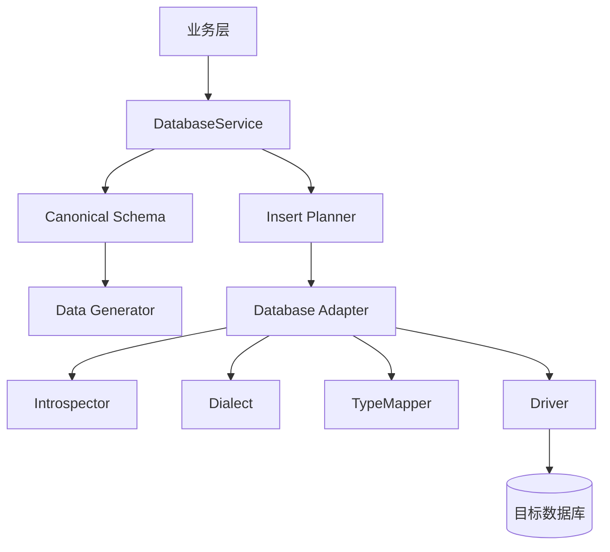
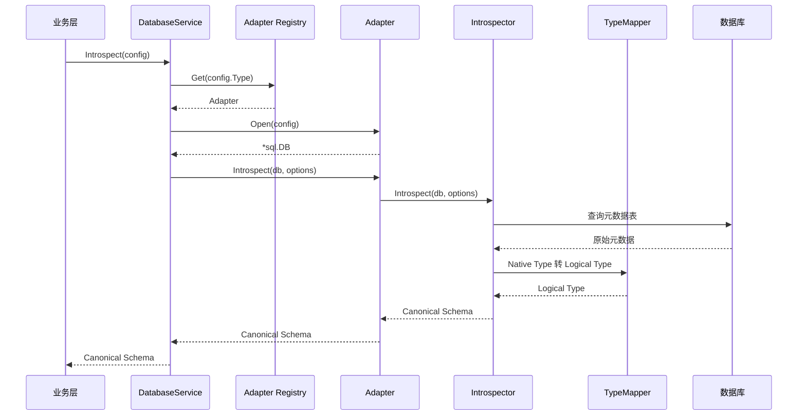
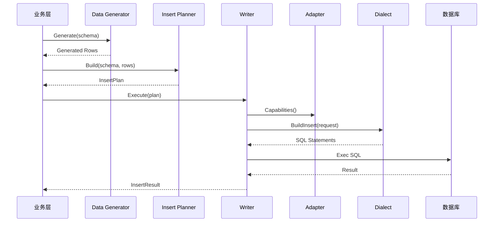

# 多数据库方言抽象设计

## 1. 背景

项目未来需要连接和操作多种数据库，包括 MySQL、PostgreSQL、Oracle、SQL Server、SQLite、ClickHouse。后续还可能支持 TiDB、Hive 等数据库。

这些数据库在元数据查询、类型系统、SQL 方言、事务能力、外键能力、批量写入方式上都有差异。如果业务代码直接扫描 Schema 或直接拼接 `INSERT INTO`，后续每增加一种数据库都会扩大分支逻辑，维护成本会快速上升。

因此，本设计引入一套数据库抽象框架。上层只面对统一的 Schema 视图和统一的写入接口。不同数据库的差异由方言层和适配器层承接。

本设计面向 Go 后端实现。

## 2. 目标

1. 提供统一的数据库使用方式。
2. 提供统一的 Schema 视图，包括表、字段、主键、外键、唯一约束、检查约束、索引等。
3. 支持基于 Schema 生成数据，并写入不同数据库。
4. 将数据库差异收敛到 Adapter、Dialect、Introspector、TypeMapper 和 Capabilities 中。
5. 通过能力描述处理数据库之间的功能差异，而不是假设所有数据库能力一致。
6. 保留数据库原始类型和原始元数据，避免抽象层丢失信息。
7. 首期优先落地 MySQL 和 PostgreSQL，验证抽象是否稳定。
8. 为 Oracle、SQL Server、SQLite、ClickHouse、TiDB、Hive 等后续扩展预留空间。

## 3. 非目标

1. 不追求完全抹平所有数据库差异。
2. 首期不实现所有数据库。
3. 首期不完整支持数组、空间类型、用户自定义类型、分区表、物化视图等高级能力。
4. 首期不实现跨数据库迁移工具。
5. 首期不实现复杂 SQL 生成器或 ORM。
6. 不把所有数据库都强行抽象成关系型数据库。ClickHouse、Hive 等分析型数据库需要通过能力模型单独表达限制。

## 4. 设计原则

### 4.1 统一主路径

业务层通过统一接口完成：

1. 连接数据库。
2. 扫描 Schema。
3. 根据 Schema 生成数据。
4. 构建写入计划。
5. 写入目标数据库。

业务层不直接关心目标数据库是 MySQL 还是 PostgreSQL。

### 4.2 差异下沉

数据库差异集中放在以下组件中：

- `Adapter`：数据库级适配入口。
- `Introspector`：Schema 扫描。
- `Dialect`：SQL 方言。
- `TypeMapper`：数据类型映射。
- `Capabilities`：能力描述。

### 4.3 保留原始信息

统一模型只解决主路径使用问题。对无法统一的信息，需要保留原始值。

例如字段类型同时保存：

- `NativeType`：数据库原始类型，例如 `varchar(255)`、`numeric`、`NUMBER`。
- `LogicalType`：统一后的逻辑类型，例如 `string`、`decimal`。
- `Raw`：数据库原始元数据。

### 4.4 能力协商优先于硬编码

不要在业务层写：

```go
if dbType == "clickhouse" {
    // 特殊处理
}
```

应改为检查能力：

```go
if caps.SupportsTransaction {
    // 使用事务
}
```

这样新增数据库时更容易复用现有流程。

## 5. 总体架构



核心流程分成两条：

1. Schema 扫描流程：目标数据库元数据 → Canonical Schema。
2. 数据写入流程：生成数据 → InsertPlan → 方言 SQL → 数据库写入。

## 6. 核心概念

### 6.1 Adapter

`Adapter` 是每种数据库的统一入口。它组合连接、Schema 扫描、类型映射、SQL 方言和写入逻辑。

示例：

- `mysql.Adapter`
- `postgres.Adapter`
- `oracle.Adapter`
- `clickhouse.Adapter`

### 6.2 Dialect

`Dialect` 负责 SQL 差异，例如：

- 标识符引用方式。
- 参数占位符。
- `INSERT` 语句生成。
- 批量插入语句。
- 是否支持 `RETURNING`。
- 是否支持 `ON CONFLICT` / `ON DUPLICATE KEY UPDATE`。

### 6.3 Introspector

`Introspector` 负责扫描数据库元数据，并转换成统一 Schema。

不同数据库扫描来源不同：

| 数据库 | 常见元数据来源 |
|---|---|
| MySQL | `information_schema` |
| PostgreSQL | `information_schema`、`pg_catalog` |
| Oracle | `ALL_TABLES`、`ALL_TAB_COLUMNS`、`ALL_CONSTRAINTS` |
| SQL Server | `sys.tables`、`sys.columns`、`INFORMATION_SCHEMA` |
| SQLite | `sqlite_master`、`PRAGMA table_info` |
| ClickHouse | `system.tables`、`system.columns` |

### 6.4 TypeMapper

`TypeMapper` 负责类型映射。

主要方向是：

```text
数据库原始类型 Native Type -> 统一逻辑类型 Logical Type
```

例如：

```text
MySQL varchar(255)       -> string
PostgreSQL numeric(10,2) -> decimal
PostgreSQL text[]        -> array<string>
Oracle NUMBER            -> decimal 或 integer
ClickHouse Array(String) -> array<string>
```

### 6.5 Capabilities

`Capabilities` 描述数据库能力。

它不只是文档说明，而是运行时决策依据。

例如：

- 是否支持事务。
- 是否支持外键。
- 是否支持延迟约束。
- 是否支持批量写入。
- 是否支持 JSON 类型。
- 是否支持数组类型。
- 是否支持 `RETURNING`。

### 6.6 Canonical Schema

`Canonical Schema` 是统一 Schema 视图。上层生成器只依赖这套模型。

它表达数据库结构的稳定子集，同时保留原始信息。

### 6.7 InsertPlan

`InsertPlan` 是统一写入计划。它描述要写入哪些表、哪些列、哪些行，以及表之间的依赖关系。

`InsertPlan` 不直接等于 SQL。最终 SQL 由目标数据库的 `Dialect` 生成。

## 7. Go 包结构建议

建议使用按能力分层、按数据库分包的结构。

```text
internal/dbx/
  core/
    adapter.go
    capabilities.go
    connection.go
    registry.go

  schema/
    model.go
    logical_type.go
    constraint.go

  dialect/
    dialect.go
    insert_builder.go

  introspect/
    introspector.go
    normalizer.go

  typex/
    mapper.go
    options.go

  plan/
    insert_plan.go
    dependency_graph.go

  writer/
    writer.go
    executor.go

  adapters/
    mysql/
      adapter.go
      dialect.go
      introspector.go
      type_mapper.go
      capabilities.go

    postgres/
      adapter.go
      dialect.go
      introspector.go
      type_mapper.go
      capabilities.go

    oracle/
      adapter.go
      dialect.go
      introspector.go
      type_mapper.go
      capabilities.go

    sqlserver/
      adapter.go
      dialect.go
      introspector.go
      type_mapper.go
      capabilities.go

    sqlite/
      adapter.go
      dialect.go
      introspector.go
      type_mapper.go
      capabilities.go

    clickhouse/
      adapter.go
      dialect.go
      introspector.go
      type_mapper.go
      capabilities.go
```

说明：

- `core` 放数据库抽象和注册机制。
- `schema` 放统一 Schema 模型。
- `dialect` 放 SQL 方言接口。
- `introspect` 放扫描接口。
- `typex` 放类型映射接口。使用 `typex`，避免和 Go 关键字 `type` 冲突。
- `plan` 放写入计划和依赖排序。
- `writer` 放执行写入计划的逻辑。
- `adapters` 放具体数据库实现。

## 8. 核心接口设计

### 8.1 数据库类型

```go
package core

type DBType string

const (
    DBTypeMySQL      DBType = "mysql"
    DBTypePostgres   DBType = "postgresql"
    DBTypeOracle     DBType = "oracle"
    DBTypeSQLServer  DBType = "sqlserver"
    DBTypeSQLite     DBType = "sqlite"
    DBTypeClickHouse DBType = "clickhouse"
    DBTypeTiDB       DBType = "tidb"
    DBTypeHive       DBType = "hive"
)
```

### 8.2 连接配置

```go
package core

type ConnectionConfig struct {
    Type     DBType
    Host     string
    Port     int
    Database string
    Schema   string
    Username string
    Password string

    DSN     string
    Options map[string]string
}
```

`DSN` 用于允许用户直接传入驱动连接串。`Options` 用于存放数据库特有配置。

### 8.3 Adapter 接口

```go
package core

import (
    "context"
    "database/sql"

    "loomidbx-v2/internal/dbx/dialect"
    "loomidbx-v2/internal/dbx/introspect"
    "loomidbx-v2/internal/dbx/schema"
    "loomidbx-v2/internal/dbx/typex"
)

type Adapter interface {
    Type() DBType
    Capabilities() Capabilities

    Open(ctx context.Context, cfg ConnectionConfig) (*sql.DB, error)

    Introspector() introspect.Introspector
    Dialect() dialect.Dialect
    TypeMapper() typex.Mapper

    Introspect(ctx context.Context, db *sql.DB, opts IntrospectOptions) (*schema.Database, error)
}
```

说明：

- 首期可以基于 Go 标准库 `database/sql`。
- 对 ClickHouse 等特殊数据库，如果标准 `database/sql` 不够用，可以在 Adapter 内部封装专用客户端，但对外仍保持统一接口。

### 8.4 Adapter 注册表

```go
package core

import "fmt"

type Registry struct {
    adapters map[DBType]Adapter
}

func NewRegistry() *Registry {
    return &Registry{adapters: make(map[DBType]Adapter)}
}

func (r *Registry) Register(adapter Adapter) {
    r.adapters[adapter.Type()] = adapter
}

func (r *Registry) Get(t DBType) (Adapter, error) {
    adapter, ok := r.adapters[t]
    if !ok {
        return nil, fmt.Errorf("unsupported database type: %s", t)
    }
    return adapter, nil
}
```

## 9. 能力模型

```go
package core

type Capabilities struct {
    SupportsTransaction        bool
    SupportsSavepoint          bool
    SupportsForeignKey         bool
    SupportsCheckConstraint    bool
    SupportsDeferredConstraint bool

    SupportsBatchInsert bool
    SupportsBulkLoad    bool
    SupportsReturning   bool
    SupportsUpsert      bool

    SupportsCatalogs bool
    SupportsSchemas  bool

    SupportsArrayType bool
    SupportsJSONType  bool
    SupportsUUIDType  bool
    SupportsEnumType  bool

    SupportsGeneratedColumns bool
    SupportsIdentityColumns  bool

    IdentifierMaxLength int
}
```

能力模型用于运行时策略选择。

例如：

```go
if adapter.Capabilities().SupportsTransaction {
    // 在事务中写入
} else {
    // 直接写入，并保证幂等或提供失败报告
}
```

首期 MySQL 和 PostgreSQL 能力示例：

| 能力 | MySQL | PostgreSQL |
|---|---:|---:|
| 事务 | 是 | 是 |
| 外键 | 是，取决于存储引擎 | 是 |
| 延迟约束 | 否 | 是，取决于约束定义 |
| 批量插入 | 是 | 是 |
| RETURNING | 有限支持 | 是 |
| JSON | 是 | 是，含 json/jsonb |
| 数组 | 否 | 是 |
| Schema | 弱，database 常被当作 schema | 是 |

## 10. 统一 Schema 模型

### 10.1 Database

```go
package schema

import "loomidbx-v2/internal/dbx/core"

type Database struct {
    Type     core.DBType
    Catalog  string
    Schemas  []Namespace
    Raw      any
}
```

### 10.2 Namespace

```go
type Namespace struct {
    Name   string
    Tables []Table
    Views  []View
    Raw    any
}
```

### 10.3 Table

```go
type Table struct {
    Name     string
    FullName string

    Columns          []Column
    PrimaryKey       *PrimaryKey
    ForeignKeys      []ForeignKey
    UniqueConstraints []UniqueConstraint
    CheckConstraints []CheckConstraint
    Indexes          []Index

    Comment string
    Raw     any
}
```

### 10.4 Column

```go
type Column struct {
    Name            string
    NativeType      string
    LogicalType     LogicalType

    Nullable        bool
    DefaultValue    *string

    Length          *int64
    Precision       *int
    Scale           *int

    OrdinalPosition int
    IsPrimaryKey    bool
    IsUnique        bool
    IsAutoIncrement bool
    IsGenerated     bool

    Comment string
    Raw     any
}
```

### 10.5 约束模型

```go
type PrimaryKey struct {
    Name    string
    Columns []string
    Raw     any
}

type ForeignKey struct {
    Name              string
    Columns           []string
    ReferencedSchema  string
    ReferencedTable   string
    ReferencedColumns []string
    OnUpdate          string
    OnDelete          string
    Raw               any
}

type UniqueConstraint struct {
    Name    string
    Columns []string
    Raw     any
}

type CheckConstraint struct {
    Name       string
    Expression string
    Raw        any
}

type Index struct {
    Name    string
    Columns []string
    Unique  bool
    Raw     any
}
```

## 11. 统一逻辑类型

Go 中可以用 `Kind + 属性` 表达逻辑类型，避免为每个类型定义复杂继承结构。

```go
package schema

type LogicalKind string

const (
    KindString   LogicalKind = "string"
    KindText     LogicalKind = "text"
    KindInteger  LogicalKind = "integer"
    KindDecimal  LogicalKind = "decimal"
    KindFloat    LogicalKind = "float"
    KindBoolean  LogicalKind = "boolean"
    KindDate     LogicalKind = "date"
    KindTime     LogicalKind = "time"
    KindDateTime LogicalKind = "datetime"
    KindBinary   LogicalKind = "binary"
    KindJSON     LogicalKind = "json"
    KindUUID     LogicalKind = "uuid"
    KindArray    LogicalKind = "array"
    KindEnum     LogicalKind = "enum"
    KindGeometry LogicalKind = "geometry"
    KindUnknown  LogicalKind = "unknown"
)

type LogicalType struct {
    Kind LogicalKind

    Length    *int64
    Bits      *int
    Precision *int
    Scale     *int

    WithTimezone bool

    ElementType *LogicalType
    EnumValues  []string

    NativeType string
}
```

说明：

- 首期可以只稳定支持基础类型。
- 数组、枚举、空间类型可以先在模型中保留，但生成和写入策略可暂不完整支持。
- `NativeType` 用于表达无法识别或需要回溯的原始类型。

## 12. TypeMapper 设计

```go
package typex

import "loomidbx-v2/internal/dbx/schema"

type NativeType struct {
    Name      string
    Full      string
    Length    *int64
    Precision *int
    Scale     *int
    Nullable  bool
    Raw       any
}

type Mapper interface {
    ToLogical(native NativeType) schema.LogicalType
}
```

MySQL 映射示例：

| Native Type | Logical Type |
|---|---|
| `varchar(n)` | `string` |
| `char(n)` | `string` |
| `text` | `text` |
| `int` | `integer` |
| `bigint` | `integer bits=64` |
| `decimal(p,s)` | `decimal` |
| `datetime` | `datetime` |
| `timestamp` | `datetime withTimezone=false` |
| `json` | `json` |
| `tinyint(1)` | 可配置为 `boolean` |

PostgreSQL 映射示例：

| Native Type | Logical Type |
|---|---|
| `varchar(n)` | `string` |
| `text` | `text` |
| `integer` | `integer bits=32` |
| `bigint` | `integer bits=64` |
| `numeric(p,s)` | `decimal` |
| `timestamp` | `datetime` |
| `timestamptz` | `datetime withTimezone=true` |
| `json` / `jsonb` | `json` |
| `uuid` | `uuid` |
| `text[]` | `array<string>` |

类型映射需要支持配置：

```go
type MappingOptions struct {
    MySQLTinyIntOneAsBool bool
    PreferTextForLongVarchar bool
    UnknownAsString bool
}
```

## 13. Dialect 设计

```go
package dialect

import "loomidbx-v2/internal/dbx/schema"

type Dialect interface {
    QuoteIdent(name string) string
    Placeholder(index int) string
    BuildInsert(req InsertRequest) ([]Statement, error)
    NormalizeValue(value any, col schema.Column) (any, error)
}

type InsertRequest struct {
    Schema  string
    Table   string
    Columns []schema.Column
    Rows    []map[string]any
}

type Statement struct {
    SQL  string
    Args []any
}
```

不同数据库差异示例：

| 数据库 | 标识符引用 | 占位符 |
|---|---|---|
| MySQL | `` `name` `` | `?` |
| PostgreSQL | `"name"` | `$1`、`$2` |
| Oracle | `"name"` | `:1`、`:2` |
| SQL Server | `[name]` | `@p1`、`@p2` |
| SQLite | `"name"` | `?` |
| ClickHouse | `` `name` `` | 取决于驱动 |

`BuildInsert` 首期只需要支持批量 `INSERT VALUES`。后续再扩展 COPY、bulk load、array binding 等高性能写入方式。

## 14. Introspector 设计

```go
package introspect

import (
    "context"
    "database/sql"

    "loomidbx-v2/internal/dbx/schema"
)

type Options struct {
    Catalog string
    Schema  string
    Tables  []string
}

type Introspector interface {
    Introspect(ctx context.Context, db *sql.DB, opts Options) (*schema.Database, error)
}
```

每种数据库实现自己的 `Introspector`。

MySQL：

```text
information_schema.tables
information_schema.columns
information_schema.table_constraints
information_schema.key_column_usage
information_schema.referential_constraints
information_schema.statistics
```

PostgreSQL：

```text
information_schema.tables
information_schema.columns
information_schema.table_constraints
information_schema.key_column_usage
information_schema.referential_constraints
pg_catalog.pg_class
pg_catalog.pg_attribute
pg_catalog.pg_constraint
pg_catalog.pg_index
```

首期可以优先使用 `information_schema`。当信息不足时，再补充数据库私有系统表。

## 15. InsertPlan 设计

```go
package plan

import "loomidbx-v2/internal/dbx/schema"

type InsertPlan struct {
    Tables []TableInsertPlan
}

type TableInsertPlan struct {
    Schema string
    Table  string

    Columns []schema.Column
    Rows    []map[string]any

    Dependencies []TableDependency
    Strategy     InsertStrategy
}

type TableDependency struct {
    FromSchema string
    FromTable  string
    ToSchema   string
    ToTable    string
    Type       DependencyType
}

type DependencyType string

const (
    DependencyForeignKey DependencyType = "foreign_key"
)

type InsertStrategy string

const (
    StrategySingleInsert InsertStrategy = "single_insert"
    StrategyBatchInsert  InsertStrategy = "batch_insert"
    StrategyBulkLoad     InsertStrategy = "bulk_load"
)
```

`InsertPlan` 的职责：

1. 明确写入目标。
2. 保持表级依赖关系。
3. 选择写入策略。
4. 将数据生成结果与数据库写入解耦。

## 16. Schema 扫描流程



关键点：

- `Introspector` 输出统一模型。
- `TypeMapper` 不直接查询数据库，只负责类型转换。
- 原始元数据通过 `Raw` 字段保留。

## 17. 数据生成与写入流程



写入时需要关注：

1. 表依赖顺序。
2. 批量大小。
3. 事务边界。
4. 类型值归一化。
5. 失败后的错误定位。

## 18. 外键和依赖排序

基于统一 Schema 构建依赖图。

例如：

```text
orders.user_id -> users.id
order_items.order_id -> orders.id
```

写入顺序应为：

```text
users -> orders -> order_items
```

实现建议：

1. 遍历所有 `ForeignKey`。
2. 构建表级有向图。
3. 使用拓扑排序得到写入顺序。
4. 如果发现环，进入循环依赖处理策略。

循环依赖处理策略：

```go
type ForeignKeyStrategy string

const (
    FKStrategyTopoOrder        ForeignKeyStrategy = "topological_order"
    FKStrategyDeferConstraint  ForeignKeyStrategy = "defer_constraint"
    FKStrategyInsertNullUpdate ForeignKeyStrategy = "insert_null_then_update"
    FKStrategySkipRelation     ForeignKeyStrategy = "skip_relation"
)
```

策略选择依赖数据库能力：

- PostgreSQL 如果约束支持 deferred，可以使用延迟约束。
- MySQL 通常不支持延迟约束，可考虑先插入 nullable 外键，再 update。
- ClickHouse 通常没有真实外键，依赖图只作为生成数据的参考。

首期建议：

1. 支持无环外键的拓扑排序。
2. 对循环外键给出明确错误或降级报告。
3. 不默认关闭约束。

## 19. 能力协商策略

能力协商应发生在计划构建和执行阶段。

示例：

```go
func chooseInsertStrategy(caps core.Capabilities, rowCount int) plan.InsertStrategy {
    if rowCount > 1000 && caps.SupportsBulkLoad {
        return plan.StrategyBulkLoad
    }
    if rowCount > 1 && caps.SupportsBatchInsert {
        return plan.StrategyBatchInsert
    }
    return plan.StrategySingleInsert
}
```

事务策略：

```go
if caps.SupportsTransaction {
    // BeginTx -> Execute -> Commit/Rollback
} else {
    // 直接执行，并记录每批执行结果
}
```

约束策略：

```go
if hasCycle && caps.SupportsDeferredConstraint {
    // 使用延迟约束
} else if hasCycle {
    // 返回循环依赖错误或使用 insert-null-then-update
}
```

## 20. MySQL / PostgreSQL 首期范围

首期建议聚焦稳定主路径。

### 20.1 Schema 扫描范围

支持：

- database/schema。
- table。
- column。
- primary key。
- foreign key。
- unique constraint。
- check constraint，能扫多少算多少。
- index，先支持普通索引和唯一索引。
- nullable。
- default value。
- auto increment / identity。
- comment。

暂不完整支持：

- 分区表。
- 继承表。
- 物化视图。
- expression index。
- partial index。
- generated column 的完整表达式语义。

### 20.2 类型范围

支持基础类型：

- string。
- text。
- integer。
- decimal。
- float。
- boolean。
- date。
- time。
- datetime。
- binary。
- json。
- uuid，PostgreSQL 优先。

暂不完整支持：

- array，PostgreSQL 可先识别但生成策略可后置。
- enum，可先识别 values，生成策略后置增强。
- geometry。
- range type。
- 自定义类型。

### 20.3 写入范围

支持：

- 单表插入。
- 多表按外键顺序插入。
- 批量 `INSERT VALUES`。
- 事务写入。
- 参数化 SQL。

暂不支持：

- PostgreSQL `COPY`。
- MySQL `LOAD DATA`。
- 自动 upsert。
- 自动关闭/恢复外键约束。

## 21. 后续数据库扩展方式

### 21.1 TiDB

TiDB 大体兼容 MySQL 协议和语法。可以复用 MySQL Adapter 的大部分能力。

建议：

```go
type TiDBAdapter struct {
    mysql.Adapter
}
```

再覆盖能力和少量行为。

重点验证：

- 自增 ID 行为。
- 分布式事务限制。
- information_schema 差异。

### 21.2 SQLite

SQLite 元数据能力较弱，类型系统也更宽松。

适配重点：

- 使用 `PRAGMA table_info`、`PRAGMA foreign_key_list`、`PRAGMA index_list`。
- 类型映射需要容忍弱类型。
- 外键是否生效取决于 `PRAGMA foreign_keys`。

### 21.3 Oracle

Oracle 类型和元数据体系较复杂。

适配重点：

- `NUMBER` 到 integer/decimal 的判断。
- sequence / identity。
- 大小写和 quoted identifier。
- `ALL_*` / `USER_*` / `DBA_*` 视图权限差异。

### 21.4 SQL Server

适配重点：

- schema/catalog 模型。
- identity column。
- `TOP`、`OUTPUT`、参数占位符差异。
- `sys.*` 元数据表。

### 21.5 ClickHouse

ClickHouse 是分析型数据库，不应按传统 OLTP 数据库假设处理。

适配重点：

- 通常不支持事务。
- 通常不使用外键。
- 类型支持 `Nullable(T)`、`Array(T)`、`LowCardinality(T)`。
- 批量写入比逐行写入更重要。

能力模型必须准确表达限制。

### 21.6 Hive

Hive 更偏离传统关系型数据库。

适配重点：

- catalog/schema/table 模型可能依赖 metastore。
- 写入方式可能不是普通 `INSERT VALUES` 主路径。
- 分区表是核心能力。
- 类型包括 array、map、struct。

Hive 可作为后续独立 Adapter，不应影响 MySQL/PostgreSQL 主路径设计。

## 22. 测试策略

### 22.1 单元测试

覆盖：

- TypeMapper 映射。
- Dialect SQL 生成。
- 标识符引用。
- 参数占位符。
- 依赖图排序。
- 能力选择策略。

示例：

```go
func TestPostgresPlaceholder(t *testing.T) {
    d := postgres.NewDialect()
    require.Equal(t, "$1", d.Placeholder(1))
    require.Equal(t, "$2", d.Placeholder(2))
}
```

### 22.2 Golden File 测试

对复杂 Schema 扫描结果使用 golden file。

流程：

1. 准备数据库 DDL。
2. 扫描得到 Canonical Schema。
3. 序列化为 JSON。
4. 和期望文件比对。

这样可以稳定验证不同数据库扫描结果。

### 22.3 集成测试

使用容器启动 MySQL 和 PostgreSQL。

测试内容：

- 建表。
- 扫描 Schema。
- 生成数据。
- 写入数据。
- 查询验证行数和外键关系。

### 22.4 兼容性测试

为每种数据库维护一组 DDL 样例：

- 基础表。
- 多字段主键。
- 外键。
- 唯一约束。
- 默认值。
- JSON 字段。
- 自增字段。

每新增一种数据库，必须通过该数据库对应的兼容性测试。

## 23. 错误处理与诊断

错误信息应面向定位问题。

建议包含：

- 数据库类型。
- Schema 名称。
- 表名。
- 列名。
- 当前执行阶段。
- 原始 SQL，注意不要输出敏感参数。
- 原始驱动错误。

示例错误：

```text
insert table failed: db=postgresql schema=public table=orders phase=batch_insert: foreign key violation: ...
```

不要只返回底层驱动错误，否则用户很难知道是哪张表或哪一批数据失败。

## 24. 分阶段实施计划

### 阶段 1：核心框架

交付：

- `core.Adapter`。
- `core.Registry`。
- `core.Capabilities`。
- `schema` 统一模型。
- `dialect.Dialect`。
- `typex.Mapper`。
- `plan.InsertPlan`。

目标：先把框架固定下来。

### 阶段 2：MySQL 支持

交付：

- MySQL Adapter。
- MySQL Introspector。
- MySQL Dialect。
- MySQL TypeMapper。
- 基础 Schema 扫描。
- 基础批量插入。

目标：打通第一条端到端链路。

### 阶段 3：PostgreSQL 支持

交付：

- PostgreSQL Adapter。
- PostgreSQL Introspector。
- PostgreSQL Dialect。
- PostgreSQL TypeMapper。
- JSON、UUID、数组识别。
- 基础批量插入。

目标：验证抽象能承接明显不同的数据库。

### 阶段 4：依赖图与外键写入

交付：

- 外键依赖图。
- 拓扑排序。
- 无环多表写入。
- 循环依赖检测和错误报告。

目标：支持真实业务 Schema 的多表数据写入。

### 阶段 5：测试与稳定化

交付：

- TypeMapper 单元测试。
- Dialect 单元测试。
- Golden File Schema 测试。
- MySQL/PostgreSQL 集成测试。

目标：保证新增数据库不会破坏现有抽象。

### 阶段 6：扩展数据库

建议顺序：

1. SQLite：验证弱类型和轻量数据库。
2. ClickHouse：验证分析型数据库和能力降级。
3. SQL Server：验证企业级数据库差异。
4. Oracle：验证复杂类型和权限模型。
5. TiDB：复用 MySQL 适配器。
6. Hive：作为独立分析型 Adapter 处理。

## 25. 关键风险

### 25.1 统一模型过度复杂

风险：一开始试图覆盖所有数据库特性，导致模型臃肿。

应对：首期只稳定核心字段。高级特性放在 `Raw` 和扩展字段中。

### 25.2 类型映射不准确

风险：同一个数据库类型在不同上下文中含义不同。例如 Oracle `NUMBER` 可能是整数，也可能是小数。

应对：保留 `NativeType`，并结合 precision、scale 判断。无法确定时映射为 `unknown` 或 `decimal`。

### 25.3 外键循环导致写入失败

风险：真实业务库可能存在循环依赖。

应对：首期检测并给出清晰错误。后续再实现延迟约束或先插入空值再更新。

### 25.4 ClickHouse/Hive 不适合统一写入模型

风险：分析型数据库的写入方式和约束模型不同。

应对：通过 Capabilities 表达限制，并允许 Adapter 使用专用写入策略。

### 25.5 information_schema 信息不足

风险：不同数据库的 `information_schema` 完整度不同。

应对：优先使用标准视图，不足时补充数据库私有系统表。

## 26. 推荐结论

本项目应采用“统一模型 + 方言适配 + 能力协商”的设计。

具体做法是：

1. 用 Canonical Schema 作为统一 Schema 视图。
2. 用 Adapter 隔离每种数据库的连接、扫描和写入入口。
3. 用 Introspector 处理元数据扫描差异。
4. 用 TypeMapper 处理类型差异。
5. 用 Dialect 处理 SQL 语法差异。
6. 用 Capabilities 处理能力差异。
7. 用 InsertPlan 连接数据生成和数据库写入。

落地时建议先实现 MySQL 和 PostgreSQL。它们覆盖了常见关系型数据库差异，足以验证框架是否合理。框架稳定后，再扩展 SQLite、ClickHouse、SQL Server、Oracle、TiDB 和 Hive。
