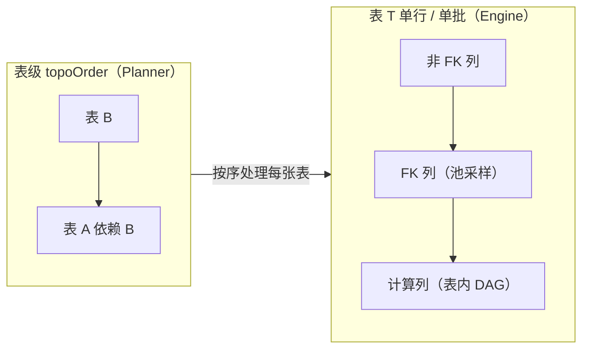

# LoomiDBX — 数据生成执行引擎设计方案

---

## 一、整体架构

```
前端 UI  <── Wails 调用 ──>  Go 数据生成执行引擎
                                      │
                    ┌─────────────────┼─────────────────┐
                 Planner            Engine            Recorder
              (依赖图+行数计划)     (生成+写入执行)     (运行历史)
                      │               │               │
                      └─── ExecutionPlan ───┴─── GenerationRun
                                      │
                              Storage Driver
                              (持久化运行历史)
```

**核心流程**：

```
选择项目 → 设行数 → Planner → ExecutionPlan → Engine → 执行 → Recorder → 写历史
   │             │         │                  │
   └── 表集合 ────┴─ 依赖图 ─┴─ 拓扑排序 ───────┴─ 批量写入 + 进度回调
```

- 性能测试时：不包含外部数据源调用、不包含计算字段（SQL/Python），但需要包含唯一性约束检查。
- 为测试复盘与问题复现，必须设定生成器的 seed。

---

## 二、外键依赖图与拓扑排序

### 2.1 依赖来源

依赖关系来源于三方的综合：


| 来源     | 数据结构                                                        | 特征             |
| ------ | ----------------------------------------------------------- | -------------- |
| 物理外键   | `ldb_column_schemas.fk_ref_table` / `fk_ref_column`         | 数据库 DDL 定义，强约束 |
| 逻辑外键   | `ldb_column_gen_configs.logic_fk_table` / `logic_fk_column` | 用户手动指定，作用同物理外键 |
| 表间数量关系 | `ldb_table_relations.from_table_id` → `to_table_id`         | 独立表，描述行数倍数约定   |


**判定规则**：若表 A 存在（物理或逻辑）外键指向表 B，则 A **依赖** B，B 必须先生成。

### 2.2 依赖图构建

```go
// engine/planner/dependency.go

type DependencyGraph struct {
    nodes     map[string]*DepNode       // table_schema_id → node
    edges     map[string][]string       // from_id → []to_id (依赖方向)
    reverse   map[string][]string       // to_id → []from_id (被依赖方向)
}

type DepNode struct {
    TableID      string
    TableName    string
    DepType      DepType                 // required / optional / excluded
    Source       string                  // "physical_fk" / "logical_fk" / "table_relation"
}

func BuildDependencyGraph(
    selectedTables []string,             // 用户勾选的表集合
    columnConfigs  map[string]ColumnGenConfig,
    tableRelations []TableRelation,
    columnSchemas  map[string]ColumnSchema,
) (*DependencyGraph, error) {
    
    dg := &DependencyGraph{
        nodes:   make(map[string]*DepNode),
        edges:   make(map[string][]string),
        reverse: make(map[string][]string),
    }
    
    // 1. 标记用户勾选表为 required
    for _, tid := range selectedTables {
        dg.nodes[tid] = &DepNode{TableID: tid, DepType: DepRequired}
    }
    
    // 2. 从物理外键构建依赖
    for _, col := range columnSchemas {
        if col.FKRefTable != "" {
            refTableID := findTableIDByName(col.FKRefTable)
            dg.addEdge(col.TableSchemaID, refTableID, "physical_fk")
        }
    }
    
    // 3. 从逻辑外键构建依赖
    for _, cfg := range columnConfigs {
        if cfg.LogicFKTable != "" {
            refTableID := findTableIDByName(cfg.LogicFKTable)
            dg.addEdge(cfg.ColumnSchema.TableSchemaID, refTableID, "logical_fk")
        }
    }
    
    // 4. 从表间数量关系构建依赖（from → to，从表依赖主表）
    for _, rel := range tableRelations {
        dg.addEdge(rel.ToTableID, rel.FromTableID, "table_relation")
    }
    
    // 5. 补全隐式依赖表（用户未勾选但被依赖）
    dg.expandImplicitDependencies()
    
    return dg, nil
}
```

### 2.3 拓扑排序算法

采用 Kahn 算法，支持检测环与可选表标记：

```go
// engine/planner/topo.go

type topoResult struct {
    order      []string          // 生成顺序（拓扑排序结果）
    cycles     [][]string        // 检测到的环
    implicits  []string          // 隐式补入的表（用户未勾选但被依赖）
}

func TopologicalSort(dg *DependencyGraph) (*topoResult, error) {
    result := &topoResult{}
    inDegree := make(map[string]int)
    
    // 计算入度：入度 = 尚未满足的前置依赖数
    // edges[from_id] = from_id 依赖哪些表（from_id 必须等这些表先生成）
    // reverse[to_id] = 哪些表依赖 to_id（这些表必须等 to_id 先生成）
    // 入度为 0 表示所有前置依赖已就绪，该表可以立即生成
    for id := range dg.nodes {
        inDegree[id] = len(dg.edges[id])  // 入度 = 本表依赖多少个前置表
    }
    
    // 初始队列：入度为 0 的表（无前置依赖，可立即生成）
    queue := []string{}
    for id, deg := range inDegree {
        if deg == 0 {
            queue = append(queue, id)
        }
    }
    
    // Kahn 主循环
    for len(queue) > 0 {
        current := queue[0]
        queue = queue[1:]
        result.order = append(result.order, current)
        
        // current 已完成生成，通知依赖 current 的所有表（它们的入度减 1）
        for _, dependent := range dg.reverse[current] {  // reverse[current] = 依赖 current 的表列表
            inDegree[dependent]--
            if inDegree[dependent] == 0 {
                queue = append(queue, dependent)
            }
        }
    }
    
    // 检测环：未遍历的表存在环
    if len(result.order) < len(dg.nodes) {
        remaining := []string{}
        for id := range dg.nodes {
            if !contains(result.order, id) {
                remaining = append(remaining, id)
            }
        }
        result.cycles = dg.extractCycles(remaining)
    }
    
    return result, nil
}
```

### 2.4 环与可选表的产品策略

#### 环处理策略


| 场景                          | 策议                     | 产品决策                                                                  |
| --------------------------- | ---------------------- | --------------------------------------------------------------------- |
| **简单环**（A→B→A）              | 禁止生成，提示用户拆分或删除其中一个外键配置 | **禁止执行**，向导返回错误："表 A 与 B 存在循环依赖，无法生成。请调整外键配置或拆分生成批次。"                 |
| **多表环**（A→B→C→A）            | 禁止生成                   | 同上，列出所有环中表名                                                           |
| **自引用**（A.parent_id → A.id） | 特例允许                   | **单独处理**：使用 SelfRefGenerator，在行内生成时先缓存已生成的 ID 池，后补填 parent_id（见 §3.4） |


**产品规则**：

```
若 topoResult.cycles 不为空：
  1. 向导 UI 阻止"生成"按钮点击
  2. 弹窗列出环中所有表名及依赖关系（可视化箭头图）
  3. 提供"拆分建议"：将环中部分表单独作为一批生成（不带外键），第二批再补充外键关系
  4. 用户可选择：(a) 修改外键配置并重试；(b) 拆批生成（高级操作）
```

#### 隐式依赖表处理

用户勾选表集合 `S`，但 `S` 中某表 A 依赖表 B，且 B ∉ S：


| 场景                                                 | 产品决策                                                      |
| -------------------------------------------------- | --------------------------------------------------------- |
| B 未勾选但存在生成配置（`ldb_table_gen_configs.is_enabled=1`） | **自动补入**向导表列表，标记为「隐式依赖」，用户可见行数设置，可修改但不可取消勾选               |
| B 未勾选且无生成配置                                        | **阻止生成**，提示："表 A 依赖表 B，但表 B 尚未配置生成规则。请先配置表 B 或取消表 A 的勾选。" |
| B 用户勾选但 `truncate_before=1`，A 依赖 B                 | **风险提示**："表 B 将执行 Truncate，其数据被清空后表 A 的外键值将无来源。是否继续？"     |


#### 可选表（Optional）

`ldb_table_relations.relation_type = "1:0-1"` 表示子表可选：


| 场景             | 行数规则                                                 |
| -------------- | ---------------------------------------------------- |
| 用户勾选主表，未勾选可选子表 | 主表正常生成，子表不生成                                         |
| 用户勾选可选子表，未勾选主表 | 同隐式依赖处理：自动补入主表或阻止                                    |
| 用户勾选两者         | 期望子行数 ≈ `p × 主表行数`，其中 `p` 为用户配置的生成概率（默认 0.5），详见 §3.2 |


### 2.5 表级拓扑与表内计算字段顺序的关系

Planner 里会出现两处「排序 / 依赖图」，若不写清容易与 orchestration 或计算字段 spec 脱节。二者**维度不同、先后衔接**，不是同一张图的两种画法。


| 层级                                                | 图里节点是什么 | 边表示什么                             | 解决什么问题                                                |
| ------------------------------------------------- | ------- | --------------------------------- | ----------------------------------------------------- |
| **表级**（§2.1–§2.3）                                 | 表       | 外键 / 逻辑外键 / `ldb_table_relations` | 哪张表必须先于哪张表生成，父表 ID 池先于子表外键采样                          |
| **表内字段级**（见 `computed-field-research.md` §一） | 同一表内的列  | `${column}` 引用、计算列之间依赖            | 单行内先算被引用列，再算 SQL/Python 计算列；**不**承担跨表依赖（跨表由外键与表级拓扑解决） |


**执行引擎如何拼在一起**（单条叙事）：

1. **表级**：对 `DependencyGraph` 做拓扑排序，得到 `topoOrder`（并派生 `TruncateOrder` 等）。
2. **Engine 按 `topoOrder` 逐表**生成并写入批次。
3. **表内**：处理表 `T` 的每一行（或每一批行）时，在「普通列 / 外键列已具备取值」之后，再按**该表自己的**字段依赖 DAG 对计算列求值；SQL 与 Python 计算列若互引，进**同一张**表内 DAG，不区分「先 SQL 后 Python」。

表级顺序**不能替代**表内列顺序；表内 DAG 也**不能**表达「子表依赖父表」——父先于子仍只由表级边保证。

**依赖关系示意图**（表级一条链 + 表内一条流水线；子表方块内重复相同「列阶段」结构）：

```
表级（Planner，节点 = 表）:

   ┌─────┐     FK / 关系      ┌─────┐
   │  B  │ ─────────────────► │  A  │      （例：A 依赖 B，故顺序 B → A）
   └─────┘                    └─────┘

单行内、固定某一表 T（Engine，节点 = 列阶段 / 计算列 DAG）:

   普通生成列 ──► 外键列（读父表 ID 池）──► 计算列（表内 DAG：SQL / Python）
```




**实现提示**：`ExecutionPlan` 的 `Tables[].OrderIndex` 只描述表级位次；表内求值顺序可放在 `TablePlan` 的扩展字段（如每表一列 `field_eval_order`）或由 Engine 在启动对该表生成前从元数据构建字段 DAG 并缓存——具体结构在实现 spec 中敲定即可，本文只固定**语义分层**。

**文档交叉引用**：占位符、DAG 构建、环检测文案与错误模板以 `computed-field-research.md` 为研究结论；本章 §2 不重复列级规则。

---

## 三、行数协调

### 3.1 行数计划统一模型

`ExecutionPlan` 统一承载所有表的行数计算结果：

```go
// engine/planner/plan.go

type ExecutionPlan struct {
    RunID          string                  // 本次运行唯一 ID
    Tables         []TablePlan             // 拓扑排序后的表列表
    TotalRows      int64                   // 总行数（预估）
    BatchSize      int                     // 每批行数（用户可设，默认 10000）
    TruncateOrder  []string                // Truncate 执行顺序（逆拓扑）
    CreatedAt      time.Time
}

type TablePlan struct {
    TableID        string
    TableName      string
    TargetRows     int                     // 最终生成行数
    BaseRows       int                     // 基础行数（用户输入或推断）
    RelationType   string                  // "independent" / "1:1" / "1:0-1" / "1:n"
    ParentTableID  *string                 // 依赖的主表（若存在）
    OptionalProb   *float64                // 1:0-1 时的生成概率 p（0-1），默认 0.5
    MultiplierMin  *int                    // 1:n 时倍数下限
    MultiplierMax  *int                    // 1:n 时倍数上限
    Truncate       bool                    // 是否先 Truncate
    OrderIndex     int                     // 拓扑序号（1-based）
    IsImplicit     bool                    // 是否隐式补入
}
```

### 3.2 行数计算规则

#### 规则矩阵


| 关系类型           | 行数计算公式                                             | 向导交互                                             |
| -------------- | -------------------------------------------------- | ------------------------------------------------ |
| **独立表**（无外键依赖） | `target_rows = user_input`                         | 用户直接输入，默认 `ldb_table_gen_configs.gen_count`      |
| **1:1 关系**     | `target_rows(子) = target_rows(主)`                  | 子表行数自动锁定，向导中显示为灰色（不可编辑），显示 "= 主表行数"              |
| **1:0-1 关系**   | `子记录数 = 对每条主记录 Bernoulli(p) 后求和`                   | 用户输入生成概率 `p`（0-1），系统对每条主记录独立决定是否生成子记录，保证「每父至多一子」 |
| **1:n 关系**     | `target_rows(子) = target_rows(主) × rand(min, max)` | 用户输入倍数区间 [min, max]，向导显示预估区间                     |


#### 行数计算实现

```go
// engine/planner/rows.go

func CalculateTargetRows(
    topoOrder []string,
    tableConfigs map[string]TableGenConfig,
    relations []TableRelation,
    userInputs map[string]int,               // 向导中用户输入的行数（独立表等）
    wizardTablePlans map[string]TablePlan,   // 向导对各表的覆盖项；1:0-1 时可设 OptionalProb，仅需填充用到的字段
) map[string]int {
    
    result := make(map[string]int)
    
    for _, tableID := range topoOrder {      // 拓扑序：先处理主表
        cfg := tableConfigs[tableID]
        rel := findRelation(tableID, relations)
        
        if rel == nil {                       // 独立表
            if userInputs[tableID] > 0 {
                result[tableID] = userInputs[tableID]
            } else {
                result[tableID] = cfg.GenCount               // 使用默认配置
            }
            continue
        }
        
        parentRows := result[rel.FromTableID]  // 主表已计算
        
        switch rel.RelationType {
        case "1:1":
            result[tableID] = parentRows                      // 强制相等
        case "1:0-1":
            // 对每条主记录独立 Bernoulli 试验，保证「每父至多一子」
            // 用户配置生成概率 p（默认 0.5），实际子表行数 = sum(Bernoulli(p) for each parent)
            p := 0.5                                            // 默认概率
            if rel.OptionalProbability != nil {                 // ldb_table_relations.optional_probability
                p = *rel.OptionalProbability
            }
            if wt, ok := wizardTablePlans[tableID]; ok && wt.OptionalProb != nil {
                p = *wt.OptionalProb                              // 向导中用户可覆盖关系级默认概率
            }
            childCount := 0
            for i := 0; i < parentRows; i++ {
                if randFloat() < p {
                    childCount++
                }
            }
            result[tableID] = childCount
        case "1:n":
            mult := randomBetween(rel.MultiplierMin, rel.MultiplierMax)
            result[tableID] = parentRows * mult
        }
    }
    
    return result
}
```

### 3.3 多对多与中间表处理

#### 数据模型

```
多对多关系实现方式：
  (1) 独立中间表：orders ← order_products → products
      - 中间表有两个外键，分别指向两端主表
      - 中间表行数 = 左主表行数 × [min, max]
      
  (2) 无中间表（仅逻辑关系）：需用户指定关系表
      - ldb_table_relations 中标记 relation_type = "m:n"
      - 需关联一个已存在的中间表 Schema
```

#### 产品交互

**向导检测到中间表**：

```
检测条件：表 M 存在两个外键，分别指向表 A 和表 B

向导展示：
  ┌─────────────────────────────────────────┐
  │ 中间表：order_products                   │
  │ ─────────────────────────────────────── │
  │ 左端主表：orders (行数: 1000)            │
  │ 右端主表：products (行数: 500)           │
  │ ─────────────────────────────────────── │
  │ 行数规则：                               │
  │   [√] 每条订单关联 [1] 至 [5] 个商品     │
  │   [ ] 按权重表分布                       │
  │ ─────────────────────────────────────── │
  │ 预估行数：1000 × 3 = 3000                │
  └─────────────────────────────────────────┘
```

**中间表生成逻辑**：

```go
// engine/generator/common/junction.go

type JunctionTablePlan struct {
    TableID        string
    LeftTableID    string
    RightTableID   string
    LeftRows       int
    RightRows      int
    LeftIDPool     []interface{}            // 左主表已生成的主键值池（实际值，非行序号）
    RightIDPool    []interface{}            // 右主表已生成的主键值池（实际值，非行序号）
    MultMin        int
    MultMax        int
}

func GenerateJunctionRows(jp *JunctionTablePlan) []Row {
    rows := []Row{}
    
    // 重要：IDPool 存储的是实际主键值（可能是整数、UUID、雪花 ID 等），而非行序号 1..N
    // 生成中间表时必须使用已生成并写入的真实主键值
    
    // 按左主表每条记录生成 [min, max] 条关联
    for i, leftPK := range jp.LeftIDPool {  // 遍历左主表的实际主键值池
        // 为左主表第 i 条记录生成随机数量的关联
        mult := randomBetween(jp.MultMin, jp.MultMax)
        
        // 从右主表实际主键值池中随机选取 mult 个（允许重复，模拟真实购买行为）
        rightPKs := sampleFromPool(jp.RightIDPool, mult, true)  // true = 允许重复
        
        for _, rightPK := range rightPKs {
            rows = append(rows, Row{
                "order_id":    leftPK,    // 使用实际主键值（UUID/雪花 ID/整数等）
                "product_id":  rightPK,
                // 其他字段按生成器配置填充...
            })
        }
    }
    
    return rows
}

// sampleFromPool 从池中随机选取 n 个元素
// allowDuplicate: 是否允许重复选取（中间表场景通常允许，模拟同一订单多次购买同一商品）
// 注意：此为伪代码，实际实现应使用 Fisher-Yates shuffle 或 rand.Perm 保证不重复
func sampleFromPool(pool []interface{}, n int, allowDuplicate bool) []interface{} {
    if len(pool) == 0 || n <= 0 { return []interface{}{} }
    
    if allowDuplicate {
        // 允许重复：直接随机选取（可能多次选取同一元素）
        result := []interface{}{}
        for i := 0; i < n; i++ {
            idx := randomBetween(0, len(pool)-1)
            result = append(result, pool[idx])
        }
        return result
    }
    
    // 不允许重复：使用 Fisher-Yates shuffle 或 rand.Perm
    // 若 n > len(pool)，返回池中全部元素（无法满足 n 个不重复）
    if n > len(pool) { n = len(pool) }
    
    // 实际实现建议：indices := rand.Perm(len(pool))[:n]，然后 result = pool[indices[i]]
    // 此处伪代码示意
    shuffled := make([]interface{}, len(pool))
    copy(shuffled, pool)
    for i := len(shuffled) - 1; i > 0; i-- {
        j := randomBetween(0, i)
        shuffled[i], shuffled[j] = shuffled[j], shuffled[i]  // Fisher-Yates swap
    }
    return shuffled[:n]
}
```

### 3.4 自引用（树结构）处理

**场景**：表 A 存在 `parent_id` 外键指向自身 `id`。

**产品交互**：

```
向导检测到自引用：
  ┌─────────────────────────────────────────┐
  │ 表：categories                           │
  │ ─────────────────────────────────────── │
  │ 自引用：parent_id → id                   │
  │ ─────────────────────────────────────── │
  │ 树结构参数：                             │
  │   根节点比例：[30]%                      │
  │   最大深度：[5] 层                       │
  │   每节点子节点数：[1] 至 [10]            │
  └─────────────────────────────────────────┘
```

**生成算法**：

```go
// engine/generator/common/selfref.go

type SelfRefPlan struct {
    TableID        string
    TotalRows      int
    RootRatio      float64                 // 根节点比例
    MaxDepth       int
    ChildMin       int
    ChildMax       int
}

func GenerateSelfRefTree(sp *SelfRefPlan) []Row {
    rows := []Row{}
    generatedIDs := []interface{}{}         // 所有已生成 ID（用于外键生成器回填）
    
    // 第一批：生成根节点（parent_id = NULL）
    rootCount := int(sp.TotalRows * sp.RootRatio)
    for i := 1; i <= rootCount; i++ {
        rows = append(rows, Row{
            "id":         i,
            "parent_id":  nil,
            // 其他字段按生成器配置填充...
        })
        generatedIDs = append(generatedIDs, i)
    }
    
    // 按层级生成子节点（BFS：每层使用上一层的节点作为父节点池）
    currentID := rootCount + 1
    currentLayerParents := generatedIDs   // 当前层的父节点池（初始为根节点）
    
    for depth := 1; depth <= sp.MaxDepth && currentID <= sp.TotalRows; depth++ {
        nextLayerParents := []interface{}{}  // 下一层的父节点池
        
        for _, pid := range currentLayerParents {
            if currentID > sp.TotalRows { break }
            
            // 为每个父节点生成随机数量的子节点
            childCount := randomBetween(sp.ChildMin, sp.ChildMax)
            for j := 0; j < childCount && currentID <= sp.TotalRows; j++ {
                rows = append(rows, Row{
                    "id":         currentID,
                    "parent_id":  pid,
                    // 其他字段...
                })
                nextLayerParents = append(nextLayerParents, currentID)
                generatedIDs = append(generatedIDs, currentID)
                currentID++
            }
        }
        
        // 进入下一层
        currentLayerParents = nextLayerParents
        
        // 若本层未产生任何子节点，停止递归（避免空层循环）
        if len(nextLayerParents) == 0 {
            break
        }
    }
    
    // 若总数未达目标，剩余节点作为根节点的额外子节点（兜底策略）
    for currentID <= sp.TotalRows {
        pid := generatedIDs[randomBetween(0, len(generatedIDs)-1)]  // 从已有 ID 中随机选取父节点
        rows = append(rows, Row{
            "id":         currentID,
            "parent_id":  pid,
        })
        generatedIDs = append(generatedIDs, currentID)
        currentID++
    }
    
    return rows
}
```

---

## 四、写入策略

### 4.1 批量写入模型

```go
// engine/writer/batch.go

type BatchWriter struct {
    connector      Connector                // 目标数据库连接
    batchSize      int                      // 每批行数（默认 10000）
    txPerBatch     bool                     // 每批独立事务（默认 true）
    onProgress     func(Progress)           // 进度回调
}

type Progress struct {
    TableID        string
    TableName      string
    BatchIndex     int                      // 当前批次号
    RowsWritten    int                      // 本表已写入行数
    TotalRows      int                      // 本表目标行数
    Percentage     float64                  // 百分比
    Status         string                   // "generating" / "writing" / "completed" / "failed"
    Error          *string                  // 错误信息（若有）
}
```

### 4.2 事务策略


| 策略         | 配置                           | 适用场景             | 失败处理                  |
| ---------- | ---------------------------- | ---------------- | --------------------- |
| **每批独立事务** | `txPerBatch=true`（默认，MVP 基线） | 海量数据生成（百万级）      | 失败批次回滚，已提交批次保留，停止后续批次 |
| **全任务单事务** | `txPerBatch=false`           | 小数据量（<10万），追求完整性 | 失败回滚全部，重新执行           |


**产品交互（向导高级选项）**：

```
  ┌─────────────────────────────────────────┐
  │ 高级选项                                 │
  │ ─────────────────────────────────────── │
  │ 批大小：[10000] 条/批                    │
  │ 事务策略：                               │
  │   [√] 每批独立事务（推荐，大数据量）     │
  │   [ ] 全任务单事务（完整性优先）         │
  │ 失败处理：                               │
  │   [√] 已提交批次保留                     │
  │   [ ] 全部回滚                           │
  └─────────────────────────────────────────┘
```

### 4.3 Truncate 与 FK 禁用顺序

**顺序规则**：

```
Truncate 阶段（逆拓扑序）：
  1. 先 Truncate 所有从表（外键指向主表）
  2. 再 Truncate 主表
  
原因：若先 Truncate 主表，从表的外键约束会阻止清空。

禁用/启用 FK（仅部分数据库需要）：
  - MySQL：进入 Truncate 阶段前 SET FOREIGN_KEY_CHECKS = 0，所有表 Truncate 完成后 SET FOREIGN_KEY_CHECKS = 1
  - SQLite：进入 Truncate 阶段前 PRAGMA foreign_keys = OFF，完成后 PRAGMA foreign_keys = ON
  - Postgres：无需全局禁用，使用 TRUNCATE ... CASCADE 或按逆拓扑顺序执行即可
  - Oracle/MSSQL：支持 TRUNCATE 级联或约束延迟，无需额外禁用
```

**实现**：

```go
// engine/writer/truncate.go

func ExecuteTruncate(plan *ExecutionPlan, connector Connector) error {
    // 进入 Truncate 阶段前，一次性禁用 FK（仅需要禁用的数据库）
    if needFKDisable(connector.DriverName()) {
        connector.Exec(getFKDisableSQL(connector.DriverName()))  // MySQL: "SET FOREIGN_KEY_CHECKS = 0"
    }
    
    // 逆拓扑序 Truncate（从表先、主表后）
    // 默认 cascade=false：逐表执行 TRUNCATE，按逆拓扑顺序保证 FK 约束不阻止
    for i := len(plan.Tables) - 1; i >= 0; i-- {
        tp := plan.Tables[i]
        if !tp.Truncate { continue }
        
        // 构建带 schema 和引号的表名，防保留字冲突
        tableName := quoteIdentifier(connector.DriverName(), tp.TableName, plan.SchemaName)
        
        // 默认不加 CASCADE，与逆拓扑顺序配合；若用户勾选「级联 Truncate」，则仅对拓扑序最前的表执行一次
        cascade := false                                      // 默认：逐表执行，不加 CASCADE
        truncateSQL := buildTruncateSQL(connector.DriverName(), tableName, cascade)
        
        _, err := connector.Exec(truncateSQL)
        if err != nil {
            return fmt.Errorf("truncate %s failed: %w", tp.TableName, err)
        }
        
        // 处理序列/自增重置（部分数据库需要）
        if needSequenceReset(connector.DriverName()) {
            resetSequence(connector, tableName)
        }
    }
    
    // Truncate 阶段完成后，一次性恢复 FK
    if needFKDisable(connector.DriverName()) {
        connector.Exec(getFKEnableSQL(connector.DriverName()))   // MySQL: "SET FOREIGN_KEY_CHECKS = 1"
    }
    
    return nil
}

// 构建带级联和引号的 TRUNCATE SQL（统一签名，与 §10.3 一致）
func buildTruncateSQL(driver string, tableName string, cascade bool) string {
    base := fmt.Sprintf("TRUNCATE TABLE %s", tableName)
    
    if cascade {
        switch driver {
        case "postgres":
            return fmt.Sprintf("TRUNCATE TABLE %s CASCADE", tableName)  // CASCADE 自动处理依赖表
        case "oracle":
            return fmt.Sprintf("TRUNCATE TABLE %s", tableName)          // Oracle 用 PURGE 选项而非 CASCADE
        default:
            return base                                                   // 其他库不支持 CASCADE，按逆拓扑执行
        }
    }
    
    return base  // 默认：不加 CASCADE，依赖逆拓扑顺序
}
```

### 4.4 批量写入实现

```go
// engine/writer/batch.go

func (bw *BatchWriter) WriteTable(tp *TablePlan, rows []Row) error {
    totalBatches := (tp.TargetRows + bw.batchSize - 1) / bw.batchSize
    
    for batchIdx := 0; batchIdx < totalBatches; batchIdx++ {
        start := batchIdx * bw.batchSize
        end := min(start + bw.batchSize, len(rows))
        batchRows := rows[start:end]
        
        // 进度回调
        bw.onProgress(Progress{
            TableID:     tp.TableID,
            TableName:   tp.TableName,
            BatchIndex:  batchIdx + 1,
            RowsWritten: end,
            TotalRows:   tp.TargetRows,
            Percentage:  float64(end) / float64(tp.TargetRows) * 100,
            Status:      "writing",
        })
        
        // 开始事务（若 txPerBatch）
        tx, _ := bw.connector.BeginTx()
        
        // 执行批量 INSERT
        err := bw.insertBatch(tx, tp.TableName, batchRows)
        if err != nil {
            tx.Rollback()
            bw.onProgress(Progress{
                TableID:   tp.TableID,
                TableName: tp.TableName,
                Status:    "failed",
                Error:     ptr(err.Error()),
            })
            return fmt.Errorf("batch %d failed: %w", batchIdx+1, err)
        }
        
        tx.Commit()
    }
    
    bw.onProgress(Progress{
        TableID:   tp.TableID,
        TableName: tp.TableName,
        Status:    "completed",
    })
    
    return nil
}
```

### 4.5 失败处理与回滚策略


| 失败类型                | 处理                 | 记录                                                     |
| ------------------- | ------------------ | ------------------------------------------------------ |
| **单批失败**（INSERT 错误） | 回滚当前批次，停止后续批次，返回错误 | `generation_runs.status = "partial"` + `error_message` |
| **生成器失败**（值生成错误）    | 同上                 | 同上                                                     |
| **连接失败**            | 全任务中止，无数据写入        | `generation_runs.status = "failed"`                    |
| **用户取消**            | 回滚当前批次，停止后续        | `generation_runs.status = "cancelled"`                 |


**已提交批次保留**：

```
若策略为"已提交批次保留"（默认）：
  - 批次 N 失败后，批次 1..N-1 的数据保留在目标库
  - 用户可选择：(a) 手动处理残留数据；(b) 重新执行（会 Truncate）
  
若策略为"全部回滚"：
  - 需要额外的"全局事务"支持，仅在 txPerBatch=false 时可用
  - 失败后目标库无任何新增数据
```

---

## 五、运行期可观测性

### 5.1 FFI 进度回调形态

**方案选择**：采用**流式回调**而非一次性结果，原因：


| 方案               | 优点       | 缺点          |
| ---------------- | -------- | ----------- |
| **一次性结果**（阻塞到完成） | FFI 简单   | 长时间无反馈，用户焦虑 |
| **流式回调**（定期推送进度） | 实时反馈，可取消 | FFI 需要回调机制  |


**FFI 回调机制**：

```go
// ffi/callback.go

// Go 端定义回调函数类型
type ProgressCallback func(progressJSON *C.char)

// 全局回调指针（Flutter 设置）
var globalProgressCB ProgressCallback

//export SetProgressCallback
func SetProgressCallback(cb ProgressCallback) {
    globalProgressCB = cb
}

// 内部调用回调
func emitProgress(p Progress) {
    if globalProgressCB == nil { return }
    json, _ := json.Marshal(p)
    globalProgressCB(C.CString(string(json)))
}
```

**Flutter 端注册回调**：

```dart
// frontend/lib/ffi/bindings.dart

typedef ProgressCallback = void Function(Pointer<Utf8> progressJson);

void registerProgressCallback(ProgressCallback cb) {
  _lib.SetProgressCallback(cb);
}

// 使用示例
registerProgressCallback((ptr) {
  final json = ptr.toDartString();
  final progress = Progress.fromJson(jsonDecode(json));
  _progressProvider.update(progress);
  _lib.FreeString(ptr);
});
```

### 5.2 进度信息结构与批次流水线

**批次流水线机制**（`txPerBatch=true` 模式）：

在每批独立事务模式下，generation 和 writing 是**交替或并发**进行的，而非严格串行：


| 执行模式      | 描述                                           |
| --------- | -------------------------------------------- |
| **单线程交替** | 生成批次 1 → 写入批次 1 → 生成批次 2 → 写入批次 2 → ...      |
| **多线程并发** | goroutine A 写入批次 N 时，goroutine B 已开始生成批次 N+1 |


**流水线示意图**：

```
时间 →
─────────────────────────────────────────────────────────
单线程交替：
  Gen[1] ── Write[1] ── Gen[2] ── Write[2] ── Gen[3] ── Write[3]
  ↑        ↑          ↑        ↑          ↑        ↑
  phase:   phase:     phase:   phase:     phase:   phase:
  gen      write      gen      write      gen      write

多线程并发（2 goroutine）：
  Gen[1] ────── Gen[2] ────── Gen[3] ────── Gen[4]
            ↘           ↘           ↘
              Write[1] ──── Write[2] ──── Write[3]
              
  时间点 T:
    Goroutine 1: 正在 Write[2]   → phase = "writing"
    Goroutine 2: 正在 Gen[4]     → phase = "generating"
    UI 需同时展示两种状态
```

**Progress 结构（修订版）**：

```json
{
  "run_id": "run_abc123",
  "table_id": "tbl_orders",
  "table_name": "orders",
  
  // 批次流水线状态（多状态并存）
  "pipeline": {
    "generating_batch": 6,          // 正在生成的批次号
    "writing_batch": 5,             // 正在写入的批次号
    "completed_batches": 4,         // 已完成写入的批次数
    "queued_batches": 0             // 已生成待写入的批次队列长度
  },
  
  // 聚合统计（供 UI 总体进度条使用）
  "rows_generated": 60000,          // 已生成（含写入中）
  "rows_written": 50000,            // 已成功写入
  "rows_in_flight": 10000,          // 写入中（批次 5）
  "rows_pending": 40000,            // 待生成（100000 - 60000）
  
  "total_rows": 100000,
  "percentage": 50.0,               // 基于 rows_written 计算（保守）
  "elapsed_ms": 12345,
  "estimated_remaining_ms": 12345,
  
  // 阶段标记（供 UI 状态徽标使用）
  "phase_flags": ["generating", "writing"],  // 多状态并存
  
  // 单批次详细状态（供 UI 展开日志使用）
  "current_batch_details": [
    {"batch": 5, "phase": "writing", "rows": 10000, "status": "in_progress"},
    {"batch": 6, "phase": "generating", "rows": 0, "status": "in_progress"}
  ],
  
  "external_calls": {
    "total": 3,
    "success": 3,
    "failed": 0,
    "by_type": {"http": 2, "sql": 1},
    "last_status_code": 200
  },
  
  "status": "in_progress",
  "error": null
}
```

**phase_flags 多状态语义**：


| phase_flags 组合              | UI 展示建议          |
| --------------------------- | ---------------- |
| `["generating"]`            | 仅显示「正在生成」徽标      |
| `["writing"]`               | 仅显示「正在写入」徽标      |
| `["generating", "writing"]` | 双徽标或合并为「正在生成+写入」 |
| `["completed"]`             | 显示「完成」徽标         |


**进度百分比计算策略**：

| 策略 | 公式 | 适用场景 |
|---|---|
| **保守**（推荐） | `rows_written / total_rows * 100` | 确保进度条不回退（写入失败时已生成数据无效） |
| **激进** | `(rows_generated + rows_written) / (total_rows * 2) * 100` | 提前反馈进度，但写入失败时进度会回退 |
| **加权** | `rows_written * 1.0 + rows_in_flight * 0.5 + rows_generated * 0.2 / total_rows * 100` | 平衡反馈与稳定性 |

**UI 交互建议**：

```
进度对话框（双状态展示）：
  ┌─────────────────────────────────────────┐
  │ orders (批次流水线)                      │
  │ ─────────────────────────────────────── │
  │ ██████████░░░░░░░░░░ 50%  50000/100000  │
  │ ─────────────────────────────────────── │
  │ ○ 生成批次 6...       (60000 待写入)    │
  │ ● 写入批次 5...       (10000 写入中)    │
  │ ✓ 完成批次 1-4        (40000 已完成)    │
  │ ─────────────────────────────────────── │
  │ 已用时：45秒  预估剩余：12秒              │
  │           [ 取消生成 ]                   │
  └─────────────────────────────────────────┘

说明：
  ○ = 正在生成
  ● = 正在写入
  ✓ = 已完成
```

### 5.3 批次流水线实现

**单线程交替模式**（默认，简单可靠）：

```go
// engine/writer/batch_pipeline.go

func (bw *BatchWriter) WriteTablePipeline(tp *TablePlan) error {
    totalBatches := (tp.TargetRows + bw.batchSize - 1) / bw.batchSize
    generator := GetGenerator(tp.TableID)
    
    for batchIdx := 1; batchIdx <= totalBatches; batchIdx++ {
        // 阶段 1：生成当前批次数据
        bw.emitProgress(Progress{
            TableID:        tp.TableID,
            TableName:      tp.TableName,
            PhaseFlags:     []string{"generating"},
            Pipeline:       PipelineInfo{
                GeneratingBatch: batchIdx,
                WritingBatch:    batchIdx - 1,  // 上一批已写入完成
            },
            RowsGenerated:  bw.rowsGenerated,
            RowsWritten:    bw.rowsWritten,
        })
        
        batchRows, err := generator.GenerateBatch(ctx, bw.batchSize)
        if err != nil {
            return fmt.Errorf("generate batch %d failed: %w", batchIdx, err)
        }
        bw.rowsGenerated += len(batchRows)
        
        // 阶段 2：写入当前批次数据
        bw.emitProgress(Progress{
            TableID:        tp.TableID,
            TableName:      tp.TableName,
            PhaseFlags:     []string{"writing"},
            Pipeline:       PipelineInfo{
                GeneratingBatch: batchIdx + 1,  // 下一批待生成
                WritingBatch:    batchIdx,
            },
            RowsGenerated:  bw.rowsGenerated,
            RowsWritten:    bw.rowsWritten,
            RowsInFlight:   len(batchRows),
        })
        
        tx, _ := bw.connector.BeginTx()
        err = bw.insertBatch(tx, tp.TableName, batchRows)
        if err != nil {
            tx.Rollback()
            bw.emitProgress(Progress{Status: "failed", Error: ptr(err.Error())})
            return fmt.Errorf("write batch %d failed: %w", batchIdx, err)
        }
        tx.Commit()
        
        bw.rowsWritten += len(batchRows)
    }
    
    bw.emitProgress(Progress{
        TableID:    tp.TableID,
        TableName:  tp.TableName,
        PhaseFlags: []string{"completed"},
        Status:     "completed",
    })
    
    return nil
}
```

**多线程并发模式**（高级选项，提升吞吐）：

```go
// engine/writer/batch_pipeline_concurrent.go

func (bw *BatchWriter) WriteTableConcurrent(tp *TablePlan) error {
    totalBatches := (tp.TargetRows + bw.batchSize - 1) / bw.batchSize
    generator := GetGenerator(tp.TableID)
    
    // 批次队列：生成器填充，写入器消费
    batchQueue := make(chan []Row, 2)       // 缓冲 2 批次（写入 1 批时生成下 1 批）
    genDone := make(chan error, 1)
    writeDone := make(chan error, 1)
    
    // Goroutine 1：生成器（持续生成批次）
    go func() {
        defer close(batchQueue)
        for batchIdx := 1; batchIdx <= totalBatches; batchIdx++ {
            batchRows, err := generator.GenerateBatch(ctx, bw.batchSize)
            if err != nil {
                genDone <- fmt.Errorf("generate batch %d failed: %w", batchIdx, err)
                return
            }
            batchQueue <- batchRows
            
            // 进度回调：正在生成批次 N+1
            bw.emitProgress(Progress{
                PhaseFlags:     []string{"generating", "writing"},  // 双状态
                Pipeline:       PipelineInfo{
                    GeneratingBatch: batchIdx + 1,
                    WritingBatch:    batchIdx - 1,
                },
                RowsGenerated:  bw.rowsGenerated + len(batchRows),
            })
            
            bw.rowsGenerated += len(batchRows)
        }
        genDone <- nil
    }()
    
    // Goroutine 2：写入器（持续消费批次）
    go func() {
        batchIdx := 1
        for batchRows := range batchQueue {
            tx, _ := bw.connector.BeginTx()
            err := bw.insertBatch(tx, tp.TableName, batchRows)
            if err != nil {
                tx.Rollback()
                writeDone <- fmt.Errorf("write batch %d failed: %w", batchIdx, err)
                return
            }
            tx.Commit()
            
            bw.rowsWritten += len(batchRows)
            
            // 进度回调：正在写入批次 N
            bw.emitProgress(Progress{
                PhaseFlags:     []string{"generating", "writing"},
                Pipeline:       PipelineInfo{
                    GeneratingBatch: batchIdx + 1,
                    WritingBatch:    batchIdx,
                },
                RowsWritten:    bw.rowsWritten,
            })
            
            batchIdx++
        }
        writeDone <- nil
    }()
    
    // 等待双方完成
    if err := <-genDone; err != nil { return err }
    if err := <-writeDone; err != nil { return err }
    
    bw.emitProgress(Progress{PhaseFlags: []string{"completed"}, Status: "completed"})
    return nil
}
```

**并发模式注意事项**：


| 要点       | 处理方式                                              |
| -------- | ------------------------------------------------- |
| **写入失败** | 写入器报错后关闭 `batchQueue`，生成器停止填充；已生成的批次丢弃            |
| **生成失败** | 生成器报错后关闭 `batchQueue`，写入器消费完队列后停止                 |
| **取消信号** | `ctx.Done()` 时双方立即停止，当前批次回滚                       |
| **队列深度** | 默认缓冲 2 批次（写入 1 批 + 生成下 1 批）；可配置为 0（严格串行）或更大（更高吞吐） |


### 5.4 取消与超时机制

#### 取消机制

```go
// engine/context.go

type RunContext struct {
    context.Context
    CancelFunc context.CancelFunc
}

func NewRunContext(timeout time.Duration) *RunContext {
    ctx, cancel := context.WithTimeout(context.Background(), timeout)
    return &RunContext{ctx, cancel}
}

// FFI 导出取消函数
//export CancelGeneration
func CancelGeneration(runID *C.char) {
    if activeRuns[runIDStr] != nil {
        activeRuns[runIDStr].CancelFunc()
    }
}
```

**产品交互**：

```
进度对话框：
  ┌─────────────────────────────────────────┐
  │ 正在生成数据                             │
  │ ─────────────────────────────────────── │
  │ orders        ████████░░ 80%  80000行   │
  │ order_items   ░░░░░░░░░░ 等待中          │
  │ ─────────────────────────────────────── │
  │ 已用时：45秒  预估剩余：12秒              │
  │ ─────────────────────────────────────── │
  │           [ 取消生成 ]                   │
  └─────────────────────────────────────────┘
```

#### 超时机制

```go
// 向导高级选项：超时设置

type RunOptions struct {
    Timeout        time.Duration    // 默认 0 = 无限
    // 其他...
}

// 超时触发时
if ctx.Err() == context.DeadlineExceeded {
    bw.onProgress(Progress{
        Status: "failed",
        Error:  ptr("generation timeout after 30m"),
    })
    return ctx.Err()
}
```

### 5.5 日志输出

**日志级别**：


| 级别      | 输出目标                                         | 内容                   |
| ------- | -------------------------------------------- | -------------------- |
| `INFO`  | Flutter UI（可折叠）                              | 表开始/完成、批次完成、总耗时      |
| `WARN`  | Flutter UI（高亮）                               | 隐式表补入、Truncate 警告    |
| `ERROR` | Flutter UI + `generation_runs.error_message` | 批次失败详情               |
| `DEBUG` | 文件日志（可选开启）                                   | 每批 INSERT 语句、生成器内部状态 |


**日志结构**：

```json
{
  "timestamp": "2024-01-15T10:32:45Z",
  "level": "INFO",
  "run_id": "run_abc123",
  "message": "Table orders completed: 100000 rows in 45.2s",
  "details": {
    "rows": 100000,
    "batches": 10,
    "elapsed_ms": 45200
  }
}
```

---

## 六、运行历史

### 6.1 与 ldb_scan_history 的边界


| 维度       | `ldb_scan_history`                  | `generation_runs`（新增） |
| -------- | ----------------------------------- | --------------------- |
| **触发时机** | Schema 扫描（全库/单表）                    | 数据生成执行                |
| **粒度**   | 单次扫描行为                              | 单次生成任务（含多表）           |
| **关注点**  | Schema 版本、Diff                      | 行数、耗时、成功/失败状态         |
| **关联**   | `scan_history_id` 可关联到当时的 Schema 版本 | `generation_runs` 独立表 |


**设计原则**：`generation_runs` 与 `ldb_scan_history` **独立存储**，不建立强外键关联，避免跨域耦合。

### 6.2 元数据表设计

```sql
-- 新增：运行历史主表
CREATE TABLE generation_runs (
    id              TEXT PRIMARY KEY,               -- UUID
    connection_id   TEXT NOT NULL,
    database_name   TEXT NOT NULL,
    run_options     TEXT,                          -- JSON: 向导选项（批大小、事务策略、超时等）
    plan_summary    TEXT,                          -- JSON: ExecutionPlan 摘要（表列表、行数）
    status          TEXT NOT NULL,                 -- "running" | "completed" | "partial" | "failed" | "cancelled"
    started_at      INTEGER NOT NULL,
    finished_at     INTEGER,                       -- NULL 表示运行中
    total_rows      INTEGER,                       -- 实际写入总行数
    elapsed_ms      INTEGER,
    external_calls  TEXT,                          -- JSON: 外部调用聚合（脱敏 URL、状态码、计数）
    error_message   TEXT,                          -- 失败时的错误摘要
    user_cancelled  INTEGER DEFAULT 0,             -- 是否用户主动取消
    FOREIGN KEY (connection_id) REFERENCES ldb_connections(id)
);

-- 新增：运行明细（每表一行）
CREATE TABLE generation_run_tables (
    id              TEXT PRIMARY KEY,
    run_id          TEXT NOT NULL,
    table_schema_id TEXT NOT NULL,
    table_name      TEXT NOT NULL,
    target_rows     INTEGER NOT NULL,              -- 计划行数
    actual_rows     INTEGER,                       -- 实际写入行数（部分成功时 < target）
    truncate_exec   INTEGER DEFAULT 0,             -- 是否执行了 Truncate
    order_index     INTEGER NOT NULL,              -- 拓扑序号
    started_at      INTEGER,
    finished_at     INTEGER,
    elapsed_ms      INTEGER,
    external_calls  TEXT,                          -- JSON: 当前表的外部调用聚合（可为空）
    status          TEXT NOT NULL,                 -- "pending" | "generating" | "writing" | "completed" | "failed" | "skipped"
    error_message   TEXT,
    is_implicit     INTEGER DEFAULT 0,             -- 是否隐式补入
    FOREIGN KEY (run_id) REFERENCES generation_runs(id),
    FOREIGN KEY (table_schema_id) REFERENCES ldb_table_schemas(id)
);

-- 新增：运行日志（可选，用于详细审计）
CREATE TABLE generation_run_logs (
    id              TEXT PRIMARY KEY,
    run_id          TEXT NOT NULL,
    timestamp       INTEGER NOT NULL,
    level           TEXT NOT NULL,                 -- "INFO" | "WARN" | "ERROR" | "DEBUG"
    table_name      TEXT,                          -- NULL 表示全局日志
    message         TEXT NOT NULL,
    details         TEXT,                          -- JSON（URL 不含 query，凭据字段脱敏）
    FOREIGN KEY (run_id) REFERENCES generation_runs(id)
);
```

### 6.3 `external_calls` 聚合 JSON 结构（新增）

```json
{
  "total": 4,
  "success": 3,
  "failed": 1,
  "by_type": {
    "http": 2,
    "sql": 2,
    "file": 0,
    "llm": 0
  },
  "items": [
    {
      "type": "http",
      "endpoint": "https://api.partner.local/dataset",
      "status_code": 200,
      "elapsed_ms": 122
    },
    {
      "type": "sql",
      "endpoint": "postgres://crm/sales_rep",
      "status_code": 0,
      "elapsed_ms": 98
    }
  ]
}
```

约束：

- `endpoint` 必须脱敏：HTTP 仅保留不含 query 的 URL；SQL 不记录用户名和密码。
- `status_code` 仅对 HTTP 有意义；非 HTTP 可置 `0`。
- 该字段用于运行历史与进度展示，不替代详细审计日志。

### 6.4 历史查询与展示

**UI 展示**：

```
运行历史面板
┌─────────────────────────────────────────────────────────────┐
│ 2024-01-15 10:32  ✓ 完成    mydb  150000行  2分15秒  [详情]  │
│ 2024-01-14 16:20  ⚠ 部分    mydb  50000行   失败于第3表     │
│ 2024-01-13 09:10  ✗ 失败    mydb  连接超时                  │
└─────────────────────────────────────────────────────────────┘

点击 [详情] 展开：
┌─────────────────────────────────────────────────────────────┐
│ 运行详情：run_abc123                                         │
│ ─────────────────────────────────────────────────────────── │
│ 配置：批大小 10000，每批独立事务                              │
│ ─────────────────────────────────────────────────────────── │
│ 表执行明细：                                                 │
│   1. orders        100000行  完成  45.2秒                    │
│   2. order_items   50000行   完成  30.1秒                    │
│   3. payments      0行       跳过（用户取消）                │
│ ─────────────────────────────────────────────────────────── │
│ 总计：150000行，用时 75.3秒                                  │
└─────────────────────────────────────────────────────────────┘
```

### 6.5 FFI 接口扩展

```go
// ffi/exports.go 新增

//export StartGeneration
func StartGeneration(planJSON *C.char) *C.char
// 入参: ExecutionPlan JSON（含表列表、行数、选项）
// 返回: {"ok": true, "data": {"run_id": "..."}}
// 注意：此函数立即返回 run_id，实际执行异步进行

//export CancelGeneration
func CancelGeneration(runID *C.char) *C.char

//export GetGenerationStatus
func GetGenerationStatus(runID *C.char) *C.char
// 返回: {"ok": true, "data": GenerationRun}

//export ListGenerationRuns
func ListGenerationRuns(connID *C.char, dbName *C.char, limit int) *C.char
// 返回: {"ok": true, "data": [GenerationRun...]}

//export GetGenerationRunDetail
func GetGenerationRunDetail(runID *C.char) *C.char
// 返回: GenerationRun + 所有 GenerationRunTable + 日志（可选）

//export SetProgressCallback
func SetProgressCallback(cb ProgressCallback)
```

---

## 七、完整执行流程

```
Flutter 向导 UI
    │
    ├── 1. 用户勾选表、输入行数、设置选项
    │
    ├── 2. 调用 BuildExecutionPlan(planJSON)
    │       │
    │       Go 内部：
    │       ├── 收集表集合 + column_configs + table_relations
    │       ├── BuildDependencyGraph()
    │       ├── TopologicalSort() → 检测环
    │       ├── 若有环 → 返回错误，向导阻止
    │       ├── CalculateTargetRows(..., wizardTablePlans)（含 1:0-1 的 OptionalProb 等向导覆盖）
    │       ├── 构建 ExecutionPlan
    │       └── 返回 planJSON（含表顺序、行数）
    │
    ├── 3. 向导展示 plan 摘要，用户确认
    │
    ├── 4. 调用 StartGeneration(planJSON)
    │       │
    │       Go 内部（异步执行）：
    │       ├── 创建 generation_runs 记录（status="running"）
    │       ├── 注册 ProgressCallback
    │       ├── ExecuteTruncate()（逆拓扑）
    │       ├── 按拓扑序遍历每个表：
    │       │   ├── 创建 generation_run_tables（status="generating"）
    │       │   ├── 调用各生成器 GenerateBatch()
    │       │   ├── BatchWriter.WriteTable()
    │       │   │   ├── 每批回调 Progress
    │       │   │   └── 批次失败时停止，更新状态
    │       │   └── 更新 generation_run_tables（status="completed"）
    │       └── 更新 generation_runs（status="completed/partial/failed"）
    │
    ├── 5. Flutter 接收 Progress 回调，更新进度对话框
    │
    ├── 6. 完成/失败时：
    │       ├── GetGenerationStatus(runID) 获取最终状态
    │       └── GetGenerationRunDetail(runID) 获取明细
    │
    └── 7. 运行历史面板：ListGenerationRuns() 查询历史
```

---

## 八、后续扩展


| 扩展点      | 当前状态      | 未来方向               |
| -------- | --------- | ------------------ |
| **并行生成** | 当前串行（拓扑序） | 多表无依赖时可并行生成，写入仍串行  |
| **断点续传** | 当前不支持     | 记录已完成的表，失败后可从断点继续  |
| **预览执行** | 仅支持生成器预览  | 支持"试运行"（生成但不写入）    |
| **导出脚本** | 当前无       | 导出 SQL INSERT 脚本文件 |
| **对比验证** | 当前无       | 生成后验证约束满足情况        |


---

## 九、关键实现注意事项

### 9.1 编排与生成器的数据契约

**问题**：子表批次生成时，父表 ID 如何跨批次可见？

**方案**：采用**内存 ID 池 + 批次同步**机制：

```go
// engine/generator/foreign_key.go

type IDPool struct {
    TableID    string
    IDs        []interface{}           // 已生成并写入的主键值池
    IsReady    bool                    // 父表是否已完成生成
    mu         sync.RWMutex            // 并发安全：多线程生成/写入时需加锁
}

// 全局 ID 池管理器（跨表共享）；Engine 在任务启动时为依赖链中涉及的表注册池，避免 nil
var globalIDPools = make(map[string]*IDPool)

func getOrCreateIDPool(tableID string) *IDPool {
    pool := globalIDPools[tableID]
    if pool == nil {
        pool = &IDPool{TableID: tableID}
        globalIDPools[tableID] = pool
    }
    return pool
}

// 父表完成一批写入后，将主键值追加到 ID 池（并发安全）
func AppendToIDPool(tableID string, ids []interface{}) {
    pool := getOrCreateIDPool(tableID)
    pool.mu.Lock()
    pool.IDs = append(pool.IDs, ids...)
    pool.mu.Unlock()
}

// 父表全部完成后，标记为就绪（并发安全）
func MarkIDPoolReady(tableID string) {
    pool := getOrCreateIDPool(tableID)
    pool.mu.Lock()
    pool.IsReady = true
    pool.mu.Unlock()
}

// 子表 ForeignKeyGenerator 从 ID 池中取值（并发安全）
type ForeignKeyGenerator struct {
    RefTableID    string
    RefColumn     string
    pool          *IDPool
}

func (g *ForeignKeyGenerator) Generate(ctx context.Context) (interface{}, error) {
    // 单次 RLock：校验就绪、长度、随机下标与取值在同一临界区，避免释放锁后并发修改导致下标越界
    g.pool.mu.RLock()
    defer g.pool.mu.RUnlock()
    if !g.pool.IsReady {
        return nil, fmt.Errorf("parent table %s not yet generated", g.RefTableID)
    }
    if len(g.pool.IDs) == 0 {
        return nil, fmt.Errorf("parent table %s has no rows", g.RefTableID)
    }
    idx := rand.Intn(len(g.pool.IDs))
    return g.pool.IDs[idx], nil
}

// 并发模式下的 UniquePool 同样需要并发安全
type UniquePool struct {
    values    map[interface{}]bool
    mu        sync.Mutex
}
```

**批次边界处理**：


| 场景                     | 处理方式                                                                |
| ---------------------- | ------------------------------------------------------------------- |
| 子表批次生成需要父表 ID，但父表仅部分写入 | **选项 A**：子表等待父表全部完成（简单，推荐） **选项 B**：父表每批写入后立即追加 ID 池，子表同步可见（复杂，需协调） |
| 父表写入失败但部分批次已提交         | 子表生成报错：「父表 X 未完成生成，请先修复并重试」                                         |


**当前默认策略**：父表全部完成后才开始子表生成，避免跨批次协调复杂度。

### 9.2 同表唯一约束与重试策略

**场景**：表存在多列唯一约束或部分唯一索引，生成器可能产生冲突值。

**处理策略**：

```go
// engine/generator/base.go

type UniqueConstraintHandler struct {
    UniqueColumns  []string               // 有唯一约束的列列表
    UniquePool     map[string]set         // 每列已使用的值集合
    MaxRetry       int                    // 最大重试次数（默认 100）
}

func (h *UniqueConstraintHandler) GenerateWithRetry(
    generator Generator,
    columnName string,
) (interface{}, error) {
    pool := h.UniquePool[columnName]
    
    for retry := 0; retry < h.MaxRetry; retry++ {
        value, err := generator.Generate(ctx)
        if err != nil { return nil, err }
        
        // 检查唯一性
        if !pool.Contains(value) {
            pool.Add(value)
            return value, nil
        }
        
        // 值已存在，重试（无状态生成器）或跳过（有状态生成器需 Reset）
        generator.Reset()  // 序列生成器等有状态生成器支持 Reset
    }
    
    // 重试耗尽，降级策略
    return nil, fmt.Errorf("unique constraint exhausted for column %s after %d retries", columnName, h.MaxRetry)
}
```

**降级策略**：


| 约束类型           | 重试耗尽后处理                |
| -------------- | ---------------------- |
| 单列唯一           | 报错并停止该表生成              |
| 多列组合唯一         | 尝试调整其他列值重新组合，或报错       |
| 部分索引（Postgres） | 跳过不满足 WHERE 条件的行，不填充该列 |


### 9.3 Postgres TRUNCATE 与 CASCADE

**问题澄清**：Postgres 使用 `TRUNCATE ... CASCADE` 会级联删除依赖表数据，与「逆拓扑顺序」存在交互。

**策略选择**：


| 用户意图           | 执行方式                                          |
| -------------- | --------------------------------------------- |
| 仅清空指定表，保留依赖表数据 | `TRUNCATE TABLE x`（不加 CASCADE），逆拓扑序执行，确保从表先清空 |
| 清空指定表及其所有依赖表   | `TRUNCATE TABLE x CASCADE`，仅对拓扑序最前的表执行一次，自动级联 |


**实现建议**：`buildTruncateSQL(driver, tableName, cascade)` 的完整签名与各数据库分支（Postgres / Oracle / 默认）见 **§4.3**，与 `ExecuteTruncate` 共用同一实现，本节不再重复伪代码，以免两处漂移。

**产品交互**：向导中提供「级联 Truncate」选项，勾选后仅执行一次 CASCADE，不勾选则按逆拓扑逐表执行。

### 9.4 标识符引用与 Schema

**问题**：表名/列名可能为数据库保留字，或包含 schema（Postgres/Oracle）。

**规范**：

```go
// connector/quote.go

func quoteIdentifier(driver string, name string, schema string) string {
    // 不同数据库的引号规则
    quoteChar := getQuoteChar(driver)  // MySQL: ``, Postgres/Oracle: "", MSSQL: []
    
    if schema != "" {
        return fmt.Sprintf("%s%s%s.%s%s%s", quoteChar, schema, quoteChar, quoteChar, name, quoteChar)
    }
    return fmt.Sprintf("%s%s%s", quoteChar, name, quoteChar)
}

func getQuoteChar(driver string) string {
    switch driver {
    case "mysql":
        return "`"
    case "postgres", "oracle":
        return "\""
    case "mssql":
        return "["  // 结束符为 ]
    default:
        return "\""
    }
}
```

**所有 DML/DDL 必须使用 `quoteIdentifier`**，避免：

- 表名为保留字（如 `order`, `user`, `group`）
- 列名包含空格或特殊字符
- Postgres/Oracle 的 schema 前缀

### 9.5 序列/自增重置

**场景**：Truncate 后，自增序列可能未重置，导致后续插入 ID 冲突。

**数据库行为差异**：


| 数据库      | TRUNCATE 对序列的影响                                     |
| -------- | --------------------------------------------------- |
| MySQL    | `TRUNCATE` 自动重置 `AUTO_INCREMENT` 为 1                |
| Postgres | `TRUNCATE` **不重置** `SERIAL` 序列，需手动 `ALTER SEQUENCE` |
| Oracle   | `TRUNCATE` 不影响 `SEQUENCE`，需手动重建                     |
| MSSQL    | `TRUNCATE` 重置 `IDENTITY` 为种子值                       |
| SQLite   | `DELETE` 不重置，`TRUNCATE`（模拟）需手动                      |


**实现**：

```go
func resetSequence(connector Connector, tableName string) {
    switch connector.DriverName() {
    case "postgres":
        // 查询表的自增序列名
        seqName := getSequenceName(connector, tableName)
        connector.Exec(fmt.Sprintf("ALTER SEQUENCE %s RESTART WITH 1", quoteIdentifier("postgres", seqName, "")))
    case "oracle":
        // 重建序列（若使用序列作为主键）
        seqName := getSequenceName(connector, tableName)
        connector.Exec(fmt.Sprintf("DROP SEQUENCE %s", quoteIdentifier("oracle", seqName, "")))
        connector.Exec(fmt.Sprintf("CREATE SEQUENCE %s START WITH 1", quoteIdentifier("oracle", seqName, "")))
    // MySQL/MSSQL/SQLite 无需额外处理
    }
}
```

**产品交互**：向导高级选项中提供「重置序列」开关（默认开启），让用户选择是否重置自增序列。

---

## 十、关键设计决策汇总（修订版）


| 决策点                | 方案选择                                                 | 理由                                             |
| ------------------ | ---------------------------------------------------- | ---------------------------------------------- |
| **依赖图构建**          | 物理 FK + 逻辑 FK + 表间关系三方综合                             | 覆盖所有依赖来源，隐式补入被依赖表                              |
| **环处理**            | 禁止执行，提示拆批                                            | 避免运行时死锁，产品层面引导用户修正                             |
| **拓扑排序**           | Kahn 算法，入度 = 前置依赖数                                   | O(V+E)，入度为 0 表示所有前置依赖已就绪                       |
| **双层依赖**           | 表级拓扑（§2）与表内计算列 DAG（`computed-field-research.md`）正交衔接 | 表序管「哪张表先用父 ID 池」；表内管「列间 ${} 引用与 SQL/Python 互引」 |
| **行数计算**           | 拓扑序遍历，主表先行数，子表继承/倍数                                  | 保证外键值来源充足                                      |
| **1:0-1 行数**       | 每主记录 Bernoulli 试验，求和得子表行数                            | 保证「每父至多一子」语义，与 FK 填充一致                         |
| **中间表**            | 左主 × 倍数，左右主表实际 ID 池采样                                | 支持任意主键类型（整数/UUID/雪花 ID）                        |
| **自引用**            | 层级 BFS：每层仅用上一层节点作为父池                                 | 避免多层节点混用，保证树结构层级语义                             |
| **事务策略**           | 默认每批独立事务，可选全任务单事务                                    | 海量数据场景避免大事务锁表                                  |
| **失败处理**           | 默认已提交批次保留，可选全部回滚                                     | 避免长任务重跑全部丢失                                    |
| **Truncate FK 开关** | 进入阶段前一次性禁用，完成后恢复                                     | 避免 MySQL/SQLite 每表重复开关的性能损耗                    |
| **Truncate 顺序**    | 逆拓扑（从表先清空）                                           | 避免 FK 约束阻止；Postgres CASCADE 作为可选项              |
| **进度回调**           | 流式回调而非阻塞                                             | 实时反馈，支持取消                                      |
| **批次流水线**          | generation 与 writing 交替/并发                           | 提升吞吐，Progress 多状态并存                            |
| **取消机制**           | context.Context + CancelFunc                         | Go 标准模式                                        |
| **运行历史**           | 独立 ldb_generation_runs 表，与 ldb_scan_history 解耦       | 避免跨域耦合                                         |
| **ID 池契约**         | 父表全部完成后子表才开始生成                                       | 避免跨批次协调复杂度                                     |
| **唯一约束**           | 内存池 + 重试机制，耗尽报错                                      | 保证数据质量，避免写入失败                                  |
| **标识符引用**          | 所有 DML/DDL 使用 `quoteIdentifier`                      | 防保留字冲突，支持 schema 前缀                            |
| **序列重置**           | Postgres/Oracle 需手动重置，其他库自动                          | 保证 Truncate 后 ID 从 1 开始                        |


---

*Document patterns and decisions, not just implementation details.*
