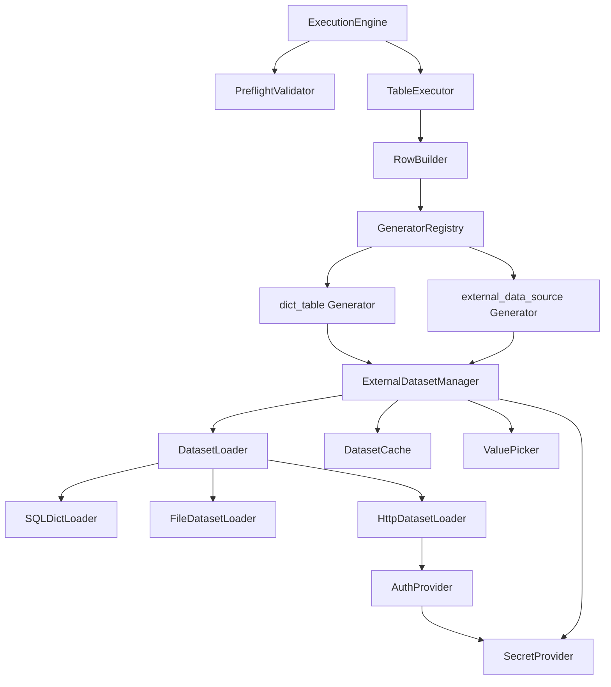

# 专题 6：外部取数生成器设计

> 本文档针对 `dict_table` 与 `external_data_source` 两个“外部取数”生成器展开设计。  
> 依赖文档：产品大纲、数据模型、生成器设计、数据生成执行引擎设计。  
> 关联范围：生成器运行时、缓存策略、外部 API 认证、执行预检与异常处理。

---

## 1. 文档范围与目标

`dict_table` 和 `external_data_source` 都不直接制造随机值，而是从已有数据集中取值：

- `dict_table`：从目标数据库或指定连接中的字典表、配置表、维表查询单列数据。
- `external_data_source`：从内嵌文件、用户上传文件或 HTTP(S) API/资源提取数据。

本文档重点解决以下问题：

1. 数据如何加载、何时加载，以及如何控制内存占用。
2. 数据缓存如何设计，避免每生成一行都访问外部资源。
3. 生成器如何取值，包括随机、顺序、唯一、空值等规则。
4. `external_data_source` 的认证、密钥存储与动态 token 处理。

本文不展开 UI 交互细节、API 契约细节，也不修改现有 `GeneratorConfig` 数据模型；如需新增持久化实体，会在“模型扩展建议”中单独说明。

---

## 2. 设计原则

### 2.1 外部资源只在受控阶段访问

生成一行数据时不直接访问数据库、文件或 HTTP API。外部资源访问统一前置到以下阶段：

- 配置保存/校验时：做轻量连通性与字段验证。
- 执行预检阶段：确认数据源仍然可用，并估算可用数据量。
- 表执行前：加载本次执行实际需要的数据快照。

这样可以避免行级生成过程被网络、文件 IO 或 SQL 查询拖慢，也能让失败尽早暴露。

### 2.2 运行时使用快照，不追求实时变化

一次生成任务中，同一个外部数据源的取值集合应保持稳定。即使字典表或 API 在执行期间发生变化，也不影响本次任务已经加载的快照。

这样做的好处是：

- 生成结果可解释，避免同一批任务前后取值集合不一致。
- 缓存 key 和容量校验更简单。
- 唯一性校验可以基于固定候选集完成。

### 2.3 缓存是执行优化，不是业务事实

缓存用于减少重复 IO 和网络请求，但不能替代数据源本身。缓存命中失败时，系统应能重新加载；数据源不可用时，应按阻塞性错误处理，而不是静默使用过期数据。

例外：用户显式开启“允许使用过期缓存”时，可降级使用最近一次成功加载的数据，并在执行历史中记录 Warning。v1 建议暂不开放该选项。

### 2.4 约束优先于展示效果

当 `null_percentage`、`unique`、目标列非空/唯一约束、候选值数量之间冲突时，优先保证数据库约束成立。

典型规则：

- 非空列忽略 `null_percentage`，或在配置校验阶段报错提示。
- `unique = true` 时，候选值数量必须不少于本列预计非空生成数量。
- 候选值类型无法转换为目标列类型时，应在预检阶段失败。

---

## 3. 总体架构

在执行引擎中新增一组外部取数运行时组件，供 `dict_table` 与 `external_data_source` 共享。



### 3.1 组件职责

| 组件 | 职责 |
|---|---|
| `ExternalDatasetManager` | 外部取数生成器的统一门面。负责解析配置、构造缓存 key、触发加载、返回可取值的数据集句柄。 |
| `DatasetLoader` | 数据加载接口。按数据源类型分派到 SQL、文件、HTTP 实现。 |
| `SQLDictLoader` | 执行 `dict_table.sql_query`，读取单列结果。 |
| `FileDatasetLoader` | 读取内嵌文件或用户上传文件，支持 JSON/CSV 解析和字段提取。 |
| `HttpDatasetLoader` | 调用 HTTP(S) API/资源，解析响应并按 JSONPath 提取值。 |
| `DatasetCache` | 运行时缓存。避免同一任务内重复加载同一个数据源。 |
| `ValuePicker` | 从候选值集合中取值，处理随机、顺序、唯一、空值概率等规则。 |
| `AuthProvider` | 根据认证配置为 HTTP 请求注入认证信息，负责动态 token 获取与刷新。 |
| `SecretProvider` | 统一读取/解密敏感信息，避免明文 token/password 出现在普通配置中。 |

---

## 4. 数据加载设计

### 4.1 加载阶段

外部取数分为三类加载动作：

| 阶段 | 动作 | 目的 | 是否加载全量数据 |
|---|---|---|---|
| 配置保存/验证 | `validate_source` | 校验 SQL、文件路径、字段、URL、认证配置是否基本可用 | 否，只取少量样本 |
| 执行预检 | `preflight_probe` | 确认数据源可用、获取候选值数量、检查唯一性容量 | 尽量不全量加载，SQL 可执行 `COUNT` 包装查询 |
| 表执行前 | `load_dataset` | 加载本次任务实际取值使用的数据快照 | 是，受容量上限控制 |

行级生成时只调用 `ValuePicker.next()`，不再访问外部资源。

### 4.2 `dict_table` 加载时机

`dict_table` 的数据来自数据库查询，推荐加载时机如下：

1. **配置保存时**
   - 校验 `sql_query` 只能是单条 `SELECT` 查询。
   - 通过 SQL 解析或查询元数据确认结果只有一列。
   - 使用 `LIMIT 1` / 数据库方言等价方式读取样本，确认可执行、可转换为目标列类型。

2. **执行预检时**
   - 对用户 SQL 包装为子查询，执行候选数量统计：

     ```sql
     SELECT COUNT(*) FROM (<user_sql>) AS loomidbx_dict_source
     ```

   - 若目标列或生成器配置要求唯一，校验非空候选值数量是否足够：

     ```sql
     SELECT COUNT(DISTINCT value_col) FROM (<user_sql>) AS loomidbx_dict_source
     ```

   - 若数据库不支持统一包装语法，由数据库适配层生成方言 SQL。

3. **表执行前**
   - 执行原始 `sql_query`，读取单列值并构建内存快照。
   - 对结果做类型转换、空值处理、去重策略处理。
   - 放入 `DatasetCache`，供同一任务内复用。

`dict_table` 默认使用目标表所在的 `Connection` 执行查询。若未来支持跨连接字典表，应在配置中增加 `connection_id`，并在权限与连接生命周期上单独处理。

### 4.3 `external_data_source` 加载时机

#### 4.3.1 `embedded`

内嵌 JSON/CSV 文件随应用发布，稳定性较高。

- 配置保存时：校验 `file_path` 在允许的内嵌资源目录内，不能使用任意系统路径。
- 执行预检时：读取文件头或少量样本，确认字段存在。
- 表执行前：读取完整文件并提取字段值。

内嵌文件可跨任务使用进程级缓存，因为文件内容通常不会变化。缓存 key 需包含文件路径、应用版本或资源文件 hash。

#### 4.3.2 `user_uploaded`

用户上传文件由应用管理，配置只保存 `file_id`。

- 上传时：计算文件 hash、大小、MIME/扩展名、行数或记录数摘要。
- 配置保存时：校验 `file_id` 存在且当前用户/本地环境可访问。
- 执行预检时：根据文件元数据判断是否超出容量上限，并抽样验证字段。
- 表执行前：读取文件内容，提取候选值。

用户上传文件可使用进程级缓存，但缓存 key 必须包含 `file_id` 与文件 hash，避免文件被替换后仍命中过期内容。

#### 4.3.3 `http_api_resource`

HTTP API 不稳定且可能有认证、限流、费用和隐私风险，因此必须控制访问频率。

- 配置保存时：可选执行“测试连接”，默认只校验 URL、method、headers/body 格式和认证配置完整性。
- 执行预检时：发起一次真实请求，限制超时时间和响应大小，确认 `response_path` 能提取到候选值。
- 表执行前：若预检结果仍在同一执行任务内可用，可直接复用预检响应；否则重新请求并缓存结果。

v1 推荐 HTTP API 每个执行任务只请求一次，不支持分页全量拉取。若后续需要支持分页，应显式增加 `pagination` 配置，避免用户误以为系统会自动遍历全部数据。

### 4.4 内存管理

外部取数候选集采用“全量候选值快照 + 容量上限”的 v1 策略。

建议默认限制：

| 限制项 | 默认值 | 说明 |
|---|---:|---|
| 单个数据集最大候选值数量 | 1,000,000 | 超出后阻塞或降级抽样，默认阻塞 |
| 单个数据集最大内存估算 | 128 MB | 基于值序列化长度估算 |
| HTTP 响应体最大大小 | 20 MB | 防止误拉大文件或接口异常 |
| CSV 单行最大长度 | 1 MB | 防止异常文件导致解析器内存膨胀 |
| JSON 最大嵌套深度 | 50 | 防止异常 JSON 消耗解析资源 |

候选集内存结构：

```text
DatasetSnapshot {
  cache_key: string
  values: Value[]
  non_null_count: int
  distinct_count: int
  source_fingerprint: string
  loaded_at: datetime
  estimated_bytes: long
}
```

内存处理规则：

- 批次行数据仍按执行引擎既有策略生成一批、写入一批、立即释放。
- 外部候选集在表执行期间常驻内存，任务结束后释放任务级缓存。
- 进程级缓存使用 LRU 淘汰，按最大条目数和最大内存双重限制控制。
- 对 `unique = true` 的数据集，需要额外维护已用下标集合；当候选值很多时使用 bitset 或布尔数组，避免用大对象 Set。

### 4.5 超大数据集策略

v1 默认不支持流式外部取数。原因是随机取值、唯一性校验、执行重试都需要稳定候选集。

当数据集超过容量上限时提供两种处理策略：

| 策略 | v1 默认 | 说明 |
|---|---|---|
| 阻塞执行 | 是 | 报告数据源过大，提示用户缩小 SQL/API/文件范围。 |
| 抽样降级 | 否 | 使用 reservoir sampling 保留固定数量样本，并记录 Warning。适合演示数据，不适合严格唯一场景。 |

若 `unique = true`，不得使用抽样降级，除非抽样后的候选值数量仍能满足预计生成数量且用户明确确认。

---

## 5. 数据缓存设计

### 5.1 缓存层级

外部取数缓存分为三层：

| 缓存层级 | 生命周期 | 适用数据源 | 作用 |
|---|---|---|---|
| 生成器实例缓存 | 单列生成器对象生命周期 | 所有类型 | 保存 `ValuePicker` 状态，如游标、已用下标。 |
| 任务级缓存 | 单次 `ExecutionTask` | 所有类型 | 保证同一任务内同一数据源只加载一次，并保持快照稳定。 |
| 进程级缓存 | 应用进程生命周期 | `embedded`、`user_uploaded`、可选 HTTP | 加速多次预览/执行，使用 TTL/LRU 控制。 |

不建议 v1 引入持久化数据缓存。HTTP/API 结果落盘会带来敏感数据、过期数据和数据授权边界问题。若后续确实需要离线缓存，应单独设计加密存储、TTL、手动清理和审计记录。

### 5.2 缓存 key 设计

缓存 key 必须能区分“数据来源”和“提取方式”。建议格式：

```text
<generator_type>:<source_type>:<source_fingerprint>:<extract_fingerprint>:<connection_or_file_scope>
```

#### `dict_table` 缓存 key

```text
dict_table:<connection_id>:<db_type>:hash(normalized_sql_query):<target_data_type>
```

说明：

- `normalized_sql_query` 只做空白字符归一化和尾部分号移除，不改写语义。
- `connection_id` 必须参与 key，避免不同数据库中相同 SQL 错误复用。
- `target_data_type` 参与 key，避免同一源值被不同目标类型转换后复用错误。

#### `external_data_source` 缓存 key

| `source_type` | key 组成 |
|---|---|
| `embedded` | `external:embedded:<app_version_or_resource_hash>:<file_path>:<file_field>` |
| `user_uploaded` | `external:user_uploaded:<file_id>:<file_hash>:<file_field>` |
| `http_api_resource` | `external:http:<method>:hash(url+query+headers_without_secrets+body):<response_path>:<auth_identity_fingerprint>` |

HTTP 缓存 key 不包含明文 token、password、api key，只包含认证身份指纹，例如 credential id 或 token issuer + username hash。

### 5.3 缓存内容

缓存保存的是已经完成解析和目标类型转换的候选值快照，而不是原始文件内容或 HTTP 原始响应。

```text
DatasetCacheEntry {
  key: string
  values: Value[]
  source_type: string
  source_fingerprint: string
  loaded_at: datetime
  expires_at: datetime | null
  estimated_bytes: long
  warnings: Warning[]
}
```

不缓存以下内容：

- 明文密码、token、api key、HMAC secret。
- HTTP 原始响应头中的敏感字段。
- 可能包含大量无关字段的完整 JSON 原文。

### 5.4 TTL 与失效策略

| 数据源 | 默认 TTL | 失效条件 |
|---|---:|---|
| `dict_table` | 仅任务级缓存；进程级默认关闭 | 每次执行任务重新查询，确保数据库字典值较新。 |
| `embedded` | 进程生命周期 | 应用版本变化、资源 hash 变化。 |
| `user_uploaded` | 30 分钟 | 文件 hash 变化、文件删除、LRU 淘汰。 |
| `http_api_resource` | 5 分钟，可配置 | TTL 到期、认证身份变化、手动刷新、请求配置变化。 |

执行任务一旦开始，任务级缓存不因 TTL 到期而失效，保证同一任务内快照稳定。

### 5.5 并发与防击穿

同一个缓存 key 在同一时刻只允许一个加载动作执行。其他请求等待该加载结果，避免多个列或多个预览同时触发相同 SQL/API。

```text
DatasetCache.get_or_load(key, loader):
  if entry exists and valid:
    return entry
  if key is loading:
    wait loading future
  else:
    mark loading
    try load
    put cache
    release waiters
```

加载失败时不写入缓存；等待者收到同一个错误。

---

## 6. 取值设计

### 6.1 统一取值流程

行级生成时，两个生成器都走统一流程：

```text
Generator.generate(config, row_context):
  dataset = ExternalDatasetManager.resolve(config, execution_context)
  picker = generator_instance.get_or_create_picker(dataset, config)
  return picker.next(row_context)
```

`ValuePicker.next()` 内部处理：

1. 判断目标列是否允许 NULL。
2. 根据 `null_percentage` 决定是否返回 NULL。
3. 从候选值集合中选取一个值。
4. 做目标列类型检查/转换。
5. 若 `unique = true`，记录已用状态。

### 6.2 取值模式

现有简版配置没有显式 `pick_mode`。为了可控性，建议为两个生成器补充同一组选值配置：

```json
{
  "pick_mode": "random",
  "on_exhausted": "error",
  "deduplicate_source": true,
  "null_percentage": 0.05,
  "unique": false
}
```

| 配置项 | 类型 | 默认值 | 说明 |
|---|---|---|---|
| `pick_mode` | string | `random` | `random` 随机取值；`round_robin` 顺序轮询；`shuffle_once` 先打乱再顺序取。 |
| `on_exhausted` | string | `error` | `unique = true` 且候选值耗尽时的处理：`error` 报错；`reuse` 允许复用；`null` 返回 NULL。唯一约束列只能使用 `error`。 |
| `deduplicate_source` | boolean | `true` | 加载后是否对候选值去重。`unique = true` 时强制为 true。 |

v1 可以先不暴露这些高级选项到 UI，但内部应按默认值实现。

### 6.3 空值规则

`null_percentage` 的处理应和列约束联动：

| 场景 | 处理 |
|---|---|
| 目标列 `is_nullable = false` | 忽略 `null_percentage` 或在配置校验阶段提示“非空列不允许生成 NULL”。推荐阻塞保存。 |
| 目标列 `is_nullable = true` 且 `null_percentage = 0` | 总是从候选集取值。 |
| 目标列 `is_nullable = true` 且 `null_percentage > 0` | 先按概率判断是否返回 NULL；未命中 NULL 时再取候选值。 |
| 候选集为空 | 默认阻塞执行；若未来增加 `on_empty` 配置并显式设为 `null`，才允许在可空列返回 NULL。 |

为减少隐性错误，v1 推荐候选集为空时一律阻塞执行，即使列可空。

### 6.4 唯一性规则

`unique = true` 表示本次执行中该列非空值不能重复。实现规则：

1. 加载数据集后先去重，得到 `distinct_values`。
2. 预检阶段计算本列预计非空生成数量：

   ```text
   required_non_null_count = ceil(row_count * (1 - effective_null_percentage))
   ```

3. 若 `distinct_values.length < required_non_null_count`，预检失败。
4. 行级取值时使用“无放回取样”：每个候选值最多使用一次。

若目标数据库存在唯一约束但用户未设置 `unique = true`，配置校验应提示风险；若该列是单列 UNIQUE，建议自动强制 `unique = true`。

### 6.5 取值算法

#### random

默认模式。每行从候选集中随机选择一个值。

- `unique = false`：有放回随机。
- `unique = true`：无放回随机，使用 Fisher-Yates 洗牌游标或随机下标交换，避免重复。

```text
if unique:
  if cursor == values.length: exhausted
  idx = random(cursor, values.length - 1)
  swap(values[cursor], values[idx])
  value = values[cursor]
  cursor++
else:
  value = values[random(0, values.length - 1)]
```

#### round_robin

顺序轮询，适合希望分布均匀的字典值。

```text
value = values[cursor % values.length]
cursor++
```

若 `unique = true`，`cursor >= values.length` 时视为耗尽。

#### shuffle_once

加载后先按任务级随机源打乱，再顺序取值。它兼顾“分布随机”和“可复现的遍历”。

v1 推荐 `unique = true` 时内部使用 `shuffle_once` 算法。

### 6.6 类型转换

外部候选值在加载后统一转换为目标列类型，而不是每次行级取值时转换。这样可以尽早发现异常值，也能减少行级开销。

| 目标类型 | 转换规则 |
|---|---|
| integer | 接受整数、整数格式字符串；小数或非数字字符串报错。 |
| float | 接受数字和可解析数字字符串。 |
| boolean | 接受 boolean、`true/false`、`1/0`、`yes/no`；其他值报错。 |
| datetime | 接受 ISO 8601、常见数据库时间字符串；无法解析时报错。 |
| text | 转为字符串，保留原始文本。 |

加载阶段应输出错误样本，例如“第 12 个值 `abc` 无法转换为 integer”。

---

## 7. `dict_table` 设计细节

### 7.1 配置结构建议

现有配置：

```json
{
  "sql_query": "SELECT name FROM categories WHERE is_active = TRUE",
  "null_percentage": 0.05
}
```

建议扩展为：

```json
{
  "sql_query": "SELECT name FROM categories WHERE is_active = TRUE",
  "pick_mode": "random",
  "deduplicate_source": true,
  "null_percentage": 0.05,
  "unique": false
}
```

`unique` 已在基础规则中适用于外部数据源，但简版 `dict_table` 未列出。考虑到字典表也常用于 UNIQUE 列，建议 `dict_table` 同样支持 `unique`。

### 7.2 SQL 安全规则

`dict_table.sql_query` 必须满足：

- 只能是单条 `SELECT` 查询。
- 结果必须只有一列。
- 不允许 `INSERT`、`UPDATE`、`DELETE`、`MERGE`、`CALL`、`CREATE`、`DROP`、`ALTER`、`TRUNCATE` 等写入或 DDL 语句。
- 不允许多语句拼接。
- 不允许引用本次正在写入的目标表，避免读写互相影响；v1 可只提示风险，v2 再做严格依赖分析。
- 执行时使用只读连接或只读事务；若数据库支持，应设置 statement timeout。

仅靠字符串黑名单不足以保证安全，推荐使用 SQL Parser 做 AST 级校验；没有对应方言解析能力时，再退回“只读连接 + 单语句 + SELECT 前缀 + 禁止分号”的保守策略。

### 7.3 SQL 加载流程

```text
load_dict_table(config, target_column, execution_context):
  validate_select_single_column(config.sql_query)
  rows = db.query(config.sql_query, timeout=QUERY_TIMEOUT)
  values = extract_first_column(rows)
  values = filter_or_keep_null(values)
  values = convert_to_target_type(values, target_column.data_type)
  if deduplicate_source or unique:
    values = distinct(values)
  validate_not_empty(values)
  return DatasetSnapshot(values)
```

默认建议过滤源数据中的 NULL 值。是否生成 NULL 由 `null_percentage` 控制，而不是由字典表中的 NULL 混入候选值决定。若未来需要保留源 NULL，可增加 `keep_source_nulls` 配置。

### 7.4 数据库连接管理

`dict_table` 与目标库共享连接池，但应使用独立的只读查询通道：

- 配置保存与预检阶段：短连接或连接池借用，用完归还。
- 表执行前加载：在表执行开始前完成查询，查询完成后释放连接。
- 行级生成阶段：不持有数据库连接。

超时建议：

| 操作 | 默认超时 |
|---|---:|
| 样本验证查询 | 5 秒 |
| 预检 COUNT 查询 | 10 秒 |
| 表执行前全量加载 | 30 秒，可配置 |

---

## 8. `external_data_source` 设计细节

### 8.1 配置结构建议

现有配置可以继续兼容，但建议把认证敏感值从普通配置中拆出：

```json
{
  "source_type": "http_api_resource",
  "source_config": {
    "url": "https://api.example.com/products",
    "method": "GET",
    "headers": {
      "Accept": "application/json"
    },
    "body": null,
    "response_path": "$.data[*].product_name",
    "auth": {
      "type": "bearer_token",
      "credential_ref": "cred_01"
    }
  },
  "pick_mode": "random",
  "deduplicate_source": true,
  "null_percentage": 0.05,
  "unique": false
}
```

`credential_ref` 指向加密存储的凭据，普通 `GeneratorConfig.params` 中不保存明文 token/password/api key。

### 8.2 文件解析

#### JSON

支持两种 JSON 结构：

```json
[
  { "product_name": "A" },
  { "product_name": "B" }
]
```

或：

```json
{
  "data": [
    { "product_name": "A" },
    { "product_name": "B" }
  ]
}
```

现有 `file_field` 只适合简单结构。建议后续统一为 `extract_path`：

- 文件源：`extract_path` 可使用 JSONPath，如 `$.data[*].product_name`。
- CSV 源：`extract_path` 等价列名，或继续使用 `file_field`。

v1 可保留 `file_field`，JSON 文件默认按以下方式处理：

- 顶层数组：提取每个对象的 `file_field`。
- 顶层对象：若对象中包含数组字段，需用户显式指定 JSONPath；否则仅支持顶层字段。

#### CSV

- 默认第一行为表头。
- `file_field` 指定列名；不填则取第一列。
- 编码默认 UTF-8，可在导入阶段探测 UTF-8 BOM。
- 空字符串按 NULL 还是空文本处理需统一：建议空字符串保留为空文本，真正缺失字段才视为 NULL。

### 8.3 HTTP 请求设计

`http_api_resource` 支持：

- `GET`、`POST`、`PUT`，v1 推荐只开放 `GET` 和 `POST`。
- `headers` 白名单校验，禁止用户覆盖部分内部安全头，如 `Host`、`Content-Length`。
- `body` 作为字符串保存，发送前按 `Content-Type` 判断是否校验 JSON 格式。
- `response_path` 使用 JSONPath 提取值；若响应不是 JSON，v1 可仅支持纯文本按行拆分或直接整体作为单值。

请求限制：

| 项 | 默认值 |
|---|---:|
| 连接超时 | 5 秒 |
| 读取超时 | 20 秒 |
| 最大重试次数 | 1 次 |
| 重试条件 | 网络超时、HTTP 429、HTTP 5xx |
| 最大响应大小 | 20 MB |
| 跟随重定向 | 最多 3 次，仅 HTTP(S) |

HTTP 状态码处理：

| 状态 | 处理 |
|---|---|
| 2xx | 解析响应。 |
| 3xx | 按重定向规则处理。 |
| 401/403 | 认证失败，若支持 token refresh 则刷新一次后重试。 |
| 404 | 阻塞错误：资源不存在。 |
| 429 | 按 `Retry-After` 或默认退避重试一次，仍失败则阻塞。 |
| 5xx | 重试一次，仍失败则阻塞。 |

---

## 9. `external_data_source` 认证设计

### 9.1 认证类型

现有配置列出以下认证类型：

- `none`
- `api_key`
- `bearer_token`
- `basic_auth`
- `hmac_signature`
- `digest_auth`

v1 推荐优先实现：`none`、`api_key`、`bearer_token`、`basic_auth`。`hmac_signature` 和 `digest_auth` 可作为 v1.1/v2 扩展，因为不同服务的签名规范差异较大。

### 9.2 凭据存储

敏感信息不得直接保存在 `GeneratorConfig.params` 中。建议引入本地凭据存储能力：

```text
ExternalCredential {
  id: string
  name: string
  auth_type: string
  encrypted_payload: text
  created_at: datetime
  updated_at: datetime
}
```

`encrypted_payload` 由本地密钥加密，内容按认证类型保存：

```json
{
  "api_key_value": "...",
  "token": "...",
  "username": "...",
  "password": "...",
  "hmac_secret": "..."
}
```

`GeneratorConfig.params.source_config.auth` 中只保存：

```json
{
  "type": "api_key",
  "credential_ref": "cred_01",
  "api_key_name": "X-API-Key",
  "api_key_in": "header"
}
```

这样可以支持：

- 同一凭据被多个生成器复用。
- 用户轮换密钥时不需要修改所有字段配置。
- 导出 Project/Schema 配置时默认不导出密钥明文。

### 9.3 SecretProvider

`SecretProvider` 提供统一接口：

```text
SecretProvider.get(credential_ref) -> decrypted_payload
SecretProvider.mask(value) -> masked_value
SecretProvider.rotate(credential_ref, new_payload)
```

运行日志、执行历史、错误信息中必须使用脱敏值：

- token：`tok_abc...xyz`
- api key：`key_****1234`
- password：始终显示 `******`

### 9.4 API Key

配置：

```json
{
  "type": "api_key",
  "credential_ref": "cred_01",
  "api_key_name": "X-API-Key",
  "api_key_in": "header"
}
```

注入规则：

- `api_key_in = header`：加入请求头 `{api_key_name}: <api_key_value>`。
- `api_key_in = query`：加入 URL query 参数，注意日志中必须脱敏。

若 URL 中已经存在同名 query 参数，配置校验应报错，避免歧义。

### 9.5 Bearer Token

Bearer Token 分为静态 token 和动态 token。

#### 静态 token

凭据中保存：

```json
{
  "token": "YOUR_STATIC_TOKEN"
}
```

请求时注入：

```http
Authorization: Bearer <token>
```

#### 动态 token

建议配置：

```json
{
  "type": "bearer_token",
  "credential_ref": "cred_01",
  "token_url": "https://api.example.com/sign",
  "token_method": "POST",
  "token_headers": {
    "Content-Type": "application/json"
  },
  "token_post_body": "{\"username\":\"john\",\"password\":\"${password}\"}",
  "token_response_path": "$.access_token",
  "expires_in_path": "$.expires_in"
}
```

动态 token 流程：

```text
AuthProvider.apply(request):
  token = TokenCache.get(credential_ref)
  if token missing or expiring soon:
    token = fetch_token(token_url, token_body, credential)
    TokenCache.put(credential_ref, token, expires_at)
  request.headers.Authorization = "Bearer " + token.value
```

TokenCache 是进程内缓存，不落盘。默认在过期前 60 秒刷新。若接口不返回过期时间，则使用较短 TTL，例如 10 分钟。

### 9.6 Basic Auth

凭据中保存用户名和密码：

```json
{
  "username": "john",
  "password": "YOUR_PASSWORD"
}
```

请求时注入：

```http
Authorization: Basic base64(username:password)
```

日志不得输出编码后的 Authorization 头，因为它可逆。

### 9.7 HMAC Signature

HMAC 签名不建议 v1 完整开放为通用能力，因为不同 API 对签名字符串、时间戳、nonce、参与 header 的要求不同。

若需要支持，建议采用模板化配置：

```json
{
  "type": "hmac_signature",
  "credential_ref": "cred_01",
  "algorithm": "HmacSHA256",
  "signature_template": "${method}\n${path}\n${timestamp}\n${body_sha256}",
  "signature_header": "X-Signature",
  "timestamp_header": "X-Timestamp"
}
```

v1 可以先在校验层提示“暂不支持 hmac_signature”。

### 9.8 Digest Auth

Digest Auth 实现复杂度高于 Basic Auth，需要处理 nonce、realm、qop 等挑战响应。v1 可以暂不实现；若配置中选择该类型，应提示“当前版本暂不支持”。

### 9.9 认证错误处理

| 场景 | 处理 |
|---|---|
| 缺少 `credential_ref` | 配置校验失败。 |
| 凭据不存在或无法解密 | 预检失败。 |
| 401 且支持刷新 token | 刷新一次 token 后重试。 |
| 刷新后仍 401/403 | 阻塞执行，提示认证失败。 |
| token_url 请求失败 | 阻塞执行，保留脱敏错误信息。 |
| 日志中包含敏感 header | 写日志前统一脱敏。 |

---

## 10. 预检与校验规则

### 10.1 通用校验

两个生成器共享以下校验：

- `null_percentage` 必须在 `[0, 1]`。
- 若目标列非空，`null_percentage` 必须为 `0`。
- 候选集不能为空。
- 候选值必须可转换为目标列类型。
- `unique = true` 时，去重后的候选值数量必须满足预计非空行数。
- 若目标列有唯一约束，必须启用唯一性策略或提示用户确认风险。

### 10.2 `dict_table` 校验

- `sql_query` 必填。
- SQL 必须是只读单列 `SELECT`。
- 查询可执行，且结果列类型可映射到目标列类型。
- 查询超时、权限不足、连接失败均为阻塞性错误。

### 10.3 `external_data_source` 校验

- `source_type` 必填且属于允许枚举。
- `embedded`：`file_path` 必填且只能指向内嵌资源目录。
- `user_uploaded`：`file_id` 必填且文件存在。
- `http_api_resource`：`url` 必填且必须为 `https://`；开发环境可允许 `http://localhost`。
- `response_path` 必须能提取出数组或单值。
- 认证配置必须完整，敏感值必须来自 `credential_ref`。

---

## 11. 异常处理与降级

| 异常 | 阶段 | 处理 |
|---|---|---|
| SQL 非 SELECT 或多列结果 | 配置保存/预检 | 阻塞，提示修改 SQL。 |
| SQL 执行超时 | 预检/加载 | 阻塞，提示缩小查询范围或增加过滤条件。 |
| 文件不存在 | 预检/加载 | 阻塞，提示重新上传或修复配置。 |
| 文件格式错误 | 预检/加载 | 阻塞，返回行号/字段名。 |
| HTTP 网络失败 | 预检/加载 | 重试一次，仍失败则阻塞。 |
| HTTP 认证失败 | 预检/加载 | 刷新 token 后重试一次，仍失败则阻塞。 |
| 候选集为空 | 预检/加载 | 阻塞。 |
| 唯一值不足 | 预检 | 阻塞。 |
| 候选集超出内存上限 | 加载 | 默认阻塞；可选抽样降级。 |
| 行级唯一值耗尽 | 执行 | 当前表失败，按执行引擎失败策略处理下游表。 |

错误信息应包含：生成器类型、字段名、数据源摘要、失败原因、可执行建议。不得包含明文密钥或完整敏感请求头。

---

## 12. 与执行引擎的集成

### 12.1 装配阶段

`ConfigLoader` 加载 `GeneratorConfig.params` 时不解析外部数据，只构造生成器配置对象。

### 12.2 预检阶段

`PreflightValidator` 对外部取数生成器执行：

1. 校验配置完整性。
2. 轻量访问数据源确认可用。
3. 获取候选值数量或样本。
4. 校验唯一性容量。
5. 输出 Warning 或 Blocking Error。

### 12.3 表执行前

`TableExecutor` 在执行某张表前，收集本表所有外部取数生成器配置，批量调用 `ExternalDatasetManager.prepare()`。

这样可以：

- 提前暴露加载失败，避免生成到一半才失败。
- 合并相同数据源加载请求。
- 在进度事件中展示“正在加载外部数据”。

### 12.4 行级生成

`RowBuilder` 调用生成器时，只从已经准备好的 `DatasetSnapshot` 中取值，不做 IO。

### 12.5 任务结束

任务完成后释放任务级缓存。进程级缓存按 LRU/TTL 自行淘汰。

---

## 13. 可观测性与审计

执行历史建议补充以下信息，至少写入结构化日志或 Warning 列表：

| 信息 | 示例 |
|---|---|
| 数据源类型 | `dict_table` / `external:http_api_resource` |
| 数据源摘要 | SQL hash、file_id、URL host + path |
| 加载耗时 | `823ms` |
| 候选值数量 | `1200` |
| 去重后数量 | `1187` |
| 是否命中缓存 | `task_cache_hit` / `process_cache_hit` / `miss` |
| Warning | 候选集过大、HTTP 重试、抽样降级等 |

日志脱敏规则：

- URL query 中的 key/token/signature/password 字段脱敏。
- Authorization、Cookie、Set-Cookie 等 header 不记录原值。
- 请求 body 默认不记录；如需调试，只记录 hash 和大小。

---

## 14. 模型扩展建议

当前 `GeneratorConfig.params` 可以承载两个生成器配置，但为了安全和复用，建议补充以下本地模型。

### 14.1 `ExternalCredential`

用于保存 HTTP 认证凭据。

| 字段名 | 类型 | 说明 |
|---|---|---|
| `id` | TEXT | 凭据 ID。 |
| `name` | TEXT | 用户可读名称。 |
| `auth_type` | TEXT | `api_key`、`bearer_token`、`basic_auth` 等。 |
| `encrypted_payload` | TEXT | 加密后的敏感字段。 |
| `created_at` | DATETIME | 创建时间。 |
| `updated_at` | DATETIME | 更新时间。 |

### 14.2 `UploadedDatasetFile`

用于管理用户上传文件。

| 字段名 | 类型 | 说明 |
|---|---|---|
| `file_id` | TEXT | 文件唯一标识。 |
| `original_name` | TEXT | 原始文件名。 |
| `storage_path` | TEXT | 应用管理目录中的相对路径。 |
| `file_hash` | TEXT | 文件内容 hash。 |
| `mime_type` | TEXT | 文件类型。 |
| `size_bytes` | BIGINT | 文件大小。 |
| `record_count` | BIGINT | 可选，导入时统计的记录数。 |
| `created_at` | DATETIME | 上传时间。 |

---

## 15. 推荐 v1 落地范围

### 15.1 v1 必做

- `dict_table`：只读单列 SELECT 校验、预检 COUNT、表执行前全量加载、任务级缓存。
- `external_data_source.embedded`：JSON/CSV 文件加载、字段提取、进程级缓存。
- `external_data_source.user_uploaded`：基于 `file_id` 读取上传文件、文件 hash 缓存失效。
- `external_data_source.http_api_resource`：GET/POST、JSON 响应、JSONPath 提取、任务级缓存。
- 认证：`none`、`api_key`、静态 `bearer_token`、`basic_auth`。
- 安全：敏感值使用 `credential_ref`，日志脱敏。
- 取值：`random` 默认模式、`unique` 无放回取样、`null_percentage`、类型转换。

### 15.2 v1 暂缓

- HTTP 分页拉取。
- 持久化 API 响应缓存。
- 通用 HMAC 签名配置。
- Digest Auth。
- 流式超大数据集生成。
- 跨连接 `dict_table`。

---

## 16. 关键设计决策

### D-01：执行时使用数据快照

一次任务内同一数据源加载一次并形成快照，行级生成只从快照取值。这样能保证稳定性和性能，代价是不能实时反映外部数据变化。

### D-02：默认不做持久化缓存

外部数据可能包含敏感业务信息，HTTP 响应也可能受授权和过期时间约束。v1 只做任务级和进程级缓存，避免引入额外合规风险。

### D-03：敏感凭据从生成器配置中剥离

`GeneratorConfig.params` 可被导出、复制和展示，不适合存放明文密钥。使用 `credential_ref` + 加密凭据存储可以降低泄露风险，并支持凭据复用和轮换。

### D-04：`dict_table` 采用只读 SQL 子集

用户 SQL 灵活但有安全风险。限制为单列 `SELECT`，并通过只读连接、超时和 AST 校验降低误操作风险。

### D-05：`unique` 在预检阶段做容量校验

唯一性不足如果留到执行中才失败，会浪费已生成数据。预检阶段基于预计行数和去重候选集提前阻塞，可以给用户更明确的修复建议。

---

## 17. 示例流程

### 17.1 `dict_table` 示例

配置：

```json
{
  "sql_query": "SELECT name FROM categories WHERE is_active = TRUE",
  "pick_mode": "random",
  "deduplicate_source": true,
  "null_percentage": 0,
  "unique": false
}
```

执行流程：

1. 预检执行 `COUNT`，确认候选值数量大于 0。
2. 表执行前执行原 SQL，加载 `name` 列。
3. 去除源 NULL，转换为目标列类型。
4. 写入任务级缓存。
5. 每行从候选集随机取一个分类名称。

### 17.2 `external_data_source` HTTP 示例

配置：

```json
{
  "source_type": "http_api_resource",
  "source_config": {
    "url": "https://api.example.com/products",
    "method": "GET",
    "headers": {
      "Accept": "application/json"
    },
    "response_path": "$.data[*].product_name",
    "auth": {
      "type": "api_key",
      "credential_ref": "cred_products_api",
      "api_key_name": "X-API-Key",
      "api_key_in": "header"
    }
  },
  "pick_mode": "shuffle_once",
  "null_percentage": 0,
  "unique": true
}
```

执行流程：

1. `AuthProvider` 通过 `SecretProvider` 读取并解密 API Key。
2. 发起 HTTP 请求，自动注入 `X-API-Key`。
3. 校验响应大小、状态码和 JSON 格式。
4. 用 JSONPath 提取产品名称数组。
5. 去重并校验数量是否满足本次生成行数。
6. 加载为任务级快照，行级生成使用无放回取样。
