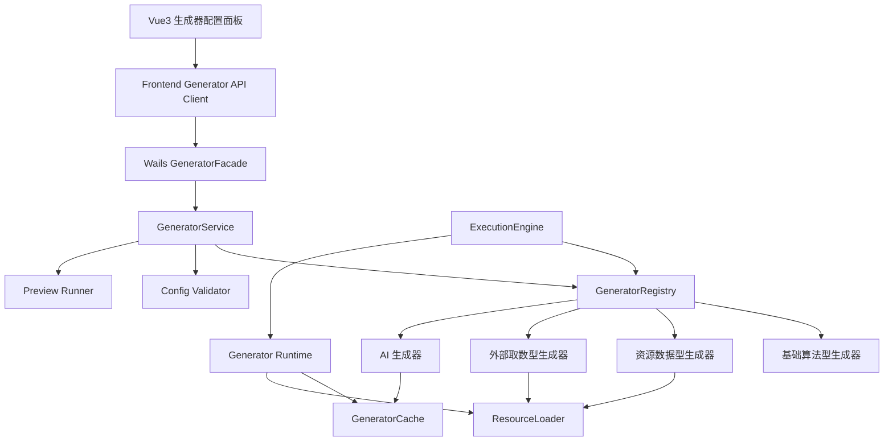
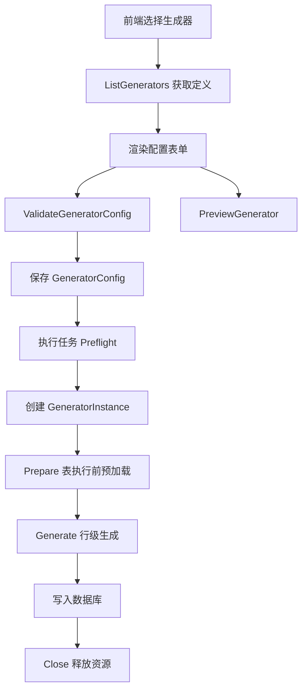

# 生成器可扩展机制设计

> 本文档聚焦 LoomiDBX 生成器体系的可扩展性设计。目标是在未来持续增加生成器时，尽量减少对既有执行引擎、Wails 绑定、前端主配置页面和数据模型的侵入。
>
> 本文中的“插件化”指代码组织和扩展机制上的低侵入，不表示 v1 要实现运行时动态加载插件、Go `.so` 插件或第三方插件市场。

---

## 1. 背景与目标

项目中已经包含近 30 个生成器，包括：

- 基础算法型生成器：整数序列、整数分布、正则字符串、UUID 等。
- 具体用途型生成器：地址、电话号码、姓名、邮箱、身份证号等。
- 外部取数型生成器：字典表、外部数据源等。
- 高级生成器：SQL 表达式、Python 表达式、AI 生成器等。

未来还会持续增加更多具体用途型生成器，例如：

- ISBN 号码；
- 学校名称；
- 医院名称；
- 公司名称；
- 银行卡号；
- 商品品类；
- 行业名称；
- 车牌号等。

因此生成器体系需要满足以下目标：

1. 新增生成器时，不修改执行引擎主流程。
2. 新增生成器时，不新增专属 Wails 绑定方法。
3. 新增普通生成器时，前端不需要新增专用配置页面。
4. 生成器参数继续存储在 `GeneratorConfig.params` JSON 中，不为每个生成器扩展数据库字段。
5. 支持生成器配置校验、预览、执行前预加载、缓存和行级生成。
6. 支持生成器帮助文档，用于前端展示用途、参数说明、示例和注意事项。
7. 支持生成器参数结构的版本演进，但避免陷入大量迁移脚本维护。

---

## 2. 设计边界

### 2.1 v1 不实现真正动态插件

当前不要求实现真正意义上的插件机制，例如：

- Go `.so` 插件；
- 第三方二进制插件；
- 运行时扫描外部代码包；
- 插件市场；
- 用户自行安装任意生成逻辑。

原因：

1. Go `.so` 插件跨平台能力有限，尤其不适合作为 Wails 桌面应用的主扩展路线。
2. 动态二进制插件会增加打包、签名、安全、崩溃隔离和版本兼容复杂度。
3. 当前核心问题是“新增生成器时减少代码侵入性”，不是“用户运行时安装外部代码”。

因此 v1 推荐采用 **内建生成器插件化**：

- 每个生成器独立成包；
- 通过统一接口接入运行时；
- 通过统一注册表暴露能力；
- 通过 JSON Schema 驱动前端配置；
- 通过通用 Wails Facade 提供列表、校验、预览等能力。

### 2.2 可作为长期技术探讨的插件路线

未来如果确实需要运行时扩展，可以优先考虑：

1. **资源包插件**：只扩展数据资源，不执行代码。例如学校名称数据包、地址库数据包。
2. **独立进程插件 / RPC 插件**：插件以单独进程运行，通过 JSON-RPC 或 gRPC 与主程序通信。
3. **Go `.so` 插件**：仅作为技术探讨，不建议作为主路线。

---

## 3. 总体架构

推荐架构如下：



核心思想：

- 后端通过 `GeneratorRegistry` 管理生成器。
- 每个生成器通过 `GeneratorDefinition` 描述自身元数据、参数结构、UI 提示、能力和帮助文档。
- 前端通过统一接口获取生成器定义，并使用 schema-driven 表单渲染参数。
- 复杂生成器可使用专用 Vue 组件覆盖默认表单。
- 执行引擎只依赖通用生命周期，不关心具体生成器类型。

---

## 4. 后端生成器接口

### 4.1 Generator 接口

每个生成器实现统一接口：

```go
type Generator interface {
    Definition() GeneratorDefinition

    // 配置保存或预览前使用，负责 params 结构校验和业务校验。
    ValidateConfig(ctx ValidateContext, params json.RawMessage) ([]ValidationIssue, error)

    // 创建运行时实例。
    NewInstance(ctx GeneratorInitContext, params json.RawMessage) (GeneratorInstance, error)
}
```

### 4.2 GeneratorInstance 接口

```go
type GeneratorInstance interface {
    // 表执行前调用。用于加载地址库、学校数据、外部数据快照、AI 候选池等。
    Prepare(ctx PrepareContext) error

    // 行级生成。该方法应尽量只做内存计算，不访问文件、数据库或网络。
    Generate(ctx GenerateContext) (Value, error)

    // 释放资源。
    Close() error
}
```

不需要预加载的生成器可以使用空实现：

```go
func (g *BaseGeneratorInstance) Prepare(ctx PrepareContext) error { return nil }
func (g *BaseGeneratorInstance) Close() error { return nil }
```

---

## 5. GeneratorRegistry

生成器通过注册表统一管理。

```go
type GeneratorRegistry interface {
    Register(generator Generator) error
    Get(name string) (Generator, bool)
    List() []GeneratorDefinition
}
```

使用显式注册内建生成器：

```go
func RegisterBuiltinGenerators(registry *Registry) {
    registry.MustRegister(sequentialint.New())
    registry.MustRegister(regexstring.New())
    registry.MustRegister(email.New())
    registry.MustRegister(phone.New())
    registry.MustRegister(address.New())
    registry.MustRegister(isbn.New())
    registry.MustRegister(schoolname.New())
}
```

这仍然需要在注册入口增加一行，但侵入范围很小，并且具有以下优点：

- 注册顺序可控；
- 更容易做 feature flag；
- 更容易做测试；
- 避免 `init()` 隐式副作用；
- 避免自动注册导致的排查困难。

如果未来生成器数量非常多，可以再引入按分类注册（现在不实现）：

```go
func RegisterBasicGenerators(registry *Registry) {}
func RegisterTextGenerators(registry *Registry) {}
func RegisterRegionalGenerators(registry *Registry) {}
func RegisterAdvancedGenerators(registry *Registry) {}
```

---

## 6. GeneratorDefinition

每个生成器需要提供完整定义，供后端运行时和前端配置页面共同使用。

```go
type GeneratorDefinition struct {
    Name             string                 `json:"name"`
    Label            string                 `json:"label"`
    Category         string                 `json:"category,omitempty"`
    Version          string                 `json:"version"`
    DataMappingTypes []DataMappingType      `json:"dataMappingTypes"`
    SupportedDbTypes []DbType               `json:"supportedDbTypes,omitempty"`

    ParameterSchema  map[string]any         `json:"parameterSchema"`
    UISchema         map[string]any         `json:"uiSchema,omitempty"`
    Help             *GeneratorHelp         `json:"help,omitempty"`
    Capabilities     GeneratorCapabilities  `json:"capabilities"`
    Resources        []GeneratorResource    `json:"resources,omitempty"`
}
```

### 6.1 能力声明

不同生成器对空值、唯一性、随机种子、预加载、网络访问等能力支持不同。不要在执行引擎中硬编码生成器名称，应通过能力声明处理。

```go
type GeneratorCapabilities struct {
    SupportsSeed     bool `json:"supportsSeed"`
    SupportsUnique   bool `json:"supportsUnique"`
    SupportsNull     bool `json:"supportsNull"`
    RequiresPrepare  bool `json:"requiresPrepare"`
    UsesExternalData bool `json:"usesExternalData"`
    IsDeterministic  bool `json:"isDeterministic"`
    SupportsPreview  bool `json:"supportsPreview"`
    SupportsBatch    bool `json:"supportsBatch"`
    MayCallNetwork   bool `json:"mayCallNetwork"`
}
```

示例：`isbn` 生成器：

```json
{
  "supportsSeed": true,
  "supportsUnique": true,
  "supportsNull": true,
  "requiresPrepare": false,
  "usesExternalData": false,
  "isDeterministic": true,
  "supportsPreview": true,
  "supportsBatch": false,
  "mayCallNetwork": false
}
```

示例：`ai_generator`：

```json
{
  "supportsSeed": false,
  "supportsUnique": false,
  "supportsNull": true,
  "requiresPrepare": true,
  "usesExternalData": true,
  "isDeterministic": false,
  "supportsPreview": true,
  "supportsBatch": true,
  "mayCallNetwork": true
}
```

---

## 7. 生成器帮助内容设计

### 7.1 不使用简单 description 字段

生成器帮助内容不仅要描述生成器作用，还需要支持：

- 多段文本；
- 参数说明；
- 有序列表；
- 无序列表；
- 示例；
- 注意事项；
- 链接；
- 未来 i18n 扩展。

因此使用独立字段 `GeneratorHelp`：

```go
type GeneratorHelp struct {
    Summary     LocalizedText   `json:"summary"`
    Content     LocalizedContent `json:"content"`
    Format      string          `json:"format"`
    Links       []HelpLink      `json:"links,omitempty"`
}
```

前端展示时可以把它渲染为：

- 生成器选择列表中的简短说明：使用 `help.summary`；
- 右侧帮助抽屉、弹窗或折叠面板：使用 `help.content`；
- 外部资料入口：使用 `help.links`。

### 7.2 帮助内容格式

 `help.content` 使用 Markdown 子集。

原因：

1. Markdown 适合技术说明、示例、列表和链接。
2. 生成器帮助内容主要由开发者维护，不是用户自由输入，安全风险可控。
3. Vue 前端已有成熟 Markdown 渲染方案。
4. 未来可以将 Markdown 文件抽离为独立资源，便于维护和翻译。

但前端渲染时必须限制 HTML：

- 禁用原始 HTML；
- 链接使用安全跳转；
- 外部链接打开前可提示；
- 仅允许安全 Markdown 语法。

### 7.3 i18n 设计（当前不实现，仅作为技术探讨）

不在生成器代码里只返回单一语言文案，而使用局部多语言结构。

```ts
type LocalizedText = Record<string, string>;

type GeneratorHelpDTO = {
  summary: LocalizedText;
  format: "markdown";
  content: LocalizedText;
  links?: Array<{
    label: LocalizedText;
    url: string;
  }>;
};
```

示例：

```json
{
  "summary": {
    "zh-CN": "生成符合 ISBN-10 或 ISBN-13 校验规则的图书编号。",
    "en-US": "Generate ISBN-10 or ISBN-13 book identifiers with valid check digits."
  },
  "format": "markdown",
  "content": {
    "zh-CN": "## 用途\n\n用于生成图书编号字段。\n\n## 参数说明\n\n- `version`：选择 ISBN-10 或 ISBN-13。\n- `separator`：控制输出是否包含连字符。\n\n## 示例\n\n- `978-7-111-xxxxx-x`\n- `9787111xxxxxx`\n\n## 注意事项\n\n1. 开启唯一性时，请确保生成空间足够大。\n2. ISBN 校验位由系统自动计算。",
    "en-US": "## Usage\n\nGenerate values for book identifier columns.\n\n## Parameters\n\n- `version`: ISBN-10 or ISBN-13.\n- `separator`: Whether to include hyphens."
  },
  "links": [
    {
      "label": {
        "zh-CN": "ISBN 说明",
        "en-US": "About ISBN"
      },
      "url": "https://en.wikipedia.org/wiki/ISBN"
    }
  ]
}
```

### 7.4 帮助内容放在哪里

有三种可选方案。

#### 方案 A：帮助内容直接由生成器 Definition 返回

优点：

- 前端一次 `ListGenerators()` 即可拿到全部信息；
- 生成器定义自包含；
- 实现简单。

缺点：

- 列表接口返回体可能较大；
- 长文案嵌在 Go 代码中可维护性较差；
- i18n 文案和生成器逻辑耦合较强。

#### 方案 B：Definition 返回帮助摘要，详情通过独立接口获取

列表接口返回：

```json
{
  "name": "isbn",
  "label": "ISBN",
  "help": {
    "summary": {
      "zh-CN": "生成符合 ISBN 校验规则的图书编号。"
    },
    "format": "markdown"
  }
}
```

详情接口：

```ts
GetGeneratorHelp(name: string, locale: string): Promise<GeneratorHelpContent>
```

优点：

- 列表接口轻量；
- 帮助文档可以独立懒加载；
- 更适合未来多语言和长文档。

缺点：

- 前端需要多一次请求；
- 接口稍复杂。

#### 方案 C：帮助内容以 Markdown 资源文件维护

目录示例：

```text
internal/generators/isbn/
  generator.go
  schema.json
  ui_schema.json
  help.zh-CN.md
  help.en-US.md
```

生成器 `Definition()` 只返回帮助文档资源标识：

```json
{
  "help": {
    "summary": {
      "zh-CN": "生成符合 ISBN 校验规则的图书编号。"
    },
    "format": "markdown",
    "contentRef": "generators/isbn/help"
  }
}
```

后端通过 `GetGeneratorHelp(name, locale)` 读取 Markdown 内容。

### 7.5 推荐方案

采用 **方案 B + 方案 C**：

1. `ListGenerators()` 返回帮助摘要 `help.summary`、格式 `help.format` 和可选 `help.contentRef`。
2. 前端打开帮助面板时，再调用 `GetGeneratorHelp(name, locale)` 获取完整 Markdown。
3. Markdown 文件与生成器包放在一起，作为生成器资源的一部分。
4. 前端按当前语言选择内容；如果缺失，回退到 `zh-CN` 或默认语言。

这可以兼顾：

- 列表接口轻量；
- 生成器帮助文档与生成器定义强关联；
- 文档不硬编码在 Go 代码中；
- i18n 易扩展；
- 未来可以把帮助文档从包内资源迁移到外部文档系统。

---

## 8. 前端 schema-driven 配置

### 8.1 通用配置面板

前端形成统一结构：

```text
GeneratorConfigPanel.vue
 ├─ GeneratorSelector.vue
 ├─ SchemaFormRenderer.vue
 ├─ GeneratorHelpPanel.vue
 ├─ GeneratorPreviewPanel.vue
 └─ AdvancedOptionsPanel.vue
```

职责：

| 组件 | 职责 |
|---|---|
| `GeneratorSelector` | 根据字段类型展示可用生成器 |
| `SchemaFormRenderer` | 根据 `parameterSchema + uiSchema` 自动渲染参数表单 |
| `GeneratorHelpPanel` | 展示生成器用途、参数说明、示例和链接 |
| `GeneratorPreviewPanel` | 调用通用预览接口展示样本 |
| `AdvancedOptionsPanel` | 根据 capabilities 展示 seed、unique、null 等通用选项 |

### 8.2 复杂生成器组件覆盖

普通生成器使用 `SchemaFormRenderer`。复杂生成器可以注册专用组件：

```ts
const customGeneratorComponents: Record<string, Component> = {
  address: AddressGeneratorConfig,
  external_data_source: ExternalDataSourceConfig,
  ai_generator: AIGeneratorConfig,
  regex_string: RegexStringConfig,
}
```

渲染逻辑：

```vue
<component
  v-if="customComponent"
  :is="customComponent"
  v-model="params"
  :definition="definition"
  :column="column"
/>

<SchemaFormRenderer
  v-else
  v-model="params"
  :schema="definition.parameterSchema"
  :ui-schema="definition.uiSchema"
/>
```

这样新增普通生成器时，前端主页面不需要修改。

---

## 9. Wails Facade 设计

不要为每个生成器暴露单独 Wails 方法。

不推荐：

```go
PreviewEmail()
PreviewPhone()
PreviewAddress()
PreviewISBN()
```

推荐暴露稳定的通用 Facade：

```go
type GeneratorFacade struct {
    service *GeneratorService
}

func (f *GeneratorFacade) ListGenerators() ([]GeneratorDefinitionDTO, error)
func (f *GeneratorFacade) GetGenerator(name string) (*GeneratorDefinitionDTO, error)
func (f *GeneratorFacade) GetGeneratorHelp(name string, locale string) (*GeneratorHelpContentDTO, error)
func (f *GeneratorFacade) ValidateGeneratorConfig(input ValidateGeneratorConfigInput) (*ValidateGeneratorConfigResult, error)
func (f *GeneratorFacade) PreviewGenerator(input PreviewGeneratorInput) (*PreviewGeneratorResult, error)
```

新增生成器时不需要新增 Wails 绑定方法。

---

## 10. 执行生命周期

统一生命周期如下：



| 阶段 | 后端能力 | 说明 |
|---|---|---|
| 获取定义 | `ListGenerators` | 给前端展示清单、schema、能力和帮助摘要 |
| 帮助详情 | `GetGeneratorHelp` | 前端打开帮助面板时懒加载 Markdown 内容 |
| 保存前校验 | `ValidateGeneratorConfig` | 校验 params、字段类型和约束兼容性 |
| 预览 | `PreviewGenerator` | 创建临时实例，生成少量样本 |
| 执行预检 | `Preflight` | 检查唯一性容量、外部资源、AI 成本等 |
| 表执行前 | `Prepare` | 加载地址库、学校名词库、外部数据、AI 候选池 |
| 行级生成 | `Generate` | 纯内存、快速、可重复 |
| 结束 | `Close` | 释放资源 |

---

## 11. 预加载与缓存

### 11.1 运行时上下文

生成器不应直接访问全局变量或自行管理复杂缓存，应通过运行时上下文获取资源和缓存能力。

```go
type GeneratorRuntimeContext struct {
    Registry       GeneratorRegistry
    ResourceLoader ResourceLoader
    Cache          GeneratorCache
    SecretProvider SecretProvider
    RandomFactory  RandomFactory
    Logger         Logger
}
```

### 11.2 缓存层级

| 缓存层级 | 生命周期 | 适用场景 |
|---|---|---|
| Instance cache | 单个生成器实例 | 顺序游标、随机状态 |
| Table cache | 当前表执行期间 | 表内共享候选集 |
| Task cache | 当前执行任务 | AI 候选池、外部数据快照 |
| Process cache | 应用进程生命周期 | 内嵌地址库、学校名库、行政区划 |
| Persistent cache | 跨应用重启 | 大型外部数据索引、用户上传文件摘要 |

v1 建议优先实现：

- `TaskCache`；
- `ProcessCache`。

### 11.3 典型缓存 key

地址资源：

```text
resource:address:china:v2026-01:<hash>
```

学校名称：

```text
resource:school_name:cn:v1:<hash>
```

AI 候选池：

```text
ai_generator:<column_id>:<prompt_hash>:<model>:<count>:<constraints_hash>
```

外部数据源：

```text
external_data_source:<source_type>:<file_id_or_url_hash>:<response_path>:<version>
```

---

## 12. 数据资源型生成器

地址、学校名称、医院名称、公司名称、职业、银行名称等都属于资源驱动型生成器。

建议将生成逻辑与数据资源分离。

目录示例：

```text
internal/generators/
  schoolname/
    generator.go
    schema.json
    ui_schema.json
    help.zh-CN.md
    help.en-US.md

resources/generators/
  schoolname/
    cn_universities.json
    cn_primary_schools.json
```

生成器声明资源依赖：

```go
type GeneratorResource struct {
    Name     string `json:"name"`
    Path     string `json:"path"`
    Version  string `json:"version"`
    Hash     string `json:"hash,omitempty"`
    Required bool   `json:"required"`
}
```

`Prepare()` 里通过 `ResourceLoader` 加载：

```go
func (g *SchoolNameInstance) Prepare(ctx PrepareContext) error {
    dataset, err := ctx.Resources.LoadDataset("schoolname.cn_universities")
    if err != nil {
        return err
    }
    g.schools = dataset.Values
    return nil
}
```

行级 `Generate()` 只从内存中的 `g.schools` 取值。

---

## 13. 版本管理与兼容性

### 13.1 不要过度版本化

生成器版本管理的目标是保证旧配置可用，而不是为每次小改动都写迁移脚本。

不建议：

- 每次新增参数都提升配置版本；
- 每次调整 UI 展示都提升配置版本；
- 为所有历史版本长期维护复杂迁移链；
- 让全局数据库迁移承担所有生成器 params 的迁移。

推荐区分三种版本：

| 版本类型 | 是否需要迁移 | 示例 |
|---|---|---|
| 代码版本 | 通常不需要 | 优化随机算法、修复 bug |
| schema 版本 | 可能需要 | 参数字段重命名、结构嵌套变化 |
| 资源版本 | 通常不迁移 params | 地址库、学校库数据更新 |

### 13.2 优先使用兼容解析，而不是迁移脚本

最佳实践是：**读取旧配置时兼容解析，保存时写入新结构**。

例如旧配置：

```json
{
  "province": "浙江"
}
```

新配置：

```json
{
  "region": {
    "province": "浙江"
  }
}
```

生成器解析时可以兼容两种结构：

```go
func parseAddressParams(raw json.RawMessage) (AddressParams, error) {
    var v2 AddressParamsV2
    if err := json.Unmarshal(raw, &v2); err == nil && v2.Region.Province != "" {
        return fromV2(v2), nil
    }

    var v1 AddressParamsV1
    if err := json.Unmarshal(raw, &v1); err == nil {
        return fromV1(v1), nil
    }

    return AddressParams{}, ErrInvalidParams
}
```

前端或后端保存配置时统一写入新结构。这样不需要对数据库中所有历史 `GeneratorConfig` 立即批量迁移。

### 13.3 使用默认值避免迁移

如果只是新增参数，并且可以提供默认值，不需要迁移。

例如 `isbn` 新增参数：

```json
{
  "separator": "hyphen"
}
```

旧配置没有该字段时，解析时使用默认值即可。

```go
if params.Separator == "" {
    params.Separator = "hyphen"
}
```

### 13.4 尽量避免破坏性字段重命名

相比：

```json
{
  "prefix": "978"
}
```

改成：

```json
{
  "isbnPrefix": "978"
}
```

更推荐保留旧字段，或者让新字段成为别名。生成器参数是持久化配置，字段命名一旦发布应尽量稳定。

### 13.5 使用 `schemaVersion`，但只在破坏性变更时升级

可以在 `params` 中保留内部版本字段：

```json
{
  "schemaVersion": 1,
  "version": "isbn13",
  "prefix": "978"
}
```

但不要频繁升级。

建议规则：

1. 新增可选字段：不升级。
2. 新增字段且有默认值：不升级。
3. UI 展示调整：不升级。
4. 修复生成算法 bug：通常不升级，但在 release note 中说明。
5. 字段重命名、结构调整、语义变化：升级。
6. 删除字段：尽量避免；确需删除时升级。

### 13.6 迁移函数放在生成器内部

如果确实需要迁移，不建议把每个生成器的 params 迁移全部塞进全局数据库 migration。

推荐由生成器提供局部迁移能力：

```go
type ConfigMigrator interface {
    MigrateParams(fromVersion int, params json.RawMessage) (json.RawMessage, error)
}
```

迁移时机可以是：

1. 读取配置时发现旧版本，内存中迁移后使用；
2. 用户打开并保存配置时，写回新版本；
3. 提供“升级所有生成器配置”的维护任务，但不作为每次启动的必经流程。

### 13.7 只维护有限历史版本

对于长期维护，建议制定策略：

- 当前版本 `N` 必须支持；
- 上一个主要版本 `N-1` 必须支持；
- 更老版本可通过一次性 legacy migrator 迁移；
- 不保证无限期维护所有历史版本的直接解析。

可以在生成器定义中声明：

```json
{
  "version": "2.0.0",
  "configSchemaVersion": 2,
  "minReadableConfigSchemaVersion": 1
}
```

如果发现配置版本过旧，后端返回明确错误：

```text
GENERATOR_CONFIG_VERSION_UNSUPPORTED
```

并提示用户重新配置或执行升级。

### 13.8 推荐结论

版本管理的最佳实践是：

1. 参数结构先设计稳定，不轻易破坏性修改。
2. 新增参数优先使用默认值，避免迁移。
3. 读取时兼容旧结构，保存时写新结构。
4. 迁移逻辑放在生成器内部，不污染全局迁移。
5. 只在破坏性变更时提升 `schemaVersion`。
6. 只维护有限历史版本。

---

## 14. 新增生成器流程

### 14.1 普通生成器

例如新增 `isbn`：

```text
internal/generators/isbn/
  generator.go
  schema.json
  ui_schema.json
  help.zh-CN.md
  help.en-US.md
```

工作项：

1. 实现 `Generator` 和 `GeneratorInstance`。
2. 提供 `GeneratorDefinition`。
3. 提供参数 JSON Schema。
4. 提供帮助文档 Markdown。
5. 在内建生成器注册入口注册。
6. 添加生成器单元测试。

不需要修改：

- 执行引擎主流程；
- `GeneratorConfig` 数据模型；
- Wails 绑定方法；
- 前端主配置页面；
- 通用预览 API；
- 通用保存 API。

### 14.2 复杂生成器

例如新增复杂的外部资源类生成器：

1. 完成普通生成器全部工作项。
2. 如有复杂交互，新增专用 Vue 配置组件。
3. 在前端 `customGeneratorComponents` 注册组件映射。
4. 如需要资源预加载，声明 `RequiresPrepare` 和 `Resources`。

---

## 15. 推荐落地顺序

### 第一阶段：后端扩展基础

1. 实现 `GeneratorRegistry`。
2. 定义 `Generator` / `GeneratorInstance`。
3. 定义 `GeneratorDefinition`、`GeneratorCapabilities`、`GeneratorHelp`。
4. 将现有生成器逐步迁移到统一接口。
5. 改造执行引擎，使其只依赖注册表和生命周期。

### 第二阶段：Wails 通用接口

1. `ListGenerators()`。
2. `GetGenerator(name)`。
3. `GetGeneratorHelp(name, locale)`。
4. `ValidateGeneratorConfig(input)`。
5. `PreviewGenerator(input)`。

### 第三阶段：前端 schema-driven UI

1. `GeneratorConfigPanel`。
2. `SchemaFormRenderer`。
3. `GeneratorHelpPanel`。
4. `GeneratorPreviewPanel`。
5. `customGeneratorComponents` 覆盖机制。

### 第四阶段：资源加载和缓存

1. `ResourceLoader`。
2. `GeneratorCache`。
3. 内嵌资源数据读取。
4. Task cache 和 Process cache。

### 第五阶段：生成器版本兼容

1. `schemaVersion` 约定。
2. 默认值策略。
3. 兼容解析策略。
4. 可选 `ConfigMigrator`。

---

## 16. 最终结论

LoomiDBX 生成器体系推荐采用：

> 生成器注册表 + 标准生命周期 + JSON Schema 参数定义 + Markdown 帮助文档 + schema-driven 前端表单 + 通用 Wails Facade + 兼容解析优先的版本策略。

这套方案可以让未来新增生成器时主要集中在新增生成器包自身，而不影响已有执行引擎、API 契约、前端主配置页面和数据模型。
