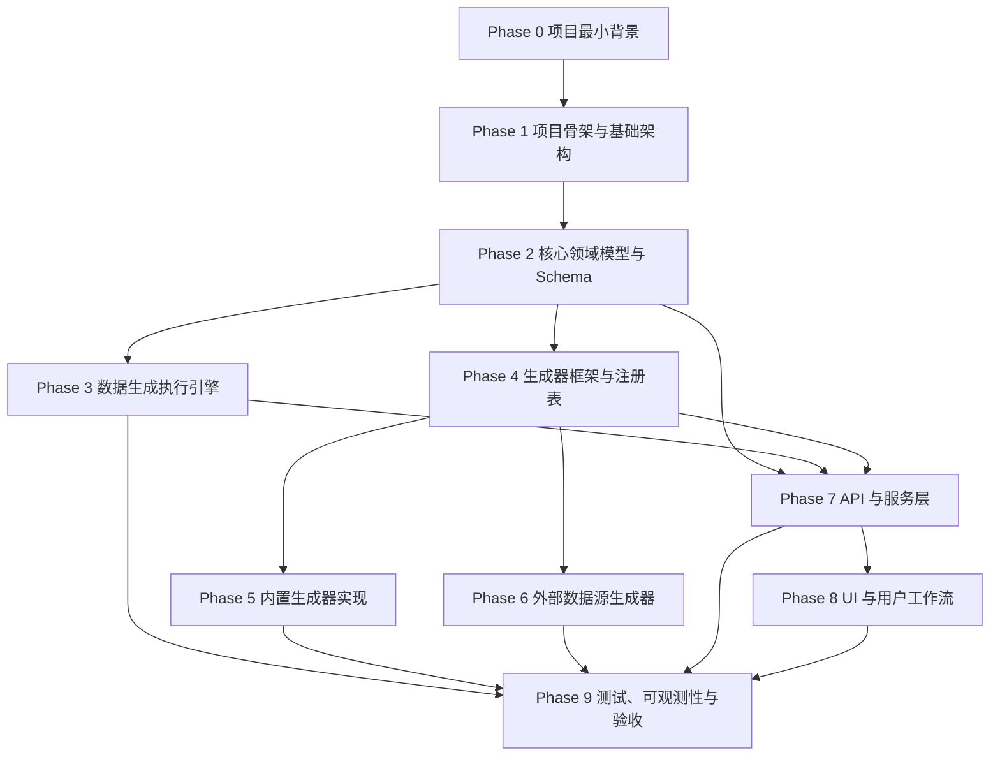

# LoomiDBX 开发 Phase 划分与文档索引

本文是 LoomiDBX 后续使用 GitHub Spec-Kit 进行 spec 规划的阶段依据。它不替代专题文档，而是用于定义开发顺序、阶段边界和每个阶段应读取的最小必要上下文。

## 使用方式

1. 先根据当前开发目标定位 Phase。
2. 阅读对应 `agent` 阶段文档。
3. 在 Spec-Kit 中按“建议 spec 拆分”创建任务级 spec。
4. 每个 spec 只引用当前阶段所需文档，不默认读取全部 `docs`。
5. 若某个 spec 需要跨阶段依赖，应在 spec 中显式声明依赖和非目标。

## Phase 总表

| Phase | 阶段名称 | 核心任务 | 主要文档索引 | Agent 阶段文档 | 建议 Spec-Kit 拆分 |
|---:|---|---|---|---|---|
| 0 | 项目最小背景 | 明确产品定位、用户、核心价值、当前范围、非目标、术语 | [product_outline.md](./product_outline.md)<br>[user-store-map.md](./user-store-map.md)<br>[user-stories.md](./user-stories.md) | [agent/00-project-brief.md](./agent/00-project-brief.md) | project-brief<br>glossary<br>scope-and-non-goals |
| 1 | 项目骨架与基础架构 | 建立工程结构、模块边界、配置体系、测试工具链、数据库方言抽象接口 | [product_outline.md](./product_outline.md)<br>[database-dialect-abstraction-design.md](./database-dialect-abstraction-design.md)<br>[api-contract.md](./api-contract.md)<br>[settings_login.md](./settings_login.md) | [agent/01-architecture-bootstrap.md](./agent/01-architecture-bootstrap.md) | project-structure<br>config-system<br>local-storage-strategy<br>database-dialect-interface<br>test-tooling |
| 2 | 核心领域模型与 Schema | 定义连接、数据库对象、Schema、表、字段、约束、关系、字段规则、Project、GenerationJob | [data-model.md](./data-model.md)<br>[user-stories.md](./user-stories.md)<br>[product_outline.md](./product_outline.md)<br>[database-dialect-abstraction-design.md](./database-dialect-abstraction-design.md) | [agent/02-domain-model-and-schema.md](./agent/02-domain-model-and-schema.md) | connection-model<br>database-schema-model<br>table-field-constraint-model<br>relation-model<br>field-generation-rule-model<br>project-model<br>generation-job-model |
| 3 | 数据生成执行引擎 | 实现执行生命周期、执行计划、拓扑排序、行数规划、生成上下文、批处理生成和写入 | [engine-1-architecture.md](./engine-1-architecture.md)<br>[engine-2-topology.md](./engine-2-topology.md)<br>[engine-3-execution.md](./engine-3-execution.md)<br>[data-model.md](./data-model.md)<br>[database-dialect-abstraction-design.md](./database-dialect-abstraction-design.md) | [agent/03-generation-engine.md](./agent/03-generation-engine.md) | execution-lifecycle<br>dependency-graph-and-topological-sort<br>row-count-planning<br>generation-context<br>batch-generation-loop<br>batch-writer-adapter<br>execution-result-and-error-model |
| 4 | 生成器框架与注册表 | 定义生成器接口、上下文、结果、元数据、参数 Schema、注册表、基础校验和查询能力 | [generator-extensibility-design.md](./generator-extensibility-design.md)<br>[generators_manual.md](./generators_manual.md)<br>[generators_check_rules.md](./generators_check_rules.md)<br>[data-model.md](./data-model.md) | [agent/04-generator-registry-and-contract.md](./agent/04-generator-registry-and-contract.md) | generator-interface<br>generator-definition-schema<br>generator-registry<br>generator-parameter-validation<br>generator-metadata-query<br>generator-contract-tests |
| 5 | 内置生成器实现 | 按类别实现字符串、数字、布尔、日期时间、枚举、ID、关系、计算字段等内置生成器 | [generators_manual.md](./generators_manual.md)<br>[generators_check_rules.md](./generators_check_rules.md)<br>[generator-extensibility-design.md](./generator-extensibility-design.md)<br>[computed-field-research.md](./computed-field-research.md) | [agent/05-built-in-generators.md](./agent/05-built-in-generators.md) | string-generators<br>number-generators<br>boolean-generators<br>datetime-generators<br>enum-generators<br>id-generators<br>relation-generators<br>computed-field-generators |
| 6 | 外部数据源生成器 | 实现静态列表、CSV、HTTP、数据库等外部取数型生成器，以及加载、缓存、采样、预览和校验 | [external-data-generators-design.md](./external-data-generators-design.md)<br>[generator-extensibility-design.md](./generator-extensibility-design.md)<br>[generators_check_rules.md](./generators_check_rules.md)<br>[database-dialect-abstraction-design.md](./database-dialect-abstraction-design.md) | [agent/06-external-data-generators.md](./agent/06-external-data-generators.md) | external-source-config-model<br>static-list-source-generator<br>csv-source-generator<br>http-source-generator<br>database-source-generator<br>external-source-validation-and-preview |
| 7 | API 与服务层 | 实现连接、Schema、字段规则、Project、生成任务、生成器元数据、执行历史等 API 与服务编排 | [api-contract.md](./api-contract.md)<br>[data-model.md](./data-model.md)<br>[user-stories.md](./user-stories.md)<br>[engine-4-observability.md](./engine-4-observability.md)<br>[generator-extensibility-design.md](./generator-extensibility-design.md) | [agent/07-api-and-service-layer.md](./agent/07-api-and-service-layer.md) | connection-api<br>schema-introspection-api<br>field-rule-api<br>project-api<br>generator-metadata-api<br>generation-job-api<br>execution-history-api<br>error-response-contract |
| 8 | UI 与用户工作流 | 实现 App Shell、登录、首页、项目管理、Schema 管理、设置、字段规则编辑和生成进度视图 | [agentic-ui-dsl.md](./agentic-ui-dsl.md)<br>[api-contract.md](./api-contract.md)<br>[user-stories.md](./user-stories.md)<br>[ui-dsl/login.dsl.yaml](./ui-dsl/login.dsl.yaml)<br>[ui-dsl/index.dsl.yaml](./ui-dsl/index.dsl.yaml)<br>[ui-dsl/projects.dsl.yaml](./ui-dsl/projects.dsl.yaml)<br>[ui-dsl/schema.dsl.yaml](./ui-dsl/schema.dsl.yaml)<br>[ui-dsl/settings.dsl.yaml](./ui-dsl/settings.dsl.yaml) | [agent/08-ui-and-workflows.md](./agent/08-ui-and-workflows.md) | app-shell-and-routing<br>login-page<br>home-page<br>projects-page<br>schema-management-page<br>settings-page<br>field-rule-editor<br>generation-job-progress-view |
| 9 | 测试、可观测性与验收 | 补齐测试分层、生成器契约测试、引擎集成测试、API 契约测试、UI 工作流测试、执行历史、日志和发布验收 | [engine-4-observability.md](./engine-4-observability.md)<br>[api-contract.md](./api-contract.md)<br>[generators_check_rules.md](./generators_check_rules.md)<br>[user-stories.md](./user-stories.md)<br>[engine-1-architecture.md](./engine-1-architecture.md)<br>[engine-2-topology.md](./engine-2-topology.md)<br>[engine-3-execution.md](./engine-3-execution.md) | [agent/09-testing-and-validation.md](./agent/09-testing-and-validation.md) | unit-test-strategy<br>generator-contract-tests<br>engine-integration-tests<br>api-contract-tests<br>ui-workflow-tests<br>execution-history-and-progress<br>error-reporting-and-logging<br>release-acceptance-checklist |

## 阶段依赖关系



## Spec-Kit 使用建议

### 命名建议

建议在 Spec-Kit 中使用稳定的 phase 前缀：

```text
phase-00-project-brief
phase-01-architecture-bootstrap
phase-02-domain-model-and-schema
phase-03-generation-engine
phase-04-generator-registry-and-contract
phase-05-built-in-generators
phase-06-external-data-generators
phase-07-api-and-service-layer
phase-08-ui-and-workflows
phase-09-testing-and-validation
```

具体 spec 可使用：

```text
phase-04-generator-registry-and-contract/generator-interface
phase-04-generator-registry-and-contract/generator-registry
phase-05-built-in-generators/string-generators
```

### 每个 spec 应显式声明

- 所属 Phase。
- 需要阅读的 `agent` 阶段文档。
- 必须阅读的专题文档片段。
- 当前任务范围。
- 非目标。
- 验收标准。
- 测试要求。
- 与前置 phase 的依赖。

### 控制上下文的规则

- Phase 5 的每个 spec 只实现一个生成器类别。
- Phase 8 的每个 spec 只读取一个 UI DSL 文件。
- Phase 7 的每个 spec 只实现一个资源或一组紧密相关 API。
- Phase 9 优先针对已有模块补测试，不借测试阶段扩大产品范围。
- AI 方案暂不进入首发主线；如后续纳入，建议单独扩展为 Phase 10。

## 暂缓进入主线的文档

以下文档目前作为专题知识保留，不建议进入首发开发主线，除非某个 spec 明确要求：

| 文档 | 建议处理 |
|---|---|
| [ai-generator-design.md](./ai-generator-design.md) | 暂缓。后续可扩展为 AI 生成 Phase 或插件能力 |
| [execution-engine.md](./execution-engine.md) | 若与 `engine-1/2/3/4` 重叠，优先使用拆分后的 engine 文档；必要时作为补充参考 |
| [generators_manual_simplify.md](./generators_manual_simplify.md) | 可作为生成器清单速读版，但 Source of Truth 仍建议使用 `generators_manual.md` |
| [thinks_data_model.md](./thinks_data_model.md) | 可作为数据模型研究笔记，不作为实现契约 |
| [ui-prototype/](./ui-prototype/) | UI 阶段可用于视觉参考，但实现应优先遵循 `ui-dsl/*` 的语义意图 |
