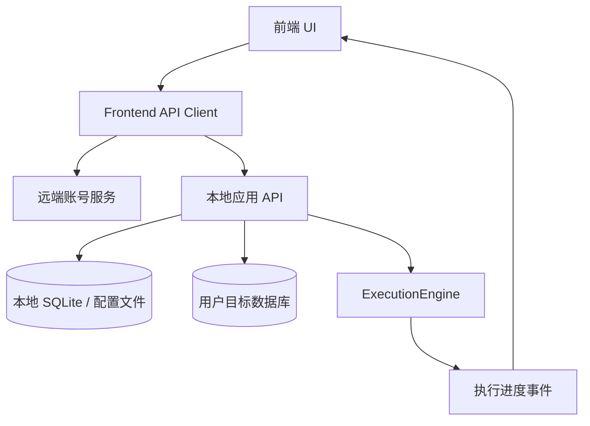
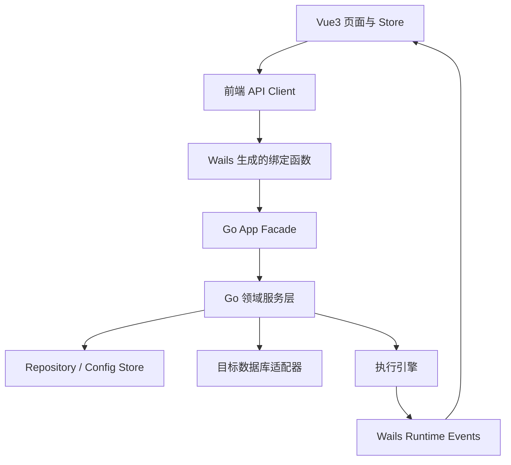

# LoomiDBX · API 契约设计

> 专题 9：API 契约设计  
> 依赖文档：产品大纲、数据模型、UI/UX DSL、系统设置与账号说明、执行引擎设计

---

## 1. 范围与目标

本文定义 LoomiDBX 的 API 契约方案。契约服务于 UI、应用后端、本地存储、目标数据库适配器和远端账号服务之间的协作。

LoomiDBX 是桌面端应用。因此，本文中的 API 不限定为公网 HTTP API。推荐先定义传输无关的服务契约，再映射到具体实现。

| 实现形态 | 契约映射 |
|---|---|
| Wails（Go + Vue3） | Go Service / App Method + Wails Binding + Event |
| Tauri | Command + Event |
| Electron | IPC Channel |
| 本地 HTTP 服务 | REST + SSE |
| 纯本地前端服务层 | TypeScript Service Interface |

本项目优先采用 Wails。推荐做法是：先在 Go 后端设计清晰的服务层契约，再由 Wails 将少量 Facade 方法绑定给 Vue3 前端调用。不要把所有业务逻辑直接写在 Wails 绑定方法中。

核心目标：

- 让 UI DSL 中的页面数据源和用户动作有稳定接口承载。
- 让本地业务数据、目标数据库访问和远端账号能力边界清晰。
- 让执行引擎的预检、执行、进度和历史记录形成完整闭环。
- 让隐私边界明确，避免上传数据库连接、Schema、生成配置和生成数据。

---

## 2. 总体架构



系统后端可拆为三类能力。

### 2.1 远端账号服务

负责登录、注册、OAuth、会话刷新和遥测上报。

远端账号服务不接收以下信息：

- 数据库连接信息。
- Schema、表、字段和约束信息。
- 生成器配置。
- Project 配置。
- 生成数据内容。
- 用户编写的 SQL。

### 2.2 本地应用服务

负责本地业务数据读写，包括：

- 连接管理。
- Schema 扫描缓存。
- 字段生成规则。
- 逻辑表关系。
- Project 配置。
- 执行历史。
- 系统设置。

本地应用服务主要读写本地 SQLite 和配置文件。

### 2.3 目标数据库适配服务

负责访问用户配置的目标数据库，包括：

- 测试连接。
- 扫描 Schema。
- 预检阶段执行必要查询。
- 执行阶段写入生成数据。

目标数据库访问必须由用户操作显式触发。

### 2.4 Wails 实现建议

本项目使用 Wails 连接 Go 后端和 Vue3 前端。Wails 的典型方式不是在本地启动一套 REST 服务，而是把 Go 结构体方法绑定给前端。前端通过 Wails 生成的 JavaScript / TypeScript 函数调用这些方法。

因此，本文中的 HTTP 路径应视为“语义映射”，不是必须实现的网络接口。推荐实现路径如下：



推荐分层：

| 层级 | 职责 |
|---|---|
| Vue3 页面 | 渲染页面、管理局部交互状态 |
| 前端 API Client | 封装 Wails 绑定函数，隐藏调用细节 |
| Wails App Facade | 暴露少量稳定方法给前端 |
| Go Service | 承载业务规则和事务边界 |
| Repository / Adapter | 访问本地 SQLite、配置文件和目标数据库 |
| ExecutionEngine | 执行生成任务并发布进度事件 |

建议不要把业务逻辑直接写在 Wails 绑定方法中。绑定方法只做参数接收、调用服务、返回 DTO 和错误转换。

推荐 Go 侧结构示例：

```go
type App struct {
    Auth       *AuthFacade
    Settings   *SettingsFacade
    Connection *ConnectionFacade
    Schema     *SchemaFacade
    Project    *ProjectFacade
    Execution  *ExecutionFacade
}
```

前端调用方式示例：

```ts
import { GetSettings, UpdateSettings } from "../../wailsjs/go/main/SettingsFacade";

export async function getSettings() {
  return await GetSettings();
}
```

这种方式符合 Wails 的常见开发方式。它的优点是简单、类型清晰、没有本地 HTTP 服务开销。若未来需要对外提供 HTTP API，可以在 Go Service 之上再增加 HTTP Adapter，而不影响现有业务层。

Wails 事件适合承载执行进度、日志和长任务状态变化。建议使用事件名称统一前缀，例如：

```txt
execution:task-started
execution:table-started
execution:batch-completed
execution:table-completed
execution:table-skipped
execution:validation-warning
execution:task-completed
```

前端通过 Wails runtime 订阅这些事件。

---

## 3. 设计原则

### 3.1 页面驱动，但不被页面绑定

UI DSL 中的 `data.source` 和 `interactions.intent` 是 API 设计的重要输入。

| DSL 字段 | API 含义 |
|---|---|
| `data.source` | 查询资源，例如 `projects`、`connection-tree`、`table-schema` |
| `data.mutable: true` | 该资源需要写接口 |
| `intent: submit` | 创建或更新 |
| `intent: delete-*` | 删除 |
| `intent: run-project` | 启动执行流程 |
| `intent: toggle-theme` / `language-switch` | 更新本地设置 |
| `intent: select-item` | 通常是前端状态；必要时触发详情加载 |

API 不应只绑定当前页面。相同领域数据应复用同一资源模型。

### 3.2 契约优先于传输

本文优先定义资源、请求、响应、错误和事件。HTTP 路径只是推荐映射。

例如：

```ts
settings.get(): Promise<AppSettings>;
settings.update(input: UpdateSettingsInput): Promise<AppSettings>;
```

可以映射为：

```http
GET /api/settings
PUT /api/settings
```

也可以映射为 Wails 绑定方法、Tauri command 或 Electron IPC。

### 3.3 后端负责业务规则

复杂业务规则不应放在前端重复实现。

典型规则：

- `ProjectTable.row_count` 的合法性由后端按 D-05 状态机计算。
- Project 保存时由后端计算 `execution_order`。
- Schema 重扫后由后端标记受影响的 `GeneratorConfig`。
- 执行前预检由执行引擎统一完成。

### 3.4 隐私默认安全

默认不上传本地业务数据。遥测事件只能包含产品使用信息和环境信息。

---

## 4. 通用规范

### 4.1 响应结构

推荐统一响应结构。

```ts
type ApiResponse<T> =
  | {
      ok: true;
      data: T;
      requestId: string;
    }
  | {
      ok: false;
      error: ApiError;
      requestId: string;
    };

type ApiError = {
  code: string;
  message: string;
  details?: unknown;
  fieldErrors?: Record<string, string>;
};
```

`message` 面向用户展示。`details` 仅用于调试，不应默认暴露到 UI。

### 4.2 分页结构

```ts
type PageResult<T> = {
  items: T[];
  page: number;
  pageSize: number;
  total: number;
};
```

### 4.3 ID 与时间

- API 层 ID 使用字符串，避免前端处理大整数精度问题。
- 时间统一使用 ISO 8601 字符串。
- 本地数据库可以继续使用 BIGINT 主键。

### 4.4 常用错误码

| 错误码 | 说明 |
|---|---|
| `VALIDATION_FAILED` | 请求参数校验失败 |
| `NOT_FOUND` | 资源不存在 |
| `CONFLICT` | 资源冲突，例如名称重复 |
| `UNAUTHORIZED` | 未登录或会话过期 |
| `FORBIDDEN` | 无权执行该操作 |
| `CONNECTION_FAILED` | 数据库连接失败 |
| `SCAN_FAILED` | Schema 扫描失败 |
| `GENERATOR_CONFIG_INVALID` | 生成器配置无效 |
| `PROJECT_PLAN_INVALID` | Project 执行计划无效 |
| `EXECUTION_BLOCKED` | 执行预检存在阻塞错误 |
| `EXECUTION_FAILED` | 执行失败 |
| `SETTINGS_INVALID` | 系统设置无效 |
| `INTERNAL_ERROR` | 未预期错误 |

---

## 5. Auth API

登录页使用统一认证表单。后端根据邮箱是否存在决定登录还是注册。

### 5.1 邮箱密码登录 / 注册合一

```http
POST /api/auth/upsert
```

请求：

```json
{
  "email": "user@example.com",
  "password": "password",
  "rememberSession": true
}
```

响应：

```json
{
  "user": {
    "id": "usr_123",
    "email": "user@example.com",
    "displayName": "User",
    "emailVerified": false
  },
  "session": {
    "accessToken": "access-token",
    "refreshToken": "refresh-token",
    "expiresAt": "2026-06-05T12:00:00Z"
  },
  "isNewUser": true
}
```

规则：

- 前端不提供登录 / 注册模式切换。
- `isNewUser` 可用于后续引导，但当前 UI 不依赖它。
- 会话 token 可持久化到本地安全存储。

### 5.2 OAuth

```http
POST /api/auth/oauth/start
POST /api/auth/oauth/callback
```

请求：

```json
{
  "provider": "google"
}
```

枚举：

```ts
type OAuthProvider = "google" | "github";
```

### 5.3 会话

```http
GET  /api/auth/session
POST /api/auth/refresh
POST /api/auth/sign-out
```

`sign-out` 对应侧边栏退出登录动作。

---

## 6. Settings API

系统设置是本地配置，和具体数据库连接或 Project 无关。

### 6.1 读取设置

```http
GET /api/settings
```

响应：

```json
{
  "storage": {
    "type": "sqlite",
    "sqlitePath": "/Users/me/Library/Application Support/LoomiDBX/app.db"
  },
  "llm": {
    "baseUrl": "https://api.openai.com/v1",
    "apiKeyConfigured": true,
    "modelName": "gpt-4.1"
  },
  "appearance": {
    "theme": "light",
    "language": "zh"
  },
  "privacy": {
    "telemetryEnabled": true,
    "policyVersion": "2026-01"
  }
}
```

注意：接口不返回明文 `apiKey`。

### 6.2 保存设置

```http
PUT /api/settings
```

请求：

```json
{
  "storage": {
    "sqlitePath": "/absolute/path/loomidbx.db"
  },
  "llm": {
    "baseUrl": "https://api.example.com/v1",
    "apiKey": "secret",
    "modelName": "deepseek-chat"
  },
  "appearance": {
    "theme": "dark",
    "language": "zh"
  }
}
```

校验规则：

- `sqlitePath` 必须是绝对路径。
- `apiKey` 必须加密保存。
- `theme` 只能是 `light` 或 `dark`。
- `language` 只能是 `zh` 或 `en`。

### 6.3 迁移本地存储

```http
POST /api/settings/storage/migrate
```

请求：

```json
{
  "targetPath": "/absolute/path/new.db",
  "copyExistingData": true
}
```

MVP 阶段只建议支持 SQLite 路径迁移。外部数据库作为应用配置存储可放到后续版本。

### 6.4 选择存储路径

桌面端应调用 OS 原生文件选择器。

服务契约：

```ts
settings.pickStoragePath(): Promise<{ path: string | null }>;
```

Wails 映射建议：

```go
func (f *SettingsFacade) PickStoragePath() (*PickPathResult, error)
```

HTTP 映射可作为未来适配器：

```http
POST /api/system/dialogs/pick-storage-path
```

### 6.5 测试 LLM 配置

```http
POST /api/settings/llm/test
```

请求：

```json
{
  "baseUrl": "https://api.example.com/v1",
  "apiKey": "secret",
  "modelName": "deepseek-chat"
}
```

响应：

```json
{
  "reachable": true,
  "latencyMs": 320,
  "message": "LLM 服务连接正常"
}
```

---

## 7. Connection API

连接管理负责保存目标数据库连接配置。密码只允许写入，不允许明文读出。

### 7.1 数据类型

```ts
type DbType =
  | "mysql"
  | "postgresql"
  | "oracle"
  | "mssql"
  | "sqlite"
  | "clickhouse"
  | "hive";

type ConnectionDTO = {
  id: string;
  name: string;
  dbType: DbType;
  host: string;
  port: number;
  initialCatalog?: string | null;
  username: string;
  passwordConfigured: boolean;
  extraParams?: Record<string, unknown>;
  status: "connected" | "disconnected" | "unknown";
  createdAt: string;
  updatedAt: string;
};
```

### 7.2 CRUD

```http
GET    /api/connections
POST   /api/connections
GET    /api/connections/{connectionId}
PUT    /api/connections/{connectionId}
DELETE /api/connections/{connectionId}
```

创建请求：

```json
{
  "name": "Local PostgreSQL",
  "dbType": "postgresql",
  "host": "localhost",
  "port": 5432,
  "initialCatalog": "demo",
  "username": "postgres",
  "password": "secret",
  "extraParams": {
    "sslMode": "disable"
  }
}
```

### 7.3 测试连接

测试未保存连接：

```http
POST /api/connections/test
```

测试已保存连接：

```http
POST /api/connections/{connectionId}/test
```

响应：

```json
{
  "reachable": true,
  "latencyMs": 48,
  "message": "连接成功"
}
```

### 7.4 连接与断开

```http
POST /api/connections/{connectionId}/connect
POST /api/connections/{connectionId}/disconnect
```

这两个接口主要服务 Schema 树右键菜单。

---

## 8. Schema API

Schema API 负责连接树、表结构详情、扫描和重扫。

### 8.1 查询连接树

```http
GET /api/schema/tree
```

查询参数：

```ts
type SchemaTreeQuery = {
  connectedOnly?: boolean;
  keyword?: string;
};
```

响应节点：

```ts
type SchemaTreeNode =
  | {
      type: "connection";
      id: string;
      name: string;
      dbType: DbType;
      status: "connected" | "disconnected";
      children?: SchemaTreeNode[];
    }
  | {
      type: "catalog";
      id: string;
      name: string;
      scannedAt?: string | null;
      children?: SchemaTreeNode[];
    }
  | {
      type: "schema";
      id: string;
      name: string;
      scannedAt?: string | null;
      children?: SchemaTreeNode[];
    }
  | {
      type: "table";
      id: string;
      name: string;
      comment?: string | null;
      scannedAt?: string | null;
    };
```

### 8.2 扫描与重扫

```http
POST /api/connections/{connectionId}/scan
POST /api/catalogs/{catalogId}/scan
POST /api/schemas/{schemaId}/scan
POST /api/tables/{tableId}/rescan
```

表重扫响应：

```json
{
  "tableId": "tbl_1",
  "changedColumns": [
    {
      "columnId": "col_9",
      "columnName": "email",
      "changeType": "data_type_changed",
      "previous": "varchar(100)",
      "current": "varchar(255)",
      "generatorConfigStatus": "NEEDS_REVIEW"
    }
  ],
  "removedColumns": [],
  "addedColumns": []
}
```

### 8.3 查询表结构详情

```http
GET /api/tables/{tableId}/schema
```

响应：

```ts
type TableSchemaDTO = {
  table: {
    id: string;
    schemaId: string;
    tableName: string;
    comment?: string | null;
    ddlSnapshot?: string | null;
    scannedAt?: string | null;
  };
  columns: ColumnDTO[];
  constraints: TableConstraintDTO[];
  foreignKeys: ForeignKeyDTO[];
  logicalRelations: TableRelationDTO[];
};

type ColumnDTO = {
  id: string;
  tableId: string;
  ordinalPosition: number;
  columnName: string;
  dataType: string;
  isNullable: boolean;
  defaultValue?: string | null;
  isPrimaryKey: boolean;
  isAutoIncrement?: boolean;
  comment?: string | null;
  generatorConfig?: GeneratorConfigSummary | null;
};
```

`isAutoIncrement` 是面向 UI 的派生字段。它用于决定自增主键是否展示生成器配置入口。

---

## 9. Generator Config API

字段生成规则归属 Schema 层，与 Project 分离。

### 9.1 获取生成器清单

```http
GET /api/generators
```

响应：

```ts
type GeneratorDefinitionDTO = {
  name: string;
  label: string;
  dataMappingTypes: Array<"text" | "integer" | "float" | "boolean" | "datetime">;
  supportedDbTypes?: DbType[];
  parameterSchema: JsonSchema;
  uiSchema?: unknown;
};
```

`parameterSchema` 推荐使用 JSON Schema。它用于描述不同生成器的参数结构。

### 9.2 获取字段生成配置

```http
GET /api/columns/{columnId}/generator-config
```

响应：

```json
{
  "id": "gen_cfg_1",
  "columnId": "col_1",
  "generatorName": "email",
  "dataMappingType": "text",
  "params": {
    "domain": "example.com"
  },
  "configStatus": "ACTIVE",
  "updatedAt": "2026-06-05T10:00:00Z"
}
```

### 9.3 保存字段生成配置

```http
PUT /api/columns/{columnId}/generator-config
```

请求：

```json
{
  "generatorName": "email",
  "dataMappingType": "text",
  "params": {
    "domain": "example.com"
  }
}
```

### 9.4 预览生成值

```http
POST /api/columns/{columnId}/generator-config/preview
```

请求：

```json
{
  "generatorName": "email",
  "dataMappingType": "text",
  "params": {
    "domain": "example.com"
  },
  "sampleSize": 5
}
```

响应：

```json
{
  "samples": [
    "alice@example.com",
    "bob@example.com",
    "carol@example.com",
    "david@example.com",
    "emma@example.com"
  ],
  "warnings": []
}
```

---

## 10. Table Relation API

表关系包括数据库扫描得到的物理外键关系，以及用户手动创建的逻辑关系。

### 10.1 查询表关系

```http
GET /api/tables/{tableId}/relations
```

### 10.2 创建逻辑关系

```http
POST /api/table-relations
```

请求：

```json
{
  "relationType": "PARENT_CHILD",
  "parentTableId": "tbl_parent",
  "childTableId": "tbl_child",
  "parentColumnIds": ["col_parent_id"],
  "childColumnIds": ["col_child_fk"],
  "multiplierMin": 1,
  "multiplierMax": 5,
  "isLogical": true
}
```

### 10.3 更新与删除逻辑关系

```http
PUT    /api/table-relations/{relationId}
DELETE /api/table-relations/{relationId}
```

规则：

- `isLogical = true` 的关系可编辑、可删除。
- `isLogical = false` 的物理外键关系不能直接删除，只能通过重新扫描更新。

---

## 11. Project API

Project 负责组织一次生成任务。

### 11.1 查询 Project 列表

```http
GET /api/projects
```

响应项：

```ts
type ProjectListItemDTO = {
  id: string;
  name: string;
  description?: string | null;
  connection: {
    id: string;
    name: string;
    dbType: DbType;
  };
  tableTags: string[];
  tableCount: number;
  executionCount: number;
  lastExecutedAt?: string | null;
  lastExecutionStatus?: "SUCCESS" | "PARTIAL_FAILED" | "FAILED" | null;
  updatedAt: string;
};
```

### 11.2 创建 Project

```http
POST /api/projects
```

请求：

```json
{
  "connectionId": "conn_1",
  "name": "Demo Data",
  "description": "演示环境数据"
}
```

### 11.3 查询 Project 详情

```http
GET /api/projects/{projectId}
```

响应：

```ts
type ProjectDetailDTO = {
  id: string;
  connectionId: string;
  name: string;
  description?: string | null;
  tables: ProjectTableDTO[];
  relations: ProjectTableRelationDTO[];
  createdAt: string;
  updatedAt: string;
};
```

### 11.4 更新 Project 基本信息

```http
PUT /api/projects/{projectId}
```

### 11.5 更新 Project 表配置

表配置单独更新，避免修改 Project 名称时触发表拓扑重算。

```http
PUT /api/projects/{projectId}/tables
```

请求：

```json
{
  "tables": [
    {
      "tableId": "tbl_1",
      "rowCount": 1000,
      "truncateBefore": true
    },
    {
      "tableId": "tbl_2",
      "rowCount": null,
      "truncateBefore": false
    }
  ]
}
```

响应：

```json
{
  "tables": [
    {
      "projectTableId": "pt_1",
      "tableId": "tbl_1",
      "tableName": "customers",
      "rowCount": 1000,
      "truncateBefore": true,
      "executionOrder": 1,
      "rowCountMode": "required"
    },
    {
      "projectTableId": "pt_2",
      "tableId": "tbl_2",
      "tableName": "orders",
      "rowCount": null,
      "truncateBefore": false,
      "executionOrder": 2,
      "rowCountMode": "forced_null"
    }
  ],
  "warnings": []
}
```

`rowCountMode` 由后端返回：

```ts
type RowCountMode = "required" | "forced_null" | "optional";
```

### 11.6 查询可添加表

```http
GET /api/projects/{projectId}/available-tables?keyword=order
```

该接口服务 Project 编辑表单中的可搜索多选框。

### 11.7 删除 Project

```http
DELETE /api/projects/{projectId}
```

删除属于破坏性操作。前端应展示确认步骤。API 可选支持 `confirmName`。

---

## 12. Execution API

执行流程采用两阶段设计：先预检，再确认执行。

这样可以避免用户点击运行后立即写入目标数据库，也便于展示执行计划、警告和阻塞错误。

### 12.1 创建执行并预检

```http
POST /api/projects/{projectId}/executions/prepare
```

请求：

```json
{
  "taskName": "Demo Data 2026-06-05"
}
```

响应：

```ts
type ExecutionPlanDTO = {
  executionId: string;
  projectId: string;
  status: "WAITING_CONFIRMATION" | "BLOCKED";
  tables: Array<{
    projectTableId: string;
    tableId: string;
    tableName: string;
    schemaName: string;
    executionOrder: number;
    estimatedRows: number;
    truncateBefore: boolean;
  }>;
  warnings: Array<{
    code: string;
    tableName?: string;
    message: string;
  }>;
  blockingErrors: Array<{
    code: string;
    tableName?: string;
    columnName?: string;
    message: string;
  }>;
};
```

规则：

- 有阻塞错误时，状态为 `BLOCKED`，不得进入执行。
- 只有警告时，状态为 `WAITING_CONFIRMATION`，等待用户确认。

### 12.2 确认执行

```http
POST /api/executions/{executionId}/confirm
```

响应：

```json
{
  "executionId": "exec_1",
  "status": "RUNNING"
}
```

### 12.3 取消执行

```http
POST /api/executions/{executionId}/cancel
```

取消规则：

- 当前批次若已提交则保留。
- 当前表记录已写入行数，并标记为失败。
- 后续依赖表标记为 `SKIPPED`。
- 任务最终状态为 `FAILED` 或 `PARTIAL_FAILED`。

### 12.4 查询执行状态

```http
GET /api/executions/{executionId}
```

响应：

```json
{
  "id": "exec_1",
  "projectId": "proj_1",
  "taskName": "Demo Data 2026-06-05",
  "status": "RUNNING",
  "startedAt": "2026-06-05T10:00:00Z",
  "endedAt": null,
  "summary": {
    "totalTables": 5,
    "completedTables": 2,
    "totalRowsWritten": 12000
  }
}
```

---

## 13. Execution Event API

执行进度使用事件流传输。

Wails 映射建议：使用 `runtime.EventsEmit` 从 Go 后端发布事件，Vue3 前端使用 Wails runtime 订阅事件。

HTTP 映射可作为未来适配器：

```http
GET /api/executions/{executionId}/events
```

若未来提供本地 HTTP 服务，推荐使用 SSE。Tauri 或 Electron 可映射为各自的原生事件。

事件类型沿用执行引擎设计：

```ts
type ExecutionProgressEvent =
  | TaskStarted
  | TableStarted
  | BatchCompleted
  | TableCompleted
  | TableSkipped
  | ValidationWarning
  | TaskCompleted;
```

事件名建议：

```txt
execution:task-started
execution:table-started
execution:batch-completed
execution:table-completed
execution:table-skipped
execution:validation-warning
execution:task-completed
```

最高频事件是 `batch-completed`。后端应做频率限制，避免前端卡顿。

---

## 14. Execution History API

执行历史只覆盖已完成任务。运行中的任务由执行进度 UI 展示。

### 14.1 查询 Project 执行历史

```http
GET /api/projects/{projectId}/executions
```

查询参数：

```ts
type ExecutionHistoryQuery = {
  page?: number;
  pageSize?: number;
  status?: "SUCCESS" | "PARTIAL_FAILED" | "FAILED";
};
```

响应项：

```ts
type ExecutionHistoryItemDTO = {
  id: string;
  taskName: string;
  status: "SUCCESS" | "PARTIAL_FAILED" | "FAILED";
  startedAt: string;
  endedAt: string;
  durationMs: number;
  tableCount: number;
  totalRowsWritten: number;
  failedTables: number;
};
```

### 14.2 查询执行表详情

```http
GET /api/executions/{executionId}/table-results
```

响应项：

```ts
type ExecutionTableResultDTO = {
  id: string;
  tableId?: string | null;
  tableNameSnapshot: string;
  schemaNameSnapshot: string;
  rowsWritten: number;
  status: "PENDING" | "RUNNING" | "SUCCESS" | "FAILED" | "SKIPPED";
  errorMessage?: string | null;
  executionOrder: number;
  durationMs?: number;
};
```

历史记录必须使用执行时快照名称，避免表被删除或重命名后无法阅读。

---

## 15. Dashboard / Recent API

首页需要展示最近项目。

### 15.1 查询最近项目

```http
GET /api/recent-projects
```

响应项：

```ts
type RecentProjectDTO = {
  projectId: string;
  projectName: string;
  dbType: DbType;
  tableCount: number;
  lastGeneratedAt?: string | null;
  lastOpenedAt: string;
};
```

### 15.2 记录打开项目

```http
POST /api/recent-projects
```

请求：

```json
{
  "projectId": "proj_1"
}
```

---

## 16. Telemetry API

遥测用于了解产品使用情况，不用于采集用户业务数据。

```http
POST /api/telemetry/events
```

请求：

```json
{
  "eventType": "app_started",
  "userId": "usr_123",
  "appVersion": "0.1.0",
  "os": "macos",
  "locale": "zh",
  "timestamp": "2026-06-05T10:00:00Z",
  "anonymousSessionId": "sess_local_abc"
}
```

禁止采集：

- 数据库 host、端口、账号、库名。
- Schema、表、字段、约束名称。
- 生成器参数。
- Project 配置。
- 生成数据。
- 用户 SQL。

---

## 17. UI DSL 到 API 映射

| 页面 | DSL 数据源 / 动作 | 建议 API |
|---|---|---|
| 登录 | `submit-auth` | `POST /api/auth/upsert` |
| 登录 | Google / GitHub OAuth | `POST /api/auth/oauth/start` |
| 首页 | `recent-projects` | `GET /api/recent-projects` |
| 首页 | `toggle-theme` / `language-switch` | `PUT /api/settings` |
| Schema | `connection-tree` | `GET /api/schema/tree` |
| Schema | `create-connection` | `POST /api/connections` |
| Schema | `test-connection` | `POST /api/connections/test` |
| Schema | `delete-connection` | `DELETE /api/connections/{id}` |
| Schema | `table-schema` | `GET /api/tables/{id}/schema` |
| Schema | `edit-generator` | `PUT /api/columns/{id}/generator-config` |
| Schema | generator preview | `POST /api/columns/{id}/generator-config/preview` |
| Schema | logical foreign key | `POST /api/table-relations` |
| Projects | `projects` | `GET /api/projects` |
| Projects | `create-project` | `POST /api/projects` |
| Projects | `edit-project` | `PUT /api/projects/{id}` |
| Projects | table config | `PUT /api/projects/{id}/tables` |
| Projects | `run-project` | `POST /api/projects/{id}/executions/prepare` + confirm |
| Projects | `delete-project` | `DELETE /api/projects/{id}` |
| Projects | `project-exec-history` | `GET /api/projects/{id}/executions` |
| Projects | `project-exec-table-details` | `GET /api/executions/{id}/table-results` |
| Settings | `app-settings` | `GET /api/settings` / `PUT /api/settings` |
| Settings | `pick-file-path` | Native command / `POST /api/system/dialogs/pick-storage-path` |
| Settings | LLM test | `POST /api/settings/llm/test` |

---

## 18. Wails Facade 方法建议

Wails 暴露给 Vue3 的方法应保持粗粒度和稳定。前端不直接访问 Repository 或执行引擎内部对象。

建议的 Facade 划分：

| Facade | 方法示例 | 对应契约 |
|---|---|---|
| `AuthFacade` | `AuthUpsert`、`GetSession`、`RefreshSession`、`SignOut` | Auth API |
| `SettingsFacade` | `GetSettings`、`UpdateSettings`、`PickStoragePath`、`MigrateStorage`、`TestLLM` | Settings API |
| `ConnectionFacade` | `ListConnections`、`CreateConnection`、`UpdateConnection`、`DeleteConnection`、`TestConnection`、`Connect`、`Disconnect` | Connection API |
| `SchemaFacade` | `GetSchemaTree`、`ScanConnection`、`RescanTable`、`GetTableSchema` | Schema API |
| `GeneratorFacade` | `ListGenerators`、`GetGeneratorConfig`、`SaveGeneratorConfig`、`PreviewGeneratorConfig` | Generator Config API |
| `RelationFacade` | `ListTableRelations`、`CreateTableRelation`、`UpdateTableRelation`、`DeleteTableRelation` | Table Relation API |
| `ProjectFacade` | `ListProjects`、`CreateProject`、`GetProject`、`UpdateProject`、`UpdateProjectTables`、`ListAvailableTables`、`DeleteProject` | Project API |
| `ExecutionFacade` | `PrepareExecution`、`ConfirmExecution`、`CancelExecution`、`GetExecution`、`ListExecutionHistory`、`ListExecutionTableResults` | Execution API |
| `DashboardFacade` | `ListRecentProjects`、`RecordRecentProject` | Dashboard / Recent API |
| `TelemetryFacade` | `SendTelemetryEvent` | Telemetry API |

Go 方法建议统一返回 DTO 和 `error`。Wails 绑定方法通常不显式接收 `context.Context`，而是在应用启动时保存上下文，供 Facade 内部使用。

```go
func (f *ProjectFacade) ListProjects(query ProjectListQuery) (*PageResult[ProjectListItemDTO], error)
```

前端建议再包一层 API Client：

```ts
import { ListProjects } from "../../wailsjs/go/main/ProjectFacade";

export const projectApi = {
  list: (query: ProjectListQuery) => ListProjects(query),
};
```

这样做的好处是：

- Vue 组件不依赖 Wails 生成路径。
- 未来切换为 HTTP、本地 Mock 或单元测试替身更容易。
- 契约变化可以集中在 API Client 层消化。

---

## 19. 待确认问题

### 19.1 首页工具栏 DSL 存在冲突

`index.dsl.yaml` 中 `global-toolbar` 同时声明了 `static: true` 和多个交互。

按 UI DSL 规则，`static: true` 表示没有事件、没有状态、没有数据。这里与语言切换、主题切换和打开设置冲突。

建议删除 `static: true`，保留交互。

### 19.2 数据库类型枚举需统一

数据模型包含 `hive`。Schema 页面说明中暂未列出 Hive。

建议 API 契约保留 `hive`，UI 可在 MVP 阶段隐藏。

### 19.3 存储位置能力需分阶段

系统设置文档提到未来可以切换为外部数据库作为应用配置存储。当前 UI DSL 只体现 SQLite path。

建议：

- MVP：支持 SQLite 路径查看、选择和迁移。
- 后续版本：再支持外部应用配置数据库。

---

## 20. 结论

API 契约采用“页面意图驱动、领域资源稳定、传输无关”的方案。

关键决策：

1. Auth 走远端服务，本地业务数据不上传。
2. 本地 API 覆盖 Connection、Schema、Generator、Project、Execution 和 Settings。
3. Execution 使用 `prepare → confirm → events → history` 的两阶段流程。
4. Wails 只作为 Go 服务层的暴露通道，业务逻辑保留在 Go Service 中。
5. Project 表配置和行数合法性由后端计算，前端只展示结果。
6. 遥测只采集产品使用信息，不采集用户数据库和生成数据。
